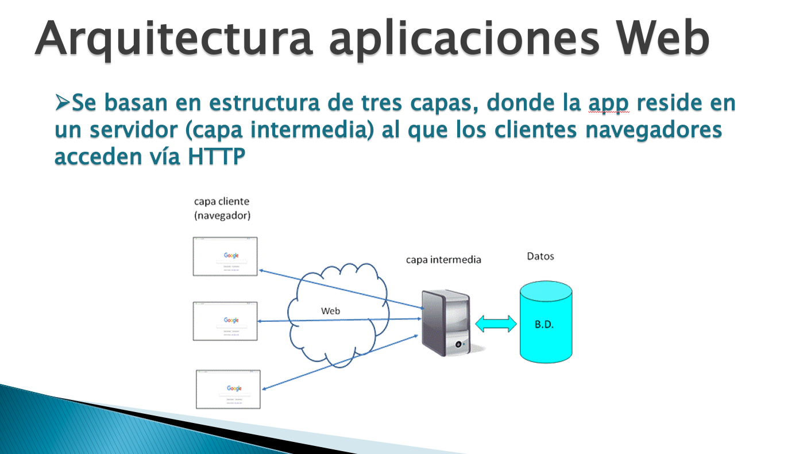
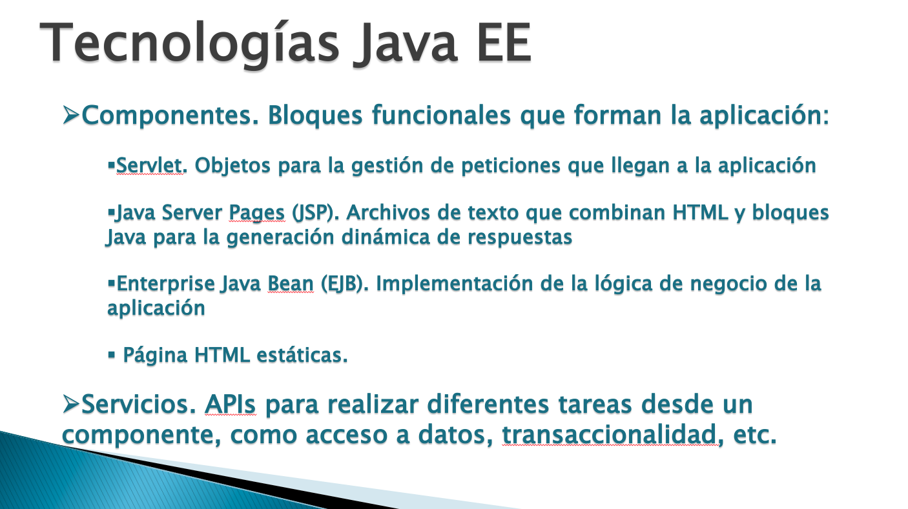
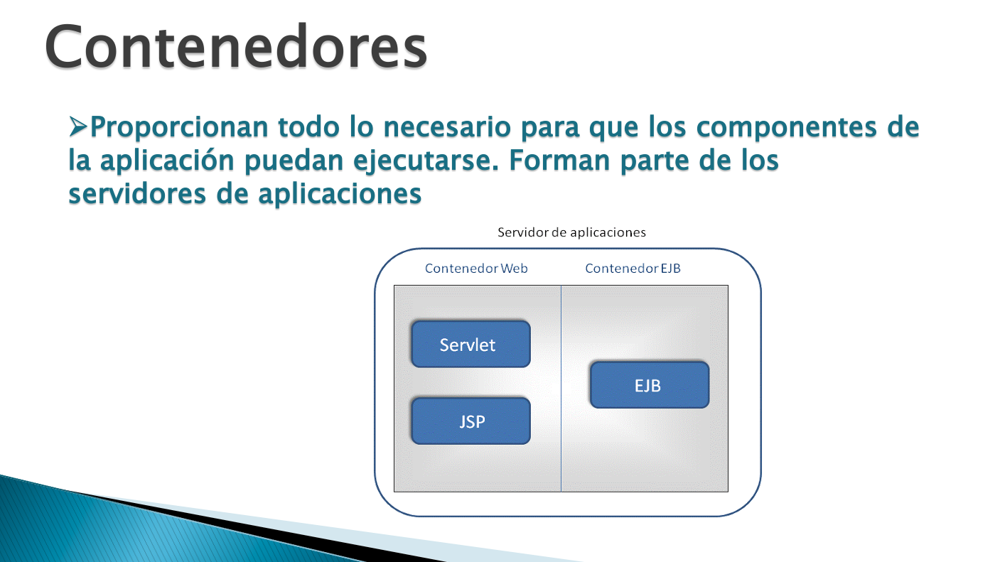
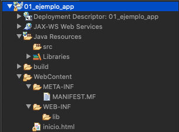
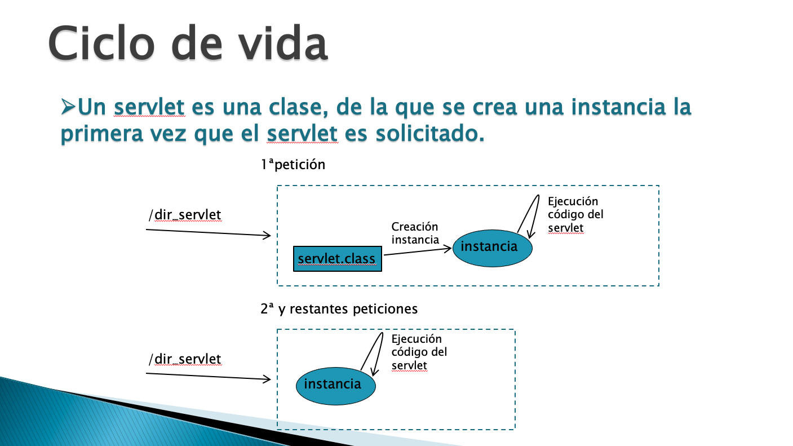
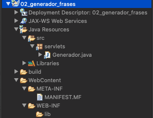
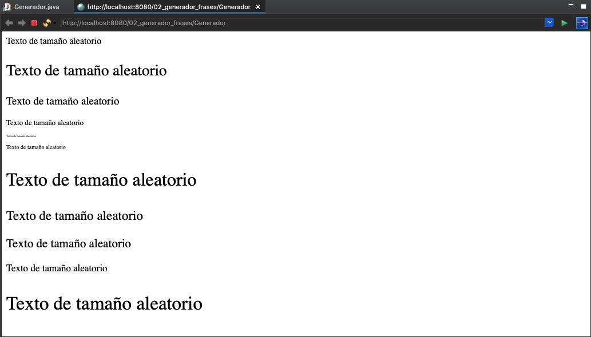
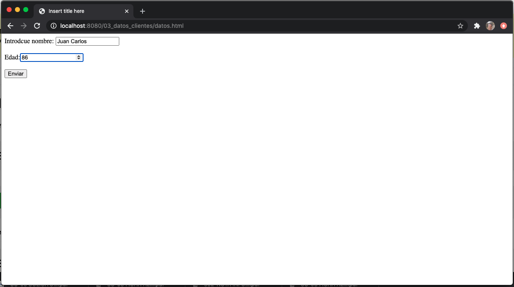
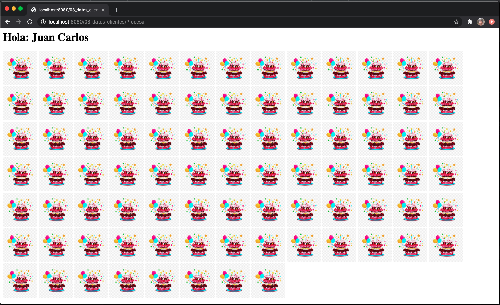

# 20201105 Jueves

CURSO DESARROLLADOR JAVA EE FRONT END MULTIPLATAFORMA

* [592-NOTA INFORMATIVA.pdf](000_592_DESARROLLADOR_JAVA_EE_FRONT_END_MULTIPLATAFORMA/pdfs/592-NOTA%20INFORMATIVA.pdf)

* [592_GUION.pdf](000_592_DESARROLLADOR_JAVA_EE_FRONT_END_MULTIPLATAFORMA/pdfs/592_GUION.pdf)

## Temario Antonio

* Creación de Aplicaciones Web Java EE
* Acceso a datos mediante persistencia (JPA e Hibernate)
* Programación Front End con JavaScript (JQuery)
* Aplicaciones Web con spring
* Creación de Aplicaciones basadas en Servidores REST
* Microservicios con Spring Boot y Cloud
* Acceso a Microservicios desde el Front End (Angular)
* Contenedores de Microservicios en contenedores Dockers y Kubernates

## Software 

* JDK 1.8 y 11 (Ya existe Java 15)
* Eclipse 2020
* Servidores de aplicaciones:
   * Tomcat
   * WebLogic Server
* Bases de Datos:
   * MySQL
   * Mongo DB
   
#### Acceso al Driver

* https://drive.google.com/drive/folders/1F1boUdQEMJWtzizhtl6WXgbh03RMC2Oy?usp=sharing
* https://drive.google.com/drive/folders/1YMQNcEF3TSu-8fQsLMfdFb6YlyRjWswZ?usp=sharing


## ¿Qué es Java EE?









### :computer: Ejemplo `01_ejemplo_app`



`inicio.html`

```html
<!DOCTYPE html>
<html>
<head>
<meta charset="UTF-8">
<title>Insert title here</title>
</head>
<body>
	<h1>Bienvenido a mi página</h1>
	<p slyle="font-size:20px">
	Párrafo tamaño 20 <br/>
	esto en otra línea
	</p>
</body>
</html>
```


## Programación de Servlets





### :computer: Ejemplo `02_generador_frases`



`Generador.java`

```java
package servlets;

import java.io.IOException;
import java.io.PrintWriter;

import javax.servlet.ServletException;
import javax.servlet.annotation.WebServlet;
import javax.servlet.http.HttpServlet;
import javax.servlet.http.HttpServletRequest;
import javax.servlet.http.HttpServletResponse;

/**
 * Servlet implementation class Generador
 */
@WebServlet("/Generador")
public class Generador extends HttpServlet {
	private static final long serialVersionUID = 1L;

	/**
	 * @see HttpServlet#service(HttpServletRequest request, HttpServletResponse response)
	 */
	protected void service(HttpServletRequest request, HttpServletResponse response) throws ServletException, IOException {
		// generar respuesta
		//el tipo de dato que enviaremos como respuesta
		response.setContentType("text/html");
		//construimos la página usando entrada-salida Java
		PrintWriter out = response.getWriter();
		out.println("<html><body>");
		for(int i = 0; i <= 10; i++) {
			int n = (int)(Math.random()*30+5); // aleatorio entre 5 y 35
		    out.println("<p style='font-size:" + + n +  "px'>");
		    out.println("Texto de tamaño aleatorio</p>");
		}
		out.println("</body></html>");
	}

}
```



## Recogida de Parámetros desde un Servlet


### :computer: Ejemplo `03_datos_clientes`


`datos.html`

```html
<!DOCTYPE html>
<html>
<head>
<meta charset="UTF-8">
<title>Insert title here</title>
</head>
<body>
	<form action="Procesar" method="post">
		Introdcue nombre: <input type="text" name="nombre" />
		<br/><br/>
		Edad:<input type="number" name="edad" />
		<br/><br/>
		<input type="submit" value="Enviar" />
	</form>
</body>
</html>
```

`Procesar.java`

```java
package servlets;

import java.io.IOException;
import java.io.PrintWriter;

import javax.servlet.ServletException;
import javax.servlet.annotation.WebServlet;
import javax.servlet.http.HttpServlet;
import javax.servlet.http.HttpServletRequest;
import javax.servlet.http.HttpServletResponse;

@WebServlet("/Procesar")
public class Procesar extends HttpServlet {
	private static final long serialVersionUID = 1L;

	protected void service(HttpServletRequest request, HttpServletResponse response) throws ServletException, IOException {
		
		String nombre = request.getParameter("nombre");
		int edad = Integer.parseInt(request.getParameter("edad"));
		// generar respuesta
		//el tipo de dato que enviaremos como respuesta
		response.setContentType("text/html");
		//construimos la página usando entrada-salida Java
		PrintWriter out = response.getWriter();
		out.println("<html><body>");
		out.println("<h1> Hola: " + nombre + "</h1>");
		for(int i=1; i<= edad; i++) {
			out.println("");
		}
		out.println("</body></html>");
				
	}
}
```



