# 20201106 Viernes

### :computer: Ejemplo `04_buscador`

Vamos a realizar una aplicacíon "Mini Google" que busque ciertos temas y muestre enlaces a direcciones Web relacionadas con lo buscado.

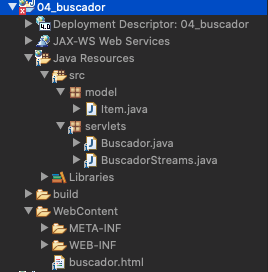

La aplicación va a tener un HTML y un Servlet.

`buscador.html`

```html
<!DOCTYPE html>
<html>
<head>
<meta charset="ISO-8859-1">
<title>Buscador</title>
</head>
<body>
   <div align="center">
      <h1>Buscador</h1>
      <form action="Buscador" method="post">
         Introduce tema de búsqueda:<input type="text" name="tema"/> 
         <input type="submit" value="Buscar"/>
      </form>
   </div>
</body>
</html>
```

`Item.java`

```java
package model;

public class Item {
   private String titulo;
   private String url;
   private String[] seo;
   private String descripcion;
	
   public Item(String titulo, String url, String[] seo, String descripcion) {
      super();
      this.titulo = titulo;
      this.url = url;
      this.seo = seo;
      this.descripcion = descripcion;
   }
	
   public String getTitulo() {
      return titulo;
   }
   public void setTitulo(String titulo) {
      this.titulo = titulo;
   }
   public String getUrl() {
      return url;
   }
   public void setUrl(String url) {
      this.url = url;
   }
   public String[] getSeo() {
      return seo;
   }
   public void setSeo(String[] seo) {
      this.seo = seo;
   }
   public String getDescripcion() {
      return descripcion;
   }
   public void setDescripcion(String descripcion) {
      this.descripcion = descripcion;
   }
	
}
```

`Buscador.java`

```java
package servlets;

import java.io.IOException;
import java.io.PrintWriter;
import java.util.List;

import javax.servlet.ServletException;
import javax.servlet.annotation.WebServlet;
import javax.servlet.http.HttpServlet;
import javax.servlet.http.HttpServletRequest;
import javax.servlet.http.HttpServletResponse;

import model.Item;

/**
 * Servlet implementation class Buscador
 */
@WebServlet("/Buscador")
public class Buscador extends HttpServlet {
	
   private static final long serialVersionUID = 1L;
	
   List<Item> items=List.of(
      new Item("Casa del libro","http://casadellibro.es", new String[]{"libros","lectura","ocio"},"Libros y más cosas"),
      new Item("La web del gamer","http://gamers.es", new String[]{"juegos","ordenadores","ocio"},"Todo sobre video juegos"),
      new Item("My computer","http://computerall.es", new String[]{"informática","ordenadores"},"Ordenadores al mejor precio"),
      new Item("Fnac","http://fnac.es", new String[]{"juegos","ordenadores","libros"},"Bienvenido al mundo del ocio y la cultura"),
      new Item("Todo pelis","http://filmers.es", new String[]{"cine","peliculas","ocio"},"Entra en el mundo del cine"));
      
   protected void service(HttpServletRequest request, HttpServletResponse response) throws ServletException, IOException {
      String tema=request.getParameter("tema");
    
      response.setContentType("text/html");
      PrintWriter out=response.getWriter();
      out.println("<html><body>");
		
      //recorremos todos los item de la lista
      for(Item item:items) {
         //para cada item, recorremos su array de temas
         //y miramos si alguno coincide con el tema recibido
         for(String dato:item.getSeo()) {
            if(dato.equals(tema)) {
               out.println("<h2><a href='"+item.getUrl()+"'>"+item.getTitulo()+"</a><br/>");
            }
         }
      }
      out.println("</body></html>");	
   }
}
```

Al ejecutar la aplicación tenemos 

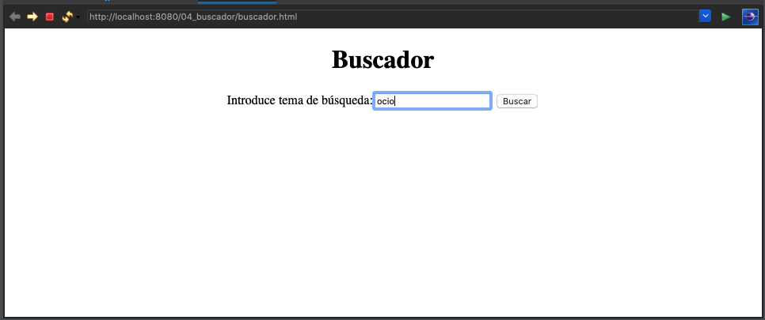
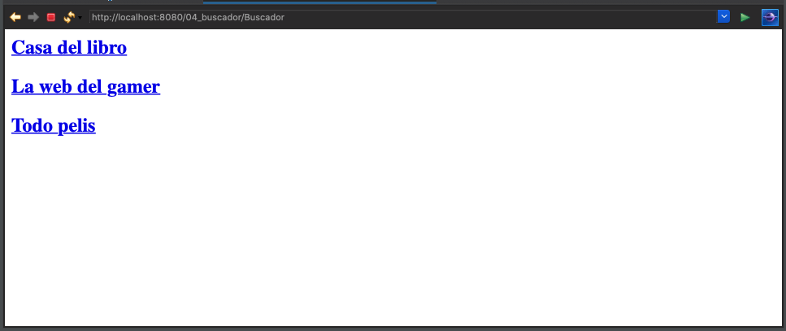


Si métemos algún tema que no existe nos devolverá una pantalla en blanco ya veremos más adelante como solucionar esto.


Existe una forma diferente de hacer la búsqueda usando Streams (debemos cambiar en `buscador.html` el `action="BuscadorStreams"` ):

`BuscadorStreams`

```java
package servlets;

import java.io.IOException;
import java.io.PrintWriter;
import java.util.Arrays;
import java.util.List;

import javax.servlet.ServletException;
import javax.servlet.annotation.WebServlet;
import javax.servlet.http.HttpServlet;
import javax.servlet.http.HttpServletRequest;
import javax.servlet.http.HttpServletResponse;

import model.Item;

/**
 * Servlet implementation class Buscador
 */
@WebServlet("/BuscadorStreams")
public class BuscadorStreams extends HttpServlet {
	
   private static final long serialVersionUID = 1L;
	
      List<Item> items=List.of(
         new Item("Casa del libro","http://casadellibro.es", new String[]{"libros","lectura","ocio"},"Libros y más cosas"),
         new Item("La web del gamer","http://gamers.es", new String[]{"juegos","ordenadores","ocio"},"Todo sobre video juegos"),
         new Item("My computer","http://computerall.es", new String[]{"informática","ordenadores"},"Ordenadores al mejor precio"),
         new Item("Fnac","http://fnac.es", new String[]{"juegos","ordenadores","libros"},"Bienvenido al mundo del ocio y la cultura"),
         new Item("Todo pelis","http://filmers.es", new String[]{"cine","peliculas","ocio"},"Entra en el mundo del cine"));		
			
   protected void service(HttpServletRequest request, HttpServletResponse response) throws ServletException, IOException {
		
      String tema=request.getParameter("tema");
		
      response.setContentType("text/html");
      PrintWriter out=response.getWriter();
      out.println("<html><body>");
		
      //solución utilizando programación funcional
      items.stream()
         .filter(item->Arrays.stream(item.getSeo())
                           .anyMatch(t->t.equals(tema))
         ) //Convierto el array getSeo() en un Stream y a eso le aplico el anyMatch todo eso es lo que estoy filtrando
	 .forEach(item->out.println("<h2><a href='"+item.getUrl()+"'>"+item.getTitulo()+"</a><br/>"));
		
      out.println("</body></html>");
   }

}
```


### :computer: Ejemplo `05_texto`

Vamos a realizar una aplicacíon que pase parámetros mediante la URL.


`opciones.html`

```html
<!DOCTYPE html>
<html>
<head>
<meta charset="UTF-8">
<title>Parámetros por URL</title>
</head>
<body>
   <a href="Texto?size=6">Pequeño</a><br/>
   <a href="Texto?size=3">Medio</a><br/>
   <a href="Texto?size=1">Grande</a><br/>
</body>
</html>
```

`Texto.java`

```java
package servlets;

import java.io.IOException;
import java.io.PrintWriter;

import javax.servlet.ServletException;
import javax.servlet.annotation.WebServlet;
import javax.servlet.http.HttpServlet;
import javax.servlet.http.HttpServletRequest;
import javax.servlet.http.HttpServletResponse;


@WebServlet("/Texto")
public class Texto extends HttpServlet {
   private static final long serialVersionUID = 1L;

   protected void service(HttpServletRequest request, HttpServletResponse response) throws ServletException, IOException {
      String size = request.getParameter("size");

      //construimos la página usando entrada-salida Java
      PrintWriter out = response.getWriter();
      out.println("<html><body>");
      out.println("<h1>Resultados</h1>");
      out.println("<h" + size + ">Esto es un Texto</html>");
      out.println("</body></html>");
   }

}
```

Vamos a probar la apicación.


Según el enlace seleccionado se pinta el texto de un tamaño u otro, observese en el URL es paso del parámetro.

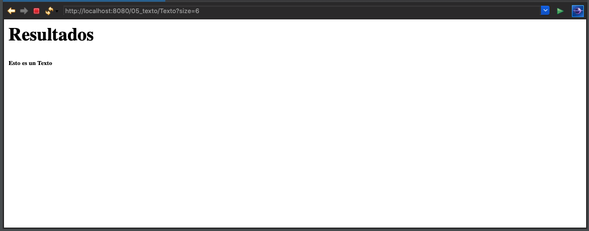


## Transferencia de Peticiones


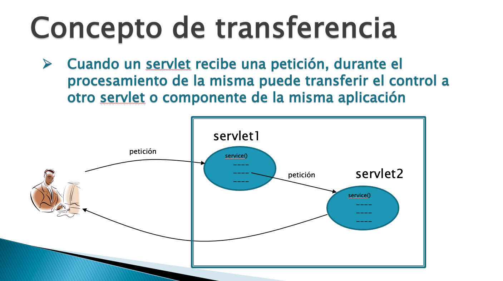


### :computer: Ejemplo `04_buscador`

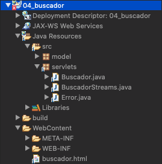

Como vimos en el ejemplo `04_buscador` cuando no localizabamos información de algún tema nos mostraba una pantalla en blanco, vamos a usar la Transferencia de Peticiones para pintar una pantalla cuando no existan datos. Para lograr esto necesitamos modificar el Servlet `Buscador` y añadir un nuevo Servlet `Error`.


`Buscador.java`

```java
package servlets;

import java.io.IOException;
import java.io.PrintWriter;
import java.util.List;

import javax.servlet.ServletException;
import javax.servlet.annotation.WebServlet;
import javax.servlet.http.HttpServlet;
import javax.servlet.http.HttpServletRequest;
import javax.servlet.http.HttpServletResponse;

import model.Item;

/**
 * Servlet implementation class Buscador
 */
@WebServlet("/Buscador")
public class Buscador extends HttpServlet {
	
   private static final long serialVersionUID = 1L;
	
   List<Item> items=List.of(
      new Item("Casa del libro","http://casadellibro.es", new String[]{"libros","lectura","ocio"},"Libros y más cosas"),
      new Item("La web del gamer","http://gamers.es", new String[]{"juegos","ordenadores","ocio"},"Todo sobre video juegos"),
      new Item("My computer","http://computerall.es", new String[]{"informática","ordenadores"},"Ordenadores al mejor precio"),
      new Item("Fnac","http://fnac.es", new String[]{"juegos","ordenadores","libros"},"Bienvenido al mundo del ocio y la cultura"),
      new Item("Todo pelis","http://filmers.es", new String[]{"cine","peliculas","ocio"},"Entra en el mundo del cine"));
      
   protected void service(HttpServletRequest request, HttpServletResponse response) throws ServletException, IOException {
      String tema=request.getParameter("tema");
    
      response.setContentType("text/html");
      PrintWriter out=response.getWriter();
      out.println("<html><body>");
		
      if(comprobar(tema)) {
         //recorremos todos los item de la lista
         for(Item item:items) {
            //para cada item, recorremos su array de temas
            //y miramos si alguno coincide con el tema recibido
            for(String dato:item.getSeo()) {
               if(dato.equals(tema)) {
                  out.println("<h2><a href='"+item.getUrl()+"'>"+item.getTitulo()+"</a><br/>");
               }
            }
         }
         out.println("</body></html>");
      }	else {
         //transferimos el control a otro servlet 
         //encargado de generar una página de error
         RequestDispatcher dispatcher=request.getRequestDispatcher("Error");
         dispatcher.forward(request, response);
      }
   }
	
   private boolean comprobar(String palabra) {
      for(Item item:items) {
         for(String dato:item.getSeo()) {
            if(dato.equals(palabra)) {
               return true;
            }
         }
      }
      return false;
   }

}
```

El nuevo Servlet es `Error`:

```java
package servlets;

import java.io.IOException;
import java.io.PrintWriter;

import javax.servlet.ServletException;
import javax.servlet.annotation.WebServlet;
import javax.servlet.http.HttpServlet;
import javax.servlet.http.HttpServletRequest;
import javax.servlet.http.HttpServletResponse;

@WebServlet("/Error")
public class Error extends HttpServlet {
   private static final long serialVersionUID = 1L;

   protected void service(HttpServletRequest request, HttpServletResponse response) throws ServletException, IOException {
		
      //los parámetros que le llegaron al servlet de origen
      //están disponibles también en el destino
      String tema=request.getParameter("tema");
		
      response.setContentType("text/html");
      PrintWriter out=response.getWriter();
		
      out.println("<html><body>");
      out.println("<h2>No hay entradas para el tema "+tema+"</h2>");
      out.println("<a href='buscador.html'>Volver</a>");
      out.println("</body></html>");
   }

}
```

Al ejecutar la aplicación tenemos 

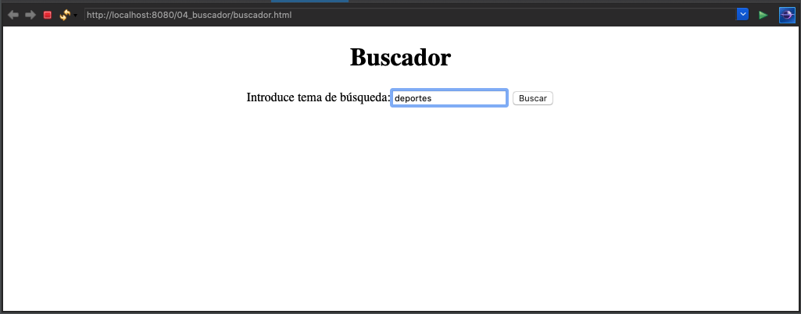
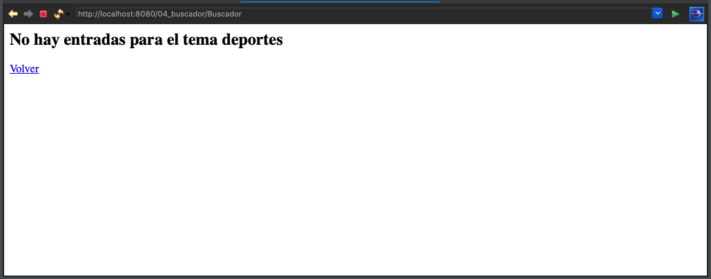


### :computer: Ejemplo `06_buscador_login`

Partiendo del proyecto `04_buscador` vamos a realizar una aplicacíon que permita logearse y si lo hacemos podamos usar el buscador y si no que nos lo indique, el esquema de la aplicación se ve en la imagen.

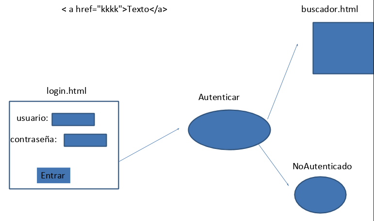

Por lo que vemos en la imagen vamos a necesitar añadir una página `login.html` y dos Servlets el de autenticar `Login` y uno `NoAutenticado` para mostrar una página que indique que no se pudo logear.

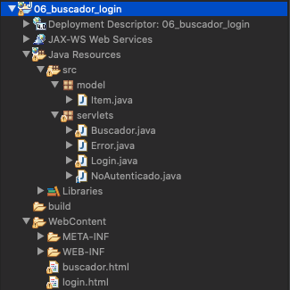

AQUI


``

```html
```


## Mantenimiento de datos en la aplicación


## Atributos de Petición


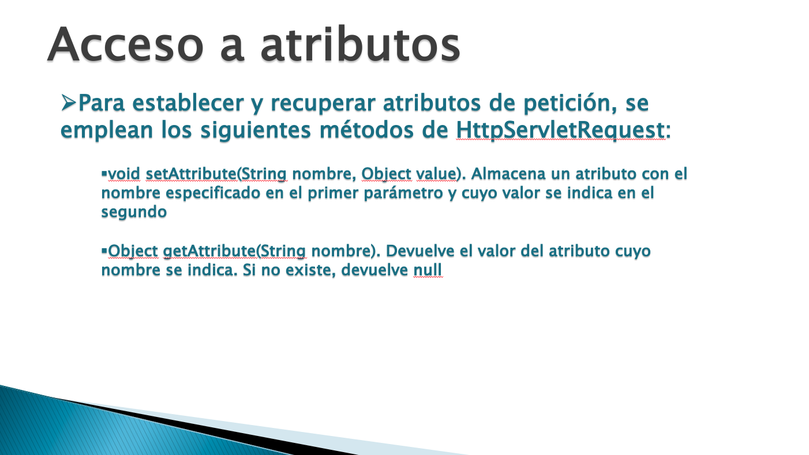

## Atributos de Sesión


## Atributos de Aplicación


## Cookies


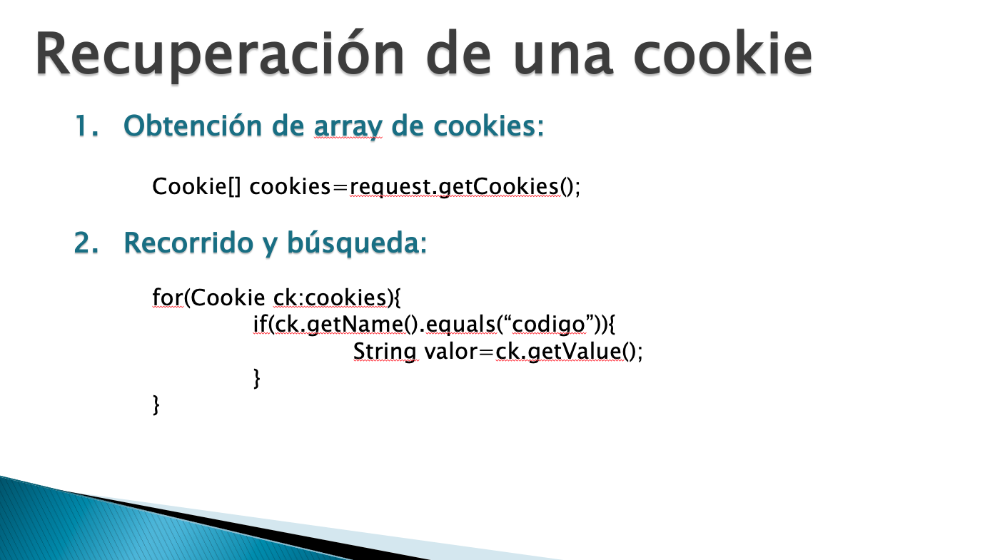

## Eventos de Aplicación 


## Java Server Pages


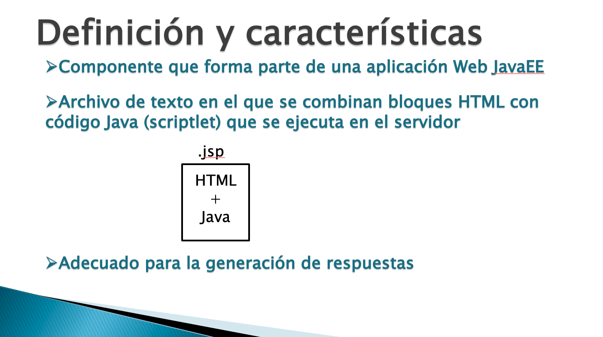


## Componentes de una Página JSP


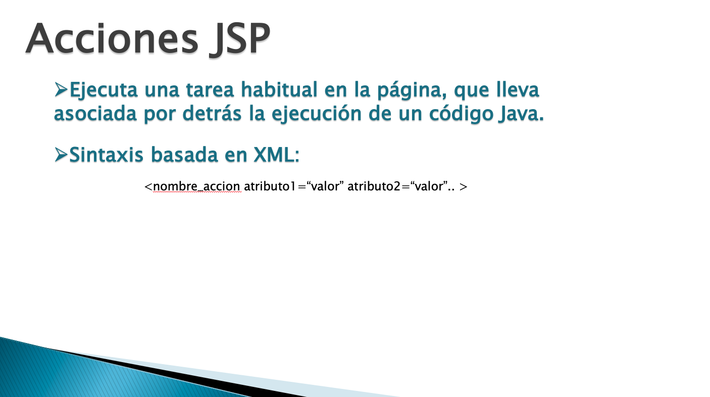

## Directivas JSP


## Acciones Implícitas JSP


## Integración Servlets - JSP


## El Lenguaje de Expresiones EL


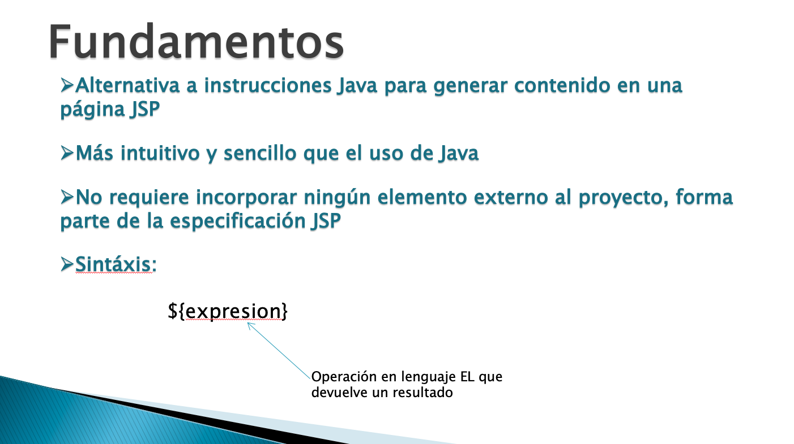

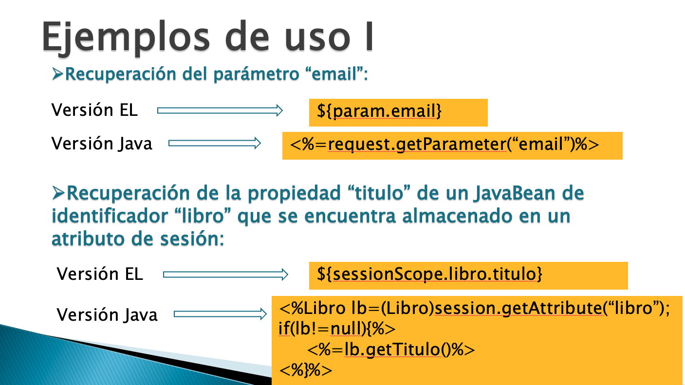


## La Librería de Acciones JSTL


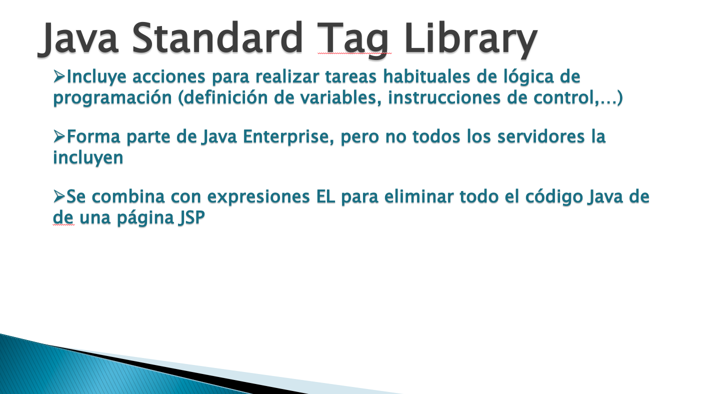
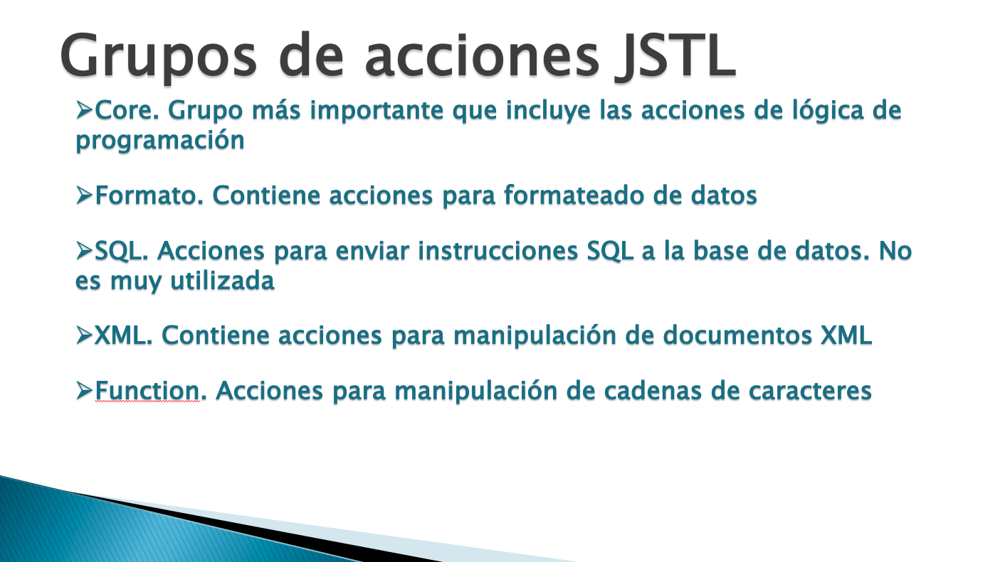


## Principales Acciones JSTL


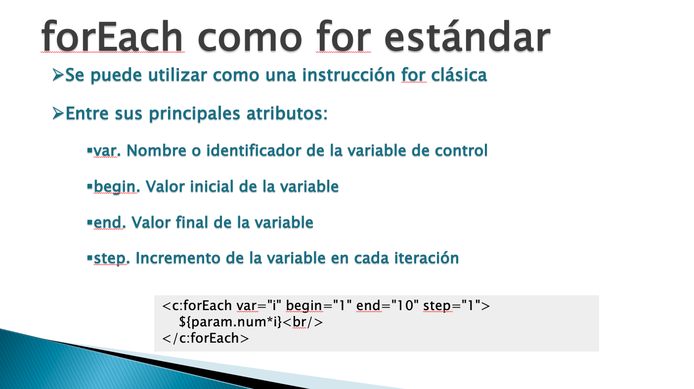
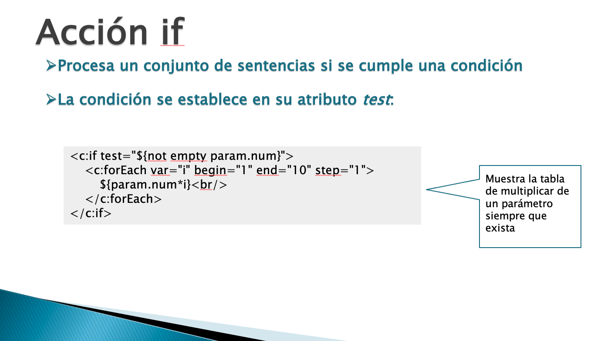


