# 20201106 Viernes

### :computer: Ejemplo `04_buscador`

Vamos a realizar una aplicacíon "Mini Google" que busque ciertos temas y muestre enlaces a direcciones Web relacionadas con lo buscado.


La aplicación va a tener un HTML y un Servlet.

`buscador.html`

```html
<!DOCTYPE html>
<html>
<head>
<meta charset="ISO-8859-1">
<title>Buscador</title>
</head>
<body>
   <div align="center">
      <h1>Buscador</h1>
      <form action="Buscador" method="post">
         Introduce tema de búsqueda:<input type="text" name="tema"/> 
         <input type="submit" value="Buscar"/>
      </form>
   </div>
</body>
</html>
```

`Item.java`

```java
package model;

public class Item {
   private String titulo;
   private String url;
   private String[] seo;
   private String descripcion;
	
   public Item(String titulo, String url, String[] seo, String descripcion) {
      super();
      this.titulo = titulo;
      this.url = url;
      this.seo = seo;
      this.descripcion = descripcion;
   }
	
   public String getTitulo() {
      return titulo;
   }
   public void setTitulo(String titulo) {
      this.titulo = titulo;
   }
   public String getUrl() {
      return url;
   }
   public void setUrl(String url) {
      this.url = url;
   }
   public String[] getSeo() {
      return seo;
   }
   public void setSeo(String[] seo) {
      this.seo = seo;
   }
   public String getDescripcion() {
      return descripcion;
   }
   public void setDescripcion(String descripcion) {
      this.descripcion = descripcion;
   }
	
}
```

`Buscador.java`

```java
package servlets;

import java.io.IOException;
import java.io.PrintWriter;
import java.util.List;

import javax.servlet.ServletException;
import javax.servlet.annotation.WebServlet;
import javax.servlet.http.HttpServlet;
import javax.servlet.http.HttpServletRequest;
import javax.servlet.http.HttpServletResponse;

import model.Item;

/**
 * Servlet implementation class Buscador
 */
@WebServlet("/Buscador")
public class Buscador extends HttpServlet {
	
   private static final long serialVersionUID = 1L;
	
   List<Item> items=List.of(
      new Item("Casa del libro","http://casadellibro.es", new String[]{"libros","lectura","ocio"},"Libros y más cosas"),
      new Item("La web del gamer","http://gamers.es", new String[]{"juegos","ordenadores","ocio"},"Todo sobre video juegos"),
      new Item("My computer","http://computerall.es", new String[]{"informática","ordenadores"},"Ordenadores al mejor precio"),
      new Item("Fnac","http://fnac.es", new String[]{"juegos","ordenadores","libros"},"Bienvenido al mundo del ocio y la cultura"),
      new Item("Todo pelis","http://filmers.es", new String[]{"cine","peliculas","ocio"},"Entra en el mundo del cine"));
      
   protected void service(HttpServletRequest request, HttpServletResponse response) throws ServletException, IOException {
      String tema=request.getParameter("tema");
    
      response.setContentType("text/html");
      PrintWriter out=response.getWriter();
      out.println("<html><body>");
		
      //recorremos todos los item de la lista
      for(Item item:items) {
         //para cada item, recorremos su array de temas
         //y miramos si alguno coincide con el tema recibido
         for(String dato:item.getSeo()) {
            if(dato.equals(tema)) {
               out.println("<h2><a href='"+item.getUrl()+"'>"+item.getTitulo()+"</a><br/>");
            }
         }
      }
      out.println("</body></html>");	
   }
}
```

Al ejecutar la aplicación tenemos 


Si métemos algún tema que no existe nos devolverá una pantalla en blanco ya veremos más adelante como solucionar esto.


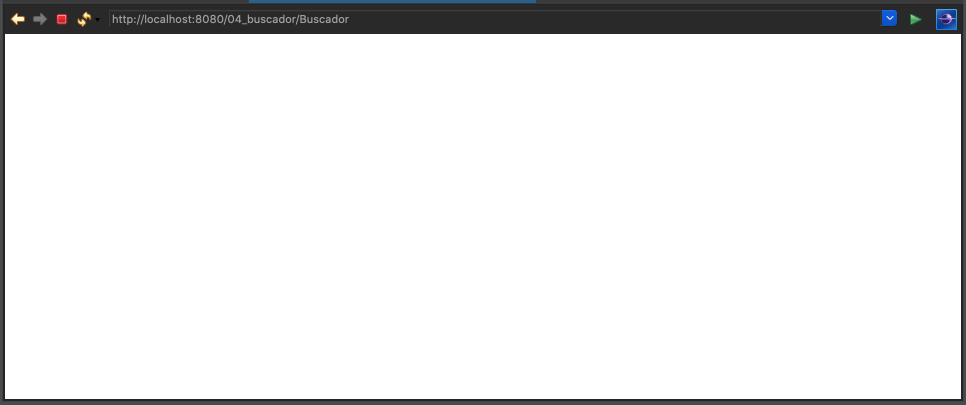


Existe una forma diferente de hacer la búsqueda usando Streams (debemos cambiar en `buscador.html` el `action="BuscadorStreams"` ):

`BuscadorStreams`

```java
package servlets;

import java.io.IOException;
import java.io.PrintWriter;
import java.util.Arrays;
import java.util.List;

import javax.servlet.ServletException;
import javax.servlet.annotation.WebServlet;
import javax.servlet.http.HttpServlet;
import javax.servlet.http.HttpServletRequest;
import javax.servlet.http.HttpServletResponse;

import model.Item;

/**
 * Servlet implementation class Buscador
 */
@WebServlet("/BuscadorStreams")
public class BuscadorStreams extends HttpServlet {
	
   private static final long serialVersionUID = 1L;
	
      List<Item> items=List.of(
         new Item("Casa del libro","http://casadellibro.es", new String[]{"libros","lectura","ocio"},"Libros y más cosas"),
         new Item("La web del gamer","http://gamers.es", new String[]{"juegos","ordenadores","ocio"},"Todo sobre video juegos"),
         new Item("My computer","http://computerall.es", new String[]{"informática","ordenadores"},"Ordenadores al mejor precio"),
         new Item("Fnac","http://fnac.es", new String[]{"juegos","ordenadores","libros"},"Bienvenido al mundo del ocio y la cultura"),
         new Item("Todo pelis","http://filmers.es", new String[]{"cine","peliculas","ocio"},"Entra en el mundo del cine"));		
			
   protected void service(HttpServletRequest request, HttpServletResponse response) throws ServletException, IOException {
		
      String tema=request.getParameter("tema");
		
      response.setContentType("text/html");
      PrintWriter out=response.getWriter();
      out.println("<html><body>");
		
      //solución utilizando programación funcional
      items.stream()
         .filter(item->Arrays.stream(item.getSeo())
                           .anyMatch(t->t.equals(tema))
         ) //Convierto el array getSeo() en un Stream y a eso le aplico el anyMatch todo eso es lo que estoy filtrando
	 .forEach(item->out.println("<h2><a href='"+item.getUrl()+"'>"+item.getTitulo()+"</a><br/>"));
		
      out.println("</body></html>");
   }

}
```


### :computer: Ejemplo `05_texto`

Vamos a realizar una aplicacíon que pase parámetros mediante la URL.

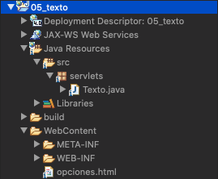


`opciones.html`

```html
<!DOCTYPE html>
<html>
<head>
<meta charset="UTF-8">
<title>Parámetros por URL</title>
</head>
<body>
   <a href="Texto?size=6">Pequeño</a><br/>
   <a href="Texto?size=3">Medio</a><br/>
   <a href="Texto?size=1">Grande</a><br/>
</body>
</html>
```

`Texto.java`

```java
package servlets;

import java.io.IOException;
import java.io.PrintWriter;

import javax.servlet.ServletException;
import javax.servlet.annotation.WebServlet;
import javax.servlet.http.HttpServlet;
import javax.servlet.http.HttpServletRequest;
import javax.servlet.http.HttpServletResponse;


@WebServlet("/Texto")
public class Texto extends HttpServlet {
   private static final long serialVersionUID = 1L;

   protected void service(HttpServletRequest request, HttpServletResponse response) throws ServletException, IOException {
      String size = request.getParameter("size");

      //construimos la página usando entrada-salida Java
      PrintWriter out = response.getWriter();
      out.println("<html><body>");
      out.println("<h1>Resultados</h1>");
      out.println("<h" + size + ">Esto es un Texto</html>");
      out.println("</body></html>");
   }

}
```

Vamos a probar la apicación.

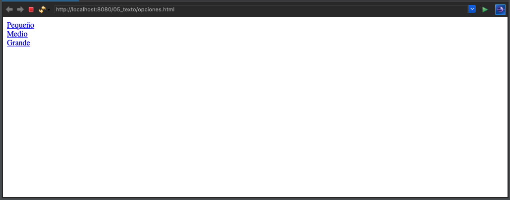

Según el enlace seleccionado se pinta el texto de un tamaño u otro, observese en el URL es paso del parámetro.


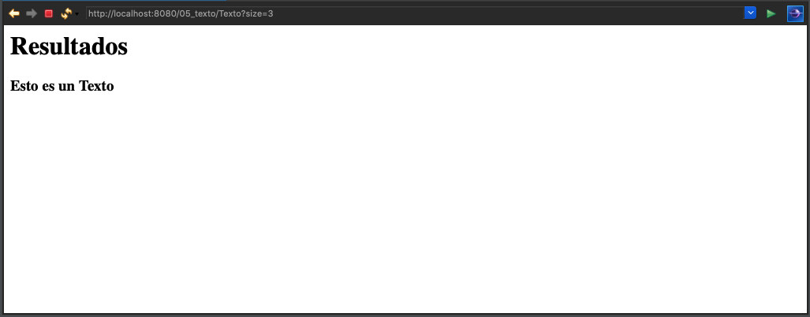
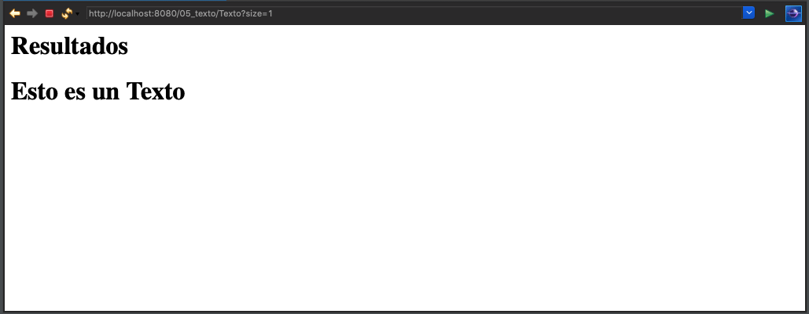

## Transferencia de Peticiones


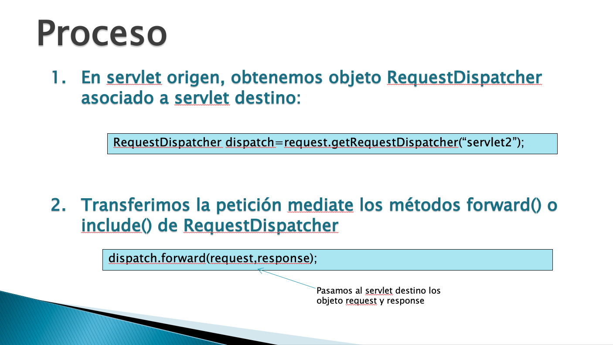


### :computer: Ejemplo `04_buscador`


Como vimos en el ejemplo `04_buscador` cuando no localizabamos información de algún tema nos mostraba una pantalla en blanco, vamos a usar la Transferencia de Peticiones para pintar una pantalla cuando no existan datos. Para lograr esto necesitamos modificar el Servlet `Buscador` y añadir un nuevo Servlet `Error`.


`Buscador.java`

```java
package servlets;

import java.io.IOException;
import java.io.PrintWriter;
import java.util.List;

import javax.servlet.ServletException;
import javax.servlet.annotation.WebServlet;
import javax.servlet.http.HttpServlet;
import javax.servlet.http.HttpServletRequest;
import javax.servlet.http.HttpServletResponse;

import model.Item;

@WebServlet("/Buscador")
public class Buscador extends HttpServlet {
	
   private static final long serialVersionUID = 1L;
	
   List<Item> items=List.of(
      new Item("Casa del libro","http://casadellibro.es", new String[]{"libros","lectura","ocio"},"Libros y más cosas"),
      new Item("La web del gamer","http://gamers.es", new String[]{"juegos","ordenadores","ocio"},"Todo sobre video juegos"),
      new Item("My computer","http://computerall.es", new String[]{"informática","ordenadores"},"Ordenadores al mejor precio"),
      new Item("Fnac","http://fnac.es", new String[]{"juegos","ordenadores","libros"},"Bienvenido al mundo del ocio y la cultura"),
      new Item("Todo pelis","http://filmers.es", new String[]{"cine","peliculas","ocio"},"Entra en el mundo del cine"));
      
   protected void service(HttpServletRequest request, HttpServletResponse response) throws ServletException, IOException {
      String tema=request.getParameter("tema");
    
      response.setContentType("text/html");
      PrintWriter out=response.getWriter();
      out.println("<html><body>");
		
      if(comprobar(tema)) {
         //recorremos todos los item de la lista
         for(Item item:items) {
            //para cada item, recorremos su array de temas
            //y miramos si alguno coincide con el tema recibido
            for(String dato:item.getSeo()) {
               if(dato.equals(tema)) {
                  out.println("<h2><a href='"+item.getUrl()+"'>"+item.getTitulo()+"</a><br/>");
               }
            }
         }
         out.println("</body></html>");
      }	else {
         //transferimos el control a otro servlet 
         //encargado de generar una página de error
         RequestDispatcher dispatcher=request.getRequestDispatcher("Error");
         dispatcher.forward(request, response);
      }
   }
	
   private boolean comprobar(String palabra) {
      for(Item item:items) {
         for(String dato:item.getSeo()) {
            if(dato.equals(palabra)) {
               return true;
            }
         }
      }
      return false;
   }

}
```

El nuevo Servlet es `Error`:

```java
package servlets;

import java.io.IOException;
import java.io.PrintWriter;

import javax.servlet.ServletException;
import javax.servlet.annotation.WebServlet;
import javax.servlet.http.HttpServlet;
import javax.servlet.http.HttpServletRequest;
import javax.servlet.http.HttpServletResponse;

@WebServlet("/Error")
public class Error extends HttpServlet {
   private static final long serialVersionUID = 1L;

   protected void service(HttpServletRequest request, HttpServletResponse response) throws ServletException, IOException {
		
      //los parámetros que le llegaron al servlet de origen
      //están disponibles también en el destino
      String tema=request.getParameter("tema");
		
      response.setContentType("text/html");
      PrintWriter out=response.getWriter();
		
      out.println("<html><body>");
      out.println("<h2>No hay entradas para el tema "+tema+"</h2>");
      out.println("<a href='buscador.html'>Volver</a>");
      out.println("</body></html>");
   }

}
```

Al ejecutar la aplicación tenemos 


### :computer: Ejemplo `06_buscador_login`

Partiendo del proyecto `04_buscador` vamos a realizar una aplicacíon que permita logearse y si lo hacemos podamos usar el buscador y si no que nos lo indique, el esquema de la aplicación se ve en la imagen.


Por lo que vemos en la imagen vamos a necesitar añadir una página `login.html` y dos Servlets el de autenticar `Login` y uno `NoAutenticado` para mostrar una página que indique que no se pudo logear.


`login.html`

```html
<!DOCTYPE html>
<html>
<head>
<meta charset="ISO-8859-1">
<title>Insert title here</title>
</head>
<body>
   <div align="center">
      <h1>Página de autenticación</h1>
      <form action="Login" method="post">
         Usuario:<input type="text" name="usuario"/><br/><br/>
         Contraseña:<input type="password" name="password"/><br/><br/>
         <input type="submit" value="Entrar"/>
      </form>
   </div>
</body>
</html>
```

Servlet `Login`

```java
package servlets;

import java.io.IOException;

import javax.servlet.RequestDispatcher;
import javax.servlet.ServletException;
import javax.servlet.annotation.WebServlet;
import javax.servlet.http.HttpServlet;
import javax.servlet.http.HttpServletRequest;
import javax.servlet.http.HttpServletResponse;

@WebServlet("/Login")
public class Login extends HttpServlet {
	
   private static final long serialVersionUID = 1L;
   private static final String user="admin";
   private static final String pass="admin";
	
   protected void service(HttpServletRequest request, HttpServletResponse response) throws ServletException, IOException {
      String usuario=request.getParameter("usuario");
      String password=request.getParameter("password");
		
      RequestDispatcher dispatcher;
		
      if(usuario.equals(user)&&password.equals(pass)) {
         dispatcher=request.getRequestDispatcher("buscador.html");
      } else {
         dispatcher=request.getRequestDispatcher("NoAutenticado");
      }
      dispatcher.forward(request, response);
   }
}
```

Observe como con el `dispatcher` podemos llamar tanto a otro Servet o a una página HTML o JSP.

Servlet `NoAutenticado`

```java
package servlets;

import java.io.IOException;
import java.io.PrintWriter;

import javax.servlet.ServletException;
import javax.servlet.annotation.WebServlet;
import javax.servlet.http.HttpServlet;
import javax.servlet.http.HttpServletRequest;
import javax.servlet.http.HttpServletResponse;

@WebServlet("/NoAutenticado")
public class NoAutenticado extends HttpServlet {
   private static final long serialVersionUID = 1L;

   protected void service(HttpServletRequest request, HttpServletResponse response) throws ServletException, IOException {
		
      //los parámetros que le llegaron al servlet de origen
      //están disponibles tambián en el destino
      String user=request.getParameter("usuario");
		
      response.setContentType("text/html");
      response.setCharacterEncoding("UTF-8");
		
      PrintWriter out=response.getWriter();
		
      out.println("<html><body>");
      out.println("<h2>El usuario " + user + " no está autenticado</h2>");
      out.println("<a href='login.html'>Volver</a>");
      out.println("</body></html>");
   }
}
```

Si probamos la aplicación tenemos:

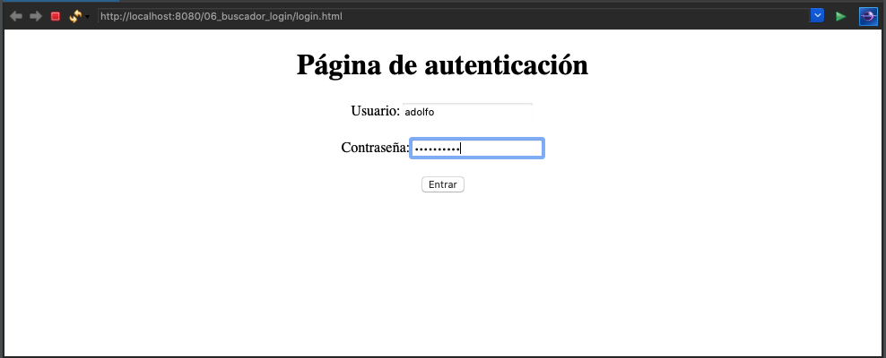
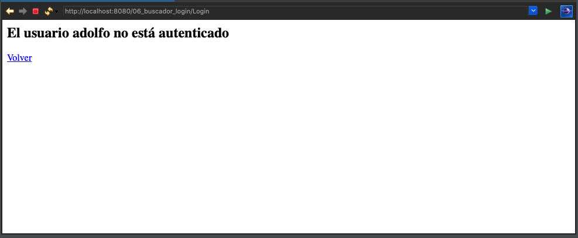

Si ingresamos datos no válidos nos lo indica.


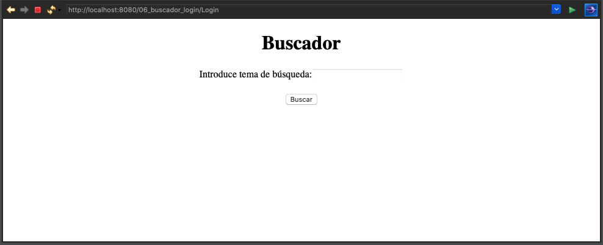

Si ingresamos datos correctos nos permite acceder al Buscador.

## Java Server Pages


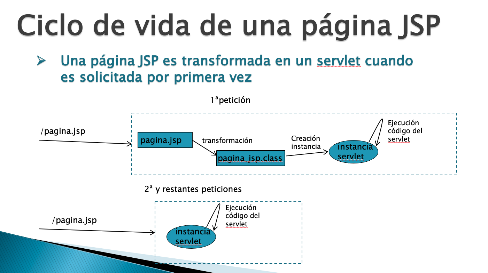

### :computer: Ejemplo `07_generador_frase_jsp`

Como primer ejemplo de JSPs vamos a rehacer el ejemplo `02_generador_frase` que hicimos con Servlets haciendolo ahora con JSPs.

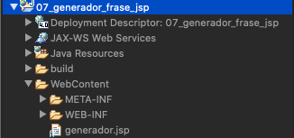

En nuestro proyecto solo tenemos un archivo JSP.

`generador.html`

```html
<%@ page language="java" contentType="text/html; charset=UTF-8"
    pageEncoding="UTF-8"%>
<!DOCTYPE html>
<html>
<head>
<meta charset="UTF-8">
<title>Primer JSP</title>
</head>
<body>
   <%for(int i=0; i<=10;i++){
      int n = (int)(Math.random()*30+5);%>
      <p style="font-size:<%=n%>px">
         Texto de tamaño aleatorio
      </p>
   <% }%>
</body>
</html>
```

Al probar la aplicación el resultado es el mismo que el que hicimos con los Servlets.

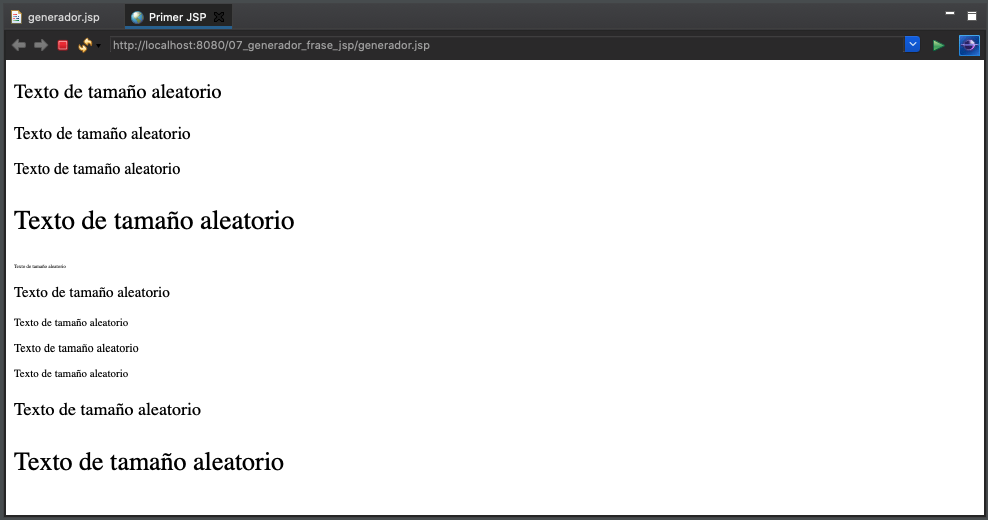

## Mantenimiento de datos en la aplicación


## Atributos de Petición


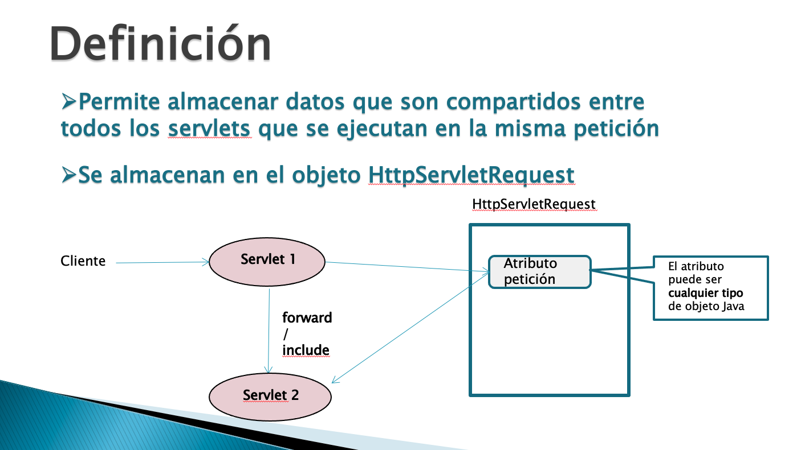


### :computer: Ejemplo `08_buscador_servlet_jsp`

Basandonos en el proyecto `06_buscador_login` hecho con Servlets lo vamos a rehacer con JSP para reemplazar los Servlets que regresaban HTML. Si analizamos el proyecto `06_buscador_login` tenemos tres Servlets que pintan HTML:

* `Buscador`
* `Error`
* `NoAutenticado`

Los Servlets `Error` y `NoAutenticado` pintan HTML por lo que podemos sustituilos por los JSPs `error.jsp`
y `noautenticado.jsp` y eliminaremos los Servlets, en el caso del Servlet `Buscador` además de pintar HTML tiene lógica Java por lo que este Servlet lo vamos a conservar pero además vamos a crear el JSP `resultado.jsp` para pasar del Servlet `Buscador` el HTML a `resultado.jsp`.  

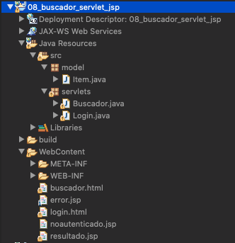

Los cambios hechos son los siguientes:

`Buscador`

```java
package servlets;

import java.io.IOException;
import java.util.List;

import javax.servlet.RequestDispatcher;
import javax.servlet.ServletException;
import javax.servlet.annotation.WebServlet;
import javax.servlet.http.HttpServlet;
import javax.servlet.http.HttpServletRequest;
import javax.servlet.http.HttpServletResponse;

import model.Item;

@WebServlet("/Buscador")
public class Buscador extends HttpServlet {
	
   private static final long serialVersionUID = 1L;
	
   List<Item> items=List.of(
      new Item("Casa del libro","http://casadellibro.es", new String[]{"libros","lectura","ocio"},"Libros y más cosas"),
      new Item("La web del gamer","http://gamers.es", new String[]{"juegos","ordenadores","ocio"},"Todo sobre video juegos"),
      new Item("My computer","http://computerall.es", new String[]{"informática","ordenadores"},"Ordenadores al mejor precio"),
      new Item("Fnac","http://fnac.es", new String[]{"juegos","ordenadores","libros"},"Bienvenido al mundo del ocio y la cultura"),
      new Item("Todo pelis","http://filmers.es", new String[]{"cine","peliculas","ocio"},"Entra en el mundo del cine"));
	
   protected void service(HttpServletRequest request, HttpServletResponse response) throws ServletException, IOException {
		
      String tema=request.getParameter("tema");
      RequestDispatcher dispatcher;
		
      if(comprobar(tema)) {			
         //guardamos en un atributo de petición
         //la lista de items
         request.setAttribute("lista", items);	
         //transferimos el control a una página JSP
         //que genere la lista de direcciones
         dispatcher=request.getRequestDispatcher("resultado.jsp");			
      } else {
         //transferimos el control a otro servlet 
         //encargado de generar una página de error
         dispatcher=request.getRequestDispatcher("error.jsp");		
      }
      dispatcher.forward(request, response);
   }
	
   private boolean comprobar(String palabra) {
      for(Item item:items) {
         for(String dato:item.getSeo()) {
            if(dato.equals(palabra)) {
               return true;
            }
         }
      }
      return false;
   }

}
```

Los principales cambios en este Servlet es que hemos quitado lo que pintaba los resultados desde el Servlet y lo hemos sustituido para hacer un `fordward` a `resultado.jsp` que será el encargado de pintar los resultados pero es necesesario pasarle los datos para que lo pueda hacer, esto lo logramos creando un atributo de petición `request.setAttribute("lista", items);` de esta manera `resultado.jsp` puede recuperar el atributo y pintar los resultados.

Por otro lado en lugar de hacer el `fordward` al Servlet `Error` y lo hemos cambiado a un `fordward` al JSP `error.jsp`. Vamos a ver el código de estos dos JSPs.

`resultados.jsp`

```html
<%@ page language="java" contentType="text/html; charset=ISO-8859-1"
    pageEncoding="ISO-8859-1" import="model.Item,java.util.List"%>
<!DOCTYPE html>
<html>
<head>
<meta charset="ISO-8859-1">
<title>Temas</title>
</head>
<body>
   <h1>Direcciones encontradas</h1>
   <%List<Item> items=(List<Item>)request.getAttribute("lista"); 
   String tema=request.getParameter("tema");
   for(Item item:items){
      for(String datos:item.getSeo()){
         if(datos.equals(tema)){%>
            <a href="<%=item.getUrl()%>"><%=item.getTitulo()%></a><br/>
         <%}
      }
   }%>
   <br/><br/>
   <a href="buscador.html">Volver</a>
</body>
</html>
```

Como podemos observar recuperamos el atributo `lista` con `request.getAttribute("lista")`. Es importante decir que `request.getAttribute(...)` **SIEMPRE RETORNA UN OBJETO por lo que es necesario hacer un casting para recuperar el valor que contenga según sea el caso**. Además de esto hemos usado la directiva `import` para importan las clases que necesitamos en este caso `import="model.Item,java.util.List"`.

`noautenticado.jsp`

```html
<%@ page language="java" contentType="text/html; charset=ISO-8859-1"
    pageEncoding="ISO-8859-1"%>
<!DOCTYPE html>
<html>
<head>
<meta charset="ISO-8859-1">
<title>No autenticado</title>
</head>
<body>
   <h2>El usuario <%=request.getParameter("usuario") %> no está autenticado</h2>
   <a href="login.html">Volver</a>
</body>
</html>
```

Este JSP reemplaza al Servlet `NoAutenticado`

`error.jsp`

```html
<%@ page language="java" contentType="text/html; charset=ISO-8859-1"
    pageEncoding="ISO-8859-1"%>
<!DOCTYPE html>
<html>
<head>
<meta charset="ISO-8859-1">
<title>Sin Resultados</title>
</head>
<body>
   <h2>No hay entradas para el tema <%=request.getParameter("tema") %></h2>
   <a href="buscador.html">Volver</a>
</body>
</html>
```

Este JSP reemplaza al Servlet `Error`.

Si probamos la aplicación debe funcionar exactamente igual, vamos a probarlo.

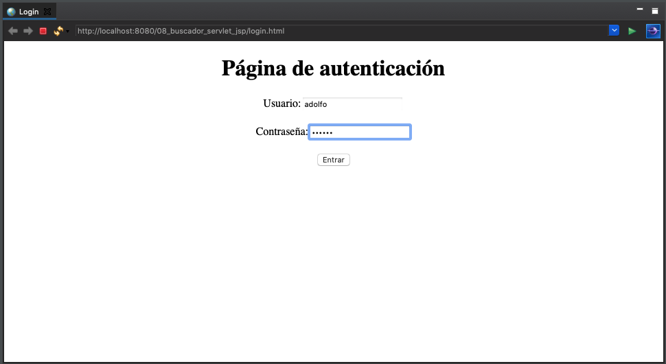
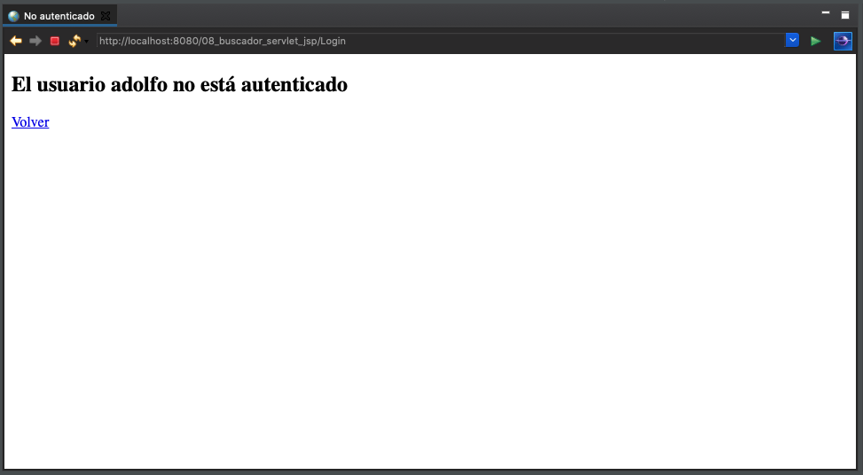

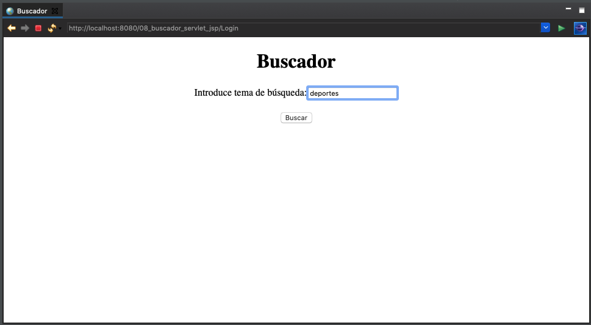


La aplicación funciona exactamente igual usando Servlets y JSPs.

## Atributos de Sesión


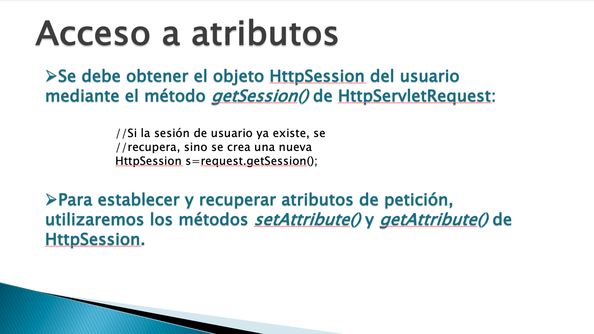


## Componentes de una Página JSP


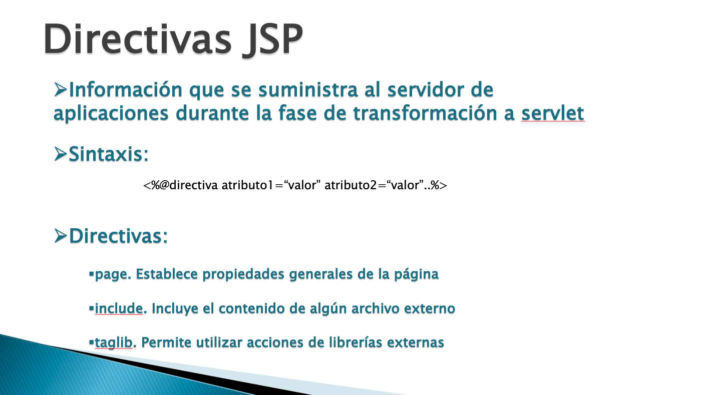


## Directivas JSP


### :computer: Ejemplo `09_buscador_sesion`


Basandonos en el proyecto `08_buscador_servlet_jsp` vamos a crear `09_buscador_sesion` donde vamos a usar un atributo de sesión para que nos pinte en la parte superior el nombre del usuario en cualquier página que estemos una vez que nos hayamos logeado, como esto va a estar en casí todas las páginas usaremos la directiva `include` para tener esa información en un JSP que incluiremos en otras donde lo necesitemos. Además de esto vamos a ver como establecer el tiempo de default de la sesión y una opción para cerrar la sesión.

Los cambios que tenemos que hacer los tenemos a continuación:

`Login`

```java
package servlets;

import java.io.IOException;

import javax.servlet.RequestDispatcher;
import javax.servlet.ServletException;
import javax.servlet.annotation.WebServlet;
import javax.servlet.http.HttpServlet;
import javax.servlet.http.HttpServletRequest;
import javax.servlet.http.HttpServletResponse;
import javax.servlet.http.HttpSession;

@WebServlet("/Login")
public class Login extends HttpServlet {

   private static final long serialVersionUID = 1L;
   private static final String user="admin";
   private static final String pass="admin";
	
   protected void service(HttpServletRequest request, HttpServletResponse response) throws ServletException, IOException {
		
      String usuario=request.getParameter("usuario");
      String password=request.getParameter("password");
		
      RequestDispatcher dispatcher;
		
      if(usuario.equals(user)&&password.equals(pass)) {
         //guardamos el usuario en un atributo de sesión
         //para que sea recordado durante toda su navegación
         HttpSession sesion=request.getSession();
         sesion.setAttribute("user", usuario);
			
         //transferimos petición al buscador
         dispatcher=request.getRequestDispatcher("buscador.jsp");
      } else {
         dispatcher=request.getRequestDispatcher("noautenticado.jsp");
      }
      dispatcher.forward(request, response);
   }
}
```

En el Servlet `Login` recuperamos las sesión apartir del `request` con `HttpSession sesion=request.getSession();` y una vez que la tenemos almacenamos el atributo de usuario con `sesion.setAttribute("user", usuario);`. De esta manera cada Cliente de la aplicación contará con un atributo de sesión con el nombre de usuario.

`comun.jsp`

```
Hola:<%=session.getAttribute("user") %><br/>
<a href="Desconexion">Cerrar sesión</a>
```

Para recuperar el atributo de sesión usamos el *objeto implícito `session`* para recuperarlo. ¿Por que aquí no fue necesario hacer el Casting a un String?.

Además de poner el nombre del usuario estamos poniendo un enlace al Servlet `Desconexion` para cerrar la sesíon.

Este código lo estamos colocando en un JSP independiente que incluiremos en otros JSP donde queramos que pintemos esta información.


`buscador.jsp`

```html
<!DOCTYPE html>
<html>
<head>
<meta charset="ISO-8859-1">
<title>Buscador</title>
</head>
<body>
   <%@include file="comun.jsp"%>
   <div align="center">
      <h1>Buscador</h1>
      <form action="Buscador" method="post">
         Introduce tema de búsqueda:<input type="text" name="tema"/><br/><br/>
         <input type="submit" value="Buscar"/>
      </form>
   </div>
</body>
</html>
```

Aquí vemos como incluimos el JSP `comun.jsp` dentro del JSP `buscador.jsp` usando la directiva `@include` con `<%@include file="comun.jsp"%>`. Lo mismo tenemos que hacer en los JSPs `resultado.jsp` y `erro.jsp`.

Vamos a ver el Servlet `Desconexion` que nos va a servir cerrar la sesión al pusar el enlace `Cerrar Sesión`.

`Desconexion`

```java
package servlets;

import java.io.IOException;

import javax.servlet.ServletException;
import javax.servlet.annotation.WebServlet;
import javax.servlet.http.HttpServlet;
import javax.servlet.http.HttpServletRequest;
import javax.servlet.http.HttpServletResponse;
import javax.servlet.http.HttpSession;

@WebServlet("/Desconexion")
public class Desconexion extends HttpServlet {
   private static final long serialVersionUID = 1L;

   protected void service(HttpServletRequest request, HttpServletResponse response) throws ServletException, IOException {
      HttpSession sesion=request.getSession();
      sesion.invalidate();
      request.getRequestDispatcher("login.html").forward(request, response);
   }
}
```

Con la sentencia `sesion.invalidate();` cerramos la sesión.

Por otro lado la sesión tiene un tiempo determinado de duración normalmente 30 minutos, este dato lo establece el Servidor de Aplicaciones pero si queremos cambiar este valor lo podemos hacer estableciendo este valor en el archivo `web.xml` el cual no habíamos usado hasta ahora su contenido es el siguiente:

`web.xml`

```html
<?xml version="1.0" encoding="UTF-8"?>
<web-app xmlns:xsi="http://www.w3.org/2001/XMLSchema-instance" xmlns="http://xmlns.jcp.org/xml/ns/javaee" xsi:schemaLocation="http://xmlns.jcp.org/xml/ns/javaee http://xmlns.jcp.org/xml/ns/javaee/web-app_4_0.xsd" version="4.0">
  <display-name>09_buscador_sesion</display-name>
  <welcome-file-list>
    <welcome-file>login.jsp</welcome-file>
  </welcome-file-list>
  <session-config>
  	<session-timeout>1</session-timeout>
  </session-config>
</web-app>
```

Con la etiqueta `<session-timeout>1</session-timeout>` establecemos el valor de duración de la sesión en este caso 1 minuto. También establecemos la página inicial en este caso `login.jsp`.

Vamos a probar la aplicación al entrar a la aplicación todas las pantallas nos muestran en la cabecera el nombre del usuario y el link para cerrar la sesión.

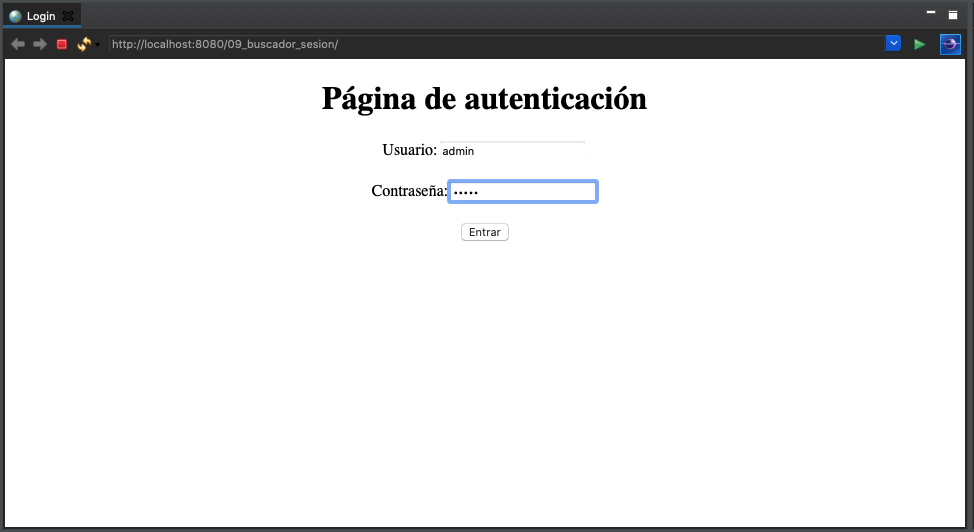
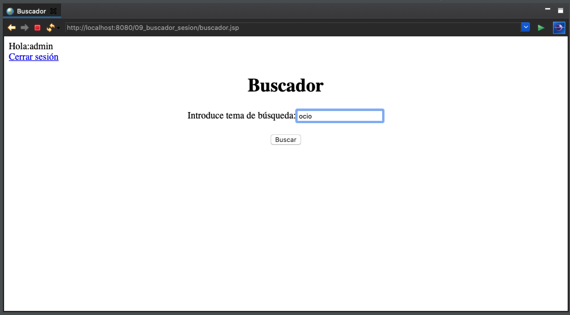
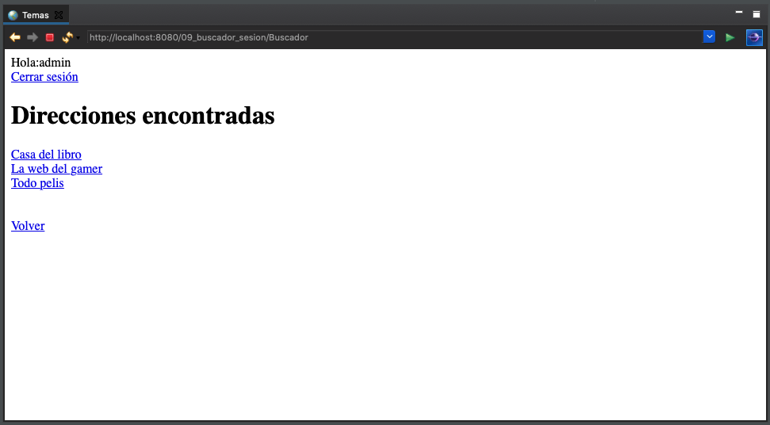
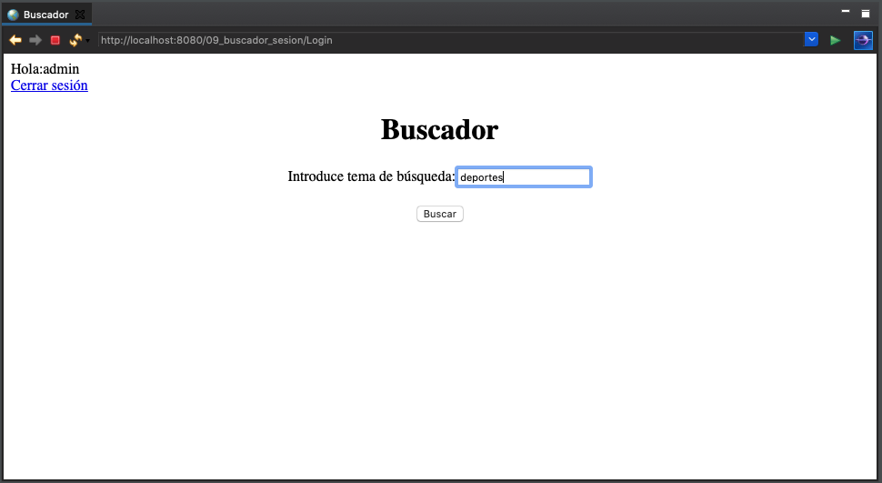
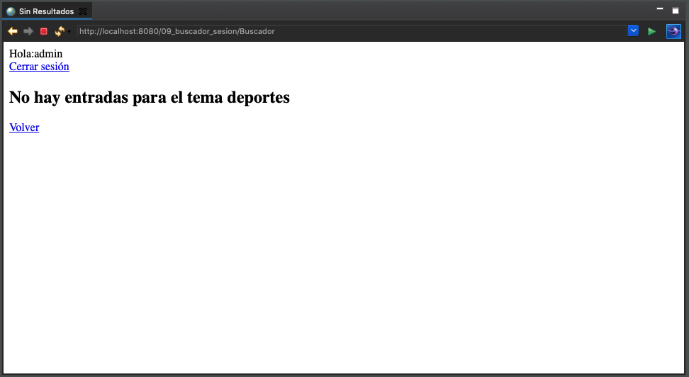

Si mientras estamos logeados y no accedemos a la aplicación por más de 1 minuto la sesión se cerrara por lo cual perdemos el nombre del usuario.


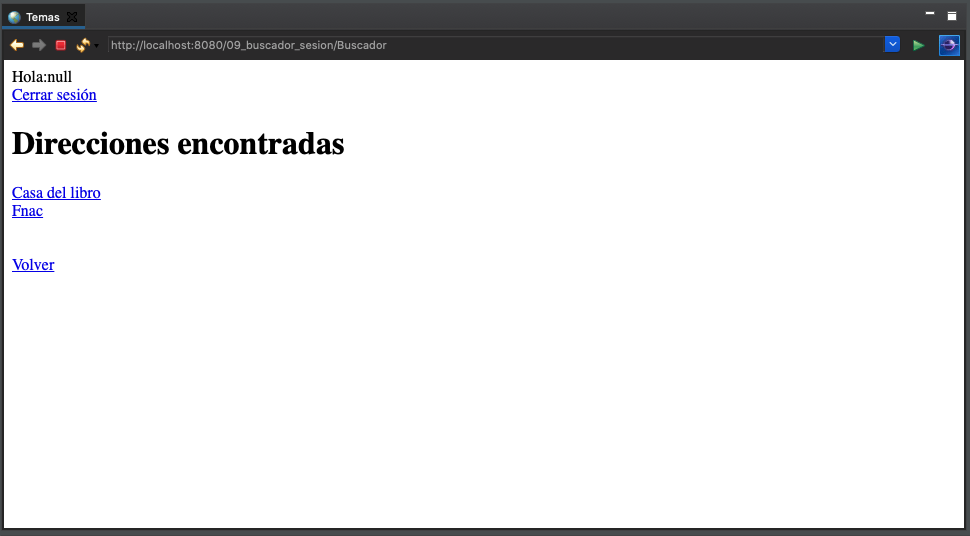

Si entramos y pulsamos el enlace `Cerrar Sesión` nos llevara a la pántalla inicial de Login.

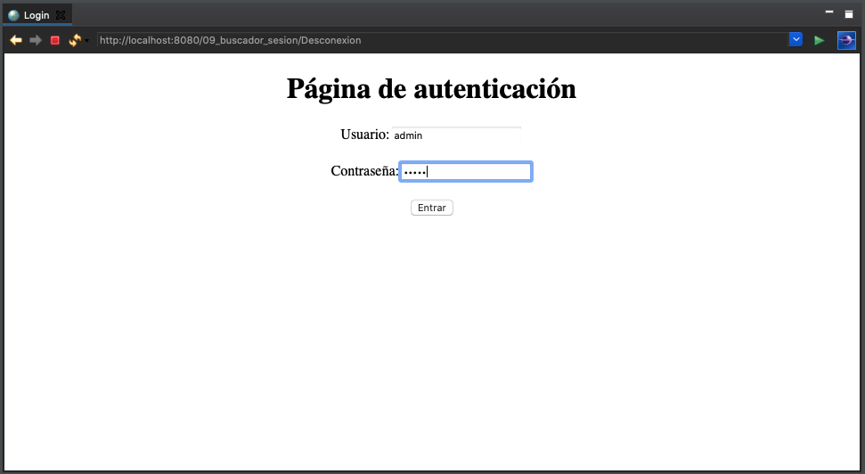

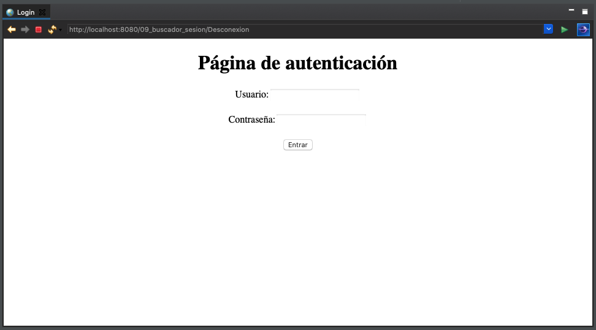

EJERCICIO 

Realizar la siguiente aplicación


