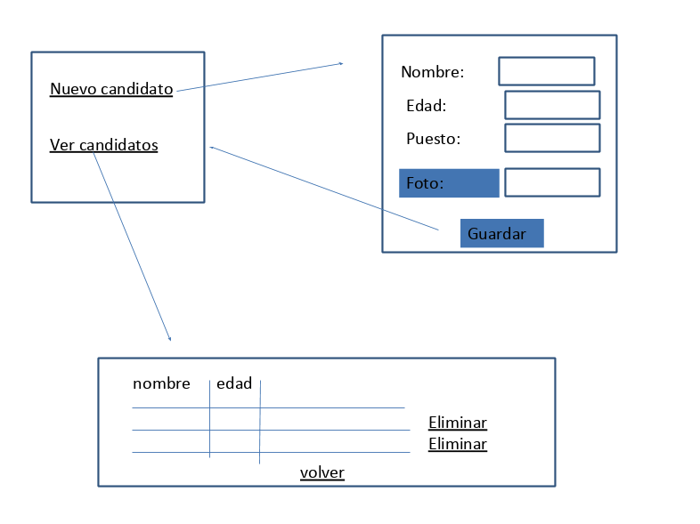
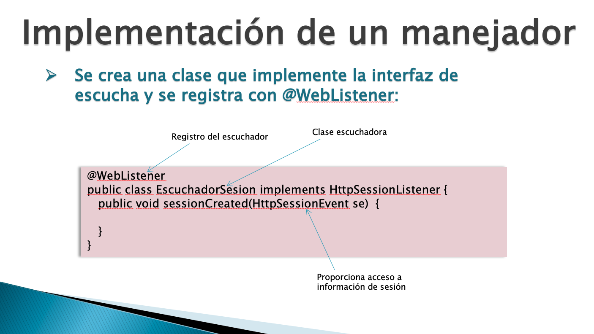
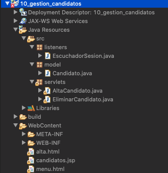
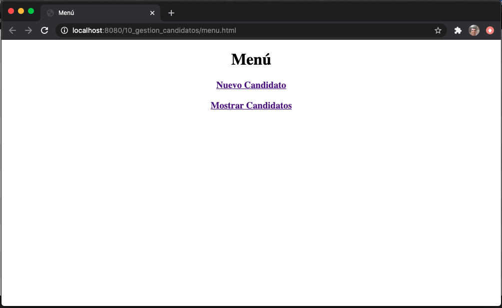
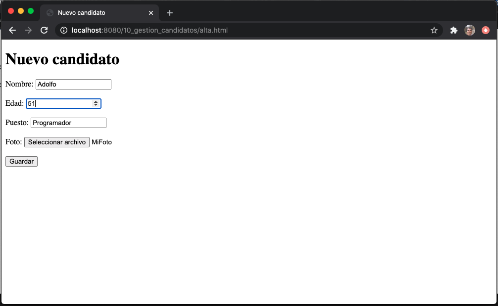
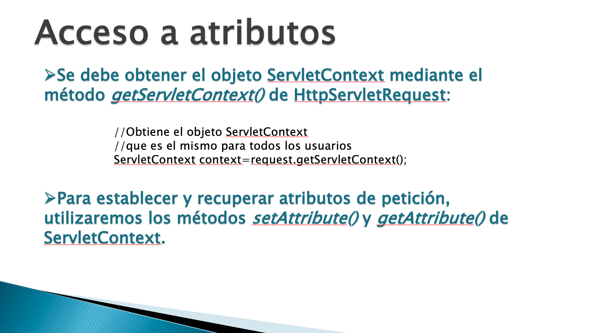
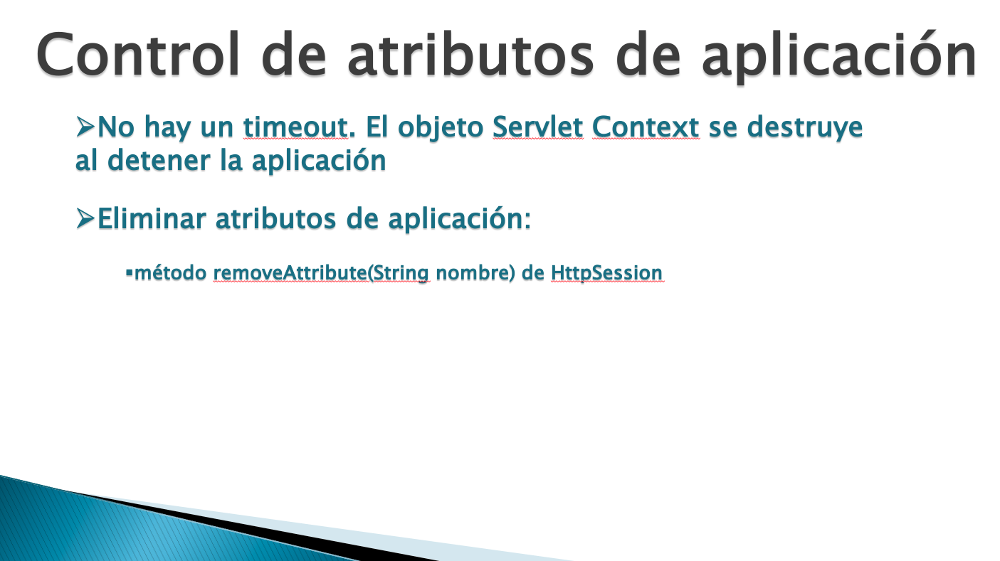
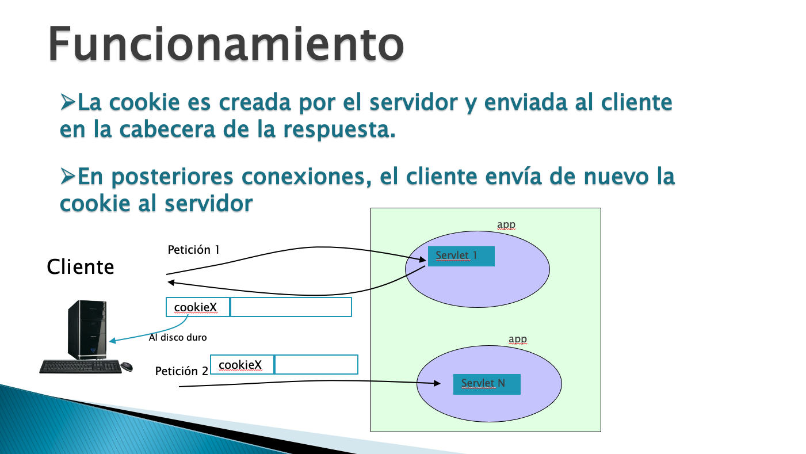
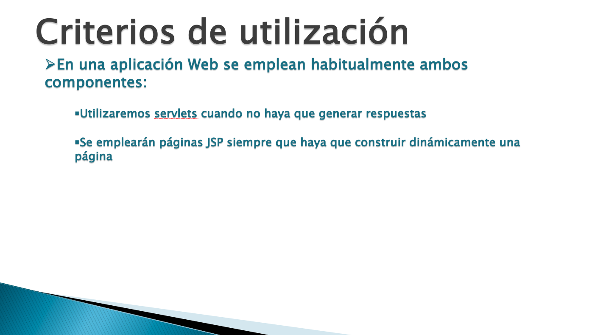
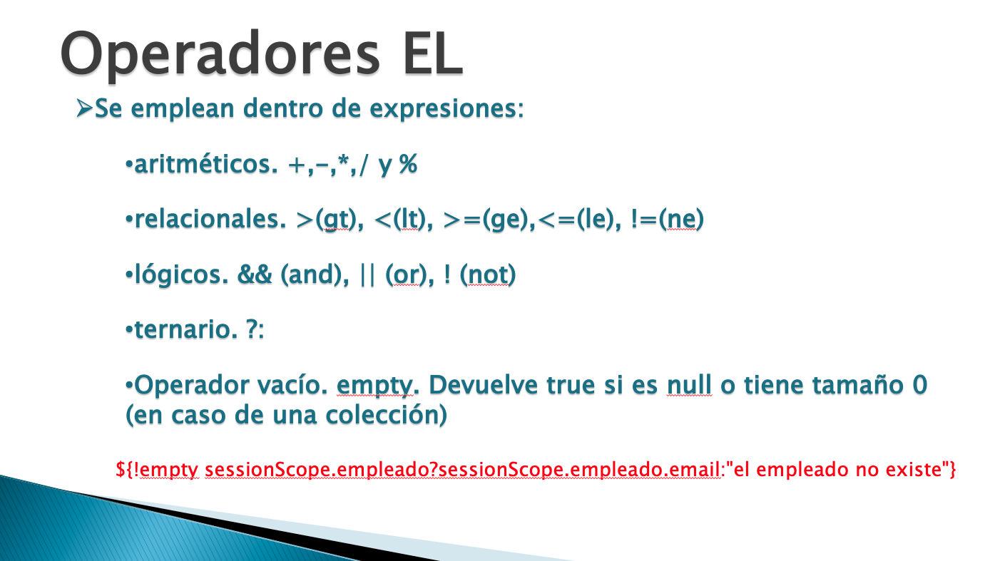

# 20201109 Lunes

EJERCICIO



## Eventos de Aplicación 




### :computer: Ejercicio `10_gestion_candidatos`

Vamos a ver la solución del ejejercicio.



Vamos a tener un menú inicial.



Esto lo pintamos con:

`menu.html`

```html
<!DOCTYPE html>
<html>
<head>
<meta charset="ISO-8859-1">
<title>Menú</title>
</head>
<body>
	<div align="center">
		<h1>Menú</h1>
   		<h3><a href="alta.html">Nuevo Candidato</a></h3>
   		<h3><a href="candidatos.jsp">Mostrar Candidatos</a></h3>
	</div>
</body>
</html>
```

Si seleccionamos la opción de `Nuevo Candidato` tenemos:



Esto lo pintamos con:

`alta.html`

```html
<!DOCTYPE html>
<html>
<head>
<meta charset="ISO-8859-1">
<title>Nuevo candidato</title>
</head>
<body>
	<h1>Nuevo candidato</h1>
	<form action="AltaCandidato" method="post" enctype="multipart/form-data">	
		Nombre: <input type="text" name="nombre" placeholder="Introduce tu nombre" required="required"><br/><br/>
		Edad: <input type="number" name="edad" placeholder="Introduce tu edad" required="required"><br/><br/>
		Puesto: <input type="text" name="puesto" placeholder="Introduce tu puesto" required="required"><br/><br/>
		Foto: <input type="file" name="foto" value="Buscar" accept="image/*"/><br/><br/>
		<input type="submit" value="Guardar">	
	</form>
</body>
</html>
```

Para subir la el archivo de foto usamos un `input` de tipo `file` y para restringuirlo a que solo acepte imagenes  ponemos el atributo `accept="image/*"`, además de esto de el form debe tener el atributo `enctype="multipart/form-data"` el cual indica que se van a pasar parámetros clasicos y parámetros con formato binario que es el caso del archivo de imagen.

**NOTA** *Se intento crear una carpeta externa al proyecto donde se almacenaran las fotos, pero como parece ser que desde el HTML no podemos acceder una ruta en nuestro ordenador, las imagenes se almacenarán dentro del mismo proyecto para tener acceso a las mismas.*

Como podemos ver en el `form` tenemos `action="AltaCandidato"` lo que indica que estamos llamando a ese Servlet, que vemos a continuación, pero primero ponemos el JavaBean `Candidato`.

`Candidato`

```java
package model;

public class Candidato {
	
	private String nombre;
	private int edad;
	private String puesto;
	private String foto;
	
	public Candidato(String nombre, int edad, String puesto, String foto) {
		super();
		this.nombre = nombre;
		this.edad = edad;
		this.puesto = puesto;
		this.foto = foto;
	}
	
	public String getNombre() {
		return nombre;
	}
	public void setNombre(String nombre) {
		this.nombre = nombre;
	}
	public int getEdad() {
		return edad;
	}
	public void setEdad(int edad) {
		this.edad = edad;
	}
	public String getPuesto() {
		return puesto;
	}
	public void setPuesto(String puesto) {
		this.puesto = puesto;
	}
	public String getFoto() {
		return foto;
	}
	public void setFoto(String foto) {
		this.foto = foto;
	}
	
}
```

Servlet `AltaCandidato`

```java
package servlets;

import java.io.IOException;
import java.util.Collection;
import java.util.List;

import javax.servlet.ServletException;
import javax.servlet.annotation.MultipartConfig;
import javax.servlet.annotation.WebServlet;
import javax.servlet.http.HttpServlet;
import javax.servlet.http.HttpServletRequest;
import javax.servlet.http.HttpServletResponse;
import javax.servlet.http.HttpSession;
import javax.servlet.http.Part;

import model.Candidato;

@MultipartConfig //permite al servlet procesar objetos Part (objetos binarios)
@WebServlet("/AltaCandidato")
public class AltaCandidato extends HttpServlet {
	
	private static final long serialVersionUID = 1L;

	protected void service(HttpServletRequest request, HttpServletResponse response) throws ServletException, IOException {
		HttpSession sesion = request.getSession();			
		List<Candidato> candidatos=(List<Candidato>) sesion.getAttribute("candidatos");
		/*No es necesario gracias al listener de sesion
		 * if (candidatos ==null) {
			candidatos = new ArrayList();
			sesion.setAttribute("candidatos", candidatos);
		}*/
		String nombre=request.getParameter("nombre");
		
		int edad=Integer.parseInt(request.getParameter("edad"));
		
		String puesto=request.getParameter("puesto");
		
		//String foto=request.getParameter("foto");
		//recuperar el parámetro foto
		Part foto=request.getPart("foto");
		Collection<String> headers=foto.getHeaderNames();
	  headers.forEach(h->System.out.println(h+":"+foto.getHeader(h)));
		String nombreFichero=obtenerNombreFichero(foto);
		
		Candidato cand = new Candidato(nombre,edad,puesto,nombreFichero);

		candidatos.add(cand);	
		
		guardarFicheroEnServidor(request,foto,nombreFichero);
		
		request.getRequestDispatcher("menu.html").forward(request, response);

	}
	
	private String obtenerNombreFichero(Part part) {
		for (String cd : part.getHeader("content-disposition").split(";")) { 
			if (cd.trim().startsWith("filename")) { 
				String fileName = cd.substring(cd.indexOf('=') + 1).trim().replace("\"", ""); 
				return fileName.substring(fileName.lastIndexOf('/') + 1).substring(fileName.lastIndexOf('\\') + 1); // MSIE fix. 
			} 
		} 
		return null; 
	}
	
	private void guardarFicheroEnServidor(HttpServletRequest request, Part part, String nombreFichero) {
		String url=request.getServletContext().getRealPath("/");
		
		/*try (InputStream input=part.getInputStream();
				FileOutputStream output = new FileOutputStream(url+nombreFichero);){
	        int leido = 0;
	        leido = input.read();        
	        while (leido != -1) {
	            output.write(leido);
	            leido = input.read();
	        }
	    } catch (IOException ex) {
	        ex.printStackTrace();
	    } */
		try {
			//part.write(url+"\\"+nombreFichero);  //Windows
			part.write(url+"/"+nombreFichero);     //Mac
		} catch (IOException e) {
			e.printStackTrace();
		}
	}
	
}
```

Observaciones del Servlet `AltaCandidato` 

* Debemos anotar el Servlet con `@MultipartConfig` que permite al servlet procesar objetos `Part` (objetos binarios)
* Lo primero que hacemos es recuperar una Lista de Candidatos de la sesión `List<Candidato> candidatos=(List<Candidato>) sesion.getAttribute("candidatos");`, si `candidatos` es nula indica que la lista no existe y que la debemos crear y ponerla en la sesión para que la próxima vez ya exista. Esto lo hemos comentado por que vamos a usar un Lisener que al iniciar la sesión se cree el atributo de esta manera siempre existira en el Servlet.  
* Para recuperar el archivo de la foto usamos `Part foto=request.getPart("foto");`, por un lado tenemos que almacenar este archivo en el servidor y por otro lado vamos a almacenar en el atributo `foto` del JavaBean `Candidato` el nombre del archivo.
* Es un poco enredado recuperar el nombre del archivo este viene incluido en los encabezados del archivo que podemos imprimir con:

   ```java
   Collection<String> headers=foto.getHeaderNames();
   headers.forEach(h->System.out.println(h+":"+foto.getHeader(h)));
   ```

   Esto nos regresa:

   ```sh
   content-disposition:form-data; name="foto"; filename="MiFoto.png"
   content-type:image/png
   ```
   
   Son dos encabezados para el archivo y en el primero `content-disposition` tenemos el nombre del archivo en `filename="MiFoto.png"`

* Creamos el método privado `private String obtenerNombreFichero(Part part) {...}` para recuperar el nombre del archivo, **OJO CON LOS SEPARADORES DE DIRECTORIOS, SON DIFERENTES EN WINDOWS Y MAC**.

* Una vez que ya tenemos el nombre creamos otro método privado `private void guardarFicheroEnServidor(HttpServletRequest request, Part part, String nombreFichero) {...}` para guardar el archivo en el servidor. Tenemos (comentada) una forma antigua y la nueva que es mucho más corta:

   ```java
   String url=request.getServletContext().getRealPath("/");
   part.write(url+"/"+nombreFichero);     //Mac
   ```
* Una vez hecho todo eso debemos almacenar el registro `Candidato` en una Lista de Candidatos.


Listener `EscuchadorSesion`

Este Listener crea un atributo de sesión cada vez que se inicia sesión.

```java
package listeners;

import java.util.ArrayList;

import javax.servlet.annotation.WebListener;
import javax.servlet.http.HttpSession;
import javax.servlet.http.HttpSessionEvent;
import javax.servlet.http.HttpSessionListener;

import model.Candidato;

@WebListener
public class EscuchadorSesion implements HttpSessionListener {

    public void sessionCreated(HttpSessionEvent se)  { 
        HttpSession sesion=se.getSession();
        //crea un atributo de sesión cada vez que se inicia sesión
        sesion.setAttribute("candidatos", new ArrayList<Candidato>());
    }

    public void sessionDestroyed(HttpSessionEvent se)  { 

    }
	
}
```

Una vez que damos de alta un Cadidato ya podemos ver la lista de Candidatos.


Esto lo pintamos con el JSP.

`candidatos.jsp`

```html
<%@ page language="java" contentType="text/html; charset=ISO-8859-1"
    pageEncoding="ISO-8859-1" import="java.util.List,model.Candidato"%>
<!DOCTYPE html>
<html>
<head>
<meta charset="ISO-8859-1">
<title>Insert title here</title>
<style>
	table,tr,th,td {
		border:1px solid pink;
	}
</style>
</head>
<body>
	<table>
		<tr>
			<th>Nombre</th>
			<th>Edad</th>
			<th>Puesto</th>
			<th>Foto</th>
			<th></th>
		</tr>
		<%List<Candidato> empleados= (List<Candidato>) session.getAttribute("candidatos");
		for(int i=0;i<empleados.size();i++){ %>
		   <tr>
		      <td><%=empleados.get(i).getNombre()%></td>
			  <td><%=empleados.get(i).getEdad()%></td>	
			  <td><%=empleados.get(i).getPuesto()%></td>
			  <td>"></td>
			  <td><a href="EliminarCandidato?posicion=<%=i%>">Eliminar</a></td>
		   </tr>
		<%}%>
	</table>
	<a href="menu.html">Volver al menu</a>
</body>
</html>
```

Como podemos ver tenemos un link para borrar a un candidato y lo hacemos por posición invocando al Servlet con `<a href="EliminarCandidato?posicion=<%=i%>">Eliminar</a>`.

Servlet `EliminarCandidato`

```java
package servlets;

import java.io.IOException;
import java.util.List;

import javax.servlet.ServletException;
import javax.servlet.annotation.WebServlet;
import javax.servlet.http.HttpServlet;
import javax.servlet.http.HttpServletRequest;
import javax.servlet.http.HttpServletResponse;
import javax.servlet.http.HttpSession;

import model.Candidato;

@WebServlet("/EliminarCandidato")
public class EliminarCandidato extends HttpServlet {
	private static final long serialVersionUID = 1L;

	protected void service(HttpServletRequest request, HttpServletResponse response) throws ServletException, IOException {
		HttpSession sesion = request.getSession();			
		List<Candidato> candidatos=(List<Candidato>) sesion.getAttribute("candidatos");
		if (candidatos.size()!=0) {
			int pos=Integer.parseInt(request.getParameter("posicion"));
			candidatos.remove(pos);	
			request.getRequestDispatcher("candidatos.jsp").forward(request, response);
		}else {
			request.getRequestDispatcher("menu.html").forward(request, response);
		}
	}
}
```

Observaciones del Servlet `EliminarCandidato`

* Tenemos la validación `if (candidatos.size()!=0) {` que podriamos pensar que no puede llegar a ser 0, esto solo puede pasar si la sesión caducara con lo que la lista de candidatos abria desaparecido y en ese caso si puede llegar a ser 0 por eso esta validación para redireccionar a un caso u a otro.

# SERVLETS

## Atributos de Aplicación





## Cookies





# JSP


## Acciones Implícitas JSP


## Integración Servlets - JSP




## El Lenguaje de Expresiones EL




## La Librería de Acciones JSTL


## Principales Acciones JSTL


