# 20201112 Jueves

## :computer: `18_formacion_v1`

Vamos a crear un nuevo proyecto partiendo de cero y con una base de datos diferente usando persistencia y el patrón MVC. Vamos a ir poniendo el código de cada sección el proyecto final tiene la siguiente estructura:

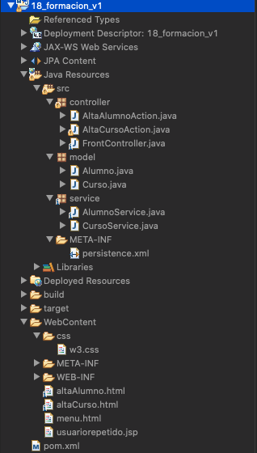

### 01. Base de Datos

En este proyecto usaremos la BD **Formacion** la cual tiene las siguientes tablas:


Las tablas que ocuparemos en este proyecto son las de `alumnos` y `cursos` cuyas estructuras son las siguientes:

```sql
CREATE TABLE `cursos` (
  `idCurso` int unsigned NOT NULL AUTO_INCREMENT,
  `nombre` varchar(45) NOT NULL,
  `duracion` int unsigned NOT NULL,
  `fechaInicio` date DEFAULT NULL,
  PRIMARY KEY (`idCurso`)
) ENGINE=InnoDB AUTO_INCREMENT=6 DEFAULT CHARSET=latin1
```

```sql
CREATE TABLE `cursos` (
  `idCurso` int unsigned NOT NULL AUTO_INCREMENT,
  `nombre` varchar(45) NOT NULL,
  `duracion` int unsigned NOT NULL,
  `fechaInicio` date DEFAULT NULL,
  PRIMARY KEY (`idCurso`)
) ENGINE=InnoDB AUTO_INCREMENT=6 DEFAULT CHARSET=latin1
```

### 02. Crear el Proyecto en Eclipse

Creamos el proyecto `18_formacion_v1`.

### 03. Mavenizar el Proyecto y añadir dependencias.

El Archivo `pom.xml` nos queda así:

```html
<project xmlns="http://maven.apache.org/POM/4.0.0" xmlns:xsi="http://www.w3.org/2001/XMLSchema-instance" xsi:schemaLocation="http://maven.apache.org/POM/4.0.0 https://maven.apache.org/xsd/maven-4.0.0.xsd">
  <modelVersion>4.0.0</modelVersion>
  <groupId>18_formacion_v1</groupId>
  <artifactId>18_formacion_v1</artifactId>
  <version>0.0.1-SNAPSHOT</version>
  <packaging>war</packaging>
  <build>
    <sourceDirectory>src</sourceDirectory>
    <plugins>
      <plugin>
        <artifactId>maven-war-plugin</artifactId>
        <version>3.2.3</version>
        <configuration>
          <warSourceDirectory>WebContent</warSourceDirectory>
        </configuration>
      </plugin>
      <plugin>
        <artifactId>maven-compiler-plugin</artifactId>
        <version>3.8.1</version>
        <configuration>
          <release>14</release>
        </configuration>
      </plugin>
    </plugins>
  </build>
  <dependencies>
  	<!-- https://mvnrepository.com/artifact/mysql/mysql-connector-java -->
	<dependency>
	    <groupId>mysql</groupId>
	    <artifactId>mysql-connector-java</artifactId>
	    <version>8.0.19</version>
	</dependency>
	<!-- https://mvnrepository.com/artifact/org.hibernate/hibernate-core -->
	<dependency>
	    <groupId>org.hibernate</groupId>
	    <artifactId>hibernate-core</artifactId>
	    <version>5.4.18.Final</version>
	</dependency>
  </dependencies>
</project>
```

### 04. Añadir la Característica JPA al Proyecto

En las propiedades de la proyecto seleccionar **Project Facets** y marcamos la opción JPA con la versión 2.2


Al hacer esto se incluye el archivo `persistence.xml` con la información más básica.

### 05. Generer las Entidades desde las Tablas...

Vamos a generar las Entidades desde las tablas usando la siguiente opción:

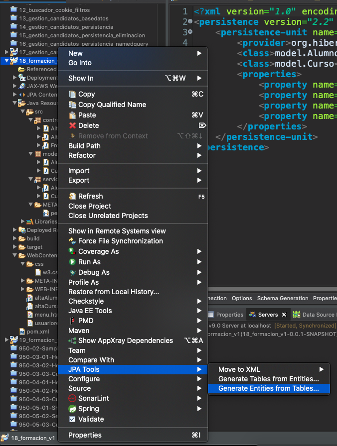

Vamos a crear una nueva conexión para la BD `formacion` pulsando en el botón de creación de Conexión


Indicamos el tipo de BD y le damos el nombre `MySQLFormacion`


Como en el proyecto pasado ya habíamos creado la conexión `MySQL JDBC Driver` solo completamos los datos de la BD a usar.


Hacemos un Test para comprobar que la conexión es correcta.


En el último paso simplemente nos muestra un resumen para comprobar que todo es correcto, pulsamos en Finish.


Nos retorna a la pantalla previa, ya tenemos nuestra conexión en Schema marcamos ***database*** y aparecen las tablas de la BD formación, vamos a seleccionar las dos que nos interesan por el momento `alumnos` y `cursos` 

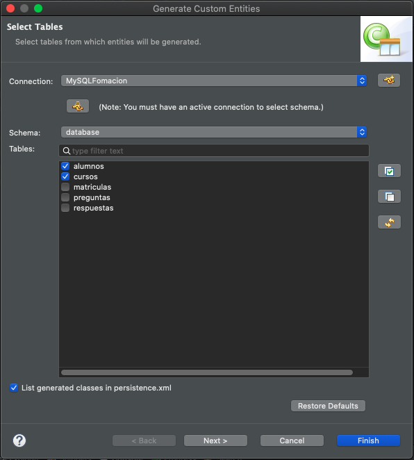

La siguiente pantalla sirve para asociaciones de tablas pero no es nuestro caso, presionamos en siguiente


En la siguiente pantalla confirmamos que el paquete donde genere esas entidades sea `model` presinamos en siguiente:


En la siguiente pantalla nos muestra las dos tablas seleccionadas para las cuales debemos indicar la estrategia de generación de la primary key. En el caso de `alumnos` no existe ninguna ya que su clave es el campo `usuario`, por lo que ponemos `none`:

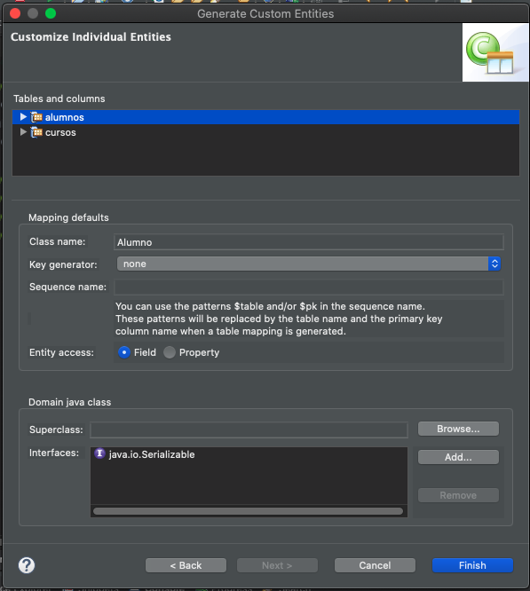

En el caso de `cursos` colocamos `identity` para que genere el campo `idCurso`.

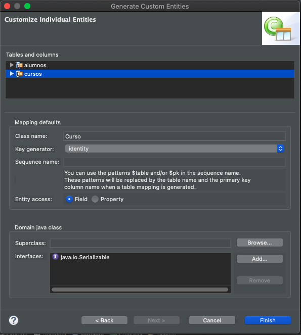

Pulsamos Finish.

Con esto se generan las dos entidades `Alumno` y `Curso` pero detectamos que existe algún error en su creación.


Por un problema con el conector de MySQL 8 si existe otra BD que contenga campos con esos nombres de campos, los duplica o inclusive mete otros campos que no pertenecen a nuestra tabla, ***por lo que no nos va a quedar de otra más que borrar manualmente los errores***.

Las Entidades creadas y corregidas son las siguientes:

`Alumno`

```java
package model;

import java.io.Serializable;
import javax.persistence.*;


/**
 * The persistent class for the alumnos database table.
 * 
 */
@Entity
@Table(name="alumnos")
@NamedQuery(name="Alumno.findAll", query="SELECT a FROM Alumno a")
public class Alumno implements Serializable {
	private static final long serialVersionUID = 1L;

	@Id
	private String usuario;
	private int edad;
	private String email;
	private String nombre;
	private String password;

	public Alumno() {
	}

	public Alumno(String usuario, int edad, String email, String nombre, String password) {
		super();
		this.usuario = usuario;
		this.edad = edad;
		this.email = email;
		this.nombre = nombre;
		this.password = password;
	}


	public String getUsuario() {
		return this.usuario;
	}

	public void setUsuario(String usuario) {
		this.usuario = usuario;
	}

	public int getEdad() {
		return this.edad;
	}

	public void setEdad(int edad) {
		this.edad = edad;
	}

	public String getEmail() {
		return this.email;
	}

	public void setEmail(String email) {
		this.email = email;
	}

	public String getNombre() {
		return this.nombre;
	}

	public void setNombre(String nombre) {
		this.nombre = nombre;
	}

	public String getPassword() {
		return this.password;
	}

	public void setPassword(String password) {
		this.password = password;
	}

}
```

`Curso`

```java
package model;

import java.io.Serializable;
import javax.persistence.*;
import java.util.Date;

/**
 * The persistent class for the cursos database table.
 * 
 */
@Entity
@Table(name="cursos")
@NamedQuery(name="Curso.findAll", query="SELECT c FROM Curso c")
public class Curso implements Serializable {
	private static final long serialVersionUID = 1L;

	@Id
	@GeneratedValue(strategy=GenerationType.IDENTITY)
	private int idCurso;
	
	@Temporal(TemporalType.DATE)
	private Date fechaInicio;
	private int duracion;
	private String nombre;

	public Curso() {
	}

	public Curso(int idCurso, Date fechaInicio, int duracion, String nombre) {
		super();
		this.idCurso = idCurso;
		this.fechaInicio = fechaInicio;
		this.duracion = duracion;
		this.nombre = nombre;
	}

	public Date getFechaInicio() {
		return fechaInicio;
	}

	public void setFechaInicio(Date fechaInicio) {
		this.fechaInicio = fechaInicio;
	}
	
	public int getDuracion() {
		return this.duracion;
	}

	public void setDuracion(int duracion) {
		this.duracion = duracion;
	}
  
	public int getIdCurso() {
		return this.idCurso;
	}

	public void setIdCurso(int idCurso) {
		this.idCurso = idCurso;
	}

	public String getNombre() {
		return this.nombre;
	}

	public void setNombre(String nombre) {
		this.nombre = nombre;
	}

}
```

Notese la anotación que se asigna para los campos de tipo fecha `@Temporal(TemporalType.DATE)`.

**NOTA** ***Se ha añadido en ambas Entidades un Construtor con toods los campos.***

### 06. Completar el archivo `persistence.xml`

Con el paso anterior en nuestro archivo `persistence.xml` se han insertado las etiquetas `<class>` para las Entidades `Alumno` y `Curso`, pero falta añadir:

* El motor de persistencia que vamos a usar
* La conexión a la BD.

Una vez incluido lo anterior el archivo `persistence.xml` final nos queda asi:

`persistence.xml`

```java
<?xml version="1.0" encoding="UTF-8"?>
<persistence version="2.2" xmlns="http://xmlns.jcp.org/xml/ns/persistence" xmlns:xsi="http://www.w3.org/2001/XMLSchema-instance" xsi:schemaLocation="http://xmlns.jcp.org/xml/ns/persistence http://xmlns.jcp.org/xml/ns/persistence/persistence_2_2.xsd">
	<persistence-unit name="formacionPU" transaction-type="RESOURCE_LOCAL">
		<provider>org.hibernate.jpa.HibernatePersistenceProvider</provider>
		<class>model.Alumno</class>
		<class>model.Curso</class>
		<properties>
			<property name="javax.persistence.jdbc.url" value="jdbc:mysql://localhost:3306/formacion?serverTimezone=Europe/Madrid"/>
			<property name="javax.persistence.jdbc.user" value="root"/>
			<property name="javax.persistence.jdbc.password" value="root"/>
			<property name="javax.persistence.jdbc.driver" value="com.mysql.jdbc.Driver"/>
		</properties>
	</persistence-unit>
</persistence>
```

### 07. Crear el Service

En este caso vamos a tener dos clases de Servicio una para Alumnos y otra para Cursos.

* En el caso de `AlumnoService` necesitamos crear dos métodos uno para darlo de alta y otro para comprobar que no exista en base a su usuario para poder dar la alta solo si no existe. ¿Cómo serían esos métodos?

`AlumnoService`

```java
package service;

import javax.persistence.EntityManager;
import javax.persistence.EntityManagerFactory;
import javax.persistence.EntityTransaction;
import javax.persistence.Persistence;

import model.Alumno;

public class AlumnoService {
	
	private static EntityManager em;
	static {
		EntityManagerFactory factory=Persistence.createEntityManagerFactory("formacionPU");
		em=factory.createEntityManager();
	}
	public void altaAlumno(Alumno alumno) {
		EntityTransaction tx = em.getTransaction();
		tx.begin();
		em.persist(alumno);
		tx.commit();
	}
	
	public Alumno buscarAlumnoPorUsuario(String usuario){
		return em.find(Alumno.class,usuario);
		
		/* NO SON NECESARIOS LOS QUERIES EN ESTE CASO
		TypedQuery<Alumno> query = em.createNamedQuery("Candidato.findByEmail", Alumno.class);
		query.setParameter(1, usuario);
		
		// 1er Forma de hacerlo
		List<Alumno> alumnos = query.getResultList();
		return alumnos.size()>0  ? alumnos.get(0):null;
		
		*/
		//2da Forma //Si no encuentra o encuentra más de 1 devuelve excepcion
		/*
		try {
		   return query.getSingleResult();
		}catch(NoResultException | NonUniqueResultException ex) {
			return null;
		}*/
		
	}

}
```

* En el caso de `CursoService` simplemente necesitamos un método para darlo de alta sin comprobación alguna.

`CursoService`

```java
package service;

import javax.persistence.EntityManager;
import javax.persistence.EntityManagerFactory;
import javax.persistence.EntityTransaction;
import javax.persistence.Persistence;

import model.Curso;

public class CursoService {
	private static EntityManager em;
	static {
		EntityManagerFactory factory=Persistence.createEntityManagerFactory("formacionPU");
		em=factory.createEntityManager();
	}
	public void altaCurso(Curso curso) {
		EntityTransaction tx = em.getTransaction();
		tx.begin();
		em.persist(curso);
		tx.commit();
	}
}
```

### 08. Crear los Controladores de Acción

Vamos a tener un controlador de acción para dar de alta el alumno y otro para dar de alta el curso.

* Contralador de Acción `AltaAlumnoAction`

```java
package controller;

import java.io.IOException;

import javax.servlet.ServletException;
import javax.servlet.annotation.WebServlet;
import javax.servlet.http.HttpServlet;
import javax.servlet.http.HttpServletRequest;
import javax.servlet.http.HttpServletResponse;

import model.Alumno;
import service.AlumnoService;

@WebServlet("/AltaAlumnoAction")
public class AltaAlumnoAction extends HttpServlet {
   private static final long serialVersionUID = 1L;

   protected void service(HttpServletRequest request, HttpServletResponse response) throws ServletException, IOException {
      AlumnoService service = new AlumnoService();
      String usuario = request.getParameter("usuario");
      String password = request.getParameter("password");
      String nombre = request.getParameter("nombre");
      String email = request.getParameter("email");
      int  edad = Integer.parseInt(request.getParameter("edad"));
		
      if( service.buscarAlumnoPorUsuario(usuario) == null ) {
         service.altaAlumno(new Alumno(usuario,edad,email,nombre,password));
         request.setAttribute("resultado", true);
      }else {
         request.setAttribute("resultado", false);
      }
   }
}
```

Simplente recuperamos los parámetros, comprobamos mediante el servicio si existe algún alumno con el `usuario` que nos envían, sino existe creamos un `Alumno` en base a los parámetros y nuevamente mediante el servicio damos de alta ese nuevo alunmo. Si se dio de alta o no se almacena un atributo booleano de solicitud según sea el caso para que el Controlador se entere y pueda tomar la decisión de a que pantalla nos envía.

* Contralador de Acción `AltaCursoAction`

```java
package controller;

import java.io.IOException;
import java.text.ParseException;
import java.text.SimpleDateFormat;

import javax.servlet.ServletException;
import javax.servlet.annotation.WebServlet;
import javax.servlet.http.HttpServlet;
import javax.servlet.http.HttpServletRequest;
import javax.servlet.http.HttpServletResponse;

import model.Curso;
import service.CursoService;

@WebServlet("/AltaCursoAction")
public class AltaCursoAction extends HttpServlet {
   private static final long serialVersionUID = 1L;

	
   protected void service(HttpServletRequest request, HttpServletResponse response) throws ServletException, IOException {
      CursoService service = new CursoService();
      try {
         String nombre  = request.getParameter("nombre");
         int duracion  = Integer.parseInt(request.getParameter("duracion"));
         String fechaInicio  = request.getParameter("fechaInicio");
         SimpleDateFormat format = new SimpleDateFormat("yyyy-MM-dd");
         service.altaCurso(new Curso(0,format.parse(fechaInicio), duracion, nombre));
      } catch (NumberFormatException e) {
         e.printStackTrace();
      } catch (ParseException e) {
         e.printStackTrace();
      }	
   }
}
```

Aquí en este Action lo más interesanye es ver como se tiene que tratar un campo tipo `Date` para poderlo mapearlo a la BD.

### 09. Crear el FrontController

`FrontController`

```java
package controller;

import java.io.IOException;

import javax.servlet.ServletException;
import javax.servlet.annotation.WebServlet;
import javax.servlet.http.HttpServlet;
import javax.servlet.http.HttpServletRequest;
import javax.servlet.http.HttpServletResponse;

@WebServlet("/FrontController")
public class FrontController extends HttpServlet {
   private static final long serialVersionUID = 1L;

   protected void service(HttpServletRequest request, HttpServletResponse response) throws ServletException, IOException {
      String url = "";
      String option = request.getParameter("option");
      switch(option) {
         case "doAltaAlumno":
            request.getRequestDispatcher("AltaAlumnoAction").include(request, response);
            url = (boolean)request.getAttribute("resultado")? "menu.html":"alumnoRepetido.jsp";
            break;
         case "doAltaCurso":
            request.getRequestDispatcher("AltaCursoAction").include(request, response);
            url="menu.html";
            break;
         case "toAltaAlumno":
            url="altaAlumno.html";
            break;
         case "toAltaCurso":
            url="altaCurso.html";
            break;
         case "toMenu":
            url="menu.html";
            break;
      }
      request.getRequestDispatcher(url).forward(request, response);
   }
}
```

Podemos ver que cuando damos de alta a un alumno invocando el Action `AltaAlumnoAction`, posteriormente recuperamos el atributo de solicitud `resultado` (*indispensable hacer el casting*) y usando el operador ternario dependiendo de su valor mandamos a una u otra vista.

Para dar de alta un curso invocando el Action `AltaCursoAction` y redirigimos al menú.

Los demás casos son simples llamadas a diferentes vistas.

### 10. Creación de las Vistas

Como podemos ver en el FrontController vamos a necesitar las vistas:

* `menu.html`
* `altaAlumno.html`
* `alumnoRepetido.jsp`
* `altaCurso.html`

`menu.html`

```html
<!DOCTYPE html>
<html>
<head>
<meta charset="ISO-8859-1">
<title>Menú</title>
<link rel="stylesheet" type="text/css" href="css/w3.css">
</head>
<body>
   <div align="center">
      <h1 class="w3-jumbo">Formación</h1>
      <p class="w3-xlarge w3-text-dark-grey">Los mejores cursos del mercado</p>
      <a href="FrontController?option=toAltaAlumno" class="w3-button w3-dark-grey">Nuevo Alumno</a>
      <a href="FrontController?option=toAltaCurso" class="w3-button w3-dark-grey">Nuevo Curso</a>
   </div>
</body>
</html>
```

`altaAlumno.html`

```html
<!DOCTYPE html>
<html>
<head>
<meta charset="ISO-8859-1">
<title>Nuevo Usuario</title>
<link rel="stylesheet" type="text/css" href="css/w3.css">
</head>
<body>
    <div class="w3-padding">
      <h1>Nuevo Usuario</h1>
         <fieldset>
            <legend>Datos del Usuario</legend>
            <form action="FrontController?option=doAltaAlumno" method="post">
               <label for="fusuario">Usuario</label><br>
               <input type="text" name="usuario" required="required"><br>
               <label for="fpassword">Contraseña</label><br>
               <input type="password" name="password" required="required"><br>
               <label for="fnombre">Nombre</label><br>
               <input type="text" name="nombre" required="required"><br>
               <label for="femail">Email</label><br>
               <input type="text" name="email" required="required"><br>
               <label for="fedad">Edad</label><br>
               <input type="number" name="edad" required="required"><br><br>
               <input type="submit" value="Guardar">
               <input type="reset">
            </form>
         </fieldset>
      </div>
      <div align="right" class="w3-padding">
         <a href="FrontController?option=toMenu" class="w3-button w3-dark-grey">Volver al menú</a>
      </div>
</body>
</html>
```

`alumnoRepetido.html`

```html
<%@ page language="java" contentType="text/html; charset=UTF-8"
    pageEncoding="UTF-8"%>
<!DOCTYPE html>
<html>
<head>
<link rel="stylesheet" type="text/css" href="css/w3.css">
</head>
<body>
   <div align="center" class="w3-padding">
      <h1>Usuario ya existente.</h1>
   </div>
   <br><br>
   <div align="right" class="w3-padding">
      <a href="FrontController?option=toMenu" class="w3-button w3-dark-grey">Volver al menú</a>
   </div>
</body>
</html>
```

`altaCurso.html`

```html
<!DOCTYPE html>
<html>
<head>
<meta charset="ISO-8859-1">
<title>Nuevo Curso</title>
<link rel="stylesheet" type="text/css" href="css/w3.css">
</head>
<body>
   <div class="w3-padding">
      <h1>Nuevo Curso</h1>
      <fieldset>
         <legend>Datos del Curso</legend>
         <form action="FrontController?option=doAltaCurso" method="post">
            <label for="fnombre">Nombre</label><br>
            <input type="text" name="nombre" required="required"><br>
            <label for="fduracion">Duración</label><br>
            <input type="number" name="duracion" required="required"><br>
            <label for="ffecha">Fecha</label><br>
            <input type="date" name="fechaInicio" required="required"><br><br>
            <input type="submit" value="Guardar">
            <input type="reset">
         </form>
      </fieldset>
   </div>
   <div align="right" class="w3-padding">
      <a href="FrontController?option=toMenu" class="w3-button w3-dark-grey">Volver al menú</a>
   </div>
</body>
</html>
```

### 11. Probar la Aplicación

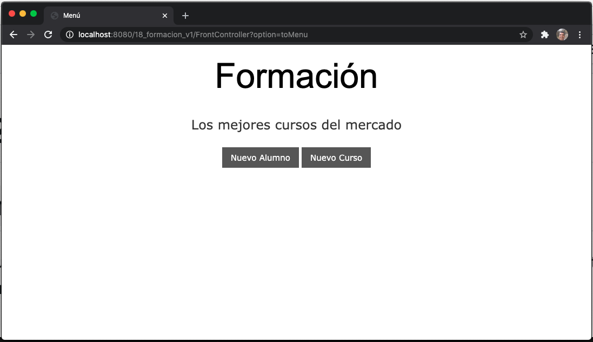
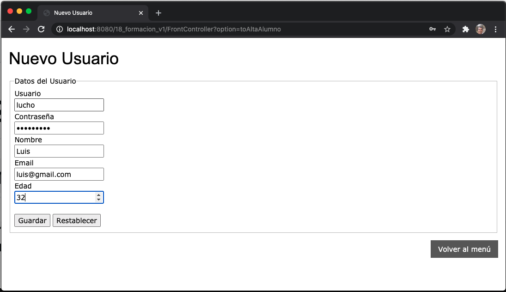

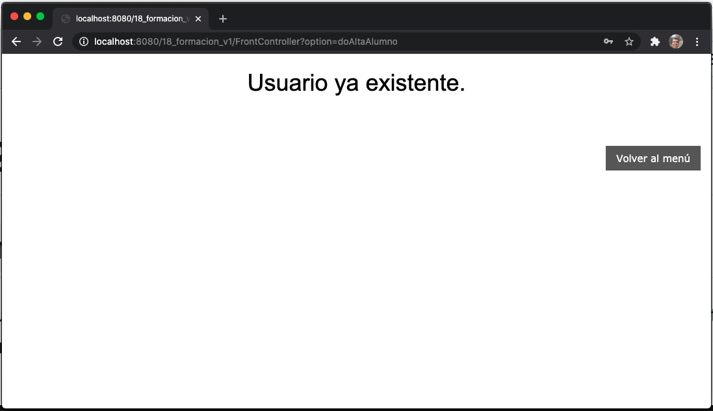
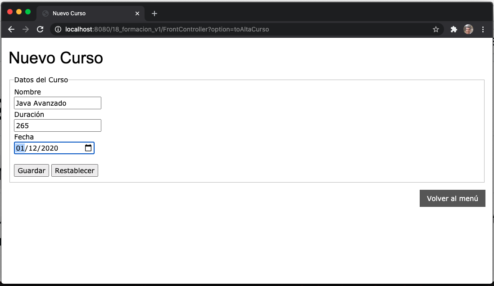

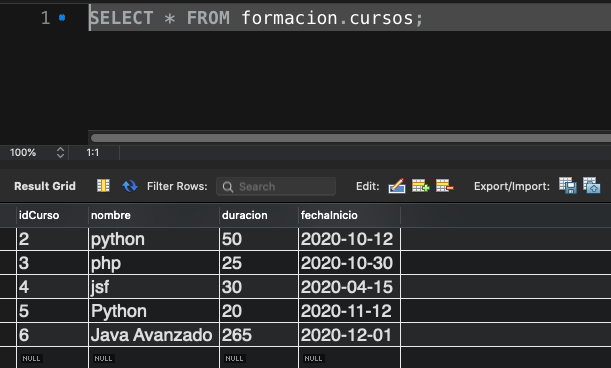

### Resumen de los Pasos para Crear la Aplicación

1. Base de Datos
2. Crear el Proyecto en Eclipse
3. Mavenizar el Proyecto y añadir dependencias.
4. Añadir la Característica JPA al Proyecto
5. Generer las Entidades desde las Tablas...
6. Completar el archivo `persistence.xml`
7. Crear el Service
8. Crear los Controladores de Acción
9. Crear el FrontController
10. Creación de las Vistas
11. Probar la Aplicación

## Uso del Patrón Factory.

El Patrón Factory nos va a permitir desacoplar nuestras aplicaciones, esto significa que las Clases no dependan unas de otras, que si hago un cambio en una afecte el funcionamiento de otra. Esos cambios deben ser transparentes y hacerse solo en la clase que nos interese modificar sin que afecte a nadie más en eso nos ayuda el Patrón Factory.

En nuestro proyecto anterior `18_formacion_v1` desde los Action invocamos directamente a la clase de Servio

Para `AltaAlumnoAction` tenemos:

```java
AlumnoService service = new AlumnoService();
```
Para `AltaCursoAction` tenemos:

```java
CursoService service = new CursoService();
```

Y es principalmente esto lo que genera el acoplamiento de Clases es aquí donde vamos a implementar el patrón de Factoría.

IMAGEN PIZARRA

Vamos a aplicar el Patrón de Factoria al `18_formacion_v1` en el siguiente ejemplo.

## :computer: `19_formacion_factoria`
 
Vamos a copiar el proyecto `18_formacion_v1` para generar el `19_formacion_factoria` y en este implementar el Patrón de Factoria. La estructura final del proyecto es la siguiente.


### 01. Renombrar los Services.

Vamos a renombrar los Services con los siguientes nombres.

* `AlumnosService` a `AlumnosServiceImpl`
* `CursoService` a `CursoServiceImpl`

Lo que pretendemos cambiando los nombres es convertir las Clases en implementación de Intercaces.

### 02. Generar las Interfaces

A partir de las clases vamos a generar las Interfaces, nos colocamos en el nombre de la clase y damos botón derecho seleccionamos **Refactor** y **Extract Interface..**.

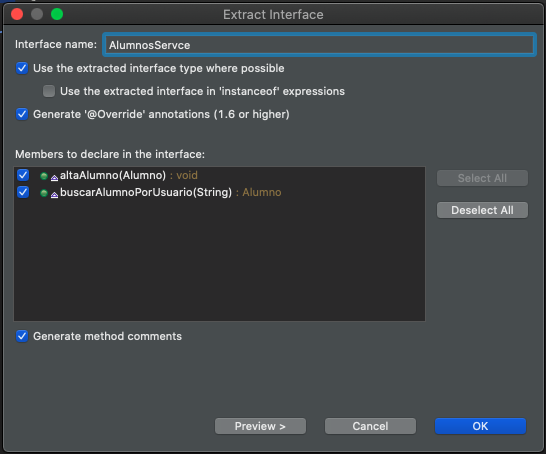

Nos pide el nombre la Interface y además que marquemos los métodos que debe generar en cuanto presionemos OK se generara la Interface e indicará que la clase la implementa. Realizamos lo mismo para la otra clase.

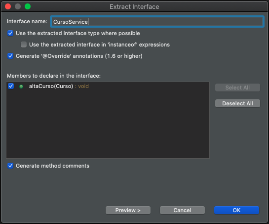

El código de las Clases e Interface es el siguiente:

`AlumnosServiceImpl`

```java
package service;

import javax.persistence.EntityManager;
import javax.persistence.EntityManagerFactory;
import javax.persistence.EntityTransaction;
import javax.persistence.Persistence;

import model.Alumno;

public class AlumnosServiceImpl implements AlumnosService {
	
   private static EntityManager em;
   static {
      EntityManagerFactory factory=Persistence.createEntityManagerFactory("formacionPU");
      em=factory.createEntityManager();
   }
   @Override
   public void altaAlumno(Alumno alumno) {
      EntityTransaction tx = em.getTransaction();
      tx.begin();
      em.persist(alumno);
      tx.commit();
   }
	
   @Override
   public Alumno buscarAlumnoPorUsuario(String usuario){
      return em.find(Alumno.class,usuario);
   }
}
```

`AlumnosService`

```java
package service;

import model.Alumno;

public interface AlumnosService {
   void altaAlumno(Alumno alumno);
   Alumno buscarAlumnoPorUsuario(String usuario);
}
```

`CursosServiceImpl`

```java
package service;

import javax.persistence.EntityManager;
import javax.persistence.EntityManagerFactory;
import javax.persistence.EntityTransaction;
import javax.persistence.Persistence;

import model.Curso;

public class CursosServiceImpl implements CursoService {
   private static EntityManager em;
   static {
      EntityManagerFactory factory=Persistence.createEntityManagerFactory("formacionPU");
      em=factory.createEntityManager();
   }
   @Override
   public void altaCurso(Curso curso) {
      EntityTransaction tx = em.getTransaction();
      tx.begin();
      em.persist(curso);
      tx.commit();
   }
}
```


`CursoService`

```java
package service;

import model.Curso;

public interface CursoService {
   void altaCurso(Curso curso);
}
```
### 03. Crear el Factory

`FormacionFactory`

```java
package service;

public class FormacionFactory {
   public static CursoService getCursosService() {
      return new CursosServiceImpl();
   }
	
   public static AlumnosService getAlumnosService() {
      return new AlumnosServiceImpl();
   }
}
```

### 04. Cambiar los Actions

Los Actions ya no llamarán a la clase sino a la Factoria.


`AltaAlumnoAction`

```java
package controller;

import java.io.IOException;

import javax.servlet.ServletException;
import javax.servlet.annotation.WebServlet;
import javax.servlet.http.HttpServlet;
import javax.servlet.http.HttpServletRequest;
import javax.servlet.http.HttpServletResponse;

import model.Alumno;
import service.AlumnosService;
import service.FormacionFactory;

@WebServlet("/AltaAlumnoAction")
public class AltaAlumnoAction extends HttpServlet {
   private static final long serialVersionUID = 1L;

   protected void service(HttpServletRequest request, HttpServletResponse response) throws ServletException, IOException {
      AlumnosService service =  FormacionFactory.getAlumnosService();
      String usuario = request.getParameter("usuario");
      String password = request.getParameter("password");
      String nombre = request.getParameter("nombre");
      String email = request.getParameter("email");
      int  edad = Integer.parseInt(request.getParameter("edad"));
		
      if( service.buscarAlumnoPorUsuario(usuario) == null ) {
         service.altaAlumno(new Alumno(usuario,edad,email,nombre,password));
         request.setAttribute("resultado", true);
      }else {
         request.setAttribute("resultado", false);
      }
   }
}
```

`AltaCursoAction`

```java
package controller;

import java.io.IOException;
import java.text.ParseException;
import java.text.SimpleDateFormat;

import javax.servlet.ServletException;
import javax.servlet.annotation.WebServlet;
import javax.servlet.http.HttpServlet;
import javax.servlet.http.HttpServletRequest;
import javax.servlet.http.HttpServletResponse;

import model.Curso;
import service.CursoService;
import service.FormacionFactory;

@WebServlet("/AltaCursoAction")
public class AltaCursoAction extends HttpServlet {
   private static final long serialVersionUID = 1L;

	
   protected void service(HttpServletRequest request, HttpServletResponse response) throws ServletException, IOException {
      CursoService service = FormacionFactory.getCursosService();
      try {
         String nombre  = request.getParameter("nombre");
         int duracion  = Integer.parseInt(request.getParameter("duracion"));
         String fechaInicio  = request.getParameter("fechaInicio");
         SimpleDateFormat format = new SimpleDateFormat("yyyy-MM-dd");
         service.altaCurso(new Curso(0,format.parse(fechaInicio), duracion, nombre));
      } catch (NumberFormatException e) {
         e.printStackTrace();
      } catch (ParseException e) {
         e.printStackTrace();
      }
   }
}
```

Son todos los cambios necesarios, ahora vamos a probar que todo siga funcionando igual.

### Probar la Aplicación


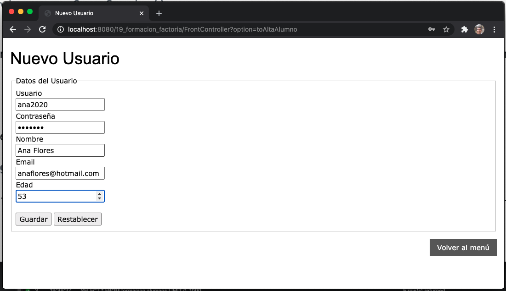

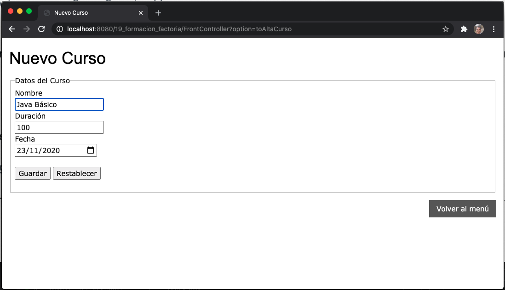
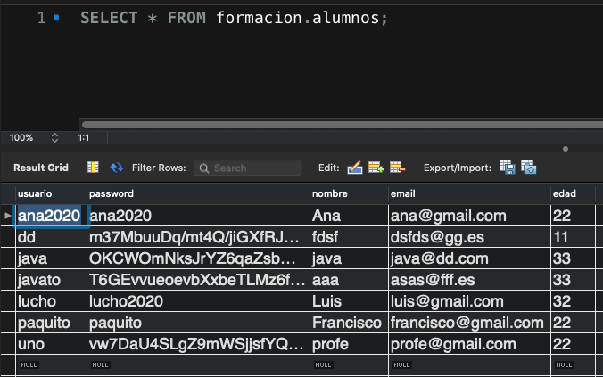
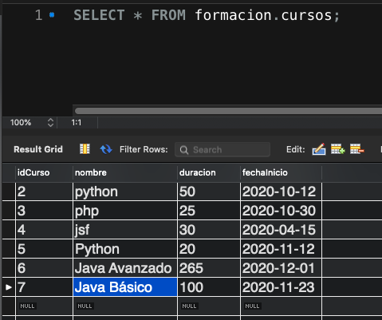

La Aplicación funciona igual que antes.
