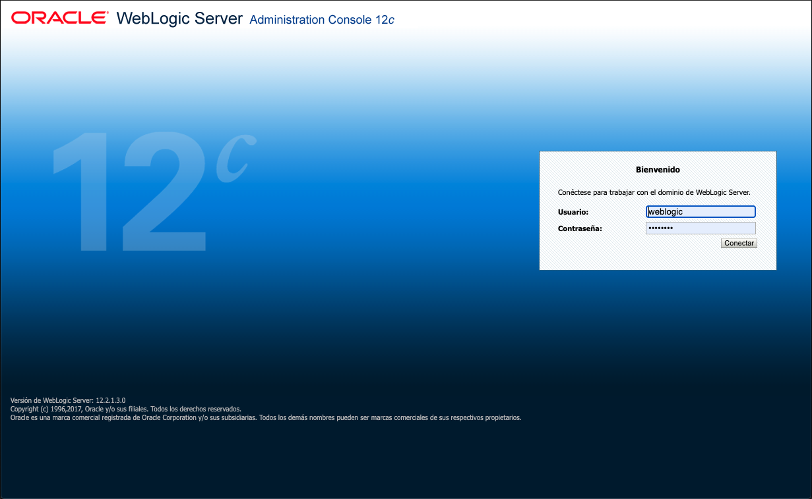
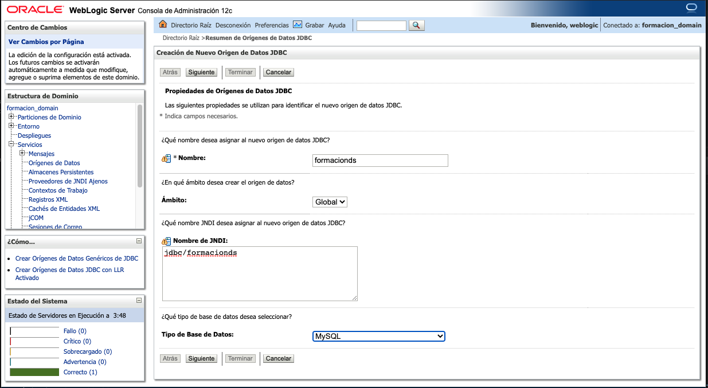
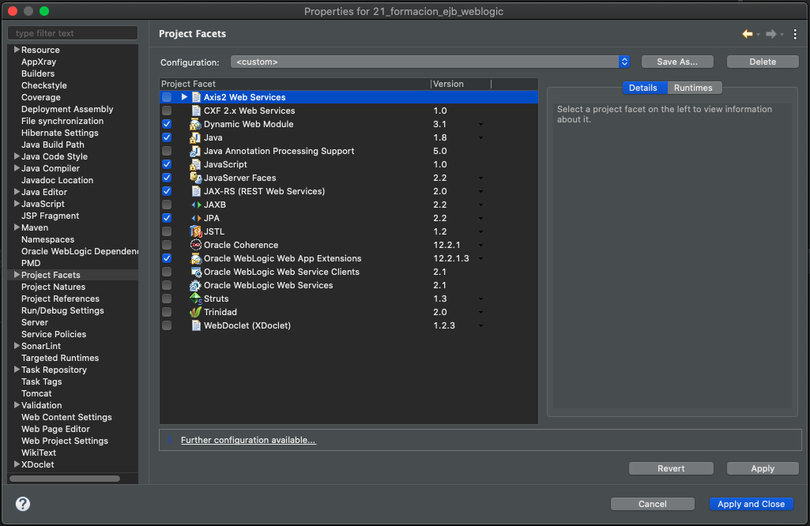
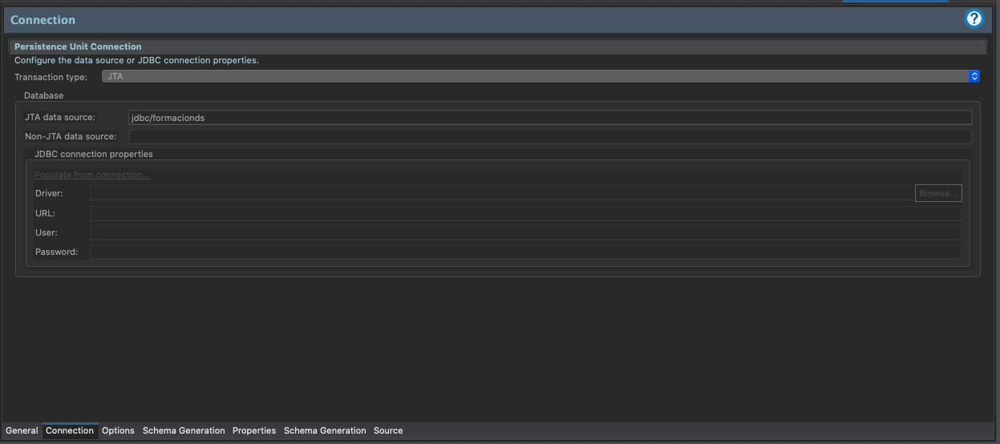
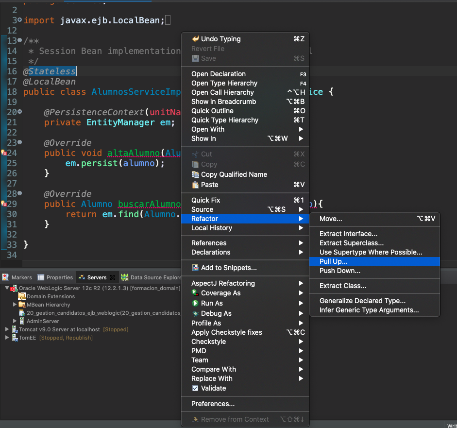
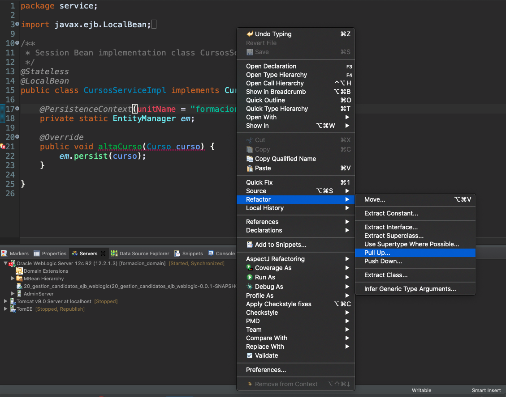
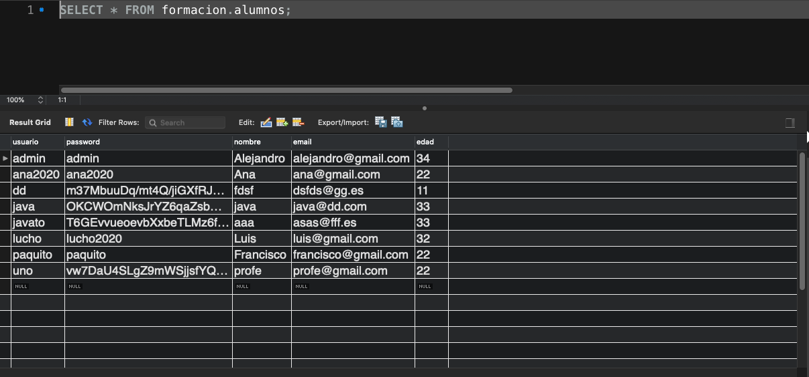
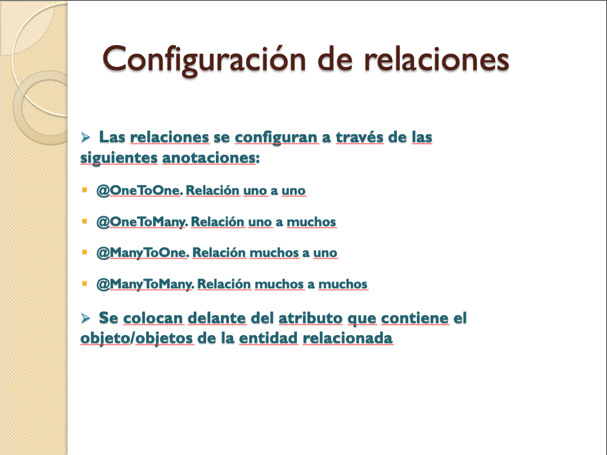
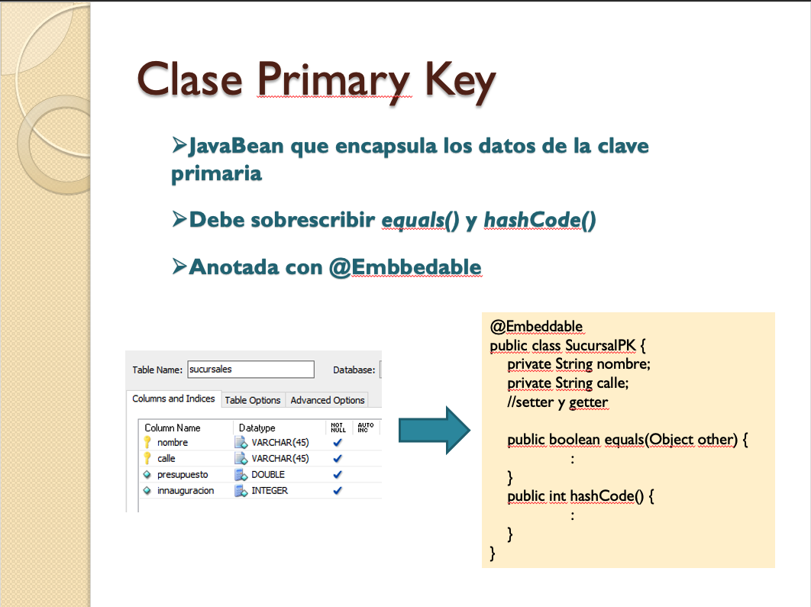

# 20201116 Lunes

## :computer: `21_formacion_ejb_weblogic`

Partiendo del proyecto `19_formacion_factoria` vamos a realizar una versión usando EJB.

### Creación del Data Source en WebLogic







### Creación Proyecto en Eclipse


### Mavenizar Proyecto


### Dar Características JPA



### Modificación del Archivo `persistence.xml`

Copiamos el archivo `persistence.xml` del proyecto `19_formacion_factoria` al actual pero tenemos que realizar algunos cambios, en el proyecto anterior la conexión a la BD la haciamos directamente pero con el uso de WebLogic ya vamos a usar el DataSource creado en el primer paso. Por lo que entramos en la pestaña Conexión y cambiamos los valores como se muestra en las siguientes imagenes.



Mientras que en la pestaña de General tenemos


El archivo `persistence.xml` nos queda así:

```html
<?xml version="1.0" encoding="UTF-8"?>
<persistence version="2.2" xmlns="http://xmlns.jcp.org/xml/ns/persistence" xmlns:xsi="http://www.w3.org/2001/XMLSchema-instance" xsi:schemaLocation="http://xmlns.jcp.org/xml/ns/persistence http://xmlns.jcp.org/xml/ns/persistence/persistence_2_2.xsd">
	<persistence-unit name="formacionPU" transaction-type="JTA">
		<provider>org.hibernate.jpa.HibernatePersistenceProvider</provider>
		<jta-data-source>jdbc/formacionds</jta-data-source>
		<class>model.Alumno</class>
		<class>model.Curso</class>
		<properties>			
			<property name="hibernate.transaction.jta.platform" value="org.hibernate.engine.transaction.jta.platform.internal.WeblogicJtaPlatform"/>				
		</properties>
	</persistence-unit>
</persistence>
```

Como descubrimos que existe un pequeño conflicto entre Hibernate y EJB se tuvo que poner la etiqueta `<properties>` para que trabajen correctamente.

Existe otra alternativa para no trabajar con Hibernate y usar el Motor de Persistencia que viene integrado en WebLogic que en este caso es **EclipseLink** para lo cual nuestro `persistence.xml` quedaría así:


**NOTA** *Las Entidades las copiamos directamente del proyecto `19_formacion_factoria`, no usamos el asistente para crear las Entidades.*

### Creación del EJB.

La lógica del Servicio del proyecto `19_formacion_factoria` es la siguiente:


Dos Clases con sus respectivas Interfaces y la clase de Factoria.

Todo este Servicio lo debemos implementar usando EJBs. 

Vamos a necesitar un EJB para `Alumnos` y otro para `Cursos` y el Factory ya no va a ser necesario ya que EJB nos lo proporciona implícitamente.


Como estamos partiendo de código ya desarrollado en otra aplicación vamos a copiar los métodos ya desarrollados en el servicio y lo vamos a meter en las Clases del EJB y lo vamos a adaptar.

Partimos de `AlumnosServiceImpl` del proyecto `19_formacion_factoria`:

`AlumnosServiceImpl`

```java
...

public class AlumnosServiceImpl implements AlumnosService {
	
   private static EntityManager em;
   static {
      EntityManagerFactory factory=Persistence.createEntityManagerFactory("formacionPU");
      em=factory.createEntityManager();
   }
   
   @Override
   public void altaAlumno(Alumno alumno) {
      EntityTransaction tx = em.getTransaction();
      tx.begin();
      em.persist(alumno);
      tx.commit();
   }
	
   @Override
   public Alumno buscarAlumnoPorUsuario(String usuario){
      return em.find(Alumno.class,usuario);
   }

}
```

Y adaptandola a EJBs nos queda así:

`AlumnosServiceImpl`

```java
...

@Stateless
@LocalBean
public class AlumnosServiceImpl implements AlumnosService {

	@PersistenceContext(unitName = "formacionPU")
	private EntityManager em;
	
	@Override
	public void altaAlumno(Alumno alumno) {
		em.persist(alumno);
	}
	
	@Override
	public Alumno buscarAlumnoPorUsuario(String usuario){
		return em.find(Alumno.class,usuario);
	}

}
```

Observaciones del EJB:

* La clase esta anotada con `@Stateless` lo que indica que es un EJB, también anotada con `@LocalBean`
* Eliminamos la Factoria y en su lugar Inyectamos directamente el `EntityManager` usando la anotación `@PersistenceContext(unitName = "formacionPU")`.
* Eliminamos todo lo referente a las transacciones.

Con todos estos cambios la clase reduce en gran medida su código.

Normalmente primero códificamos la Interface y luego la Clase pero en este caso hemos iniciado coiando el código en la Clase, para generar la Interface a partir de la Clase podemos usar la opción:




Realizamos los mismos pasos para el EJB de `Cursos`.




En este último paso no se debería haber usado el atributo `em`, solo se seleccionan los métodos.


Las Clases e Interfaces finales de los EJBs son:


Interface `AlumnosService`

```java
package service;

import javax.ejb.Local;

import model.Alumno;

@Local
public interface AlumnosService {
   Alumno buscarAlumnoPorUsuario(String usuario);
   void altaAlumno(Alumno alumno);
}
```

Clase `AlumnosServiceImpl`

```java
package service;

import javax.ejb.LocalBean;
import javax.ejb.Stateless;
import javax.persistence.EntityManager;
import javax.persistence.PersistenceContext;

import model.Alumno;

/**
 * Session Bean implementation class AlumnosServiceImpl
 */
@Stateless
@LocalBean
public class AlumnosServiceImpl implements AlumnosService {

   @PersistenceContext(unitName = "formacionPU")
   private EntityManager em;
	
   @Override
   public void altaAlumno(Alumno alumno) {
      em.persist(alumno);
   }
	
   @Override
   public Alumno buscarAlumnoPorUsuario(String usuario){
      return em.find(Alumno.class,usuario);
   }

}
```

Interface `CursosService`

```java
package service;

import javax.ejb.Local;
import model.Curso;

@Local
public interface CursosService {
   void altaCurso(Curso curso);
}
```

Clase `CursosServiceImpl`

```java
package service;

import javax.ejb.LocalBean;
import javax.ejb.Stateless;
import javax.persistence.EntityManager;
import javax.persistence.PersistenceContext;

import model.Curso;

/**
 * Session Bean implementation class CursosServiceImpl
 */
@Stateless
@LocalBean
public class CursosServiceImpl implements CursosService {

   @PersistenceContext(unitName = "formacionPU")
   private EntityManager em;
	
   @Override
   public void altaCurso(Curso curso) {
      em.persist(curso);
   }
   
}
```

### Modificar Controllers

Como hemos visto, con estos cambios el Factory a sido eliminado por lo que debemos hacer algunos cambios en nuestros Controladores que lo usaban así:

Originalmente teniamos:

```java
AlumnosService service =  FormacionFactory.getAlumnosService();
```

o

```java
CursoService service = FormacionFactory.getCursosService();
```

En lugar de Instanciar el Servicio con la Factoria, vamos a inyectar los EJBs dentro de los Action de la siguiente forma.

```java
...

@EJB
AlumnosService service;
protected void service(HttpServletRequest request, HttpServletResponse response) throws ServletException, IOException {
	...
```
o

```java
...

@EJB
CursosService service;
protected void service(HttpServletRequest request, HttpServletResponse response) throws ServletException, IOException {
	
	...
```

Simplemente usamos la anotación `@EJB` para inyectar el EJB.

### Vistas

Las Vistas no sufren ningún cambio.

### Probar la aplicación.





## Consultas JPA







