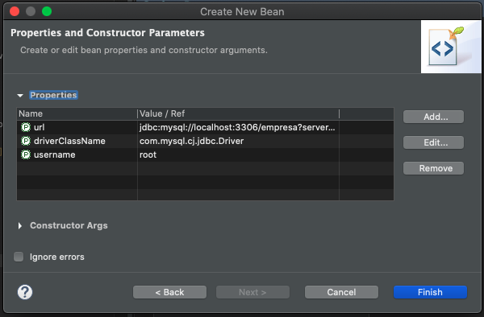
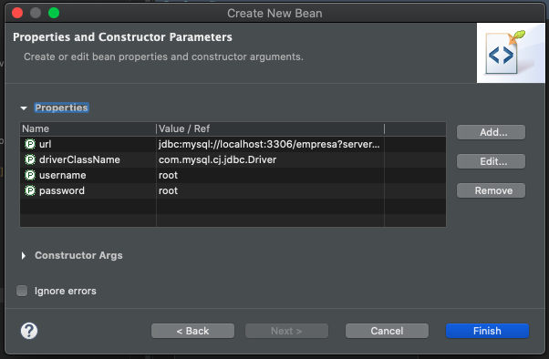

# 20201118 Miercoles

## :computer: `03_gestion_candidatos_basedatos`

   Vamos a partir del proyecto `13_gestion_candidatos_basedatos` el cual tiene una Clase Datos para realizar la conexión a la BD `empresa` y usa JDBC. Vamos a ver que nos aporta Spring para evolucionar esta aplicación.
   
### 01. Incorporar las Dependencias de Spring en el archivo `pom.xml`

`pom.xml`

```html
<dependencies>
  	<!-- https://mvnrepository.com/artifact/mysql/mysql-connector-java -->
	<dependency>
	    <groupId>mysql</groupId>
	    <artifactId>mysql-connector-java</artifactId>
	    <version>8.0.19</version>
	</dependency>
	<!-- https://mvnrepository.com/artifact/org.springframework/spring-core -->
	<dependency>
	    <groupId>org.springframework</groupId>
	    <artifactId>spring-core</artifactId>
	    <version>5.2.9.RELEASE</version>
	</dependency>
	<!-- https://mvnrepository.com/artifact/org.springframework/spring-context -->
	<dependency>
	    <groupId>org.springframework</groupId>
	    <artifactId>spring-context</artifactId>
	    <version>5.2.9.RELEASE</version>
	</dependency>
	<dependency>
	    <groupId>org.springframework</groupId>
	    <artifactId>spring-web</artifactId>
	    <version>5.2.9.RELEASE</version>
	</dependency>
  </dependencies>
```

### 02. Adaptar nuestra Capa de Servicio para que tenga Clase e Interfaz.

`CandidatosService`

```java
package service;

import java.util.List;
import model.Candidato;

public interface CandidatosService {
   void altaCandidato(Candidato candidato);
   void eliminarCandidato(int idCandidato);
   List<Candidato> recuperarCandidatos();
}
```

`CandidatosServiceImpl`

```java
package service;

import java.sql.Connection;
import java.sql.PreparedStatement;
import java.sql.ResultSet;
import java.sql.SQLException;
import java.util.ArrayList;
import java.util.List;

import javax.sql.DataSource;

import org.springframework.beans.factory.annotation.Autowired;
import org.springframework.beans.factory.annotation.Qualifier;
import org.springframework.stereotype.Service;

import model.Candidato;

@Service
public class CandidatosServiceImpl implements CandidatosService {
	
	@Override
	public void altaCandidato(Candidato candidato) {
		try(Connection con = datasource.getConnection()){
			String sql = "INSERT INTO candidatos(nombre, edad, puesto, foto, email)"
					   + " VALUES(?,?,?,?,?)";
			
			PreparedStatement st = con.prepareStatement(sql);
			st.setString(1, candidato.getNombre());
			st.setInt(2, candidato.getEdad());
			st.setString(3, candidato.getPuesto());
			st.setString(4, candidato.getFoto());
			st.setString(5, candidato.getEmail());
			st.execute();
					  
		}catch(SQLException ex) {
			ex.printStackTrace();
		}
	}
	
	@Override
	public void eliminarCandidato(int idCandidato) {
		try(Connection con = datasource.getConnection()){
			String sql = "DELETE FROM candidatos"
					   + " WHERE idCandidato = ?";
			
			PreparedStatement st = con.prepareStatement(sql);
			st.setInt(1, idCandidato);
			st.execute();
					  
		}catch(SQLException ex) {
			ex.printStackTrace();
		}
	}
	
	@Override
	public List<Candidato> recuperarCandidatos(){
		List<Candidato> candidatos = new ArrayList<>();
		
		try(Connection con = datasource.getConnection()){
			String sql = "SELECT * FROM candidatos";
			
			PreparedStatement st = con.prepareStatement(sql);
			ResultSet rs = st.executeQuery();
			while(rs.next()) {
				Candidato candidato = new Candidato(rs.getInt("idCandidato"),
						rs.getString("nombre"),
						rs.getInt("edad"),
						rs.getString("puesto"),
						rs.getString("foto"),
						rs.getString("email"));
				candidatos.add(candidato);
			}
			return candidatos;	  
		}catch(SQLException ex) {
			ex.printStackTrace();
			return null;
		}
	}

}
```

**Como esta Clase la debe instanciar Spring la anotamos con `@Service`.

### 03. Modificar los Servlets

* En lugar de Instanciar la Clase de Servicio que teniamos antes inyectamos la Interfaz creada con: 

   ```java
   @Autowired
   CandidatosService service;
   ```

   Esto lo hacemos en nuestros dos Servlets `AltaCandidato` y `EliminarCandidato`.

* Además debemos sobreescribir el método `init` en ambos Servlets.

   ```java
   @Override
	 public void init(ServletConfig config) throws ServletException {
      //le informa al servidor de aplicaciones que Spring va a realizar inyección
      //de objetos en este servlet
      SpringBeanAutowiringSupport.processInjectionBasedOnCurrentContext(this);
      super.init(config);
   }
   ```

### 04. Añadir la Configuración XML

* Añadir `web.xml` y añadir el registro del Listener.

   ```html
   <context-param>
      <param-name>contextConfigLocation</param-name>
      <param-value>/WEB-INF/springConfig.xml</param-value>
   </context-param>
   <listener>
      <listener-class>org.springframework.web.context.ContextLoaderListener</listener-class>
   </listener>
   ```

* Añadir el `springConfig.xml` (Usando el Pluging) o copiar de otro proyecto.

   ```html
   <!-- 1. Hailite la configuración mediante anotaciones -->
   <context:annotation-config />
	
	 <!-- 2. Escanee los paquetes en los que se encuentran las clases que debe instanciar -->
	 <context:component-scan base-package="service" />
   ```

### 05. Probar la Aplicación

Hasta aquí la Aplicación debe funcionar como lo hacia antes pero usando Spring.

**Hasta aquí el aporte de Spring es el mismo que en el proyecto anterior.**
**Spring instancia las Clases (anotadas con `@Service`) y las Inyecta donde las necesitemos**

## DataSources con Spring

**UNA DE LAS COSAS QUE NOS APORTA SPRING Y QUE SIN ESTE FRAMEWORK NO SE PUEDE HACER ES QUE CON SPRING LA PROPIA APLICACIÓN PUEDE CREAR UN DATASOURCE, SIN NECESIDAD DE DEPENDER DEL SERVIDOR DE APLICACIONES.** Pero si se prefiere usar el del Servidor de Aplicaciones se puede hacer.

Spring tiene una Clase para crear un DataSource con la misma eficiencia que el Servidor de Aplicaciones. 

Por lo tanto en nuestro proyecto importado podemos eliminar la Clase `Datos` y usar el DataSource de Spring.

Si se quiere usar una Clase de Spring no se crea con el `new` en ningún sitio. Las clases de Spring se crean en el archivo `springConfig.xml`. 

Pero primero que nada necesitamos añadir una nueva dependencia que es la que nos va a permitir usar los DataSources, esa **dependencia es `spring-jdbc`**:

```html
```

Podemos auxiliarnos de la pestaña `beans` para añadir los Objetos de Spring que necesitemos.







Lo que se ha generado en el archivo `springConfig.xml` es:

```html
<bean id="data" name="data" class="org.springframework.jdbc.datasource.DriverManagerDataSource">
   <property name="url" 
      value="jdbc:mysql://localhost:3306/empresa?serverTimezone=Europe/Madrid">
   </property>
   <property name="driverClassName"
      value="com.mysql.cj.jdbc.Driver">
   </property>
   <property name="username" value="root"></property>
   <property name="password" value="root"></property>
</bean>
```


