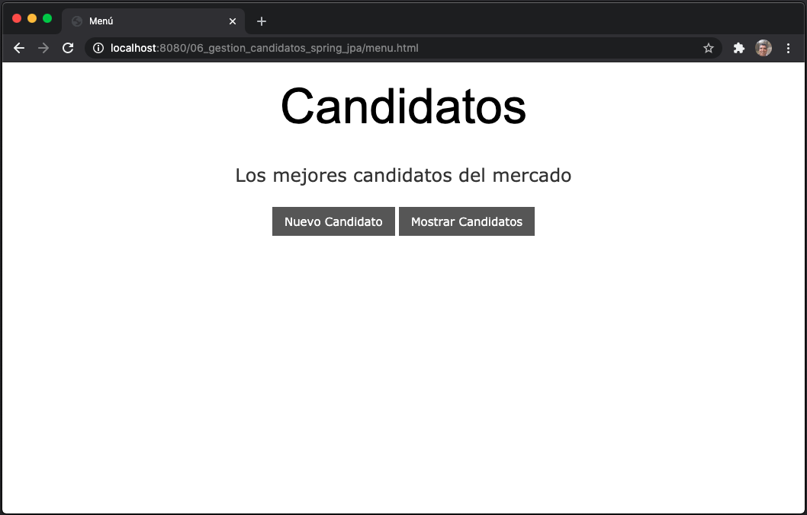
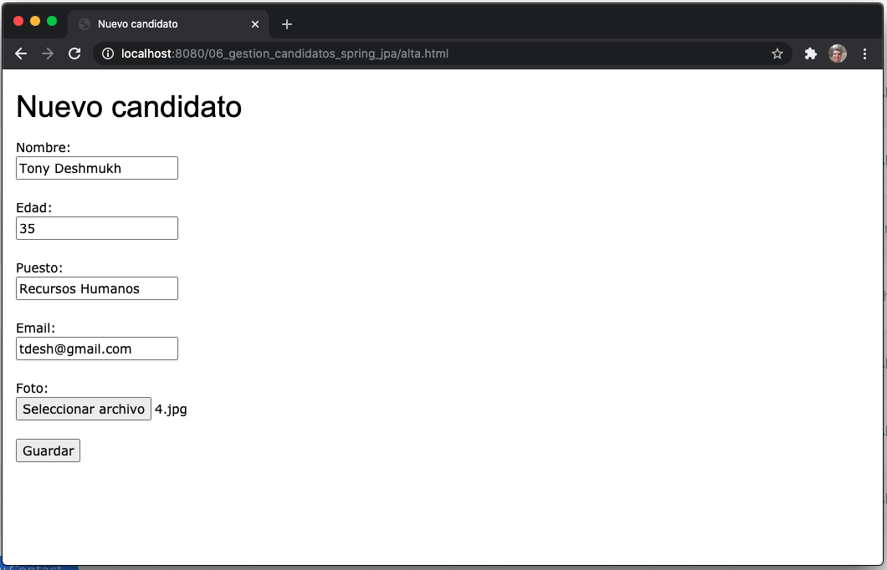
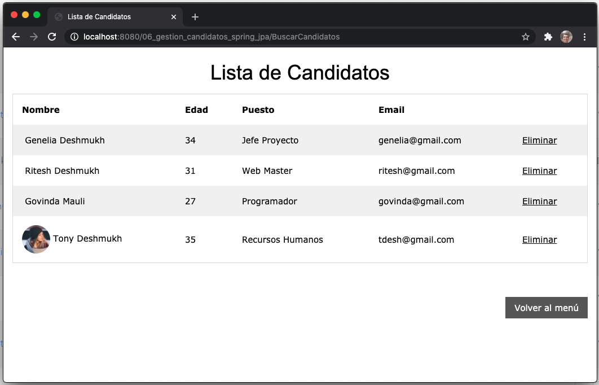
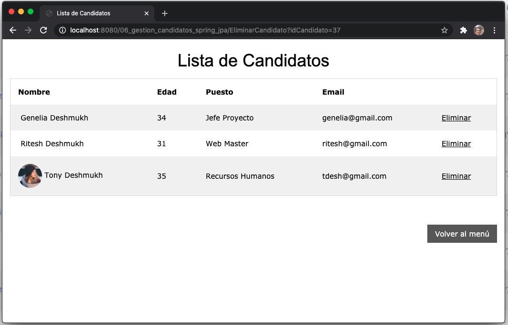
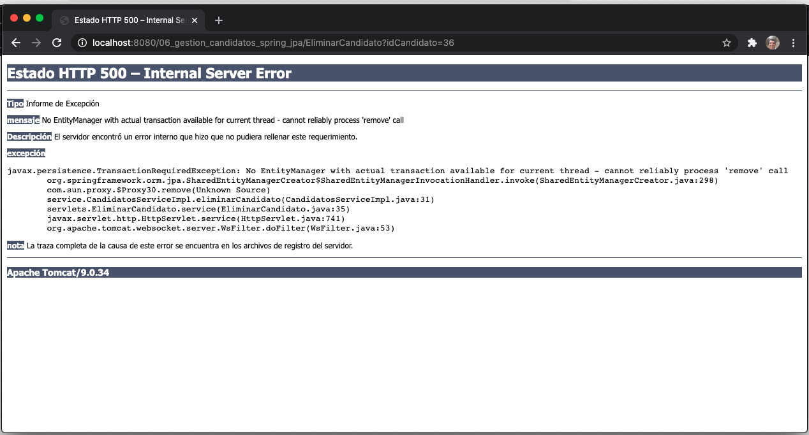
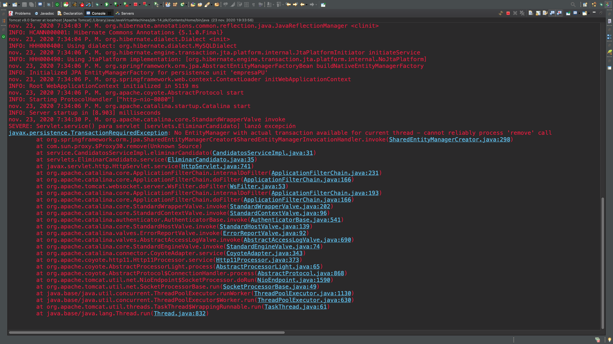

# 20201119 Jueves

## Spring - Persistencia


Spring no tiene un Framework de  Persistencia se integra con lo que ya existe en este caso con Hibernate.

Spring tiene un API especial para trabajar con Persistencia Spring-JPA, pero nosotros vamos a usar el Standar JPA desde las clases de Spring. Spring cuenta con un módulo ORM para manejar la persistencia facilitando su implementación, lo que nos proporcinaban los EJBs pero con Spring. Todo esto será configuración.

## :computer: `06_gestion_candidatos_spring_jpa`

Partiendo del ejemplo `03_gestion_candidatos_basedatos` vamos a hacer una nueva versión pero con Persistencia.

### 01. Dependencias

Vamos a eliminar la quitar la dependencia `spring-jdbc` y vamos a añadir las siguientes dependencias de Hibernate.

`pom.xml`

```html
<dependency>
   <groupId>org.springframework</groupId>
   <artifactId>spring-orm</artifactId>
   <version>5.2.9.RELEASE</version>
</dependency>
<dependency>
   <groupId>org.hibernate</groupId>
   <artifactId>hibernate-core</artifactId>
   <version>5.4.18.Final</version>
</dependency>
```

### 02. Añadir Manualmente Anotaciones al JavaBean para convertirlo en Entidad

Podríamos haber usado el asistente y tendríamos que activar las caracteristicas JPA que a su vez nos añade el archivo `persistence.xml`. Pero en este ejercicio en particular podemos manualmente las anotaciones ya que al usar Spring ya no se usa el archivo `persistence.xml`.

**CON SPRING TENEMOS LA VENTAJA DE QUE YA NO VAMOS A USAR EL ARCHIVO `persistence.xml` TODA LA CONFIGURACIÓN SE HACE DENTRO DE SPRING EN `springConfig.xml`**

Por lo que lo que tenemos que añadir es lo siguiente:

`Candidato`

```
...
@Entity
@Table(name = "candidatos")
public class Candidato {
   @Id
   @GeneratedValue(strategy = GenerationType.IDENTITY)
   private int idCandidato;
	 ...
   
   //Añadir Constructores sin parámetros
   public Candidato() {
		
	}
```

### 03. Modificar la Capa de Servicio para Manejar Persistencia. Anotación `@Transactional`

Tenemos 
`CandidatosServiceImpl`

```java
@Autowired
@Qualifier("data3")
DataSource datasource;
	
@Override
public void altaCandidato(Candidato candidato) {
   try(Connection con = datasource.getConnection()){
      String sql = "INSERT INTO candidatos(nombre, edad, puesto, foto, email)"
                 + " VALUES(?,?,?,?,?)";
			
      PreparedStatement st = con.prepareStatement(sql);
      st.setString(1, candidato.getNombre());
      st.setInt(2, candidato.getEdad());
      st.setString(3, candidato.getPuesto());
      st.setString(4, candidato.getFoto());
      st.setString(5, candidato.getEmail());
      st.execute();
					  
   }catch(SQLException ex) {
      ex.printStackTrace();
   }
}
	
@Override
public void eliminarCandidato(int idCandidato) {
   try(Connection con = datasource.getConnection()){
      String sql = "DELETE FROM candidatos"
                 + " WHERE idCandidato = ?";
			
      PreparedStatement st = con.prepareStatement(sql);
      st.setInt(1, idCandidato);
      st.execute();		  
   }catch(SQLException ex) {
      ex.printStackTrace();
   }
}
	
@Override
public List<Candidato> recuperarCandidatos(){
   List<Candidato> candidatos = new ArrayList<>();
		
   try(Connection con = datasource.getConnection()){
      String sql = "SELECT * FROM candidatos";
			
      PreparedStatement st = con.prepareStatement(sql);
      ResultSet rs = st.executeQuery();
      while(rs.next()) {
         Candidato candidato = new Candidato(rs.getInt("idCandidato"),
         rs.getString("nombre"),
         rs.getInt("edad"),
         rs.getString("puesto"),
         rs.getString("foto"),
         rs.getString("email"));
         candidatos.add(candidato);
      }
      return candidatos;	  
   }catch(SQLException ex) {
      ex.printStackTrace();
      return null;
   }
}
```

Lo vamos a cambiar para usar Persistencia.

`CandidatosServiceImpl`

```java
@Service
public class CandidatosServiceImpl implements CandidatosService {
	
   @PersistenceContext(name="empresaPU")
   EntityManager em;

   @Transactional
   @Override
   public void altaCandidato(Candidato candidato) {
      em.persist(candidato);
   }
	
   @Transactional
   @Override
   public void eliminarCandidato(int idCandidato) {
      Candidato candidato = em.find(Candidato.class, idCandidato);
      if(candidato != null) {
         em.remove(candidato);
      }
   }
	
   @Override
   public List<Candidato> recuperarCandidatos(){
      String jpql = "Select c FROM Candidato c";
      TypedQuery<Candidato> query = em.createQuery(jpql, Candidato.class);
      return query.getResultList();
   }
}
```

Observaciones:

* Cambiamos el uso de `DataSource` por `EntityManager`.
* El `EntityManager` esta anotado con `@PersistenceContext(name="empresaPU")`
* Ya veremos donde se configura el `empresaPU`
* Spring se encarga de la Transaccionalidad primero vamos a probar sin ponerla por lo que se debe poner la etiqueta `@Transaccional` (De Spring, no de `javax.persistence`), cambia con respecto a EJBs donde no poniamos nada pero se encargaban también de la Transaccionalidad. 
* Al iniciar el método inicia la Transacción al finalizar el método finaliza la Transacción. Se pone solo en las Operaciones de Acción.
* Por defecto JPA te obliga a que todas las operaciones de acción esten dentro de una Trnasacción `@Transaccional`, aunque solo sea una sentencia. (Puede ser que haya operaciones en cascada aun que creamos que es solo un simple persist por eso va en la transacción).
* En EJB siempre se hacia la transacción (aun que hay una forma de decirle que no lo haga) aquí nosotros decidimos donde se hace la Transacción.
* Como no usamos el asistente no se insertarón los NamedQuery pero los podría añadir manualmente.
* `@Transactional` tiene parámetros para indicar funcionamientos particulares de la transacción, por default al iniciar el método se abre y se cierra al final del método.

En cuanto al código es todo lo que necesitamos hacer, en el Controlor no afecta nada.

### 04. Configuración XML.

Con Spring ya no manejamos el archivo `persistence.xml`, se configurara en `springConfig.xml`.

En `springConfig.xml` vamos a añadir lo siguiente:

```html
   <!-- configuración integración Spring-JPA-Hibernate -->
   <!-- creación adaptador JPA-Hibernate -->
   <bean id="adapter" class="org.springframework.orm.jpa.vendor.HibernateJpaVendorAdapter">
      <property name="databasePlatform" 
                value="org.hibernate.dialect.MySQLDialect">
      </property>
   </bean>	

   <!-- configuración JPA -->
   <bean id="factory"
		  class="org.springframework.orm.jpa.LocalContainerEntityManagerFactoryBean">
      <property name="persistenceUnitName" value="empresaPU"></property>
      <property name="dataSource" ref="data3"></property>
      <property name="jpaVendorAdapter" ref="adapter"></property>
      <property name="packagesToScan" value="model"></property>
   </bean>
	
   <!-- transaccionalidad -->
   <!-- crea el objeto encargado de la transacción -->
   <bean id="txManager"
      class="org.springframework.orm.jpa.JpaTransactionManager">
      <property name="entityManagerFactory" ref="factory"></property>
   </bean>
	
   <!-- habilita la transaccionalidad mediante anotaciones -->
   <tx:annotation-driven transaction-manager="txManager"/>
```

Observaciones:

Todos estos beans los podríamos añadir con la pestaña `beans` e ir dando sus valores uno a uno, en este caso lo hemos copiado de otro ejemplo y simplemente los adaptamos.

1. Definir el adaptador.
   * El Adaptador es una Clase de Spring para trabajar con JPA-Hibernate, JPA-TopLink dependiendo del API-Motor, como nosotros vanos a trabajar con Hibernate la clase es `HibernateJpaVendorAdapter`. 
   * En la propiedad debemos indicar con que BD vamos a trabajar. 
   * La propiedad es `databasePlatform` con un valor `org.hibernate.dialect.MySQLDialect`.

2. Configuración JPA.
   * Como `persistence.xml` ha desaparecido esta parte juega ese papel. 
   * Se configura a través del objeto `LocalContainerEntityManagerFactoryBean`.
   * Cuenta con la propiedad `persistenceUnitName` con un valor `value="empresaPU"` para indicar el nombre de la Unidad de Persistencia.
   * Propiedad `dataSource` con ref a `ref="data3"`, indicamos cual DataSource definido previamente que vamos a utilizar. ¿Solo podemos usar DataSources?
   * Propiedad `jpaVendorAdapter` referenciado a `ref="adapter"` indicamos cual Adaptador definido previamente que vamos a utilizar.
   * Propiedad `packagesToScan` con valor `value="model"` para indicar que paquetes debe Scanear Spring.
   
3. Transaccionalidad, crea el objeto encargado de la transacción. 
   * La Transaccionabilidad la gestiona Spring pero no es mágico. Hay que decirle a Spring que vamos a usar Transaccionabilidad. 
   * Hay que crear un objeto `JpaTransactionManager` para que gestione la Transaccionabilidad. (Para JDBC es otro Objeto).
   * Definimos la propiedad `entityManagerFactory` con referencia a `ref="factory"` es decir lo definido para la configuración JPA previamente.

4. Habilita la transaccionalidad mediante anotaciones.
   * Hay que habilitar el NameSpace `tx`.
   * Tiene el atributo `transaction-manager="txManager"` que apunta al Objeto creado previamente.
   

CON ESTO HEMOS INTEGRADO EL ACCESO A DATOS JPA CON SPRING.

VENTAJAS

* Lo que ya usabamos con EJBs. Transaccionabilidad automatica, etc.
* Inyección de Dependencia con Clases Normales.

DESVENTAJAS 

* La Configuración es más larga pero más concentrada.

### 05. Probar la Aplicación.






Si no hubiesemos puesto la anotación `@Transactional` tendríamos los siguientes errores al al intentar eliminar o dar de alta un candidato. Por lo que `@Transactional` es obligatoria en Operaciones de Acción.





## :computer: `07_gestion_candidatos_ofertas_jpa`

Partiendo del ejercicio `05_gestion_candidatos_ofertas` (varias entidades) vamos a crear la versión con Spring con JPA.


