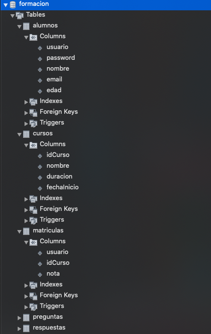
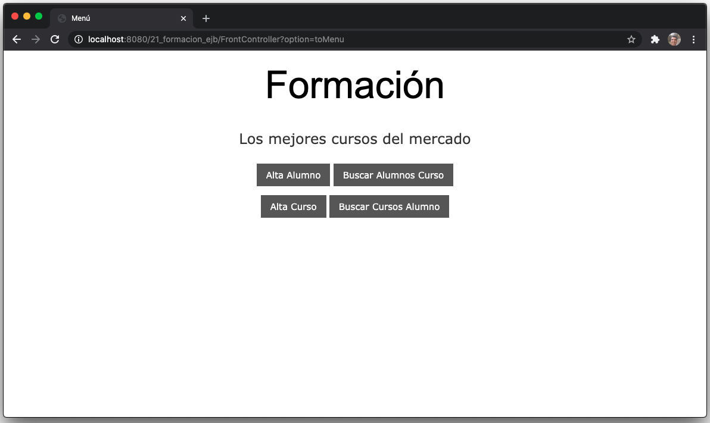
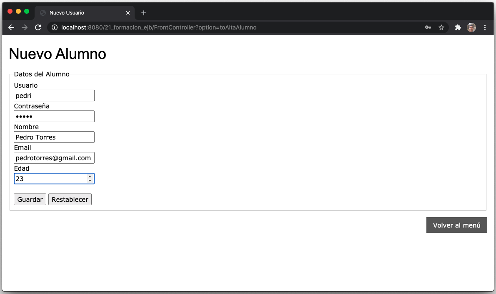
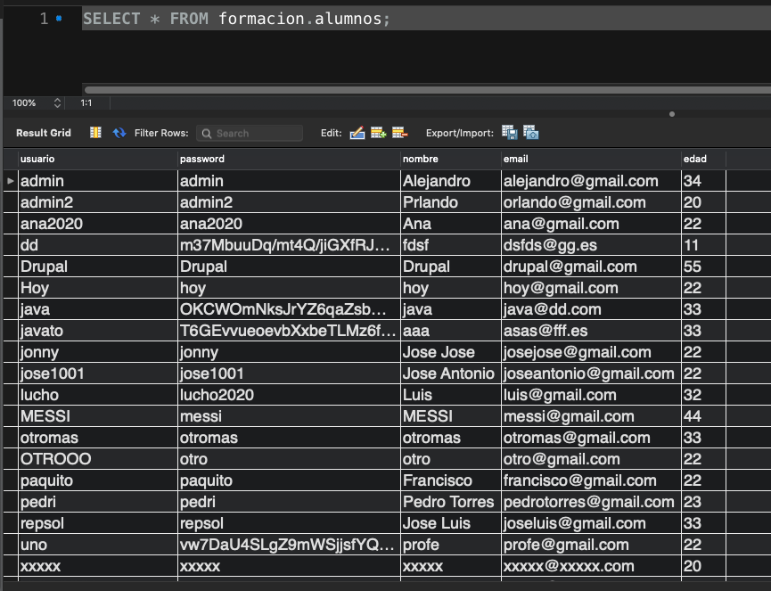
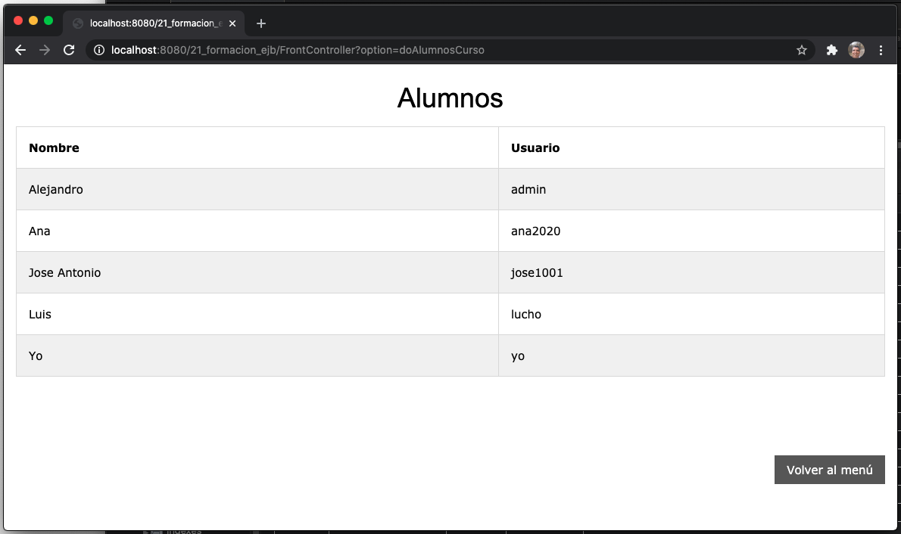

# 20201123 Lunes.

## :computer: `10`<br/>&nbsp;&nbsp;&nbsp;&nbsp;&nbsp;&nbsp;&nbsp;&nbsp;&nbsp;**Segundo Ejemplo Relación Muchos A Muchos**

Partiendo del ejemplo `23_formacion_ejb_weblogic_v2` el cual estaba realizado con EJBs y tenia tres entidades `alumnos`, `matriculas` y `cursos` con RELACIÓN UNO A MUCHOS y RELACIÓN MUCHOS A UNO, lo vamos a transformar para que en lugar de usar EJBs use Spring y en lugar de tres entidades solo maneje dos `alumnos` y `cursos` con una RELACIÓN MUCHOS A MUCHOS.

### 01. Mavenizar Proyecto y poner Dependencias

Necesitamos poner las dependencias que se listan a continuación. Con EJBs solo necesitabamos `hibernate-core`, con Spring necesitamos ademas de `hibernate-core` necesitamos `mysql-connector-java` por que no la tenemos en el Tomcat, y las dependencias de Spring `spring-core`, `spring-context`, `spring-web`, `spring-orm`.

`pom.xml`

```html
<dependencies>
   <!-- https://mvnrepository.com/artifact/mysql/mysql-connector-java -->
   <dependency>
      <groupId>mysql</groupId>
      <artifactId>mysql-connector-java</artifactId>
      <version>8.0.19</version>
   </dependency>
   <!-- https://mvnrepository.com/artifact/org.springframework/spring-core -->
   <dependency>
      <groupId>org.springframework</groupId>
      <artifactId>spring-core</artifactId>
      <version>5.2.9.RELEASE</version>
   </dependency>
   <!-- https://mvnrepository.com/artifact/org.springframework/spring-context -->
   <dependency>
      <groupId>org.springframework</groupId>
      <artifactId>spring-context</artifactId>
      <version>5.2.9.RELEASE</version>
   </dependency>
   <dependency>
      <groupId>org.springframework</groupId>
      <artifactId>spring-web</artifactId>
      <version>5.2.9.RELEASE</version>
   </dependency> 
   <dependency>
      <groupId>org.springframework</groupId>
      <artifactId>spring-orm</artifactId>
      <version>5.2.9.RELEASE</version>
   </dependency>
   <!-- https://mvnrepository.com/artifact/org.hibernate/hibernate-core -->
   <dependency>
      <groupId>org.hibernate</groupId>
      <artifactId>hibernate-core</artifactId>
      <version>5.4.18.Final</version>
   </dependency>	
</dependencies>
```

### 02. Generación de Entidades `Alumnos` y `Cursos`

Las tablas que tenemos son las siguientes:



Podemos elimianr las entidades del proyecto anterior y generar las entidades con el asistente. El resultado es el siguiente:

`Alumno` **Entidad Propietaria**

```java
package model;

import java.io.Serializable;
import javax.persistence.*;
import java.util.List;

@Entity
@Table(name="alumnos")
@NamedQuery(name="Alumno.findAll", query="SELECT a FROM Alumno a")
public class Alumno implements Serializable {
   private static final long serialVersionUID = 1L;
   @Id
   private String usuario;

   private int edad;
   private String email;
   private String nombre;
   private String password;

   //bi-directional many-to-many association to Curso
   @ManyToMany
   @JoinTable(name = "matriculas",  //Tabla de union 
      joinColumns = @JoinColumn(name="usuario",referencedColumnName = "usuario"), //Join-prop: Alumnos
      inverseJoinColumns = @JoinColumn(name="idCurso",referencedColumnName ="idCurso")) //Join-inv: Cursos	 
   private List<Curso> cursos;

   public Alumno() {
   }
	
   public Alumno(String usuario, int edad, String email, String nombre, String password) {
      super();
      this.usuario = usuario;
      this.edad = edad;
      this.email = email;
      this.nombre = nombre;
      this.password = password;
   }

   public String getUsuario() {
      return this.usuario;
   }

   public void setUsuario(String usuario) {
      this.usuario = usuario;
   }

   public int getEdad() {
      return this.edad;
   }

   public void setEdad(int edad) {
      this.edad = edad;
   }

   public String getEmail() {
      return this.email;
   }

   public void setEmail(String email) {
      this.email = email;
   }

   public String getNombre() {
      return this.nombre;
   }

   public void setNombre(String nombre) {
      this.nombre = nombre;
   }

   public String getPassword() {
      return this.password;
   }

   public void setPassword(String password) {
      this.password = password;
   }

   public List<Curso> getCursos() {
      return this.cursos;
   }

   public void setCursos(List<Curso> cursos) {
      this.cursos = cursos;
   }

}
```

Observaciones de `Alumno` **Entidad Propietaria**

* Por ser la Entidad propietaria tiene la anotación `@JoinTable(name = "matriculas",` la cual hace referecia a la JoinTable que es "matriculas". 
* Dentro de `@JoinTable` tenemos los atributos
   * `joinColumns` para indicar la relación entre la tabla "matriculas" con la tabla "alumnos"
   * `inverseJoinColumns` para indicar la relación entre la tabla "matriculas" con la tabla "cursos"


`Curso`

```java
package model;

import java.io.Serializable;
import javax.persistence.*;
import java.util.Date;
import java.util.List;

@Entity
@Table(name="cursos")
@NamedQuery(name="Curso.findAll", query="SELECT c FROM Curso c")
public class Curso implements Serializable {
   private static final long serialVersionUID = 1L;

   @Id
   @GeneratedValue(strategy=GenerationType.IDENTITY)
   private int idCurso;

   private int duracion;

   @Temporal(TemporalType.DATE)
   private Date fechaInicio;

   private String nombre;

   //bi-directional many-to-many association to Alumno
   @ManyToMany(mappedBy="cursos")
   private List<Alumno> alumnos;

   public Curso() {
   }
	
   public Curso(int idCurso, int duracion, Date fechaInicio, String nombre) {
      super();
      this.idCurso = idCurso;
      this.duracion = duracion;
      this.fechaInicio = fechaInicio;
      this.nombre = nombre;
   }

   public int getIdCurso() {
      return this.idCurso;
   }

   public void setIdCurso(int idCurso) {
      this.idCurso = idCurso;
   }

   public int getDuracion() {
      return this.duracion;
   }

   public void setDuracion(int duracion) {
      this.duracion = duracion;
   }

   public Date getFechaInicio() {
      return this.fechaInicio;
   }

   public void setFechaInicio(Date fechaInicio) {
      this.fechaInicio = fechaInicio;
   }

   public String getNombre() {
      return this.nombre;
   }

   public void setNombre(String nombre) {
      this.nombre = nombre;
   }

   public List<Alumno> getAlumnos() {
      return this.alumnos;
   }

   public void setAlumnos(List<Alumno> alumnos) {
      this.alumnos = alumnos;
   }

}
```

### 03. Capa de Servicio

Aquí hemos cambiado los EJBs por Clases Spring con sus respectivas Interfaces.

`AlumnosService`

```java
package service;

import java.util.List;

import model.Alumno;

public interface AlumnosService {

   void altaAlumno(Alumno alumno);

   Alumno buscarAlumnoPorUsuario(String usuario);
   List<Alumno> alumnosCurso(int idCurso);
   List<Alumno> alumnos();
   void matricularAlumno(String usuario,int idCurso);
}
```

`AlumnosServiceImpl`

```java
package service;

import java.util.List;

import javax.persistence.EntityManager;
import javax.persistence.PersistenceContext;
import javax.persistence.TypedQuery;

import org.springframework.beans.factory.annotation.Autowired;
import org.springframework.stereotype.Service;
import org.springframework.transaction.annotation.Transactional;

import model.Alumno;
import model.Curso;

@Service
public class AlumnosServiceImpl implements AlumnosService {
   @Autowired
   CursosService service;
	
   @PersistenceContext(unitName = "formacionPU")
   private  EntityManager em;
	
   @Transactional
   @Override
   public void altaAlumno(Alumno alumno) {
      em.persist(alumno);
   }
   @Override
   public Alumno buscarAlumnoPorUsuario(String usuario) {
      return em.find(Alumno.class, usuario);
   }
	
   @Override
   public List<Alumno> alumnosCurso(int idCurso) {
      //String jpql="Select a From Alumno a join a.matriculas m where m.curso.idCurso=?1";
      String jpql="Select a From Alumno a join a.cursos c where c.idCurso=?1";
      TypedQuery<Alumno> query=em.createQuery(jpql,Alumno.class);
      query.setParameter(1, idCurso);
      return query.getResultList();
   }
   @Override
   public List<Alumno> alumnos() {
      TypedQuery<Alumno> query=em.createNamedQuery("Alumno.findAll",Alumno.class);
      return query.getResultList();
   }
   @Transactional
   @Override
   public void matricularAlumno(String usuario, int idCurso) {
      Alumno alumno=buscarAlumnoPorUsuario(usuario);
      Curso curso=service.recuperarCurso(idCurso);
      alumno.getCursos().add(curso);
      em.merge(alumno);	
   }
}
```

Observaciones de `AlumnosServiceImpl`
*
*
*

`CursosService`

```java
package service;

import java.util.List;
import model.Curso;

public interface CursosService {

   void altaCurso(Curso curso);
   List<Curso> obtenerCursos();
   List<Curso> cursosAlumno(String usuario);
   List<Curso> cursosDisponibles(String usuario);
   Curso recuperarCurso(int idCurso);
}
```

`CursosServiceImpl`

```java
```

Observaciones de `CursosServiceImpl`

### 04. Configuración de Archivos XMl

`web.xml`

```html
```

`springConfig.xml`
```html
```

### 05. Cambios en los Actions

En los Actions antes inyectabamos los EJBs de la siguiente forma:

```java
@EJB
AlumnosService service;
protected void service(HttpServletRequest request, HttpServletResponse response) throws ServletException, IOException {	
...
```

Al ya no usar EJBs esto lo debemos campiar para inyectar nuestra capa de Servicio realizada con Spring, además debemos sobreescribir el método `init` de los Servlets para informar al servidor de aplicaciones que Spring va a realizar inyección de objetos en este servlet

```java
@Autowired
AlumnosService service;

@Override
public void init(ServletConfig config) throws ServletException {
   //le informa al servidor de aplicaciones que Spring va a realizar inyección
	 //de objetos en este servlet
	 SpringBeanAutowiringSupport.processInjectionBasedOnCurrentContext(this);
   super.init(config);
}

protected void service(HttpServletRequest request, HttpServletResponse response) throws ServletException, IOException {
...		
```

Este cambio lo hacemos en todos los Actions que nos marcan error. En el caso del Action `AlumnosNotaAction` este lo vamos a elimanar por que en este ejemplo no estamos usando las notas.

### 06. Cambios en el Controller

Como hemos eliminado el Action `AlumnosNotaAction` eliminamos la opción `doAlumnosNota` y `toNota`.


```java
...
case "doAlumnosNota":
			request.getRequestDispatcher("AlumnosNotaAction").include(request, response);
			url="alumnosnota.jsp";
			break;
...      
case "toNota":
			url="nota.html";
			break;
...
```

### 07. Cambios enlas Vistas.

Eliminamos las vistas `alumnosnota.jsp` y `nota.html` y de `menu.html` eliminamos la opción `Buscar Alumnos Nota`.

### 08. Probar la Aplicación.









``
```java
```

``
```java
```

