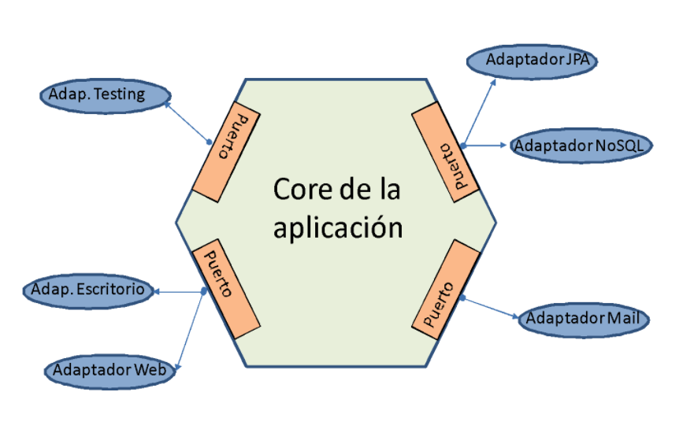

# 20201130 Lunes

## Arquitectura Hexagonal

La arquitectura hexagonal, también conocida como arquitectura de puertos y adaptadores, tiene como objetivo aislar toda la lógica de aplicación del exterior, haciendo independiente de mecanismos de entrada y salida, sistemas de almacenamiento de datos, políticas de seguridad, etc. 

### El Hexágono

El esquema de esta arquitectura se representa en forma de hexágono, no porque tenga que tener seis lados exactamente, sino porque es una forma de marcar la frontera entre el interior (la lógica de negocio) y el exterior.

En el centro del hexágono encontramos el dominio, formado por las entidades que representan nuestro modelo de datos y la definición de los repositorio de datos y funcionalidades de la aplicación (interfaces de servicio).

Por encima del dominio están los **casos de uso o lógica de aplicación**, que no son más que implementaciones de las interfaces de servicio con la lógica de aplicación. Todo ello, independizado de los mecanismos utilziados para el acceso a los datos, así como de la interacción con los usuarios.

Por encima de los casos de uso encontramos los adaptadores, que ya contienen detalles específicos de la infraestructura. Estos elementos se consideran ya fuera del hexagono al ser dependientes del exterior.

### Puertos y Adaptadores

A la arquitectura hexagonal se le conoce también como **puertos y adaptadores** porque esta basada en dicho concepto.

Un puerto no es más que la especificación sobre como el exterior intereactúa con la aplicación. A nivel de código, los puertos se definen mediante interfaces. En este sentido distinguimos dos tipos de puertos:

* **Primarios**. Se trata de las interfaces que definen  la funcionalidad del sistema, podriamos decir que son las interfaces de servicio y son implementadas en el interior del hexágono. Estas interfaces son **usadas por los adaptadores primarios**. 

* **Secundarios**. Sirven de interfaz de salida para comunicarse con sistemas externos, como bases de datos. Estas interfaces son **implementadas por los adaptadores secundarios**.

Un adaptador es una **implementación de la interfaz del puerto** para una infraestructura específica. Por ejemplo, un ejemplo de adaptador sería una clase que implementase la interfaz secundaria de datos para proporcionar acceso a una capa de persistencia JPA. Otro ejemplo sería un controlador REST, que utilizase el puerto de la interfaz de servicio para exponer la funcionalidad al exterior en forma de recursos Web.

Un puerto puede ser implementado por múltiples adaptadores.

La siguiente imagen muestra otra visión de la arquitectura hexagonal, más orientada al concepto de puertos y adaptadores:

### Otras arquitecturas

Existen otras variantes de la arquitectura hexagonal, como son:

* **Aquitectura de capas o de cebolla**. Consiste en definir la aplicación en forma de capas, de dentro hacia afuera, donde las capas más externas dependen de las más internas, pero nunca al revés, siguiendo el principio de inversión de dependencias.
En la capa central se encuentra el dominio o core, por encima de este el repositorio y en una tercera capa superior la lógica de negocio. En la capa más externa tendríamos la parte de la aplicación que se comunica con el exterior (base de datos, usuario, ...)

* **Arquitectura limpia**. No es más que una unión de la arquitectura de capas y la hexagonal que se basa en el mismo principio de abstraer la aplicación de los detalles de comunicación con el exterior.

