# 20201211 Viernes

## Angular JS

Angular JS tiene las siguientes características:

* Orientado a MVC
* Extensión HTML: Nos proporciona un juego de atributos que se aplican a las etiquetas HTML para dotarlas de dinamismo.

## :computer: `01_ejemplos_angularjs` **Primer Proyecto AngulaJS Sin Java**

Vamos a crear un nuevo proyecto Static Web Proyect donde vamos a crear varios ejemplos AngularJS. Estos ejemplos solo contienen la capa de vistas.

`01_paginasimple.html`

En este ejemplo según vamos escribiendo en las cajas de texto en otra parte de la pantalla se va mostrando esa información.

```html
<!DOCTYPE html>
<html>
<head>
<meta charset="ISO-8859-1">
<title>01_paginasimple</title>
<script src="https://ajax.googleapis.com/ajax/libs/angularjs/1.6.9/angular.min.js"></script>
</head>
<body>
   <div ng-app="">
      Introduce Nombre:<input type="text" ng-model="nombre"/><br/><br/>
      Introduce Edad:<input type="text" ng-model="edad"/><br/><br/>
      <div>
         Te llamas: {{nombre}} y tienes: {{edad}}  años
      </div>
   </div>
</body>
</html>
```

Observaciones de `01_paginasimple.html`

* La vista tiene que estar bajo el dominio de AngularJS esto se hace con el atributo `ng-app=""` que normalmente tiene un nombre pero como no tiene "controlador" (código JS) no es necesario darle ese nombre.

Probar el ejemplo:

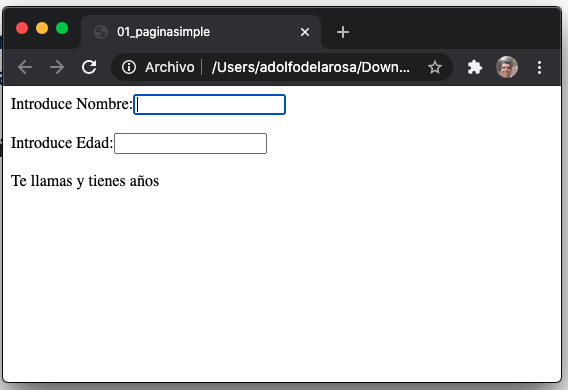
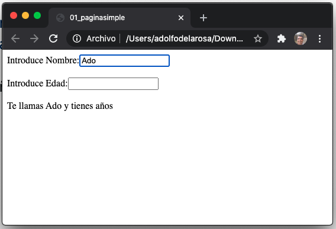
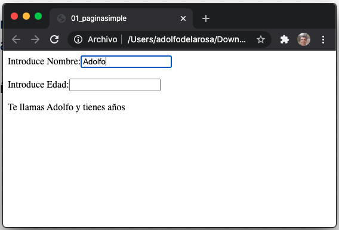

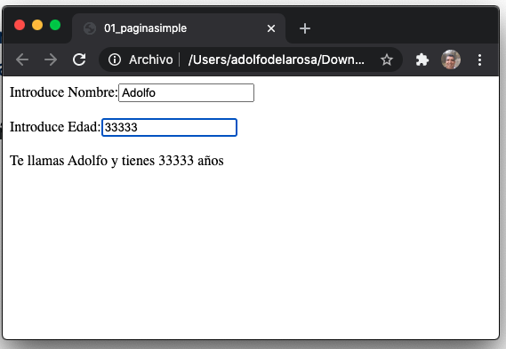

`02_nuevapagina.html`

```html
<!DOCTYPE html>
<html>
<head>
<meta charset="ISO-8859-1">
<title>02_nuevapagina</title>
<script src="https://ajax.googleapis.com/ajax/libs/angularjs/1.6.9/angular.min.js"></script>
</head>
<body>
   <div ng-app="app1" ng-controller="controller1">
      <select ng-model="seleccionado">
         <option ng-repeat="p in personas" value="{{p.edad}}">{{p.nombre}}</option>
      </select>
      <br/><br/>
      Edad seleccionada:{{seleccionado}}
      <br/><br/>
      <button type="button" ng-click="imprimir()">Pulsar</button>
   </div>
	
   <script type="text/javascript">
      var app=angular.module("app1",[]);
      app.controller("controller1",function($scope){
         $scope.seleccionado="";
			
         $scope.personas=[{"nombre":"test1","edad":30},{"nombre":"test2","edad":45}];

         $scope.imprimir=function(){
            alert("pulsado");
         }
      });
   </script>
</body>
</html>
```

En este ejemplo ya contamos con un Controller AngularJS que es el código JS que tenemos en el bloque JS.
* Le damos el nombre `app1` a la aplicación
* Al controlador le damos el nombre `controller1`
* Dentro del control definimos la variable `seleccionado` con ambito `$scope`
* Definimos un array `personas` con ambito `$scope`
* Definimos la función `imprimir` con ambito `$scope`

Para el código HTML hacemos lo siguiente:

* Definimos una división bajo el control de `controller1` con el atributo `ng-controller`
* Con el atributo `ng-model="seleccionado"` relacionamos el tag `<select` con la variable definda en el controller
* Con el atributo `ng-repeat="` usamos `personas` para llenar el combo.
* Con `{{seleccionado}}` vamos a ir pintando el valor seleccionado del combo.
* Dentro del botón usamos `ng-click="imprimir()"` para invocar a la función `imprimir` definida en el controller.


Probar el ejemplo:

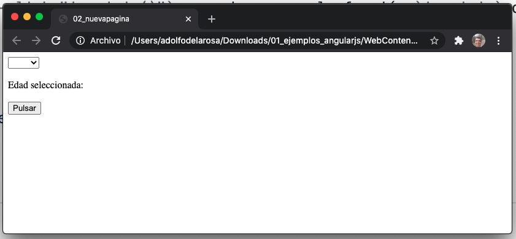
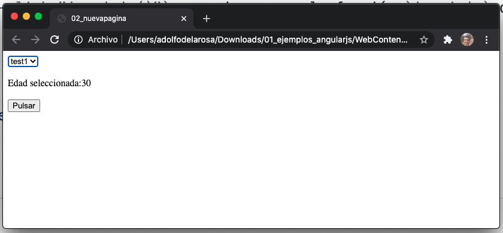
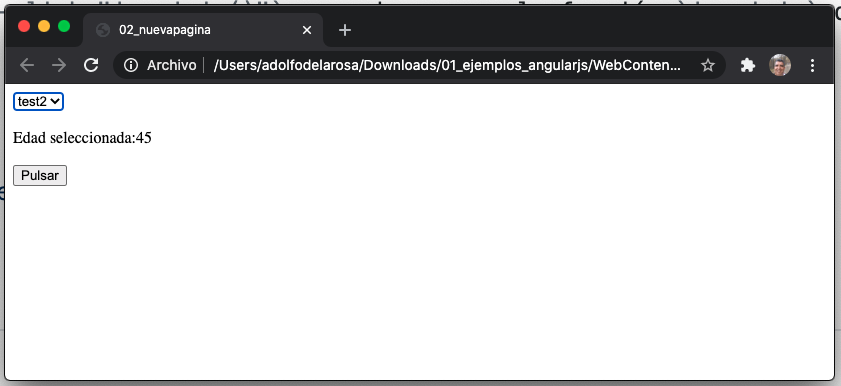
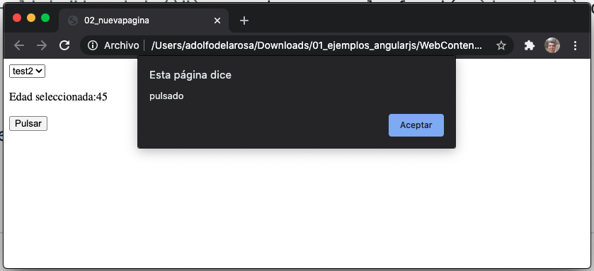

`03_selecciondenombres.html`

```html
<!DOCTYPE html>
<html>
<head>
<meta charset="ISO-8859-1">
<title>03_selecciondenombres</title>

<script src="https://ajax.googleapis.com/ajax/libs/angularjs/1.6.9/angular.min.js"></script>
</head>
<body>
   <div ng-app="seleccionApp" ng-controller="seleccionController">
      Seleccione Nombre: <select ng-model="seleccion">
         <option ng-repeat="p in listado" value="{{p.edad}}">{{p.nombre}}</option>
      </select>
      <br/><br/>
      La edad de la persona seleccionada es: {{seleccion}}
      <br/><br/>
      <input type="button" value="Mostrar" ng-click="imprimir()"/>
   </div>
	
   <script type="text/javascript">
      var app=angular.module("seleccionApp",[]);
      app.controller("seleccionController",function($scope){
     
         $scope.listado=[{"nombre":"persona1","edad":25},
            {"nombre":"persona2","edad":37},
            {"nombre":"persona3","edad":19}];
     
        $scope.imprimir=function(){
            alert($scope.seleccion);
         }
     
      });
   </script>
</body>
</html>
```

* Defino el modelo de datos `listado` al definirlo en el `$scope` puedo accederlo desde HTML que este bajo el dominio del controlador `seleccionController`

Probar el ejemplo:

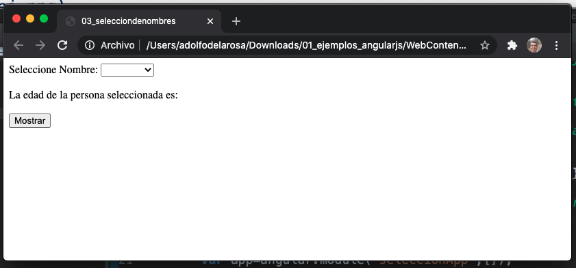
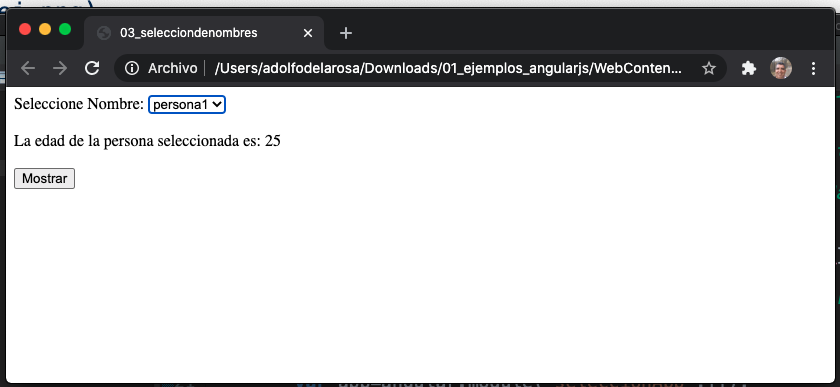
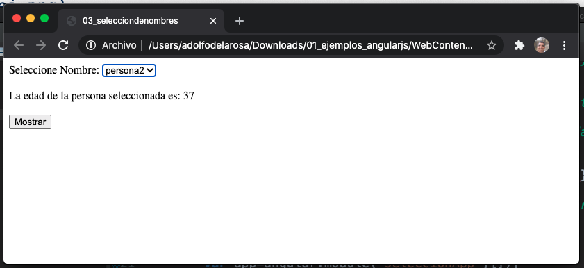
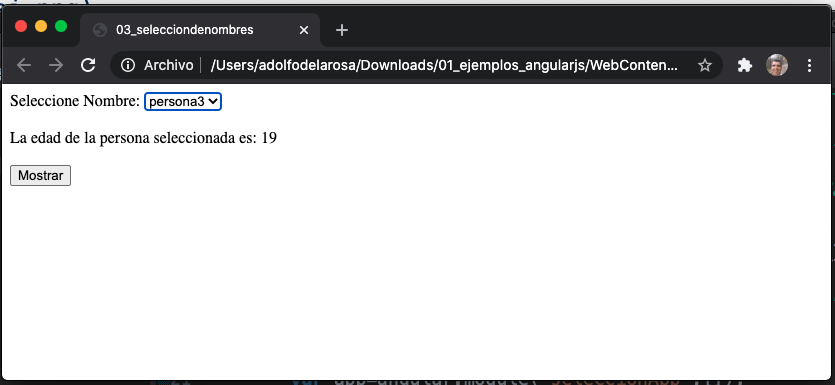
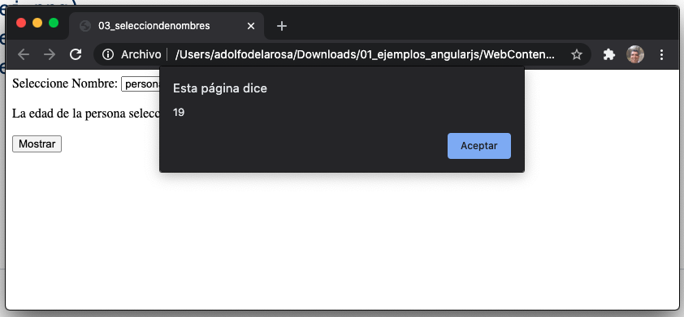

`04_calculadora.html`

```html
<!DOCTYPE html>
<html>
<head>
<meta charset="UTF-8">
<title>04_calculadora</title>
<script src="https://ajax.googleapis.com/ajax/libs/angularjs/1.6.9/angular.min.js"></script>
</head>
<body>
   <div ng-app="calculadoraApp" ng-controller="calculadoraController">
      Número 1:<input type="text" ng-model="num1"/><br/><br/>
      Número 2:<input type="text" ng-model="num2"/><br/><br/>
      <br/><br/>
      <input type="button" value="Sumar" ng-click="sumar()"/>
      <input type="button" value="Restar" ng-click="restar()"/>
      <input type="button" value="Multiplicar" ng-click="multiplicar()"/>
      <input type="button" value="Dividir" ng-click="dividir()"/>
      <br/><br/>
      <div >
         Resultado: {{resultado}}
      </div>
      <br/><br/>
   </div>

   <script type="text/javascript">
		
      var app=angular.module("calculadoraApp",[]);
      app.controller("calculadoraController",function($scope){
         $scope.num1 = 0;
         $scope.num2 = 0;
			
         $scope.sumar=function(){
            $scope.resultado = parseInt($scope.num1) + parseInt($scope.num2);
         }
         $scope.restar=function(){
            $scope.resultado = parseInt($scope.num1) - parseInt($scope.num2);
         }
         $scope.multiplicar=function(){
            $scope.resultado = parseInt($scope.num1) * parseInt($scope.num2);
         }
         $scope.dividir=function(){
            $scope.resultado = parseInt($scope.num1) / parseInt($scope.num2);
         }
      });
   </script>
</body>
</html>
```

Probar el ejemplo:


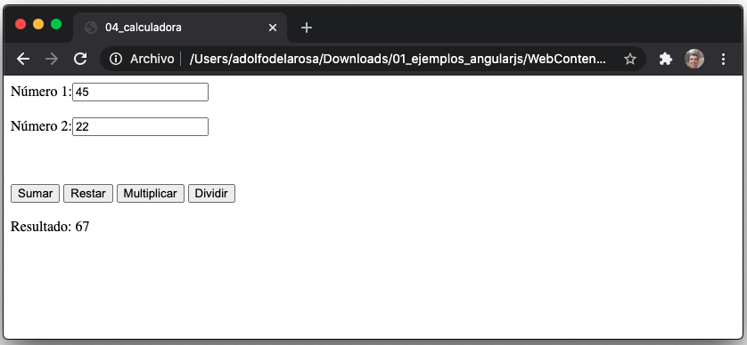
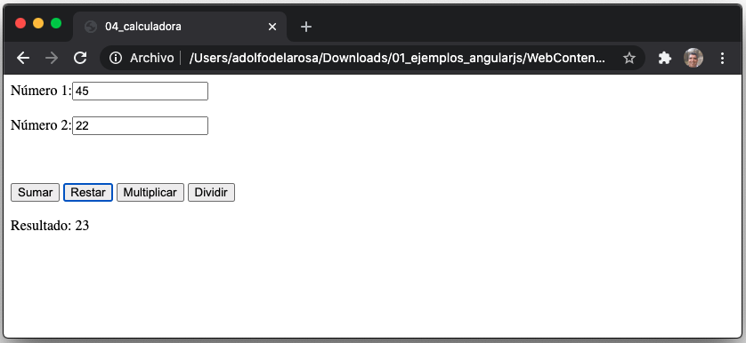
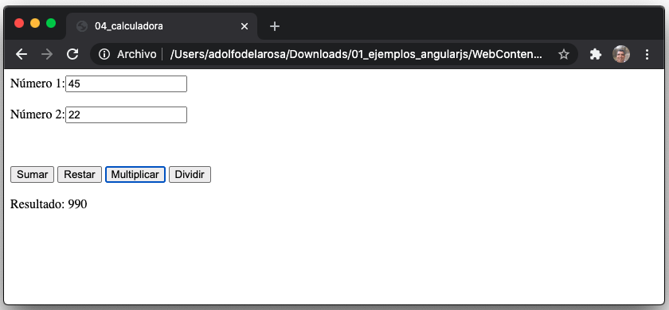
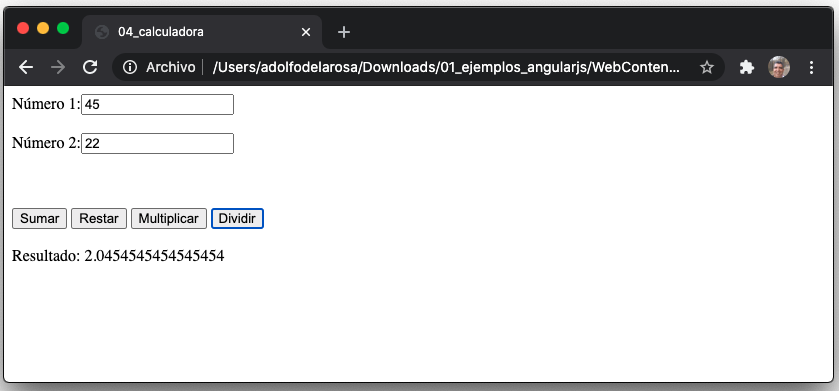


## :computer: `02_formacion_validacion_en_angularjs` **Primer Proyecto AngulaJS con Java**

Partiendo del proyecto `34_formacion_validacion_jquery` vamos a cambiar las validaciones que haciamos con JQuery por validaciones AngularJS.

En este proyecto teniamos el archivo `altaalumno.jsp` con unas validaciones con JQuery como sigue:

`altaalumno.jsp`

```html
<!DOCTYPE html>

<html>
<head>

<meta charset="ISO-8859-1">
<title>Registro de Alumnos</title>
<!-- jQuery library -->
<script src="https://ajax.googleapis.com/ajax/libs/jquery/3.3.1/jquery.min.js"></script>

<script type="text/javascript">
   var objError;
   function init(){
      objError=$("#error");
      $("span").hide(); //ocultamos todas las etiquetas
   }
   function comprobarPwd(){
      var valor=$("#password").val();
      if(valor.length<6){
         //alert("La contraseña debe tener al menos 6 caracteres");
         $("#errorPwd").show();
         return false;
      }
      $("#errorPwd").hide();
      return true;
   }
   function comprobarEdad(){
      var valor=$("#edad").val();
      if(parseInt(valor)<18||parseInt(valor)>99){
         //alert("La edad está fuera de rango");
         $("#errorEdad").show();
         return false;
      }
      $("#errorEdad").hide();
      return true;
   }
   function comprobarEmail(){
      var valor=$("#email").val();
      if(valor.indexOf("@")==-1||valor.indexOf(".")==-1){
         //alert("El email es incorrecto");
         $("#errorEmail").show();
         return false;
      }
      $("#errorEmail").hide();
      return true;
   }

   function validar(){
      return comprobarPwd()&&comprobarEdad()&&comprobarEmail();
   }
</script>
</head>
<body onload="init();">
	<fieldset>
	<legend>Datos personales</legend>
	
		<form action="doAltaAlumno" onsubmit="return validar();" method="post">
			<label for="fusuario">Usuario</label><br>
			<input type="text" name="usuario" id="usuario" required="required"><br>
			<label for="fpassword">Contraseña</label><br>
			<input type="password" onblur="comprobarPwd();" name="password" id="password" required="required"><span id="errorPwd"><b>La contraseña debe tener al menos 6 caracteres</b></span><br>
			<label for="fnombre">Nombre</label><br>
			<input type="text" name="nombre" id="nombre" required="required"><br>
			<label for="femail">Email</label><br>
			<input type="text" name="email" id="email" required="required"><span id="errorEmail"><b>El email es incorrecto</b></span><br>
			<label for="fedad">Edad</label><br>
			<input type="number" name="edad" id="edad" required="required"><span id="errorEdad"><b>La edad está fuera de rango</b></span><br><br>
			<input type="submit" value="Guardar">
			<input type="reset">
		</form>
		
	</fieldset>
	<p align="right"><a href="toMenu">Volver</a></p>
	
</body>
</html>
```

Las vamos a cambiar por validaciones AngularJS

`.html`

```html
<body>
<div ng-app="alumnoApp" ng-controller="alumnoController">
	<fieldset>
	<legend>Datos personales</legend>
	
		<form action="doAltaAlumno" ng-submit="validar($event);" method="post">
			<label for="fusuario">Usuario</label><br>
			<input type="text" name="usuario" id="usuario" required="required"><br>
			<label for="fpassword">Contraseña</label><br>
			<input type="password" name="password" ng-blur="comprobarPwd();" ng-model="password" id="password" required="required">{{pwdError}}<br>
			
			
			<label for="fnombre">Nombre</label><br>
			<input type="text" name="nombre" id="nombre" required="required"><br>
			<label for="femail">Email</label><br>
			<input type="text" name="email" ng-blur="comprobarEmail();" ng-model="email" id="email" required="required">{{emailError}}<br><br>
			<label for="fedad">Edad</label><br>
			<input type="number" name="edad" ng-blur="comprobarEdad();" ng-model="edad" id="edad" required="required">{{edadError}}<br><br>
			<input type="submit" value="Guardar">
			<input type="reset">
		</form>
		
	</fieldset>
	<p align="right"><a href="toMenu">Volver</a></p>
</div>	
<script type="text/javascript">
   var app=angular.module("alumnoApp",[]);
   app.controller("alumnoController",function($scope){
			
      $scope.comprobarPwd=function(){
         if($scope.password.length < 6){
            $scope.pwdError = "La contraseña debe tener al menos 6 caracteres";
               return false;
         }else{
            $scope.pwdError = "";
               return true;
         }
      };
      $scope.comprobarEmail=function(){
         if($scope.email.indexOf("@")==-1||valor.indexOf(".")==-1){
            $scope.emailError = "El email es incorrecto";
            return false;
         }else{
            $scope.emailError = "";
            return true;
         }				
      };
      $scope.comprobarEdad=function(){
         if($scope.edad <18 || $scope.edad>99){
            $scope.edadError = "La edad está fuera de rango";
            return false;
         }else{
            $scope.edadError = "";
            return true;
         }			
      };		
      $scope.validar=function(evento){
         if(!($scope.comprobarEmail()&&$scope.comprobarEmail()&&comprobarEdad())){
            //Cancela el envio de la petición
            evento.preventDefault();
         }
      };		
   });
</script>
```

* Ojo con `ng-submit="validar($event);"`
* Mas observaciones.

### Objeto `$http` 

Permite hacer peticiones a URL usando métodos get y post con sus respectivos parametros pegados a la URL o con formato JSON.

## :computer: `03_buscador_spring_ajax_en_angularjs` **Primer Proyecto AngulaJS con AJAX**

Partiendo del proyecto `36_buscador_spring_ajax` donde usabamos AJAX con JQuery lo modificaremos para usar AJAX con AngularJS.

Solo trabajamos con el archivo `buscador.html` que esta actualmente así:

`buscador.html`

```html
<!DOCTYPE html>
<html lang="es" xmlns:th="http://www.thymeleaf.org">
<head>
<meta charset="ISO-8859-1">
<title>Insert title here</title>

<script src="https://ajax.googleapis.com/ajax/libs/jquery/3.3.1/jquery.min.js"></script>

<script type="text/javascript">
   function buscar(){
      //var url="doBuscar?tema="+$("#tema").val();
      //$.get(url,procesarRespuesta);
      var url="doBuscar";
      $.get(url,{tema:$("#tema").val()},procesarRespuesta);
   }
   function procesarRespuesta(data){
      var html="";
      $.each(data,function(index,item){
         html+="<a href='"+item.url+"'>"+item.titulo+"</a><br/>";
      });
      $("#resultado").html(html);
   }
</script>

</head>
<body>
   <b><span th:text="${session.usuario}"/></b>
	
   <center>
      <h1>Buscador</h1>
      <form >
         Introduce tema de búsqueda:<input type="text" id="tema" name="tema"/><br/><br/>
         <input type="button" value="Buscar" onclick="buscar();"/>
      </form>
      <br/><br/>
      <div id="resultado">
		
      </div>
   </center>
</body>
</html>
```

Con AngularJS nos va a quedar así:

`buscador.html`

```html
<!DOCTYPE html>
<html lang="es" xmlns:th="http://www.thymeleaf.org">
<head>
<meta charset="UTF-8">
<title>Insert title here</title>

<script src="https://ajax.googleapis.com/ajax/libs/angularjs/1.6.9/angular.min.js"></script>

</head>
<body>
   <b><span th:text="${session.usuario}"/></b>
	
   <div ng-app="buscadorApp" ng-controller="buscadorController">
      <h1>Buscador</h1>
      <form >
         Introduce tema de búsqueda:<input type="text" id="tema" ng-model="tema"/><br/><br/>
         <input type="button" value="Buscar" ng-click="buscar();"/>
      </form>
      <br/><br/>
      <a ng-repeat="item in items" href="{{item.url}}">{{item.titulo}}<br/></a>
   </div>
   <script>
      var app=angular.module("buscadorApp",[]);
      app.controller("buscadorController",function($scope, $http){
         var url="doBuscar";
			
         $scope.buscar=function(){
            $http.get(url,{params:{tema:$scope.tema}})
               .then(function(respuesta){
                  $scope.items = respuesta.data;
            });
         };
      });
   </script>
</body>
</html>
```
