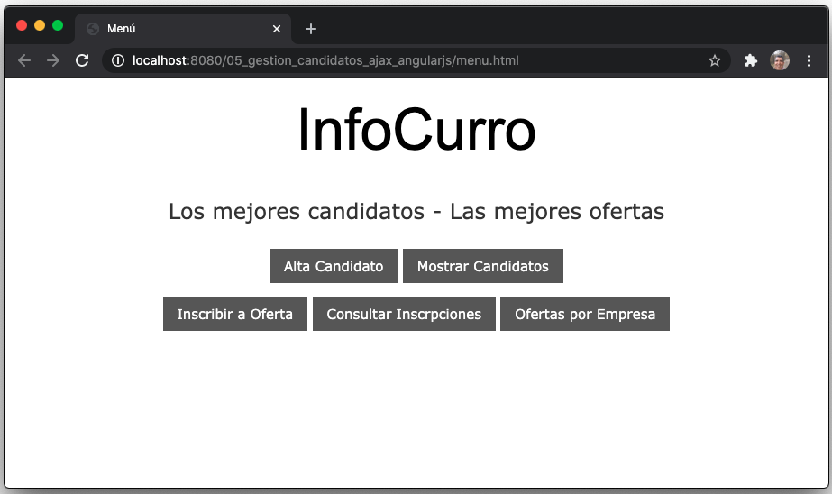
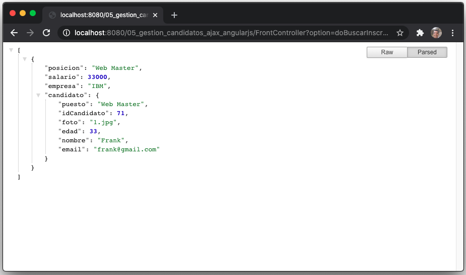
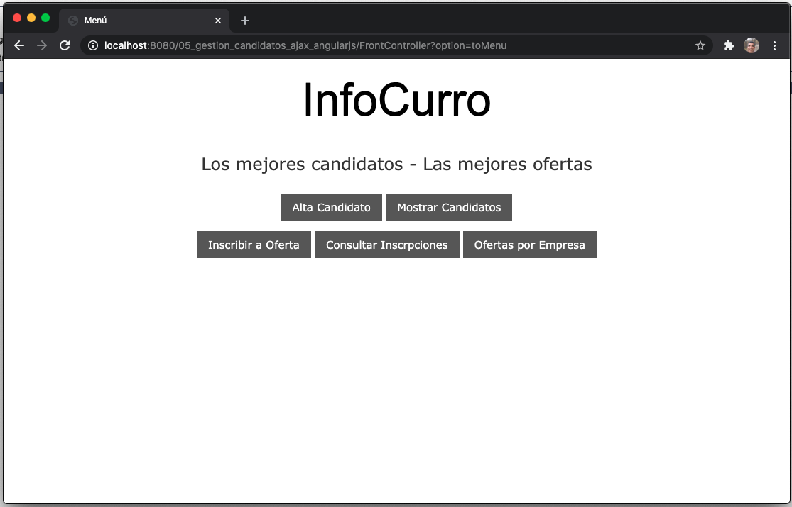
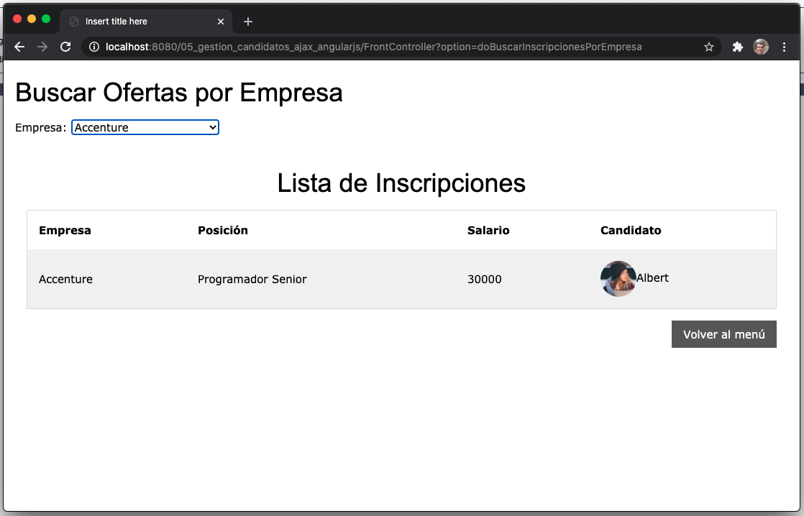
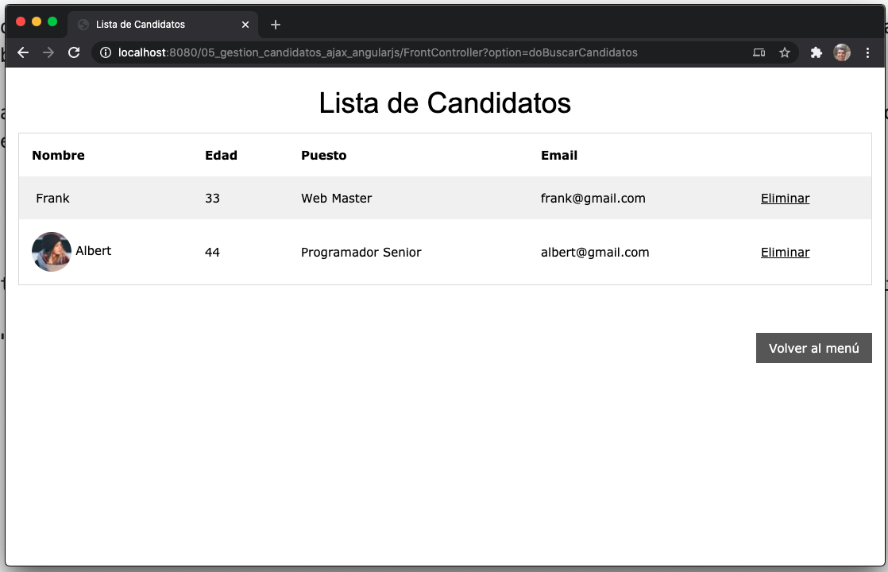
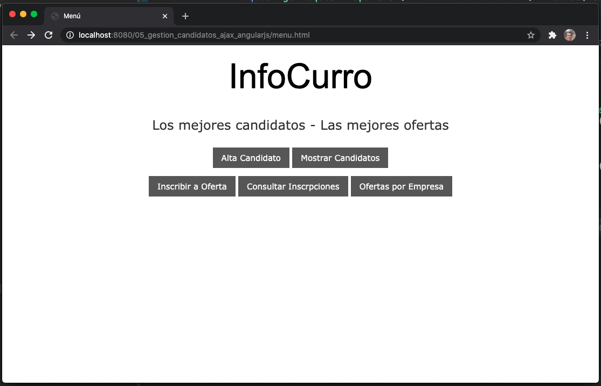
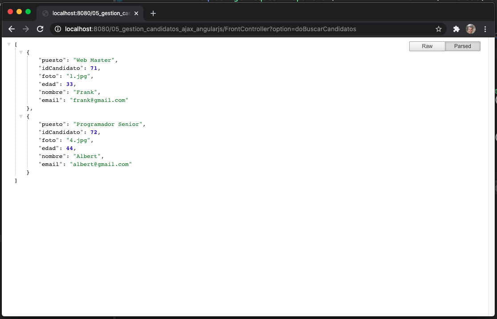

# 20201214 Lunes

## :computer: `04_formacion_ajax_en_angularjs` **Segundo Proyecto AngulaJS con AJAX**

Partiendo del ejercicio `37_formacion_validacion_ajax` donde teniamos dos partes de AJAX con JQUERY cambiarla para usar AJAX con AngularJS.

En `matriculas.html` y `alumnosmatricular.html`

## :computer: `05_gestion_candidatos_ofertas_angularjs` **Tercer Proyecto AngulaJS con AJAX**

Partiendo del ejercicio `08_gestion_candidatos_ofertas_v2` que es un proyecto que usa JavaEE con MVC, vamos a modificarlo para realizar las siguientes funcionalidades con AngularJs.

* 1.- Mostrar las "Ofertas por Empresa", antes eran dos páginas una con un combo y otra con la lista de inscripciones por emprea, se reducirá a una sola.
* 2.- Mostrar Candidatos, lista de candidatos donde se pueden eliminar algún candidato. Hacerlo todo con AngularJS.

### 1. Incluir la Dependencia JSONSimple

```html
<dependency>
   <groupId>com.googlecode.json-simple</groupId>
	 <artifactId>json-simple</artifactId>
	 <version>1.1.1</version>
</dependency>
```

### 2.- Mostrar las "Ofertas por Empresa"

Lo primero que vamos a hacer es cambiar el servicio que nos regresa la lista de Inscripciones para que lo regrese con un JSON. Actualmente lo tenemos así:

`BuscarInscripcionesEmpresaAction.java`

```java
...
protected void service(HttpServletRequest request, HttpServletResponse response) throws ServletException, IOException {
   String empresa = request.getParameter("empresa");
   request.setAttribute("empresa", empresa);
   request.setAttribute("inscripciones", service.recuperarInscripcionesEmpresa(empresa));
}
...
```

Lo cambiamos por:

`BuscarInscripcionesEmpresaAction.java`

```html
...
protected void service(HttpServletRequest request, HttpServletResponse response) throws ServletException, IOException {
   String empresa = request.getParameter("empresa");
   request.setAttribute("empresa", empresa);
   //request.setAttribute("inscripciones", service.recuperarInscripcionesEmpresa(empresa));
   List<Inscripcion> inscripciones = service.recuperarInscripcionesEmpresa(request.getParameter("empresa"));
		
   JSONArray array = new JSONArray();
   inscripciones.forEach(inscripcion -> {
      JSONObject obj = new JSONObject();
      obj.put("empresa", inscripcion.getEmpresa());
      obj.put("posicion", inscripcion.getPosicion());
      obj.put("salario", inscripcion.getSalario());
	       
      JSONObject objCandidato = new JSONObject();
      objCandidato.put("edad", inscripcion.getCandidato().getEdad());
      objCandidato.put("email", inscripcion.getCandidato().getEmail());
      objCandidato.put("foto", inscripcion.getCandidato().getFoto());
      objCandidato.put("idCandidato", inscripcion.getCandidato().getIdCandidato());
      objCandidato.put("nombre", inscripcion.getCandidato().getNombre());
      objCandidato.put("puesto", inscripcion.getCandidato().getPuesto());
      obj.put("candidato", objCandidato);
	       
      array.add(obj);
   });
   response.setContentType("application/json");
   PrintWriter out = response.getWriter();
   out.println(array.toJSONString());
}
...      
```

### 3.- Modificar el FrontController 

Vamos a cambiar la opción del FrontController

`FrontController`

```java
...
case "doBuscarInscripcionesEmpresa":
   request.getRequestDispatcher("BuscarInscripcionesEmpresaAction").include(request, response);
   url = "inscripcionesempresa.jsp";
   break;
...
```

Lo cambiamos por:

```java
...
case "doBuscarInscripcionesEmpresa":
   url = "BuscarInscripcionesEmpresaAction";
   break;
...
```

### 4.- Probar el JSON

Con esto es suficiente y recomendable probar que el Action nos resgrese un JSON.





Hasta aquí nos regresa lo que esperabamos.

### 5.- Modificar Vistas

Existen dos vistas involucradas en esta funcionalidad `buscarempresaofertas.jsp` y `inscripciones.jsp` debemos meter la funcionalidad de `inscripciones.jsp` dentro de `buscarempresaofertas.jsp`, una vez hecho ya podremos eliminar `inscripciones.jsp`.

Actualmente tenemos:

`buscarempresaofertas.jsp`

```html
...
<body>
   <% List<String> empresas = (List<String>)request.getAttribute("empresas"); %>
   <div class="w3-padding">
      <h1>Buscar Ofertas por Empresa</h1>
      <form action="FrontController?option=doBuscarInscripcionesEmpresa" method="post">	
			
         Empresa: <select name="empresa" required>
                     <option value="">Selecciona una empresa</option>
                     <%for(String empresa: empresas){ %>
	                     <option value="<%=empresa%>"><%=empresa%></option>
                     <% }%>  
                  </select>
         <br/><br/>
         <input type="submit" value="Buscar">	
      </form>
   </div>
</body>
```

Lo vamos a modificar y nos quedará así:

`buscarempresaofertas.jsp`

```html
<%@ page language="java" contentType="text/html; charset=UTF-8"
    pageEncoding="UTF-8" import="java.util.List, model.Candidato"%>
<!DOCTYPE html>
<html>
<head>
<meta charset="UTF-8">
<title>Insert title here</title>
<link rel="stylesheet" type="text/css" href="css/w3.css">
<script src="https://ajax.googleapis.com/ajax/libs/angularjs/1.6.9/angular.min.js"></script>
</head>
<body>
   <% List<String> empresas = (List<String>)request.getAttribute("empresas"); %>
   <div class="w3-padding" ng-app="inscripcionesApp" ng-controller="inscripcionesController">
      <h1>Buscar Ofertas por Empresa</h1>
      Empresa: <select name="empresa" required ng-model="empresa" ng-change="buscarInscripciones();">
               <option value="">Selecciona una empresa</option>
               <%for(String empresa: empresas){ %>
                  <option value="<%=empresa%>"><%=empresa%></option>
               <% }%>  
            </select>
			
      <br/><br/>
      <div align="center" class="w3-padding" ng-show="inscripciones">
         <h1>Lista de Inscripciones</h1>
         <table>
            <tr>
               <th>Empresa</th>
               <th>Posición</th>
               <th>Salario</th>
               <th>Candidato</th>
            </tr>
            <tr ng-repeat="ins in inscripciones">
               <td>{{ins.empresa}}</td>	
               <td>{{ins.posicion}}</td>
               <td>{{ins.salario}}</td>
               <td>{{ins.candidato.nombre}}</td>
            </tr>
         </table>
      </div>
      <div align="right" class="w3-padding">
         <a href="FrontController?option=toMenu" class="w3-button w3-dark-grey">Volver al menú</a>
      </div>	
   </div>
   <script>
      var app=angular.module("inscripcionesApp",[]);
      app.controller("inscripcionesController",function($scope,$http){
      var url="FrontController";
      $scope.buscarInscripciones=function(){
         $http.get(url,{params:{option:"doBuscarInscripcionesEmpresa",empresa:$scope.empresa}})
            .then(function(res){
               $scope.inscripciones=res.data;
         });
      };
   });
   </script>
</body>
</html>
```

### 6.- Probar Aplicación






### 7.- Mostrar Candidato 

Vamos a cambiar la funcionalidad de Mostrar Candidato para que se haga con AngularJS. A nivel de Vista será la misma pero la forma en que trabaje es diferente.



Lo primero que vamos a hacer es cambiar el servicio que nos regresa la lista de Candidatos para que lo regrese con un JSON. Actualmente lo tenemos así:

`BuscarCandidatosAction`

```java
protected void service(HttpServletRequest request, HttpServletResponse response) throws ServletException, IOException {
   request.setAttribute("candidatos", service.recuperarCandidatos());
}
```

Lo vamos a cambiar por:

`BuscarCandidatosAction`

```java
protected void service(HttpServletRequest request, HttpServletResponse response) throws ServletException, IOException {
   //request.setAttribute("candidatos", service.recuperarCandidatos());
		
   List<Candidato> candidatos = service.recuperarCandidatos();
		
   JSONArray array = new JSONArray();
   candidatos.forEach(candidato -> {
      JSONObject objCandidato = new JSONObject();
      objCandidato.put("edad", candidato.getEdad());
      objCandidato.put("email", candidato.getEmail());
      objCandidato.put("foto", candidato.getFoto());
      objCandidato.put("idCandidato", candidato.getIdCandidato());
      objCandidato.put("nombre", candidato.getNombre());
      objCandidato.put("puesto", candidato.getPuesto());
	      
      array.add(objCandidato);
   });
   response.setContentType("application/json");
   PrintWriter out = response.getWriter();
   out.println(array.toJSONString());		
}
```

### 8.- Modificar el FrontController 

Vamos a cambiar la opción del FrontController

`FrontController`

```java
case "doBuscarCandidatos":
   request.getRequestDispatcher("BuscarCandidatosAction").include(request, response);
   url = "candidatos.jsp";
   break;
```

Por esta:

`FrontController`

```java
case "doBuscarCandidatos":
   url = "BuscarCandidatosAction";
   break;
```

### 9.- Probar el JSON

Con esto es suficiente y recomendable probar que el Action nos resgrese un JSON.




Hasta aquí nos regresa lo que esperabamos.

### 10.- Modificar FrontController

Antes desde el Menú llamabamos a 

```java
case "doBuscarCandidatos":
   //request.getRequestDispatcher("BuscarCandidatosAction").include(request, response);
   //url = "candidatos.jsp";
   url = "BuscarCandidatosAction";
   break;
```

Ahora vamos a llamar directamente a la página HTML

```java
case "toCandidartos":
   url="candidatos.html";
   break;
```

### 10.- Modificar Vista

En las opciones de `menu.html` vamos a cambiar la opción:

```html
<a href="FrontController?option=doBuscarCandidatos" class="w3-button w3-dark-grey">Mostrar Candidatos</a>
```

Por:

```html
<a href="FrontController?option=toCandidatos" class="w3-button w3-dark-grey">Mostrar Candidatos</a>
```

La vista involucrada es `candidatos.jsp` vamos a recodificarlo con AngularJS.

Su código actual es:

`candidatos.jsp`

```html
<%@ page language="java" contentType="text/html; charset=ISO-8859-1"
    pageEncoding="ISO-8859-1" import="java.util.List, model.Candidato"%>
<!DOCTYPE html>
<html>
<head>
<meta charset="ISO-8859-1">
<title>Lista de Candidatos</title>
<link rel="stylesheet" type="text/css" href="css/w3.css">
</head>
<body>
   <%	
   List<Candidato> empleados = (List<Candidato>)request.getAttribute("candidatos");
   if (empleados.size() > 0){
   %>
   <div align="center" class="w3-padding">
      <h1>Lista de Candidatos</h1>
      <table>
         <tr>
            <th>Nombre</th>
            <th>Edad</th>
            <th>Puesto</th>
            <th>Email</th>
            <th></th>
         </tr>
         <%for(int i=0;i<empleados.size();i++){ %>
         <tr>
            <td>"> <span style=""><%=empleados.get(i).getNombre()%></span></td>
            <td><%=empleados.get(i).getEdad()%></td>	
            <td><%=empleados.get(i).getPuesto()%></td>
            <td><%=empleados.get(i).getEmail()%></td>
            <td><a href="FrontController?option=doEliminarCandidato&idCandidato=<%=empleados.get(i).getIdCandidato()%>">Eliminar</a></td>
         </tr>
         <%}%>
      </table>
   </div>
   <%}else%>
   <br><br>
   <div align="right" class="w3-padding">
      <a href="menu.html" class="w3-button w3-dark-grey">Volver al menú</a>
   </div>
</body>
</html>
```

Con la modificación nos queda así:

`.html`

```html
```

