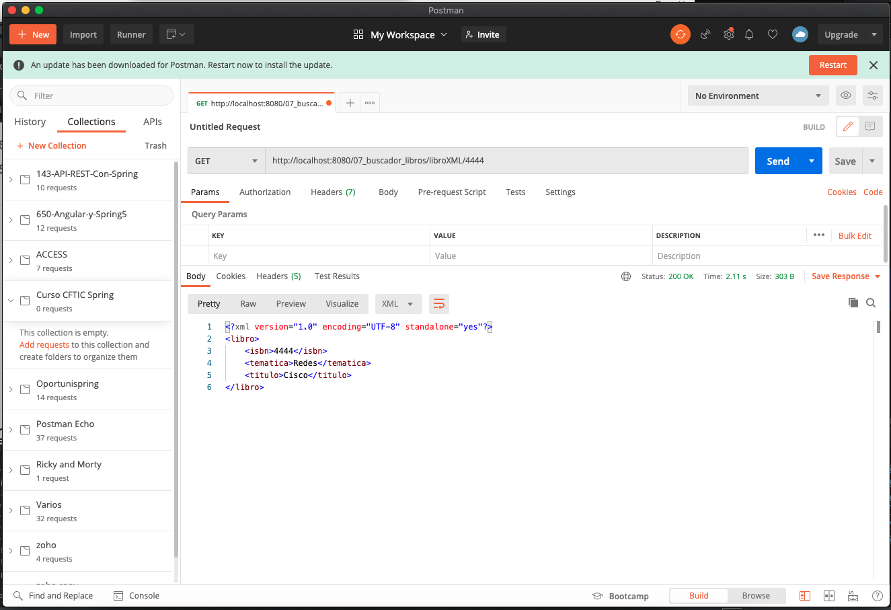
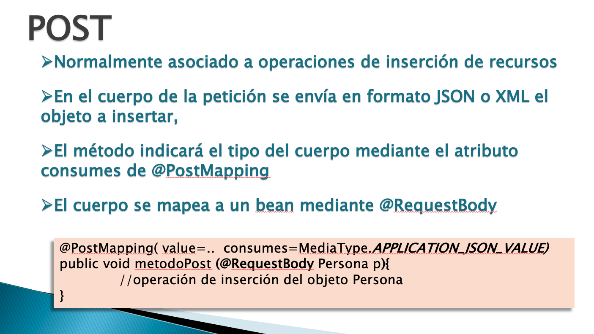
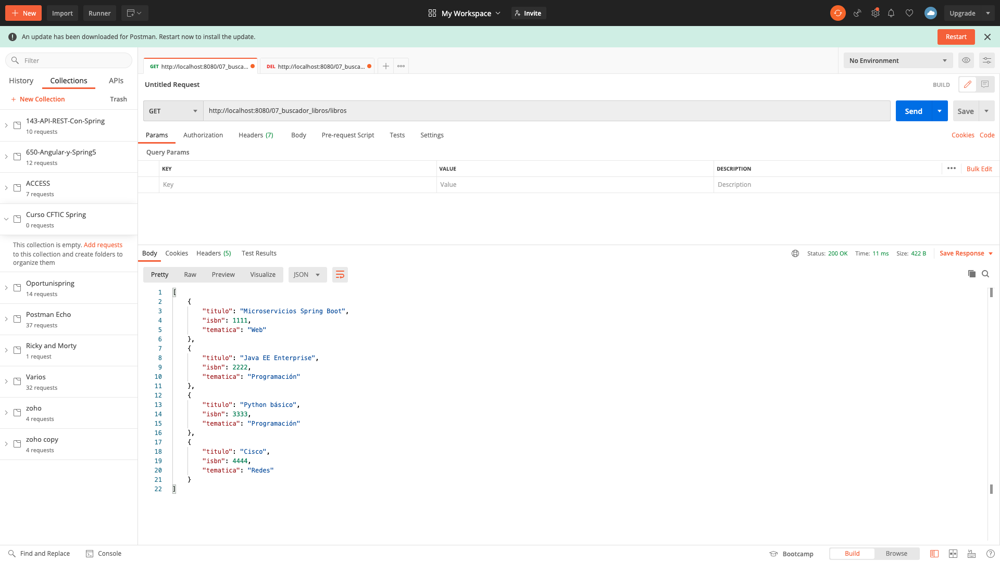
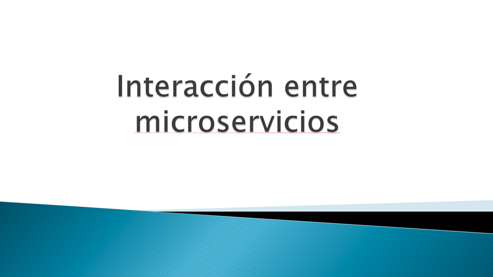
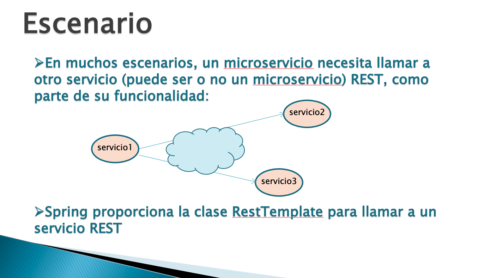
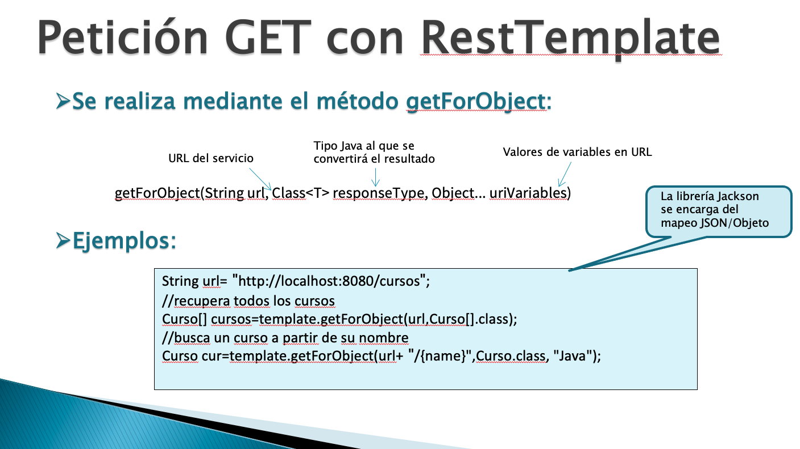
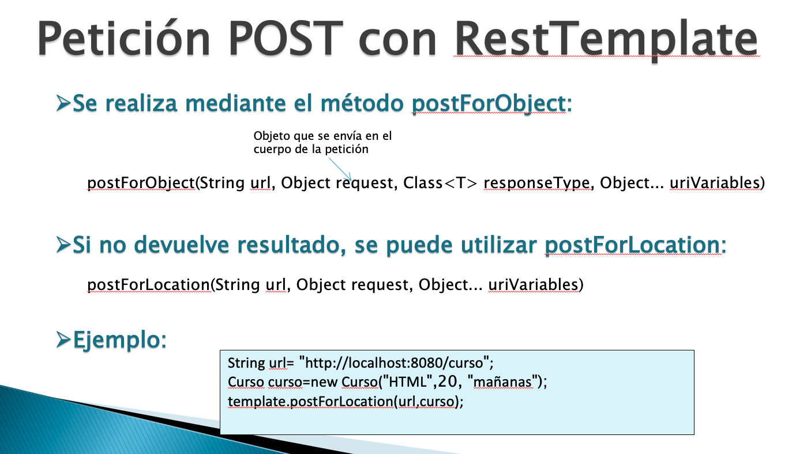
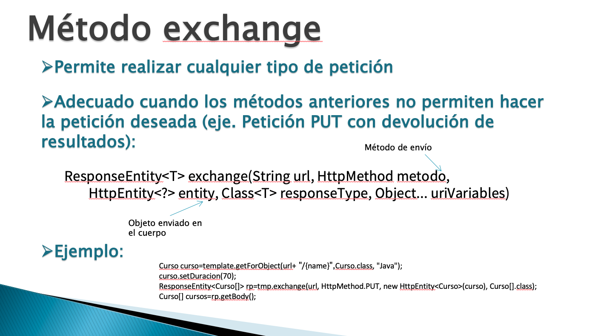

# 20210108 Viernes

### :computer: `07_buscador_libros`
#### Ejemplo de un Servicio Rest que nos va a realizar una búsqueda de Libros que se encuentran en Memoria.


Al igual que los proyectos anteriores es un proyecto Dimamic Web Proyect que mavemizamos, asignamos el proyecto padre y copiamos la misma configuración.


#### Crear el Modelo `Libro`

`Libro`

```java
package model;

import javax.xml.bind.annotation.XmlRootElement;

public class Libro {

   private String titulo;
   private int isbn;
   private String tematica;
   
   public Libro() {
      super();
   }
   public Libro(int isbn, String titulo,  String tematica) {
      super();
      this.titulo = titulo;
      this.isbn = isbn;
      this.tematica = tematica;
   }
   public String getTitulo() {
      return titulo;
   }
   public void setTitulo(String titulo) {
      this.titulo = titulo;
   }
   public int getIsbn() {
      return isbn;
   }
   public void setIsbn(int isbn) {
      this.isbn = isbn;
   }
   public String getTematica() {
      return tematica;
   }
   public void setTematica(String tematica) {
      this.tematica = tematica;
   }
}
```

#### Crear la Capa de Servicio

En esta aplicación si que vamos a tener una capa de  servicio, pero no una capa de repositorio por que aun no tenemos acceso a datos, estaran inventados en una colección.

##### Crear la Interface `LibrosService`

`LibrosService`

```java
package service;

import java.util.List;

import model.Libro;

public interface LibrosService {

	List<Libro> todosLibros();
	List<Libro> librosPorTematica(String tematica);
	Libro libroPorIsbn(int isbn);
}
```


##### Crear la Clase `LibrosServiceImpl` que implementa la Interface `LibrosService`

`LibrosServiceImpl`

```java
package service;

import java.util.ArrayList;
import java.util.List;
import java.util.stream.Collectors;

import org.springframework.stereotype.Service;

import model.Libro;

@Service
public class LibrosServiceImpl implements LibrosService {

	private List<Libro> libros;
	
	public LibrosServiceImpl() {
		libros=new ArrayList<>();
		libros.add(new Libro(1111,"Microservicios Spring Boot","Web"));
		libros.add(new Libro(2222,"Java EE","Programación"));
		libros.add(new Libro(3333,"Python básico","Programación"));
		libros.add(new Libro(4444,"Cisco","Redes"));
	}
	
	@Override
	public List<Libro> todosLibros() {
		return libros;
	}

	@Override
	public List<Libro> librosPorTematica(String tematica) {
		return libros.stream()
				.filter(l->l.getTematica().equals(tematica))
				.collect(Collectors.toList());
	}
	
	@Override
	public Libro libroPorIsbn(int isbn) {
		return libros.stream()
				.filter(l->l.getIsbn()==isbn)
				.findFirst()
				.orElse(null);
	}
}
```

#### Crear el Controlador `LibrosController`

`LibrosController`

```java
package controller;

import java.util.List;

import org.springframework.beans.factory.annotation.Autowired;
import org.springframework.http.MediaType;
import org.springframework.web.bind.annotation.DeleteMapping;
import org.springframework.web.bind.annotation.GetMapping;
import org.springframework.web.bind.annotation.PathVariable;
import org.springframework.web.bind.annotation.PostMapping;
import org.springframework.web.bind.annotation.PutMapping;
import org.springframework.web.bind.annotation.RequestBody;
import org.springframework.web.bind.annotation.RestController;

import model.Libro;
import service.LibrosService;

@RestController
public class LibrosController {
	
	@Autowired
	LibrosService service;
	
	@GetMapping(value="libros", produces=MediaType.APPLICATION_JSON_VALUE)
	public List<Libro> libros(){
		return service.todosLibros();
	}
	@GetMapping(value="libros/{tema}", produces=MediaType.APPLICATION_JSON_VALUE)
	public List<Libro> librosPorTema(@PathVariable("tema") String tema){
		return service.librosPorTematica(tema);
	}
	
	@GetMapping(value="libro/{isbn}", produces=MediaType.APPLICATION_JSON_VALUE)
	public Libro buscarLibro(@PathVariable("isbn") int isbn){
		return service.libroPorIsbn(isbn);
	}

}

```

#### Configuración de la Aplicación

Hemos copiado la configuración básica de los proyectos anteriores pero en este caso ya contamos con una capa de Servicio por lo que debemos añadir el archivo de configuración `SpringConfig` y lo debemos registrar en `Inicializador`

`Inicializador`

```java
package config;

import javax.servlet.ServletContext;
import javax.servlet.ServletException;
import javax.servlet.ServletRegistration;

import org.springframework.web.WebApplicationInitializer;
import org.springframework.web.context.ContextLoaderListener;
import org.springframework.web.context.support.AnnotationConfigWebApplicationContext;
import org.springframework.web.servlet.DispatcherServlet;

public class Inicializador implements WebApplicationInitializer {

	@Override
	public void onStartup(ServletContext servletContext) throws ServletException {
		// Crea el contexto raíz de la aplicación Web
		AnnotationConfigWebApplicationContext rootContext = new AnnotationConfigWebApplicationContext();

		// registro de la clase de configuración del modelo
		rootContext.register(SpringConfig.class);
		// Gestiona el ciclo de vida del contexto de aplicación
		servletContext.addListener(new ContextLoaderListener(rootContext));

		// Registra el archivo de configuración para MVC
		AnnotationConfigWebApplicationContext dispatcherContext = new AnnotationConfigWebApplicationContext();
		dispatcherContext.register(MvcConfig.class);

		// Crea y Registra el DispatcherServlet
		ServletRegistration.Dynamic dispatcher = servletContext.addServlet("dispatcher",
				new DispatcherServlet(dispatcherContext));
		dispatcher.setLoadOnStartup(1);
		dispatcher.addMapping("/");

	}

}
```

`SpringConfig`

```java
package config;

import org.springframework.context.annotation.ComponentScan;
import org.springframework.context.annotation.Configuration;

@ComponentScan(basePackages = {"service"})
@Configuration
public class SpringConfig {
	
}
```

`MvcConfig`

```java
package config;

import org.springframework.context.annotation.ComponentScan;
import org.springframework.context.annotation.Configuration;
import org.springframework.web.servlet.config.annotation.EnableWebMvc;

@EnableWebMvc
@ComponentScan(basePackages = {"controller"})
@Configuration
public class MvcConfig {
	
}

```

#### Probar la Aplicación


#### Devolver un XML

Todos estos resultados devuelven JSON pero podríamos también regresear XML, vamos a méter un método que haga esto (SOLO EN EL CONTROLADOR).

```java
@GetMapping(value="libroXML/{isbn}", produces=MediaType.APPLICATION_ATOM_XML_VALUE)
public Libro buscarLibroXML(@PathVariable("isbn") int isbn){
   return service.libroPorIsbn(isbn);
}
```

* Con la anotación `APPLICATION_ATOM_XML_VALUE` retornará un XML pero hay que hacer un paso adiciónal, debemos anotar el modelo con la anotación `@XmlRootElement`.

```java
@XmlRootElement
public class Libro {

   private String titulo;
   private int isbn;
   private String tematica;
   ....
```







#### Llamar a otros verbos HTTP

Vamos a añadir métodos en la interface.

`LibrosService`

```java
  ...
  void nuevoLibro(Libro libro);
	void actualizarLibro(Libro libro);
	void eliminarLibro(int isbn);
  ...
```

Vamos a implementar los métodos en la clase.

`LibrosServiceImpl`

```java
...
   @Override
   public void nuevoLibro(Libro libro) {
      libros.add(libro);
   }

   @Override
   public void actualizarLibro(Libro libro) {
      //Si encontramos un libro con el isbn del recibido, lo sustituimos
      for(int i=0; i<libros.size(); i++) {
         if(libros.get(i).getIsbn()==libro.getIsbn()) {
            libros.set(i, libro);
            return;
         }
      }
      return;
   }

   @Override
   public void eliminarLibro(int isbn) {
      libros.removeIf(l->l.getIsbn()==isbn);
   }
...  
```

Vamos a implementar los métodos en el Controlador

`LibrosController`

```java
...
   @PostMapping(value="libro",consumes = MediaType.APPLICATION_JSON_VALUE)
   public void agregar(@RequestBody Libro libro) {
      service.nuevoLibro(libro);
   }
   @DeleteMapping(value="libro/{isbn}")
   public void eliminar(@PathVariable("isbn") int isbn) {
      service.eliminarLibro(isbn);
   }
	
   @PutMapping(value="libro",produces=MediaType.APPLICATION_JSON_VALUE,consumes=MediaType.APPLICATION_JSON_VALUE)
   public List<Libro> modificar(@RequestBody Libro libro){
      service.actualizarLibro(libro);
      return service.todosLibros();
   }
...
```

#### Vamos a probar la Aplicación












