# 20210108 Viernes

### :computer: `07_buscador_libros`
#### Ejemplo de un Servicio Rest que nos va a realizar una búsqueda de Libros que se encuentran en Memoria.


Al igual que los proyectos anteriores es un proyecto Dimamic Web Proyect que mavemizamos, asignamos el proyecto padre y copiamos la misma configuración.


#### Crear el Modelo `Libro`

`Libro`

```java
package model;

import javax.xml.bind.annotation.XmlRootElement;

public class Libro {

   private String titulo;
   private int isbn;
   private String tematica;
   
   public Libro() {
      super();
   }
   public Libro(int isbn, String titulo,  String tematica) {
      super();
      this.titulo = titulo;
      this.isbn = isbn;
      this.tematica = tematica;
   }
   public String getTitulo() {
      return titulo;
   }
   public void setTitulo(String titulo) {
      this.titulo = titulo;
   }
   public int getIsbn() {
      return isbn;
   }
   public void setIsbn(int isbn) {
      this.isbn = isbn;
   }
   public String getTematica() {
      return tematica;
   }
   public void setTematica(String tematica) {
      this.tematica = tematica;
   }
}
```

#### Crear la Capa de Servicio

En esta aplicación si que vamos a tener una capa de  servicio, pero no una capa de repositorio por que aun no tenemos acceso a datos, estaran inventados en una colección.

##### Crear la Interface `LibrosService`

`LibrosService`

```java
package service;

import java.util.List;

import model.Libro;

public interface LibrosService {

	List<Libro> todosLibros();
	List<Libro> librosPorTematica(String tematica);
	Libro libroPorIsbn(int isbn);
}
```


##### Crear la Clase `LibrosServiceImpl` que implementa la Interface `LibrosService`

`LibrosServiceImpl`

```java
package service;

import java.util.ArrayList;
import java.util.List;
import java.util.stream.Collectors;

import org.springframework.stereotype.Service;

import model.Libro;

@Service
public class LibrosServiceImpl implements LibrosService {

	private List<Libro> libros;
	
	public LibrosServiceImpl() {
		libros=new ArrayList<>();
		libros.add(new Libro(1111,"Microservicios Spring Boot","Web"));
		libros.add(new Libro(2222,"Java EE","Programación"));
		libros.add(new Libro(3333,"Python básico","Programación"));
		libros.add(new Libro(4444,"Cisco","Redes"));
	}
	
	@Override
	public List<Libro> todosLibros() {
		return libros;
	}

	@Override
	public List<Libro> librosPorTematica(String tematica) {
		return libros.stream()
				.filter(l->l.getTematica().equals(tematica))
				.collect(Collectors.toList());
	}
	
	@Override
	public Libro libroPorIsbn(int isbn) {
		return libros.stream()
				.filter(l->l.getIsbn()==isbn)
				.findFirst()
				.orElse(null);
	}
}
```

#### Crear el Controlador `LibrosController`

`LibrosController`

```java
package controller;

import java.util.List;

import org.springframework.beans.factory.annotation.Autowired;
import org.springframework.http.MediaType;
import org.springframework.web.bind.annotation.DeleteMapping;
import org.springframework.web.bind.annotation.GetMapping;
import org.springframework.web.bind.annotation.PathVariable;
import org.springframework.web.bind.annotation.PostMapping;
import org.springframework.web.bind.annotation.PutMapping;
import org.springframework.web.bind.annotation.RequestBody;
import org.springframework.web.bind.annotation.RestController;

import model.Libro;
import service.LibrosService;

@RestController
public class LibrosController {
	
	@Autowired
	LibrosService service;
	
	@GetMapping(value="libros", produces=MediaType.APPLICATION_JSON_VALUE)
	public List<Libro> libros(){
		return service.todosLibros();
	}
	@GetMapping(value="libros/{tema}", produces=MediaType.APPLICATION_JSON_VALUE)
	public List<Libro> librosPorTema(@PathVariable("tema") String tema){
		return service.librosPorTematica(tema);
	}
	
	@GetMapping(value="libro/{isbn}", produces=MediaType.APPLICATION_JSON_VALUE)
	public Libro buscarLibro(@PathVariable("isbn") int isbn){
		return service.libroPorIsbn(isbn);
	}

}

```

#### Configuración de la Aplicación

Hemos copiado la configuración básica de los proyectos anteriores pero en este caso ya contamos con una capa de Servicio por lo que debemos añadir el archivo de configuración `SpringConfig` y lo debemos registrar en `Inicializador`

`Inicializador`

```java
package config;

import javax.servlet.ServletContext;
import javax.servlet.ServletException;
import javax.servlet.ServletRegistration;

import org.springframework.web.WebApplicationInitializer;
import org.springframework.web.context.ContextLoaderListener;
import org.springframework.web.context.support.AnnotationConfigWebApplicationContext;
import org.springframework.web.servlet.DispatcherServlet;

public class Inicializador implements WebApplicationInitializer {

	@Override
	public void onStartup(ServletContext servletContext) throws ServletException {
		// Crea el contexto raíz de la aplicación Web
		AnnotationConfigWebApplicationContext rootContext = new AnnotationConfigWebApplicationContext();

		// registro de la clase de configuración del modelo
		rootContext.register(SpringConfig.class);
		// Gestiona el ciclo de vida del contexto de aplicación
		servletContext.addListener(new ContextLoaderListener(rootContext));

		// Registra el archivo de configuración para MVC
		AnnotationConfigWebApplicationContext dispatcherContext = new AnnotationConfigWebApplicationContext();
		dispatcherContext.register(MvcConfig.class);

		// Crea y Registra el DispatcherServlet
		ServletRegistration.Dynamic dispatcher = servletContext.addServlet("dispatcher",
				new DispatcherServlet(dispatcherContext));
		dispatcher.setLoadOnStartup(1);
		dispatcher.addMapping("/");

	}

}
```

`SpringConfig`

```java
package config;

import org.springframework.context.annotation.ComponentScan;
import org.springframework.context.annotation.Configuration;

@ComponentScan(basePackages = {"service"})
@Configuration
public class SpringConfig {
	
}
```

`MvcConfig`

```java
package config;

import org.springframework.context.annotation.ComponentScan;
import org.springframework.context.annotation.Configuration;
import org.springframework.web.servlet.config.annotation.EnableWebMvc;

@EnableWebMvc
@ComponentScan(basePackages = {"controller"})
@Configuration
public class MvcConfig {
	
}

```

#### Probar la Aplicación


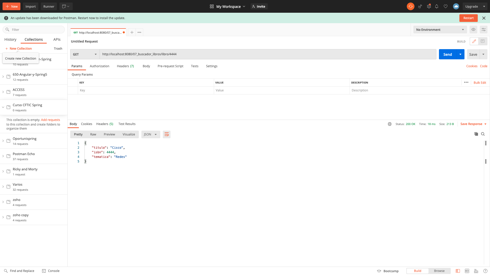


#### Devolver un XML

Todos estos resultados devuelven JSON pero podríamos también regresear XML, vamos a méter un método que haga esto (SOLO EN EL CONTROLADOR).

```java
@GetMapping(value="libroXML/{isbn}", produces=MediaType.APPLICATION_ATOM_XML_VALUE)
public Libro buscarLibroXML(@PathVariable("isbn") int isbn){
   return service.libroPorIsbn(isbn);
}
```

* Con la anotación `APPLICATION_ATOM_XML_VALUE` retornará un XML pero hay que hacer un paso adiciónal, debemos anotar el modelo con la anotación `@XmlRootElement`.

```java
@XmlRootElement
public class Libro {

   private String titulo;
   private int isbn;
   private String tematica;
   ....
```


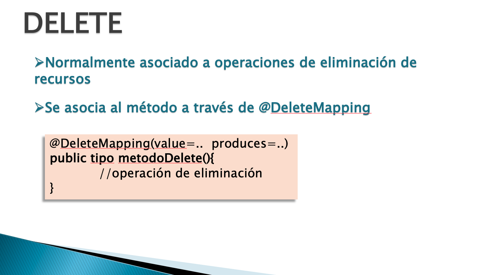


#### Llamar a otros verbos HTTP

Vamos a añadir métodos en la interface.

`LibrosService`

```java
  ...
  void nuevoLibro(Libro libro);
	void actualizarLibro(Libro libro);
	void eliminarLibro(int isbn);
  ...
```

Vamos a implementar los métodos en la clase.

`LibrosServiceImpl`

```java
...
   @Override
   public void nuevoLibro(Libro libro) {
      libros.add(libro);
   }

   @Override
   public void actualizarLibro(Libro libro) {
      //Si encontramos un libro con el isbn del recibido, lo sustituimos
      for(int i=0; i<libros.size(); i++) {
         if(libros.get(i).getIsbn()==libro.getIsbn()) {
            libros.set(i, libro);
            return;
         }
      }
      return;
   }

   @Override
   public void eliminarLibro(int isbn) {
      libros.removeIf(l->l.getIsbn()==isbn);
   }
...  
```

Vamos a implementar los métodos en el Controlador

`LibrosController`

```java
...
   @PostMapping(value="libro",consumes = MediaType.APPLICATION_JSON_VALUE)
   public void agregar(@RequestBody Libro libro) {
      service.nuevoLibro(libro);
   }
   @DeleteMapping(value="libro/{isbn}")
   public void eliminar(@PathVariable("isbn") int isbn) {
      service.eliminarLibro(isbn);
   }
	
   @PutMapping(value="libro",produces=MediaType.APPLICATION_JSON_VALUE,consumes=MediaType.APPLICATION_JSON_VALUE)
   public List<Libro> modificar(@RequestBody Libro libro){
      service.actualizarLibro(libro);
      return service.todosLibros();
   }
...
```

#### Vamos a probar la Aplicación

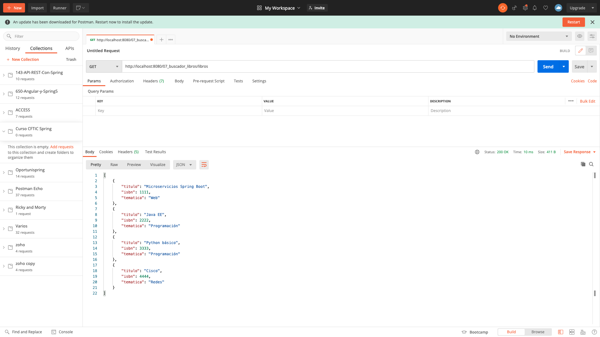


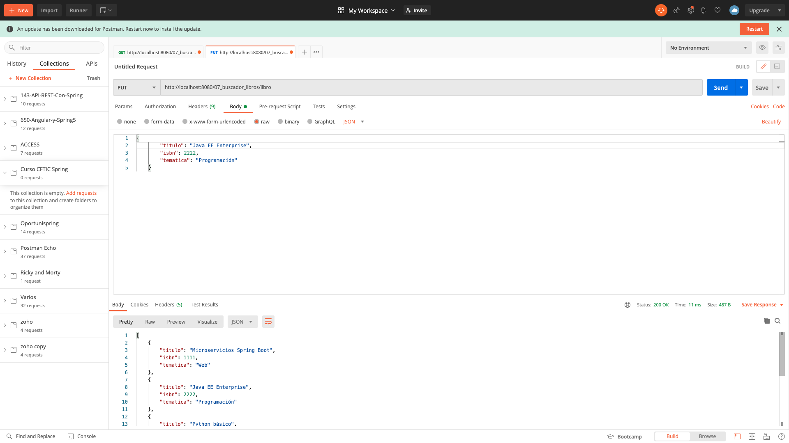
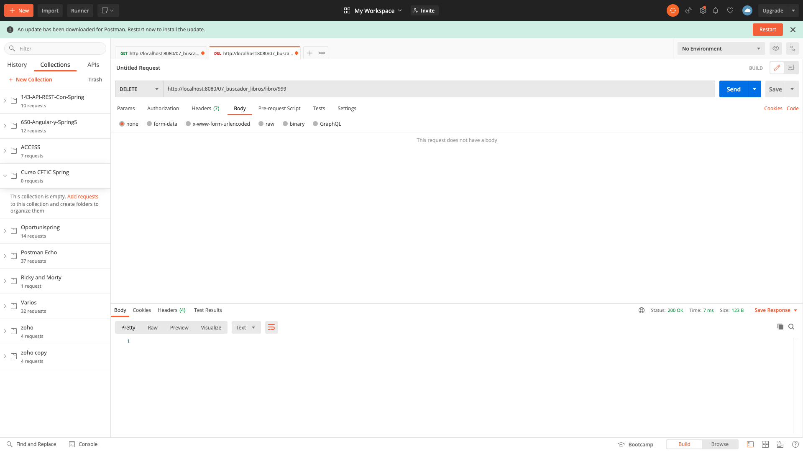


### :computer: `08_crud_libros`
#### Ejemplo de Servicio Rest usando BD.

Esta aplicación es practicamente la misma que la anterior pero en lugar de tener una colección de libros en memoria vamos a usar una BD.


En este ejemplo vamos a usar la BD `libreria` que contiene la tabla `libros`

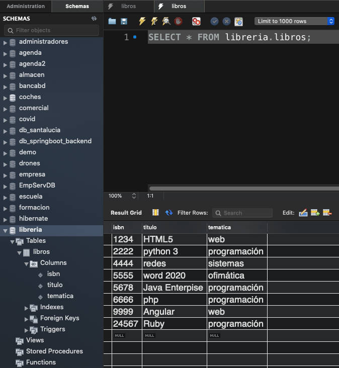

```sq
CREATE TABLE `libros` (
  `isbn` int NOT NULL,
  `titulo` varchar(45) DEFAULT NULL,
  `tematica` varchar(45) DEFAULT NULL,
  PRIMARY KEY (`isbn`)
) ENGINE=InnoDB DEFAULT CHARSET=utf8mb4 COLLATE=utf8mb4_0900_ai_ci
```

#### Añadir Dependencias

```html
<dependencies>
  	<dependency>
	    <groupId>org.springframework.data</groupId>
	    <artifactId>spring-data-jpa</artifactId>
	    <version>2.2.5.RELEASE</version>
	</dependency>
  </dependencies>
```

#### Creación de la Entidad

Como ya estamos haciendo acceso a BD utilizamos una Entidad en lugar de un simple JavaBean.

`Libro`

```java
package model;

import javax.persistence.Entity;
import javax.persistence.Id;
import javax.persistence.Table;

@Entity
@Table(name="libros")
public class Libro {
	private String titulo;
	@Id
	private int isbn;
	private String tematica;
	public Libro(int isbn,String titulo, String tematica) {
		super();
		this.titulo = titulo;
		this.isbn = isbn;
		this.tematica = tematica;
	}
	public Libro() {
		super();
	}
	public String getTitulo() {
		return titulo;
	}
	public void setTitulo(String titulo) {
		this.titulo = titulo;
	}
	public int getIsbn() {
		return isbn;
	}
	public void setIsbn(int isbn) {
		this.isbn = isbn;
	}
	public String getTematica() {
		return tematica;
	}
	public void setTematica(String tematica) {
		this.tematica = tematica;
	}
	
}
```

#### Creación del Repositorio

Como vamos a usar Spring Data JPA creamos una Interface que implemente `JpaRepository`, y solo añadimos los métodos que no nos aporte `JpaRepository`.

`LibrosJpaRepository`

```java
package repository;

import java.util.List;

import org.springframework.data.jpa.repository.JpaRepository;

import model.Libro;

public interface LibrosJpaRepository extends JpaRepository<Libro,Integer>{
   List<Libro> findByTematica(String tema);
}
```

#### Creación de la Capa de Servicio

Es la misma que el proyecto anterior la podemos copiar

`LibrosService`

```java
package service;

import java.util.List;

import model.Libro;

public interface LibrosService {
	List<Libro> todosLibros();
	List<Libro> librosPorTematica(String tematica);
	Libro libroPorIsbn(int isbn);
	void nuevoLibro(Libro libro);
	void actualizarLibro(Libro libro);
	void eliminarLibro(int isbn);
}
```

`LibrosServiceImpl`

```java
package service;

import java.util.List;

import org.springframework.beans.factory.annotation.Autowired;
import org.springframework.stereotype.Service;

import model.Libro;
import repository.LibrosJpaRepository;

@Service
public class LibrosServiceImpl implements LibrosService {
    @Autowired
    LibrosJpaRepository repository;
	@Override
	public List<Libro> todosLibros() {
		return repository.findAll();
	}

	@Override
	public List<Libro> librosPorTematica(String tematica) {
		return repository.findByTematica(tematica);
	}

	@Override
	public Libro libroPorIsbn(int isbn) {
		return repository.findById(isbn).orElse(null);
	}
	@Override
	public void nuevoLibro(Libro libro) {
		repository.save(libro);
		
	}
	@Override
	public void actualizarLibro(Libro libro) {
		repository.save(libro);
		
	}
	@Override
	public void eliminarLibro(int isbn) {
		repository.deleteById(isbn);
	}

}

```

#### Creación del Controlador 

Es exactamente igual que el proyecto anterior lo podemos copiar.

`LibrosController`

```java
package controller;

import java.util.List;

import org.springframework.beans.factory.annotation.Autowired;
import org.springframework.http.HttpHeaders;
import org.springframework.http.HttpStatus;
import org.springframework.http.MediaType;
import org.springframework.http.ResponseEntity;
import org.springframework.web.bind.annotation.DeleteMapping;
import org.springframework.web.bind.annotation.GetMapping;
import org.springframework.web.bind.annotation.PathVariable;
import org.springframework.web.bind.annotation.PostMapping;
import org.springframework.web.bind.annotation.PutMapping;
import org.springframework.web.bind.annotation.RequestBody;
import org.springframework.web.bind.annotation.RestController;

import model.Libro;
import service.LibrosService;

@RestController
public class LibrosController {
	@Autowired
	LibrosService service;
	@GetMapping(value="libros",produces=MediaType.APPLICATION_JSON_VALUE)
	public List<Libro> libros(){
		return service.todosLibros();
	}
	@GetMapping(value="libros/{tema}",produces=MediaType.APPLICATION_JSON_VALUE)
	public ResponseEntity<List<Libro>> librosPorTema(@PathVariable("tema") String tema){
		List<Libro> libros= service.librosPorTematica(tema);
		HttpHeaders headers=new HttpHeaders();
		headers.add("totalLibros", libros.size()+"");
		return new ResponseEntity<List<Libro>>(libros,headers,HttpStatus.OK);
		
	}
	@GetMapping(value="libro/{isbn}",produces=MediaType.APPLICATION_JSON_VALUE)
	public ResponseEntity<Libro> buscarLibro(@PathVariable("isbn") int isbn) {
		Libro libro= service.libroPorIsbn(isbn);
		return libro==null?new ResponseEntity<Libro>(null,null,HttpStatus.BAD_REQUEST):
							new ResponseEntity<Libro>(libro,null,HttpStatus.OK);
		
	}
	@PostMapping(value="libro",consumes = MediaType.APPLICATION_JSON_VALUE)
	public ResponseEntity<Void> agregar(@RequestBody Libro libro) {
		service.nuevoLibro(libro);
		return new ResponseEntity<Void>(null,null,HttpStatus.OK );
	}
	@DeleteMapping(value="libro/{isbn}")
	public void eliminar(@PathVariable("isbn") int isbn) {
		service.eliminarLibro(isbn);
	}
	@PutMapping(value="libro",produces=MediaType.APPLICATION_JSON_VALUE,consumes=MediaType.APPLICATION_JSON_VALUE)
	public List<Libro> modificar(@RequestBody Libro libro){
		service.actualizarLibro(libro);
		return service.todosLibros();
	}
}

```
#### Configuración

`application.properties`

```txt
gestion.candidatos.driver=com.mysql.cj.jdbc.Driver
gestion.candidatos.url=jdbc:mysql://localhost:3306/libreria?serverTimezone=Europe/Madrid
gestion.candidatos.user=root
gestion.candidatos.pwd=root
```

`Inicializador`

```java
package config;

import javax.servlet.ServletContext;
import javax.servlet.ServletException;
import javax.servlet.ServletRegistration;

import org.springframework.web.WebApplicationInitializer;
import org.springframework.web.context.ContextLoaderListener;
import org.springframework.web.context.support.AnnotationConfigWebApplicationContext;
import org.springframework.web.servlet.DispatcherServlet;

public class Inicializador implements WebApplicationInitializer {

	@Override
	public void onStartup(ServletContext servletContext) throws ServletException {
		// Crea el contexto raíz de la aplicación Web
		AnnotationConfigWebApplicationContext rootContext = new AnnotationConfigWebApplicationContext();

		// registro de la clase de configuración del modelo
		rootContext.register(SpringConfig.class);
		
		// Gestiona el ciclo de vida del contexto de aplicación
		servletContext.addListener(new ContextLoaderListener(rootContext));

		// Registra el archivo de configuración para MVC
		AnnotationConfigWebApplicationContext dispatcherContext = new AnnotationConfigWebApplicationContext();
		dispatcherContext.register(MvcConfig.class);

		// Crea y Registra el DispatcherServlet
		ServletRegistration.Dynamic dispatcher = servletContext.addServlet("dispatcher",
				new DispatcherServlet(dispatcherContext));
		dispatcher.setLoadOnStartup(1);
		dispatcher.addMapping("/");

	}

}
```

`SpringConfig`

```java
package config;

import javax.sql.DataSource;

import org.springframework.beans.factory.annotation.Value;
import org.springframework.context.annotation.Bean;
import org.springframework.context.annotation.ComponentScan;
import org.springframework.context.annotation.Configuration;
import org.springframework.context.annotation.PropertySource;
import org.springframework.data.jpa.repository.config.EnableJpaRepositories;
import org.springframework.jdbc.datasource.DriverManagerDataSource;
import org.springframework.orm.jpa.JpaTransactionManager;
import org.springframework.orm.jpa.LocalContainerEntityManagerFactoryBean;
import org.springframework.orm.jpa.vendor.HibernateJpaVendorAdapter;
import org.springframework.transaction.annotation.EnableTransactionManagement;

@EnableTransactionManagement
@EnableJpaRepositories(basePackages = "repository",entityManagerFactoryRef = "factory",transactionManagerRef = "txManager" )
@ComponentScan(basePackages = {"service"})
@Configuration
@PropertySource("classpath:config/application.properties")
public class SpringConfig {
	@Value("${gestion.candidatos.driver}")
	String driver;
	@Value("${gestion.candidatos.url}")
	String cadena;
	@Value("${gestion.candidatos.user}")
	String usuario;
	@Value("${gestion.candidatos.pwd}")
	String pw;
	//@Bean
	private DataSource crearDatasource() {
		DriverManagerDataSource data=new DriverManagerDataSource();
		data.setDriverClassName(driver);
		data.setUrl(cadena);
		data.setUsername(usuario);
		data.setPassword(pw);
		return data;
	}
	/*private DataSource crearDatasource() {
        DataSource dataSource = null;
        JndiTemplate jndi = new JndiTemplate();
        try {
            dataSource = jndi.lookup("java:comp/env/refformacion", DataSource.class);
        } catch (NamingException e) {
            e.printStackTrace();
        }
        return dataSource;
    }*/
	
	//adaptador de Hibernate
		@Bean
		public HibernateJpaVendorAdapter adapter() {
			HibernateJpaVendorAdapter adp=new HibernateJpaVendorAdapter();
			adp.setDatabasePlatform("org.hibernate.dialect.MySQLDialect");
			return adp;
		}
		//factoria EntityManager: Objeto para acceder a capa de persistencia con JPA
		@Bean
		public LocalContainerEntityManagerFactoryBean factory() {
			LocalContainerEntityManagerFactoryBean factory=new LocalContainerEntityManagerFactoryBean();
			factory.setPersistenceUnitName("libreriaPU");
			factory.setDataSource(crearDatasource());
			factory.setPackagesToScan("model");
			factory.setJpaVendorAdapter(adapter());
			/*Properties properties=new Properties();
			properties.put("hibernate.enable_lazy_load_no_trans",true);
			factory.setJpaProperties(properties);*/
			return factory;
		}
		//gestor de transacción
		@Bean
		public JpaTransactionManager txManager() {
			JpaTransactionManager manager=new JpaTransactionManager();
			manager.setEntityManagerFactory(factory().getObject());
			return manager;
		}
}
```

`MvcConfig`

```java
package config;

import org.springframework.context.annotation.ComponentScan;
import org.springframework.context.annotation.Configuration;
import org.springframework.web.servlet.config.annotation.EnableWebMvc;

@EnableWebMvc
@ComponentScan(basePackages = {"controller"})
@Configuration
public class MvcConfig {

}
```

#### Probar la Aplicación

http://localhost:8080/08_crud_libros/libros
http://localhost:8080/08_crud_libros/libros/programación
http://localhost:8080/08_crud_libros/libro/5678

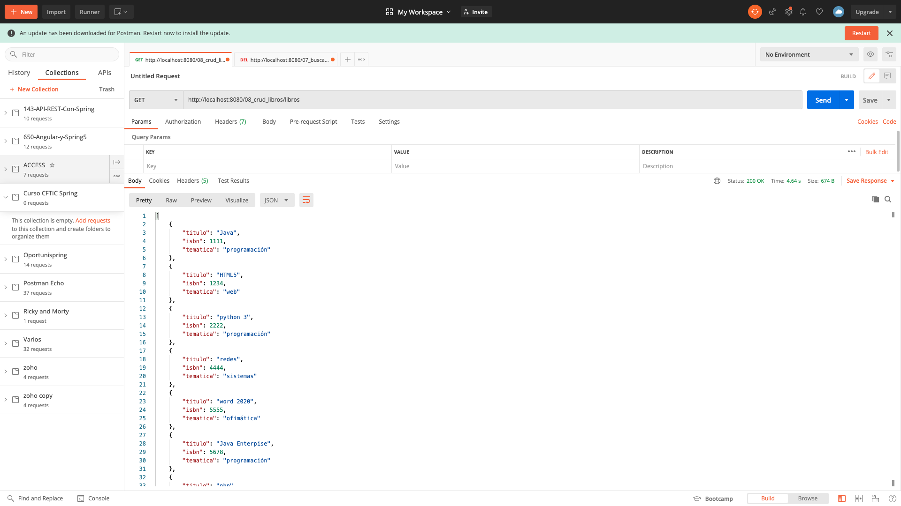

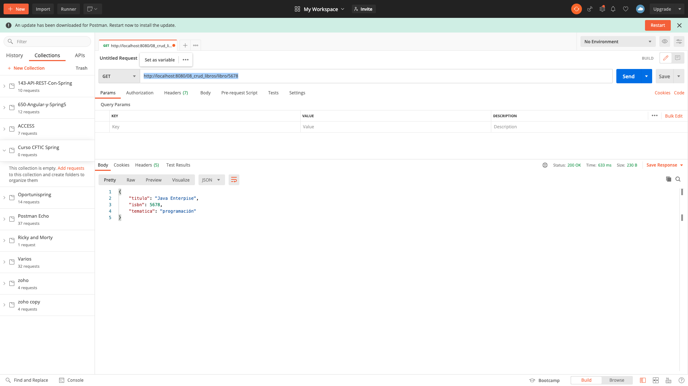
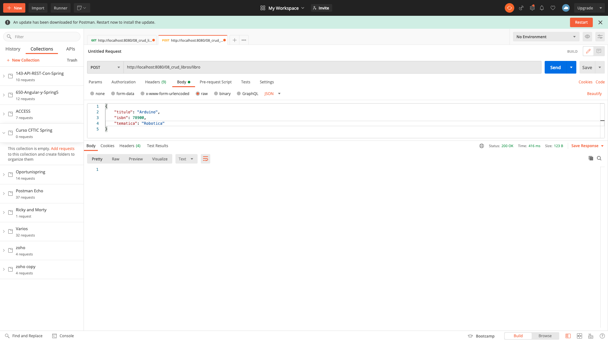
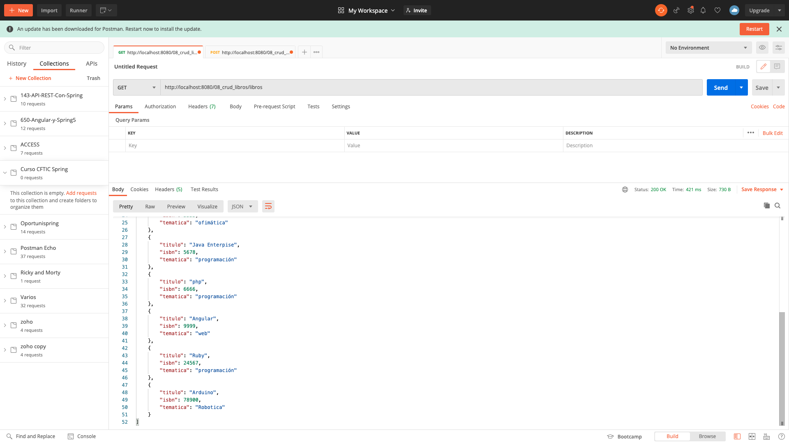

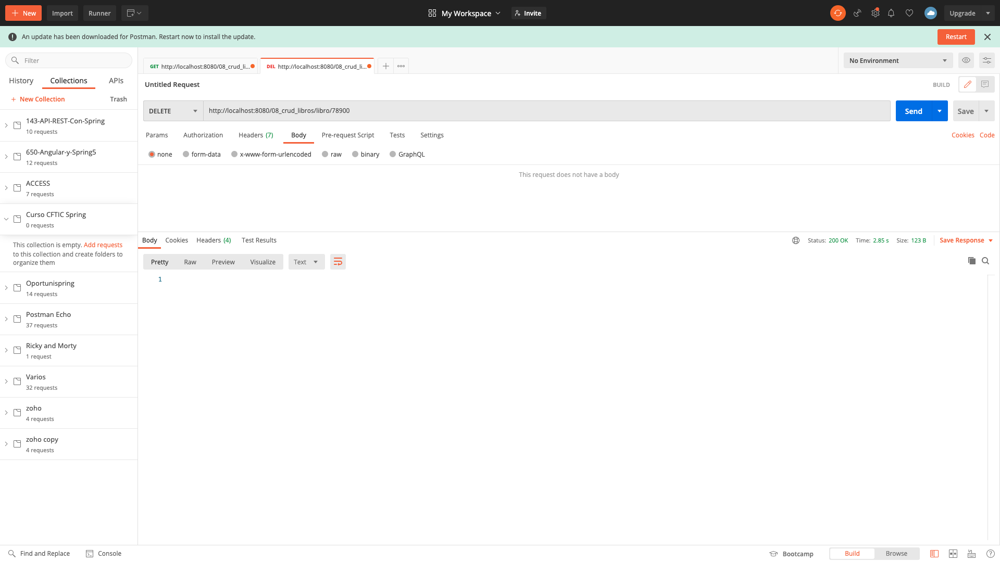
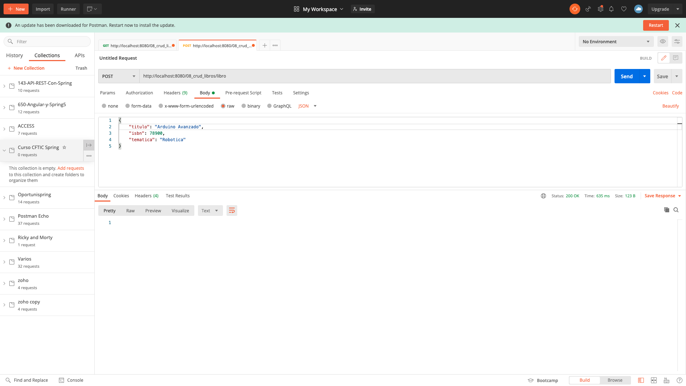
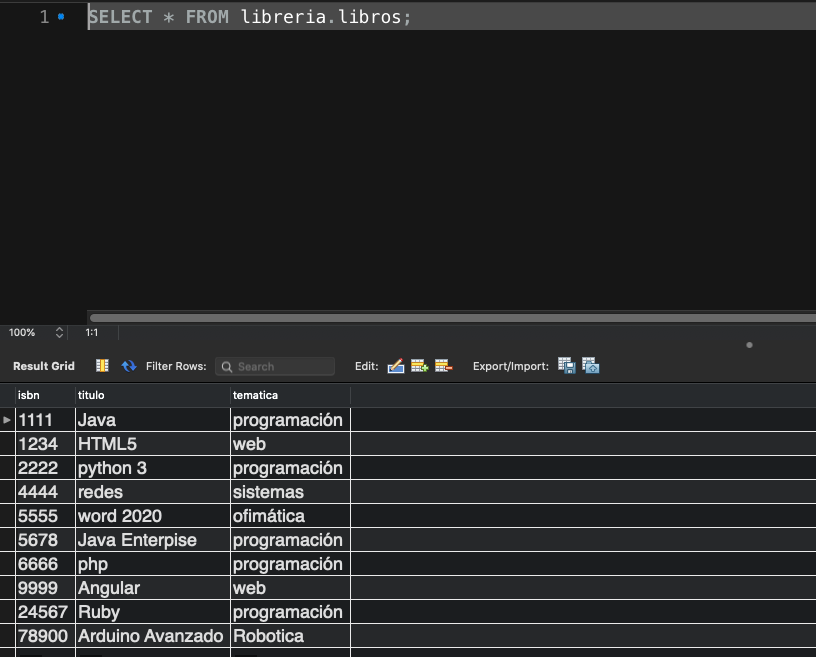
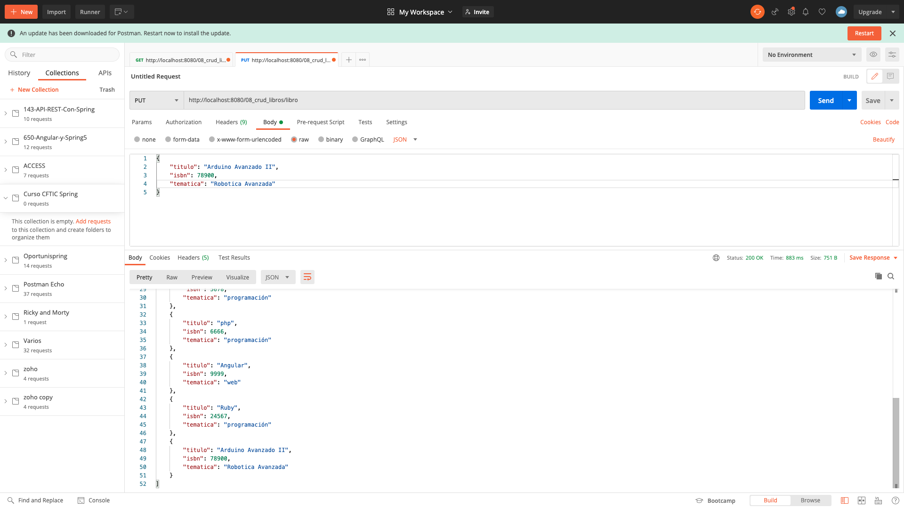
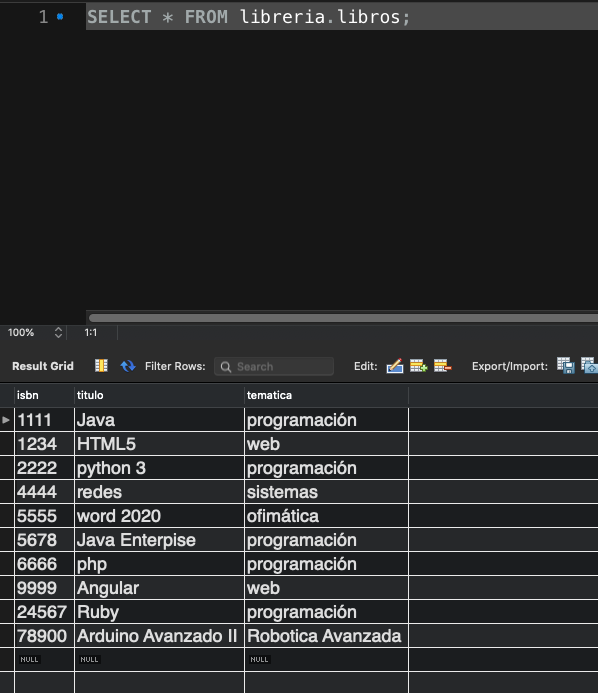


### :computer: `09_cliente_calculadora`
#### Ejemplo de Consumisión de un Servicio Rest usando un Cliente.

Esta aplicación es .

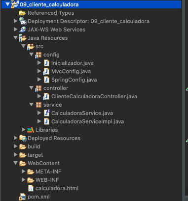

#### Añadir Dependencias

```html
<dependencies>
  	<dependency>
	    <groupId>org.thymeleaf</groupId>
	    <artifactId>thymeleaf</artifactId>
	    <version>3.0.11.RELEASE</version>
	</dependency>
	<dependency>
	    <groupId>org.thymeleaf</groupId>
	    <artifactId>thymeleaf-spring5</artifactId>
	    <version>3.0.11.RELEASE</version>
	</dependency>
	<!-- https://mvnrepository.com/artifact/org.thymeleaf.extras/thymeleaf-extras-springsecurity5 -->
	<dependency>
	    <groupId>org.thymeleaf.extras</groupId>
	    <artifactId>thymeleaf-extras-springsecurity5</artifactId>
	    <version>3.0.4.RELEASE</version>
	</dependency>
  
  </dependencies>
```

#### Creación de Servicio

`CalculadoraService`

```java
package service;

public interface CalculadoraService {
	int sumar(int a, int b);
	int multiplicar(int a, int b);
	int cuadrado(int a);
}
```

`CalculadoraServiceImpl`

```java
package service;

import org.springframework.beans.factory.annotation.Autowired;
import org.springframework.stereotype.Service;
import org.springframework.web.client.RestTemplate;
@Service
public class CalculadoraServiceImpl implements CalculadoraService {
	private String url="http://localhost:8080/05_calculadora_rest/";
	@Autowired
	RestTemplate template;
	
	@Override
	public int sumar(int a, int b) {
		String resp=template.getForObject(url+"sumar/{n1}/{n2}", String.class,a,b);
		return Integer.parseInt(resp);
	}

	@Override
	public int multiplicar(int a, int b) {
		String resp=template.getForObject(url+"multiplicar/{n1}/{n2}", String.class,a,b);
		return Integer.parseInt(resp);
	}

	@Override
	public int cuadrado(int a) {
		String resp=template.getForObject(url+"cuadrado/{n1}", String.class,a);
		return Integer.parseInt(resp);
	}

}
```

#### Creación del Controlador

`ClienteCalculadoraController`

```java
package controller;

import org.springframework.beans.factory.annotation.Autowired;
import org.springframework.stereotype.Controller;
import org.springframework.ui.Model;
import org.springframework.web.bind.annotation.PostMapping;
import org.springframework.web.bind.annotation.RequestParam;

import service.CalculadoraService;

@Controller
public class ClienteCalculadoraController {
	@Autowired
	CalculadoraService service;
	
	@PostMapping(value="sumar")
	public String sumar(@RequestParam("n1") int a, @RequestParam("n2") int b, Model model) {
		int resultado=service.sumar(a, b);
		model.addAttribute("resultado", resultado);
		return "calculadora";
	}
	@PostMapping(value="multiplicar")
	public String multiplicar(@RequestParam("n1") int a, @RequestParam("n2") int b, Model model) {
		int resultado=service.multiplicar(a, b);
		model.addAttribute("resultado", resultado);
		return "calculadora";
	}
	@PostMapping(value="cuadrado")
	public String cuadrado(@RequestParam("n1") int a, Model model) {
		int resultado=service.cuadrado(a);
		model.addAttribute("resultado", resultado);
		return "calculadora";
	}
}

```
#### Configuración

`Inicializador`

```java
package config;

import javax.servlet.ServletContext;
import javax.servlet.ServletException;
import javax.servlet.ServletRegistration;

import org.springframework.web.WebApplicationInitializer;
import org.springframework.web.context.ContextLoaderListener;
import org.springframework.web.context.support.AnnotationConfigWebApplicationContext;
import org.springframework.web.servlet.DispatcherServlet;

public class Inicializador implements WebApplicationInitializer {

	@Override
	public void onStartup(ServletContext servletContext) throws ServletException {
		// Crea el contexto raíz de la aplicación Web
		AnnotationConfigWebApplicationContext rootContext = new AnnotationConfigWebApplicationContext();

		// registro de la clase de configuración del modelo
		rootContext.register(SpringConfig.class);
		// Gestiona el ciclo de vida del contexto de aplicación
		servletContext.addListener(new ContextLoaderListener(rootContext));

		// Registra el archivo de configuración para MVC
		AnnotationConfigWebApplicationContext dispatcherContext = new AnnotationConfigWebApplicationContext();
		dispatcherContext.register(MvcConfig.class);

		// Crea y Registra el DispatcherServlet
		ServletRegistration.Dynamic dispatcher = servletContext.addServlet("dispatcher",
				new DispatcherServlet(dispatcherContext));
		dispatcher.setLoadOnStartup(1);
		dispatcher.addMapping("/");

	}

}
```

`SpringConfig`

```java
package config;

import org.springframework.context.annotation.Bean;
import org.springframework.context.annotation.ComponentScan;
import org.springframework.context.annotation.Configuration;
import org.springframework.web.client.RestTemplate;


@ComponentScan(basePackages = {"service"})
@Configuration
public class SpringConfig {
	@Bean
	public RestTemplate template() {
		return new RestTemplate();
	}
}
```

`MvcConfig`

```java
package config;

import org.springframework.beans.BeansException;
import org.springframework.context.ApplicationContext;
import org.springframework.context.ApplicationContextAware;
import org.springframework.context.annotation.Bean;
import org.springframework.context.annotation.ComponentScan;
import org.springframework.context.annotation.Configuration;
import org.springframework.web.servlet.config.annotation.EnableWebMvc;
import org.springframework.web.servlet.config.annotation.ResourceHandlerRegistry;
import org.springframework.web.servlet.config.annotation.ViewControllerRegistry;
import org.springframework.web.servlet.config.annotation.WebMvcConfigurer;
import org.thymeleaf.spring5.SpringTemplateEngine;
import org.thymeleaf.spring5.templateresolver.SpringResourceTemplateResolver;
import org.thymeleaf.spring5.view.ThymeleafViewResolver;
import org.thymeleaf.templatemode.TemplateMode;

@EnableWebMvc
@ComponentScan(basePackages = {"controller"})
@Configuration
public class MvcConfig implements WebMvcConfigurer, ApplicationContextAware{
	private ApplicationContext applicationContext;
	
	public void setApplicationContext(ApplicationContext applicationContext)
            throws BeansException {
        this.applicationContext = applicationContext;
    }
	 @Bean
	    public SpringResourceTemplateResolver templateResolver(){
	      
	        SpringResourceTemplateResolver templateResolver = new SpringResourceTemplateResolver();
	        templateResolver.setApplicationContext(this.applicationContext);
	        templateResolver.setPrefix("/");
	        templateResolver.setSuffix(".html");
	        // HTML es la plantilla por defecto, se indica por claridad.
	        templateResolver.setTemplateMode(TemplateMode.HTML);
	        // Template cache is true by default. Set to false if you want
	        // templates to be automatically updated when modified.
	        templateResolver.setCacheable(true);
	        return templateResolver;
	    }

	    @Bean
	    public SpringTemplateEngine templateEngine(){
	        // SpringTemplateEngine automatically applies SpringStandardDialect and
	        // enables Spring's own MessageSource message resolution mechanisms.
	        SpringTemplateEngine templateEngine = new SpringTemplateEngine();
	        templateEngine.setTemplateResolver(templateResolver());
	        // Enabling the SpringEL compiler with Spring 4.2.4 or newer can
	        // speed up execution in most scenarios, but might be incompatible
	        // with specific cases when expressions in one template are reused
	        // across different data types, so this flag is "false" by default
	        // for safer backwards compatibility.
	       
	        templateEngine.setEnableSpringELCompiler(true);
	        return templateEngine;
	    }

	    @Bean
	    public ThymeleafViewResolver viewResolver(){
	        ThymeleafViewResolver viewResolver = new ThymeleafViewResolver();
	        viewResolver.setTemplateEngine(templateEngine());
	        return viewResolver;
	    }
	    
	@Override
	public void addViewControllers(ViewControllerRegistry registry) {
	    
	 }
	
	@Override
    public void addResourceHandlers(ResourceHandlerRegistry registry) {
        registry.addResourceHandler("/*").addResourceLocations("/");
    }
}

```
#### Creación de la Vista

`calculadora.html`

```java
<!DOCTYPE html>

<html lang="es" xmlns:th="http://www.thymeleaf.org">
<head>
<style>
table, th, td {
	border: 1px solid GRAY;
	border-collapse: collapse;
}
a{
	color:LIGHTSLATEGRAY;
}
h1{
	color:DARKSALMON;
}
legend{
	color:INDIANRED;
}
</style>
<meta charset="ISO-8859-1">
<title>Registro de Cursos</title>
</head>
<body>
	<fieldset>
	<legend>Datos Curso</legend>
		<form action="sumar" method="post">
			<label >Número 1:</label><br>
			<input type="number" name="n1" required="required"><br>
			<label >Número 2</label><br>
			<input type="number" name="n2" required="required"><br>
			
			<input type="submit" value="Sumar">			
		</form>
	</fieldset>
	<span th:text="${resultado}"></span>
</body>
</html>
```
#### Probar la Aplicación 

Para probar esta aplicacón hay que arrancar el Servicio y el Cliente.

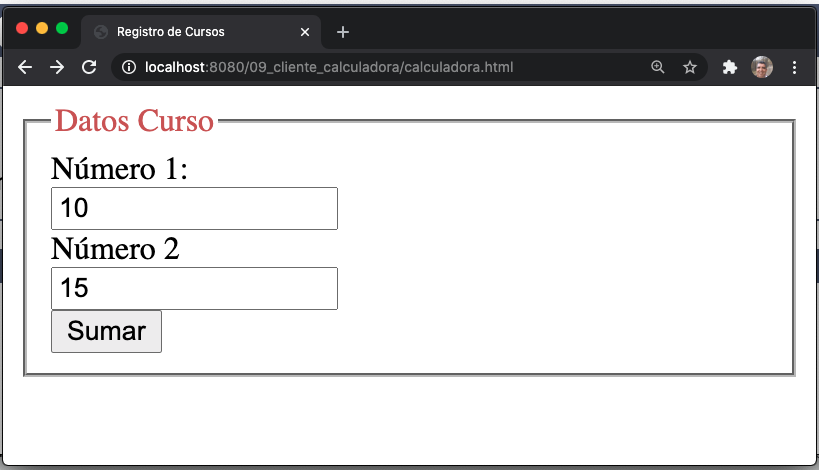
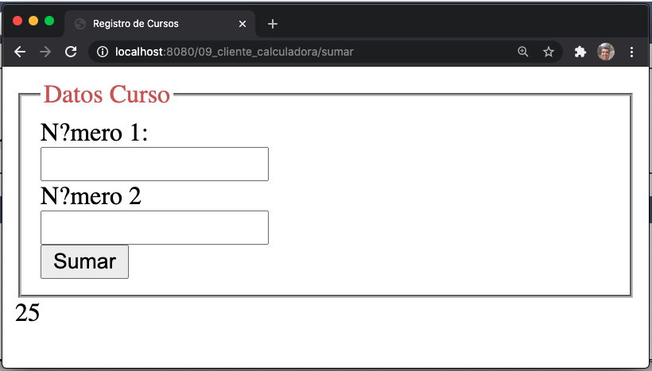

