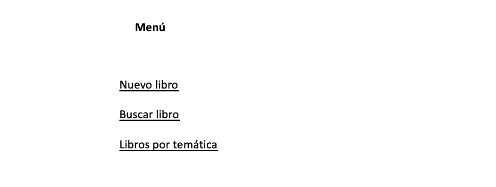
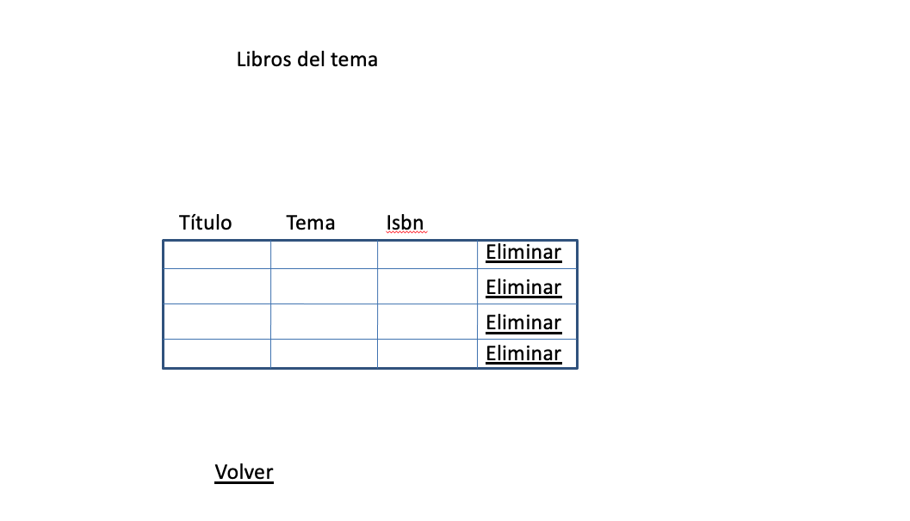
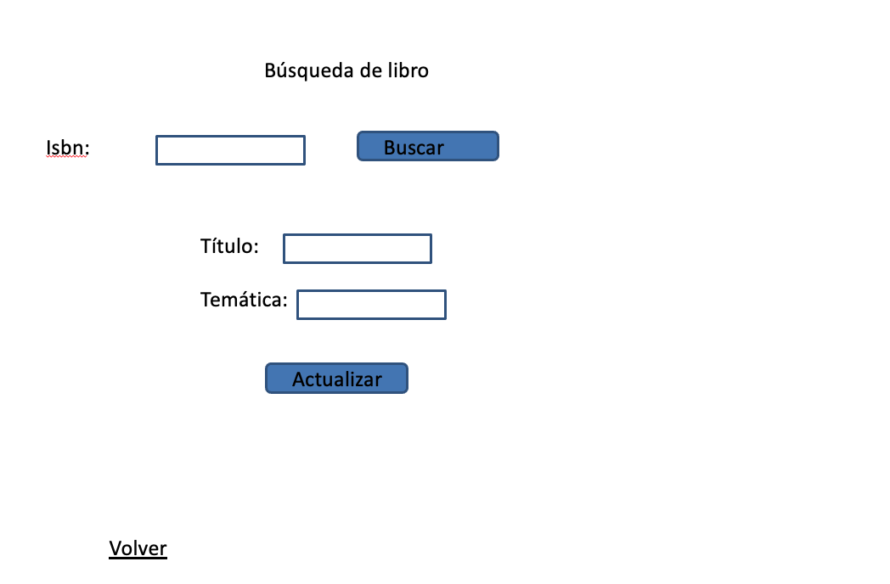
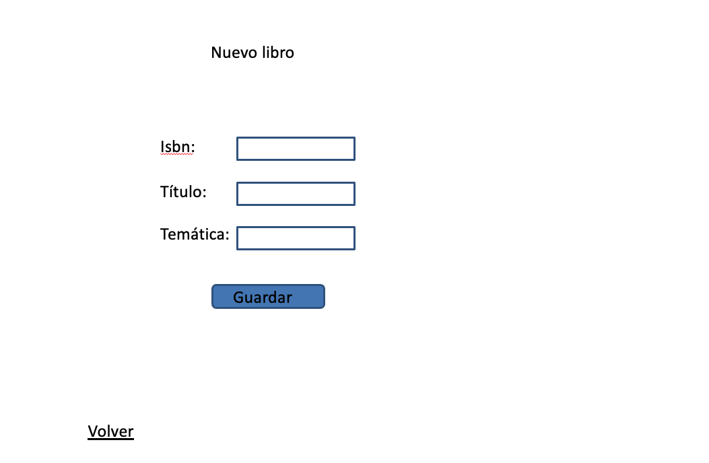
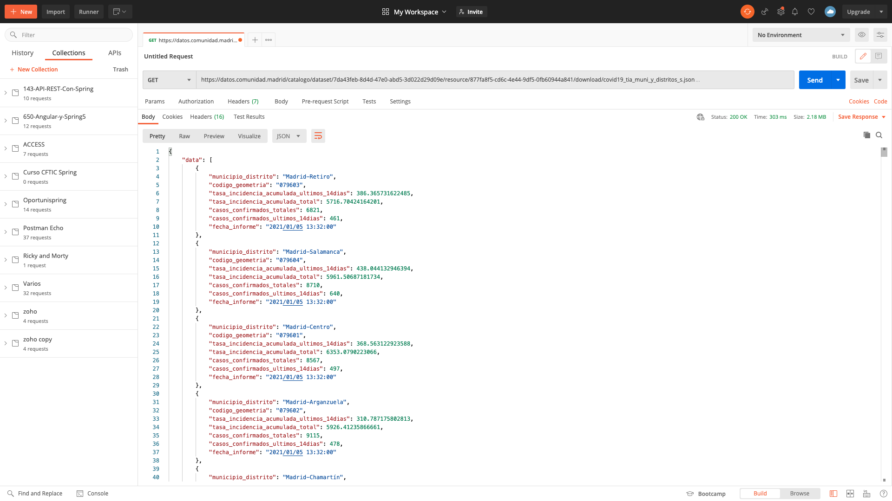
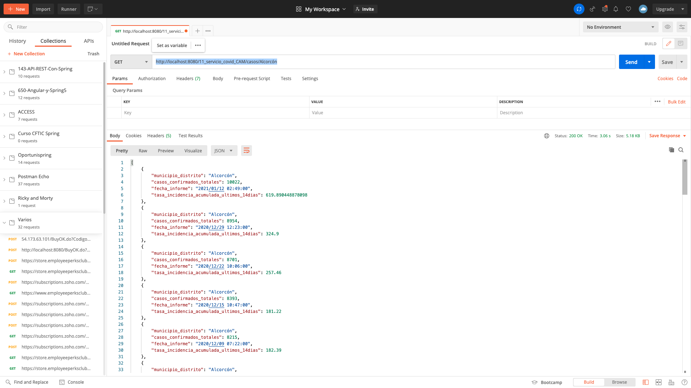

# 20210111 Lunes

## :computer: `10_cliente_app_libreria`

Vamos a crear un Cliente para la aplicación `08_crud_libros` con las siguientes características








### Creación del Modelo

`Libro`

```java
package model;

public class Libro {
	
   private String titulo;
   private int isbn;
   private String tematica;
	
   public Libro() {
      super();
   }

   public Libro(String titulo, int isbn, String tematica) {
      super();
      this.titulo = titulo;
      this.isbn = isbn;
      this.tematica = tematica;
   }

   public String getTitulo() {
      return titulo;
   }

   public void setTitulo(String titulo) {
      this.titulo = titulo;
   }

   public int getIsbn() {
      return isbn;
   }

   public void setIsbn(int isbn) {
      this.isbn = isbn;
   }

   public String getTematica() {
      return tematica;
   }

   public void setTematica(String tematica) {
      this.tematica = tematica;
   }

}
```

### Creación del Servicio

`LibreriaService`

```java
package service;

import java.util.List;

import model.Libro;

public interface LibreriaService {
   List<Libro> todosLibros();
   List<Libro> librosPorTematica(String tematica);
   Libro libroPorIsbn(int isbn);
   void nuevoLibro(Libro libro);
   void actualizarLibro(Libro libro);
   void eliminarLibro(int isbn);
}
```

`LibreriaServiceImpl`

```java
package service;

import java.util.Arrays;
import java.util.List;

import org.springframework.beans.factory.annotation.Autowired;
import org.springframework.http.HttpHeaders;
import org.springframework.http.ResponseEntity;
import org.springframework.stereotype.Service;
import org.springframework.web.client.HttpClientErrorException;
import org.springframework.web.client.RestTemplate;

import model.Libro;

@Service
public class LibreriaServiceImpl implements LibreriaService {

   private String url="http://localhost:8080/08_crud_libros/";
   @Autowired
   RestTemplate template;
	
   @Override
   public List<Libro> todosLibros() {
      Libro[] resp=template.getForObject(url+"libros/", Libro[].class);
      return Arrays.asList(resp);
   }

   @Override
   public List<Libro> librosPorTematica(String tematica) {
      Libro[] resp=template.getForObject(url+"libros/{tema}", Libro[].class, tematica);
      return Arrays.asList(resp);
   }

   @Override
   public Libro libroPorIsbn(int isbn) {
      Libro resp=template.getForObject(url+"libro/{isbn}", Libro.class, isbn);
      return resp;
   }

   @Override
   public void nuevoLibro(Libro libro) {
      template.postForLocation(url+"libro", libro);
   }

   @Override
   public void actualizarLibro(Libro libro) {
      template.put(url+"libro", libro);
   }

   @Override
   public void eliminarLibro(int isbn) {
      template.delete(url+"libro/{isbn}", isbn);
   }

}
```
* Hemos inyectado `RestTemplate` que es necesario para recuperar datos a partir de un servicio.
* Hemos definido el URL del servicio que vamos a acceder.
* Este servicio lo hemos realizado utilizando los métodos más básicos, para recuperar información usamos `getForObject()`, para almacenar `postForLocation()`, para actualizar `put()` y para borrar `delete()`.

Existe la posibilidad de implementar el servicio con `getForEntity()` para poder tener acceso a los encabezados en la respuesta.

Por ejemplo el método de actualizar que tenemos así:

```java
@Override
public void actualizarLibro(Libro libro) {
   template.put(url+"libro", libro);
}
```

Y lo podemos tener así:

```java
@Override
public void actualizarLibro(Libro libro) {
   template.exchange(url+"libro", HttpMethod.PUT, new HttpEntity<Book>(book), Book[].class);
}
```

O incluso lo podemos tener así:

```java
@Override
public void actualizarLibro(Libro libro) {
   ResponseEntity<Libro[]> libros = template.exchange(url+"libro", HttpMethod.PUT, new HttpEntity<Libro>(libro), Libro[].class);
}
```

Ya que nuestro servicio después de actualizar devuelve una lista de libros:

```java
@PutMapping(value="libro",produces=MediaType.APPLICATION_JSON_VALUE,consumes=MediaType.APPLICATION_JSON_VALUE)
public List<Libro> modificar(@RequestBody Libro libro){
   service.actualizarLibro(libro);
   return service.todosLibros();
}
```

Y tal como lo pusimos podríamos recuperar esta información.

En el caso `libroPorIsbn` que lo tenemos así:

```java
@Override
public Libro libroPorIsbn(int isbn) {
   Libro resp=template.getForObject(url+"libro/{isbn}", Libro.class, isbn);
   return resp;
}
```

Y que si vemos lo que hace el servicio en este caso tenemos:

```java
@GetMapping(value="libro/{isbn}",produces=MediaType.APPLICATION_JSON_VALUE)
public ResponseEntity<Libro> buscarLibro(@PathVariable("isbn") int isbn) {
   Libro libro= service.libroPorIsbn(isbn);
   return libro == null ? new ResponseEntity<Libro>(null,null,HttpStatus.BAD_REQUEST)
                        : new ResponseEntity<Libro>(libro,null,HttpStatus.OK);
		
}
```

El servicio nos devuelve un `ResponseEntity`, usamos `ResponseEntity` cuando queremos modificar la cabecera o el código de respuesta, que es lo que hacemos en este caso, si es `null` retornamos `BAD_REQUEST` y si no retornamos `OK`.

Todos los servicios retornan una cabecera y un cuerpo independientemente de que retorne un `ResponseEntity<>` o un `List<>`, ya es cosa del Cliente si quiere recuperar todo o solamente el cuerpo, si el Cliente solo quiere recuperar el Cuerpo con un `getForObject()` basta, si el Cliente quiere recuperar solamente el cuerpo basta hacerlo como lo tenemos:

```java
@Override
public Libro libroPorIsbn(int isbn) {
   Libro resp=template.getForObject(url+"libro/{isbn}", Libro.class, isbn);
   return resp;
}
```

Pero si desde el Cliente queremos recuperar la cabecera y el cuerpo lo ponemos así:

```java
@Override
public Libro libroPorIsbn(int isbn) {
   //Recupera Cabecera y cuerpo
   ResponseEntity<Libro> resp1 = template.getForEntity(url+"libros/{isbn}", Libro.class, isbn);
   return resp1.getBody();
}
```

* El método `getForEntity()` se diferencia de `getForObject()` que devuelve el `ResponseEntity` completo por si queremos accceder a la cabecera o al cuerpo. A la cabecera por si me interesa para algo en especial.

Lo mismo pasa en el `libroPorTema` del servicio que cuando lo implementamos lo hicimos así.

```java
@GetMapping(value="libros/{tema}",produces=MediaType.APPLICATION_JSON_VALUE)
public ResponseEntity<List<Libro>> librosPorTema(@PathVariable("tema") String tema){
   List<Libro> libros= service.librosPorTematica(tema);
   HttpHeaders headers=new HttpHeaders();
   headers.add("totalLibros", libros.size()+"");
   return new ResponseEntity<List<Libro>>(libros,headers,HttpStatus.OK);
		
}
```

* Nos devuelve un `ResponseEntity` con una lista de libros y en la cabecera decidimos retornar el `totalLibros`. Pero desde el Cliente yo decido si uso solo `getForObject()` solo para recuperar el cuerpo o `getForEntity()` para recuperar cabeceras y cuerpo. para este segundo este caso tendríamos en el cliente:

```java
@Override
public List<Libro> librosPorTematica(String tematica) {
   //Si nos interesa también la cabececera:
   ResponseEntity<Libro[]> respuesta = template.getForEntity(url+"libros/{tema}", Libro[].class, tematica);
   HttpHeaders encabezados=respuesta.getHeaders();
   System.out.println(encabezados.get("totalLibros"));
   return Arrays.asList(respuesta.getBody());
```

Son estos algunos de los ajustes que podríamos realizar en nuestro Servicio.

### Creación del Controlador

Una versión del Controlador podría ser la siguiente, ya que habría que ver cuales peticiones se harán AJAX y cuales no.

`ClienteLibreriaController`

```java
package controller;

import java.util.List;

import org.springframework.beans.factory.annotation.Autowired;
import org.springframework.stereotype.Controller;
import org.springframework.ui.Model;
import org.springframework.web.bind.annotation.GetMapping;
import org.springframework.web.bind.annotation.ModelAttribute;
import org.springframework.web.bind.annotation.PostMapping;
import org.springframework.web.bind.annotation.RequestParam;

import model.Libro;
import service.LibreriaService;

@Controller
public class ClienteLibreriaController {
   @Autowired
   LibreriaService service;
	
   @GetMapping(value="libros")
   public String todosLibros(Model model) {
      List<Libro> resultado=service.todosLibros();
      model.addAttribute("libros", resultado);
      return "libros";
   }
	
   @PostMapping(value="librosPorTematica")
   public String librosPorTema(@RequestParam("tema") String tema, Model model) {
      List<Libro> resultado=service.librosPorTematica(tema);
      model.addAttribute("resultado", resultado);
      return "libros_por_tema";
   }
	
   @PostMapping(value="librosPorIsbn")
   public String librosPorIsbn(@RequestParam("isbn") int isbn, Model model) {
      Libro resultado=service.libroPorIsbn(isbn);
      model.addAttribute("libro", resultado);
      return "buscar_libro_por_isbn";
   }
	
   @PostMapping(value="nuevoLibro")
   public String nuevoLibro(@ModelAttribute("nuevoLibro") Libro nuevoLibro, Model model) {
      service.nuevoLibro(nuevoLibro); 
      return "menu";
   }
	
   @PostMapping(value="actualizarLibro")
   public String actualizarLibro(@ModelAttribute("nuevoLibro") Libro libroModificado, Model model) {
      service.actualizarLibro(libroModificado); 
      return "menu";
   }
	
   @PostMapping(value="eliminarLibro")
   public String eliminarLibro(@RequestParam("isbn") int isbn, Model model) {
      service.eliminarLibro(isbn); 
      return "menu";
   }
	
   @GetMapping(value="irNuevoLibro")
   public String irNuevoLibro() {
      return "nuevo_libro";
   }
	
   @GetMapping(value="irBuscarPorIsbn")
   public String irBuscarPorIsbn() {
      return "buscar_libro_por_isbn";
   }

}
```


``
```java
```

``
```java
```
VARIAS COSAS EN EL VIDEO LO DE LAS EXCEPCIONES, PETICIONES POST CON ANGULAR ETC.

## :computer: `11_servicio_covid_CAM`

Vamos a crear una aplicación de Servicio que acceda a un Servicio externo para crear un nuevo API REST.

El servicio que vamos a usar es:

Datos covid Madrid por municipios y zonas de Salud desde 2-7-2020:
https://datos.comunidad.madrid/catalogo/dataset/7da43feb-8d4d-47e0-abd5-3d022d29d09e/resource/877fa8f5-cd6c-4e44-9df5-0fb60944a841/download/covid19_tia_muni_y_distritos_s.json

Si lo probamos con POSMAN nos retornará algo así:



```json
{
    "data": [
        {
            "municipio_distrito": "Madrid-Retiro",
            "codigo_geometria": "079603",
            "tasa_incidencia_acumulada_ultimos_14dias": 386.365731622485,
            "tasa_incidencia_acumulada_total": 5716.70424164201,
            "casos_confirmados_totales": 6821,
            "casos_confirmados_ultimos_14dias": 461,
            "fecha_informe": "2021/01/05 13:32:00"
        },
        {
            "municipio_distrito": "Madrid-Salamanca",
            "codigo_geometria": "079604",
            "tasa_incidencia_acumulada_ultimos_14dias": 438.044132946394,
            "tasa_incidencia_acumulada_total": 5961.50687181734,
            "casos_confirmados_totales": 8710,
            "casos_confirmados_ultimos_14dias": 640,
            "fecha_informe": "2021/01/05 13:32:00"
        },
	.
	.
	.
```

Creamos un Dinamyc Web Proyect y lo Mavemizamos, metemos el proyecto Padre.

### Crear el Modelo

Basasos en el JSON que retorna podemos ver que es posible que necesitemos dos JavaBeans para representar la información un `Item` y un `Conjunto` que será un array de Items el cual representa el objeto principal.


`Item`

```java
package model;

import java.util.Date;

import com.fasterxml.jackson.annotation.JsonFormat;
import com.fasterxml.jackson.annotation.JsonProperty;

public class Item {
   //El nombre de las Propidades debe coincidir con lo que regresa el JSON
   private String municipio_distrito;
   @JsonProperty(value ="tasa_incidencia_acumulada_ultimos_14dias")
   private double ia;
   private int casos_confirmados_totales;
   @JsonFormat(shape = JsonFormat.Shape.STRING, pattern = "yyyy/MM/dd hh:mm:ss")
   private Date fecha_informe;
   
   public Item() {
      super();
   }
   public Item(String municipio_distrito, double ia, int casos_confirmados_totales, Date fecha_informe) {
      super();
      this.municipio_distrito = municipio_distrito;
      this.ia = ia;
      this.casos_confirmados_totales = casos_confirmados_totales;
      this.fecha_informe = fecha_informe;
   }
   public String getMunicipio_distrito() {
      return municipio_distrito;
   }
   public void setMunicipio_distrito(String municipio_distrito) {
      this.municipio_distrito = municipio_distrito;
   }
	
   public double getIa() {
      return ia;
   }
	
   public void setIa(double ia) {
      this.ia = ia;
   }
   public int getCasos_confirmados_totales() {
      return casos_confirmados_totales;
   }
   public void setCasos_confirmados_totales(int casos_confirmados_totales) {
      this.casos_confirmados_totales = casos_confirmados_totales;
   }
   public Date getFecha_informe() {
      return fecha_informe;
   }
   public void setFecha_informe(Date fecha_informe) {
      this.fecha_informe = fecha_informe;
   }
	
}
```

* Hemos metido solo 4 propiedades que nos parecen las más relevantes.
* Con la anotación `@JsonProperty(value ="tasa_incidencia_acumulada_ultimos_14dias")` podemos asociar o mapear el nombre original del JSON a otro nombre más amigable, en este caso el atributo se llamará `ia`.
* El campo `fecha_informe` de tipo `Date` nos viene desde el cliente como un `String` pero gracias a la anotación `@JsonFormat(shape = JsonFormat.Shape.STRING, pattern = "yyyy/MM/dd hh:mm:ss")` hacemos la transformación automática a `Date`.
* Importante meter el constructor sin parametros.

Necesitamos otra clase que represente al objeto principal que contiene el array de todos los Items

`Conjunto`

```java
package model;

public class Conjunto {
   private Item[] data; //El nombre de la Propidad debe coincidir con lo que regresa el JSON

   public Conjunto(Item[] data) {
      super();
      this.data = data;
   }

   public Conjunto() {
      super();
   }

   public Item[] getData() {
      return data;
   }

   public void setData(Item[] data) {
      this.data = data;
   }
	
}
```

### Crear Capa de Servicio

Creación de la Interface que representa la capa de lógica del Servico.

`CovidService`

```java
package service;

import java.util.Date;
import java.util.List;

import model.Item;

public interface CovidService {
   List<Item> casosMunicipio(String municipio);
   List<Item> casosEntreFechas(Date fecha1, Date fecha2);
   int casosTotalesAcumulados();	
}
```

`CovidServiceImpl`

```
package service;

import java.util.Arrays;
import java.util.Date;
import java.util.List;
import java.util.Map;
import java.util.stream.Collectors;

import org.springframework.beans.factory.annotation.Autowired;
import org.springframework.stereotype.Service;
import org.springframework.web.client.RestTemplate;

import model.Conjunto;
import model.Item;

@Service
public class CovidServiceImpl implements CovidService {
   @Autowired
   RestTemplate template;
   
   private String url="https://datos.comunidad.madrid/catalogo/dataset/7da43feb-8d4d-47e0-abd5-3d022d29d09e/resource/877fa8f5-cd6c-4e44-9df5-0fb60944a841/download/covid19_tia_muni_y_distritos_s.json";
   
   int suma=0;
   
   @Override
   public List<Item> casosMunicipio(String municipio) {
      
      //Devuelve objeto Conjunto
      Conjunto conjunto=template.getForObject(url, Conjunto.class);
      return Arrays.stream(conjunto.getData()) //stream con todos los Item
               .filter(it->it.getMunicipio_distrito().equals(municipio))
               .collect(Collectors.toList());
   }

   @Override
   public List<Item> casosEntreFechas(Date fecha1, Date fecha2) {
      Conjunto conjunto=template.getForObject(url, Conjunto.class);
      return Arrays.stream(conjunto.getData()) //stream con todos los Item
         .filter(it -> it.getFecha_informe().compareTo(fecha1)>=0
	            && it.getFecha_informe().compareTo(fecha2)<=0)
		.collect(Collectors.toList());
   }
   
   @Override
   public int casosTotalesAcumulados() {
      suma=0;
      Conjunto conjunto=template.getForObject(url, Conjunto.class);
      Map<String,List<Item>> agrupados= Arrays.stream(conjunto.getData()) //stream con todos los Item
				.collect(Collectors.groupingBy(it->it.getMunicipio_distrito()));
      agrupados.forEach((k,v)->suma+=v.get(0).getCasos_confirmados_totales());
      return suma;
				
   }

}
```

* Anotada con `@Service`
* Inyectamos `RestTemplate` para poder interactuar con el servicio externo.
* Tenemos el atribiuto con la URL del servicio externo.

Vamos a explicar cada uno de los métodos:

Primer método:

```java
@Override
public List<Item> casosMunicipio(String municipio) {
      
   //Devuelve objeto Conjunto
   Conjunto conjunto=template.getForObject(url, Conjunto.class);
   return Arrays.stream(conjunto.getData()) //stream con todos los Item
                  .filter(it -> it.getMunicipio_distrito().equals(municipio))
                  .collect(Collectors.toList());
}
```

* Esto `conjunto.getData()` es un array de objetos `Item` el cual convertimos a un `stream` usandp la clase  `Arrays.stream(...)` la cual con este método transforma un array a un stream.
* Filtro por municipio
* Devuelvo una lista de `Item`

Segundo método:

```java
@Override
public List<Item> casosEntreFechas(Date fecha1, Date fecha2) {
   Conjunto conjunto=template.getForObject(url, Conjunto.class);
   return Arrays.stream(conjunto.getData()) //stream con todos los Item
                  .filter(it -> it.getFecha_informe().compareTo(fecha1)>=0
	            && it.getFecha_informe().compareTo(fecha2)<=0)
		  .collect(Collectors.toList());
}
```
* Filtro entre un rango de fechas, usamos `compareTo` para incluir los extremos, ya que con `after` y `before` no se incluyen.

Para el tercer método tenemos dos alternativas:

* Hay que tener encuenta la ultima fecha y sumar todos los casos confirmados por municipios. Una posible solución bajo esta premisa podría ser:

```java
@Override
public int casosTotalesAcumulados() {
   Conjunto conjunto=template.getForObject(url, Conjunto.class);
   
   Date fechaMaxima = Arrays.stream(conjunto.getData())
                               .collect(Collectors.groupingBy(i -> i.getFecha_informe()))
                               .keySet().stream()
                               .max((d1,d2) -> d1.getTime() > d2.getTime() ? 0 :1).get();
	
   return  Arrays.stream(conjunto.getData())
                               .filter(i -> i.getFecha_informe() == fechaMaxima)
                               .mapToInt(i -> i.getCasos_confirmados_totales())
                               .sum();
```

La segunda alternativa, lo que hace es agrupar por `municipio_distrito` para obtener un Map (cuando agrupamos se me devuelve un Map). Recorro el Map para ir sumando de los primeros elementos, obtener el primero y en concreto su valor `Casos_confirmados_totales` que voy acumulando en la suma. 

```java
@Override
public int casosTotalesAcumulados() {
   suma=0;
   Conjunto conjunto=template.getForObject(url, Conjunto.class);
   Map<String,List<Item>> agrupados= Arrays.stream(conjunto.getData()) //stream con todos los Item
				.collect(Collectors.groupingBy(it->it.getMunicipio_distrito()));
   agrupados.forEach((k,v)->suma+=v.get(0).getCasos_confirmados_totales());
   return suma;
				
}
```
* `suma` se debe declarar como atributo por que en las expresiones Lambda no se permiten modificar variables locales.

### Crear el RestController `CovidController`

* Inyectamos el Servicio `CovidService`.

```java
@RestController
public class CovidController {
   @Autowired
   CovidService service;
```

Vamos a escribir los recursos que queramos exponer asociados a peticiones `GET`.

1) Casos por municipio

```java
@GetMapping(value="casos/{muni}",produces=MediaType.APPLICATION_JSON_VALUE)
public List<Item> casosMunicipio(@PathVariable("muni") String municipio){
   return service.casosMunicipio(municipio);
}
```
* Nos produce un JSON gracias a `produces=MediaType.APPLICATION_JSON_VALUE`.
* La ruta para invocar este servicio es `casos` recibe la variable `muni`
* Y con el servicio recupera los casos del municipio que es lo que se retorna.

2) Casos por Fechas

```java
@GetMapping(value="casos/{f1}/{f2}",produces=MediaType.APPLICATION_JSON_VALUE)
public List<Item> casosPorFecha(@PathVariable("f1") String fecha1,@PathVariable("f2") String fecha2){
   LocalDate f1=LocalDate.parse(fecha1);
   LocalDate f2=LocalDate.parse(fecha2);
   return service.casosEntreFechas(
            Date.from(f1.atStartOfDay(ZoneId.systemDefault()).toInstant()),
            Date.from(f2.atStartOfDay(ZoneId.systemDefault()).toInstant()));
}
```
* Vamos a recibir las dos fechas como `Strings` que vendran en formato `yyyy-MM-dd` los cuales los debemos convertor a `Date` para poderselo pasar al servicio.
* Primero los `Strings` los convertimos a `LocalDate` que se hace de una forma sencilla con el método `LocalDate.parse(...)`.
* Tenemos que pasar de `LocalDate` a `Date` con el método `Date.from(INSTANTE)`.
* Otra alternativa es usar el `SimpleDateFormat` que parece más simple.

```java
@GetMapping(value="casos/{f1}/{f2}",produces=MediaType.APPLICATION_JSON_VALUE)
public List<Item> casosPorFecha(@PathVariable("f1") String fecha1,@PathVariable("f2") String fecha2){
   SimpleDateFormat formato=new SimpleDateFormat("yyyy-MM-dd"); 
   try {
      return service.casosEntreFechas(formato.parse(fecha1),formato.parse(fecha2));
   } catch (ParseException e) {			
      e.printStackTrace();
      return null;
   }
}
```
* Parece que habría una tercer alternativa usando la anotación `@DateTimeFormat(pattern="yyyy-MM-dd")` de Spring que te hace la transformación automática de String a Date.

3) Casos Acumulados

```java
@GetMapping(value="total",produces=MediaType.TEXT_PLAIN_VALUE)
public String casosTotales() {
   return String.valueOf(service.casosTotalesAcumulados());
}
```
* Lo devolvemos como texto plano.

### Crear Configuración.

`Inicializador`

```java
package config;

import javax.servlet.ServletContext;
import javax.servlet.ServletException;
import javax.servlet.ServletRegistration;

import org.springframework.web.WebApplicationInitializer;
import org.springframework.web.context.ContextLoaderListener;
import org.springframework.web.context.support.AnnotationConfigWebApplicationContext;
import org.springframework.web.servlet.DispatcherServlet;

public class Inicializador implements WebApplicationInitializer {

   @Override
   public void onStartup(ServletContext servletContext) throws ServletException {
      // Crea el contexto raíz de la aplicación Web
      AnnotationConfigWebApplicationContext rootContext = new AnnotationConfigWebApplicationContext();

      // registro de la clase de configuración del modelo
      rootContext.register(SpringConfig.class);
      // Gestiona el ciclo de vida del contexto de aplicación
      servletContext.addListener(new ContextLoaderListener(rootContext));

      // Registra el archivo de configuración para MVC
      AnnotationConfigWebApplicationContext 
   		dispatcherContext = new AnnotationConfigWebApplicationContext();
      dispatcherContext.register(MvcConfig.class);
   
      // Crea y Registra el DispatcherServlet
      ServletRegistration.Dynamic dispatcher = servletContext.addServlet("dispatcher",
				new DispatcherServlet(dispatcherContext));
      dispatcher.setLoadOnStartup(1);
      dispatcher.addMapping("/");

   }

}
```

`SpringConfig`

```java
package config;

import org.springframework.context.annotation.Bean;
import org.springframework.context.annotation.ComponentScan;
import org.springframework.context.annotation.Configuration;
import org.springframework.web.client.RestTemplate;

@ComponentScan(basePackages = {"service"})
@Configuration
public class SpringConfig {
   @Bean
   public RestTemplate template() {
      return new RestTemplate();
   }
}
```
* Como nuestra lógica de negocio no accede a BD sino a un servicio externo solo es necesario crear el `RestTemplate`. 

`MvcConfig`

```java
package config;

import org.springframework.context.annotation.ComponentScan;
import org.springframework.context.annotation.Configuration;
import org.springframework.web.servlet.config.annotation.EnableWebMvc;

@EnableWebMvc
@ComponentScan(basePackages = {"controller"})
@Configuration
public class MvcConfig {

}
```

#### Probar la Aplicación

http://localhost:8080/11_servicio_covid_CAM/casos/Alcorcón




``
```java
```

