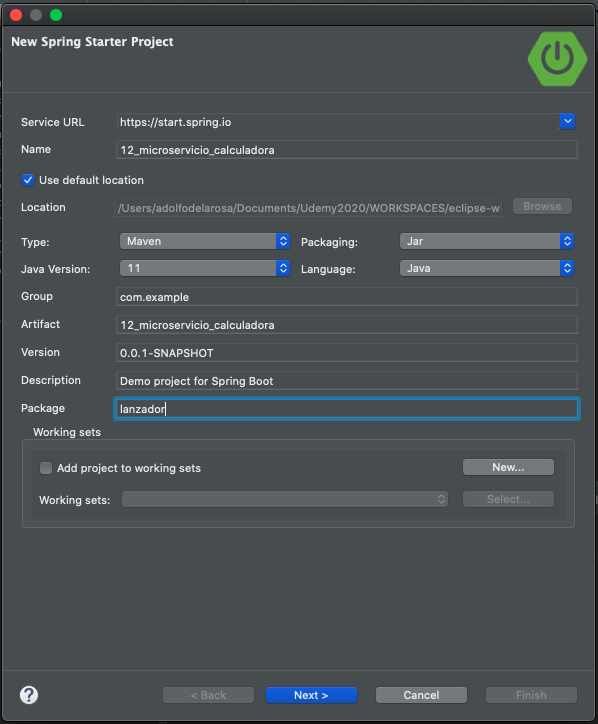
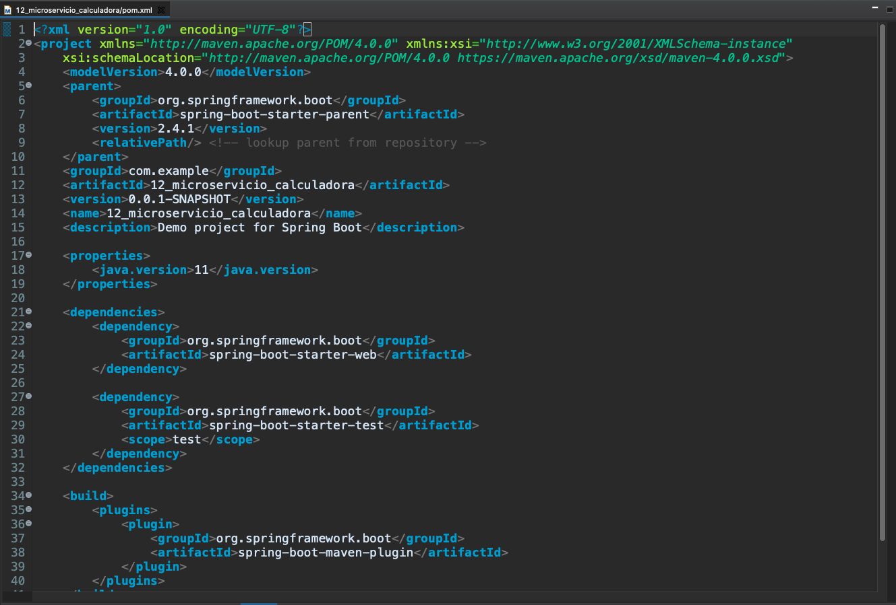
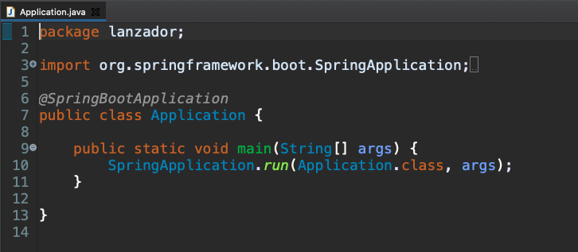
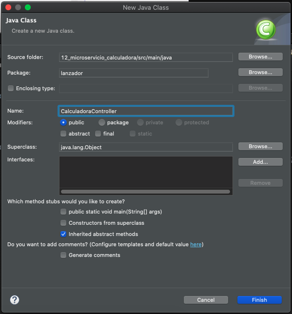

# 20210112 Martes

## Spring Boots


A diferencia de un Servicio Rest un Microservicio se ejecuta de forma autónoma e independiente, incluye todo lo necesesario para su ejecución. 


Simplifica la gestión de dependencias.
Con Spring Boot nos ahorramos mucha configuración que haciamos con Spring.
Te permite generar aplicaciones web como aplicaciones Java Standar, como Jar.


Usamos los ***starter*** de Spring Boot.


Muchas de las configuraciones manuales que se hacen en Spring con Spring Boot se asumen por defecto.

## Estructura de un MicroServicio con Spring Boots


La estructura de un Microservicio es básicamente la misma que la que teniamos con Spring, solo que sin Vistas.

Toda aplicación Spring Boot que se vaya a distribuir como un `.jar` dispone de una clase a la que llamamos Lanzador, la clase principal (una clase main)  que da inicio a la aplicación 


La instrucción `SpringApplication.run(...)` inicia todo el proceso Spring Boot, ejecuta la aplicación, por detrás arranca Tomcat, desplegar el servicio, arrancar las configuraciones por defecto etc. que es transparente para nosotros. Todo esto lo puede hacer gracias a que esta anotada con `@SpringBootApplication`.

`@SpringBootApplication` equivale a tres anotaciones:

* `@Configuration` Indica que es una clase de configuración.
* `@EnableAutoConfiguration` Anotación que habilita las configuraciones por defecto.
* `@ComponentScan` Escanear el paquete. 

Toda aplicación de Spring Boot lleva uns configuaciones por defecto que se aplican cuando se arranca la aplicación.

La clase Lanzadera `Application` también me podría servir como clase de configuración donde podría indicar la creacione de algunos Beans por ejemplo, entre otras cosas de configuración.


## :computer: `12_microservicio_calculadora`
### Ejemplo de la primera aplicación Spring Boot.

Para crear una aplicación Spring Boot ya no usamos la clasica aplicación Dynamic Web Project sino que utilizaremos la opción de Spring Starter Project.





En este último paso es donde vamos a seleccionar las dependencias de nuestro proyecto, los **"starter"** los cuales incorporan un grupo de dependencias para hacer varias cosas. Como este es un servicio básico nos va a bastar con incluir solo *Spring Web*. 


En el último paso tenemos un reumen.


Esta es la estructura de nuestro primer Proyecto Spring Boot el cual tiene algunas diferencias con respecto a un proyecto Spring normal, no tenenos un Java Resources si no más bien tenemos un `src/main/resources`


Una cosa que nos puede llamar la atención son todas las Maven Dependencies, aun que nosotros solo metimos el *starter Spring Web* el número de dependencias que se han metido son bastantes más, hay muchos `.jar`, entrellos Tomcat, JUnit, Spring Core, etc.

Una aplicación Boot ya viene preparada para temas de Testing, de echo en la estructuta del proecto creado tenemos la carpeta `src/test/java` donde ya se ha creado una clase de testing que podemos usar para probar nuestra aplicación.



Si hechamos un vistazo al `pom.xml` esperariamos ver un monton de dependencias pero realmente no es así, solo tenemos el *starter Spring Web* y *starter Spring Test* que lo metio automaticamente ya que nosotros no lo indicamos, ademas tiene un Padre definido. Así que nuestro `pom.xml` nos queda muy limpio.



En el paquete lanzador tenemos la clase `Application` que es lo que se explico antes en las diapositivas. 

Como nuestro servicio va a ser muy sencillo no tiene Modelo, no tiene Servicio solo tiene el Controlador.

### Crear la Clase `CalculadoraController`

Vamos a crear esta clase en el mismo paquete `lanzador` donde se ubica la clase `Application`.



Como la lógica de este Servicio ya la teniamos implementada en el proyecto `05_calculadora_rest` la copiamos así que nuestra clase nos queda así:

`CalculadoraController`

```java
...
@RestController
public class CalculadoraController {
	@GetMapping(value="sumar/{n1}/{n2}",produces=MediaType.TEXT_PLAIN_VALUE)
	public String suma(@PathVariable("n1") int a, @PathVariable("n2") int b) {
		return String.valueOf(a+b);
	}
	@GetMapping(value="multiplicar/{n1}/{n2}",produces=MediaType.TEXT_PLAIN_VALUE)
	public String multiplica(@PathVariable("n1") int a, @PathVariable("n2") int b) {
		return String.valueOf(a*b);
	}
	@GetMapping(value="cuadrado/{n1}",produces=MediaType.TEXT_PLAIN_VALUE)
	public String cuadrado(@PathVariable("n1") int x) {
		return String.valueOf(x*x);
	}
}
```

Ya con esto sería suficiente para ejecutar nuestra aplicación, la cual no vamos a ejecutar en el Servidor Tomcat normal como lo hemos hecho hasta ahora, por que esta aplicación Spring Boot ya trae embebido su propio Tomcat, lo unico es que no podemos tener arrancados los dos Tomcats, ya que el Tomcat embebido va a usar el puerto 8080 que es el mismo que usa el Tomcat normal, así que antes de arrancar nuestra aplicación Spring Boot parar el Tomcat tradicional.

La manera de ejecutar la aplicación Spring Boot es como una aplicación normal **Java Application** o con **Spring Boot App**.


Ambas opciones hacen exactamente lo mismo lo único es que si elegimos **Spring Boot App** en la ventana de la consola da más detalles de la aplicación, al arrancar la aplicación tenemos:


Se nos indica que la aplicación ha sido arrancada en el puerto 8080 y otra cosa que llama la atención es que no tiene un ***context path*** por defecto así que nuestra URL será http://localhost:8080/ más el servicio que queramos probar.

¿Cómo pobamos la aplicación para saber si la calculadora funciona? Lo hacemos con Postman.

http://localhost:8080/sumar/5/10


Como vemos el Servicio funciona, solo que hay un detalle el tener el `CalculadoraController` junto con `Application` no es muy elegante, deberíamos tenerlo en su propio paquete `controller`


 
