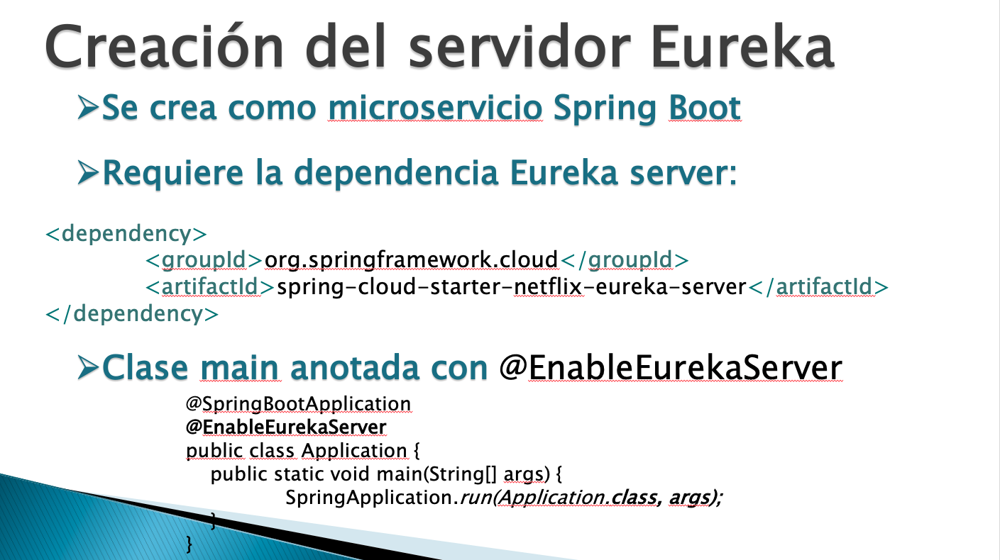
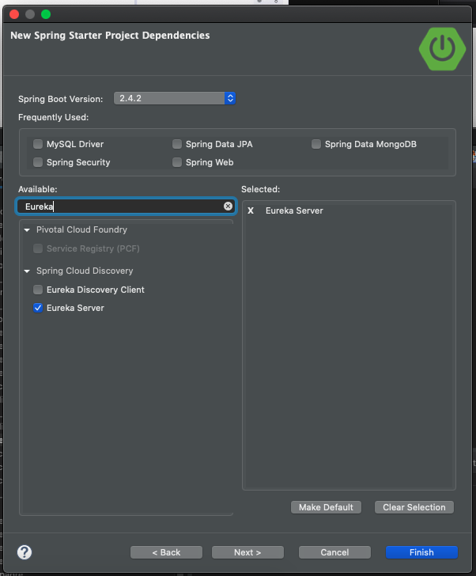
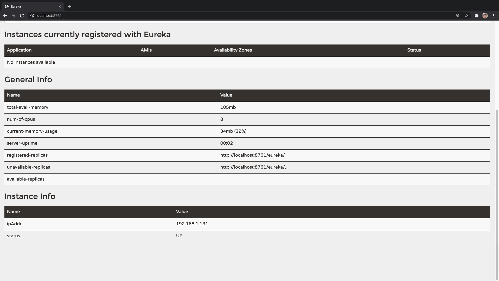
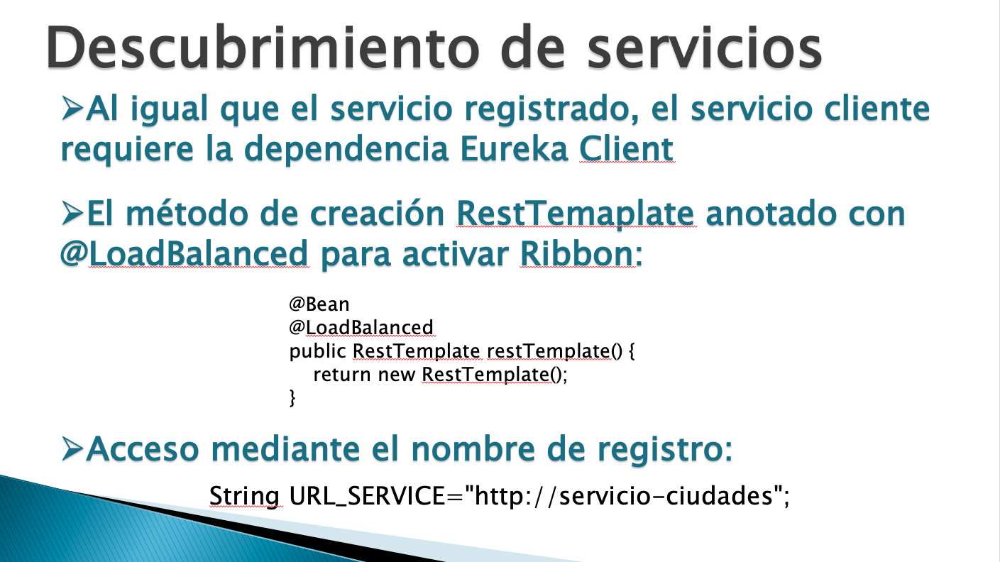

# 20210120 Miercoles

## Spring Cloud


Spring Cloud son una serie de soluciones basadas en Spring para el despliegue y utilización de MicroServicios en la nube, tener servicios en la nube tiene entre otros inconvenientes que el cliente que interactue com los MicroServicios tenga que conocer donde estan, eso es inviable, entonces para resolver ese problema hay una serie de tecnologías que forman parte de Spring Cloud que nos van a ayudar a solucionar los problemas que se nos presenten en los MicroServicios.


Las tecnologías que vamos a utilizar son:

* Eureka Server
* Ribbon
* Spring Cloud Config
* Zuul

Aunque en las ultimas versiones de Spring Cloud una de estas tecnologías se ha quedado como obsoleta y se tiene que sustituir por otra.

Tanto Eureka Server, Spring Cloud Config y Zuul son un tipo especial de MicroServicios y Ribbon es una librería.

Eureka Server va a ser un MicroServicio en el que se van a registrar los demas MicroServicios, para facilitar la visibilidad de los MicroServicios.

Ribbon proporciona balance de carga.

Spring Cloud Config centraliza la configuración de un conjunto de servicios.

Zuul nos proporciona un punto de acceso único a un conjunto de servicios, una solución para el cliente final.


Este es un esquema general de todos los elementos.

## Servidor Eureka


Inventado por Netflix integrado por Spring en el proyecto Spring Cloud Netflix. La idea es que si tenemos un grupo de MicroServicios que tienen que interactuar entre si en lugar que lo hagan directamente entre ellos, lo hagan a través del Servidor Eureka. En la imagen tenemos 4 MicroServicios, uno es el Cliente que tiene que interactuar entre los otros 3, para evitar que este llamando a cada uno de ellos se hace a traves de Eureka Server, que por un lado permite a los MicroServicios que van a ser llamados por otros, registrarse, en ese registro lo que se guarda es una especie de tabla donde se indica donde esta cada MicroServicio fisicamente, y entonces cuando otro MicroServicio quiere llamar a otro MicroServicio se consulta a través de Eureka a través de un nombre, si algún servicio se despliega en otro sitio se lo indica a Eureka para que cuando el Cliente quiera usarlo lo pueda encontrar, por lo que en el código del MicroServicio que consulte a otro ya no tendremos que incluir la dirección física para que lo encuentre escribiremos el nombre que se registra en Eureka.

La consulta que hace el Cliente a Eureka lo hace utilizando la librería RIBBON que tendremos que integrar en el MicroServicio Cliente, para que haga las consultas a Eureka y les diga donde esta el MicroServicio solicitado.



¿Cómo se crea un Servidor Eureka?

Es otro MicroServicio pero especial, así que lo vamos a crear como hemos creado los MicroServicios de Spring Boot y para crearlo lo único que va a necesitar es incluir el Starter `spring-cloud-starter-netflix-eureka-server` solamente se necesitara meter una anotación y hacer una configuración en su `application.properties` para este tipo de servicios, en este servidor NO VA A HABER CÓDIGO, lo único que tendrá es el Lanzador que tendra la anotación `@EnableEurekaServer` y por otro lado vamos a tener su configuración en un archivo `application.properties` o en un archivo `application.yml` que es la tendencia.


Esta es una configuración básica de ejemplo, pero en el momento que usamos Spring Cloud todos los servicios implicados deben tener un nombre es decir una propiedad `spring.application.name`, el puerto por convención para el Servidor Eureka es 8761, con la propiedad `registerWithEureka:false` le estamos indicando que este servicio no se registre en Eureka, por ser el mismo Eureka como se va a registrar en si mismo, la ultima propiedad no se necesita en el Servidor Eureka, no debe estar en la diapositiva.

## :computer: `26_servidor_eureka`
### Servidor Eureka




Este proyecto solo necesita la dependencia Eureka Server. 

Si vemos las dependencias Maven que se descargan al crear el proyecto veremos que tiene muchas.

En el lanzador metemos la anotación `@EnableEurekaServer`.


Para la configuración no vamos a usar el `application.properties` que podríamos pero lo vamos a borrar y vamos a crear el archivo `application.yml` de la siguiente manera:


En este archivo `application.yml` vamos a meter la configuración:

```txt
server:
  port: 8761
spring:
  application:
    name: eureka-server
eureka:
  client:
    register-with-eureka: false
   
```


Lo primero que hacemos es asignar el puerto, darle un nombre a este servicio, indicarle que que no se se registre Eureka en si mismo, por defecto es `true` por eso hay que ponerla explicitamente.

Si arrancamos el servidor vemos en el Log lo siguiente:


Vemos una serie de exepciones que tienen que ver con el `register-with-eureka: false`, al decirle que no se registre así mismo el intenta comprobar cosas y y algo allí que falla por eso vemos esas excepciones, esto se resuelve añadiendo otra propiedad, `fetch-registry: false`.


```txt
server:
  port: 8761
spring:
  application:
    name: eureka-server
eureka:
  client:
    register-with-eureka: false
    fetch-registry: false
```

Si arrancamos nuevamente ya no vemos las excepciones.


Vamos a aarancar la aplicación y en el navegador vamos a poner la URL http://localhost:8761/




Eureka nos ofrece un Dashboard en la que podemos ver varias cosas como los servicios que hay registrados, que por el momento no tenemos nada registrado, entre más información que nos proporciona como la Dirección IP.





