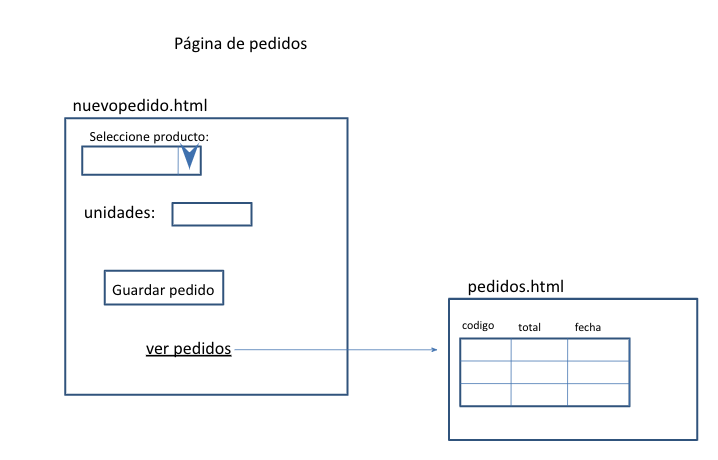
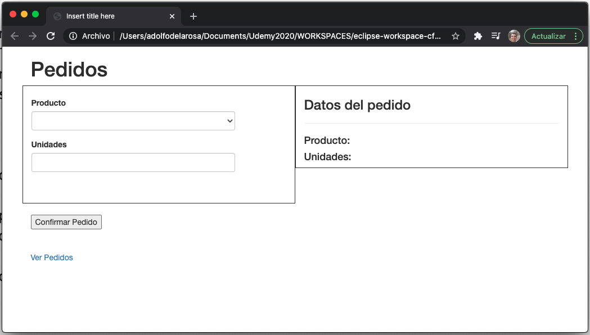
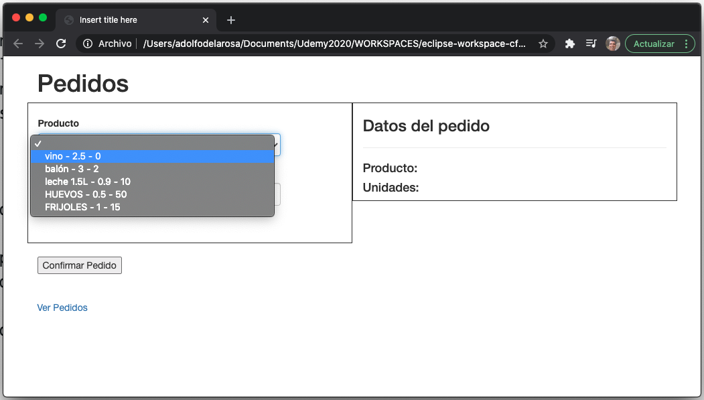
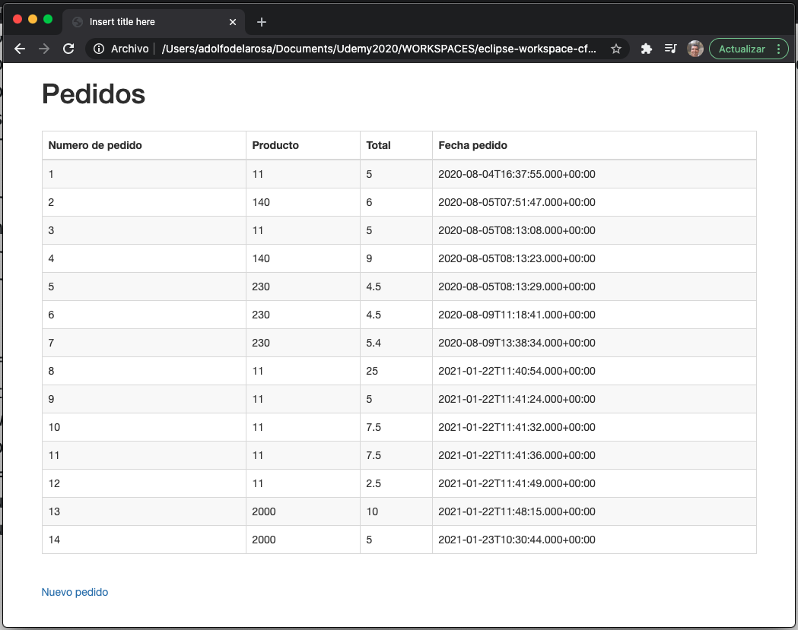
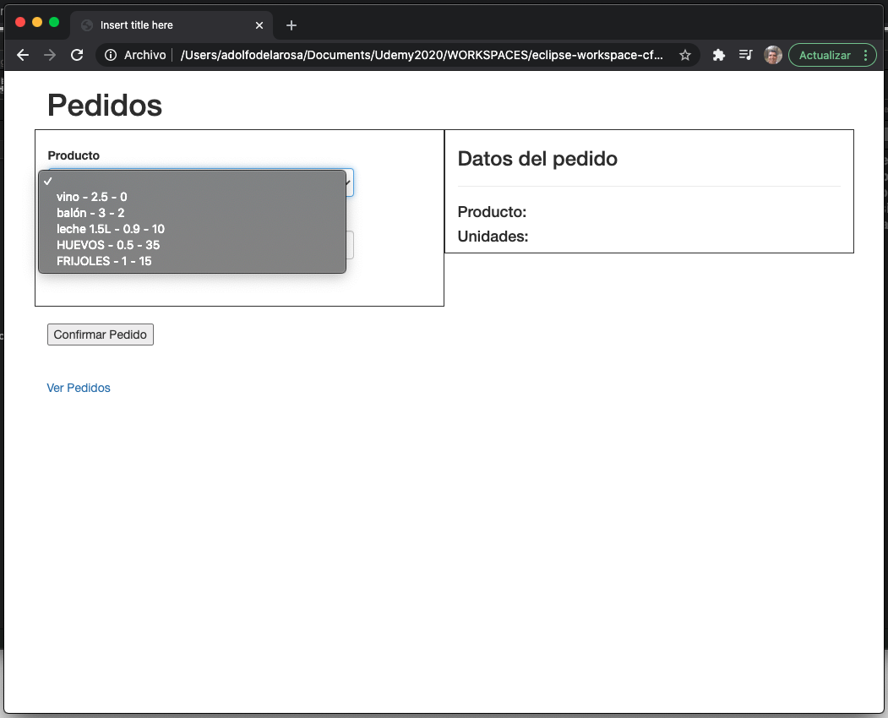
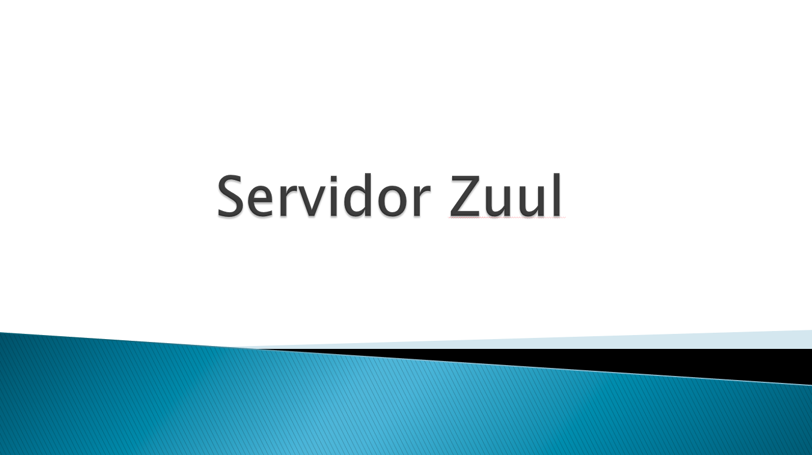
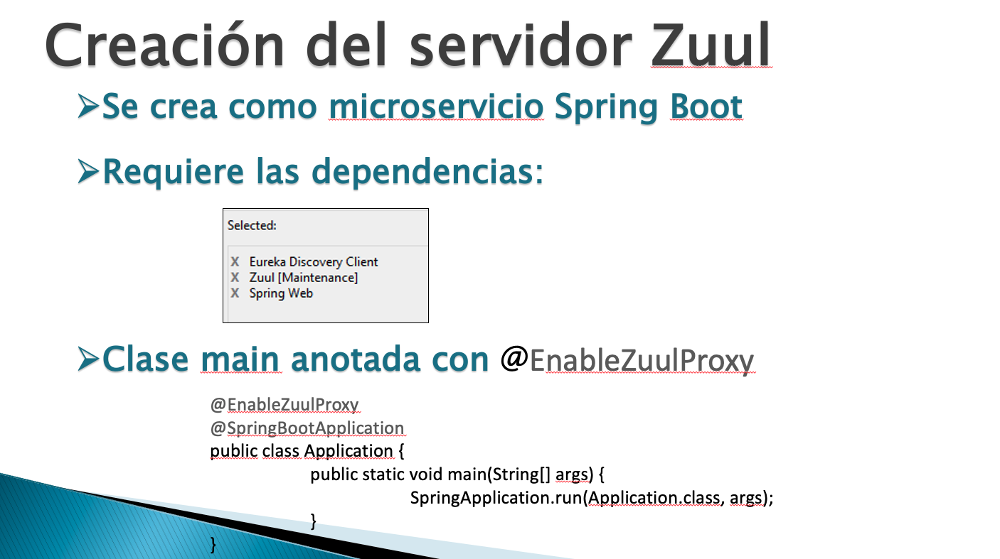
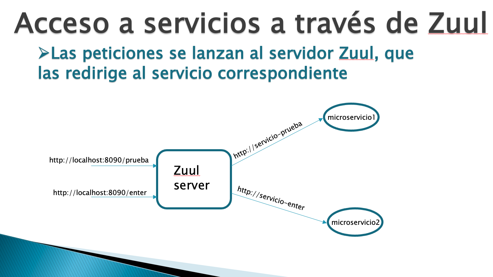
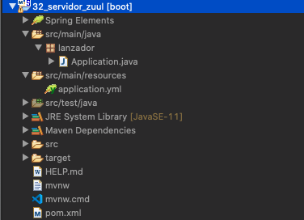
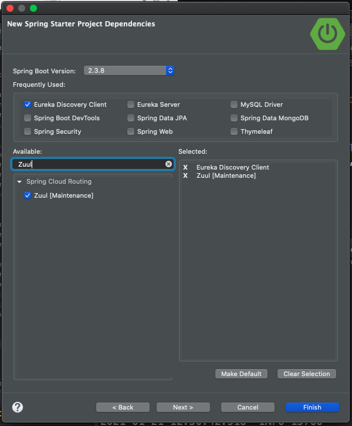

# 20210121 Jueves

## :computer: `31_cliente_front_pedidos`
### FrontEnd de la Aplicación realizada con JS, (ServerLess)





`nuevopedido.html`

```html
<!DOCTYPE html>
<html>
<head>
<meta charset="ISO-8859-1">
<script src="https://ajax.googleapis.com/ajax/libs/angularjs/1.6.9/angular.min.js"></script>
<title>Insert title here</title>
<!-- Latest compiled and minified CSS -->
<link rel="stylesheet" href="https://maxcdn.bootstrapcdn.com/bootstrap/3.4.0/css/bootstrap.min.css">

<!-- jQuery library -->
<script src="https://ajax.googleapis.com/ajax/libs/jquery/3.3.1/jquery.min.js"></script>

<!-- Latest compiled JavaScript -->
<script src="https://maxcdn.bootstrapcdn.com/bootstrap/3.4.0/js/bootstrap.min.js"></script> 
</head>
<body>
   <div ng-app="comunicacionApp" ng-controller="comunicacionController" class="container" ng-init="cargarProductos()">
      <h1>Pedidos</h1>
      <div class="row">	
         <div class="col-sm-6" style="border:solid 1px">
            <br/>
			
            <div class="form-group">
               <label>Producto</label>
               <select  ng-model="producto" class="form-control" style="width:80%">
                  <option ng-repeat="v in productos" value="{{v.codigoProducto}}">{{v.producto}} - {{v.precioUnitario}} - {{v.stock}}</option>	
               </select>
            </div>
		
            <div class="form-group">
               <label>Unidades</label>
               <input type="number" min="0" ng-model="unidades" class="form-control" style="width:80%"/>
            </div>
		
            <br/>
            <br/>
         </div>
         <div class="col-sm-6" style="border:solid 1px">
            <div ng-show="mostrarTabla" >
               <h3>Datos del pedido</h3>
               <hr>
               <h4>Producto: {{producto}}</h4>
               <h4>Unidades: {{unidades}}</h4>
            </div>
         </div>
      </div>
      <br/>
		
      <button ng-click="pedido()" type="button">Confirmar Pedido</button>
      <br/><br/><br/>
      <a href="pedidos.html">Ver Pedidos</a>
	
   </div>
   <script>
      var app=angular.module("comunicacionApp",[]);
      app.controller("comunicacionController",function($scope,$http){
         $scope.productos; //aquí se guardarán los productos obtenidos en la petición al servicio de productos
         $scope.producto; //aquí se guarda el código de producto seleccionado en la lista			
         $scope.unidades; //aquí se guarda las unidades introducidas en el campo unidades		
         $scope.mostrarTabla=true;			
			
         $scope.cargarProductos=function(){				
            let url = "http://localhost:9000/productos";	
            $http.get(url).then(function(res){
               $scope.productos=res.data;								
            });
         }
         $scope.pedido=function(){
            let url="http://localhost:8000/pedido";
            /*let ob=new Object();
            ob.codigoProducto=$scope.producto;
            ob.unidades=$scope.unidades;
            $http.post(url,ob);*/
            $http.post(url,{"codigoProducto":$scope.producto, "unidades":$scope.unidades});
            //.then(function(res){
            //	console.log(res.data);								
            //});
			
         };
      });	
   </script>
</body>
</html>
```
* Parte HTML
   * Cliente desarrollado con AngularJS.
   * Div principal con el nombre de la aplicación y el controler e invocamos a la función `cargarProductos()` para cargar todos los productos.
   * En el Select que muestra la lista de los Productos, recorremos lo todos los `productos` que ya se ha cargado gracias a invocar la función `cargarProductos()` y por cada uno de ellos mostramos una opción del Select.
   * Damos el nombre a la opción seleccionada con una propiedad de ambito con `ng-model="producto"` y almacenamos el value del option seleccinado, es decir `value="{{v.codigoProducto}}"` que estamos almacenando el código del producto en la propiedad de ambito `producto`
   * En el input de abajo vamos a almacenar otra propiedad de ambiente `unidades`
   * Con estas dos propiedad de ambiente ya podemos llamar a nuestra función `pedido()` que nos va a permitir invor al Alta de Pedidos, al pusar el botón.

* Parte JS
   * Tenemos la función `cargarProductos` la cual es la encargada de lanzar una petición GET a la URL `"http://localhost:9000/productos"`, los valores recuperados los guardamos en la propiedad de ambiente `productos`
    * Tenemos la función `pedido` la cual es la encargada de lanzar una petición POST a la URL `"http://localhost:8000/pedido"` con el documento JSON con los datos a enviar, el método `$http.post(` necesita como parámetros la URL y el JSON que va se va a mandar.
       * Podemos colocar directamente es JSON o crear un Objeto con los datos y mandar ese objeto, AngularJS se encarga de SERIALIZAR el Objeto a JSON.
    * Las URLs que pongamos en JS deben ser las URLs reales es decir `"http://localhost:9000/productos"` y `"http://localhost:8000/pedido"`.
   * Con JS no puedo usar las direcciones Eureka `"http://servicio-productos"` y `"http://servicio-pedidos"` esto es por que JS no es un Cliente Eureka como si que lo son los MicroServicios, JS no tiene acceso a Eureka, por eso es necesario usar las URLs reales.
   * La solución a este problema es usar Zuul.

`pedidos.html`

```html
<!DOCTYPE html>
<html>
<head>
<meta charset="ISO-8859-1">
<script src="https://ajax.googleapis.com/ajax/libs/angularjs/1.6.9/angular.min.js"></script>
<title>Insert title here</title>
<!-- Latest compiled and minified CSS -->
<link rel="stylesheet" href="https://maxcdn.bootstrapcdn.com/bootstrap/3.4.0/css/bootstrap.min.css">

<!-- jQuery library -->
<script src="https://ajax.googleapis.com/ajax/libs/jquery/3.3.1/jquery.min.js"></script>

<!-- Latest compiled JavaScript -->
<script src="https://maxcdn.bootstrapcdn.com/bootstrap/3.4.0/js/bootstrap.min.js"></script> 
</head>
<body>
   <div ng-app="comunicacionApp" ng-controller="comunicacionController" class="container">
      <h1>Pedidos</h1>
      <br/>
      <div >
         <table border="1" class="table table-striped table-bordered" ng-init="cargar()">
            <thead><tr><th>Numero de pedido</th><th>Producto</th><th>Total</th><th>Fecha pedido</th></tr></thead>
            <tbody>
               <tr ng-repeat="r in pedidos">
                  <td>{{r.idPedido}}</td>
                  <td>{{r.codigoProducto}}</td>
                  <td>{{r.total}}</td>
                  <td>{{r.fechaPedido}}</td>
               </tr>
            </tbody>
         </table>
      </div>
      <br/>
      <a href="nuevopedido.html">Nuevo pedido</a>
   </div>
   <script>
      var app=angular.module("comunicacionApp",[]);
      app.controller("comunicacionController",function($scope,$http){
         $scope.pedidos;	
         $scope.cargar=function(){				
            let url="http://localhost:8000/pedidos";		
            $http.get(url).then(function(res){
               $scope.pedidos=res.data;			
            });
         }		
      });
   </script>
</body>
</html>
```
* Contamos con la función `cargar` que invoca al servicio `http://localhost:8000/pedidos` con el método GET para que nos retorne la lista de los pedidos y los podamos pintar en la página.

### Probar la Aplicación








## Servidor Zuul



**NOTA:** En las ultimas versiones de Spring Cloud no da soporte para el, ha sido sustituido con Spring Gateway.


El servidor Zuul tiene como objetivo proporcionar un punto de acceso único a los Servicios, como vimos anteriormente en la aplicación JS teniamos dos direcciones fisicas de los dos servicios, esto se complica a medida que se tengan más peticiones a diferentes servicios, ya que cada uno tendrá su propia dirección, la idea es que exista una única dirección para todos, cada uno tendrá su URL pero el punto de entrada será el mismo es decir la misma IP y el mismo Puerto. Será Zuul Server el cual puede ser un Cliente Eureka, usando Eureka el que derive la llamada al MicroServicio necesario.

El Cliente ya no va a tener que conocer las direcciones reales de los servicios, el Zuul Server tampoco, por que Zuul Server utilizará Eureka,



¿Como creamos un Servidor Zuul?

Un Servidor Zuul es un MicroServicio más, debe tener las dependencias:

* Eureka Discovery Client
* Zuul

La de Spring Web no es necesaria.

Hay que añadir a la clase Lanzadora la anotación `@EnableZuulProxy`


* Todo cliente de Eureka tiene su `name`
* Se registra el puerto que por convensión suele ser 8090
* La configuración de Zuul, en la sección `zuul.routes` vamos a hacer el enrutado de peticiones, según van llegando desde los Clientes se les redirigira a los servicios correspondientes, es una propiedad de tipo Map clave-valor:
   * Nombre de enrutado de cada servicio
      * Path: Dirección que le va a llegar a Zuul
      * ServiceId: Servicio al que se tiene que redirigir (Nombre del servicio en Eureka)
* Normalmente el servidor de Zuul no se registra en Eureka por eso en la sección donde se define la dirección de Eureka falta la propiedad para indicar que no se registre, ya que no tiene sentido que se registre.

Como vemos Zuul no necesita saber la dirección Real de los MicroServicios ya que el accede a través de Eureka, no obstante existe la propriedad que aparece comentada `url` por si Zuul quisiera acceder directamente sin Eureka donde se pondría la dirección real.



Aquí vemos como el Cliente hace la entrada al Zuul Server por lo que el cliente JS solo necesita ya conocer la dirección del Zuul Server, que como la de Eureka no va a cambiar nunca, siempre va  a estar en el mismo sitio, luego ya en función de una subrirección Zuul Server determinará a que MicroServicio quiere acceder, pero el cliente JS no necesita saber las direcciones reales de esos MicroServicios, el Zuul Server por que para derivar las llamadas a uno u a otro utilizará las direcciones de Eureka, los nombres de aplicación que hemos definido dentro de Eureka. Con lo cual el problema que la aplicación Cliente JS tenia que conocer las direcciones reales de los MicroServicios desaparece gracias a Zuul.

> Eureka no redirigue llamadas a ningún sitio, simplemente contiene una tabla de consulta que los servicios consultan para ver donde esta el destinatario en cambio Zuul si que redirige llamadas a los servicios.

> Zuul es un Servidor de enrutado, transfiere peticiones y Eureka es un servidor de Consulta y de registro.

## :computer: `32_servidor_zuul`
### Creación del Servidor Zuul



Vamos a crear el Servidor Zuul





``
```java
```


``
```java
```

``
```java
```


