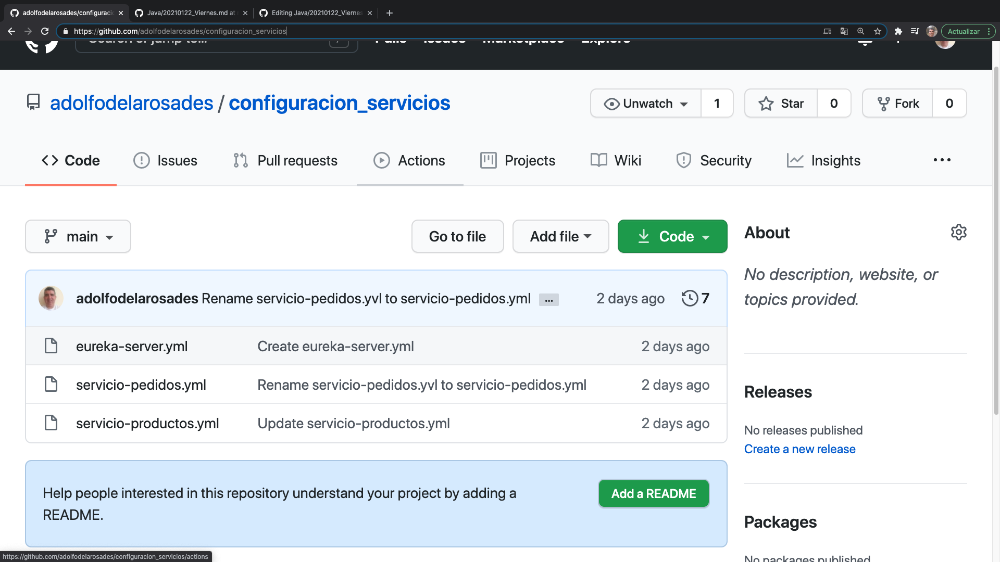
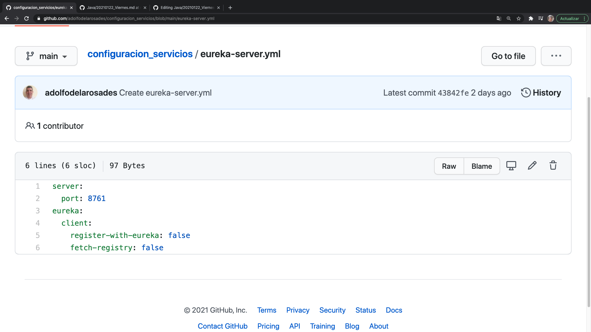
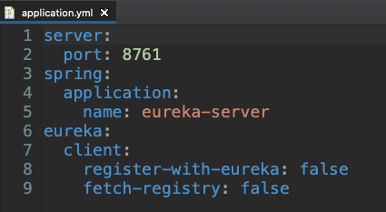
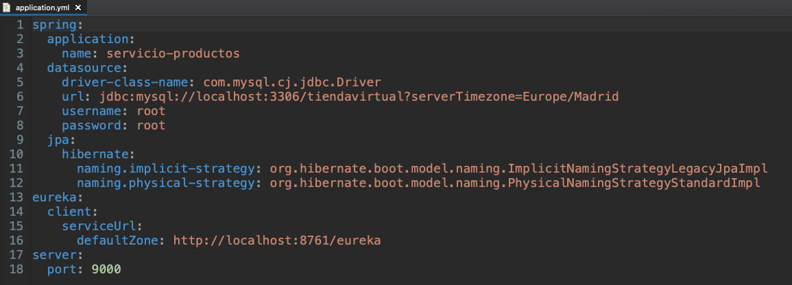
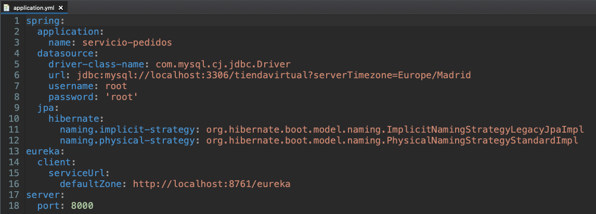

# 20210122 Viernes

## Servidor de Configuración

El Servidor de Configuración tiene como misión centralizar toda la configuración de un conjunto de servicios que estan siendo utilizados por la aplicación. 

La problematica surgue cuando tenemos varios servicios y cada uno de ellos con su configuración propia, para canbiar la configuración hay que buscar servicio por servicio y cambiar lo que se requierá. Si por el contrario tenemos toda la configuración centralizada en un único lugar habitualmente un repositorio GitHub esto nos facilitaría la gestión de las configuraciones. Podríamos centralizar también la configuración de Eureka, Zuul o Gateway.

El papel del Servidor de Configuración va a ser comunicarse con los distintos MicroServicios para proporcionarles su configuración cuando la necesiten.

¿Qué hay que hacer para crear el Servidor de Configuración?

Hay que hacer una serie de pasos.

1. En primer lugar es crear un repositorio GitHub y en ese repositorio debemos subir todos los archivos YAL de los diferentes MicroServicios, los archivos deben mostrarse de una manera especial.

2. Crear el Servidor de Configuración el cual es un MicroServicio más, necesita la dependencia Config Server y a la clase Lanzadora se le añade la anotación `@EnableConfigServer` para habilitar este MicroServicio como Servidor de Configuración.

3. Configuración del Servidor con su archivo `application.yml` con su puerto que por convensión es 8888 y los datos de configuración de GitHub donde encontrará los archivo de configuración de los otros MicroServicios.

## :computer: Servidor de Configuración

### Crear Repositorio Git Hub

Vamos a crear el repositorio `configuracion_servicios` en GitHub https://github.com/adolfodelarosades/configuracion_servicios este repositorio contiene los archivos YAL de nuestros MicroServicios. 

Vamos a incluir las configuraciones de Eureka, 

* Los nombres de los archivos de configuración deben ser el nombre del Servicio con extensión `.yml` es decir:

   * `eureka-server.yml`
   * `servicio-pedidos.yml`
   * `servicio-productos.yml`
   
   Es decir son los nombres que colocamos en la proiedad `spring.application.name`, ya no se pueden llamar `application.yml`
   
   
   
   
   
   
   
Observe como los archivos de configuración que colocamos en GitHub no llevan la proiedad `spring.application.name` por que el Servicio para poder consultar su configuración ya debe saber su nombre previamente.  
   

