# 20210125 Lunes

# Docker

## Contenedores Docker


Pongamonos en situación, si nosotros como desarrolladores desarrollamos una aplicación y la tenemos que distribuir ya sea Servicio, MicroServicio, Aplicación Web, tendríamos que generar el JAR o WAR según corresponda, pero esto no es independiente para ejecutar ese JAR o WAR necesitaremos un Servidor de aplicaciones, BD, etc, el proceso que se tiene desde que se termina un desarrollo hasta que se pone en Producción requiere ua tarea que se llama ***el Despliegue*** que implica tener todas las consideraciones necesarias para que la aplicación pueda ejecutarse, JDK, Maquina Virtual, etc, es un proceso que alguien tiene que hacer, esto implica que debe haber unos requerimientos necesarios en la maquina destino, muchos problemas.  

El objetivo de los Contenedores es facilitar toda la tarea de distribución de una aplicación, es decir tu quieres distribuir una aplicación y esta necesita esto, esto y esto pues en vez de desplegar la aplicación sola es crear un contenedor,  en el contenedor va a estar almacenada la aplicación más todo el software que necesita para que funcione como la versión del JDK, Tomcat, BD, etc. Ya no se distribuye la aplicación, se distribuye el Contenedor, con lo cual cuando quieras instalar la aplicación en algún sitio lo único que hay que hacer es desplegar en ese sitio el contenedor, que es una instrucción de línea de comandos. Ese equipo destino no necesita tener nada, ya que en el contenedor va a estar todo lo necesario para que la aplicación funcione.

Una consideración que debemos tener en cuenta es que ***un contenedor esta pensado para incluir una aplicación solamente, un componente*** Cada conteneror con su aplicación así que si neccesito una BD esta ira en otro contenedor.

Antes esto se hacia con Maquinas Virtuales pero estas son muy pesadas por que llevan su propio S.O, en cambio los contenedores son muy ligeros, portables, sin S.O ya que tiran del S.O de la maquina.


Docker es el más popular en cuanto a contenedores.
Cada contenedor lleva su aplicacion puedo tener varios, hay componente por debajo que permite esta magia quue es **Docker Engine** por lo que en la maquina que quiera desplegar el contenedor necesita tener Docker Engine.


Los contenedores son ideales para desplegar los MicroServicios, pero los MicroServicios para funcionar necesitan JVM, JSE, JDK por lo que yo no puedo distribuir un MicroServicio a cualquier maquina ya que si yo lo desarrolle con una versión 11 y la maquina tiene una versión 7 o simplemente no tiene JDK puede haber conflictos, de lo contrario si meto ese MicroServicio con todo lo que necesita en el destinatario ***solo voy a necesitar tener el Docker Engine*** pero allí nadie tendra que instalar el JDK, ni nada de nada, si hablamos de una BD MySQL la puedo meter en un contenedor y me la puedo llevar a cualquier maquina que no tenga instalado MySQL, es bastante pontente y nos facilita la vida.


Cuando se trabaja con Docker tenemos los conceptos de 

* Imagen: Es como la clase
* Contenedor: Es como el objeto.

Para crear un Contenedor necesito una Imagen. La imagen determina todo lo que se contiene para que la aplicación funcione. Una vez que ya tengo la Imagen puedo crear diferentes contenedores con la misma instancia de un servicio.

Para usar docker puedo usar la Maquina Virtual de Ubunto o en el caso de la Mac me vale usar la consola.

## Instalación de Docker


```sh
mini-de-adolfo:~ adolfodelarosa$ docker -v
Docker version 20.10.0, build 7287ab3
mini-de-adolfo:~ adolfodelarosa$ 
```


Ver Imagenes Docker


Existen muchas imagenes ya existentes listas para usar sus contenedores. 

Si conocemos el nombre de una Imagen nos la podemos descargar con el Comando : `docker pull tomcat`:


Ahora ya tengo la image `tomcat` para crear el contenedor de `tomcat` lo hacemos con el comando `docker run tomcat`:

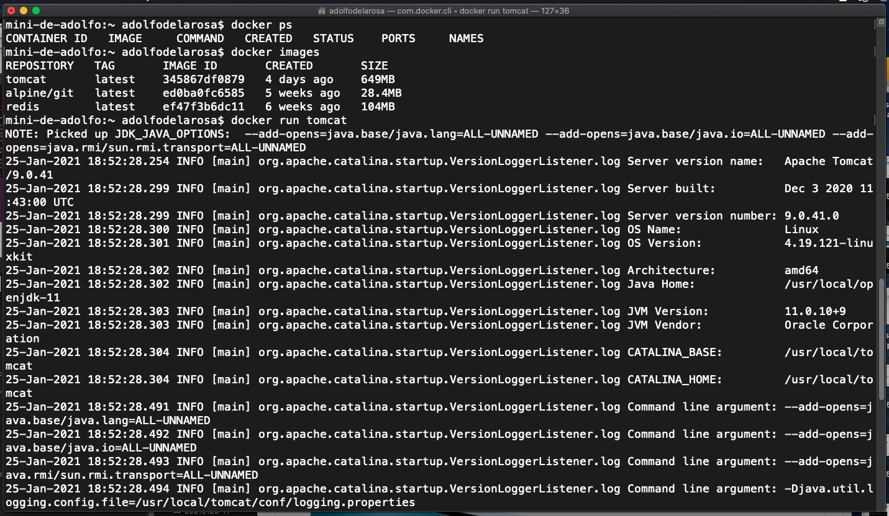

Como el terminal se queda ejecutando Tomcat necesito abrir otra terminal.


Ver Contenedores en Ejecución con  `docker ps -a`


Ver Contenedores en Ejecución con  `docker ps`


Podría pensarse que si cargamos la URL http://localhost:8080 veriamos algo.


Pero no puede acceder a la URL http://localhost:8080 y esto pasa por que Tomcat esta arrancado dentro del Contenedor y yo estoy tratando al contenedor desde fuera y no tenemos acceso, por eso nos marca ese error. Ya veremos como hacerlo.

Para detener un Contenedor necesitamos el Id de Contenedor y usamos el comando `docker stop identificador`


Ver Contenedores en Ejecución

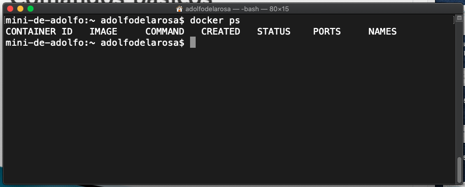

El contenedor existe pero esta Exited.

Eliminar una Imagen `docker rmi imagen`

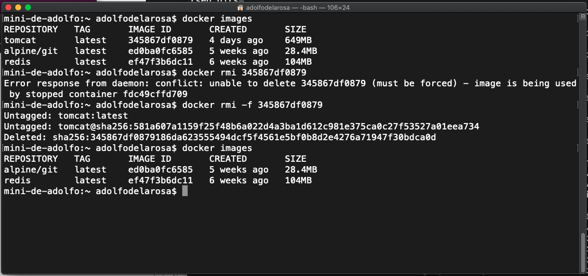

Eliminar un Contenedor `docker rm identificador-contenedor`


OJO Eliminar el Contenedor es como borrarlo de la Memoria, borrar la Imagen es borrar fisicamente toda la Imagen.

### Docker Hub

https://hub.docker.com/


## Gestión de Contenedores


Cuando el Contenedor que se va a iniciar contiene una aplicación Web que se va a comunicar al exterior por un puerto, en el caso de Tomcat que usa el puerto 8080, hay que hacer una cosa importante cuando los contenedores exponen puertos al exterior como es el caso de Tomcat, en este caso hay que hacer un Mapeo de puertos para que desde la maquina física se pueda haceder al Contenedor.

Con el comando `docker run -p 8080:8080 tomcat`

El primer puerto representa a la maquina fisica(HOST) y el segundo al Contenedor para que se pueda ver desde fuera, el puerto del HOST le puedo poner cualquier puerto que yo quiera no tienen por que coincidir podría haber puesto:

`docker run -p 8000:8080 tomcat`

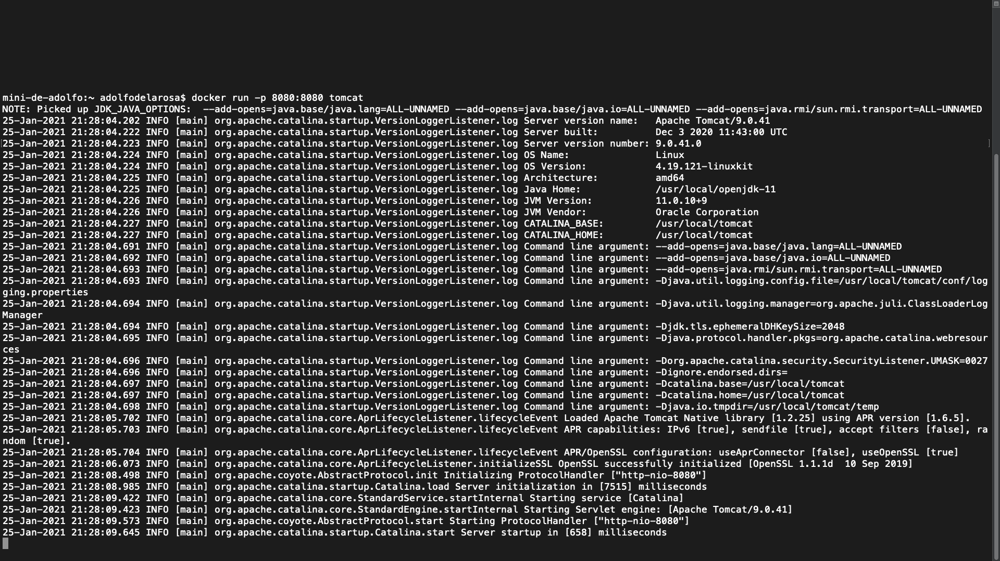

Una vez ya arrancado el Tomcat y mappeado el Puerto podemos cargar la URL http://localhost:8080/ en este caso nos regresa un 404 ya que el Tomcat que tenemos esta pelado, viene sin nada pero ya carga, hemos conectado con el.

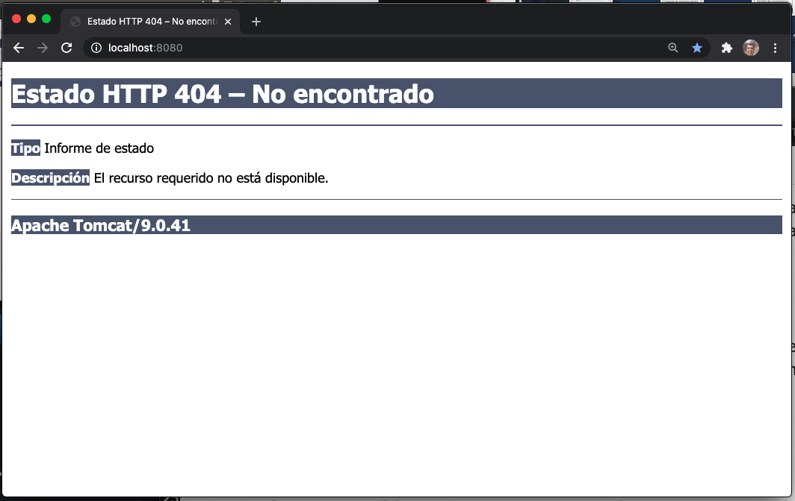


Para entrar al Shell del Contenedor usamos el comando:

`docker exec -it id_contenedor /bin/bash`

Para ver los ficheros que hay, lo que esta instalado, etc.


Podemos ir moviendonos por el contenido del Contenedor. El contenedor solo tiene unos pocos comandos no una versión completa de Linux.

Para salir uso el comando `exit`


Puedo copiar un WAR dentro del contenedor y así desplegar una aplicación, para lo cual usamos el comando `cp`.

`docker cp ruta_archivo_maquina contenedor:ruta_contenedora`

`docker cp Downloads/buscador.war a36f16bec094:/usr/local/tomcat/webapps`


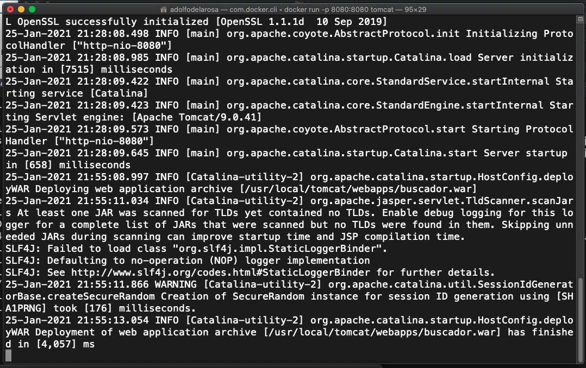

La aplicación se ha desplegado en Tomcat, así que puedo cargar la aplicación en el Navegador con la URL.

Puedo pulsar el comando para ver el contenido del Contenedor.

`docker exec -it a36f16bec094 /bin/bash`

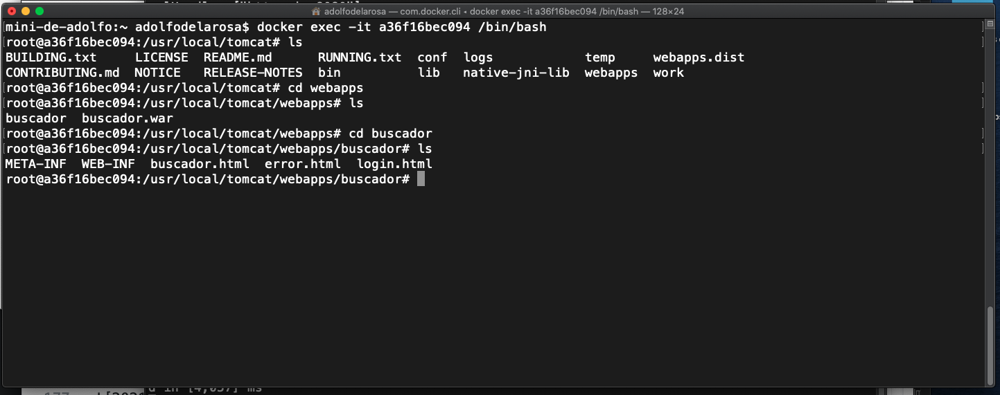

Vemos que ya se ha publicado la aplicación dentro de un Contenedor, vamos acargar la página.


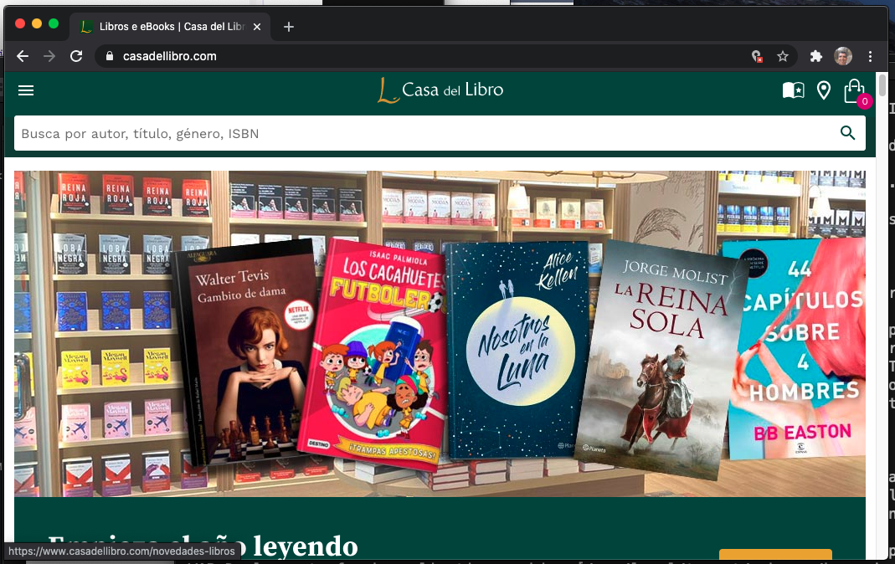

### :computer: `104_gestion_candidatos_spring-jdbc-docker`
#### Ejercicio Publicar APP con BD.

Vamos a tomar la aplicación `04_gestion_candidatos_spring-jdbc` del Segundo Workspace donde tenemos aplicaciones Web y hacemos la copia `104_gestion_candidatos_spring-jdbc-docker`. Como esta es una aplicación Web vamos a generar un WAR. Pero antes de generarlo debemos realizar una tarea previa que consiste en modificar el código para que en el acceso al DataSource lo haga desde la aplicación y en las propiedades de la conexión a la BD debemos cambiar el `localhost` por la IP de nuestra maquina `192.168.1.133`. Con esto va a apuntar a la BD de mi equipo fisico, si le dejo `localhost` en el contenedor representará al propio contenedor el cual no tiene la BD, por eso debemos hacer este cambio.

Esto se debe hacer por que el acceso a la BD ya no lo voy a hacer desde dentro de la aplicación, ya no puede seguir usando `localhost` que es el acceso en desarrollo, pero cuando ya no estamos en desarrollo debemos indicar la dirección real de la BD, es decir la dirección IP de donde se encuentre esa BD, en este caso va a ser la IP de nuestro equipo fisico. Podemos verla con el comando `ifconfig` o `ipconfig` según el SO.


Una vez hecho esto hay que generar el WAR de candidatos.

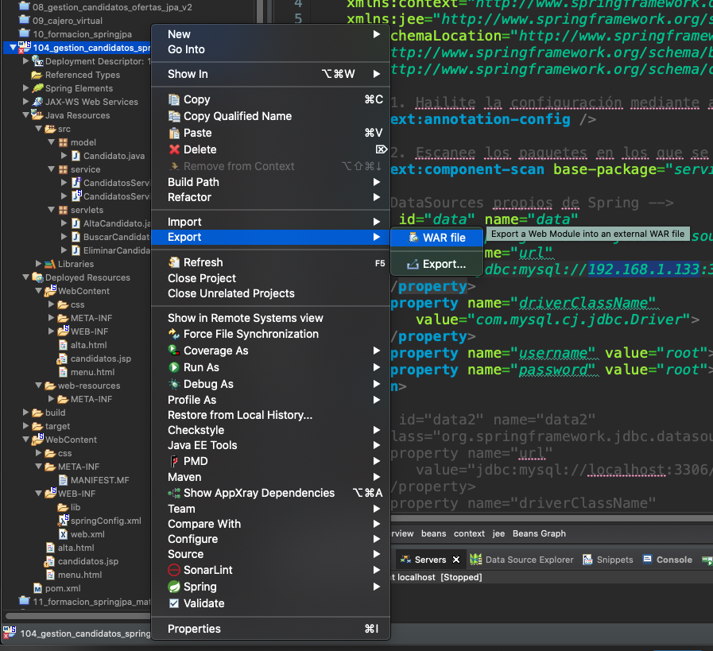
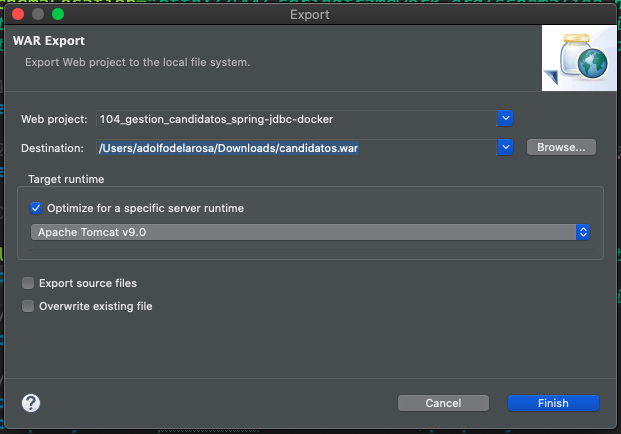

Una vez que ya tenemos el WAR vamos a crear el Repositorio de Tomcat y deplegar allí esta aplicación.

He borrado todos los contenedores existentes y solo me he quedado con las Imagenes.

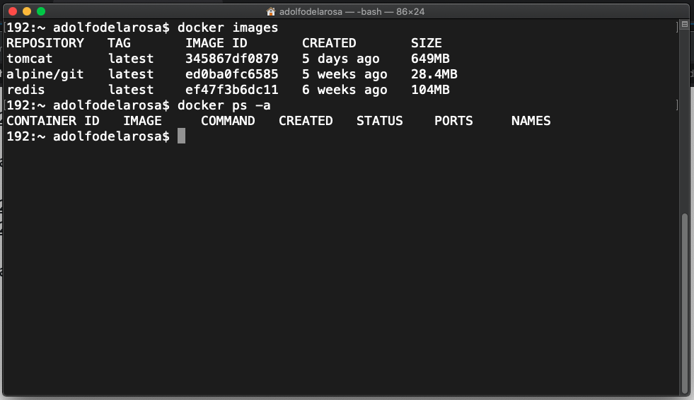

`docker images`

`docker ps -a`

Vamos a crear el Contenedor Tomcat con `docker run tomcat` se arranca tomcat.

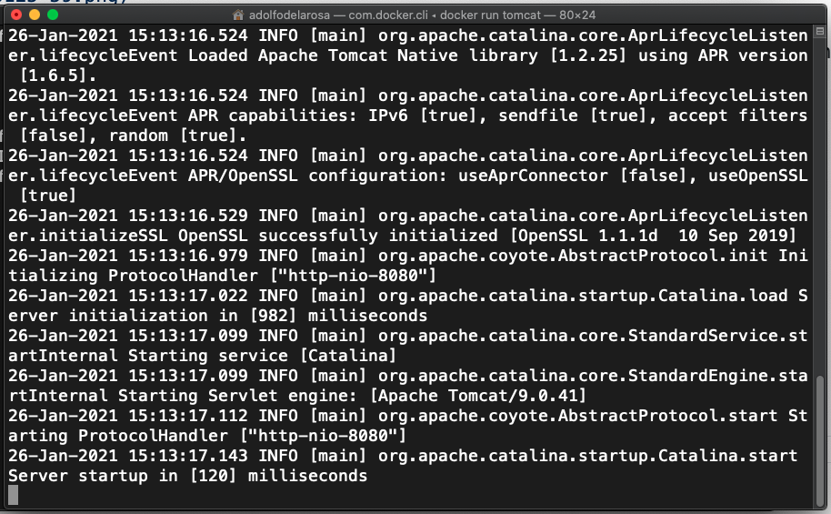

Podemos ver que ya esta arrancado Tomcat `docker ps -a`

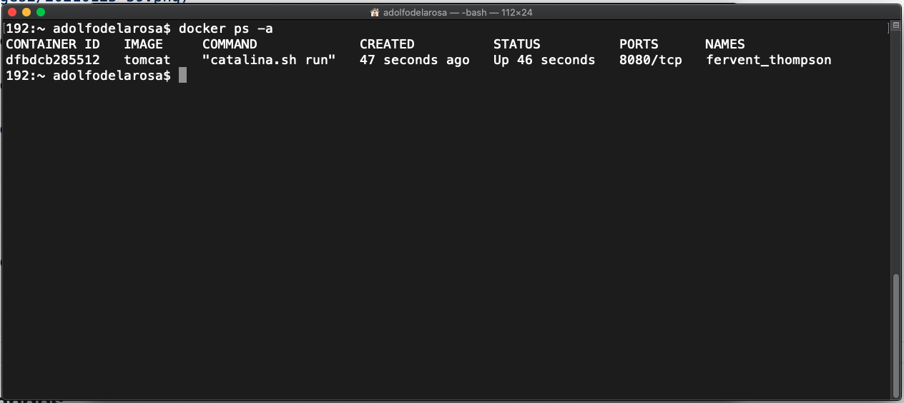

Una vez que ya esta arrancado Tomcat vamos a entrar al Shell de Tomcat `docker exec -it dfbdcb285512 /bin/bash` y dentro vamos a navegar dentro de `webapps`.


Como vemos no tenemos nada, vamos a a salir con `exit` para poder copiar el WAR con:

```sh
docker cp Downloads/candidatos.war dfbdcb285512:/usr/local/tomcat/webapps
```

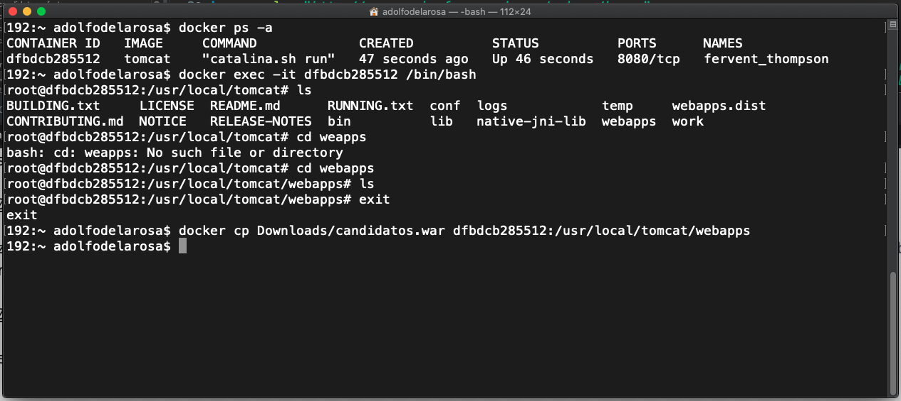

Como vemos en el Servidor se despliega la aplicación.

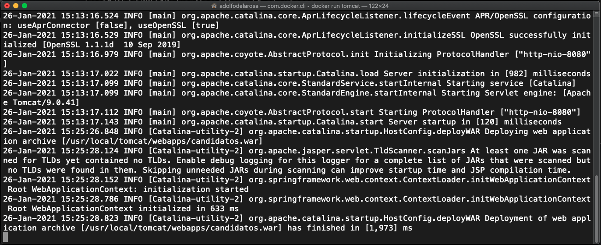

Con esto en teoría ya podemos cargar nuestra aplicación en la URL `http://localhost:8080/candidatos/` si probamos vemos:


Esto se debe a que no estamos mapeando bien el puerto de la aplicación con el puerto externo, vamos a parar Tomcat y volverlo a levantar con la URL `docker run -p 8000:8080 tomcat`.

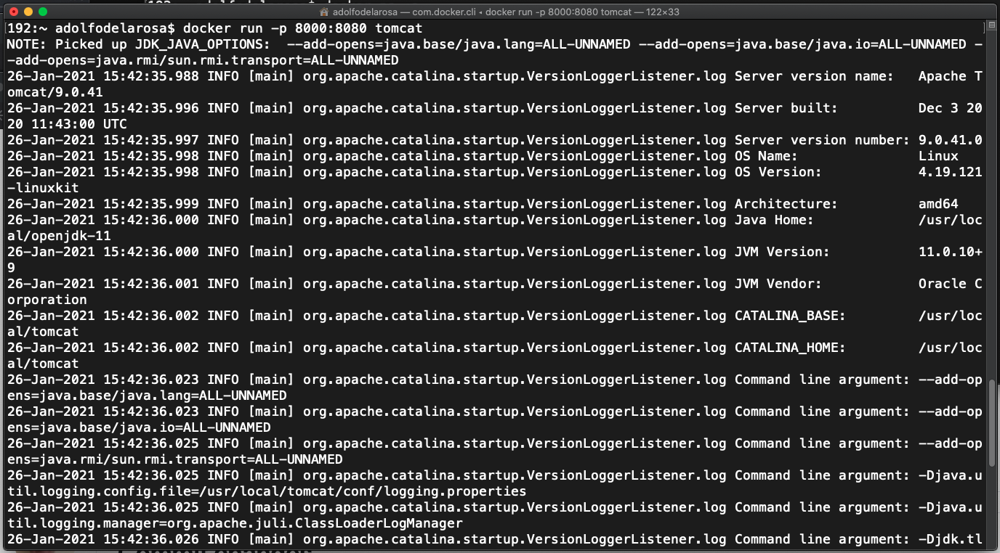

Observese que si vemos que Contenedores existen vemos dos diferentes Contenedores Tomcat uno apagado y otro activo, en el que esta apagado es donde desplegamos nuestra aplicación vamos a tener que copiarla nuevamente para que se despliegue en este nuevo Contenedor, el otro lo vamos a borrar por que no hicimos bien el mapeo.


Si cargamos el URL `http://localhost:8000/candidatos/` ya vemos el menú de la aplicación.

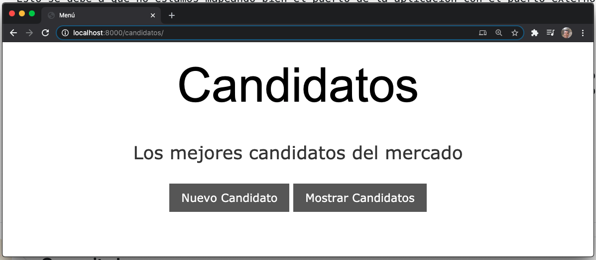

Si seleccionamos la opción de ver Candidatos vemos que nos da un Error 500 con el mensaje `Failed to obtain JDBC Connection; nested exception is java.sql.SQLException: null, message from server: "Host 'mini-de-adolfo.home' is not allowed to connect to this MySQL server"`

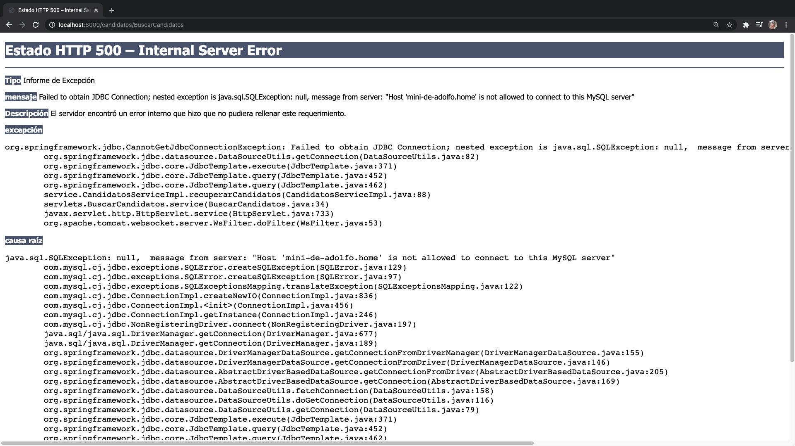

Este es un problema de MySQL que no permite conexiones desde el esterior solo permite conexiones del localhost.

Si vamos a Workbeanch a la opción de *Server > User and Privileges* vemos lo siguiente:


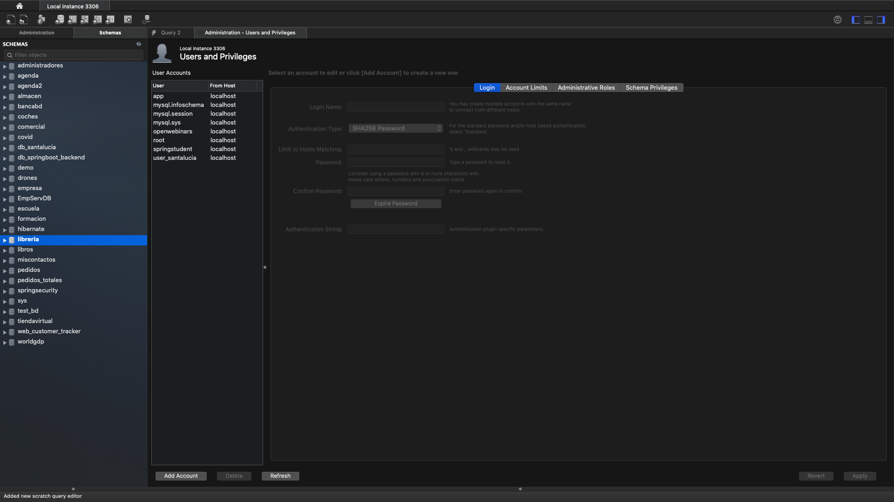

Debemos cambiar para root el `localhost` por `%` para que pueda dar acceso al exterior.

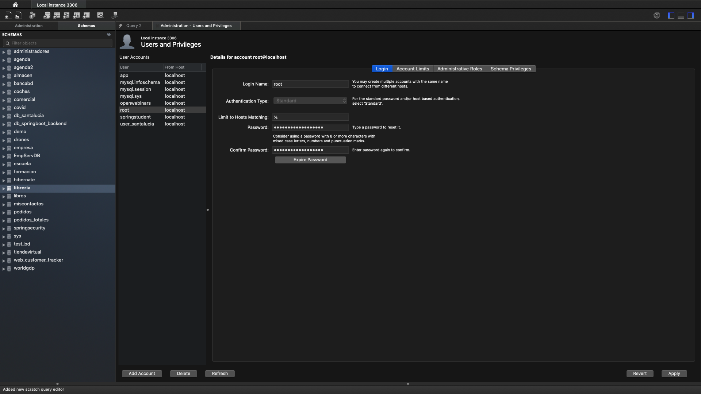


Una vez hecho este cambio regresamos a nuestra aplicación y esta ya funciona.


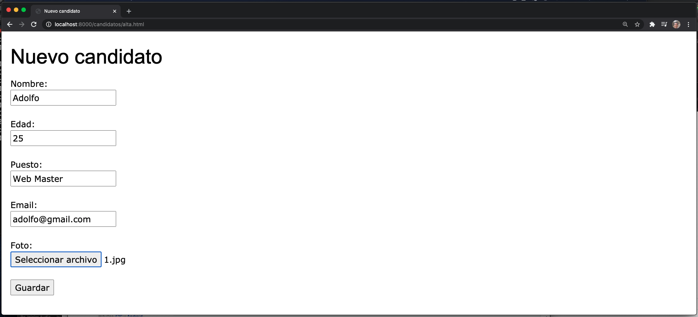
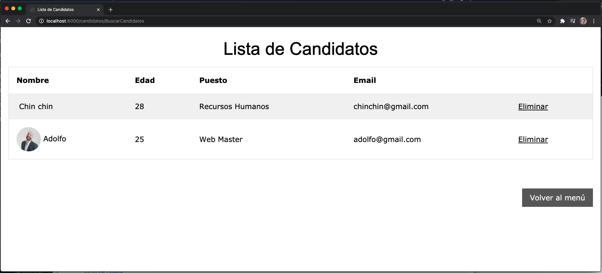


