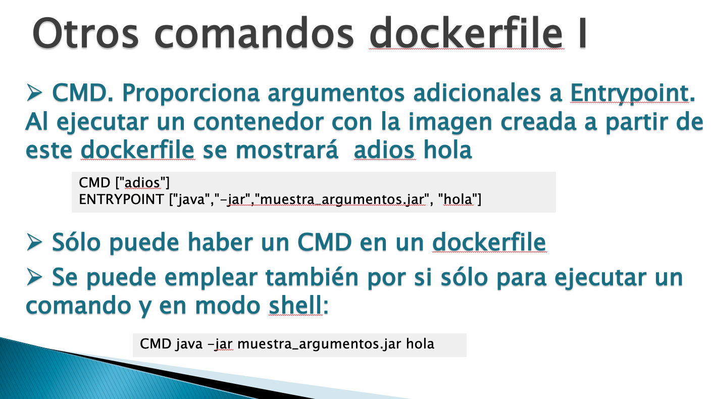
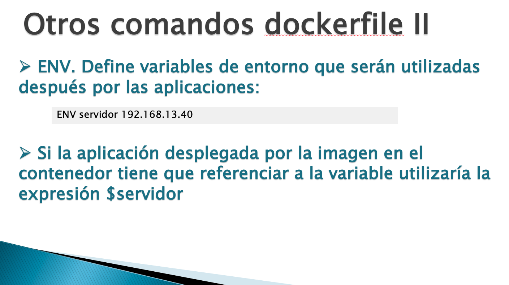
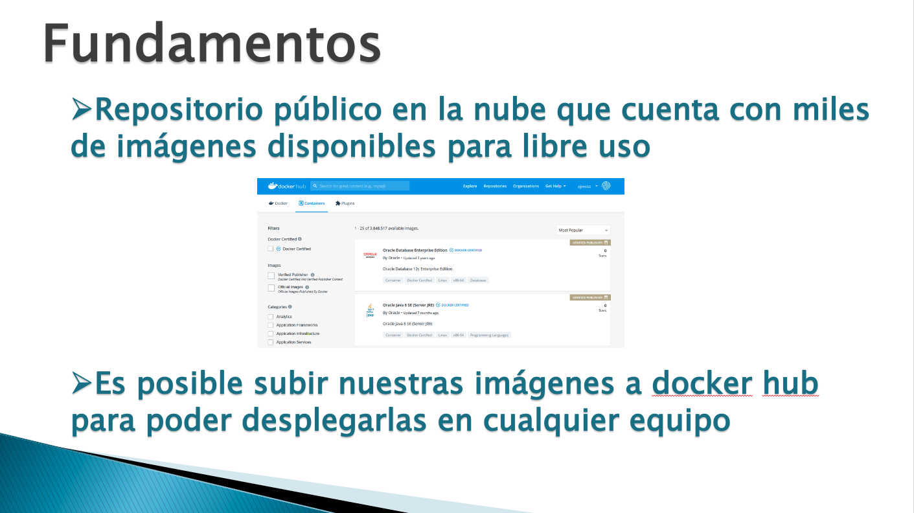

# 20210126 Martes

## Desplegar un MicroServicio en un Contenedor.

¿Qué se necesita para Desplegar un MicroServicio en un Contenedor?

Que el Contenedor solo contenga la JVM Java, es decir el Runtime, por que ya sabemos que el MicroServicio lleva embebido todo.

Vamos a generar el JAR del proyecto `12_microservicio_calculadora` de nuestro Workspace de MicroServicios. Pero antes de hacerlo vamos a asignarle un puerto diferente del 8080 por que este puerto ya es el usado por el Tomcat que se encuentra en el contenedor y si no ponemos un puerto diferente puede haber problemas, vamos a asignarle el 9000 `server.port=9000` en el `application.properties`

Una vez hecho esto vamos a generar el JAR con los siguientes pasos:


**NOTA:** MIS PROYECTOS ESTAN HECHOS CON JAVA 14 Y HAY CONFLICTOS POR QUE EL CONTENEDOR USA JAVA 11, COMO SE HIZO CON EL PROYECTO DE CANDIDATOS. ASI QUE TENGO QUE BAJAR LA VERSIÓN EN MIS PROYECTOS. EN ESTE CASO HE TOMANDO EL JAR DE ANTONIO LLAMADO `candidatos.jar`.

Vamos a regresar a la Terminal y vamos a ver la actividad de nuestros contenedores con `docker ps -a`:


Vemos que tenemos un Contenedor detenido, para volverlo a arrancar usamos `docker start 04461729dfd6`, el mapeo de puertos ya se hizo cuando se creo el contenedor con `run`, aquí solo lo queremos arrancar.


¿Cómo veo la consola de Tomcat? 

Vamos a copiar el JAR de Calculadora dentro de nuestro Contenedor Tomcat con el comando: 

```sh
docker cp Downloads/calculadora.jar 04461729dfd6:/usr/local/calculadora.jar
```

En teoría el MicroServicio ya esta subido al contenedor y ya se podría lanzar y probar, el contenedor tiene su propio Tomcat que no vamos a ocupar, pero también tiene Java que si lo necesitamos para ejecutar nuestro MicroServicio. 

Ahora vamos a entrar en el Contenedor para poder lanzar el MicroServicio. 

```sh
docker exec -it 04461729dfd6 /bin/bash
```

Nos movemos a la ubicación donde copiamos el JAR y allí vemos `calculadora.jar`.


Lo vamos a ejecutar con el comando 

```sh
java -jar calculadora.jar
```


Ahora ya tenemos el MicroServicio arrancando en nuestro Contenedor, la cuestión es que no lo vamos a poder probar por que el puerto 9000 del MicroServicio no esta mapeado hacia el exterior. Si llamamos a la URL http://localhost:9000/sumar/3/4 tenemos:


El 9000 no se refiere al del MicroServicio que esta dentro del Contenedor, pero el contenedor esta mapeado del 8080 al puerto 8000, pero no al 9000, no hay forma de probar. Tendríamos que crear otro contenedor al puerto 9000 y volver a meter el MicroServicio y todo el proceso. Pero no lo vamos a hacer en este caso aun que perfectamente lo podemos hacer. 

Lo he hecho pero tampoco funciona:


```sh

```


```sh

```

```sh

```


## Creación de Imágenes Docker






## Docker Hub





