# 1. Comienza con Java 59m 

   * 00 Presentación del profesor y curso 5:12 
   * 01 Instalación de Java 16:13 
   * 02 Posibles entornos de desarrollo 13:46 
   * 03 Hola Mundo 10:49 
   * 04 Algunos elementos de sintaxis 13:01 
   * Contenido adicional 4

# 00 Presentación del profesor y curso 5:12 

[Presentación](pdfs/00_Presentación.pdf)

## Transcripción


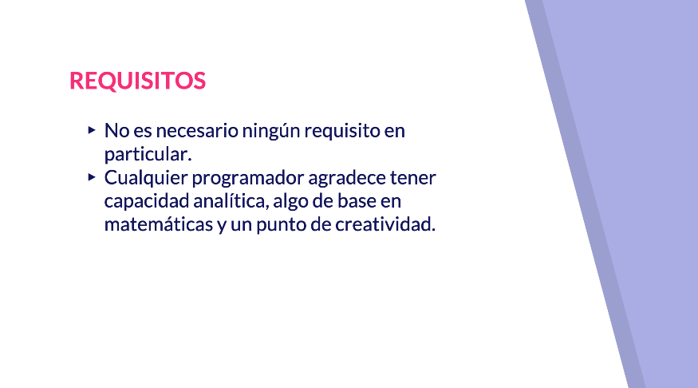

Para realizar el curso de Java desde cero no es necesario ningún requisito en particular, si bien es cierto que cualquier persona que quiera ser programador o quiera aprender programación, se agradece siempre el tener algo de capacidad analítica, algo de base matemáticas y siempre un puntito de creatividad.


Porque es bueno que aprendáis Java 8, según Oracle la empresa propietaria de la tecnología Java existen a día de hoy cerca de tres mil millones de dispositivos en el mundo que utilizan Java dispositivo de diferentes tipos.


Y además Java en particular ahora con la versión 8 es la mitad del camino que tenemos que recorrer si queremos aprender a programar aplicaciones nativas para dispositivos móviles que corran Android.


Como otro argumento también para tratar de convencerlos es que Java sigue siendo desde hace bastante tiempo el lenguaje de programación más utilizados según uno de los [rankings](https://tiobe.com/tiobe-index/) que existen que lo mide en todo el mundo, además os recomiendo que podáis leer el artículo que tenemos en nuestro blog sobre [cuánto gana un programador Java en España](https://openwebinars.net/blog/cuanto-gana-un-programador-java-en-espana/) para qué pueda servir también de acicate o podéis comparar con respecto a otra tecnología si es que el salario que quieren obtener también es una opción para aprender o no un lenguaje de programación.


Vamos a estructurar el curso de Java en varios bloques que los vamos a ver a continuación, primero vamos a comenzar con Java instalándolo, instalando un entorno de desarrollo y comenzando con su sintaxis inicial, posteriormente vamos a trabajar con variables, tipos de datos, operadores y con las sentencias de estructura de control, después pasaremos a trabajar con clases y objetos una primera introducción, posteriormente en manipularemos y trataremos datos con Arrays y Strings.

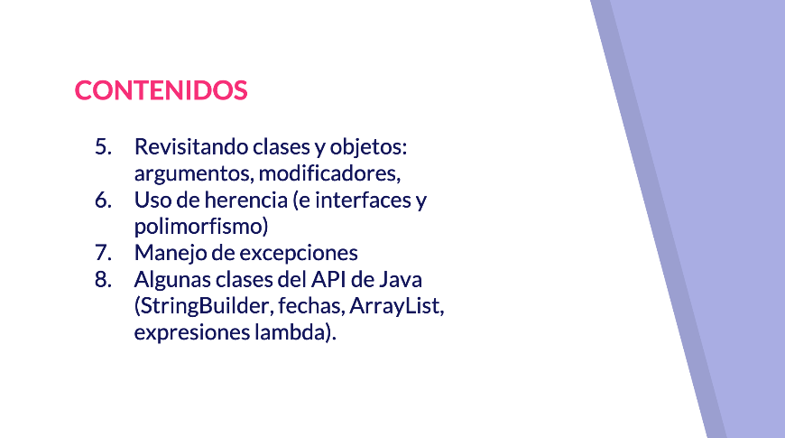

Pasaremos después a revisitar otra vez clase y objetos trabajando con sus argumento y modificadores, usaremos herencia de clase y aprenderemos también a trabajar con interfaces, clases abstracta y polimorfismo, manejaremos excepciones y también conoceremos alguna de las clases más utilizadas del API de Java cómo son StringBuilder, el nuevo API de fecha, ArrayList y las expresiones lambda y el nuevo API Stream que podremos introducir.

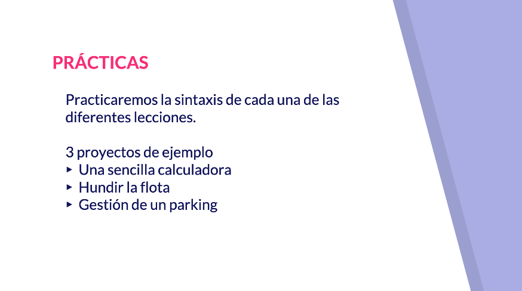

Como prácticas haremos tres proyectos, que lo haremos en momento intermedio y al final del curso en el que haremos una sencilla calculadora aritmética, un juego de hundir la flota y la gestión de de un parking.

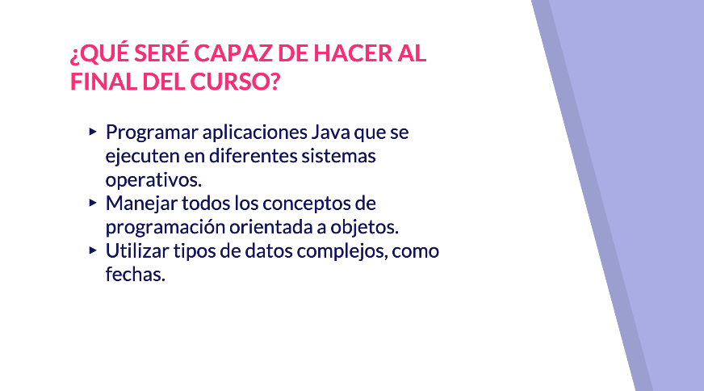

Y si te planteas cual va a ser el resultado cuando yo termine este curso, es decir que sere capaz de hacer cuando finalice el curso, lo primero es que seras capaz de programar aplicaciones en Java, lo cual será programar aplicaciones que se puedan ejecutar en distintos sistemas operativos Windows, Linux, Mac son los más utilizados. También vas a poder manejar todos los conceptos de programación orientada a objetos, sabras utilizar tipos de datos complejos como son las fechas.  


Podrás utilizar el nuevo estilo de programación funcional incorporado en Java SE 8, manejar situaciones de error y darle tratamiento a esos errores, tratarlos de forma adecuada.


También podrás utilizar los conocimientos de este curso como base para hacer otros de los cursos como son Java 8 para programadores Java, Java EE, JSF, los cursos de Spring e Hibernate y el curso de Android entre otro.

Así que os ánimo a que podáis hacer este curso de Java 8 desde cero, si no sabéis nada de programación es el curso, incluso también os puede servir como reciclaje si sabes programar en Java, pero queréis conocer los nuevos elementos que incorpora Java 8, ánimo y que disfrutéis del curso 

# 01 Instalación de Java 16:13 

[Instalación de Java](pdfs/01_Instalación_de_Java.pdf)

## Resumen Profesor

### 1.1 ¿Qué es Java?

Java no es más que una plataforma sobre la cual ejecutar aplicaciones que están desarrolladas en ese mismo lenguaje de programación, es decir, Java. Además, esta plataforma pone a nuestra disposición cantidades ingenentes de código que podemos utilizar.

### 1.2 Java Virtual Machine

Una de las principales características de Java con respecto a otros lenguajes, como C, C++ o Python es que los programas producidos en este lenguaje no se ejecutan directamente por el sistema operativo; sobre este, existe un entorno, llamado *Java Virtual Machine*. Podríamos asemejarlo a un ordenador virtual que está capacitado para ejectuar aplicaciones Java. De esta manera, como programadores nos desprendemos de la mayoría de los detalles asociados a la plataforma concreta sobre la cual estamos programando.

La JVM está disponible para la casi totalidad de arquitecturas y sistemas operativos existentes en el mercado. Desde Oracle, la propietaria de Java, se jactan de que se pueden ejecutar aplicaciones java en 3.000 millones de dispositivos, desde sistemas de vuelo, cajeros automáticos a robots o routers.

### 1.3 Java Bytecode

Como consecuencia de tener un entorno especial de ejecución, la JVM, tenemos que al compilar y enlazar (link) nuestro código Java, no vamos a obtener el clásico *código objeto* producido, por ejemplo, al trabajar con C o C++. En este caso, tenemos un código objeto especial, llamado **java bytecode**, y que solo es capaz de ser ejecutado por la Java Virtual Machine.

### 1.4 JRE vs JDK

Al empezar a trabajar con Java, nos encontramos con dos conceptos que es necesario diferenciar, y que son JRE (*Java Runtinme Environment*) y JDK (*Java Development Kit*)

 * **JRE**: Se trata de un conjunto de ficheros y programas que nos permiten ejecutar aplicaciones Java. Es necesario tenerlo instalado si solamente vamos a ejecutar aplicaciones Java.
 
* **JDK**: Se trata de un conjunto de ficheros y programas que nos permiten crear, compilar y ejecutar aplicaciones Java. Es necesario si además de ejecutar aplicaciones Java, queremos desarrolarlas.

Es interesante apreciar que al instalar en nuestro PC el kit de desarrollo (JDK), también estamos instalando en entorno de ejecución (JRE.)

### 1.5 Instalación de JDK 8

Si queremos comprobar si tenemos java disponible (al menos JRE), basta con que abramos un terminal (`cmd` en Windows) y escribamos `java --version`. Si todo es correcto, nos dará un mensaje con la versión. Si además, queremos comprobar si tenemos una versión de JDK instalada, podemos escribir en el terminal `javac --version`. La herramienta `javac` es la de compilación, solo disponible en JDK.

Para instalar la última versión de JDK, tan solo tenemos que escribir en google `get jdk` y nos enlazará directamente a la página de descargas de Oracle (en el momento de escribir estas líneas la página era http://www.oracle.com/technetwork/java/javase/downloads/jdk8-downloads-2133151.html).

* En el caso de Windows, debemos escoger entre 32 o 64 bits (dependiendo de nuestra arquitectura y versión de sistema operativo)

* En el caso de Linux, en muchas distribuciones de linux ya lo encontraremos instalado. Si utilizamos una distribución de tipo Ubuntu, lo podemos instalar con el comando `$ sudo apt-get install openjdk-8-jdk`. Si utilizamos una distribución de tipo Fedora-Red Hat, podríamos usar el comando `$ su -c "yum install java-1.8.0-openjdk-devel"`

* En el caso de Mac, …

### 1.6 Java 9

En el momento de comenzar a escribir estas líneas, la primera versión de Java 9 ha sido liberada, si bien muchos programas (como por ejemplo, el propio entorno de desarrollo Eclipse) aun no soportan dicha versión.

## Transcripción


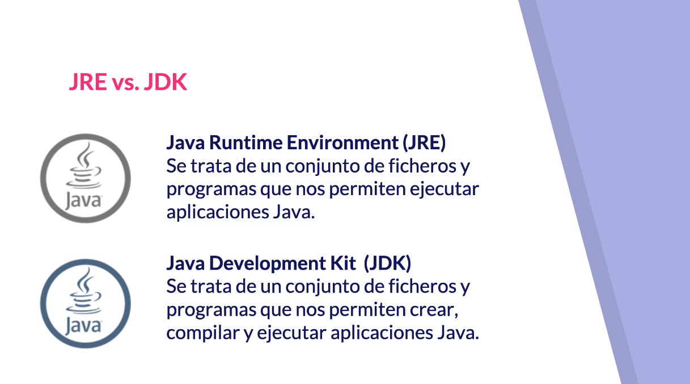


Hola todo y bienvenido a esta primera lección sobre Java 8 en el nos vamos a introducir un poco en esta tecnología tan apasionante que es Java y acabaremos haciendo la instalación de la primera parte del software que vamos a necesitar para desarrollar aplicaciones con el.


Si alguien no hiciera la pregunta de que es Java le podríamos responder que Java son varias cosas, primero Java es un lenguaje de programación que nos va a servir para desarrollar aplicaciones de muchos tipos distintos, lo iremos aprendiendo a lo largo de este curso, además Java no es solamente una sintaxis, no es solamente unas reglas, sino que también es un conjunto, además muy grande de código que ya está puesto a nuestra disposición para hacer diversas tareas y también y eso lo vamos a aprender en este capítulo Java es una plataforma, un software de base, dónde poder ejecutar las aplicaciones que vamos a desarrollar.

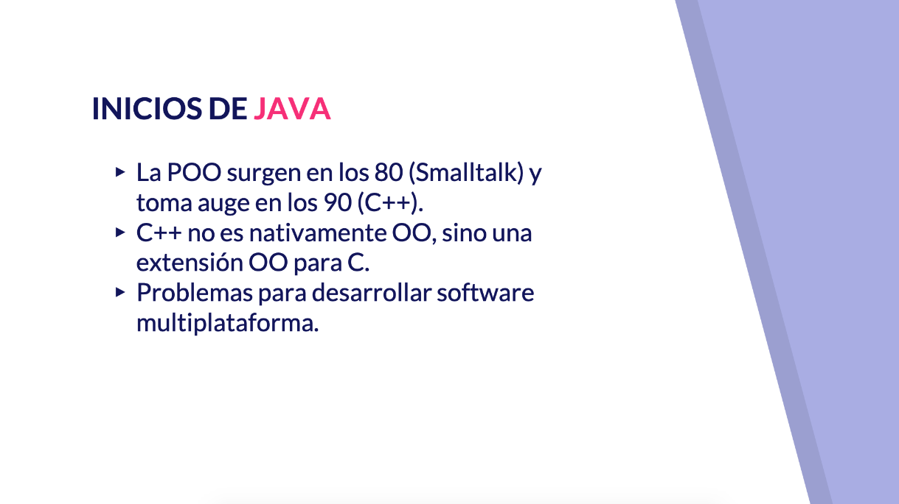

Como cualquier otra rama de conocimiento merece la pena conocer algo sus inicios. Java qué es un lenguaje orientado a objetos digamos que está asociado al paradigma orientado a objetos el cual también aprenderemos dentro de este curso, surge a principios de los años 80, en torno al año 80 con un lenguaje de programación llamado Smalltalk y paulatinamente va ganándole terreno a otros lenguajes de programación que utilizaba otras maneras de organizarse, otros paradigmas, poco a poco va cogiendo auge en los años 90 a raíz de una extensión del lenguaje C, llamada C++,  si alguno conoce C+++ sabrá que es un lenguaje de programación muy potente a día de hoy se sigue utilizando, pero que no es nativamente orientado a objetos, sino que es como una extensión orientado a objetos para C y que además pues tenía algunos o daba algunos problemas a la hora de desarrollar software que pudiéramos, aplicaciones que pudiéramos ejecutar con garantía en diferentes plataformas, en diferentes sistemas operativos.


En torno a los años 90 Sun Microsystems una empresa que en su día que fue adquirida por Oracle, necesita una plataforma para poder ejecutarse en distintos tipos de dispositivos, no solamente en PCs o estaciones de trabajo sino en otro dispositivo como pueden ser coches o incluso electrodomésticos, paralelamente a mitad de los noventa, desde el principio y mitad de los noventa surge la World Wide Web WWW, la web empieza a tomar forma hasta que es lo que conocemos hoy y es otro elemento, digamos que dados de la mano son los que producen la génesis de Java como lenguaje, como plataforma y los que hacen que vaya cogiendo un gran auge.


Pasemos a ver ahora otro concepto y es el de la Java Virtual Machine decíamos antes que con C++ al igual que con C++ al igual que con otros lenguajes de programación teníamos diferencias o problema, teniamos que plantearnos la dificultad de desarrollar una aplicación escrita con un código y qué está se ejecutará en distintos sistemas operativos, tanto es así que por ejemplo si dijéramos de hacer una aplicación en C o en C++ otros lenguajes de programación y la quisiéramos ejecutar en Windows, los conceptos ya los aprenderemos, la compilaramos y la preparamos la linkaramos para ejecutar en Windows esa misma aplicación, ese mismo ejecutable no se podría ejecutar en Linux y viceversa también nos pasaría, un ejecutable pensado para Linux no sería capaz de ejecutarse en Windows o en otro tipo de sistemas operativos.


Java lo que hace es aportarnos la máquina virtual de Java y eso qué es, pues se trata de un entorno virtual de ejecución, podríamos llamarlo una capa de abstracción que se sitúa entre el sistema operativo y nuestro programa, nuestro programa ya por supuesto hecho en Java, de esa forma cualquier programa que nosotros desarrollamos en Java se ejecutará siempre en una Java Virtual Machine en una máquina virtual de Java y es Java o mejor dicho en este caso Oracle o Sun Microsystems en su día, quién se encargó de desarrollar que hubiera de garantizar que hubiera una Java Virtual Machine para cada sistema operativo de los conocidos, incluso para para algunos dispositivos de lo más variopintos. 

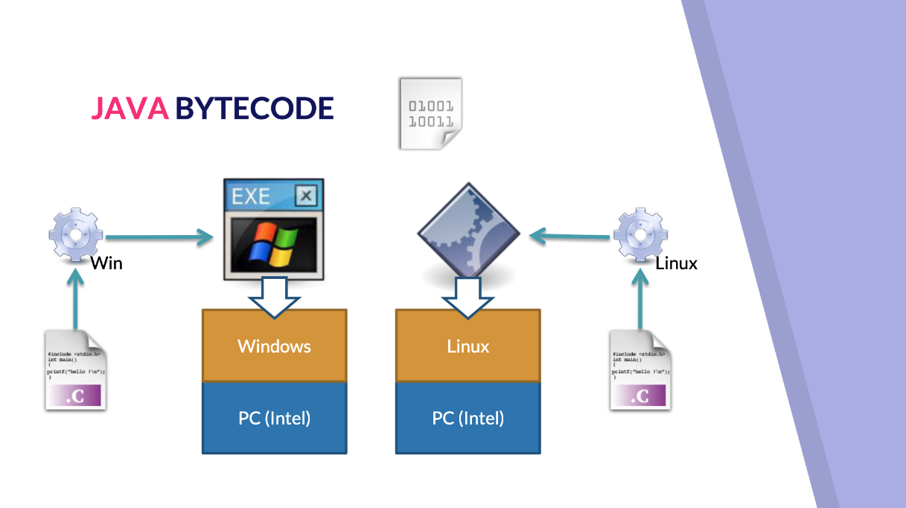

AAAQUIIIIII
Está portabilidad, este carácter multiplataforma se consigue cambiando el planteamiento a la hora de producir el programa, por ejemplo cuando nosotros trabajamos en un lenguaje como C nosotros debíamos compilar nuestro programa y compilarlo significa traducirlo de lenguaje de programación que conoce el programador a un lenguaje que pudiera entender la máquina llamado lenguaje objeto ese lenguaje objeto no es el mismo para Windows que para niños no no sé debíamos hacer una compilación expresa de nuestro programa para Windows o de nuestro programa para abrir con Java sucede algo diferente y es que Java a la hora de ser compilado produce un código que se suele llamar intermedio Java bytecode qué es el código objeto que podríamos decir que habla la Java Virtual Machine con lo cual una sola compilación de nuestra de nuestra aplicación Java va a ser que funcione en una Java Virtual Machine instalada pues tanto en Windows como en Linux que el ejemplo del cual venimos hablando en este capítulo como incluso en otra arquitectura diferentes y que a lo mejor para para el usuario de a pie son menos conocidas como utilizando el sistema operativo Solaris con una arquitectura por debajo que no fuera de PC y eso que no fuera una arquitectura sino una risco con la espalda aunque se haya alguna antigua pero pero si nos podríamos plantear que pudiera funcionar incluso ya no solo en arquitectura te diferente arquitectura de computadores que Oracle se capta de alguna manera que más de tres mil millones de dispositivos en todo el mundo son capaces de ejecutar Java y podemos encontrarlo de de la manera más variopinta no desde sistemas de vuelo el sistema operativo de alguno cajero automático el sistema embebido de algunos reproductores de Blu-ray o antiguamente de DVD en libro electrónico Kindle el sistema operativo de muchos routers en robótica el todo ello ejecuta por debajo de una u otra manera una máquina virtual de Java sobre la cual nosotros podemos desarrollar aplicaciones Java Windows cualquier tipo de aplicación Java si por el contrario nos queremos dedicar a al desarrollo de aplicaciones Java necesitamos el kit de desarrollo que lo que hace es incluir además de todo lo que ya trae el J&R una serie de herramientas necesarias entre ellos por ejemplo el compilador para que podamos compilar fabricar y ejecutar cualquier tipo de aplicación Java ahora después haremos la descarga del JDK que lo haremos desde la página de vaca y bueno Java es mucho Java lo que hemos presentado es solamente una gota en el océano Java como decíamos antes muy extenso y bueno nosotros nos centraremos en conocer la versión conocida como estándar la javaexe en particular bueno pues la versión más madura que existe a día de hoy qué es la versión 8 vale y qué bueno la vamos a ejecutar sobre todo en aplicaciones de escritorio si bien bueno pues todo lo que aprendamos dejaba no servirá para desarrollar aplicaciones que podrán ejecutarse como decíamos en muchas otras plataformas por ejemplo con las gavatv en televisores y reproductores de DVD en móviles que utilicen Java en tarjeta inteligente servidores robótica otro tipo de dispositivo bueno pues vamos a pasar ahora a ejecutar a descargar nuestra versión de JDK tengo aquí preparado para vosotros nada una máquina virtual dónde lo vamos a poder hacer para poder descargar java lo que necesitamos solamente un navegador y en el podemos buscar en Google simplemente la cadena get vale normalmente el primer resultado se utiliza most Google cómo buscador no le dirigirá directamente a hacia la página de Oracle no recomiendo que descarguéis JDK desde cualquier otra página vale sino que nos vamos directamente a la fuente de aquí como siempre el aceptar el uso de cookies y sobre las persianas dejaba hace unas pocas semanas se publicaba la versión 9 de Java sí bien nosotros vamos a desarrollar el curso sobre la versión 8 de hecho la versión 9 todavía no es que no esté madura antes de ayer de haber sido liberada pero si es verdad que algunos programas todavía no la soporta así que nosotros pasaremos descargarnos la última actualización de la versión 8 de Java que la tenemos aquí escogemos la instalación del JDK la descarga del JDK


# 02 Posibles entornos de desarrollo 13:46 

[Posibles entornos de desarrollo](pdfs/02_Posibles_entornos_de_desarrollo.pdf)


### 2.1 Tareas a la hora de desarrollar software

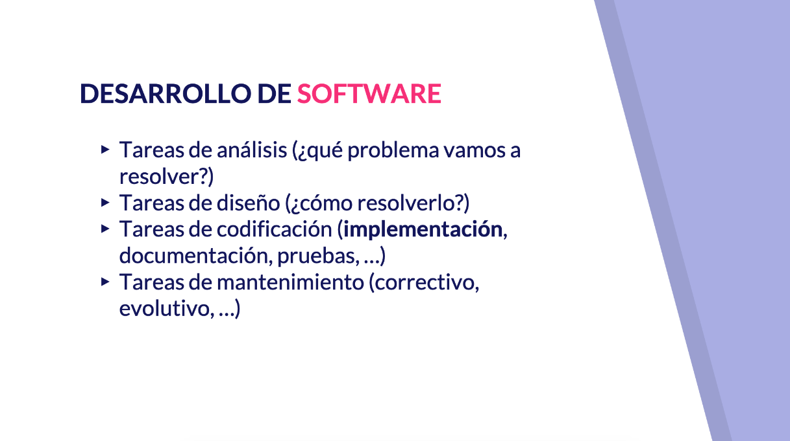

Desarrollar software puede llegar a ser, para aplicaciones no excesivamente *grandes*, una empresa titánica, ya que conlleva múltiples tareas. 

De forma clásica, el desarrollo de software se ha dividido en 4 grandes fases:

* **Análisis**: ¿qué problema vamos a resolver?
* **Diseño**: ¿cómo resolvemos el problema?
* **Codificación**: *construcción* de la solución
* **Mantenimiento**: correcciones y actualizaciones.

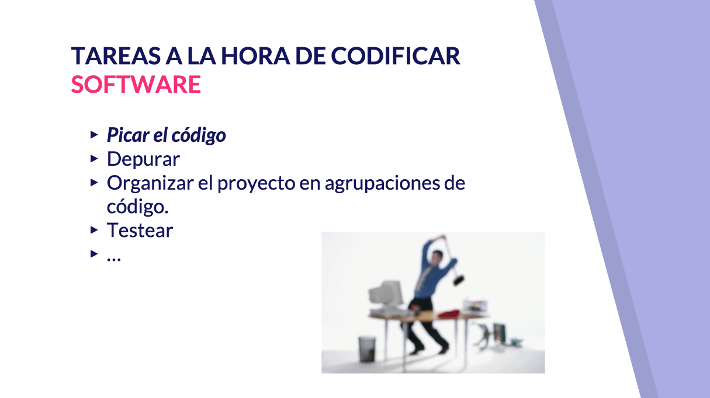

El *picar código* (como se conoce comunmente) es solamente un apartado de la fase de codificación, pero no la única. A la vez, tenemos que realizar test, para verificar que el software cumple con las especificaciones y no produce fallos. En ocasiones, para encontrar los fallos tendremos que depurar. Para proyectos grandes, tendremos que organizar nuestro código…

Si bien se puede desarrollar software en Java con un simple editor de texto plano y las herramientas proporcionadas por el JDK, son pocos los que se exponen a realizarlo así; la práctica totalidad de los desarrolladores optan por el uso de un Entorno Integrado de Desarrollo (IDE, por sus siglas en inglés)

### 2.2 IDEs más conocidos para Java

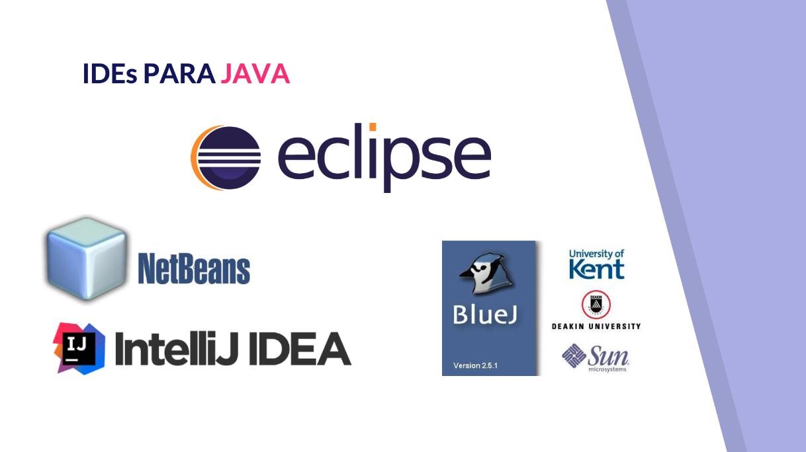

* **Eclipse**: será el que utilicemos nosotros. Es gratuito y el más utilizado en el mercado. Está disponible para trabajar con diferentes versiones de Java (SE, EE, …) y otros lenguajes de programación (C, C++, PHP, Python, …).

* **Netbeans**: el el entorno que nos propone Oracle, la propietaria de Java. También la podemos utilizar gratuitamente.

* **IntelliJ**: la empresa JetBrains nos ofrece IntelliJ, que en los últimos años ha tomado cierto auge debido a que también es la proveedora de IDEs estándar o muy utilizados para otros lenguajes, como Android Studio (Android), PyCharm (Python) o WebStorm (para Javascript). Podemos obtener licencias *community* o para estudiante.


### 2.3 Descarga e instalación de Eclipse

El IDE eclipse se puede descargar desde su web https://www.eclipse.org/downloads/. Podemos encontrar versiones para la mayoría de sistemas operativos. En nuestro caso, podemos escoger la versión para desarrolladores Java. La versión actual se llama *oxygen*.

Actualmente, eclipse nos sugiere descargar un instalador *ligero* que posteriormente se conecta y descarga la versión escogida, y la instala en la ruta que deseemos.

### 2.4 Concepto de *workspace*

Al iniciar eclipse, nos encontramos de lleno con el concepto de *workspace*. Un *espacio de trabajo* no es más que un punto de nuestro sistema de ficheros que marcamos como ubicación de un conjunto de proyectos. Eclipse es capaz de manejar más de un workspace (no a la vez), y nos permite cambiar de uno a otro cuando lo necesitemos. Para comenzar, podemos utilizar la propuesta por defecto.

# 03 Hola Mundo 10:49 

*HolaMundo.java*

```java
package holamundo;

public class HolaMundo {
    
    public static void main(String[] args) {
        System.out.println("¡Hola Mundo!");
    }
}
```

```sh
¡Hola Mundo!
------------------------------------------------------------------------
BUILD SUCCESS
------------------------------------------------------------------------
```
# 04 Algunos elementos de sintaxis 13:01 

[Algunos elementos de sintaxis](pdfs/04_Algunos_elementos_de_sintaxis.pdf)

### 4.1 Estructura de un programa básico


Cualquier programa básico Java estará compuesto de un fichero `.java`, que contendrá dentro una clase (con el mismo nombre que el fichero) y un método main:

***HolaMundo.java***

```java
/**
 * Nuestro primer programa en Java
 */
package holamundo;

/**
 * @author Openwebinars
 *
 */
public class HolaMundo {

    /**
     * @param args
     */
    public static void main(String[] args) {
        // TODO Auto-generated method stub
        System.out.println("Hola Mundo");
    }

}
```

### 4.2 Sentencia

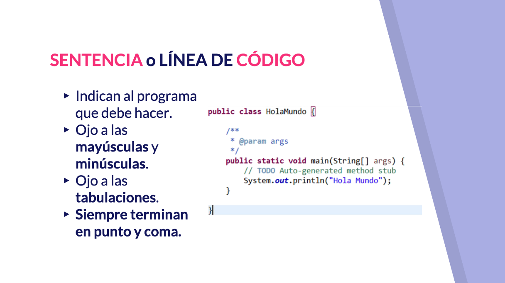

A falta de una definición más formal, podemos asemejar una sentencia a una línea de código. Indica al programa los pasos que debe dar. Hay que tener cuidado con el uso de mayúsculas y minúsculas, ya que Java es case sensitive. Obligatoriamente, todas las sentencias deben terminar con un punto y coma (;), que delimitan el fin de la misma y el inicio de la siguiente. También debemos ser cuidadosos con las tabulaciones, que hacen el código más legible.

### 4.3 Bloque de código

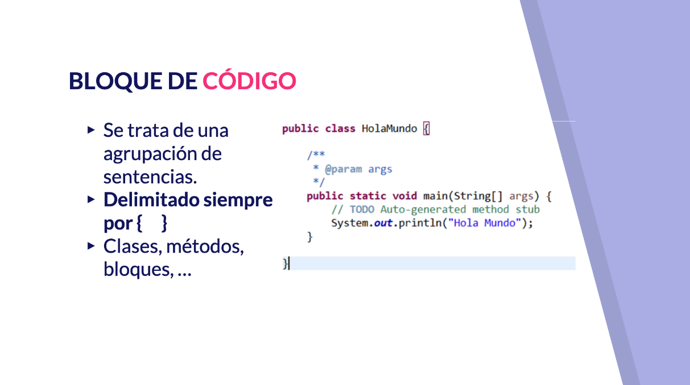

Se trata de la agrupación de varias sentencias. En las próximas lecciones encontraremos muchos motivos para realizar estas agrupaciones. Siempre vienen delimitadas por una apertura y cierre de llaves `{ }`.

### 4.4 Comentarios

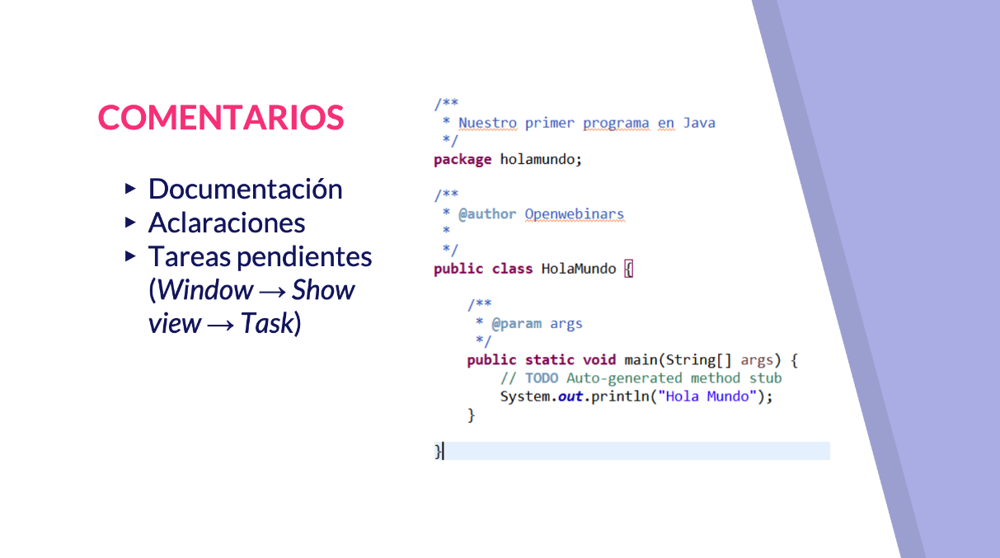

Nos van a permitir documentar nuestro código, o realizar ciertas aclaraciones sobre el mismo. Existen dos formas de hacerlo:

* Para varias líneas: delimitado por `/* .... */`
* Para una sola línea: delimitado por `// ...`

### Tareas ToDo

Si además, queremos indicar que dejamos una **tarea pendiente (ToDo en inglés)** lo podemos hacer de la siguiente forma:

```java
public static void main(String[] args) {
  // TODO Auto-generated method stub
  System.out.println("Hola Mundo");
}
```

Si posteriormente abrimos la vista de tareas **(Window -> Show View -> Task)**, eclipse se encarga de escanear el código buscando estos comentarios, para localizarlos después fácilmente, y saber que tareas tenemos pendientes sobre el código.

## Contenido adicional 4

[Presentación](pdfs/00_Presentación.pdf)

[Instalación de Java](pdfs/01_Instalación_de_Java.pdf)

[Posibles entornos de desarrollo](pdfs/02_Posibles_entornos_de_desarrollo.pdf)

[Algunos elementos de sintaxis](pdfs/04_Algunos_elementos_de_sintaxis.pdf)

