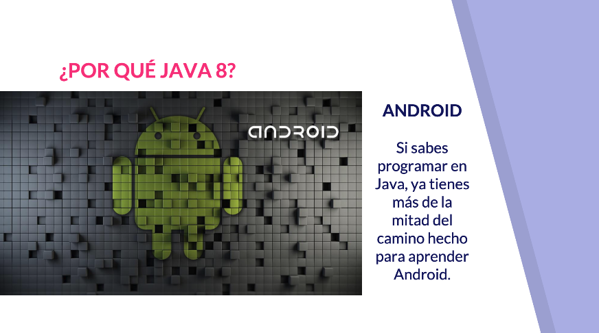
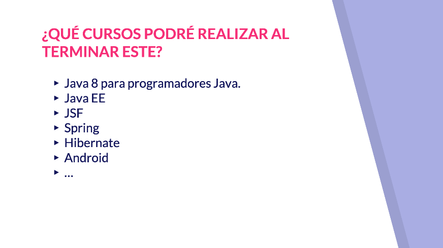
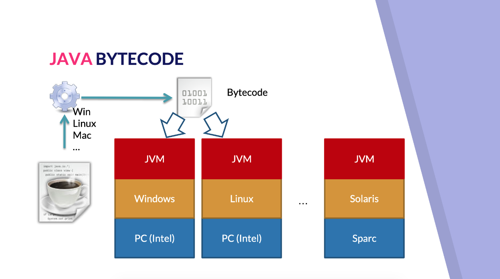
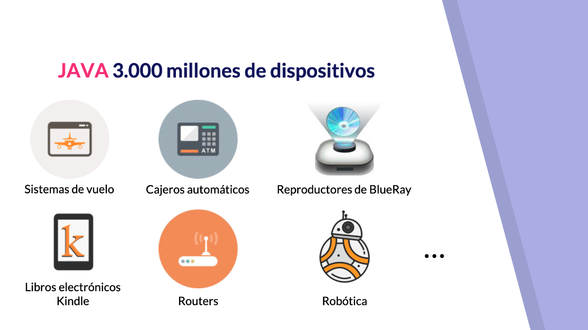
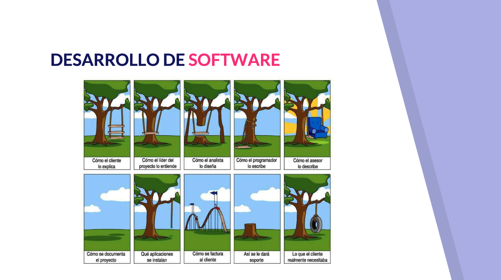
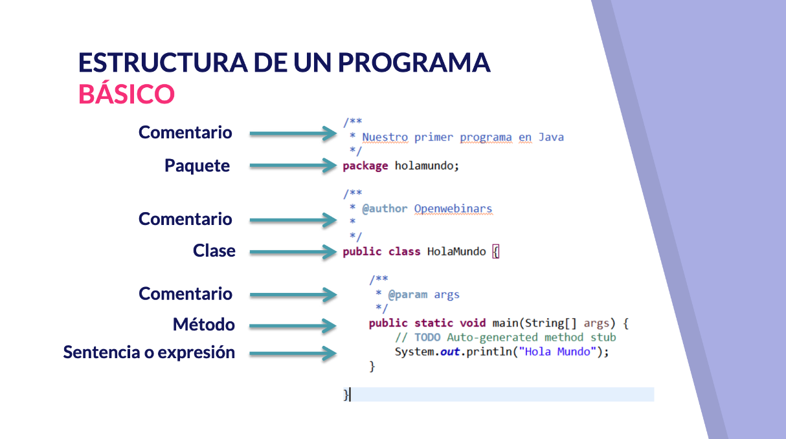
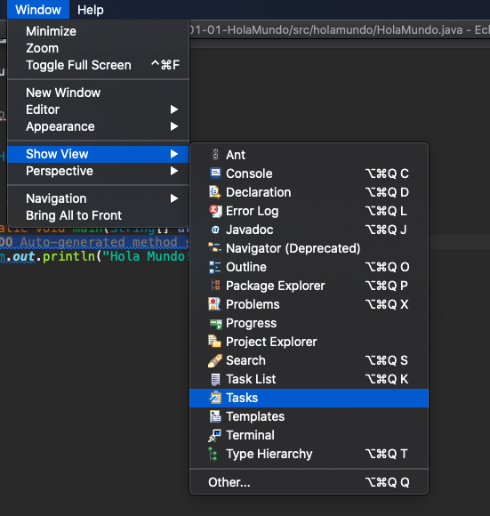
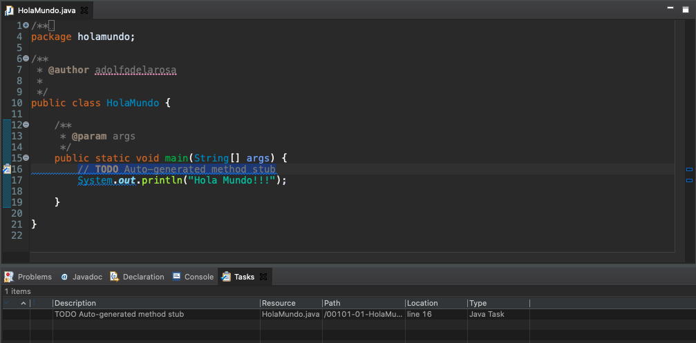
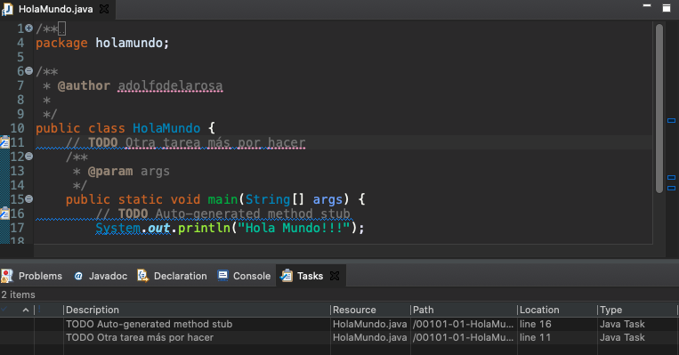

# 1. Comienza con Java 59m 

   * 00 Presentación del profesor y curso 5:12 
   * 01 Instalación de Java 16:13 
   * 02 Posibles entornos de desarrollo 13:46 
   * 03 Hola Mundo 10:49 
   * 04 Algunos elementos de sintaxis 13:01 
   * Contenido adicional 4

# 00 Presentación del profesor y curso 5:12 

[Presentación](pdfs/00_Presentación.pdf)

## Transcripción


Para realizar el curso de Java desde cero no es necesario ningún requisito en particular, si bien es cierto que cualquier persona que quiera ser programador o quiera aprender programación, se agradece siempre el tener algo de capacidad analítica, algo de base matemáticas y siempre un puntito de creatividad.


Porque es bueno que aprendáis Java 8, según Oracle la empresa propietaria de la tecnología Java existen a día de hoy cerca de tres mil millones de dispositivos en el mundo que utilizan Java dispositivo de diferentes tipos.



Y además Java en particular ahora con la versión 8 es la mitad del camino que tenemos que recorrer si queremos aprender a programar aplicaciones nativas para dispositivos móviles que corran Android.


Como otro argumento también para tratar de convencerlos es que Java sigue siendo desde hace bastante tiempo el lenguaje de programación más utilizados según uno de los [rankings](https://tiobe.com/tiobe-index/) que existen que lo mide en todo el mundo, además os recomiendo que podáis leer el artículo que tenemos en nuestro blog sobre [cuánto gana un programador Java en España](https://openwebinars.net/blog/cuanto-gana-un-programador-java-en-espana/) para qué pueda servir también de acicate o podéis comparar con respecto a otra tecnología si es que el salario que quieren obtener también es una opción para aprender o no un lenguaje de programación.


Vamos a estructurar el curso de Java en varios bloques que los vamos a ver a continuación, primero vamos a comenzar con Java instalándolo, instalando un entorno de desarrollo y comenzando con su sintaxis inicial, posteriormente vamos a trabajar con variables, tipos de datos, operadores y con las sentencias de estructura de control, después pasaremos a trabajar con clases y objetos una primera introducción, posteriormente en manipularemos y trataremos datos con Arrays y Strings.


Pasaremos después a revisitar otra vez clase y objetos trabajando con sus argumento y modificadores, usaremos herencia de clase y aprenderemos también a trabajar con interfaces, clases abstracta y polimorfismo, manejaremos excepciones y también conoceremos alguna de las clases más utilizadas del API de Java cómo son StringBuilder, el nuevo API de fecha, ArrayList y las expresiones lambda y el nuevo API Stream que podremos introducir.


Como prácticas haremos tres proyectos, que lo haremos en momento intermedio y al final del curso en el que haremos una sencilla calculadora aritmética, un juego de hundir la flota y la gestión de de un parking.


Y si te planteas cual va a ser el resultado cuando yo termine este curso, es decir que sere capaz de hacer cuando finalice el curso, lo primero es que seras capaz de programar aplicaciones en Java, lo cual será programar aplicaciones que se puedan ejecutar en distintos sistemas operativos Windows, Linux, Mac son los más utilizados. También vas a poder manejar todos los conceptos de programación orientada a objetos, sabras utilizar tipos de datos complejos como son las fechas.  


Podrás utilizar el nuevo estilo de programación funcional incorporado en Java SE 8, manejar situaciones de error y darle tratamiento a esos errores, tratarlos de forma adecuada.



También podrás utilizar los conocimientos de este curso como base para hacer otros de los cursos como son Java 8 para programadores Java, Java EE, JSF, los cursos de Spring e Hibernate y el curso de Android entre otro.

Así que os ánimo a que podáis hacer este curso de Java 8 desde cero, si no sabéis nada de programación es el curso, incluso también os puede servir como reciclaje si sabes programar en Java, pero queréis conocer los nuevos elementos que incorpora Java 8, ánimo y que disfrutéis del curso 

# 01 Instalación de Java 16:13 

[Instalación de Java](pdfs/01_Instalación_de_Java.pdf)

## Resumen Profesor

### 1.1 ¿Qué es Java?

Java no es más que una plataforma sobre la cual ejecutar aplicaciones que están desarrolladas en ese mismo lenguaje de programación, es decir, Java. Además, esta plataforma pone a nuestra disposición cantidades ingenentes de código que podemos utilizar.

### 1.2 Java Virtual Machine

Una de las principales características de Java con respecto a otros lenguajes, como C, C++ o Python es que los programas producidos en este lenguaje no se ejecutan directamente por el sistema operativo; sobre este, existe un entorno, llamado *Java Virtual Machine*. Podríamos asemejarlo a un ordenador virtual que está capacitado para ejectuar aplicaciones Java. De esta manera, como programadores nos desprendemos de la mayoría de los detalles asociados a la plataforma concreta sobre la cual estamos programando.

La JVM está disponible para la casi totalidad de arquitecturas y sistemas operativos existentes en el mercado. Desde Oracle, la propietaria de Java, se jactan de que se pueden ejecutar aplicaciones java en 3.000 millones de dispositivos, desde sistemas de vuelo, cajeros automáticos a robots o routers.

### 1.3 Java Bytecode

Como consecuencia de tener un entorno especial de ejecución, la JVM, tenemos que al compilar y enlazar (link) nuestro código Java, no vamos a obtener el clásico *código objeto* producido, por ejemplo, al trabajar con C o C++. En este caso, tenemos un código objeto especial, llamado **java bytecode**, y que solo es capaz de ser ejecutado por la Java Virtual Machine.

### 1.4 JRE vs JDK

Al empezar a trabajar con Java, nos encontramos con dos conceptos que es necesario diferenciar, y que son JRE (*Java Runtinme Environment*) y JDK (*Java Development Kit*)

 * **JRE**: Se trata de un conjunto de ficheros y programas que nos permiten ejecutar aplicaciones Java. Es necesario tenerlo instalado si solamente vamos a ejecutar aplicaciones Java.
 
* **JDK**: Se trata de un conjunto de ficheros y programas que nos permiten crear, compilar y ejecutar aplicaciones Java. Es necesario si además de ejecutar aplicaciones Java, queremos desarrolarlas.

Es interesante apreciar que al instalar en nuestro PC el kit de desarrollo (JDK), también estamos instalando en entorno de ejecución (JRE.)

### 1.5 Instalación de JDK 8

Si queremos comprobar si tenemos java disponible (al menos JRE), basta con que abramos un terminal (`cmd` en Windows) y escribamos `java --version`. Si todo es correcto, nos dará un mensaje con la versión. Si además, queremos comprobar si tenemos una versión de JDK instalada, podemos escribir en el terminal `javac --version`. La herramienta `javac` es la de compilación, solo disponible en JDK.

Para instalar la última versión de JDK, tan solo tenemos que escribir en google `get jdk` y nos enlazará directamente a la página de descargas de Oracle (en el momento de escribir estas líneas la página era http://www.oracle.com/technetwork/java/javase/downloads/jdk8-downloads-2133151.html).

* En el caso de Windows, debemos escoger entre 32 o 64 bits (dependiendo de nuestra arquitectura y versión de sistema operativo)

* En el caso de Linux, en muchas distribuciones de linux ya lo encontraremos instalado. Si utilizamos una distribución de tipo Ubuntu, lo podemos instalar con el comando `$ sudo apt-get install openjdk-8-jdk`. Si utilizamos una distribución de tipo Fedora-Red Hat, podríamos usar el comando `$ su -c "yum install java-1.8.0-openjdk-devel"`

* En el caso de Mac, …

### 1.6 Java 9

En el momento de comenzar a escribir estas líneas, la primera versión de Java 9 ha sido liberada, si bien muchos programas (como por ejemplo, el propio entorno de desarrollo Eclipse) aun no soportan dicha versión.

## Transcripción

Hola todo y bienvenido a esta primera lección sobre Java 8 en el nos vamos a introducir un poco en esta tecnología tan apasionante que es Java y acabaremos haciendo la instalación de la primera parte del software que vamos a necesitar para desarrollar aplicaciones con el.


Si alguien no hiciera la pregunta de que es Java le podríamos responder que Java son varias cosas, primero Java es un lenguaje de programación que nos va a servir para desarrollar aplicaciones de muchos tipos distintos, lo iremos aprendiendo a lo largo de este curso, además Java no es solamente una sintaxis, no es solamente unas reglas, sino que también es un conjunto, además muy grande de código que ya está puesto a nuestra disposición para hacer diversas tareas y también y eso lo vamos a aprender en este capítulo Java es una plataforma, un software de base, dónde poder ejecutar las aplicaciones que vamos a desarrollar.


Como cualquier otra rama de conocimiento merece la pena conocer algo sus inicios. Java qué es un lenguaje orientado a objetos digamos que está asociado al paradigma orientado a objetos el cual también aprenderemos dentro de este curso, surge a principios de los años 80, en torno al año 80 con un lenguaje de programación llamado Smalltalk y paulatinamente va ganándole terreno a otros lenguajes de programación que utilizaba otras maneras de organizarse, otros paradigmas, poco a poco va cogiendo auge en los años 90 a raíz de una extensión del lenguaje C, llamada C++,  si alguno conoce C+++ sabrá que es un lenguaje de programación muy potente a día de hoy se sigue utilizando, pero que no es nativamente orientado a objetos, sino que es como una extensión orientado a objetos para C y que además pues tenía algunos o daba algunos problemas a la hora de desarrollar software que pudiéramos, aplicaciones que pudiéramos ejecutar con garantía en diferentes plataformas, en diferentes sistemas operativos.


En torno a los años 90 Sun Microsystems una empresa que en su día que fue adquirida por Oracle, necesita una plataforma para poder ejecutarse en distintos tipos de dispositivos, no solamente en PCs o estaciones de trabajo sino en otro dispositivo como pueden ser coches o incluso electrodomésticos, paralelamente a mitad de los noventa, desde el principio y mitad de los noventa surge la World Wide Web WWW, la web empieza a tomar forma hasta que es lo que conocemos hoy y es otro elemento, digamos que dados de la mano son los que producen la génesis de Java como lenguaje, como plataforma y los que hacen que vaya cogiendo un gran auge.


Pasemos a ver ahora otro concepto y es el de la Java Virtual Machine decíamos antes que con C++ al igual que con C++ al igual que con otros lenguajes de programación teníamos diferencias o problema, teniamos que plantearnos la dificultad de desarrollar una aplicación escrita con un código y qué está se ejecutará en distintos sistemas operativos, tanto es así que por ejemplo si dijéramos de hacer una aplicación en C o en C++ otros lenguajes de programación y la quisiéramos ejecutar en Windows, los conceptos ya los aprenderemos, la compilaramos y la preparamos la linkaramos para ejecutar en Windows esa misma aplicación, ese mismo ejecutable no se podría ejecutar en Linux y viceversa también nos pasaría, un ejecutable pensado para Linux no sería capaz de ejecutarse en Windows o en otro tipo de sistemas operativos.


Java lo que hace es aportarnos la máquina virtual de Java y eso qué es, pues se trata de un entorno virtual de ejecución, podríamos llamarlo una capa de abstracción que se sitúa entre el sistema operativo y nuestro programa, nuestro programa ya por supuesto hecho en Java, de esa forma cualquier programa que nosotros desarrollamos en Java se ejecutará siempre en una Java Virtual Machine en una máquina virtual de Java y es Java o mejor dicho en este caso Oracle o Sun Microsystems en su día, quién se encargó de desarrollar que hubiera de garantizar que hubiera una Java Virtual Machine para cada sistema operativo de los conocidos, incluso para para algunos dispositivos de lo más variopintos. 


Está portabilidad, este carácter multiplataforma se consigue cambiando el planteamiento a la hora de producir el programa, por ejemplo cuando nosotros trabajamos en un lenguaje como C nosotros debíamos compilar nuestro programa y compilarlo significa traducirlo de lenguaje de programación que conoce el programador a un lenguaje que pudiera entender la máquina llamado lenguaje objeto, ese lenguaje objeto no es el mismo para Windows que para Linux, debíamos hacer una compilación expresa de nuestro programa para Windows o de nuestro programa para Linux.



Con Java sucede algo diferente y es que Java a la hora de ser compilado produce un código que se suele llamar intermedio Java ByteCode qué es el código objeto que podríamos decir que habla la Java Virtual Machine con lo cual una sola compilación de nuestra aplicación Java va a ser que funcione en una Java Virtual Machine instalada pues tanto en Windows como en Linux que el ejemplo del cual venimos hablando en este capítulo como incluso en otra arquitectura diferentes y que a lo mejor para para el usuario de a pie son menos conocidas como, el sistema operativo Solaris con una arquitectura por debajo que no fuera de PC y eso que no fuera una arquitectura SISC sino una RISC con la SPARC aunque esa ya es mas antigua pero si nos podríamos plantear que pudiera funcionar ahi, incluso ya no solo en arquitectura de diferente arquitectura de computadores.



Oracle se jacta de alguna manera que más de tres mil millones de dispositivos en todo el mundo son capaces de ejecutar Java y podemos encontrarlo de de la manera más variopinta, desde sistemas de vuelo el sistema operativo de alguno cajero automático el sistema embebido de algunos reproductores de Blu-ray o antiguamente de DVD en libro electrónico Kindle, el sistema operativo de muchos routers, en robótica, todo ello ejecuta por debajo de una u otra manera una máquina virtual de Java sobre la cual nosotros podemos desarrollar aplicaciones Java.


Cuando se empieza a conocer el mundo Java cuesta algo de trabajo diferenciar estos dos conceptos:

* Java Runtime Environment (JRE)
* Java Development Kit (JDK)

Como hemos dicho antes Java es una plataforma y esa Java Virtual Machine es un programa que hay que instalar dentro de nuestro sistema operativo. Si nosotros solamente nos vamos a dedicar a ejecutar aplicaciones Java en cualquier formato que hayan producido unos terceros nosotros solo necesitamos el entorno de ejecución el JRE que incluye todo lo necesario la JVM para ejecutar cualquier tipo de aplicación Java si por el contrario nos queremos dedicar al desarrollo de aplicaciones Java necesitamos el kit de desarrollo que lo que hace es incluir además de todo lo que ya trae el JRE, una serie de herramientas necesarias entre ellos por ejemplo el compilador, para que podamos compilar fabricar y ejecutar cualquier tipo de aplicación Java.


Bueno Java es mucho Java, lo que hemos presentado es solamente una gota en el océano, Java como decíamos antes es muy extenso y bueno nosotros nos centraremos en conocer la versión conocida como estándar la Java SE en particular la versión más madura que existe a día de hoy qué es la versión 8 y qué la vamos a ejecutar sobre todo en aplicaciones de escritorio, si bien todo lo que aprendamos de Java nos servirá para desarrollar aplicaciones que podrán ejecutarse como decíamos en muchas otras plataformas, por ejemplo con las Java TV en televisores y reproductores de DVD en móviles que utilicen Java, en tarjeta inteligente, servidores, robótica otro tipo de dispositivo.

Vamos a pasar a descargar nuestra versión de JDK, para poder descargar Java lo que necesitamos solamente es un navegador y en el podemos buscar en Google simplemente la cadena `get JDK` normalmente el primer resultado nos redirigirá directamente a hacia la [página de Oracle](https://www.oracle.com/java/technologies/javase-downloads.html) no recomiendo que descarguéis JDK desde cualquier otra página, sino que nos vamos directamente a la fuente de aquí como siempre el aceptar el uso de cookies y sobre las versiones de Java nosotros vamos a desarrollar el curso sobre la versión 8, descargarnos la última actualización de la versión 8 de Java, escogemos la instalación del JDK, la descarga del JDK.

Ya podríamos descargar para nuestro sistema operativo yo voy a hacer la descarga en particular para Windows de 64 bits, existen versiones para distintos sistemas operativos, en sistemas operativos Linux quizá fuera más sensato hacer la instalación vía por ejemplo algunos basado en Debían o Ubuntu usando Actitud y en Mac también con alguno de los gestores de paquetes que tiene, en el material complementario de selección también encontrareis las órdenes necesarias para instalar JDK en en esos sistemas operativos.

Lo normal es que la instalación se haga si lo hacéis en Windows en la carpeta de Archivos de programa y habéis cogido demás o tenéis un sistema operativo de 64 bits o en la carpeta de archivos de programas en la coletilla de x86 dentro de ella se creará una carpeta que se llama Java porque podemos tener instalada diferentes versiones de JDK por ejemplo si alguien quisiera tener Java 8 para desarrollar como yo digo con garantía y Java 9 para ir probando se pueden llevar. 

Una vez instalada la JDK si queremos comprobar lo tenemos muy fácil, tan solo tenemos que abrir una consola y pulsar el comando 

`java -version`

# 02 Posibles entornos de desarrollo 13:46 

[Posibles entornos de desarrollo](pdfs/02_Posibles_entornos_de_desarrollo.pdf)

## Resumen Profesor

### 2.1 Tareas a la hora de desarrollar software

Desarrollar software puede llegar a ser, para aplicaciones no excesivamente *grandes*, una empresa titánica, ya que conlleva múltiples tareas. De forma clásica, el desarrollo de software se ha dividido en 4 grandes fases:

* **Análisis**: ¿qué problema vamos a resolver?
* **Diseño**: ¿cómo resolvemos el problema?
* **Codificación**: *construcción* de la solución
* **Mantenimiento**: correcciones y actualizaciones.

El *picar código* (como se conoce comunmente) es solamente un apartado de la fase de codificación, pero no la única. A la vez, tenemos que realizar test, para verificar que el software cumple con las especificaciones y no produce fallos. En ocasiones, para encontrar los fallos tendremos que depurar. Para proyectos grandes, tendremos que organizar nuestro código…

Si bien se puede desarrollar software en Java con un simple editor de texto plano y las herramientas proporcionadas por el JDK, son pocos los que se exponen a realizarlo así; la práctica totalidad de los desarrolladores optan por el uso de un Entorno Integrado de Desarrollo (IDE, por sus siglas en inglés)

### 2.2 IDEs más conocidos para Java

* **Eclipse**: será el que utilicemos nosotros. Es gratuito y el más utilizado en el mercado. Está disponible para trabajar con diferentes versiones de Java (SE, EE, …) y otros lenguajes de programación (C, C++, PHP, Python, …).

* **Netbeans**: el el entorno que nos propone Oracle, la propietaria de Java. También la podemos utilizar gratuitamente.

* **IntelliJ**: la empresa JetBrains nos ofrece IntelliJ, que en los últimos años ha tomado cierto auge debido a que también es la proveedora de IDEs estándar o muy utilizados para otros lenguajes, como Android Studio (Android), PyCharm (Python) o WebStorm (para Javascript). Podemos obtener licencias *community* o para estudiante.

### 2.3 Descarga e instalación de Eclipse

El IDE eclipse se puede descargar desde su web https://www.eclipse.org/downloads/. Podemos encontrar versiones para la mayoría de sistemas operativos. En nuestro caso, podemos escoger la versión para desarrolladores Java. La versión actual se llama *oxygen*.

Actualmente, eclipse nos sugiere descargar un instalador *ligero* que posteriormente se conecta y descarga la versión escogida, y la instala en la ruta que deseemos.

### 2.4 Concepto de *workspace*

Al iniciar eclipse, nos encontramos de lleno con el concepto de *workspace*. Un *espacio de trabajo* no es más que un punto de nuestro sistema de ficheros que marcamos como ubicación de un conjunto de proyectos. Eclipse es capaz de manejar más de un workspace (no a la vez), y nos permite cambiar de uno a otro cuando lo necesitemos. Para comenzar, podemos utilizar la propuesta por defecto.

### Transcripción

En este segundo capítulo vamos a hablar de entornos de desarrollo.



Y es que la tarea del desarrollo de software no es algo que sea algo trivial realmente, no lo podemos ver como un monolito que esté formado solamente por una cosa, es decir por abrir nuestro ordenador y ponernos a escribir código, sino que requiere de una serie de pasos y un proceso que realmente puede llegar a ser complejo y qué me gusta ilustrar mediante esta imagen, cómo podéis comprobar entre lo que un cliente expresa, sobre lo que necesita, sobre la aplicación que nosotros como programadores, desarrolladores le tenemos que hacer, hasta lo que el cliente realmente necesitaba y pasando por una serie de fases como lo entiende el líder de proyecto, cómo se diseña, cómo lo llega a escribir un programador etc. existen una serie de tareas y es que como ya os digo el desarrollo de software es algo que puede resultar ciertamente complejo.


Normalmente o de manera clásica las metodologías de desarrollo de software clásica han dividido la producción de software, el desarrollo de software en cuatro grandes áreas, la primera gran tarea sería la tarea de análisis, que trata de decir bueno si un cliente me ha pedido esto tengamos claro que es esto tengamos claro que problema el que tenemos que resolver, una vez que eso queda claro pasamos a la segunda fase a la fase del diseño, que también tiene una serie de tareas, una vez identificado de manera concreta y amplia el problema que vamos a resolver, tenemos que buscar la mejor solución para resolverlo y dar respuesta a cómo vamos a resolverlo, cómo tercera fase estaría la fase de implementación o codificación que tiene una serie de tareas entre la que está la propia codificación, implementación, la documentación de ese código fuente, la fase de prueba con algunas tareas y por último estaría la de mantenimiento, una vez que un programa está codificado, que está implementado digamos que su vida no finaliza ahí y es que puede que con el tiempo surjan nuevas necesidades que no fueron contempladas en su momento o surjan pequeños errores muy difíciles de detectar en la fase de codificación en las pruebas y que bueno pues requieran de esa corrección por eso hablamos de mantenimientos correctivos y evolutivos etc.


Si nos centramos en la tercera fase en la que podríamos llamar de codificación, dentro encontramos como decía varias tareas, como propiamente escribir el código una vez que vamos escribiendo o picando el código también tendremos la necesidad de depurar, la depuración es una tarea mediante la cual podemos ejecutar el código que estamos produciendo paso a paso, línea línea y comprobar los estado de los diferentes valores que vamos utilizando para poder encontrar posibles fallos, también tenemos que organizar todo ese código en distintas agrupaciones de código de manera que bueno podemos hacer una metáfora de tener un armario con una serie de apartados y bueno organizar documentos dentro de esos apartados para que después sean fácilmente localizables,  tenemos también realizar una serie de pruebas, testear nuestro software para garantizar que cuando le llegue al cliente no se encuentre el fallo, cómo podemos comprobar desarrollar software es un conjunto de tarea que pueden resultar un auténtico quebradero de cabeza si lo intentamos hacer de una manera artesanal y es que para desarrollar aplicaciones en Java no necesitaríamos más que un editor de texto plano sencillo como podría ser emac en Linux o el mismo bloc de notas en Windows, pero no podríamos pensar que eso es francamente operativo, los programadores Java en su inicio quizás si lo hicieron de esa manera pero ya digo la cantidad de tareas que hay alrededor hace que necesitemos alguna herramienta que aumente nuestra productividad y que ademas nos facilite distintas tareas en el trabajo. 


A estas herramientas se le llaman Entornos Integrados de Desarrollo de Software IDEs y que son herramientas visuales que nos van a ayudar a muchas de las tareas que hemos nombrado antes, aquí tenemos un entorno de desarrollo que será el que nosotros utilicemos contiene diferentes ventanas para diferentes tareas que podemos realizar como la organización de los diferentes proyectos que vamos manejando, una lista de tareas, una lista de problemas, la documentación además veremos que el entorno es altamente configurable para que nos ofrezca las ventanas o pantallas que nosotros necesitemos estrictamente pudiendo habilitar algunas que inicialmente no se pudieran o no estuvieran habilitada o pudiendo ocultar otras que no vayamos a usar.
 

 
Entorno de desarrollo para Java o IDEs para Java existen muchos, si bien el más utilizado de software libre es Eclipse, si bien ya digo que no es el único desde que Oracle adquiriera la empresa Sun y por ende a la tecnología Java ha promocionado su su IDE Netbeans, que también es suficientemente válido y con el podemos realizar todas las tareas, también hay otra empresa IntelliJ que tiene su IDE IDEA con el que podremos desarrollar nuestras aplicación ese IDE, si alguno ya ha picado algo de programación en Android le sonará mucho porque podríamos decir que su hermano para para la programación en Java, si alguno en el mundo académico en la Universidad si estoy estudiando algún ciclo formativo puede que les suene  BlueJ qué es un IDE que lo pongo aquí simplemente para que lo conozcamos pero qué es meramente didáctico y que realmente no es productivo para para proyectos reales, aunque tampoco está mal para comenzar a aprender está tecnología, ya digo siempre pensando que se utilizaría en entorno didáctico y no para proyectos reales.

Ya que teníamos antes instalada nuestra JDK vamos a hacer ahora la instalación de Eclipse. Tenemos que ir a la [página de descarga de Eclipse](https://www.eclipse.org/downloads/) descargar la última versión para nuestro sistema operativo e instalarlo. 

Una vez instalado ya estaremos listos para crear nuestro promer programa.

Eclipse y como decíamos gratuito lo tenemos disponible desde su cuenta de punto o era 

# 03 Hola Mundo 10:49

## Creación del Repositorio del Curso

Creamos el nuevo repositorio para los programas del curso.


Una vez que presionamos el botón de Crear el Repositorio nos muestra una pantalla con diferetes instrucciones de como poder usar este repositorio remoto.


Como en nuestro caso lo vamos a usar desde Eclipse lo más relevante para nosotros es la dirección: `https://github.com/adolfodelarosades/COD_101_Java_8_desde_Cero.git`

Que como veremos más adelante nos servir para poder configurar desde Eclipse el uso de GitHub.

Abrimos el Workspace de Eclipse.


## Configurar Eclipse para usar Git y GitHub

1. Instalar EGit
En Eclipse lo primero que tendríamos que hacer es instalar el Plugin EGit, pero como hemos mencionado antes en las últimas versiones de Eclipse ya viene instalado por default pero si no fuera el caso hay que instalarlo.

2. Proporcionar datos de Identificación de Git y GitHub
Lo que tenemos que hacer ahora es proporcinar unos datos de identificación que nos serviran para interactuar con Git y GitHub. Vamos a Preferences - Team - Git - Configuration, esto aparece por que tenemos instalado EGit.


Lo que hemos hecho aquí es añadir un `user.name` y un `user.email` con sus respectivos valores. Estos datos simplemente son idenfificativos, no sirven para acceder a nada.

3. Crear Repositorio Local
Lo que nos falta es crear nuestro repositorio local, tenemos que tener un repositorio donde almacenar las versiones de nuestro proyecto. Para hacer esta gestión nos va a ser de utilidad abrir **la vista Git Repositories** esto lo hacemos con **Windows - Show Views - Others...** y de la lista de vistas nos vamos a **Git - Git Repositories**.


En la vista Git Repositories tenemos una serie de botonoes que nos permiten hacer diferentes tareas.


Entre ellos hay uno que es para `Create a new Git Repository and add it to this view` que es el que vamos a presionar.


Tenemos que seleccionar la carpeta donde lo queremos tener, por defaul nos aparece el sitio que usa git por default para almacenar los repositorios, 


vamos a usar esa carpeta solo vamos a poner un nombre a nuestro repositorio que será el mismo que usamos para el Workspace `101_Java_8_desde_Cero`


Y una vez que aceptamos ya nos aparece el nuevo repositorio local en la vista Git Repositories.


Y si nos vamos a la carpeta del repositorio dentro de ella se ha creado una carpeta oculta .git.


Que es donde se va ir almacenando toda la información del repositorio, las diferentes versiones,, cambios y demas.

Con esto ya tenemos creado nuestro repositorio local, de nuestro equipo y donde queremos controlar las diferentes versiones del proyecto. Pero también quremos conectarlo con el repositorio remoto para compartir las versiones de los proyectos con otros miembros del equipo.

4. Conectar Repositorio Local con el Repositorio Remoto
Para hacer la conección del Repositorio Local con el Remoto lo que hacemos es expandir nuestro repositorio local.


Sobre remote presionamos el botón derecho.


Y nos aparece `Create Remote...` lo pulsamos.


Simplemente presionamos OK dejando `origin` y presionamos el botón **`Create`**


Presionamos el botón **`Change...`**


En esta ventana es donde se me pide toda la información de conección con el repositorio Remoto es aquí donde debo meter la URI que me genero al crear el repositorio en GitHub junto con mis credenciales.


Con esto tendríamos la conexión entre el repositorio Local y el remoto.


Salvamos la configuración con **`Save`**.


Ya tenemos todo listo para a partir de ahora empezar a crear proyectos, subirlos a GitHub, controlar versiones algo que vamos a ver en la próxima lección.

## Creación de nuestro Primer Proyecto **`HolaMundo`**

Vamos a crear un nuevo proyecto **Java Project** de nombre **`101-01-HolaMundo`**, debemos seleccionar sobre que versión de Java se creara dicho proyecto y **`Finish`**.


Se ha creado nuestro proyecto:


Dentro del proyecto vamos a crear una nueva clase.


Dentro del método **`main`** vamos a mandar escribir en mensaje **`!Hola Mundo!`**

*HolaMundo.java*

```java
/**
 * 
 */
package javaocio;

/**
 * @author adolfodelarosa
 *
 */
public class HolaMundo {

   /**
    * @param args
    */
   public static void main(String[] args) {
      // TODO Auto-generated method stub
      System.out.println("¡Hola Mundo!");
   
   }

}
```

Si ejecutamos el programa tenemos con:


Veremos la salida en la consola.


# 04 Algunos elementos de sintaxis 13:01 

[Algunos elementos de sintaxis](pdfs/04_Algunos_elementos_de_sintaxis.pdf)

## Resumen Profesor

### 4.1 Estructura de un programa básico

Cualquier programa básico Java estará compuesto de un fichero `.java`, que contendrá dentro una clase (con el mismo nombre que el fichero) y un método main:

***HolaMundo.java***

```java
/**
 * Nuestro primer programa en Java
 */
package holamundo;

/**
 * @author Openwebinars
 *
 */
public class HolaMundo {

    /**
     * @param args
     */
    public static void main(String[] args) {
        // TODO Auto-generated method stub
        System.out.println("Hola Mundo");
    }

}
```

### 4.2 Sentencia

A falta de una definición más formal, podemos asemejar una sentencia a una línea de código. Indica al programa los pasos que debe dar. Hay que tener cuidado con el uso de mayúsculas y minúsculas, ya que Java es case sensitive. Obligatoriamente, todas las sentencias deben terminar con un punto y coma (;), que delimitan el fin de la misma y el inicio de la siguiente. También debemos ser cuidadosos con las tabulaciones, que hacen el código más legible.

### 4.3 Bloque de código

Se trata de la agrupación de varias sentencias. En las próximas lecciones encontraremos muchos motivos para realizar estas agrupaciones. Siempre vienen delimitadas por una apertura y cierre de llaves `{ }`.

### 4.4 Comentarios

Nos van a permitir documentar nuestro código, o realizar ciertas aclaraciones sobre el mismo. Existen dos formas de hacerlo:

* Para varias líneas: delimitado por `/* .... */`
* Para una sola línea: delimitado por `// ...`

Si además, queremos indicar que dejamos una **tarea pendiente (ToDo en inglés)** lo podemos hacer de la siguiente forma:

```java
public static void main(String[] args) {
  // TODO Auto-generated method stub
  System.out.println("Hola Mundo");
}
```

Si posteriormente abrimos la vista de tareas **(Window -> Show View -> Task)**, eclipse se encarga de escanear el código buscando estos comentarios, para localizarlos después fácilmente, y saber que tareas tenemos pendientes sobre el código.

## Transcripción

Si Java es un lenguaje al igual que pasa con el Castellano o con el Inglés también tiene sus reglas de sintaxis, vamos a aprender o vamos a estudiar algunas de ellas.



En la lección anterior hemos creado nuestro primer proyecto el conocido como hola mundo, el fichero que hemos creado tiene bastantes elementos que se han podido pasar desapercibido y qué bien vamos a conocer en esta lección, lo primero que podemos encontrar son comentarios, de hecho a lo largo de este pequeño trozo de código hay más de 1 y hasta 4 comentarios y es que los comentarios nos van a ayudar a ir identificando las distintas partes dentro de un fichero, nos pueden recordar cosas a tener en cuenta y si tenemos que revisar este código en algún momento después, puede servir de aclaración, si es que puede que estamos trabajando en un proyecto donde trabaja más de un desarrollador y hay algún fragmento que es especialmente complejo de entender o simplemente puede servir para identificar a través de algunas anotaciones o de variable especiales como en este caso el segundo comentario quién es el autor de este fichero de código, que en nuestro caso es Openwebinar. No es raro que se añada un comentario al inicio de cada fichero en el que se pueda describir de manera más o menos extensa el contenido que va a tener este fichero.

Lo siguiente que encontramos es la referencia al paquete en el cual estamos guardando esta clase que viene a continuación y es que como decía antes nuestro código, en un proyecto pequeño lo podríamos hacer la metáfora como si estuviéramos en hojas sueltas de papel que tenemos que hacer algún documento que sea pequeño y que tenga pocas hojas de papel pues seguramente nos da igual incluso llevarlas sueltas o tenerlas solamente en una carpeta, si tuviéramos que manejar un documento que tuviera miles de página seguramente nos interesaría el poder agrupar estas páginas dentro de capítulos que tendríamos guardadas juntas de alguna manera. Los paquetes nos van a permitir organizar nuestro código de manera que podremos tener elementos de nuestro programa que tengan relación entre ellos guardados de una manera cercana, ya aprenderemos cómo podemos tener paquete dentro de paquete que se le llaman subpaquetes etc. 


A continuación podemos encontrar la definición de una clase que la tenemos aquí un poco más destacada, cuando nosotros trabajemos con Java y en particular cuando trabajamos en programas de este calibre nos damos cuenta de que Java nos obliga a que tengamos como mínimo una clase en particular, una clase pública o por lo menos con modificador por defecto, ya hablaremos también de ellos, que tengamos una en cada fichero y además, ya veremos cómo Eclipse en este sentido nos ayuda, el nombre del fichero dónde está guardado esta clase debe ser el mismo, exactamente el mismo, que el nombre de la clase, de hecho si hay una diferencia entre ambos Eclipse nos recomendará o bien modificar el nombre de la clase o el mismo nos ayudará a renombrar ese fichero. Además si queremos que nuestra aplicación pueda ejecutarse necesitamos que como mínimo haya una clase que tenga el método `main`, este método es especial por que el encabezado del método es dicir `public static void main(String[] args)` es siempre la misma, de hecho como hemos podido comprobar ha sido Eclipse quien nos ha ayudado a generar esta parte, siempre se escribe igual, tiene un tipo de retorno `void` y recibe estos argumentos `args` se refiere a los argumentos que puede recibir el método `main`, estos argumentos que podríamos escribir nosotros a la hora de lanzar el programa desde la línea de comandos.


Ya hemos hablado de paquetes, hemos hablado de clases y como definirlas, tenemos que hablar de sentencias que como es como se les conoce en programación, si bien los programadores solemos hacer un pequeño abuso del lenguaje y los llamamos líneas de código, las sentencias o líneas de código son las diferentes órdenes que nuestro programa va dándole a la Java Virtual Machine, el ordenador dónde se está ejecutando y de alguna manera lo que va mandando hace que el programa haga una u otra cosa, en este caso tenemos una sola sentencia que lo que hace es imprimir el mensaje `Hola Mundo` por consola. Hay que tener mucho cuidado porque no solamente Java sino la mayoría de los lenguajes de programación Java también, al uso de mayúscula y minúscula y es que no podemos hacer un uso indiscriminado de mayúsculas una vez y minúsculas otra porque Java es lo conocido como Case Sensitive es decir, es sensible al uso de mayúsculas y minúsculas es decir en esta línea de código que tenemos aquí no sería lo mismo escribir system en minúscula ya que Java no sería capaz de reconocerlo, sin embargo al escribirlo en mayúsculas pues si lo identifica como parte de un objeto del sistema que a la postre va a ser el que nos permita imprimir el mensaje. También tenemos que tener ojo con respecto a las tabulaciones si nos damos cuenta el la definición de la clase estaba pegada al margen de la ventana del entorno de desarrollo, la definición de un método main está un tabulador hacia la derecha y la definición del cuerpo de este método también está un tabulador hacia la derecha y es que está tabulacion al igual que cuando las realizamos en un documento escrito con los párrafos va a ayudar a que el código sea legible, ya veremos como Eclipse nos proporciona algún atajo de teclado para que si se nos ha pasado un poco llevar bien está tabulacion bueno si todo lo demás está bien Eclipse es capaz de hacerla por nosotros y ojo porque Java como decíamos los primeros capítulos es un poco el heredero de C y C++ herada también elementos de su sintaxis y es que para poder indicar que una sentencia termina y comienza la siguiente, todas las sentencias tienen que terminar con el carácter punto.


Paquete, Clases, Sentencia, Líneas de Código, las líneas de código se pueden agrupar en lo que se conocen como *Bloques de Código* y eso bloque de código en Java se delimitan mediante el uso de llaves, es decir todas las sentencias que estén encerradas entre la apertura y un cierre de llaves, como el caso de `main` estarán dentro de un bloque de código, si nos damos cuenta y sin haberlo querido hemos hecho dos bloques de código, uno de ellos es el que conforma la clase `HolaMundo` que tiene apertura y cierre de llave y que encierra el método `main` y otro es el bloque de código asociado al método `main` que incluye todas las sentencias que tienen este método, veremos qué podemos crear bloques de código para clases, para métodos, incluso se pueden crear bloques de código para otra serie de sentencias como las estructuras de control ,de decisión, de repetición etc.


Y por último por identificar los diferentes comentarios que ya nombravamos antes que eran con carácter documental o aclaraciones si bien los experto en programación, los grandes gurús dicen que si nuestro código necesitan muchos comentarios aclarativo quiere decir que no lo hemos programado bien, yo sin embargo os recomiendo que conforme vaya aprendiendo hasta que os convirtáis en grandes gurús de la programación que comentáis vuestro código porque ya os daréis cuenta que si hacéis un programa que tenga mucha lineas de código, muchos ficheros diferente y el lo dejáis aparcado durante un tiempo y lo volverías a retomar más adelante, no digo años sino simplemente semana ya os daréis cuenta como los comentarios se agradecen porque nos recordarán y nos permitirán responder a esa gran pregunta de **porque hice yo esto así**. 

También hay un tipo de comentario especiales que se suelen encerrar entre `/*  ... */` para comentarios de múltiples líneas y tambén tenemos `/**  ... */` para documentar nuestros programas.

Tenemos otro tipo de comentario `// Comentario en una línea` que serían los comentarios de una sola línea que son con dos barras y qué  nos permitirían comentar lo que haya solamente en esa línea.

Si como bien a hecho Eclipse en este caso añadimos la palabra TODO `// TODO Auto-generated method stub` que hace referencia a la expresión inglesa TO DO - por hacer, si lo añadimos al principio de un comentario y después una frase aparte de que lo va a resaltar de una manera especial podremos comprobar cómo podemos utilizar este tipo de comentario para hacer anotaciones de tareas pendientes que tenemos en determinados puntos del código y después podremos consultar una vista de Eclipse dónde podemos encontrar todas esas anotaciones juntas.

Si vamos al proyecto `00101-01-HolaMundo` que tenía esa comentario, podríamos ir a la opción *Windows - Show View - Tasks* 





Si nos damos cuenta no irá indicando en esta vista todas las tareas que tenemos en este caso es una que se genera automáticamente, que simplemente nos dice, recuerda que este método lo he generado yo no dice Eclipse y que seguramente le tengas que dar contenido, nos indica el recurso, el fichero dónde se encuentra, la ruta, la línea y el tipo de tarea que es. Podríamos añadir tareas TODO en todas las partes de nuestro código.



Y como podemos comprobar ya nos sale la nueva tarea, podemos hacer doble click en dicha tarea y directamente nos la selecciona para que vaya en donde se ubique.  Si creamos más fichero aquí nos aparecerían todas las tareas que tendríamos pendiente en los diferentes ficheros, ya digo esto sirve muy bien para conforme vamos desarrollando, si quedan cosas por hacer las podemos ir anotando para luego ir resolviendo nuestras tareas pendientes.

Habiendo terminado los comentarios vamos a terminar este vídeo y en el siguiente iremos viendo algunos elementos sintácticos más del lenguaje Java.

## Contenido adicional 4

[Presentación](pdfs/00_Presentación.pdf)

[Instalación de Java](pdfs/01_Instalación_de_Java.pdf)

[Posibles entornos de desarrollo](pdfs/02_Posibles_entornos_de_desarrollo.pdf)

[Algunos elementos de sintaxis](pdfs/04_Algunos_elementos_de_sintaxis.pdf)

