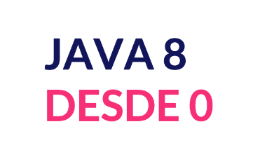
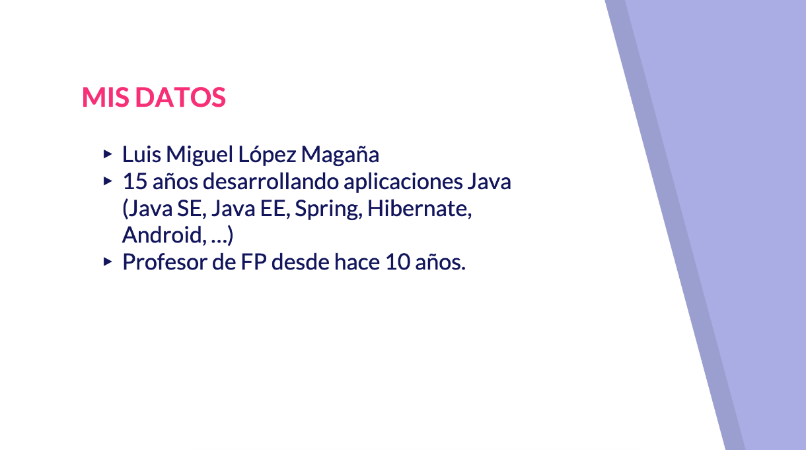
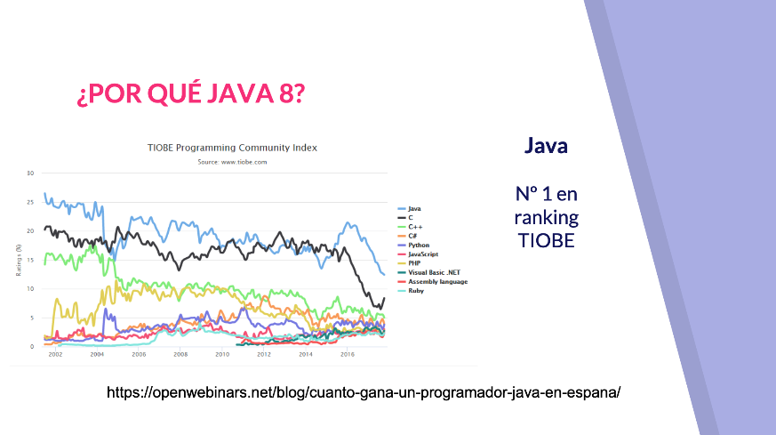
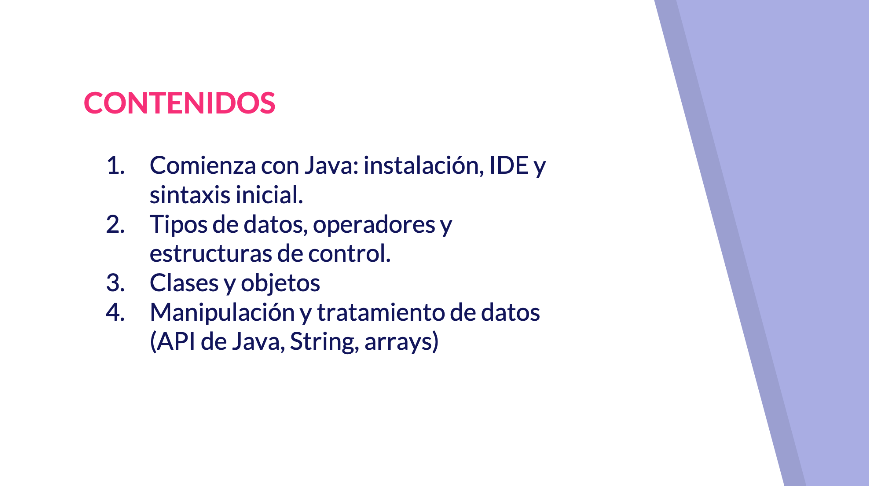
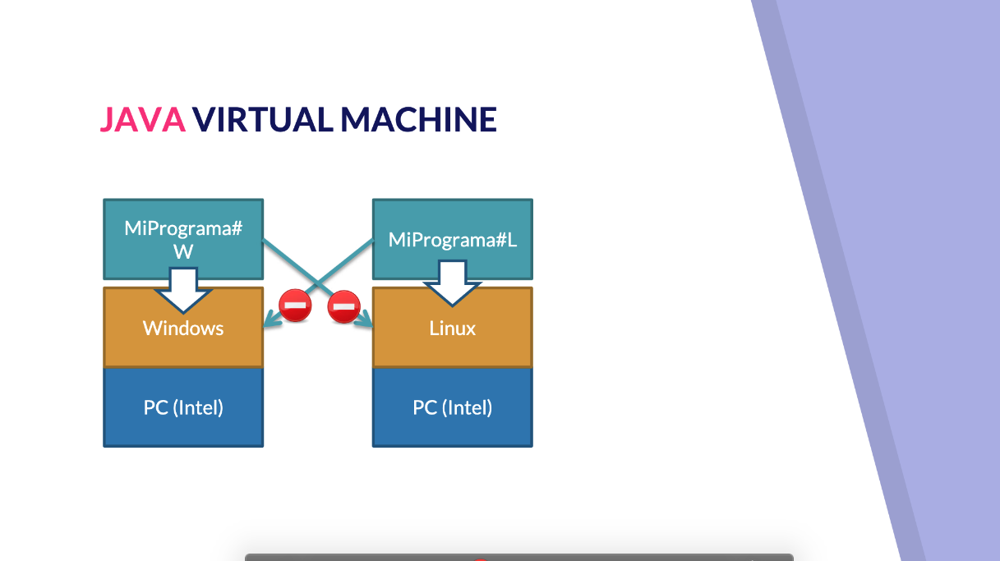
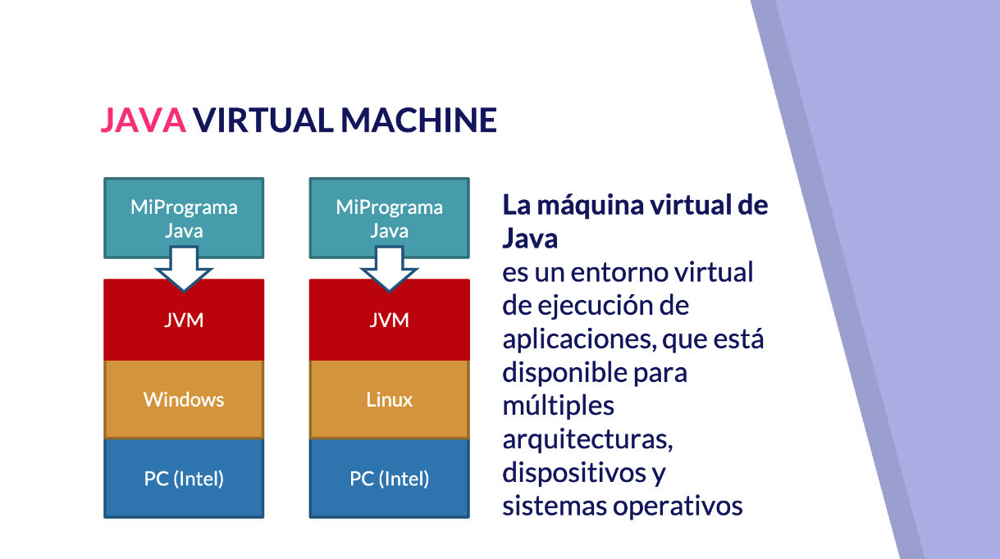
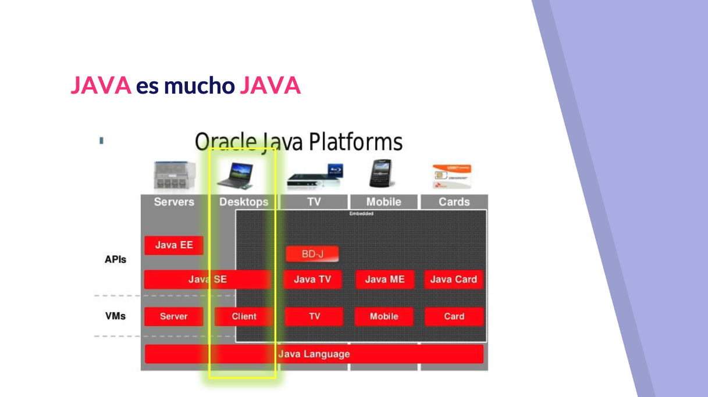
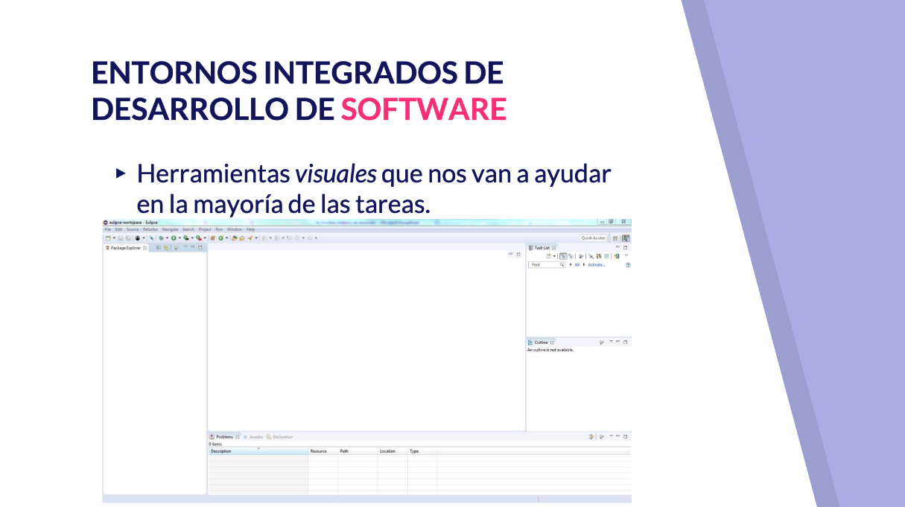

# 1. Comienza con Java 59m 

## Presentación del profesor y curso 5:12 

[Presentación](pdfs/00_Presentación.pdf)












## Instalación de Java 16:13 

[Instalación de Java](pdfs/01_Instalación_de_Java.pdf)

### 1.1 ¿Qué es Java?


Java no es más que una plataforma sobre la cual ejecutar aplicaciones que están desarrolladas en ese mismo lenguaje de programación, es decir, Java. Además, esta plataforma pone a nuestra disposición cantidades ingenentes de código que podemos utilizar.


### 1.2 Java Virtual Machine



Una de las principales características de Java con respecto a otros lenguajes, como C, C++ o Python es que los programas producidos en este lenguaje no se ejecutan directamente por el sistema operativo; sobre este, existe un entorno, llamado *Java Virtual Machine*. Podríamos asemejarlo a un ordenador virtual que está capacitado para ejectuar aplicaciones Java. De esta manera, como programadores nos desprendemos de la mayoría de los detalles asociados a la plataforma concreta sobre la cual estamos programando.



La JVM está disponible para la casi totalidad de arquitecturas y sistemas operativos existentes en el mercado. Desde Oracle, la propietaria de Java, se jactan de que se pueden ejecutar aplicaciones java en 3.000 millones de dispositivos, desde sistemas de vuelo, cajeros automáticos a robots o routers.

### 1.3 Java Bytecode


Como consecuencia de tener un entorno especial de ejecución, la JVM, tenemos que al compilar y enlazar (link) nuestro código Java, no vamos a obtener el clásico *código objeto* producido, por ejemplo, al trabajar con C o C++. En este caso, tenemos un código objeto especial, llamado **java bytecode**, y que solo es capaz de ser ejecutado por la Java Virtual Machine.


### 1.4 JRE vs JDK


Al empezar a trabajar con Java, nos encontramos con dos conceptos que es necesario diferenciar, y que son JRE (*Java Runtinme Environment*) y JDK (*Java Development Kit*)

 * **JRE**: Se trata de un conjunto de ficheros y programas que nos permiten ejecutar aplicaciones Java. Es necesario tenerlo instalado si solamente vamos a ejecutar aplicaciones Java.
 
* **JDK**: Se trata de un conjunto de ficheros y programas que nos permiten crear, compilar y ejecutar aplicaciones Java. Es necesario si además de ejecutar aplicaciones Java, queremos desarrolarlas.

Es interesante apreciar que al instalar en nuestro PC el kit de desarrollo (JDK), también estamos instalando en entorno de ejecución (JRE.)



### 1.5 Instalación de JDK 8

Si queremos comprobar si tenemos java disponible (al menos JRE), basta con que abramos un terminal (`cmd` en Windows) y escribamos `java --version`. Si todo es correcto, nos dará un mensaje con la versión. Si además, queremos comprobar si tenemos una versión de JDK instalada, podemos escribir en el terminal `javac --version`. La herramienta `javac` es la de compilación, solo disponible en JDK.

Para instalar la última versión de JDK, tan solo tenemos que escribir en google `get jdk` y nos enlazará directamente a la página de descargas de Oracle (en el momento de escribir estas líneas la página era http://www.oracle.com/technetwork/java/javase/downloads/jdk8-downloads-2133151.html).

* En el caso de Windows, debemos escoger entre 32 o 64 bits (dependiendo de nuestra arquitectura y versión de sistema operativo)

* En el caso de Linux, en muchas distribuciones de linux ya lo encontraremos instalado. Si utilizamos una distribución de tipo Ubuntu, lo podemos instalar con el comando `$ sudo apt-get install openjdk-8-jdk`. Si utilizamos una distribución de tipo Fedora-Red Hat, podríamos usar el comando `$ su -c "yum install java-1.8.0-openjdk-devel"`

* En el caso de Mac, …

### 1.6 Java 9

En el momento de comenzar a escribir estas líneas, la primera versión de Java 9 ha sido liberada, si bien muchos programas (como por ejemplo, el propio entorno de desarrollo Eclipse) aun no soportan dicha versión.

## Posibles entornos de desarrollo 13:46 

[Posibles entornos de desarrollo](pdfs/02_Posibles_entornos_de_desarrollo.pdf)


### 2.1 Tareas a la hora de desarrollar software


Desarrollar software puede llegar a ser, para aplicaciones no excesivamente *grandes*, una empresa titánica, ya que conlleva múltiples tareas. 

De forma clásica, el desarrollo de software se ha dividido en 4 grandes fases:

* Análisis: ¿qué problema vamos a resolver?
* Diseño: ¿cómo resolvemos el problema?
* Codificación: *construcción* de la solución
* Mantenimiento: correcciones y actualizaciones.


El *picar código* (como se conoce comunmente) es solamente un apartado de la fase de codificación, pero no la única. A la vez, tenemos que realizar test, para verificar que el software cumple con las especificaciones y no produce fallos. En ocasiones, para encontrar los fallos tendremos que depurar. Para proyectos grandes, tendremos que organizar nuestro código…

Si bien se puede desarrollar software en Java con un simple editor de texto plano y las herramientas proporcionadas por el JDK, son pocos los que se exponen a realizarlo así; la práctica totalidad de los desarrolladores optan por el uso de un Entorno Integrado de Desarrollo (IDE, por sus siglas en inglés)

### 2.2 IDEs más conocidos para Java


* Eclipse: será el que utilicemos nosotros. Es gratuito y el más utilizado en el mercado. Está disponible para trabajar con diferentes versiones de Java (SE, EE, …) y otros lenguajes de programación (C, C++, PHP, Python, …).

* Netbeans: el el entorno que nos propone Oracle, la propietaria de Java. También la podemos utilizar gratuitamente.

* IntelliJ: la empresa JetBrains nos ofrece IntelliJ, que en los últimos años ha tomado cierto auge debido a que también es la proveedora de IDEs estándar o muy utilizados para otros lenguajes, como Android Studio (Android), PyCharm (Python) o WebStorm (para Javascript). Podemos obtener licencias *community* o para estudiante.



### 2.3 Descarga e instalación de Eclipse

El IDE eclipse se puede descargar desde su web https://www.eclipse.org/downloads/. Podemos encontrar versiones para la mayoría de sistemas operativos. En nuestro caso, podemos escoger la versión para desarrolladores Java. La versión actual se llama *oxygen*.

Actualmente, eclipse nos sugiere descargar un instalador *ligero* que posteriormente se conecta y descarga la versión escogida, y la instala en la ruta que deseemos.

### 2.4 Concepto de *workspace*

Al iniciar eclipse, nos encontramos de lleno con el concepto de *workspace*. Un *espacio de trabajo* no es más que un punto de nuestro sistema de ficheros que marcamos como ubicación de un conjunto de proyectos. Eclipse es capaz de manejar más de un workspace (no a la vez), y nos permite cambiar de uno a otro cuando lo necesitemos. Para comenzar, podemos utilizar la propuesta por defecto.

## Hola Mundo 10:49 

*HolaMundo.java*

```java
package holamundo;

public class HolaMundo {
    
    public static void main(String[] args) {
        System.out.println("¡Hola Mundo!");
    }
}
```

```sh
¡Hola Mundo!
------------------------------------------------------------------------
BUILD SUCCESS
------------------------------------------------------------------------
```
## Algunos elementos de sintaxis 13:01 

[Algunos elementos de sintaxis](pdfs/04_Algunos_elementos_de_sintaxis.pdf)

### 4.1 Estructura de un programa básico

Cualquier programa básico Java estará compuesto de un fichero `.java`, que contendrá dentro una clase (con el mismo nombre que el fichero) y un método main:

```java
/**
 * Nuestro primer programa en Java
 */
package holamundo;

/**
 * @author Openwebinars
 *
 */
public class HolaMundo {

    /**
     * @param args
     */
    public static void main(String[] args) {
        // TODO Auto-generated method stub
        System.out.println("Hola Mundo");
    }

}
```

### 4.2 Sentencia

A falta de una definición más formal, podemos asemejar una sentencia a una línea de código. Indica al programa los pasos que debe dar. Hay que tener cuidado con el uso de mayúsculas y minúsculas, ya que Java es case sensitive. Obligatoriamente, todas las sentencias deben terminar con un punto y coma (;), que delimitan el fin de la misma y el inicio de la siguiente. También debemos ser cuidadosos con las tabulaciones, que hacen el código más legible.

### 4.3 Bloque de código

Se trata de la agrupación de varias sentencias. En las próximas lecciones encontraremos muchos motivos para realizar estas agrupaciones. Siempre vienen delimitadas por una apertura y cierre de llaves `{ }`.

### 4.4 Comentarios

Nos van a permitir documentar nuestro código, o realizar ciertas aclaraciones sobre el mismo. Existen dos formas de hacerlo:

* Para varias líneas: delimitado por `/* .... */`
* Para una sola línea: delimitado por `// ...`

### 4.5 Tareas ToDo

Si además, queremos indicar que dejamos una **tarea pendiente (ToDo en inglés)** lo podemos hacer de la siguiente forma:

```java
public static void main(String[] args) {
  // TODO Auto-generated method stub
  System.out.println("Hola Mundo");
}
```

Si posteriormente abrimos la vista de tareas **(Window -> Show View -> Task)**, eclipse se encarga de escanear el código buscando estos comentarios, para localizarlos después fácilmente, y saber que tareas tenemos pendientes sobre el código.

## Contenido adicional 4

[Presentación](pdfs/00_Presentación.pdf)

[Instalación de Java](pdfs/01_Instalación_de_Java.pdf)

[Posibles entornos de desarrollo](pdfs/02_Posibles_entornos_de_desarrollo.pdf)

[Algunos elementos de sintaxis](pdfs/04_Algunos_elementos_de_sintaxis.pdf)

