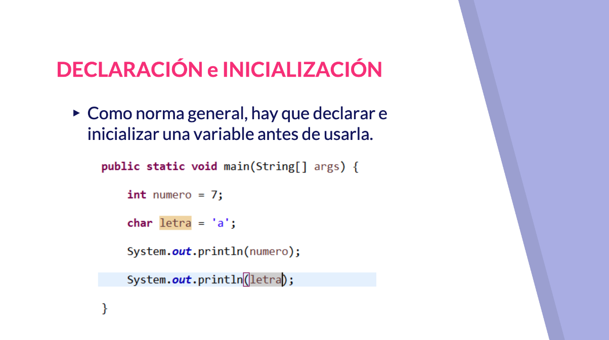
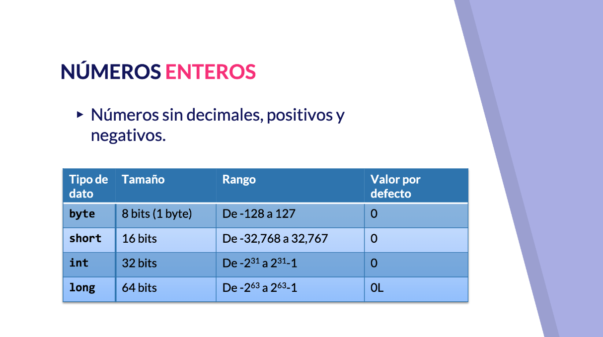
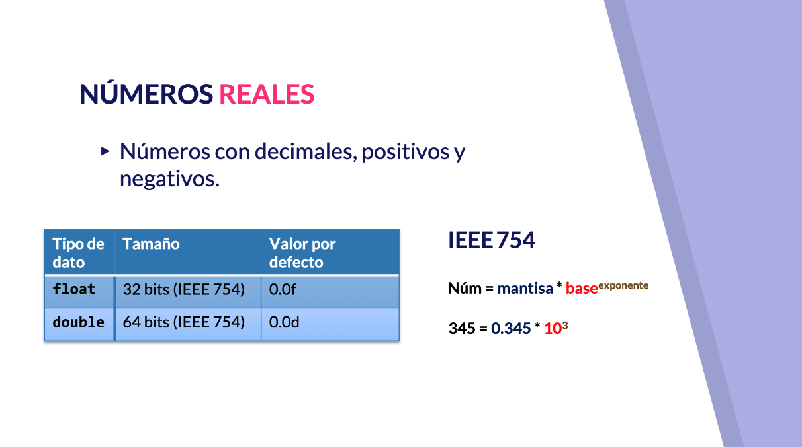
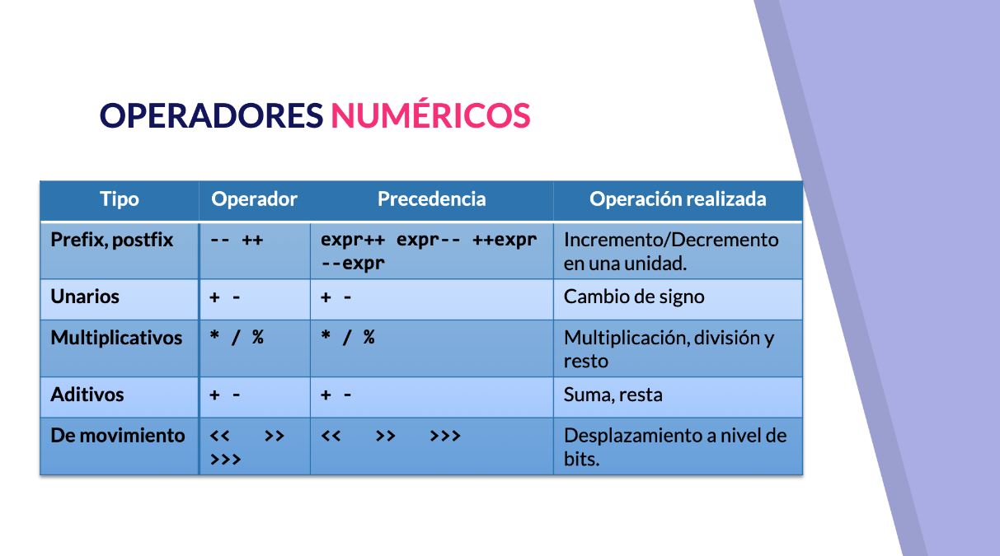
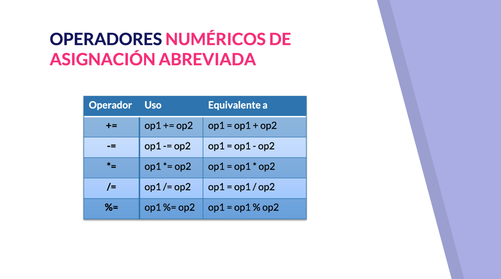
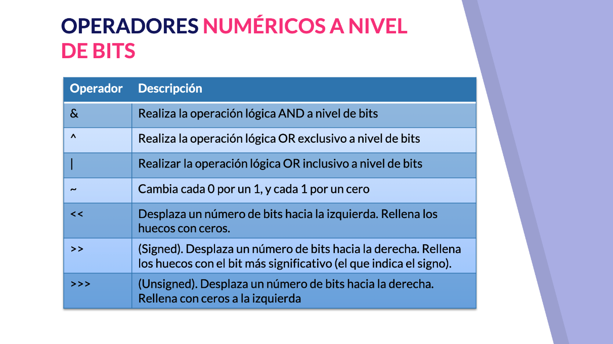
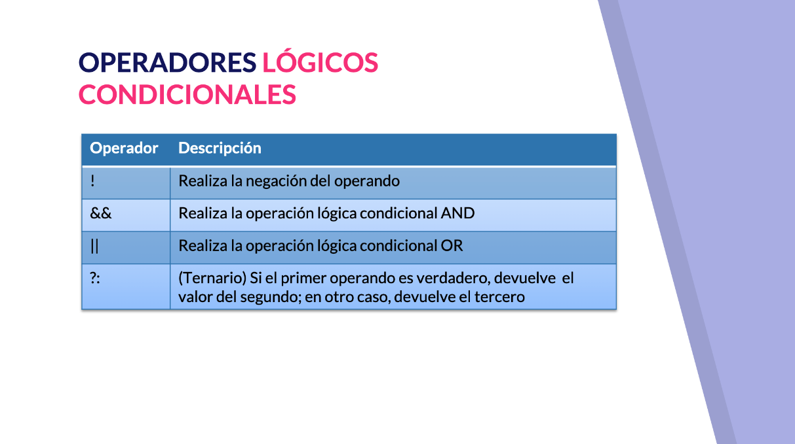

# 2. Tipos de datos, operadores y estructuras de control 110m

## Variables 16:58 

[Variables](pdfs/05_Variables.pdf)

### 5.1 Datos


Un dato es un registro de un hecho de la naturaleza, una idea, un objeto…. Podemos considerar como datos un número, una imagen, un sonido, un caracter, ….

### 5.2 Variable


En el mundo de la programación, una variable es la forma de almacenar en memoria un dato de un programa. Aunque como hemos visto, un dato puede representar un texto o una imagen, a nivel físico, estos se almacenan como 0 y 1.

Por tanto, podemos concluir que una variable será una región delimitada de memoria, a la que se le asigna un nombre y un tipo de dato.


### 5.2 Tipos de datos primitivos

Cualquier lenguaje de programación, Java incluido, ofrece una serie de tipos de datos primitivos, es decir, incorporados por el propio lenguaje y que siempre están disponibles para ser utilizados.


### 5.3 Declaración e inicialización de variables



Para poder usar una variable, previamente tenemos que haberla declarado. Es decir, tenemos que haber indicado que la vamos a usar. Para ello, basta con indicar el tipo de dato y el nombre de la variable:

```java
//Declaración e inicialización de dos variables
int numero = 7;        
char letra = 'a';

//Declaración e inicialización de una constante
final int NUM_HORAS = 8;
```

En muchas ocasiones, acompañaremos la declaración de la variable de su correspondiente inicialización; es decir, de la asignación de un valor inicial.

### 5.4 Como nombrar las variables


La tarea de dar un nombre a una variable no es sencilla, como iremos descubriendo poco a poco. Debemos seguir las suigientes reglas, que suele cumplir todo buen programador Java:

* El nombre debe ser autodescriptivo.

* El nombre de las variables es *case-sensitive*, es decir, sensible a mayúsculas y minúsculas.

* No se pueden usar espacios en blanco.

* Deben comenzar por una letra (también lo pueden hacer por los caracteres `$` o `_`, pero no es aconsejable).

* Se suele usar la notación camelCase, es decir, si el nombre de la variable está formado por más de una palabra, se escriben todas las palabras juntas en minúscula, a excepción de la letra inicial de la segunda, tercera, ...palabra, que irá en mayúsculas. Por ejemplo `numeroRuedas` o `descripcionDelTexto`.

Los valores constantes (declarados como `final`), se suelen escribir en mayúsculas, y separados por `_` si el nombre está formado por más de una palabra.

### 5.5 Vida (o ámbito) de una variable


Si bien ya hablaremos sobre este concepto más adelante, podemos indicar ya que las variables tienen un ámbito, es decir, un período de vida. Como norma general, el ámbito de una variable es el bloque donde ha sido definida la misma.

## Manipulación de números, caracteres y otros valores I 8:28 

[Manipulación de números, caracteres y otros valores](pdfs/06_Manipulación_de_numeros_caracteres_y_otros_valores.pdf)

### 6.1 Tipos de datos primitivos en Java

                     

Son solamente 8: `boolean, char, byte, short, int, long, float, double`. A estos, se suele añadir el objeto `java.lang.String`, ya que es muy usual.

### 6.1.1 Valores literales


Un valor literal es la representación de un valor fijo, que se escribe directamente en el código:

```java
boolean resultado = true;

int i = 100000;

String str = "CADENA";
```


Desde Java SE 7, se puede usar el guión bajo `_` para delimitar partes en un literal, sin que java lo procese:

```java
long creditCardNumber = 1234_5678_9012_3456L;
```

### 6.1.2 Operadores de asignación


El principal operador de asignación en java es`=`, y nos permite establecer el valor de una variable.

## Manipulación de números, caracteres y otros valores II 15:39

[Manipulación de números, caracteres y otros valores](pdfs/06_Manipulación_de_numeros_caracteres_y_otros_valores.pdf)

### 6.2 Tipos de datos numéricos


#### 6.2.1 Tipos de datos enteros



Para manejar números enteros, tenemos 4 tipos de datos primitivos:

* `byte`: ocupa 8 bits, y su rango es de -128 a 127
* `short`: ocupa 16 bits, y su rango es de -32768 a 32767
* `int`: ocupa 32 bits, y su rango es de -2^31 a (2^31)-1
* `long`: ocupa 64 bits, y su rango es de -2^63 a (2^63)-1

#### 6.2.2 Tipos de datos reales



Ambos tipos numéricos se representan mediante la notación IEEE 754, en la que se descompone un número en su mantisa, base y exponente.

* `float`: ocupa 32 bits
* `double`: ocupa 64 bits

#### 6.2.3 Operadores numéricos



Java es muy rico en cuanto a operadores se refiere:

* `--expr`, `++expr, `expr--, `expr++`: pre y post incremento y decremento.
* `+`, `-`: cambio de signo a positivo o negativo.
* `*`, `/`, `%`: multiplicación, división y resto.
* `+`, `-`: suma, resta.
* `<<`, `>>`, `>>>`: desplazamiento a nivel de bits.

#### 6.2.4 Operadores numéricos de asignación abreviada



Estos son operadores que nos permiten asignar el valor de una variable al primer operando. Por ejemplo:

```java
val1 += 1; //Es equivalente a val1 = val1 + 1;
```

Los operadores son `+=`, `-=`, `*=`, `/=` y `%=`.

## Manipulación de números, caracteres y otros valores III 8:13 

[Manipulación de números, caracteres y otros valores](pdfs/06_Manipulación_de_numeros_caracteres_y_otros_valores.pdf)

#### 6.2.5 Operadores numéricos a nivel de bits



Estos son los menos usuales de todos, pero los presentamos también por si en alguna ocasión fueran necesarios:

* `&`: operación AND a nivel de bits.
* `^`: operación OR exclusivo a nivel de bits (en este tipo de OR, el resultado de 1 OR 1 es 0).
* `|`: operación OR inclusivo a nivel de bits (en este tipo de OR, el resultado de 1 OR 1 es 1).
* `~`: cambia cada cero por un uno y cada uno por un cero.
* `<<`: desplaza un número de bits hacia la izquierda. Rellena los huecos con ceros.
* `>>>`: desplaza un número de bits hacia la derecha. Rellena los huecos con ceros.
* `>>`: desplaza un número de bits hacia la derecha. Rellena los huecos con el bit más significativo (el de signo).

## Manipulación de números, caracteres y otros valores IV 15:52 

[Manipulación de números, caracteres y otros valores](pdfs/06_Manipulación_de_numeros_caracteres_y_otros_valores.pdf)

### 6.3 Tipos de datos lógicos o booleanos


Nos permite almacenar valores susceptibles de ser verdadero o falso (`true`, `false`).


#### 6.3.1 Operadores lógicos condicionales



* `!`: realiza la negación del valor.
* `&&`: realiza un AND condicional de los dos operandos.
* `||`: realiza un OR condicional de los dos operandos.
* `?` :: Si el primer operando es verdadero, devuelve el valor del segundo; en otro caso, devuelve el tercero.

#### 6.3.2 Operadores lógicos relacionales


* `==`: devuelve verdadero si ambos valores son verdaderos
* `!=`: devuelve el valor inverso a ==
* `>`: devuelve verdadero si el valor de la izquierda es mayor estricto que el de la derecha.
* `>=`: devuelve verdadero si el valor de la izquierda es mayor o igual que el de la derecha.
* `<`: devuelve verdadero si el valor de la izquierda es menor estricto que el de la derecha.
* `<=`: devuelve verdadero si el valor de la izquierda es menor o igual que el de la derecha.

### 6.4 Tipos de datos para caracteres


Como tipo de dato primitivo para el manejo de caracteres, Java solamente nos ofrece `char`, el cual nos permite almacenar un solo caracter (letra, signo de puntuación, …).

```java
char = 'a';
```

Por si solo, este tipo de dato no nos permite mucho *juego*.

Sin embargo, Java nos ofrece una clase, `java.lang.String`, con la que manejar facilmente cadenas de caracteres. La incluimos en este apartado, aunque sea un tipo de dato estructurado ya que se puede obtener directamente desde un literal:

```java
String str = "Cadena de caracteres";
```

#### 6.4.1 Operadores con cadenas de caracteres


El principal operador para cadenas de caracteres es `+`, que nos permite concatenar dos textos, es decir, *poner* el segundo tras el primero.

### 6.5 Castings o transformaciones explícitas de tipos


En ocasiones, nos puede interesar realizar un cambio explicito de un tipo de dato.

```java
System.out.println(5/9);
```

Este código produce como salida un 0, porque está haciendo la división entera. Si queremos obtener el resultado con decimales, podemos cambiar el tipo de dato explícitamente, pero para esa operación.

```java
System.out.println((double)5/9);
```

En este caso, el resultado será 0.55555555556

## Estructura de decisión 21:22 

[Estructura de decisión](pdfs/07_Estructuras_de_decisión.pdf)

### 7.1 Repaso sobre sentencias, bloques y expresiones

En el capítulo 4 veíamos que podíamos asemejar una sentencia a una *línea de código*, y un bloque a una agrupación de sentencias con una determinada misión. Repasemos esos conceptos y, vistos los capítulos 5 y 6, conzcamos mejor el de expresión.

#### 7.1.1 Expresión

Se trata de una construcción hecha con variables, operadores y llamadas a funciones, que sigue la sintaxis del lenguaje, y que se evalúa produciendo un solo valor.

Sin saberlo, ya hemos trabajado con algunas expresiones:

```java
int numero = 0;
numero = 1 + 2;
```

Java permite construir expresiones de mayor tamaño componiendo algunas de menor tamaño:

```java
numero = 1 + 2 * 3;
```

Sin embargo, en casos como estos debemos tener cuidado con la posible ambigüedad y usar paréntesis para aclarar como se va a evaluar la expresión

```java
numero = (1 + 2) * 3;
```

#### 7.1.2 Sentencia

Tras conocer una expresión, podemos decir que una sentencia es una expresión que termina en `;`

#### 7.1.3 Bloque de código

Un bloque será un grupo de cero o más sentencias, delimitadas por un `{ }`. Por ejemplo:

```java
class BlockDemo {
     public static void main(String[] args) {
          boolean condicion = true;
          if (condicion) { // inicio del bloque 1
               System.out.println("La condición es verdadera");
          } // final del bloque 1
          else { // inicio del bloque 2
               System.out.println("La condición es falsa.");
          } // final del bloque 2
     }
}
```

### 7.2 Estructuras de decisión

#### 7.2.1 Estructura `if-then`

Permite evaluar una expresión como verdadera o falsa, y ejecutar en caso de que sea verdadera un bloque de código

```java
int num1 = 3, num2 = 4;

if (num1 > num2) {
   System.out.println("num1 es mayor que num2");
}

System.out.println("Este mensaje se imprime siempre");
```

#### 7.2.2 Estructura `if-else`

Permite evaluar una expresión como verdadera o falsa; si el valor es verdadero se ejecuta un bloque de código, y si es falso, se ejecuta otro diferente:

```java
if (puntuacion >= 9) {
   System.out.println("Tienes un SOBRESALIENTE");
} else if (puntuacion >= 7) {
   System.out.println("Tienes un NOTABLE");
} else if (puntuacion >= 5) {
   System.out.println("Tienes un APROBADO");
} else {
   System.out.println("Estás SUSPENSO. Lo siento");
}
```

#### 7.2.3 Estructura `switch`

Permite evaluar si una expresión se corresponde con alguno de los valores de una serie de casos. Se puede usar con valores `byte`, `short`, `char`, `int` y `String`, entre otros. También existe la posibilidad de tener un caso por defecto (parecido a `else`).

```java
switch (mes) {
   case 1:  mesString = "Enero";
      break;
   case 2:  mesString = "Febrero";
      break;
   case 3:  mesString = "Marzo";
      break;
   case 4:  mesString = "Abril";
      break;
   case 5:  mesString = "Mayo";
      break;
   case 6:  mesString = "Junio";
      break;
   case 7:  mesString = "Julio";
      break;
   case 8:  mesString = "Agosto";
      break;
   case 9:  mesString = "Septiembre";
      break;
   case 10: mesString = "Octubre";
      break;
   case 11: mesString = "Noviembre";
      break;
   case 12: mesString = "Diciembre";
      break;
   default: mesString = "Mes no válido";
      break;
}
```

## Estructura de repetición 13:01 

[Estructura de repetición](pdfs/08_Estructuras_de_repeticion.pdf)

### 8.1 Bucle `while`

Nos permite repetir la ejecución de un bloque de sentencias. La repetición se realiza durante un número indeterminado de veces, mientras una expresión sea cierta. Una de las sentencias del cuerpo del bucle debe modificar alguna de las variables de la condición, para que, en alguna ocasión, la expresión sea falsa.

```java
while (condicion) {
   ...
   ...      
}
```  

### 8.2 Bucle `do-while`

Nos permite repetir la ejecución de un bloque de sentencias. La condición, a diferencia de la estructura while, se evalúa al final del bucle. El cuerpo del bucle se ejecuta siempre, al menos, una vez.

```java
do {
   ...
   ...      
} while (condicion);
```

### 8.3 Bucle `for`

Nos permite repetir un bloque de código un número conocido a priori de veces. Suele ser el más utilizado de los 3. Se podría implementar un bucle for con un while. Cuando trabajemos con colecciones o arrays, podremos usar su variante llamada *for-each*.

```java
for(declaracion; condicion; incremento) {
   ...
}
```    

### 8.4 Sentencias `break` y `continue`

Existen dos sentencias especiales, que no suelen usarse mucho ya que producen posibles caminos de ejecución *raros*, que son `break` y `continue`:

* `break`: permite finalizar la ejecución de un bucle, independientemente de si se cumple la condición de finalización del mismo.

* `continue`: permite finalizar la ejecución de la iteración actual de un bucle, pasando automáticamente a la siguiente iteración del mismo.

Su uso no es demasiado recomendable, ya que puede producir un efecto conocido como código spaguetti, por el cual es dificil predecir los caminos de ejecución del mismo.

## Práctica: Creando una calculadora 11:13 

En esta sesión práctica veremos como crear una calculadora, tienes el código de ejemplo en el [repositorio de GitHub](https://github.com/OpenWebinarsNet/Curso-Java-desde-0).

## Contenido adicional  4

[Variables](pdfs/05_Variables.pdf)

[Manipulación de números, caracteres y otros valores](pdfs/06_Manipulación_de_numeros_caracteres_y_otros_valores.pdf)

[Estructura de decisión](pdfs/07_Estructuras_de_decisión.pdf)

[Estructura de repetición](pdfs/08_Estructuras_de_repeticion.pdf)
