# 2. Tipos de datos, operadores y estructuras de control 110m

   * 05 Variables 16:58 
   * 06 Manipulación de números, caracteres y otros valores I 8:28 
   * 06 Manipulación de números, caracteres y otros valores II 15:39 
   * 06 Manipulación de números, caracteres y otros valores III 8:13 
   * 06 Manipulación de números, caracteres y otros valores IV 15:52 
   * 07 Estructura de decisión 21:22 
   * 08 Estructura de repetición 13:01 
   * 09 Práctica: Creando una calculadora 11:13 
   * Contenido adicional  7

# 05. Variables 16:58 

[Variables](pdfs/05_Variables.pdf)

## Resumen Profesor

### 5.1 Datos

Un dato es un registro de un hecho de la naturaleza, una idea, un objeto…. Podemos considerar como datos un número, una imagen, un sonido, un caracter, ....

### 5.2 Variable

En el mundo de la programación, una variable es la forma de almacenar en memoria un dato de un programa. Aunque como hemos visto, un dato puede representar un texto o una imagen, a nivel físico, estos se almacenan como 0 y 1.

Por tanto, podemos concluir que una variable será una región delimitada de memoria, a la que se le asigna un nombre y un tipo de dato.

### 5.2 Tipos de datos primitivos

Cualquier lenguaje de programación, Java incluido, ofrece una serie de tipos de datos primitivos, es decir, incorporados por el propio lenguaje y que siempre están disponibles para ser utilizados.


### 5.3 Declaración e inicialización de variables

Para poder usar una variable, previamente tenemos que haberla declarado. Es decir, tenemos que haber indicado que la vamos a usar. Para ello, basta con indicar el tipo de dato y el nombre de la variable:

```java
//Declaración e inicialización de dos variables
int numero = 7;        
char letra = 'a';

//Declaración e inicialización de una constante
final int NUM_HORAS = 8;
```

En muchas ocasiones, acompañaremos la declaración de la variable de su correspondiente inicialización; es decir, de la asignación de un valor inicial.

### 5.4 Como nombrar las variables

La tarea de dar un nombre a una variable no es sencilla, como iremos descubriendo poco a poco. Debemos seguir las suigientes reglas, que suele cumplir todo buen programador Java:

* El nombre debe ser autodescriptivo.

* El nombre de las variables es *case-sensitive*, es decir, sensible a mayúsculas y minúsculas.

* No se pueden usar espacios en blanco.

* Deben comenzar por una letra (también lo pueden hacer por los caracteres `$` o `_`, pero no es aconsejable).

* Se suele usar la notación camelCase, es decir, si el nombre de la variable está formado por más de una palabra, se escriben todas las palabras juntas en minúscula, a excepción de la letra inicial de la segunda, tercera, ...palabra, que irá en mayúsculas. Por ejemplo `numeroRuedas` o `descripcionDelTexto`.

Los valores constantes (declarados como `final`), se suelen escribir en mayúsculas, y separados por `_` si el nombre está formado por más de una palabra.

### 5.5 Vida (o ámbito) de una variable

Si bien ya hablaremos sobre este concepto más adelante, podemos indicar ya que las variables tienen un ámbito, es decir, un período de vida. Como norma general, el ámbito de una variable es el bloque donde ha sido definida la misma.

## Transcripción


A lo largo de esta lección y la siguiente vamos a hablar de variable y de tipo de dato en particular de los **tipos de datos** que se llaman o se conocen como **primitivos**.


Antes de hablar de tipos de datos primitivos tenemos que hablar de datos y es que los programas de ordenador están hechos sobre todo para manejarlo y que eso de un dato, un dato no es más que una forma de registrar un hecho de la naturaleza, un objeto, una idea y puede representar tanto la temperatura que hace hoy en la calle, la última canción que hemos escuchado en Spotify, el último email que hemos recibido. 

Los datos normalmente se representan como símbolos, la temperatura no dará un indicador de nuestro cuerpo si tenemos frío, si estamos sudando, pero al final la representamos mediante un símbolo que puede llegar a ser un número y algún otro símbolo como Celsius, Fahrenheit, Kelvin. Nosotros representamos los datos en función podríamos decir del tipo que tienen, no representamos igual una imagen, que un número, que un sonido o qué un carácter o una serie de caracteres.


La manera que tenemos de tratar datos dentro de un programa de ordenador, en particular de un programa Java es haciendo uso de **variables**, una variable no va a ser más que una manera de almacenar un dato en un programa, cómo norma general nosotros cuando trabajemos con datos, con variable lo que hará nuestro programa será almacenarlo en una parte de la memoria RAM del ordenador con lo cual a nivel físico todo lo que hemos visto antes imagen, número, caracteres, sonido, vídeo cualquier cosa se va acabar almacenando a nivel físico como 0 y 1, en el lenguaje físico de la memoria, si bien nosotros vamos a poder trabajar en Java de una manera más cómoda  con una serie de tipo de dato primitivos que vamos a aprender a caballo entre esta lección y la siguiente.

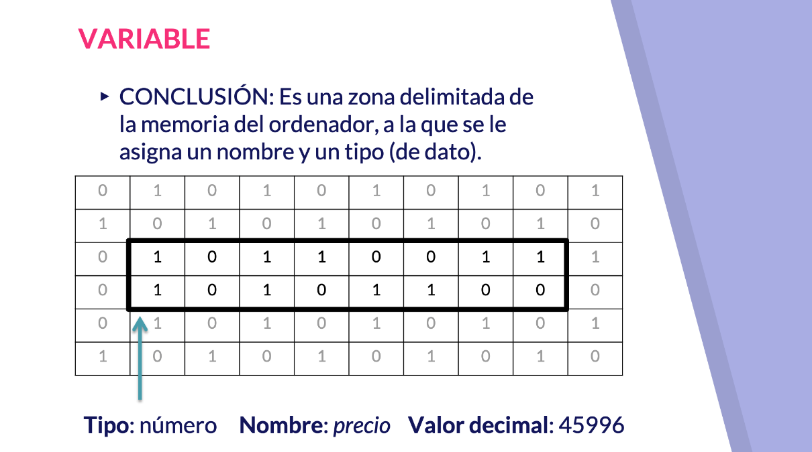

Cómo podemos comprobar el manejo de una variable en Java no es más que manejar una zona delimitada de la memoria de ordenador, es decir un conjunto de 1 y 0 si bien nosotros no vamos a ser capaces de ver esto nunca y es el lenguaje realiza un proceso podríamos decir de abstracción nos abstrae de estos detalles concretos y bien nosotros solamente trabajaremos con lo que tenemos abajo no, es decir con que esta región de la memoria RAM de de nuestro ordenador, no es más que un número o mejor dicho su contenido representa un número, podríamos llamar precio ya veremos que las variables tienes un nombre y al ser un número podría tener un valor representado en base 10 en decimal, que podría ser el precio de un coche 45996, el precio de un buen coche. 


Cómo podemos comprobar las variable tienen siempre asociado un tipo y es que Java es un lenguaje de los conocidos como fuertemente tipado, es decir que toda variable va a llevar siempre asociado un tipo. Las diferencias entre dos tipos de datos que se pueden ver claramente en este árbol y son los **tipos de datos primitivos**, es decir unos tipos de datos que ya nos proporciona el lenguaje de programación para que nosotros lo podamos utilizar directamente y los **tipos de dato estructurado** que lo iremos viendo más adelante que los podremos construir sobre todo a través de **clases** y **objetos**. Dentro de los tipos primitivos tenemos los **tipos numéricos**, los **tipos alfanuméricos** y los **tipos lógicos o boleanos**. Para los tipos numéricos veremos como Java nos ofrece lo suficiente para manejar números enteros de diferentes maneras y números reales, para los tipos alfanuméricos Java no ofrece la posibilidad de trabajar con **caracteres sueltos**, con letra sueltas y también la forma de trabajar con **cadenas de caracteres**, es decir con asociaciones de caracteres y también tendremos la posibilidad de trabajar con los conocidos **tipos lógicos o Boolean** que básicamente nos permitirán decir si dicha variable es verdadera o es falsa, los conocemos a nivel concreto en la siguiente lección.


Si me gustaría ahora que nos centraremos en cómo *declarar* y cómo *inicializar* una variable y es que cómo norma general para que podamos utilizar una variable tenemos que hacer ante una operación que se llama **declaración** es decir expresamente que *va a haber una región de memoria que vamos a utilizar con un tipo concreto y con un contenido concreto y además asociarle un nombre a este proceso se le llama **declaración***, *asignarle un valor inicial se le llama **inicializacion*** y lo normal es que antes de que nosotros utilicemos una variable por ejemplo para imprimir por consola su contenido la declaremos como es natural porque si no ya podremos comprobar como el entorno de desarrollo se va a quejar y si lo compilamos en nuestro fichero de una manera suelta el compilador también se quejaría de qué estamos intentando utilizar una variable desconocida y por supuesto también tendremos que proporcionar un valor, ya veremos como Eclipse nos va dando ayudas y si se nos olvida algún paso cómo inicializar una variable antes de utilizarla, le tendremos que dar un valor inicial para que la podamos usar con ciertas garantías, en este ejemplo tenemos dos variables un número entero y otra una letra que estamos declarando y posteriormente inicializando, lo hacemos todo en una línea aunque realmente son dos pasos diferentes, si nos damos cuenta cada variable tiene un nombre y el proceso de nombrar una variable que a priori puede resultar sencillo, en proyectos que no tienen porqué ser de una gran envergadura puede llegar a ser algo tedioso y podemos optar por usar nombre de variable que cuando volvamos al visitar nuestro código días o semanas después con no nos digas nada y es que **la primera premisa a la hora de nombrar una variable es que el nombre tiene que ser autodescriptivo**, es decir el nombre de una variable nos tiene que dar cierta información a ser posible toda, sobre para qué se utiliza y el contenido que va a tener, si pensamos en el que estábamos utilizando antes, las variables número o letra ya nos van informando, no solamente del tipo que tiene sino de a que podemos orientar su uso, para qué tipo de operaciones las podemos usar.

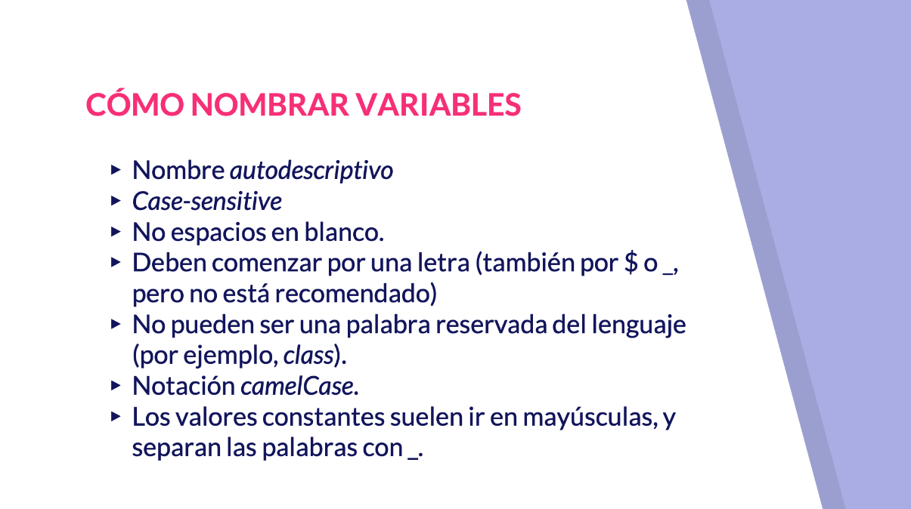

Además el nombre de las variables como pasa con el con el resto de los elementos del lenguaje es *Case-Sensitive* es decir su nombre es sensible a mayúsculas y a minúscula, no es lo mismo que utilizamos `NUMERO` que `numero`, que `Numero` no va a ser igual, con lo cual debemos de tener cuidado, en ese sentido yo recomiendo que utilicéis como digo más abajo en esta transparencia la notación *camelCase*, es una notación especial que nos va a permitir para aquellas variables, para las cuales utilizan en su nombre varias palabras, como no vamos a poder utilizar espacios lo que haremos será eliminar los espacios en blanco entre esas palabras pero para poder leerlos fácilmente podremos la primera letra de cada palabra en mayúscula, a esta notación se le llama *camelCase*. A la hora de escribir el nombre de una variable yo recomiendo que empiecen siempre siempre siempre por una letra, Java permite también utilizar algunos caracteres como el dólar `$` o el guíon bajo `_`, yo no lo recomiendo, el propio Oracle si leen la documentación oficial de Java no recomienda su utilización. Tampoco podemos utilizar alguna palabra reservada, las iremos aprendiendo poco a poco por ejemplo la palabra `class` hemos visto antes que se utiliza, no podríamos utilizarla como nombre de una variable. Existen también un grupo de variables especiales cuyo valor no va a a cambiar nunca tras su inicialización que se llaman **constantes** por ejemoplo si tuvieramos que utilizar el valor de PI en algún tipo de programa que calculara un área el vallor de esa constante no va a variar, por diferenciarla un poco de las variables, las constantes si se suelen escribir en mayúsculas y si incluyen varias palabras en lugar la notación *camelCase* como ya lo estamos escribiendo todo en mayúsculas si nos recomiendan el que separtemos las palabras mediante `_`. 


Por último antes de pasar a ver un ejemplo hablar que el **ámbito de una variable**, el ámbito se circunscribe al bloque donde, como norma general aunque veremos que esto se puede transgredir, el ámbito es el bloque en el que la hemos escrito, es decir si declaramos la variable número y la variable letras dentro del método main en cuanto finalice la ejecución de este método ya no tendríamos la posibilidad de acceder a la a la variable número y a la variable letra porque ya estaríamos fuera de su ámbito.

### :computer: `101-05-Declaracion_de_Variables_y_Constantes`

Aquí tenemos el pequeño ejemplo que hemos ido viendo, incluyendo también la declaración e inicializacion de una constante, por ejemplo el número de horas que suele incluir una jornada laboral normal suelen ser de 8 y bien ese número no suele variar si el valor va a ser constante, el nombre se suele declarar en mayúscula y utilizando guiones bajos, además para forzar que este valor se constante y que no se pueda modificar después utilizaríamos esta palabra `final` de la cual aprenderemos algo más adelante en este curso. Como podéis comprobar podemos declarar diferentes tipos de variables, podemos declarar variables en cualquier punto del programa, es decir no tenemos que hacerlo como en otros lenguajes de programación que nos fueza hacerlo siempre en las primeras líneas, tenemos una variable con nombre en notación camelCase en la que en lugar de escribir esto con espacio lo cual sería un error, o escribirlo todo en mayúscula que ya digo que se recomienda con el uso de constantes, utilizamos una notación en la que si utilizamos dos o más palabras, eliminamos los espacios en blanco intermedios, lo escribimos todo en minúsculas salvo la primera letra de cada palabra, si fueran muchas más palabras lo escribiríamos de esta manera `otroNumeroMasQueEscribimosEnNotacionCamelCase`, podríamos dar un valor inicial y pasaríamos por ejemplo a imprimirlo por consola que es de las cosas que sabemos hacer.

Si os dais cuenta el IDE nos va ayudando y nos va diciendo algunos mensajes los que están subrayados en rojo normalmente, siempre y cuando no sean comentarios, son errores que también se van a destacar a la derecha mediante un recuadro y lo que viene subrayado en amarillo son advertencias, no son errores pero son líneas que deberíamos vigilar porque es posible que pase algo raro en ellas, en particular está nos está indicando que el valor de esta variable, qué es local al ámbito de este método, no se usa nunca, esto es muy posible que nos pase cuando empecemos a desarrollar un código y empecemos a declarar variables qué en la versión final del código quiza no usemos todas, nos puede servir para eliminar código ineccesario y no nos quede emborronado. Para el método `println` qué es el que imprimir por consola tenemos un atajo de teclado escribimos `Syso` y le damos a 
`Ctrl+Espacio` el propio Eclipse general el resto del método para que nosotros podamos escribir. También tiene autocompletado con el nombre de variables, si nosotros escribimos `otro` y no hay nada más que se llame `otro` y le damos a las teclas `Ctrl+Espacio`, completaría con el nombre de la variable que hemos creado.

*Variables.java*

```java
package variables;

/**
 * @author 
 *
 */
public class Variables {

   /**
    * @param args
    */
   public static void main(String[] args) {
		
      //Declaración e inicialización de dos variables
      int numero = 7;		
      char letra = 'a';		
		
      //Declaración e inicialización de una constante
      final int NUM_HORAS = 8;	
		
      //Impresión por consola de los 3 valores
      System.out.println(numero);
		
      System.out.println(letra);
		
      System.out.println(NUM_HORAS);
		
      int otroNumeroMasQueEscribimosEnNotacionCamelCase = 1;
		
      System.out.println(otroNumeroMasQueEscribimosEnNotacionCamelCase);

   }
}


SALIDA:

7
a
8
1
```


En el próxima lección vamos a aprender los diferentes tipos que hay los numéricos, los de caracteres y los booleanos y como manejarlos.  

# 6. Manipulación de números, caracteres y otros valores I 8:28 

[Manipulación de números, caracteres y otros valores](pdfs/06_Manipulación_de_numeros_caracteres_y_otros_valores.pdf)

## Resumen Profesor

### 6.1 Tipos de datos primitivos en Java                   

Son solamente 8: `boolean, char, byte, short, int, long, float, double`. A estos, se suele añadir el objeto `java.lang.String`, ya que es muy usual.

### 6.1.1 Valores literales

Un valor literal es la representación de un valor fijo, que se escribe directamente en el código:

```java
boolean resultado = true;

int i = 100000;

String str = "CADENA";
```

Desde Java SE 7, se puede usar el guión bajo `_` para delimitar partes en un literal, sin que java lo procese:

```java
long creditCardNumber = 1234_5678_9012_3456L;
```

### 6.1.2 Operadores de asignación

El principal operador de asignación en java es `=`, y nos permite establecer el valor de una variable.

## Transcripción

 

En este segundo capítulo en el que hablaremos de variables vamos a ver cómo manipular los diferentes tipos de datos primitivos que son los números, los caracteres y los valores Booleanos, lo que hemos llamado como otro valores.

  

Java nos ofrece una serie de tipos primitivos que nos van a permitir manejar diferentes situaciones y que los vamos a ir conociendo por diferentes grupos, aquí tenemos una visión de conjunto. Para manejar los tipos lógicos solamente tendremos un tipo de dato que es el `boolean` cuyos valores pueden ser solo `true` o `false`, para manejar caracteres, caracteres sueltos de codificación Unicode tendremos el tipo `char` si viene adicionalmente tenemos la posibilidad de usar cadenas de caracteres mediante `String` que ya es un tipo estructurado si bien veremos cómo Java en algunos momentos también le da una cierta similitud a un tipo básico y luego para los tipos numéricos tenemos un conjunto más rico que nos permite diferenciar entre números que no tienen decimales, número enteros positivo y negativo y los números que si tienen decimales y veremos cómo podemos manejarlos.

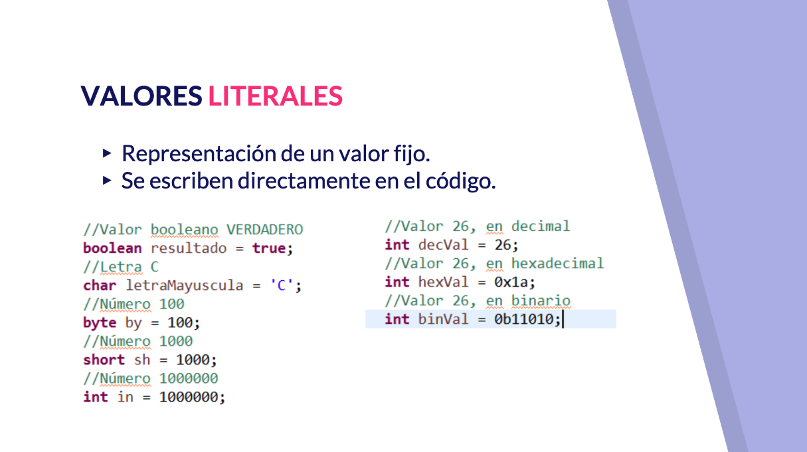

Pero antes de usar los diferentes tipos vamos a hablar de lo que se conocen como los **valores literales**, opuestamente al uso de una variable que no es mas que una región de memoria cuyo contenido cuyo valor podía variar a lo largo de la ejecución de nuestro programa, tenemos los valores que son literales, es decir valores cuyo valor se escribe directamente en el código. Aquí tenemos una serie de declaraciones e inicializaciones de diferentes tipos de primitivos de variables y la inicialización tiene como particular que siempre se realiza a partir de un valor literal para que podamos ver e ilustrar el uso de estos literarales, como podemos comprobar podemos utilizar un valor literal para dar de alta una variable booleana, los valores `true` o `false` nos permitirán inicializar variable y comprobar el valor de otras expresiones. Podemos también utilizar literales para inicializar variable de tipo carácter, podemos comprobar como los literales de carácter siempre tienen que ir encerrado no entre `''` no comillas dobles sino comillas simples. Los tipos numéricos los valores literales en la mayoría de las ocasiones nos valdra directamente representar el valor del número, el valor de tipo `byte`, `short`, `int` nos bastara simplemente con escribir el número, si bien Java nos permite también el uso de valores enteros, pero en diferentes sistemas de codificación que no sean solamente el decimal, podemos utilizar número en base 10 sistema de numeración normal, aunque también podemos utilizarlo en hexadecimal o en binario, dependiendo del cometido de nuestro programa es posible que nos sea útil el utilizar esos números en binarios o en hexadecimal, si queremos declarar el valor literal en hexadecimal lo que haremos será comenzar ese literal por `0x` y a continuación podríamos poner el valor, para aquellos que no caen en la numeración de base 16 en hexadecimal utilizan los números del 0 al 9 y para completar los símbolos del resto de valores utilizan letras de la A hasta la F, si queremos declararlo en binario donde solamente podemos utilizar 0 y 1 el literal comenzaría por `0b` y a partir de ahí ese número es binario. Hexadecimal, binario y decimal siguen siendo números enteros pero Java nos permite Java utilizar estos literales que nos van a hacer la vida un poco más cómoda.

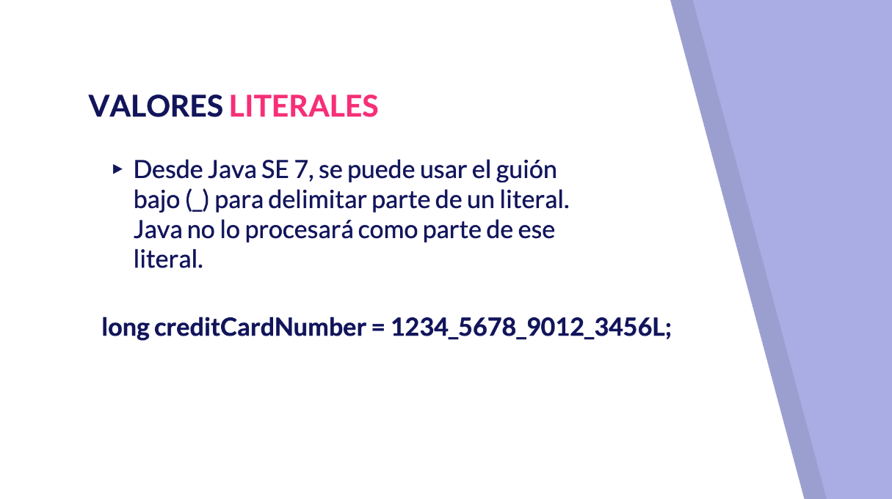

Desde la versión de Java SE 7 podemos utilizar guiones bajos para delimitar partes de un literal que visualmente nos podrán ser utiles qun que Java no procesara esos guiones bajos como parte del literal y tenemos el ejemplo de el número de una tarjeta de crédito que normalmente son 16 dígitos agrupados de 4 en 4, lo normal hasta la versión de Java 6, incluso en otros lenguajes de programación es que nosotros tuviéramos que escribir, aunque en la tarjeta venga representados en grupos de 4, los tuviéramos que escribir los 16 dígitos seguidos sin qué visualmente eso no ayudará mucho a identificarlos de 4 en 4. Java nos permite desde la versión SE7 el que podamos delimitarlo mediante estos guiones bajos sin necesidad de que esto haga que este literal se transforme en algo que no sea un número, si decir aunque lo iremos viendo poco a poco, que los literales de tipo `long`, veremos cuál es el tipo de dato numérico ahora, sí suelen ir acompañados del sufijo `L` para que nosotros le podamos decir a nuestro compilador, a nuestra máquinas de Java después que ese número está representando un entero de tipo `long` y no de otro tipo de menor precisión.


Antes de meternos en el meoyo de los tipos de datos numéricos en este caso algo que ha podido pasar desapercibido es el **operador de asignación**, es decir el símbolo que nos sirve para inicializar o asignar un valor a una variable, que en el caso de Java es el símbolo de igual `=` y de hecho nos permite delimitar en la sentencia de inicializacion dos zonas muy claras, lo que queda a la izquierda del operador de asignación y lo que queda a la derecha del operador de asignación, en el en el proceso de inicialización de una variable lo que debemos marcar a la izquierda del operador de asignación es como mínimo el nombre de una variable que hayamos declarado más arriba, si además de inicializar estamos declarandolo entonces tendremos que encontrar como todos los ejemplos de esta transparencia el tipo de dato y el nombre de la variable, es decir la operación de declaración de esa variable, a la derecha del operador de asignación encontraremos el valor, en este caso para inicializar con el cual estamos inicializando esa variable.

### :computer: `101-06-Tipos_de_Datos`

Si queremos ver algunos elementos de los que hemos visto tenemos el siguiente código, podemos ver como tenemos diferentes literales, asignados a diferentes tipos de variables como son los literales `boolean`, `char`, `byte` veremos también cuando trabajemos con los tipos de datos carácter en esta lección como los literales de cadena de caracteres se representan entre comillas doble y ya los hemos usado antes, lo deberíamos asignar a una cadena de caracteres de tipo `String` que hemos presentado antes someramente y que veremos más adelante.

*`TiposDatosNumericos`*

```java
package tiposdatos;

@SuppressWarnings("all")
public class TiposDatosNumericos {

   /**
    * @param args
    */
   public static void main(String[] args) {
		
      /*
       * LITERALES
       */
		
      //Valor booleano VERDADERO
      boolean resultado = true;
      //Letra C
      char letraMayuscula = 'C';
      //Número 100
      byte by = 100;
      //Número 1000
      short sh = 1000;
      //Número 1000000
      int in = 1000000;
		
      //Valor 26, en decimal
      int decVal = 26;
      //Valor 26, en hexadecimal
      int hexVal = 0x1a;
      //Valor 26, en binario
      int binVal = 0b11010;
		
      //String s = "Hola Mundo";
      
      ...
   }
}
```

# 06 Manipulación de números, caracteres y otros valores II 15:39

[Manipulación de números, caracteres y otros valores](pdfs/06_Manipulación_de_numeros_caracteres_y_otros_valores.pdf)

## Resumen Profesor

### 6.2 Tipos de datos numéricos

#### 6.2.1 Tipos de datos enteros

Para manejar números enteros, tenemos 4 tipos de datos primitivos:

* `byte`: ocupa 8 bits, y su rango es de -128 a 127
* `short`: ocupa 16 bits, y su rango es de -32768 a 32767
* `int`: ocupa 32 bits, y su rango es de -2^31 a (2^31)-1
* `long`: ocupa 64 bits, y su rango es de -2^63 a (2^63)-1

#### 6.2.2 Tipos de datos reales

Ambos tipos numéricos se representan mediante la notación IEEE 754, en la que se descompone un número en su mantisa, base y exponente.

* `float`: ocupa 32 bits
* `double`: ocupa 64 bits

#### 6.2.3 Operadores numéricos

Java es muy rico en cuanto a operadores se refiere:

* `--expr`, `++expr, `expr--, `expr++`: pre y post incremento y decremento.
* `+`, `-`: cambio de signo a positivo o negativo.
* `*`, `/`, `%`: multiplicación, división y resto.
* `+`, `-`: suma, resta.
* `<<`, `>>`, `>>>`: desplazamiento a nivel de bits.

#### 6.2.4 Operadores numéricos de asignación abreviada

Estos son operadores que nos permiten asignar el valor de una variable al primer operando. Por ejemplo:

```java
val1 += 1; //Es equivalente a val1 = val1 + 1;
```

Los operadores son `+=`, `-=`, `*=`, `/=` y `%=`.

## Transcripción


El primer tipo o conjunto de tipo de datos que vamos a conocer son los números y que se subdividen a su vez en números enteros y en números reales. 


Para los números enteros tenemos cuatro tipos de datos primitivos y la existencia de cuatro tipos de datos no es más que el hecho de que nos van a permitir almacenar números que sean más grandes o más pequeños, de esta manera podemos aprovechar mejor la memoria que estamos utilizando, si vemos la tabla y lo que queremos utilizar son números muy pequeños, es decir en el rango de -128 a 127 tendríamos el tipo de dato `byte`, es decir todos los valores que somos capaces de representar con un solo byte con 8 bits, en el caso de que queramos usar números en un rango un poco más amplio, números de -32768 y 32767 tendríamos el tipo `short`, el tipo de dato entero normal llamado `int` y que normalmente utiliza 32 bits y que normamente utiliza 4-bytes será normalmente el tipo de dato que usemos por defecto para manejar números enteros y su capacidad es relativamente grande, el valor -2 elevado a 31 es un número bastante grande y el número 2 elevado a 31 menos 1, aunque sea uno negativo y otro positivo son bastante grandes, nos permitirán manejar la gran mayoría de las operaciones que hagamos. Si necesitábamos un número entero que tuviera una capacidad mayor tenemos uno que permite manejar el doble de bits que permite manejar números de hasta 64 bits y por lo cual su rango pasa a ser enorme de -2 elevado a 63 a 2 elevado a 63 -1 y sería el tipo `long`.

Como decíamos antes **los valores por defecto de estas variable de este tipo numéricos son siempre 0** pero en particular para el `long` tendríamos que añadirle una L minúscula o mayúscula `OL` para indicar que ese valor literal es de tipo `long` y no es de uno de los tipos anteriores especialmente del tipo `String`.


Paralelamente a los número entero que son números negativos y positivos pero siempre sin decimales tenemos los **números reales** que son números que nos permiten manejar decimales y Java nos ofrece dos tipos de precisión, precisión sencilla y precisión doble que son los números de tipo `float` y los números de tipo `double` ambos dos están representados mediante un sistema de codificación que se llama el **IEEE 754** en el cual la representación de un números reales en notación IEEE 754 se descomponen para almacenarse mediante tres cifras que serían la **mantisa**  la **base** y el **exponente** de los cuales lo usamos en base 10 solamente tenemos que almacenar dos cifras la mantita y el exponente, por ejemplo el número 345 realmente se almacenaría como si fuera el número 0.345 con todos los distritos significativo escritos de esa manera y después lo que almacén haríamos sería el exponente al cual elevaríamos el número 10 que multiplicar por esa mantita para finalmente obtener ese número, está notación se le llama de punto o coma flotante, porque la coma iría flotando desde donde aparece e iría flotando en función del exponente al que está elevada la base, tanto los números `float` como `double` que se almacenan en esta en esta notación, si bien `float` nos permite almacenar número de 32 bits y `double` números de doble precisión de 64 bits. 


Aparejado a los números enteros y números reales tenemos una serie de operadores qué podemos utilizar con todos los números. Los podemos agrupar de esta manera y serían los **operadores de prefijo y postfijo** que nos van a permitir incrementar o decrementar en una unidad cada uno de los valores y qué se utilizarían poniendo antes o después de la expresión que queremos incrementar, de la variable que quedemos incrementar, la potencia de colocarlo antes o después la conoceremos cuando conozcamos expresiones y es que de alguna manera si lo colocamos delante del valor de una expresión, se incrementa primero el valor y después se evaluar la extensión y si lo colocamos después se evalúa primero la expresión y después se incrementa o decrementa, **si lo utilizamos con un nombre de una variable normal no va a haber un diferente**. 

Los **operadores unarios**, es decir los que solamente requieren de un operando simplemente sirven para el más y el menos que servirían para para cambiar el signo del número.

Los **operadores de tipo multiplicativo** que estaría la multiplicación con el asterisco `*`, la división con la barra del 7 `/` y el tanto por ciento `%` para obtener el residuo, el resto de dividir un número entre otro.

Los operadores de suma `+` y resta `-`.

Y los **operadores de desplazamiento de bits** que lo vamos a presentar un poquito después.


También tenemos determinados **operadores numérico de asignación abreviada** y es que si queremos almacenar el resultado de una suma por ejemplo entre dos variables y queremos asignarle el valor de esa suma, el resultado de la suma a una de las variables tenemos esta serie de operadores abreviados que nos ahorran un poco en lo que tenemos que escribir y nos evitan errores, lo podemos usar con la suma, la resta, la multiplicación, la división y también el residuo.

### :computer: `101-06-Tipos_de_Datos`

Vamos a ver algunos ejemplo que tenemos a continuación de declaración de distintos tipos declaración de distintos tipos numéricos y el uso de los operadores.

Tenemo algunos ejemplo de declaración de variables de tipo de dato enteros, cómo sería `byte` que recordamos también su rango, `short`, `int` y `long` hacemos también ilustración del uso del guion bajo para separar, a modo de separador de miles de este número más grande para que pudiéramos identificar su valor y también el uso de tipo de datos reales, de precisión simple y doble cómo podemos comprobar al igual del uso de la `L` para los `long`, si queremos indicar que un número decimal va a ser `float` lo haríamos con la `f` y si quisiéramos denotar que fuese de precisión doble lo haríamos con la `d`, en este caso para asegurarnos que este valor que estamos inicializando es doble de verdad estamos utilizando la expresión `Math.PI` que no hace más que rebuscar un poco entre ese código que ya nos ofrece Java y Java ya tiene una constante en una clase, en la clase `Math` para el valor de `PI` con muchos más decimales de los que nosotros seguramente podamos definir.

*`TiposDatosNumericos`*

```java
package tiposdatos;

@SuppressWarnings("all")
public class TiposDatosNumericos {

   /**
    * @param args
    */
   public static void main(String[] args) {
		
      ...
		
      /*
       * TIPOS DE DATOS NUMÉRICOS
       */
		
      //TIPOS DE DATOS ENTEROS
      //[-128,127]
      byte b = 28;
      //[-32768,32767]
      short s = 3458;
      //[-2^31,(2^31)-1]
      int i = 33456;
      //[-2^63,(2^63)-1]
      long l = 3_000_000_000L;
			
      //TIPOS DE DATOS REALES
      //Precisión simple
      float f = 0.25f;
      //Precisión doble
      double Pi = Math.PI;
		
		
		
      //OPERADORES NUMÉRICOS
      int x = 7;
      int y = 5;
		
      //Suma
      int z = x + y;
      System.out.print("Suma ");
      System.out.println(z);
		
      //Resta
      z = x - y;
      System.out.print("Resta ");
      System.out.println(z);
		
      //Multiplicación
      z = x * y;
      System.out.print("Multipliación ");		
      System.out.println(z);
		
		
      //División (entera)
      z = x / y;
      System.out.print("División entera ");		
      System.out.println(z);
		
      //División (no entera)
      double j = Pi/f;
      System.out.println("División con decimales ");
      System.out.println(j);
				
      //Resto
      z = x % y;
      System.out.print("Módulo o resto ");		
      System.out.println(z);
		
      //Incremento
      z = x++;
      System.out.print("Incremento ");		
      System.out.println(z);
      System.out.println(x);
      
      ...
   }
}
```

Para comprobar el uso de operadores numéricos tenemos algunas operaciones sencillas con dos variables, hemos declarado la variable `x` e inicializada con el valor literal 7, la variable `y` con cinco y podemos ver cómo realizar la **suma** de estos valores, podemos comprobar utilizamos para formar la expresión el primer operando, el operador que en este caso es **`+`** el segundo operando y todo esto lo asignamos mediante el igual `=` el operador de asignación al valor de una nueva variable que sería la variable `z` y podríamos imprimir este valor por consola. Vamos a hacer lo mismo con la **resta** **`-`**, como ya tenemos la variable `z` declarada e inicializada, posteriormente podemos modificar su valor, de ahí que se llame variable, porque su valor va a variar a lo largo de la ejecución pero ya no es necesario que la volvamos a declarar, tanto es así que si lo hiciéramos Eclipse de alguna manera anticipándose a los problemas que no daría el compilador ya se va a quejar. La **multiplicación `*`** como podemos verlo existe un espacio entre los operandos y el operador, no son obligatorios pero la recomendación sería el poder tenerlos y a nosotros sobre todo nos ayuda a visualizarlo mejor. La **división `/`** que en este caso sería **división entera**, la división entera es algo que hasta que no se comienza a programar a lo mejor no se es consciente de ella, si dividimos un número entre entre otro obteníamos siempre un *cociente* y el *resto* pues bien la **división entera** en Java lo que nos va a proporcionar es el **cociente de la división** y si queremos tener el resto lo que tendríamos que hacer es utilizar el operador correspondiente `%`, *el resultado de una división de enteros nos devuelve el conciente* y la *operación resto nos devuelve el cociente o módulo*. También tenemos un ejemplo de la división no entera si dividimos dos valores literales o en este caso una constante y el valor de una variable `float`, si lo dividimos y su valor no es entero, la división que se realizará será una división no entera, es decir la misma división que utilizáramos en una calculadora una división con decimales. Podemos ver como también podemos usar los operadores de incremento o el decremento, en este caso usamos el de post-incremento sobre el valor de la variable `x` primero se realizan la asignacíon a la variable `z` y después se incrementa `x`.

Vamos a ver el resultado de estas operaciones.

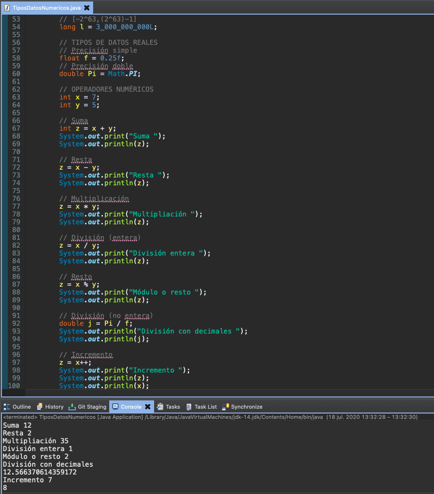

### Comentarios

Podríamos utilizar dos tipos de comentarios, si queremos comentar un gran bloque de código lo podríamos hacer simplemente añadiendo como decíamos una barra y un asterisco `/*` y más adelante con un asterisco y una barra `*/` y ya quedaría totalmente comentado. También podríamos utilizar alguno de los atajos que noofrece Eclipse, si seleccionamos todo el código que queremos comentar y vamos a la pestaña de `Source` vemos que nos permite añadir algunos elementos de comentarios `Toggle Comment`, `Add Block Comment`, `Remove Block Comment`, `Generate Element Comment` y tiene también sus atajo de teclado, podemos añadir un comentario directamente desde aquí con `Toggle Comment` y lo añadiría como un comentario al inicio de cada línea, comentaría línea a línea esto tiene sus ventajas porque si intercalado en mitad de este código hubiera comentarios de bloque y quisiéramos hacerlo solamente con un comentario de bloque, sería un verdadero quebradero de cabeza y esto nos asegura que se van a comentar todas las líneas, esto veremos que lo podemos conmutar para eliminar los comentarios rapidamente.

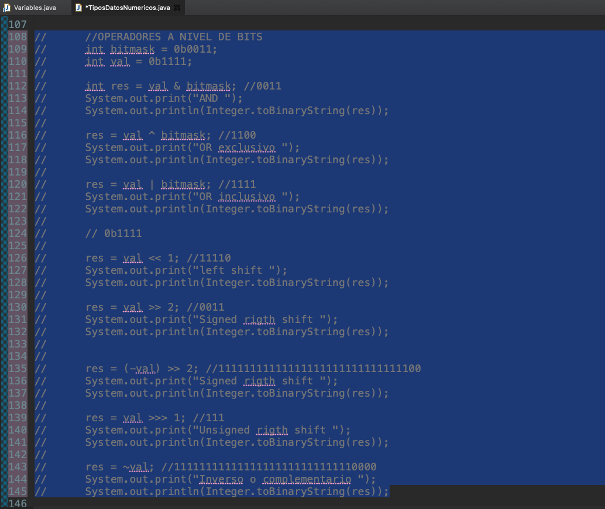

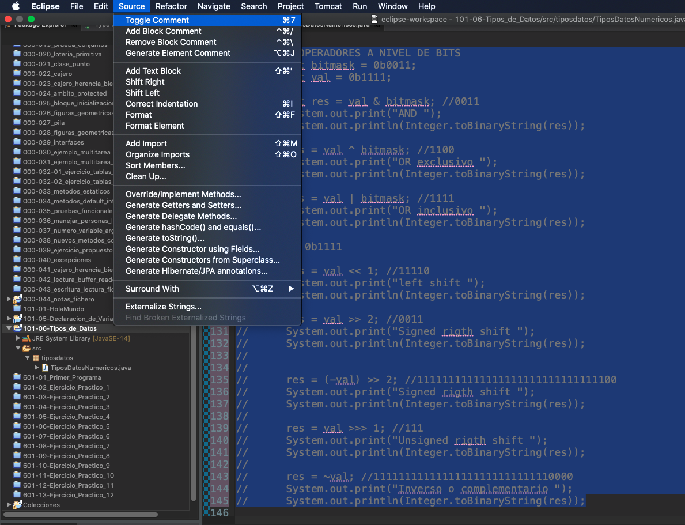

# 06 Manipulación de números, caracteres y otros valores III 8:13 

[Manipulación de números, caracteres y otros valores](pdfs/06_Manipulación_de_numeros_caracteres_y_otros_valores.pdf)

## Resumen Profesor

#### 6.2.5 Operadores numéricos a nivel de bits

Estos son los menos usuales de todos, pero los presentamos también por si en alguna ocasión fueran necesarios:

* `&`: operación AND a nivel de bits.
* `^`: operación OR exclusivo a nivel de bits (en este tipo de OR, el resultado de 1 OR 1 es 0).
* `|`: operación OR inclusivo a nivel de bits (en este tipo de OR, el resultado de 1 OR 1 es 1).
* `~`: cambia cada cero por un uno y cada uno por un cero.
* `<<`: desplaza un número de bits hacia la izquierda. Rellena los huecos con ceros.
* `>>>`: desplaza un número de bits hacia la derecha. Rellena los huecos con ceros.
* `>>`: desplaza un número de bits hacia la derecha. Rellena los huecos con el bit más significativo (el de signo).

## Transcripción


Para terminar el bloque de tipos de datos numéricos podemos ver que también podemos tratar estos tipos numéricos a nivel de bits, puedo aseguraros que no será lo más habitual en vuestra operaciones cotidianas, pero es posible que se de el caso de que alguna vez tengan que hacer este tipo de tratamiento, por ello vamos a ver someramente los operadores y algún ejemplo de su utilización.

Podemos realizar operaciones de tipo lógico, operaciones de desplazamiento de bits, la operacion de tipo lógico con un ampersand **`&`** sería una **operación lógica `and`** a nivel de bits se refiere que siguiendo la tabla de verdad del `and` y bit a bit haría esa operación entre los dos valores numéricos. Podemos hacer la operación de tipo **OR exclusivo `^`** u **OR inclusivo `|`** en el cual al hacer el OR si recordáis el OR de dos valores verdadero en un tipo pues no se volvía verdadero y en el otro nos devolvería falso y la **operación de negación `~`** que lo que hace es cambiar cada 0 por 1 y cada 1 por 0, hasta aquí estos operadores pueden ser asimilable a los que ya conozcáis de logica booleana y sencillos.

Luego tenemos los de desplazamiento de bits, que ya digo que es posible que no utilicen nunca, pero que más o menos vamos aprender a utilizar, el operador de los dos los dos símbolos de menor que hacia la izquierda **`<<`** lo que va a hacer es desplazar un número de bits que nosotros le vamos a indicar hacia la izquierda y va a rellenar los huecos con ceros, el desplazamiento de bits en ocasiones se puede utilizar para generar algún tipo de operaciones matemáticas si es que lo sabemos utilizar.  En el caso de los desplazamientos de bits a la derecha tenemos dos tipos de operaciones con signo y sin signo que estan representados con **`>>`** y **`>>>`**, si utilizamos el operador `>>` nos desplaza el número de bits que nosotros indiquemos a la derecha y rellena los huecos que se han quedado vacíos, con nuestro bit más significativo el que indica el signo en su representación, si usamos el `>>>` lo que hace es desplazar un número de bits hacia la derecha rellenando con ceros, el `>>>` es el que más se suele utilizar.

### :computer: `101-06-Tipos_de_Datos`

Si nos damos cuenta tenemos aquí representados dos valores enteros pero con su representación binaria
`0b0011` y `0b1111` y vamos a probar a hacer las diferentes operaciones lógicas, AND, OR exclusivo y el OR inclusivo, ponemos los resultados esperados. No aprovechamos de un método especial `toBinaryString`, de una clase que se llama `Integer` que conoceremos más adelante que *nos permite traducir un valor entero a su representación binaria para que la podamos imprimir por consola, sin añadir los ceros más representativos a la izquierda*. El OR inclusivo es el que se suele usar más para la lógica de los programas al OR exclusivo también se le conoce como XOR. 

*`TiposDatosNumericos`*

```java
   ...
   //OPERADORES A NIVEL DE BITS
   int bitmask = 0b0011; 
   int val = 0b1111; 
		
   int res = val & bitmask; //0011
   System.out.print("AND ");
   System.out.println(Integer.toBinaryString(res));
		
   res = val ^ bitmask; //1100
   System.out.print("OR exclusivo ");		
   System.out.println(Integer.toBinaryString(res));
				
   res = val | bitmask; //1111
   System.out.print("OR inclusivo ");
   System.out.println(Integer.toBinaryString(res));
		
   // val = 0b1111
		
   res = val << 1; //11110
   System.out.print("left shift ");		
   System.out.println(Integer.toBinaryString(res));
				
   res = val >> 2; //0011
   System.out.print("Signed rigth shift ");		
   System.out.println(Integer.toBinaryString(res));
		
		
   res = (-val) >> 2; //11111111111111111111111111111100
   System.out.print("Signed rigth shift ");		
   System.out.println(Integer.toBinaryString(res));
				
   res = val >>> 1; //111
   System.out.print("Unsigned rigth shift ");		
   System.out.println(Integer.toBinaryString(res));
		
   res = ~val; //11111111111111111111111111110000
   System.out.print("Inverso o complementario ");
   System.out.println(Integer.toBinaryString(res));
   
   ...
```

En los casos del desplazamiento vamos a poder ver como podemos hacer diferentes desplazamientos y también veremos la negación. 

Si tenemos el número `val = 0b1111`, es decir `1111` y hacemos un desplazamiento de un bit hacia la izquierda `res = val << 1;` lo que va a hacer es desplazar todos los bits una posición a la izquierda y el hueco que queda lo rellena con 0 por eso nos da como resultado `11110`, pasa de tener 4 bits a tener 5 bits.

Si desplazamos hacia la derecha dos posiciones `res = val >> 2;` el resultado con "unsigned rigth" se nos retornará como resultado `0011`, se pieden dos 1s y como este número tiene de bit de signo 0, lo que ha hecho es añadir un solo cero, si tuvierá de bit de signo un 1, añadiria un 1. :confuse:

En este caso para poderlo ver mejor hemos cálculado el negativo de `val` y desplazamos dos valores a la derecha con signo `res = (-val) >> 2;` y como podemos ver a rellenado todos los valores que quedan a libres a la izquierda con 1s `11111111111111111111111111111100` por que el bit de signo esta vacío.

Si hacemos un desplazamiento "unsigned" lo que hace es que pasa de tener cuatro 1s a tener tres 1s `res = val >>> 1; //111`.

Y la negación de un número es invertir todos los bits de 1 a 0 y de 0 a 1 `res = ~val; //11111111111111111111111111110000`

Vamos a ejecutar la aplicación para ver el resultado de las operaciones.

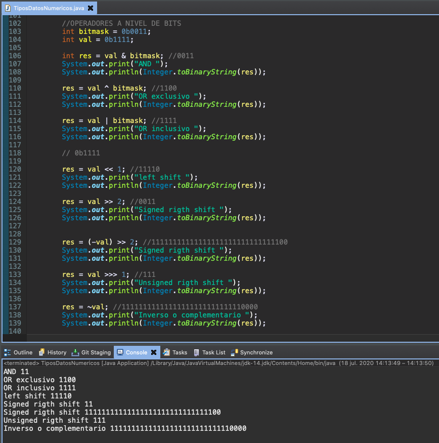

El programa completo queda es el siguiente:

*`TiposDatosNumericos.java`*

```java
/**
 * 
 */
package tiposdatos;

/**
 * @author
 *
 */
@SuppressWarnings("all")
public class TiposDatosNumericos {

	/**
	 * @param args
	 */
	public static void main(String[] args) {

		/*
		 * LITERALES
		 */

		// Valor booleano VERDADERO
		boolean resultado = true;
		// Letra C
		char letraMayuscula = 'C';
		// Número 100
		byte by = 100;
		// Número 1000
		short sh = 1000;
		// Número 1000000
		int in = 1000000;

		// Valor 26, en decimal
		int decVal = 26;
		// Valor 26, en hexadecimal
		int hexVal = 0x1a;
		// Valor 26, en binario
		int binVal = 0b11010;

		// String s = "Hola Mundo";

		/*
		 * TIPOS DE DATOS NUMÉRICOS
		 */

		// TIPOS DE DATOS ENTEROS
		// [-128,127]
		byte b = 28;
		// [-32768,32767]
		short s = 3458;
		// [-2^31,(2^31)-1]
		int i = 33456;
		// [-2^63,(2^63)-1]
		long l = 3_000_000_000L;

		// TIPOS DE DATOS REALES
		// Precisión simple
		float f = 0.25f;
		// Precisión doble
		double Pi = Math.PI;

		// OPERADORES NUMÉRICOS
		int x = 7;
		int y = 5;

		// Suma
		int z = x + y;
		System.out.print("Suma ");
		System.out.println(z);

		// Resta
		z = x - y;
		System.out.print("Resta ");
		System.out.println(z);

		// Multiplicación
		z = x * y;
		System.out.print("Multipliación ");
		System.out.println(z);

		// División (entera)
		z = x / y;
		System.out.print("División entera ");
		System.out.println(z);

		// Resto
		z = x % y;
		System.out.print("Módulo o resto ");
		System.out.println(z);

		// División (no entera)
		double j = Pi / f;
		System.out.println("División con decimales ");
		System.out.println(j);

		// Incremento
		z = x++;
		System.out.print("Incremento ");
		System.out.println(z);
		System.out.println(x);

		//OPERADORES A NIVEL DE BITS
		int bitmask = 0b0011; 
		int val = 0b1111; 
		
		int res = val & bitmask; //0011
		System.out.print("AND ");
		System.out.println(Integer.toBinaryString(res));
		
		res = val ^ bitmask; //1100
		System.out.print("OR exclusivo ");		
		System.out.println(Integer.toBinaryString(res));
				
		res = val | bitmask; //1111
		System.out.print("OR inclusivo ");
		System.out.println(Integer.toBinaryString(res));
		
		// 0b1111
		
		res = val << 1; //11110
		System.out.print("left shift ");		
		System.out.println(Integer.toBinaryString(res));
				
		res = val >> 2; //0011
		System.out.print("Signed rigth shift ");		
		System.out.println(Integer.toBinaryString(res));
		
		
		res = (-val) >> 2; //11111111111111111111111111111100
		System.out.print("Signed rigth shift ");		
		System.out.println(Integer.toBinaryString(res));
				
		res = val >>> 1; //111
		System.out.print("Unsigned rigth shift ");		
		System.out.println(Integer.toBinaryString(res));
		
		res = ~val; //11111111111111111111111111110000
		System.out.print("Inverso o complementario ");
		System.out.println(Integer.toBinaryString(res));

//		int a = 5;
//		int b = 9;
//		
//		System.out.println((double)a/b);

	}
```

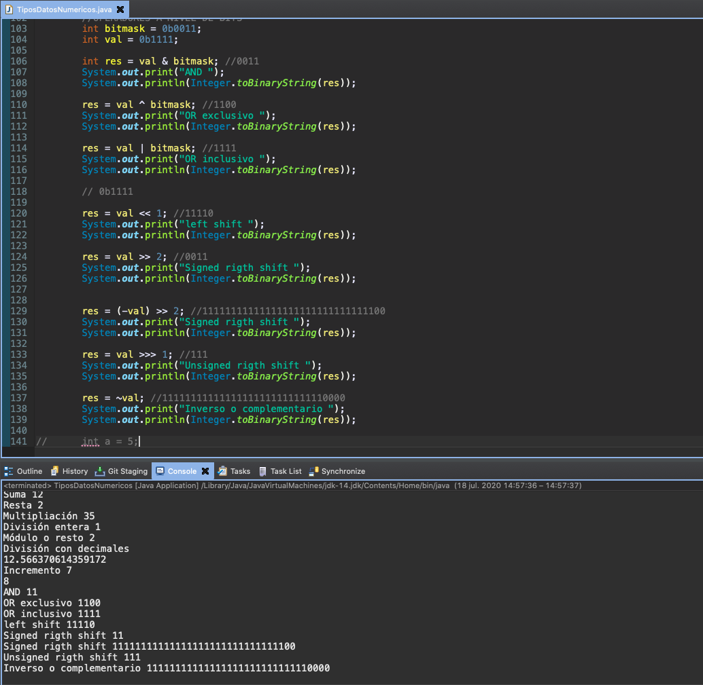

# 06 Manipulación de números, caracteres y otros valores IV 15:52 

[Manipulación de números, caracteres y otros valores](pdfs/06_Manipulación_de_numeros_caracteres_y_otros_valores.pdf)

### 6.3 Tipos de datos lógicos o booleanos

Nos permite almacenar valores susceptibles de ser verdadero o falso (`true`, `false`).

#### 6.3.1 Operadores lógicos condicionales

* `!`: realiza la negación del valor.
* `&&`: realiza un AND condicional de los dos operandos.
* `||`: realiza un OR condicional de los dos operandos.
* `?` :: Si el primer operando es verdadero, devuelve el valor del segundo; en otro caso, devuelve el tercero.

#### 6.3.2 Operadores lógicos relacionales

* `==`: devuelve verdadero si ambos valores son verdaderos
* `!=`: devuelve el valor inverso a ==
* `>`: devuelve verdadero si el valor de la izquierda es mayor estricto que el de la derecha.
* `>=`: devuelve verdadero si el valor de la izquierda es mayor o igual que el de la derecha.
* `<`: devuelve verdadero si el valor de la izquierda es menor estricto que el de la derecha.
* `<=`: devuelve verdadero si el valor de la izquierda es menor o igual que el de la derecha.

### 6.4 Tipos de datos para caracteres

Como tipo de dato primitivo para el manejo de caracteres, Java solamente nos ofrece `char`, el cual nos permite almacenar un solo caracter (letra, signo de puntuación, …).

```java
char = 'a';
```

Por si solo, este tipo de dato no nos permite mucho *juego*.

Sin embargo, Java nos ofrece una clase, `java.lang.String`, con la que manejar facilmente cadenas de caracteres. La incluimos en este apartado, aunque sea un tipo de dato estructurado ya que se puede obtener directamente desde un literal:

```java
String str = "Cadena de caracteres";
```

#### 6.4.1 Operadores con cadenas de caracteres

El principal operador para cadenas de caracteres es `+`, que nos permite concatenar dos textos, es decir, *poner* el segundo tras el primero.

### 6.5 Castings o transformaciones explícitas de tipos

En ocasiones, nos puede interesar realizar un cambio explicito de un tipo de dato.

```java
System.out.println(5/9);
```
Este código produce como salida un 0, porque está haciendo la división entera. Si queremos obtener el resultado con decimales, podemos cambiar el tipo de dato explícitamente, pero para esa operación.

```java
System.out.println((double)5/9);
```

En este caso, el resultado será 0.55555555556

## Transcripción


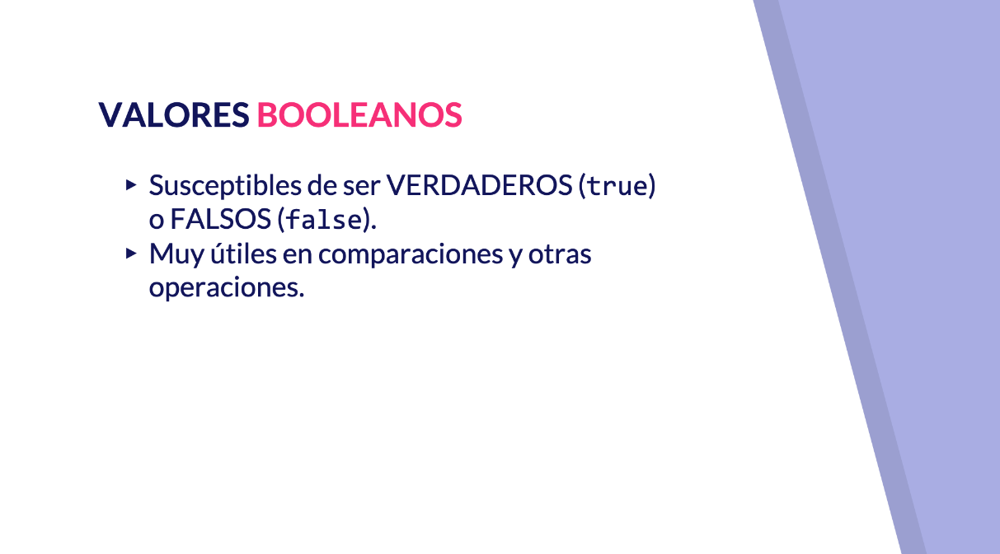


*TiposDatosLogicos.java*

```java
/**
 * 
 */
package tiposdatos;

/**
 * @author
 *
 */
@SuppressWarnings("all")
public class TiposDatosLogicos {

	/**
	 * @param args
	 */
	public static void main(String[] args) {

		//OPERADORES LÓGICOS CONDICIONALES
		int valor1 = 1;
        int valor2 = 2;
        //En el próximo capítulo profundizamos en las sentencias condicionales
        if((valor1 == 1) && (valor2 == 2))
            System.out.println("valor1 es 1 AND valor2 es 2");
        if((valor1 == 1) || (valor2 == 1))
            System.out.println("valor1 es 1 OR valor2 es 1");
		
        
        //OPERADOR "TERNARIO"
        int result;
        boolean someCondition = false;
        result = someCondition ? valor1 : valor2;
        System.out.println(result);
        
        
        //OPERADORES LÓGICOS RELACIONALES
        //En el próximo capítulo profundizamos en las sentencias condicionales
        if(valor1 == valor2)
            System.out.println("valor1 == valor2");
        if(valor1 != valor2)
            System.out.println("valor1 != valor2");
        if(valor1 > valor2)
            System.out.println("valor1 > valor2");
        if(valor1 < valor2)
            System.out.println("valor1 < valor2");
        if(valor1 <= valor2)
            System.out.println("valor1 <= valor2");
        
	}
}


SALIDA:

valor1 es 1 AND valor2 es 2
valor1 es 1 OR valor2 es 1
2
valor1 != valor2
valor1 < valor2
valor1 <= valor2
```


*TiposDatosCaracteres.java*

```java
package tiposdatos;

/**
 * @author 
 *
 */
public class TiposDatosCaracteres {

	/**
	 * @param args
	 */
	public static void main(String[] args) {
		
		char a = 'a';
		System.out.println(a);
		
		String str = "Cadena de caracteres";
		System.out.println(str);
		
		String str2 = " más larga";
		System.out.println(str + str2); // Cadena de caracteres más larga
	}
}


SALIDA:

a
Cadena de caracteres
Cadena de caracteres más larga
```

# 7. Estructura de decisión 21:22 

[Estructura de decisión](pdfs/07_Estructuras_de_decisión.pdf)


### 7.1 Repaso sobre sentencias, bloques y expresiones


En el capítulo 4 veíamos que podíamos asemejar una sentencia a una *línea de código*, y un bloque a una agrupación de sentencias con una determinada misión. Repasemos esos conceptos y, vistos los capítulos 5 y 6, conzcamos mejor el de expresión.

#### 7.1.1 Expresión


Se trata de una construcción hecha con variables, operadores y llamadas a funciones, que sigue la sintaxis del lenguaje, y que se evalúa produciendo un solo valor.

Sin saberlo, ya hemos trabajado con algunas expresiones:

```java
int numero = 0;
numero = 1 + 2;
```

Java permite construir expresiones de mayor tamaño componiendo algunas de menor tamaño:

```java
numero = 1 + 2 * 3;
```

Sin embargo, en casos como estos debemos tener cuidado con la posible ambigüedad y usar paréntesis para aclarar como se va a evaluar la expresión

```java
numero = (1 + 2) * 3;
```

#### 7.1.2 Sentencia

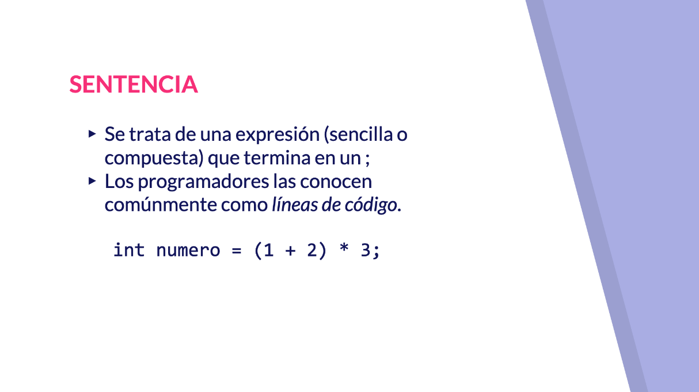

Tras conocer una expresión, podemos decir que una sentencia es una expresión que termina en `;`

#### 7.1.3 Bloque de código


Un bloque será un grupo de cero o más sentencias, delimitadas por un `{ }`. Por ejemplo:

```java
class BlockDemo {
     public static void main(String[] args) {
          boolean condicion = true;
          if (condicion) { // inicio del bloque 1
               System.out.println("La condición es verdadera");
          } // final del bloque 1
          else { // inicio del bloque 2
               System.out.println("La condición es falsa.");
          } // final del bloque 2
     }
}
```

### 7.2 Estructuras de decisión


#### 7.2.1 Estructura `if-then`

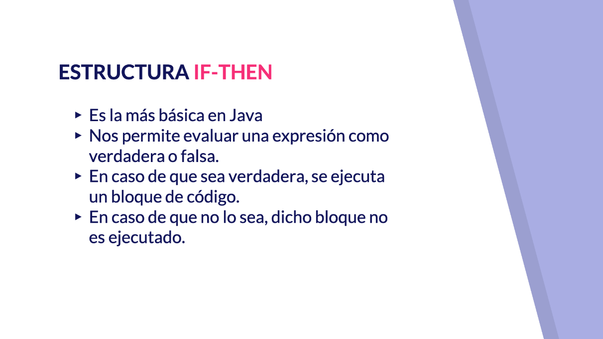

Permite evaluar una expresión como verdadera o falsa, y ejecutar en caso de que sea verdadera un bloque de código

```java
int num1 = 3, num2 = 4;

if (num1 > num2) {
   System.out.println("num1 es mayor que num2");
}

System.out.println("Este mensaje se imprime siempre");
```

##### 7.2.1.1 Código

*Decision01.java*

```java
/**
 * Ejemplo de uso de la estructura IF
 */
package decision;

/**
 * @author 
 *
 */
public class Decision01 {

	/**
	 * @param args
	 */
	public static void main(String[] args) {
		
//		int num1 = 3;
//		int num2 = 4;
		int num1 = 5, num2 = 4;
		
		if (num1 > num2) {
			System.out.println("num1 es mayor que num2");
		}
		
		System.out.println("Este mensaje se imprime siempre");

	}
}


SALIDA:

num1 es mayor que num2
Este mensaje se imprime siempre
```

*Decision02.java*

```java
/**
 *  Ejemplo de uso de la estructura IF con una condición más compleja
 */
package decision;

/**
 * @author 
 *
 */
public class Decision02 {

	/**
	 * @param args
	 */
	public static void main(String[] args) {

		int num1 = 4, num2 = 9, num3 = 7;

		if (num3 > num1 && num3 < num2) {
			System.out.println("num1 es menor que num3, y este es menor que num2");
		}
	}
}


SALIDA:

num1 es menor que num3, y este es menor que num2

```

#### 7.2.2 Estructura `if-else`

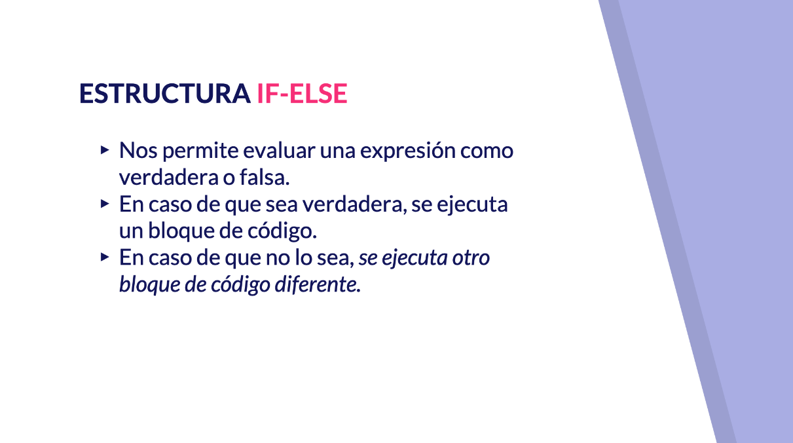

Permite evaluar una expresión como verdadera o falsa; si el valor es verdadero se ejecuta un bloque de código, y si es falso, se ejecuta otro diferente:

```java
int num1 = 3, num2 = 4;

if (num1 > num2) {
   System.out.println("num1 es mayor que num2");
}else {
   System.out.println("num1 NO es mayor que num2");
}

System.out.println("Este mensaje se imprime siempre");
```
##### 7.2.2.1 Código

*Decision03.java*

```java
/**
 * Ejemplo de uso de la estructura IF-ELSE
 */
package decision;

/**
 * @author 
 *
 */
public class Decision03 {

	/**
	 * @param args
	 */
	public static void main(String[] args) {

		int num1 = 25;
		int num2 = 21;
		if (num1 > num2) {
			System.out.println("El número mayor es " + num1); 
		} else { 			
			System.out.println("El número mayor es " + num2);
		}

	}
}


SALIDA:

El número mayor es 25
```

#### 7.2.3 Estructura `if-else-if`

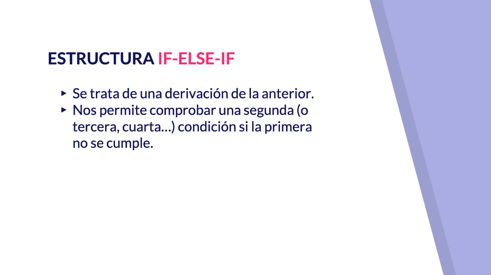

Permite evaluar varias expresión como verdadera o falsa; si el valor es verdadero se ejecuta un bloque de código, y si es falso, se ejecuta el último bloque de código correspondiente al else:

```java
if (puntuacion >= 9) {
   System.out.println("Tienes un SOBRESALIENTE");
} else if (puntuacion >= 7) {
   System.out.println("Tienes un NOTABLE");
} else if (puntuacion >= 5) {
   System.out.println("Tienes un APROBADO");
} else {
   System.out.println("Estás SUSPENSO. Lo siento");
}
```

##### 7.2.3.1 Código

*Decision04.java*

```java
/**
 * Ejemplo de uso de varias estructuras IF-ELSE-IF
 * anidadas
 */
package decision;

/**
 * @author 
 *
 */
public class Decision04 {

	/**
	 * @param args
	 */
	public static void main(String[] args) {

		float puntuacion = 7.6f;
		
		if (puntuacion >= 9) {
			System.out.println("Tienes un SOBRESALIENTE");
		} else if (puntuacion >= 7) {
			System.out.println("Tienes un NOTABLE");
		} else if (puntuacion >= 5) {
			System.out.println("Tienes un APROBADO");
		} else {
			System.out.println("Estás SUSPENSO. Lo siento");
		}
	}
}


SALIDA:

Tienes un NOTABLE
```

#### 7.2.4 Estructura `switch`


Permite evaluar si una expresión se corresponde con alguno de los valores de una serie de casos. Se puede usar con valores `byte`, `short`, `char`, `int` y `String`, entre otros. También existe la posibilidad de tener un caso por defecto (parecido a `else`).

```java
switch (mes) {
   case 1:  mesString = "Enero";
      break;
   case 2:  mesString = "Febrero";
      break;
   case 3:  mesString = "Marzo";
      break;
   case 4:  mesString = "Abril";
      break;
   case 5:  mesString = "Mayo";
      break;
   case 6:  mesString = "Junio";
      break;
   case 7:  mesString = "Julio";
      break;
   case 8:  mesString = "Agosto";
      break;
   case 9:  mesString = "Septiembre";
      break;
   case 10: mesString = "Octubre";
      break;
   case 11: mesString = "Noviembre";
      break;
   case 12: mesString = "Diciembre";
      break;
   default: mesString = "Mes no válido";
      break;
}
```

##### 7.2.4.1 Código

*Decision05.java*

```java
/**
 * Ejemplo de uso de estructura Switch
 */
package decision;

/**
 * @author 
 *
 */
public class Decision05 {

	/**
	 * @param args
	 */
	public static void main(String[] args) {
		
		int mes = 4;
        String mesString;
        switch (mes) {
            case 1:  mesString = "Enero"; // mes == 1 -> true
                     break;
            case 2:  mesString = "Febrero";
                     break;
            case 3:  mesString = "Marzo";
                     break;
            case 4:  mesString = "Abril";
                     break;
            case 5:  mesString = "Mayo";
                     break;
            case 6:  mesString = "Junio";
                     break;
            case 7:  mesString = "Julio";
                     break;
            case 8:  mesString = "Agosto";
                     break;
            case 9:  mesString = "Septiembre";
                     break;
            case 10: mesString = "Octubre";
                     break;
            case 11: mesString = "Noviembre";
                     break;
            case 12: mesString = "Diciembre";
                     break;
            default: mesString = "Mes no válido";
                     break;
        }
        System.out.println(mesString);

	}

}


SALIDA:

Abril
```


*Decision06.java*

```java
/**
 * Ejemplo más complejo de uso de SWITCH
 */
package decision;

/**
 * @author 
 *
 */
public class Decision06 {

	/**
	 * @param args
	 */
	public static void main(String[] args) {
		int mes = 4;
		int numDias = 0;

		switch (mes) {
		case 1:
		case 3:
		case 5:
		case 7:
		case 8:
		case 10:
		case 12:
			numDias = 31;
			break;
		case 4:
		case 6:
		case 9:
		case 11:
			numDias = 30;
			break;
		case 2:
			// No tenemos en cuenta si el año es bisiesto
			// para no hacer más complejo el ejemplo
			numDias = 28;
			break;
		default:
			System.out.println("Mes no válido");
			break;
		}
		System.out.println("Número de días = " + numDias);
	}

}


SALIDA:

Número de días = 30
```

*Decision07.java*

```java
/* Uso de la estructura Switch con cadenas de caracteres
 */
package decision;

/**
 * @author 
 */
public class Decision07 {

	/**
	 * @param args
	 */
	public static void main(String[] args) {
		int mesNumero = 4;
		String mes = "abril";

		switch (mes) {
		case "enero":
			mesNumero = 1;
			break;
		case "febrero":
			mesNumero = 2;
			break;
		case "marzo":
			mesNumero = 3;
			break;
		case "abril":
			mesNumero = 4;
			break;
		case "mayo":
			mesNumero = 5;
			break;
		case "junio":
			mesNumero = 6;
			break;
		case "julio":
			mesNumero = 7;
			break;
		case "agosto":
			mesNumero = 8;
			break;
		case "septiembre":
			mesNumero = 9;
			break;
		case "octubre":
			mesNumero = 10;
			break;
		case "noviembre":
			mesNumero = 11;
			break;
		case "diciembre":
			mesNumero = 12;
			break;
		default:
			mesNumero = 0;
			break;
		}

		System.out.println("El mes de " + mes + " se corresponde con el número " + mesNumero );

	}

}


SALIDA:

El mes de abril se corresponde con el número 4
```

# 08 Estructura de repetición 13:01 

[Estructura de repetición](pdfs/08_Estructuras_de_repeticion.pdf)


### 8.1 Bucle `while`

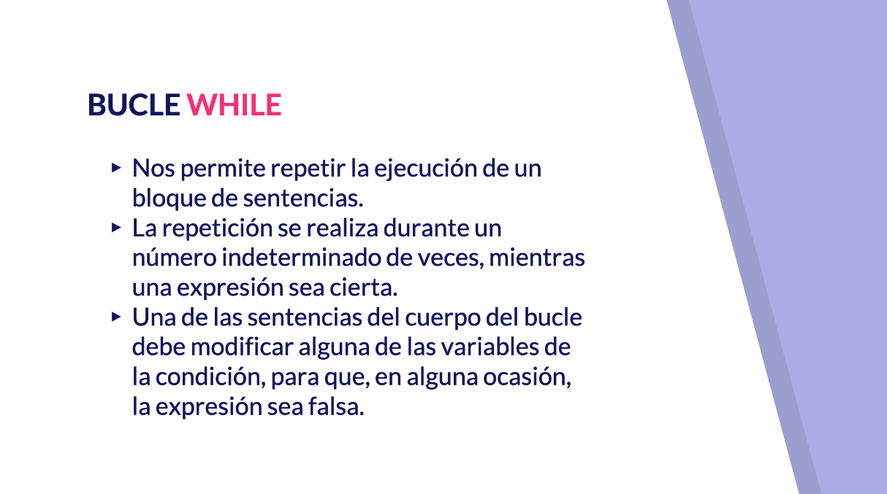

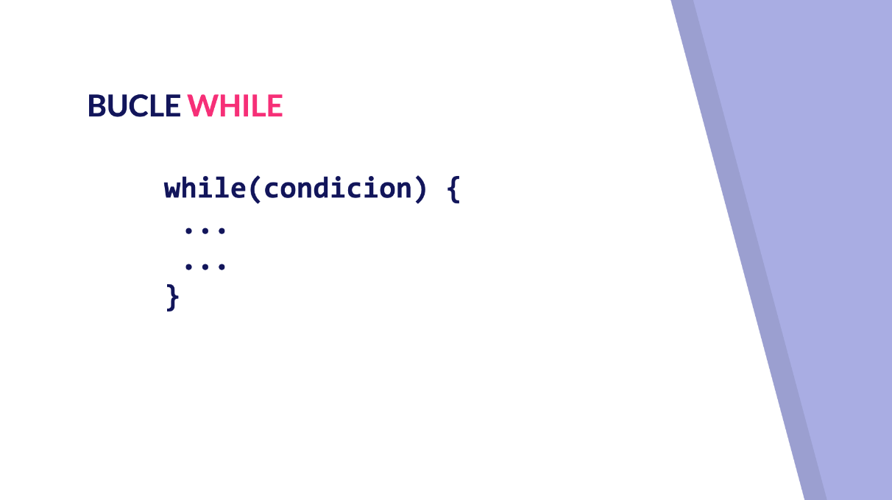

Nos permite repetir la ejecución de un bloque de sentencias. La repetición se realiza durante un número indeterminado de veces, mientras una expresión sea cierta. Una de las sentencias del cuerpo del bucle debe modificar alguna de las variables de la condición, para que, en alguna ocasión, la expresión sea falsa.

```java
while (condicion) {
   ...
   ...      
}
``` 

#### 8.1.1 Código

*Repeticion01.java*

```java
/**
 *  Ejemplo de uso del bucle while
 */
package repeticion;

/**
 * @author 
 *
 */
public class Repeticion01 {

	/**
	 * @param args
	 */
	public static void main(String[] args) {
		int contador = 1;
        while (contador < 11) {
            System.out.println("Contador vale: " + contador);
            contador++;
        }

	}

}


SALIDA:

Contador vale: 1
Contador vale: 2
Contador vale: 3
Contador vale: 4
Contador vale: 5
Contador vale: 6
Contador vale: 7
Contador vale: 8
Contador vale: 9
Contador vale: 10
```

### 8.2 Bucle `do-while`

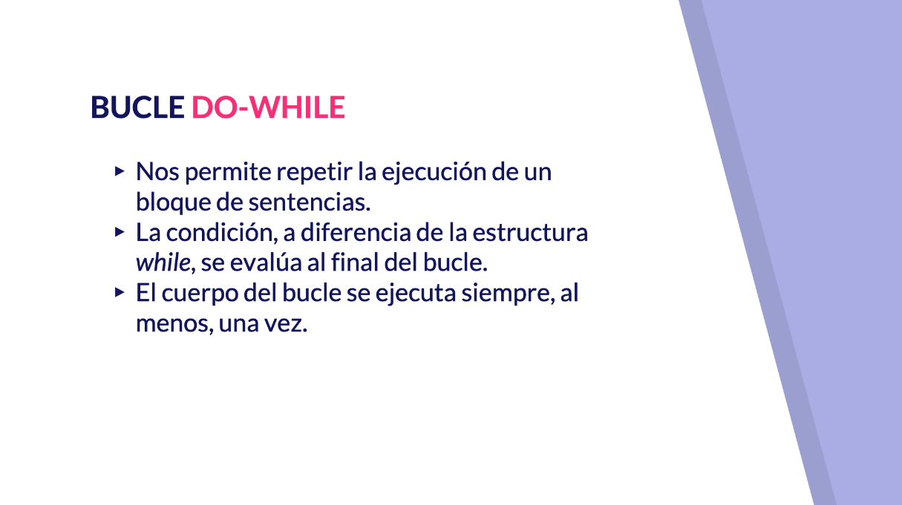

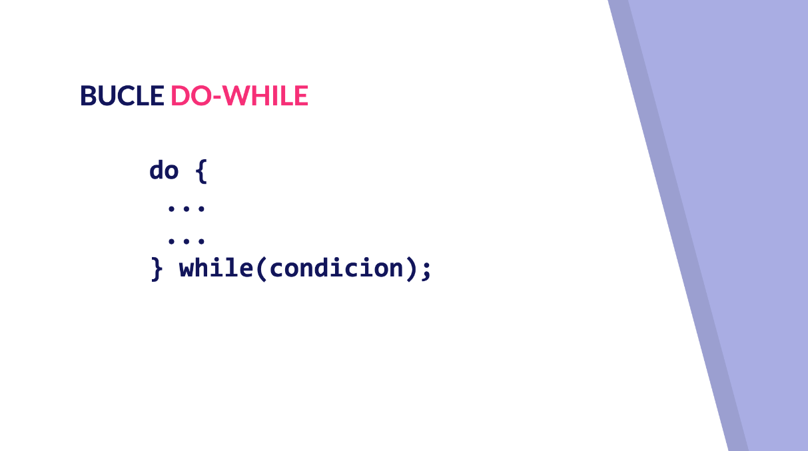

Nos permite repetir la ejecución de un bloque de sentencias. La condición, a diferencia de la estructura while, se evalúa al final del bucle. El cuerpo del bucle se ejecuta siempre, al menos, una vez.

```java
do {
   ...
   ...      
} while (condicion);
```

#### 8.2.1 Código

*Repeticion02.java*

```java
/**
 * Ejemplo de uso del bucle do-while
 */
package repeticion;

/**
 * @author 
 *
 */
public class Repeticion02 {

	/**
	 * @param args
	 */
	public static void main(String[] args) {
		int contador = 1;
        do {
            System.out.println("Contador vale: " + contador);
            contador++;
        } while (contador < 11);

	}
}


SALIDA:

Contador vale: 1
Contador vale: 2
Contador vale: 3
Contador vale: 4
Contador vale: 5
Contador vale: 6
Contador vale: 7
Contador vale: 8
Contador vale: 9
Contador vale: 10
```

### 8.3 Bucle `for`


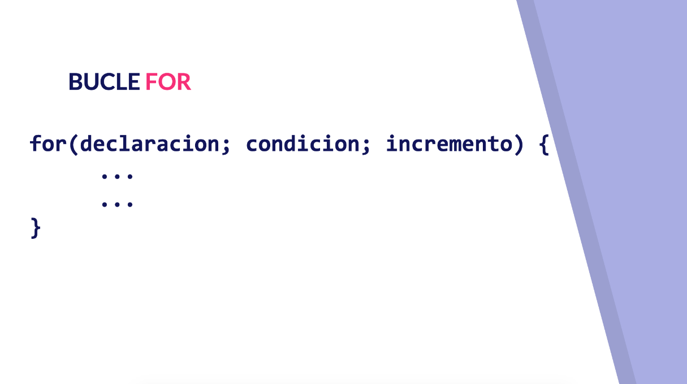

Nos permite repetir un bloque de código un número conocido a priori de veces. Suele ser el más utilizado de los 3. Se podría implementar un bucle for con un while. Cuando trabajemos con colecciones o arrays, podremos usar su variante llamada *for-each*.

```java
for(declaracion; condicion; incremento) {
   ...
}
```    

#### 8.3.1 Código

*Repeticion03.java*

```java
/**
 * Ejemplo de uso del bucle FOR
 */
package repeticion;

/**
 * @author 
 *
 */
public class Repeticion03 {

	/**
	 * @param args
	 */
	public static void main(String[] args) {
		
		for(int contador = 4; contador < 11; contador+=2) {
			System.out.println(contador);
		}
	}
}


SALIDA:

4
6
8
10
```

### 8.4 Sentencias `break` y `continue`

Existen dos sentencias especiales, que no suelen usarse mucho ya que producen posibles caminos de ejecución *raros*, que son `break` y `continue`:

* `break`: permite finalizar la ejecución de un bucle, independientemente de si se cumple la condición de finalización del mismo.

* `continue`: permite finalizar la ejecución de la iteración actual de un bucle, pasando automáticamente a la siguiente iteración del mismo.

Su uso no es demasiado recomendable, ya que puede producir un efecto conocido como código spaguetti, por el cual es dificil predecir los caminos de ejecución del mismo.

# 09 Práctica: Creando una calculadora 11:13 

En esta sesión práctica veremos como crear una calculadora, tienes el código de ejemplo en el [repositorio de GitHub](https://github.com/OpenWebinarsNet/Curso-Java-desde-0).

***Calculadora.java***

```java
/**
 * Ejemplo más complejo que nos permite utilizar
 * 
 *  - Variables numéricas
 *  - Operadores
 *  - Expresiones
 *  - Estructuras de decisión
 *  - Estructuras de repetición
 * 
 */
package calculadora;

import java.util.Scanner;

/**
 * @author 
 *
 */
public class Calculadora {

	/**
	 * @param args
	 */
	public static void main(String[] args) {
		
		//Variable donde almacenamos el valor seleccionado
		//del menú
		int opcion = 0;
		//Por ahora, es normal si no se comprenden estas dos
		//líneas de código.
		Scanner sc;
		sc = new Scanner(System.in);
		
		do {

			//Imprimimos por consola el menú
			System.out.println("\n"); //Este caracter especial nos permite imprimir una línea en blanco
			System.out.println("***** CALCULADORA CUARENTENA *****");
			System.out.println();
			System.out.println("1. Sumar");
			System.out.println("2. Restar");
			System.out.println("3. Multiplicar");
			System.out.println("4. Dividir");
			System.out.println("5. Resto");
			System.out.println("0. Salir del programa");
			System.out.println();
			System.out.print("Introduzca una opción válida: ");
			
			//Estas líneas de código nos permiten leer del teclado
			//y transformar el valor leído de String a int
			
			// 1) Recoger el valor escrito en el teclado
			// 2) Transformar esa cadena de caracteres en un valor entero
			opcion = Integer.parseInt(sc.nextLine());
			
			//Si la opcion es menor que 0 o mayor que 5, no es una
			//opción válida
			if (opcion < 0 || opcion > 5) {
				System.out.println("Opción no válida. Vuelva a escoger");
				//Si la opcion es diferente a cero, solicitamos los 
				//dos operandos
			} else if (opcion != 0) {

				System.out.println("\n");
				
				float operando1, operando2;
				
				System.out.print("Introduzca el primer operando: ");
				operando1 = Float.parseFloat(sc.nextLine());
				
				System.out.print("Introduzca el segundo operando: ");
				operando2 = Float.parseFloat(sc.nextLine());

				
				System.out.println("\n");
				switch(opcion) {
				
				case 1: //Suma
					System.out.println("El resultado de la suma es " + (operando1 + operando2));
					break;
				case 2: //Resta
					System.out.println("El resultado de la resta es " + (operando1 - operando2));
					break;
				case 3: //Multiplicación
					System.out.println("El resultado de la multiplicación es " + (operando1 * operando2));
					break;
				case 4: //División
					System.out.println("El resultado de la división es " + (operando1 / operando2));
					break;
				case 5: //Resto
					System.out.println("El resto de dividir " +operando1 + " entre " + operando2 + " es "+ (operando1 % operando2));
					break;
					
				}
				
			}
			
		} while (opcion != 0); //opcion == 0 implicar salir del programa
		
		//Indicamos que no vamos a leer ningún valor más por teclado.
		sc.close();
		
		System.out.println("Finalizando la ejecución de la calculadora");

	}

}

```

**SALIDA:**

```sh
***** CALCULADORA CUARENTENA *****

1. Sumar
2. Restar
3. Multiplicar
4. Dividir
5. Resto
0. Salir del programa

Introduzca una opción válida: 1


Introduzca el primer operando: 10
Introduzca el segundo operando: 7


El resultado de la suma es 17.0


***** CALCULADORA CUARENTENA *****

1. Sumar
2. Restar
3. Multiplicar
4. Dividir
5. Resto
0. Salir del programa

Introduzca una opción válida: 2


Introduzca el primer operando: 10
Introduzca el segundo operando: 7


El resultado de la resta es 3.0


***** CALCULADORA CUARENTENA *****

1. Sumar
2. Restar
3. Multiplicar
4. Dividir
5. Resto
0. Salir del programa

Introduzca una opción válida: 3


Introduzca el primer operando: 10
Introduzca el segundo operando: 7


El resultado de la multiplicación es 70.0


***** CALCULADORA CUARENTENA *****

1. Sumar
2. Restar
3. Multiplicar
4. Dividir
5. Resto
0. Salir del programa

Introduzca una opción válida: 4


Introduzca el primer operando: 10
Introduzca el segundo operando: 7


El resultado de la división es 1.4285715


***** CALCULADORA CUARENTENA *****

1. Sumar
2. Restar
3. Multiplicar
4. Dividir
5. Resto
0. Salir del programa

Introduzca una opción válida: 5


Introduzca el primer operando: 10
Introduzca el segundo operando: 7


El resto de dividir 10.0 entre 7.0 es 3.0


***** CALCULADORA CUARENTENA *****

1. Sumar
2. Restar
3. Multiplicar
4. Dividir
5. Resto
0. Salir del programa

Introduzca una opción válida: 0
Finalizando la ejecución de la calculadora
```

## Contenido adicional  4

[Variables](pdfs/05_Variables.pdf)

[Manipulación de números, caracteres y otros valores](pdfs/06_Manipulación_de_numeros_caracteres_y_otros_valores.pdf)

[Estructura de decisión](pdfs/07_Estructuras_de_decisión.pdf)

[Estructura de repetición](pdfs/08_Estructuras_de_repeticion.pdf)
