# 3. Clases y objetos 58m

* 09 Orientación de objetos 22:58 
* 10 Los constructores 9:07 
* 11 Getters y setters 14:28 
* 12 Ciclo de vida de un objeto 6:27 
* 13 Uso de clases envoltorio 5:31 
* Contenido adicional 5

# 9. Orientación de objetos 22:58

[Orientación de objetos](pdfs/09_Orientación_a_objetos.pdf)

## Resumen Profesor

### 9.1 Paradigma de programación Orientada a Objetos

**Un *paradigma* es un modelo, una manera de entender las cosas. El *paradigma de programación orientada a objetos* es aquel por el cual todos los elementos que manejamos en nuestro programa son *objetos*. Estos no son más que *instancias* construidas a través de un molde, que llamamos *clase*.**

### 9.2 Clases en Java

Una clase en Java tiene la siguiente estructura:

```java
<modificador> class NombreDeLaClase {

    //propiedades
    int propiedad1;
    String propiedad2;
    float propiedad3;
    //…

    //metodos
    void metodo1() {
        //…
    }

    //…
}
```

### 9.3 Objetos

Los objetos, que no son más que instancias de clases, tienen que ser creados (instanciados) por el programador, y almacenados en una referencia (muy similar a una variable).

```java
Persona persona = new Persona();
```

### 9.4 Valor null

Si declaramos una referencia, pero no construimos ningún objeto en ese momento, obtenemos una referencia nula, o con valor `null`. Además, es una palabra reservada que podemos usar para comparar.

```java
Persona persona;
```

### 9.5 Interacción entre objetos

Los objetos suelen interactuar los unos con los otros. Esto lo realizan mediante un mecanismo llamado *paso de mensajes*, que en la práctica es que, desde el cuerpo de una clase, estamos invocando a un método de otra clase.

### 9.6 Modificadores de acceso

Tanto a nivel de clase, como de atributos y métodos, Java pone a nuestra disposición una serie de *modificadores de acceso*, que harán que no cualquier clase pueda acceder a otra.

Modificador | Descripción
------------|------------
`public`: |  Es el menos restrictivo. Cualquiera puede acceder a esa clase o método.
`protected`:  | Solo puede acceder a ese método o atributo la propia clase, o una que herede de ella.
`private`: | Solo puede acceder a ese método o atributo la propia clase.
`default`: | Es decir, sin modificador de acceso - pueden acceder a esa clase todas las del mismo *paquete*.

### 9.7 Paquete

Es una agrupación de clases. Indicamos que una clase pertenece a un paquete mediante la palabra reservada `package` en la primera línea de código de la clase:

```java
package paquete;

class Clase {

  //...

}
```

## Transcripción


Vamos a dar comienzo a un nuevo bloque y es que ya hemos nombrado en alguna ocasión antes que Java es un lenguaje orientado a objetos.


Pero qué es eso de la orientación a objetos, hablemos primero un poco de lo que es comprender el mundo de los objetos.


Un objeto es cualquier cosa, cualquier cosa sobre la que podemos emitir un concepto, un objeto puede ser un pato, un camión, una bombilla, unas tijeras, una persona, una ventana, una impresora, un botón todo ello lo podríamos tratar como un objeto no tiene porqué ser algo tangible, sino algo sobre lo que podemos emitir un concepto, la temperatura en el día de hoy máxima y mínima, también lo podríamos incluso tratar como un objeto, los objetos son algo que nos viene bien a nivel natural como ser humano, sobre todo los que son tangibles, los que podemos tocar y a nivel de programación pues vamos a poder construir representaciones de esos objetos y manejarlos en nuestros programas. 


Tenemos un automóvil de juguete, de plástico, es de color rojo, tiene cuatro ruedas, con volante y además se puede mover hacia delante y hacia atrás, puede hacer sonar el claxon, encender las luces, arrancar y parar el motor.


Con lo cual podemos ir viendo como dentro de un objeto podemos diferenciar dos partes que son elementales y que son comunes a cualquier objeto, que es **una parte estructural estática y una parte de comportamiento que es más bien dinámica, relacionada con el hacer cosas, mientras que la estructura es más bien con el ser**, en el fondo la estructural es cómo está conformado ese objeto y el comportamiento es la serie de operaciones que realiza, por ejemplo a nivel estructural el objeto coche que tenemos representado es de material plástico, su número de ruedas es cuatro, tiene un volante y a nivel de comportamiento como decíamos se puede mover hacia atras, hacia delante, etc., es decir que de los objetos podemos identificar **estructura** por un lado y **comportamiento** por el otro.


Parejo al concepto de objerto tenemos el **concepto de clase** fijemonos en la imagen que aparece, tenemos un montón de globos, cada uno de ellos podríamos decir que es un objeto, los hay rojos, los hay amarillo, cada uno de ellos es un objeto, pero todos ellos tienen algo en común y es que nos referimos a ellos como como globo, el nombre, ese concepto mental, podríamos decir que es común Globo, si bien después tenemos un montón de globos sueltos, imaginar lo que disfrutaría un niño con toda esa cantidad de globos, porque son objetos diferentes, sin embargo conceptualmente los llamamos de una manera igual.

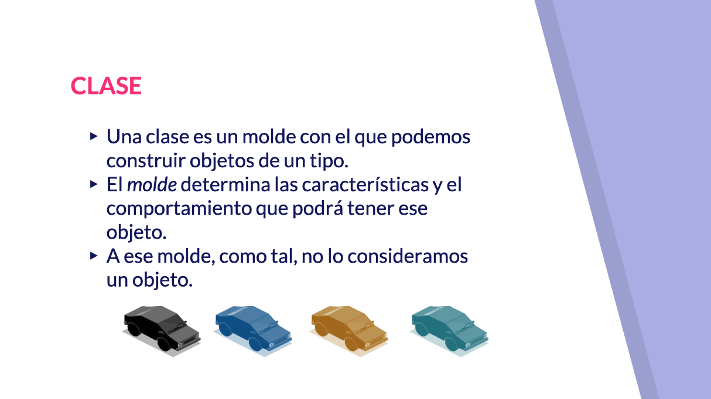

Pues bien **podríamos decir que una clase no es más que el molde con el que podemos construir objetos de un tipo determinado**, la clase globo nos permitiría construir un montón de globos diferentes, la clase coche nos permitirá construir coches diferentes, **el molde es quién va a determinar las características estructurales y el comportamiento que podrán tener los objetos que construyamos con ese molde**, ese molde como tal no es un objeto, sino que simplemente nos sirve para poder construir objetos de un tipo determinado de esa clase.

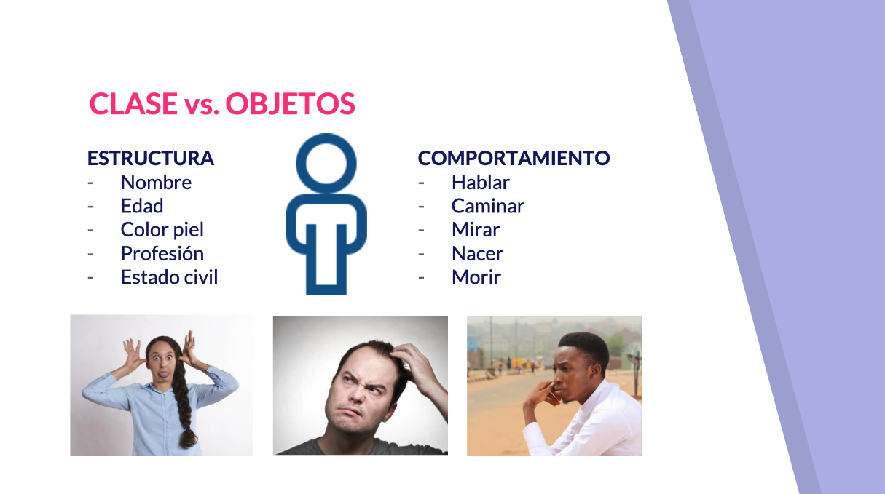

Y para diferenciar entre clase y objeto, una clase sería una representación, por ejemplo de una persona, donde a nivel estructural querríamos saber su nombre, su edad, el color de la piel, la profesión, el estado civil, a nivel de comportamiento podríamos identificar que una persona puede hablar, puede caminar, puede mirar, pueden nacer, puede morir y todo ello vendría representado dentro de ese molde para fabricar personas, la clase, como objetos de la clase persona, pues podríamos tener los tres que están representados mediante imágenes, con nombres diferentes, edades diferentes, color de piel en algún caso similar y en otros diferente, con prefesiones distintas, incluso con su estado civil, si bien todos ellos podrían hablar, caminar, mirar, nacer, morir y realizar todas las operaciones que pueden hacer o que están definidas dentro de la clase. La clase como decimos sirve como molde para construir objetos.


Cómo podemos utilizar o como podemos embeber este mundo de los objetos a la programación de aplicación, mediante la programación orientado a objetos.

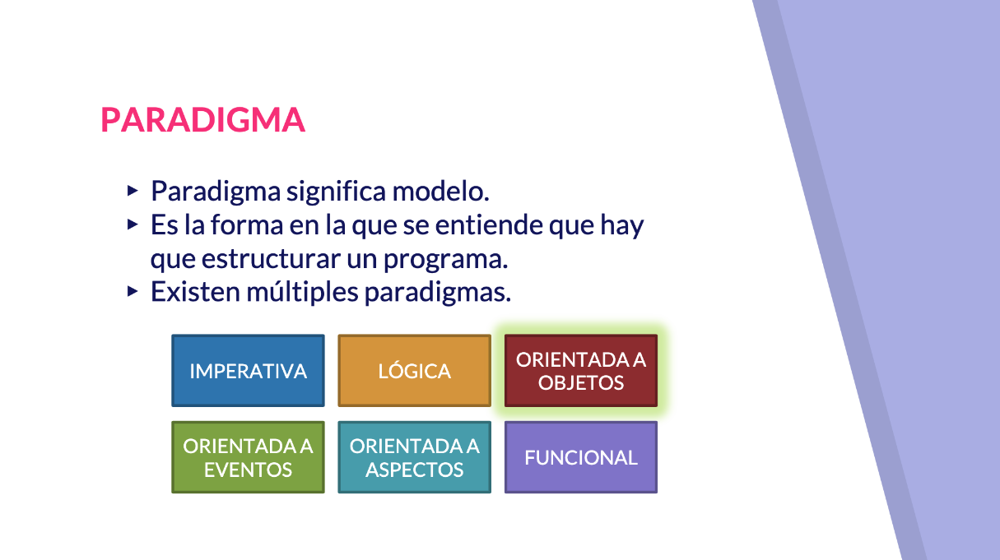

¿Qué es un paradigma? Un paradigma no es más que un modelo, es una forma de entender una tarea que se afronta, en particular el paradigma en programación es una forma en la que se entiende, en la que hay que estructurar un programa. Existen múltiples tipos de paradigmas asociados a programación, tenemos la programación imperativa, la programación lógica o declarativa, la programación orientada a eventos o aspectos, la programación funcional muy de moda últimamente aunque no es precisamente nueva y tenemos también la programación orientada a objetos.


En la programación orientada a objetos lo que hacemos es estructurar nuestros programas mediante el uso de clases, de manera que nuestros programas contienen más de una clase, los objetos interaccionan entre ellos mediante el paso de mensajes, retomando el símil que teníamos antes con la clase persona y los objetos distintos de personas, los objetos concretos y el paso de mensajes que tenemos ahora, las personas que  interaccionan entre ellas mediante conversaciones por ejemplo, de esa manera aquí tenemos tres representaciones de personas, el chico de la izquierda, la chica del medio y la chica que está a la derecha, interaccionan entre ellos mediante el paso de un mensaje, el objeto de la persona que está en medio de la chica rubia está emitiendo un mensaje porque lo está hablando. 

Con lo cual la programación orientada a objetos se va a basar al uso de objetos posiblemente más de uno casi siempre, ya veremos que cualquier aplicación por poco compleja que sea requerida del uso de más de un objeto y el paso de mensajes ese paso de mensajes viene también motivado por el siguiente concepto que vamos a conocer.

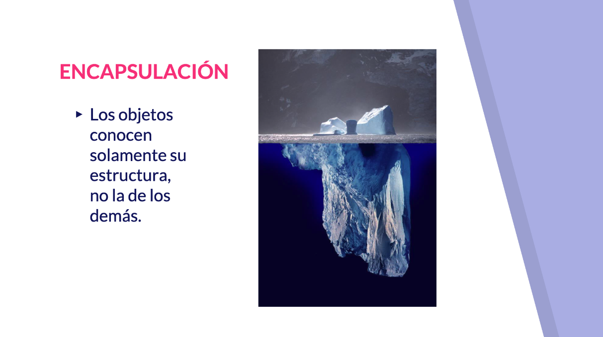

El **concepto de la encapsulación** y es que cuando nosotros vamos a tener objetos que creamos a través de sus moldes, de su clase, identificamos rápidamente que son los objetos los que conocen su propia estructura, sin embargo esa no la exponen a los demás, una persona solamente expone hacia los demás, una parte de si misma, no expone su estructura interna, por ejemplo los huesos, al igual que el símil que tenemos en la imagen del iceberg, un iceberg expone hacia el exterior, sobre la superficie del mar, expone  solamente una parte muy pequeña, dejando debajo del agua una parte muy grande, pues bien esto nos vale como símil para decir que una clase va a intentar ocultar la estructura de si misma para que solamente la conozca el, exponiendo solamente una parte muy pequeña, la que permita interacionar con otros objetos hacia el exterior. **Ese mecanismo de ocultar la estructura y exponer solamente una pequeña parte se le conoce como como encapsulamiento**.


Centrándonos en Java, la programación orientada a objetos le viene como anillo al dedo, porque Java es totalmente orientado a objetos, nos permite manejar con total versatilidad tanto clases como objeto a través de principalmente de la palabra reservada `class`, ya nos tiene que sonar porque sin conocer las clases muy bien ya hemos utilizado una clase en todo y cada uno de los ejemplos que hemos venido haciendo hasta ahora. A diferencia de otros lenguajes de programación donde la declaración de una clase que está situada en un fichero y la implementación está en otra, la declaración e implementación de clases en Java estará siempre dentro de un mismo fichero como norma general y además decir que de forma parecida a los nombres de la variables, los nombres de las clases seguirán las mismas reglas, tienen que ser autodescriptivos, no pueden incluir espacio en blanco, etc., pero en lugar de la notacion camelCase utilizaría notación *UpperCamelCase*, en la que bueno eliminamos los espacios en blanco, unimos todas las palabras y ponemos la primera letra de todas las palabras, incluida la primera en mayúscula.


Para declarar una clase tendríamos un código con esta sintaxis, tendríamos un modificador de acceso, que ya los conoceremos, qué van a permitir a una u otra clase acceder a otra o interaccionar con otras, la palabra reservada `class` y el nombre de la clase y encerrado entre llaves tenemos que **declarar su estructura a través de una serie de propiedades y su comportamiento a través de una serie de métodos** que iremos conociendo poco a poco. 

Las propiedades que puede tener pueden ser bien de tipos primitivos, que será con los que comencemos como en este caso una propiedad de tipo `int`, una propiedad de tipo `String`, una propiedad de tipo `float` y los métodos tendrán una serie de nombres que iremos viendo poco a poco y que tendrán un tipo de retorno, será el tipo de valor que devuelva su ejecución, que iremos conociendo poco a poco, esto es una presentación a vista de pájaro de la estructura de una clase.


A partir de una clase, cómo podemos obtener objetos, lo hacemos mediante **una operación que se llama instanciacion**, se refiere a la construcción de un objeto a partir del molde que representa una clase lo llamamos instanciación. 

La sintaxis es muy parecida a la declaracion e inicializacion de una variable de tipo primitivo y para hacerlo, para indicar en este caso que no es un tipo primitivo usamos el operador `new` que iría justo a la derecha del operador de asignación, como vemos esta sentencia en la que instanciamos un objeto de tipo persona, tiene varias partes aunque la sentencia es sencillas. De Izquierda a Derecha tendría el tipo, igual que antes usamos el tipo primitivo ahora usamos tipo estructurado, la clase tipo de dato de esta variable, el nombre de la clase, después vendría el nombre de la variable del objeto, cuando se habla de objetos además de referirse a ellos como variable también se suele utilizar la palabra referencia, la referencia hacia ese objeto, el operador de asignación, el operador de instanciación `new` y a continuación vendría lo que se conoce como un **constructor**, que hasta que los conozcamos un poco mejor podríamos decir que el mismo nombre de la clase, incluso escrito la P con mayúscula de persona en mayúscula y a continuación los parentesis y terminaría como todas sentencias con un punto y coma. Eso nos permitiría el poder instanciar, construir un objeto de Persona, poder **instanciar una Persona**.

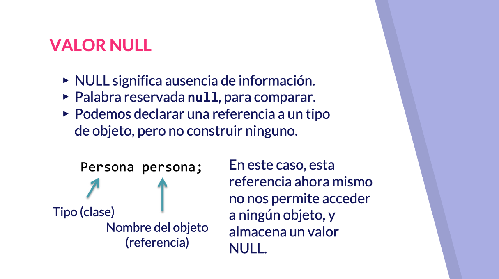

Ya que hemos presentado la referencia hacia objetos, podemos presentar el valor `null`, `null` significa que tenemos ausencia de información, que desconocemos una determinada información y además de representar eso, Java nos permite utilizar la palabra reservada `null` para poder comparar y saber si una determinada referencia de un objeto, realmente no está haciendo referencia a ningun objeto en particular sino que desconocemos a quién está haciendo referencia, con lo cual digamos que está almacenando un valor `null`. Eso también lo iremos utilizando a partir de ahora la palabra reservada `null` para saber si un objeto ya está instanciado y asociado a una referencia o si esa referencia, todavía no está asociada a ninguna.


Nos queda ver cómo por un lado van a interaccionar objetos, ya veremos que los objetos interaccionan como hemos dicho antes a través de un sistema de paso de mensaje y ese paso de mensajes no es más que un método pueda invocar a un método definido, dentro de otra clase. Cómo se invocaría, utilizaríamos el nombre de la referencia de ese objeto Persona punto y el nombre del método y a continuación los parentesis como tenemos aquí.

Si quisiéramos hacer nacer a una persona, que una persona hablara, que caminara y que murieras, las distintas operaciones de Persona, tendríamos que ejecutar esas llamadas a los métodos. 

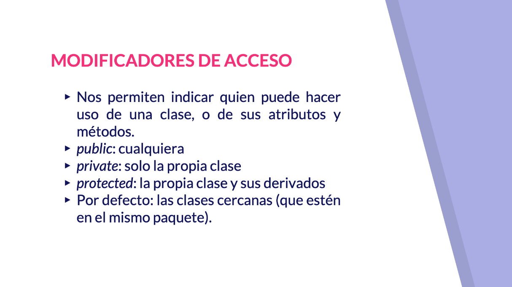

Hablábamos antes de modificadores de acceso y aquí podemos presentarlos, los cuatro que nos ofrece Java, si bien nosotros ahora los iremos utilizando un poco no a la ligera, pero sin saber muy bien a lo mejor que hace alguno hasta ganar algo más de experiencia, de hecho nos limitaremos a algunos de ellos, como es el de `public`, es decir cualquiera puede acceder a algún apartado de esa clase, `private` solamente la propia clase puede acceder, `protected` la propia clase y sus derivados o el modificador por defecto en el cual son las clases cercanas, las que esten en el mismo paquete, las que podrían haceder. 

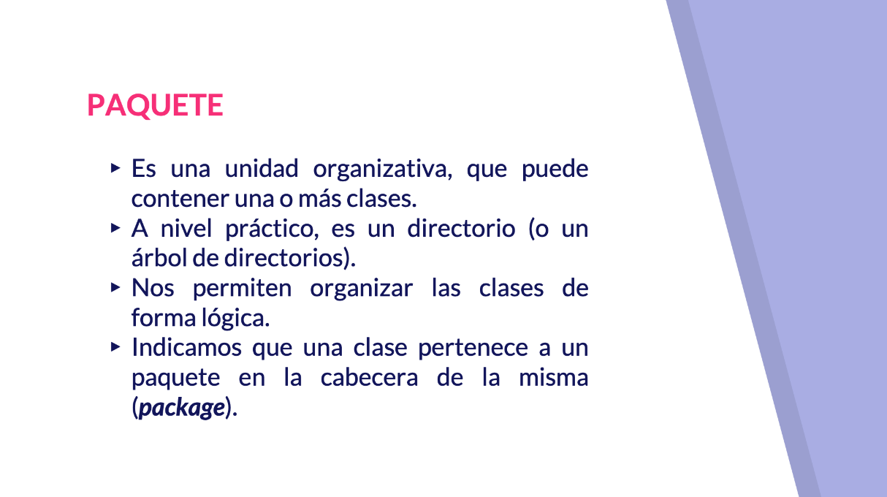

Y ya que habíamos hablado de organización de código, presentamos en su momento cuando hicimos nuestro primer ejemplo el concepto de paquete, lo recordamos ahora, un paquete es una unidad organizativa que va a contener una o más clases, si lo miramos sin Eclipse un paquete es un directorio o una sucesión de directorios dónde se almacenan clases, nos va a permitir organizar el código, organizar las clases de forma lógica, sobretodo guardando dentro del mismo paquete clases que suelan interaccionar entre ellas o que tengan algún tipo de relación, cierta cohesión. 

Para declarar un paquete, hemos visto que Eclipse nos da cierta ayuda cuando creamos una nueva clase, pero se hace en la cabecera de la misma mediante la palabra reservada `package`.

### :computer: `101-09-OrientacionObjetos`

Vamos a ver el ejemplo de creación de una Persona y como desde otro objeto en particular de una clase con un método `main` vamos a invocar los métodos de Persona.

*`Persona`*

```java
/**
 * Definición e implementación de una clase
 */
package objetos;

public class Persona {
   // Estructura, conocida como propiedades o atributos
   String nombre;
   String apellidos;
   int edad;
   int altura;
   float peso;

   // Comportamiento, conocido como métodos
   void caminar() {
      System.out.println("Estoy caminando");
   }

   void hablar() {
      System.out.println("Estoy hablando");
   }

   void nacer() {
      System.out.println("¡¡¡Acabo de nacer!!!");
   }

   void morir() {
      System.out.println("¡Hasta más ver!");
   }
}
```

En este caso tenemos la clase `Persona`, dentro del ejemplo de la orientación a objetos, dónde podemos identificar muy bien su estructura a través de una serie de propiedades y su comportamiento a través de una serie de métodos, **por ahora hemos dejado como modificador de acceso el por defecto, es decir no escribir nada, de manera que cualquier clase que esté en el mismo paquete podría acceder, el paquete en el cual estamos almacenando la clase Persona, el paquete `objetos`**.

Dentro de la estructura tenemos:

```java
// Estructura, conocida como propiedades o atributos
String nombre;
String apellidos;
int edad;
int altura;
float peso;
```

Son las propiedades que identifican a una Persona y como métodos tenemos:

```java
// Comportamiento, conocido como métodos
void caminar() {
   System.out.println("Estoy caminando");
}

void hablar() {
   System.out.println("Estoy hablando");
}

void nacer() {
   System.out.println("¡¡¡Acabo de nacer!!!");
}

void morir() {
   System.out.println("¡Hasta más ver!");
}
```

Hablaremos de los métodos más adelante pero si decir que si un método se va a limitar a hacer una serie de sentencias y no queremos que devuelva ningún tipo de valor, la ejecución de ese método utilizaríamos la palabra `void`, este caso cada método solamente va a realizar una sentencia, va a ejecutar una sentencia que es imprimir un mensaje, en referencia al nombre del método.

Con esto tendríamos implementada la clase Persona, vamos a tratar de utilizarla. Cómo utilizamos la persona, lo normal es que lo hagamos desde otra clase distinta, creamos una clase para poder crear objetos de ella dentro de métodos de otra clase. 

*`OrientacionObjetos`*

```java
package objetos;

public class OrientacionObjetos {

   public static void main(String[] args) {
      Persona persona = new Persona();
      Persona persona2 = new Persona();
      Persona persona3 = new Persona();

      persona.nacer();
      persona.hablar();
      persona.caminar();
      persona.morir();

      persona2.nacer();

      persona3.caminar();
   }
}
```

En particular esta otra clase `OrientacionObjetos` que es la clase que tiene el método `main`, es decir el punto de entrada a la ejecución y cómo podemos comprobar para instanciar una nueva persona lo haríamos utilizando el nombre de la clase, `Persona`, el nombre que le damos a la referencia, es decir `persona` es una variable de tipo `Persona` que vamos a poder utilizar en tanto en cuanto dure su ámbito, es decir en todo el método `main`, el operador de igualdad, la palabra `new` y haríamos referencia a la clase mediante lo que se conoce como su **constructor** que presentaremos en la siguiente lección.

```java
Persona persona = new Persona();
```

Ya tenemos lista esta persona podríamos interaccionar con ella invocando sus distintos métodos.

```java
persona.nacer();
persona.hablar();
persona.caminar();
persona.morir();
```

Veremos como imprimira sus mensajes.

Podríamos crear más objetos 

```java
Persona persona = new Persona();
Persona persona2 = new Persona();
Persona persona3 = new Persona();
```

Al igual que veíamos en la imagen de los globos que teníamos una clase Globo y un montón de globos o en la imagen de Personas que teníamos varias personas, podríamos crear varias instancias de Persona e interaccionar también con ellas, invocar sus métodos que producen mensajes, invocado el método nacer de la persona 2 y por último invocado el método caminar de persona 3.

```java
persona.nacer();
persona.hablar();
persona.caminar();
persona.morir();

persona2.nacer();

persona3.caminar();
```

Podríamos tener dos, tres o todas las instancias de una clase que nosotros necesitemos.

Vamos a ver la ejecución del programa.

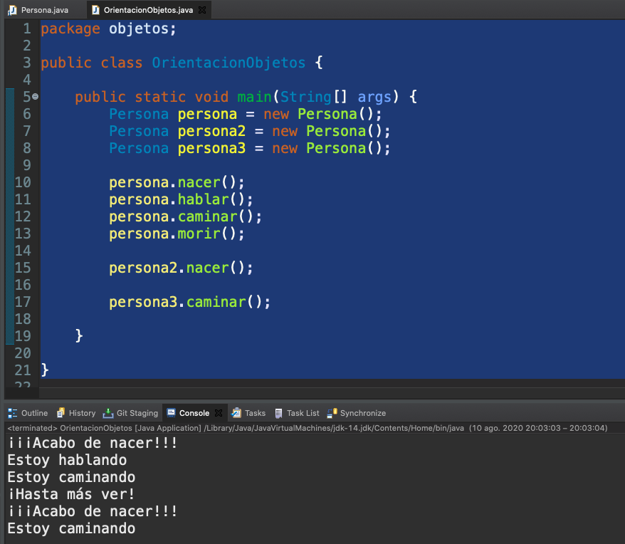

Terminamos la introducción a la orientación a objetos, poco a poco iremos hablando de las distintas partes que lo componen, los constructores, propiedades, métodos tipos de retorno, recepción de argumentos, etc.

# 10. Los constructores 9:07

[Los constructores](pdfs/10_Los_constructores.pdf)

## Resumen Profesor

### 10.1 Construcción de objetos

En orientación a objetos, la construcción de un objeto implica la inicialización de cero o más variables miembros de ese mismo objeto que estamos construyendo. Java, por sí mismo, solamente hace las gestiones oportunas en memoria; sin embargo, si queremos que ese nuevo objeto recién creado tenga valores inicializados, se los podemos proporcionar mediante un constructor.

### 10.2 Sintaxis

* Normalmente son `public`.
* Un constructor se llama **siempre** igual que el nombre de la clase a la cual construye.
* Pueden tener cero o más argumentos.

Nuestro IDE Eclipse, posee un asistente que nos puede ayudar a generar el código de constructores con parámetros.

### 10.3 *Puntero* `this`

Se trata de una forma de referenciar desde un objeto a sí mismo, tanto a sus variables miembro como a sus métodos. También nos sirve para poder utilizar un constructor desde otro. Por ejemplo:

```java
public class Persona {

   //Variables miembro


   // Constructor con algunos parámetros
   public Persona(String nombre, String apellidos) {
      this.nombre = nombre;
      this.apellidos = apellidos;
   }

   public Persona(String nombre, String apellidos, int edad) {
      this(nombre, apellidos); //Invoca al constructor con dos parámetros
      this.edad = edad;
   }
}
```

**El segundo constructor de este código utiliza el primer constructor. De esta forma reutilizamos código.**

## Transcripción


Vamos a continuar con el bloque de orientación a objeto hablando de los **constructores** y lo primero que creo que merece la pena que nos detengamos en responder a la pregunta *qué significa construir un objeto*.


Vamos a intentar ilustrando a través del gráfico, rescatemos la sentencia de instanciación de un objeto de tipo `Persona`, de la construcción de un objeto de tipo `Persona`, realmente esto está haciendo una operación ciertamente compleja por detrás en la memoria de nuestro ordenador y es que **almacena en dos sitios diferentes**, por un lado `persona` en minúscula que hemos dicho que es el nombre del objeto, **es una referencia hacia el objeto en si es decir esa referencia no es el objeto en si sino una manera de acceder al objeto** el objeto se crea en otra zona de memoria diferente conocida como `Heat` donde básicamente lo que vamos a encontrar son objetos almacenados y se construye a través del operador de instanciación y del constructor, de manera que podemos hablar con cierta garantía de lo que es la referencia, que como veis además ocupa siempre o de manera normal mucha menos memoria, que lo que es el objeto en sí, que al ser un tipo de dato estructurado pues seguramente ocupe un tamaño en memoria bastante más grande. 

Aprenderemos más adelante como para un mismo objeto podríamos incluso tener más de una referencia que nos llevará a el, nos basta ahora con que sepamos que **desde una referencia podemos acceder a un objeto** y que esta es la secuencia de operaciones que sucede cuando nosotros construimos un objeto, instanciamos un objeto. 


La construcción de los objetos se hace a través de **los métodos constructores, son unos métodos especiales**, en este caso hemos usado un constructor muy básico, **el constructor por defecto** de `Persona`, es tan básico que ni siquiera lo hemos tenido que implementar, habrá momentos en el que no sirva el constructor por defecto, sin embargo será muy natural que nosotros necesitemos crear constructores, implementar constructores que sean diferentes al por defecto y que nos sirvan para inicializar valores.

Como decíamos antes los constructores son métodos especiales, no se invocan de cualquier manera, requieren del uso del operador `new`, se ejecutan para crear objetos, es decir se ejecutan solamente en ese momento, deben servir también para inicializar los valores de las propiedades del objeto, lo normal es que sean públicos, sera muy raro el caso donde no queramos que lo sea, veremos que pueden recibir argumentos o no recibirlos, los argumentos podrían servir para dar un valor inicial a sus propiedades, también podremos ver que puede haber más de un constructor, es decir puede haber lo que se conoce como **sobrecarga de constructores** y por último lo que más suele gustar a los programadores que empiezan es que Eclipse nos ayuda tanto, que incluso no tenemos que escribirlo nosotros sino que podemos generarlo.

 

La palabra reservada `this` es necesaria conocerla antes de ver algún ejemplo de constructores, para poder diferenciar muy bien en el caso sobre todo de los constructores cuando estamos recibiendo un argumento, para poder diferenciar muy bien que estamos haciendo referencia de dentro del constructor a una propiedad o estamos haciendo referencia a uno de los valores que hemos recibido como argumento tenemos la palabra reservada `this`.

`this` es una palabra que nos hace falta para hacer referencia a un objeto desde dentro, de sí mismo, nos va ayudar mucho a poder realizar lo que conocíamos como encapsulación, a que un objeto se conozca a sí mismo.

### :computer: `101-10-Constructores`

*`Persona`*

```java
/**
 * Definición e implementación de una clase
 */
package constructores;

public class Persona {
   // Estructura, conocida como propiedades o atributos
   private String nombre;
   private String apellidos;
   private int edad;
   private int altura;
   private float peso;

   // Constructor vacío
   public Persona() {
      this.nombre = "desconocido";
      this.apellidos = "desconocido";
      this.edad = 0;
   }

   // Constructor con algunos parámetros
   public Persona(String nombre, String apellidos) {
      this.nombre = nombre;
      this.apellidos = apellidos;
   }

   public Persona(String nombre, String apellidos, int edad) {
      this(nombre, apellidos);
      this.edad = edad;
   }

   public Persona(String nombre, String apellidos, int edad, int altura, float peso) {
      this.nombre = nombre;
      this.apellidos = apellidos;
      this.edad = edad;
      this.altura = altura;
      this.peso = peso;
   }

   // Comportamiento, conocido como métodos
   void caminar() {
      System.out.println("Estoy caminando");
   }

   void hablar() {
      System.out.println("Estoy hablando");
   }

   void nacer() {
      System.out.println("¡¡¡Acabo de nacer!!!");
   }

   void morir() {
      System.out.println("¡Hasta más ver!");
   }

   void presentacion() {
      System.out.println("Mi nombre es " + this.nombre + " " + this.apellidos + ", y tengo " + this.edad + " años de edad.");
   }
}
```

Para la clase `Persona` hemos añadido algunos modificadores de acceso, la clase es pública, cualquiera puede acceder a ella, sin embargo su estructura pasa a ser privada, estamos empezando a aplicar encapsulación, no cualquier objeto puede acceder a las propiedades, a la estructura de un objeto `Persona`, el mismo si y para hacerlo utilizamos el puntero `this`.

Vamos a hacer varios constructores, el primer constructor será un **constructor** de los que se llaman **vacío**, se llama vacío porque no va a incluir ningún argumento, no va a recibir ningún argumento, en este caso bueno para no utilizar valores `null` en las distintas propiedades `String` lo que podemos hacer es inicializarlo a una serie de valores por defecto, en este caso por ejemplo `desconocido`.

Tenemos algunos otros constructores, cómo podéis comprobar **un consultor siempre se llama como la clase en la cual está definido**, algunos constructores con parámetros. ¿Cuántos constructores podemos tener? podemos tener varios, siempre se llaman igual y para que podamos diferenciar uno de otro, siempre tienen que tener o un número diferente de argumentos, en nuestro ejemplo tenemos un constructor sin argumentos otro que tiene dos y otro que tiene tres, o si tuvieran el mismo número de argumentos, los tipos de los datos que reciben deberían ser diferentes.

Los constructores con argumentos nos permiten inicializar algunas propiedades como el nombre o los apellidos y el de tres argumentos permite inicializar el nombre, los apellidos y la edad.

En el constructor con tres argumentos:

```java
public Persona(String nombre, String apellidos, int edad) {
   this(nombre, apellidos);
   this.edad = edad;
}
```

Tiene una expresión algo rara:

```java
this(nombre, apellidos);
```

y es que, si se nos da el caso de que tenemos un constructor con un número de parámetros y en un constructor posterior vamos a realizar esa misma operación, es decir en este caso construir un objeto `Persona` con nombre y apellidos y algún atributo adicional, podemos hacer referencia al constructor anterior, desde aquí dentro mediante esta estructura, para no tener que volver a escribir el bloque de código, alguien dirá que se podría copiar y pegar, pero veremos con el devenir de las diferentes lecciones que **copiar y pegar no es una buena práctica sino que es mejor práctica reutilizar el código** por lo que usando el `this` de esta manera podríamos reutilizariamos el código y al construir este objeto de `Persona` con tres argumentos utilizaríamos este constructor, pero este a su vez usa el constructor con dos argumentos.

Para que Eclipse nos ayude con la creación de constructores usamos la opción 

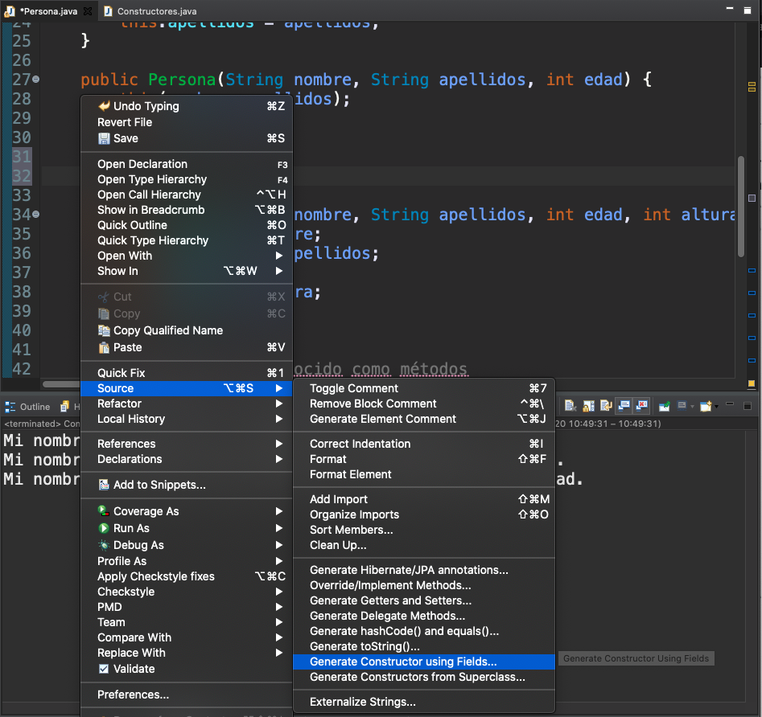

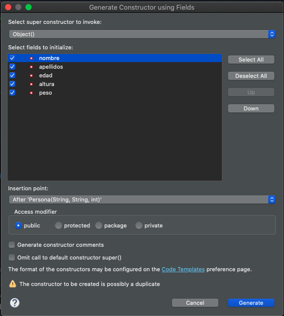

Y se insertara el constructor con las propiedades indicadas.

Para usar la clase `Persona` y sus diferentes constructores tenemos la siguiente clase.

*`Constructores`*

```java
public class Constructores {
   public static void main(String[] args) {

      Persona johndoe = new Persona();
      johndoe.presentacion();

      Persona manuel = new Persona("Manuel", "Ruiz González");
      manuel.presentacion();

      Persona antonio = new Persona("Antonio", "Castillo Real", 31);
      antonio.presentacion();
      
   }
}
```

Al ejecutar el programa tenemos.

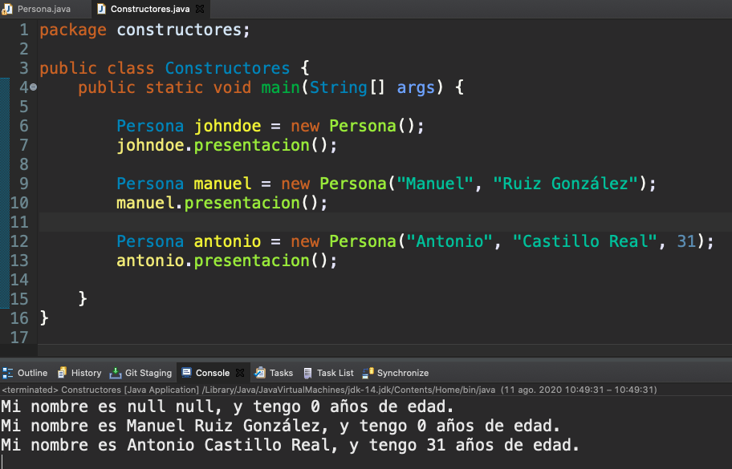

Con esto terminamos el capítulo de constructores y uso del puntero `this` y nos lanzamos de lleno al uso de métodos y a la definición de propiedades de una clase.

## 11. Getters y setters 14:28 

[Getters y setters](pdfs/11_Propiedades_y_metodos.pdf)

## Resumen Profesor

### 11.1 Métodos y atributos

Tal y como hemos aprendido en lecciones anteriores, los métodos se corresponden con el *comportamiento* de una clase, y los atributos (o propiedades) con su *estructura*.

La encapsulación nos recomienda que el trato con los objetos sea siempre a través de métodos; y dado que la estructura interna de un objeto solamente la conoce el mismo, los atributos se deberían consultar o editar siempre a través de métodos.

### 11.2 Propiedades o atributos

Tienen la siguiente sintaxis genérica:

```
modificadorDeAtributo tipoAtributo nombreAtributo;
```

donde:

* `modificadorDeAtributo` puede ser **`private`** (casi siempre), `protected`, `public` o por defecto (es decir, que puede acceder las clases del mismo paquete).

* `tipoAtributo` puede ser un tipo primitivo (`int`, `float`, `char`, `String`) u otra clase.

* `nombreAtributo` debería estar escrito en notación *camelCase* y ser autodescriptivo.

### 11.3 Métodos

Tienen la siguiente sintaxis genérica:

```java
modificador[es]DeMetodo tipoRetorno nombreMedoto(tipo1 param1, tipo2, param2, ...){
  //...
}
```

donde:

* `modificador[es]DeMetodo` puede ser, por un lado **`public`** (casi siempre), `protected`, `private` o por defecto (es decir, que puede acceder las clases del mismo paquete). Además, estos valores pueden ir acompañados de `static`, `abstract`, `final`, `native`, `synchronized`.

* `tipoRetorno` puede ser un tipo primitivo (`int`, `float`, `char`, `String`), otra clase o `void` (es decir, que no devuelve nada).

* `nombreMetodo` debería estar escrito en notación *camelCase* y ser autodescriptivo.

* Los parámetros recibidos, `tipo1 param1, tipo2 param2, ...` siguen las mismas indicaciones que `tipoRetorno` y `nombreAtributo`.

#### 11.3.1 Métodos getters/setters

Son unos métodos especiales, pero sencillos, que nos permiten consultar cualquier atributo de una clase, así como asignarle un nuevo valor. Pueden autogenerarse con Eclipse.

#### 11.3.2 `toString()`

Se trata de un método especial, que sirve para obtener, en un solo valor de tipo String, una representación de un objeto. Eclipse también incluye un asistente para generarlo, si nos fuera preciso.

## Transcripción


Continuamos con el uso de clases y objetos y vamos a profundizar un poco en las propiedades y en los métodos de una clase.

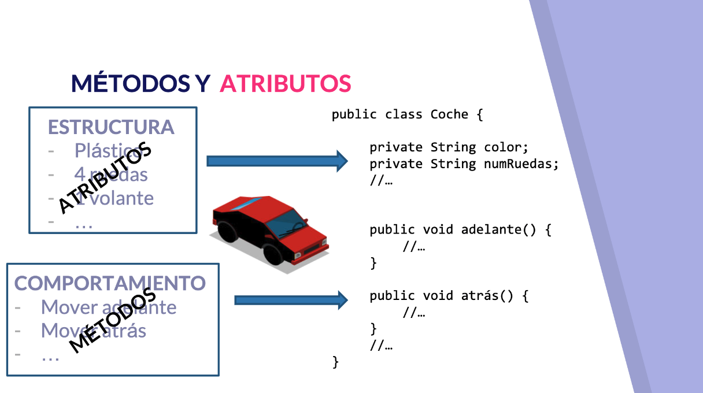

Cuando hablamos de objetos en la lección de orientación a objetos como tal hablamos que **los objetos vienen definidos por un lado su estructura y por otro lado su comportamiento** hablando ya de objetos en Java, de clases y objetos en Java, podemos hacer una cazación perfecta entre **la estructura de un objeto de una clase con los atributos que va a tener esta clase y entre el comportamiento y los diferentes métodos**, de manera bueno que ya tendríamos identificada cada una de las partes que tenía ese objeto a nivel teórico.


Si recordáis la encapsulación hacía que un objeto ocultara gran parte de su estructura ofreciendo solamente una pequeña parte a los demás, pues bien si unimos este concepto con el de paso de mensaje, podemos comprobar como el trato entre objeto se realiza a través de los métodos, es decir un objeto interacciona con otro invocando uno de esos métodos, ya lo hemos visto también utilizando en alguno de las 
lecciones anteriores la clase persona e invocando sus métodos, lo normal es que los atributos de un objeto se oculten haciendolos privado y se consulten o se editen a través de una serie de métodos que veremos y conoceremos a continuación.


Pacemos primero por las propiedades, las propiedades conforman la estructura de una clase y la sintaxis normal de la declaración de una propiedad dentro de una clase tendrá siempre para cada propiedad 3 partes, **el modificador del atributos su modificador de acceso** si es privado, público, si es por defecto o protected que lo estudiaremos en herencia, **el tipo de datos del atributo** si es un tipo de dato primitivo como  char, int, float, double, String e incluso otra clase, porque veremos que las clases se pueden componer, una y otra y por último tendremos **el nombre de ese atributo** como tal seguirá siempre las mismas reglas que conocemos y que estén en notación camelCase y terminaría con un punto y coma. Ya hemos visto la declaración de algunas propiedades como tenemos por aquí dentro de la clase `Persona`.

```java
private String nombre;
private String apellidos;
private int edad;
private int altura;
private float peso;
```

Además no es obligatorio pero usualmente se definen primero las propiedades y luego los métodos, tenemos las propiedades de una `Persona` es decir su modificador de acceso, su tipo y el nombre de la propiedad y su punto y coma, a continuación en otra línea la siguiente y la siguiente y así todas las propiedades de la clase `Persona`.


Continuemos ahora conociendo los métodos, los métodos que conforman el comportamiento de la clase van a tener una estructura algo parecida si bien es posible que podamos incluir algunos elementos adicionales. Como es natural en principio debería llevar **los modificadores de acceso** del método público, privado protegido, por defecto **adicionalmente** podremos utilizar alguna de las palabras reservadas que tenemos también aquí y que darán **un carácter especial u otro al método**, por ahora no las vamos a conocer pero está bien que sepamos que pueden estar ahí por si nos lo encontramos, método estático, métodos abstractos, método finales, nativos, sincronizados, tenemos un gran conjunto de ellos podemos pasamos ahora a los **tipos de retorno** y es que los métodos los podemos hacer para que no devuelvan ningún valor o los podemos hacer para que el resultado produzca algo, lo que tenemos que indicar cuando definimos un método es el el tipo de dato que va a devolver, sino devuelve nada diremos que devuelve vacío `void`, si devuelve puede devolver un tipo primitivo como char, int, float, double, String e incluso otra clase, a continuación tendríamos el nombre del método


# 12. Ciclo de vida de un objeto 6:27 

[Ciclo de vida de un objeto](pdfs/12_Ciclo_de_vida.pdf)

## Resumen Profesor

### 12.1 Ciclo de vida de un objeto

En Java, cualquier objeto tiene un ciclo de vida, pasado por los estados de creación, uso y destrucción.

Para la creación, solo tenemos que hacer uso del operador `new`. Es Java quien se encarga de realizar todas las operaciones necesarias en memoria.

Un objeto está vivo, accesible y en uso mientras dure el ámbito en el que fue creado. Si creamos un objeto en el método `main` de una aplicación, estará *vivo* hasta que finalice la ejecución del mismo. Si por el contrario, lo creamos en el método de una otra clase, finalizará cuanto termine la ejecución del mismo.

Cuando finaliza el ámbito donde fue definido un método, este se marca como *no util* y es candidato a ser liberado por el *garbage collector*, un proceso de baja prioridad de la JVM que se encarga de liberar la memoria ocupada por estos objetos.

## Transcripción


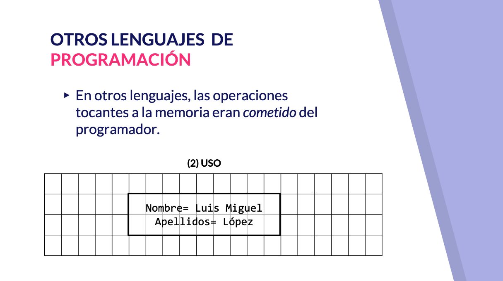

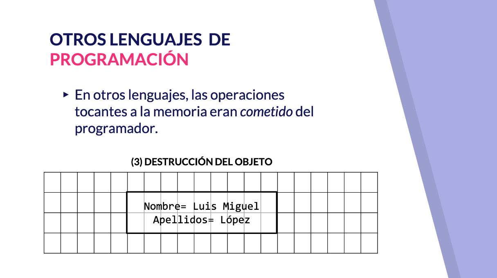


# 13. Uso de clases envoltorio 5:31 

[Uso de clases envoltorio](pdfs/13_Uso_de_las_clases_envoltorio.pdf)

## Resumen Profesor

### 13.1 Clases envoltorio

Java nos ofrece una clase para cada uno de los tipos primitivos:

Tipo Primitivo | Clase Envoltorio
---------------|-----------------
boolean | Boolean
char | Character
byte | Byte
short | Short
int | Integer
long | Long
float | Float
double | Double

Entre otras funcionalidades, nos ofrecen muchos métodos para transformar y operar con los tipos primitivos. Además, más adelante comprobaremos que son útiles con las colecciones y otros contenedores de objetos.

## Transcripción


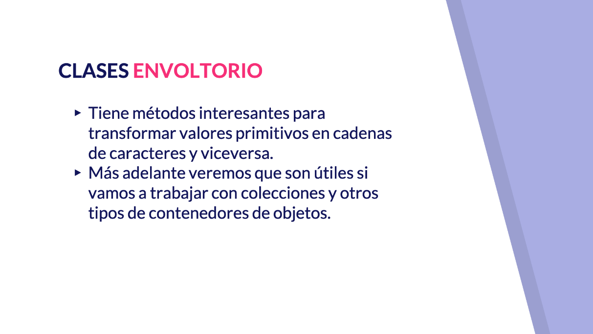

## Contenido adicional 5

[Orientación de objetos](pdfs/09_Orientación_a_objetos.pdf)

[Los constructores](pdfs/10_Los_constructores.pdf)

[Getters y setters](pdfs/11_Propiedades_y_metodos.pdf)

[Ciclo de vida de un objeto](pdfs/12_Ciclo_de_vida.pdf)

[Uso de clases envoltorio](pdfs/13_Uso_de_las_clases_envoltorio.pdf)
