# 3. Clases y objetos 58m

* Orientación de objetos 22:58 
* Los constructores 9:07 
* Getters y setters 14:28 
* Ciclo de vida de un objeto 6:27 
* Uso de clases envoltorio 5:31 
* Contenido adicional 5

## 9. Orientación de objetos 22:58

[Orientación de objetos](pdfs/09_Orientación_a_objetos.pdf)

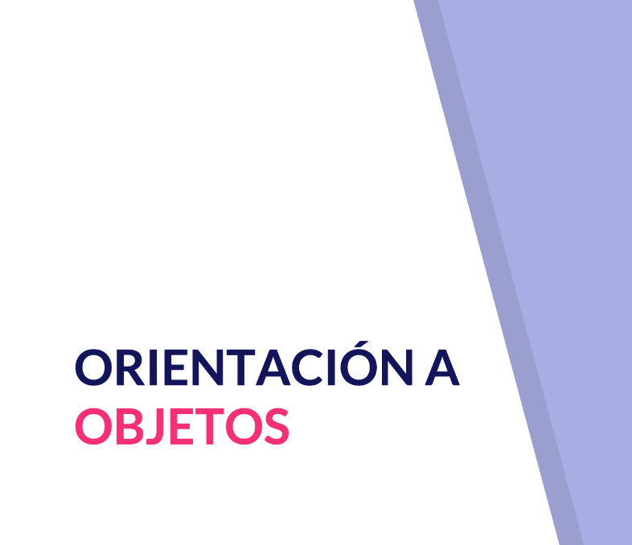

### 9.1 Paradigma de programación Orientada a Objetos


**Un *paradigma* es un modelo, una manera de entender las cosas. El *paradigma de programación orientada a objetos* es aquel por el cual todos los elementos que manejamos en nuestro programa son *objetos*. Estos no son más que *instancias* construidas a través de un molde, que llamamos *clase*.**

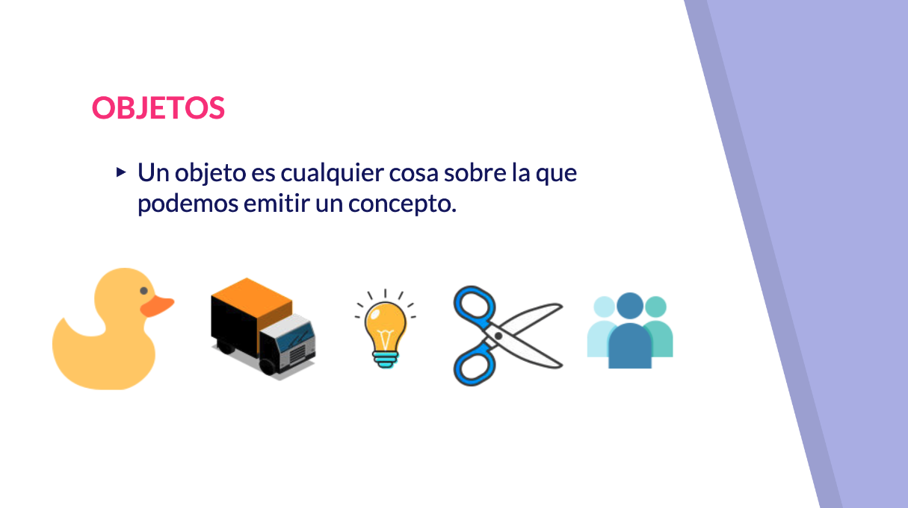

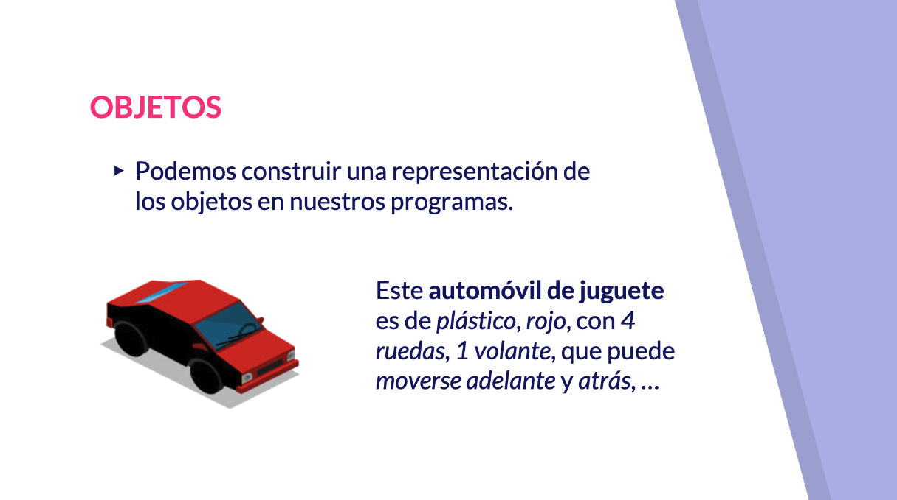

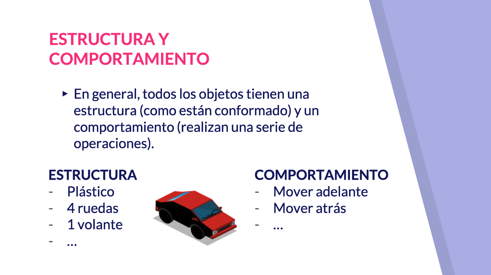

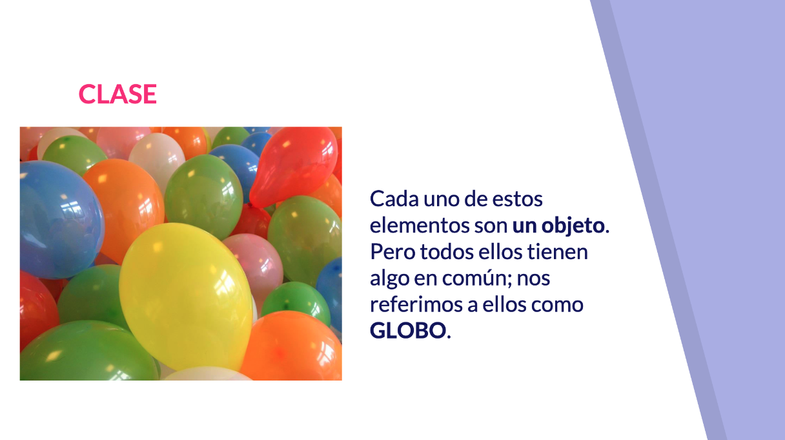


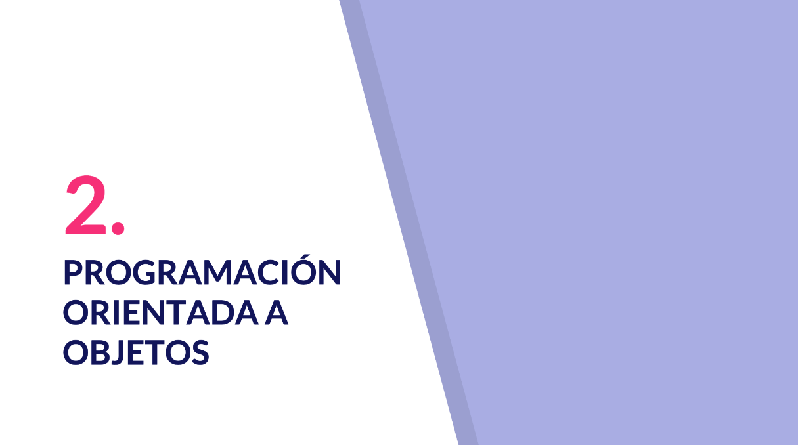


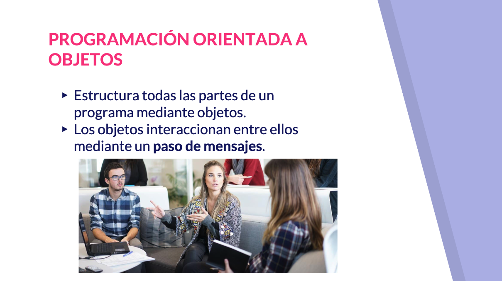


### 9.2 Clases en Java


Una clase en Java tiene la siguiente estructura:

```java
<modificador> class NombreDeLaClase {

    //propiedades
    int propiedad1;
    String propiedad2;
    float propiedad3;
    //…

    //metodos
    void metodo1() {
        //…
    }

    //…
}
```

### 9.3 Objetos


Los objetos, que no son más que instancias de clases, tienen que ser creados (instanciados) por el programador, y almacenados en una referencia (muy similar a una variable).

```java
Persona persona = new Persona();
```

### 9.4 Valor null


Si declaramos una referencia, pero no construimos ningún objeto en ese momento, obtenemos una referencia nula, o con valor `null`. Además, es una palabra reservada que podemos usar para comparar.

```java
Persona persona;
```

### 9.5 Interacción entre objetos


Los objetos suelen interactuar los unos con los otros. Esto lo realizan mediante un mecanismo llamado *paso de mensajes*, que en la práctica es que, desde el cuerpo de una clase, estamos invocando a un método de otra clase.

### 9.6 Modificadores de acceso


Tanto a nivel de clase, como de atributos y métodos, Java pone a nuestra disposición una serie de *modificadores de acceso*, que harán que no cualquier clase pueda acceder a otra.

Modificador | Descripción
------------|------------
`public`: |  Es el menos restrictivo. Cualquiera puede acceder a esa clase o método.
`protected`:  | Solo puede acceder a ese método o atributo la propia clase, o una que herede de ella.
`private`: | Solo puede acceder a ese método o atributo la propia clase.
`default`: | Es decir, sin modificador de acceso - pueden acceder a esa clase todas las del mismo *paquete*.

### 9.7 Paquete


Es una agrupación de clases. Indicamos que una clase pertenece a un paquete mediante la palabra reservada `package` en la primera línea de código de la clase:

```java
package paquete;

class Clase {

  //...

}
```

## Los constructores 9:07

[Los constructores](pdfs/10_Los_constructores.pdf)


### 10.1 Construcción de objetos

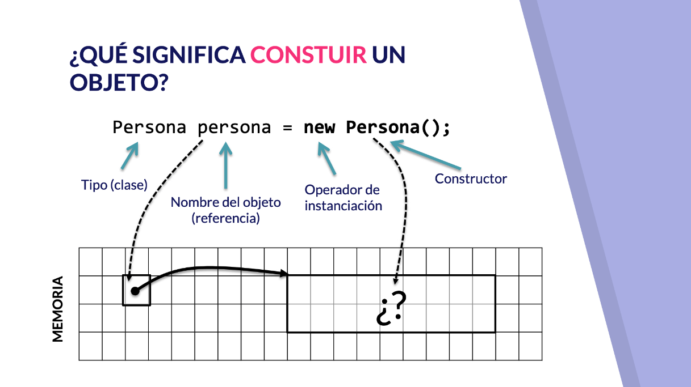


En orientación a objetos, la construcción de un objeto implica la inicialización de cero o más variables miembros de ese mismo objeto que estamos construyendo. Java, por sí mismo, solamente hace las gestiones oportunas en memoria; sin embargo, si queremos que ese nuevo objeto recién creado tenga valores inicializados, se los podemos proporcionar mediante un constructor.

### 10.2 Sintaxis

* Normalmente son `public`.
* Un constructor se llama **siempre** igual que el nombre de la clase a la cual construye.
* Pueden tener cero o más argumentos.

Nuestro IDE, eclipse, posee un asistente que nos puede ayudar a generar el código de constructores con parámetros.

### 10.3 *Puntero* `this`


Se trata de una forma de referenciar desde un objeto a sí mismo, tanto a sus variables miembro como a sus métodos. También nos sirve para poder utilizar un constructor desde otro. Por ejemplo:

```java
public class Persona {

  //Variables miembro


    // Constructor con algunos parámetros
    public Persona(String nombre, String apellidos) {
        this.nombre = nombre;
        this.apellidos = apellidos;
    }

    public Persona(String nombre, String apellidos, int edad) {
        this(nombre, apellidos);
        this.edad = edad;
    }
}
```

El segundo constructor de este código utiliza el primer constructor. De esta forma reutilizamos código.

## Getters y setters 14:28 

[Getters y setters](pdfs/11_Propiedades_y_metodos.pdf)

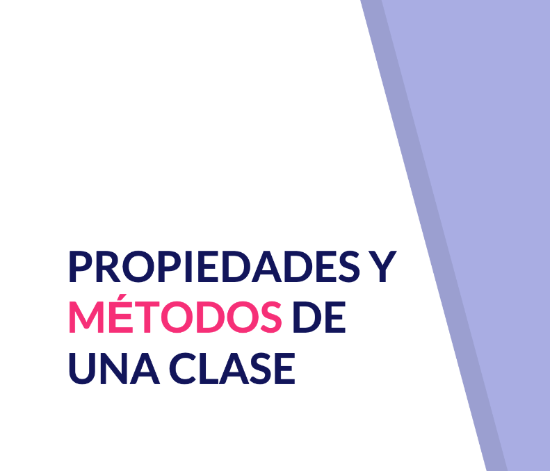

### 11.1 Métodos y atributos


Tal y como hemos aprendido en lecciones anteriores, los métodos se corresponden con el *comportamiento* de una clase, y los atributos (o propiedades) con su *estructura*.

La encapsulación nos recomienda que el trato con los objetos sea siempre a través de métodos; y dado que la estructura interna de un objeto solamente la conoce el mismo, los atributos se deberían consultar o editar siempre a través de métodos.

### 11.2 Propiedades o atributos


Tienen la siguiente sintaxis genérica:

```
modificadorDeAtributo tipoAtributo nombreAtributo;
```

donde:

* `modificadorDeAtributo` puede ser **`private`** (casi siempre), `protected`, `public` o por defecto (es decir, que puede acceder las clases del mismo paquete).

* `tipoAtributo` puede ser un tipo primitivo (`int`, `float`, `char`, `String`) u otra clase.

* `nombreAtributo` debería estar escrito en notación *camelCase* y ser autodescriptivo.

### 11.3 Métodos


Tienen la siguiente sintaxis genérica:

```java
modificador[es]DeMetodo tipoRetorno nombreMedoto(tipo1 param1, tipo2, param2, ...){
  //...
}
```

donde:

* `modificador[es]DeMetodo` puede ser, por un lado **`public`** (casi siempre), `protected`, `private` o por defecto (es decir, que puede acceder las clases del mismo paquete). Además, estos valores pueden ir acompañados de `static`, `abstract`, `final`, `native`, `synchronized`.

* `tipoRetorno` puede ser un tipo primitivo (`int`, `float`, `char`, `String`), otra clase o `void` (es decir, que no devuelve nada).

* `nombreMetodo` debería estar escrito en notación *camelCase* y ser autodescriptivo.

* Los parámetros recibidos, `tipo1 param1, tipo2 param2, ...` siguen las mismas indicaciones que `tipoRetorno` y `nombreAtributo`.

#### 11.3.1 Métodos getters/setters


Son unos métodos especiales, pero sencillos, que nos permiten consultar cualquier atributo de una clase, así como asignarle un nuevo valor. Pueden autogenerarse con Eclipse.

#### 11.3.2 `toString()`


Se trata de un método especial, que sirve para obtener, en un solo valor de tipo String, una representación de un objeto. Eclipse también incluye un asistente para generarlo, si nos fuera preciso.

## Ciclo de vida de un objeto 6:27 

[Ciclo de vida de un objeto](pdfs/12_Ciclo_de_vida.pdf)


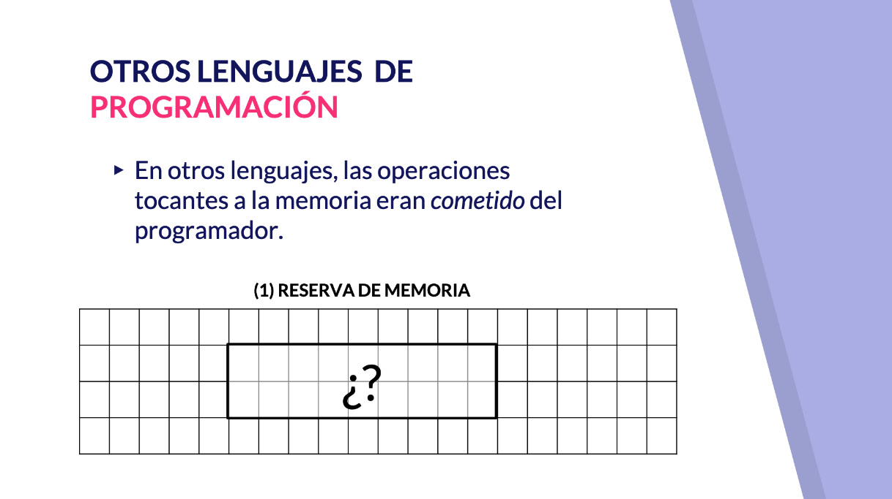


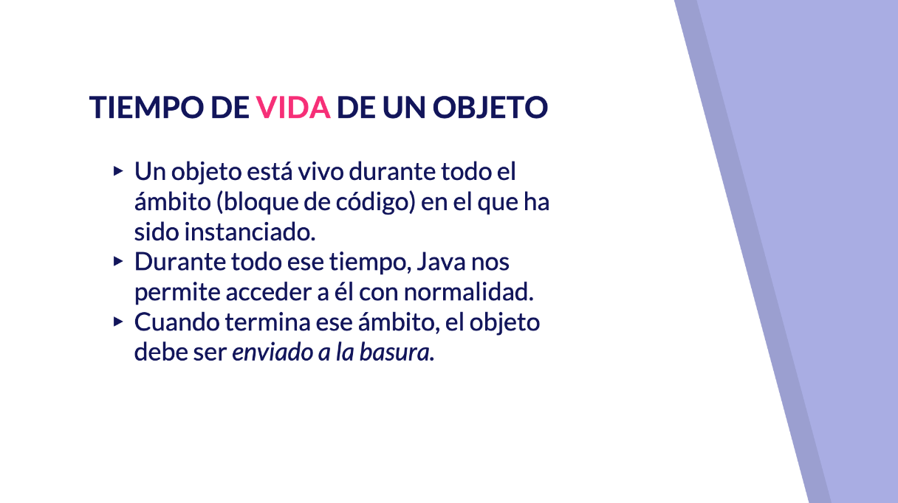

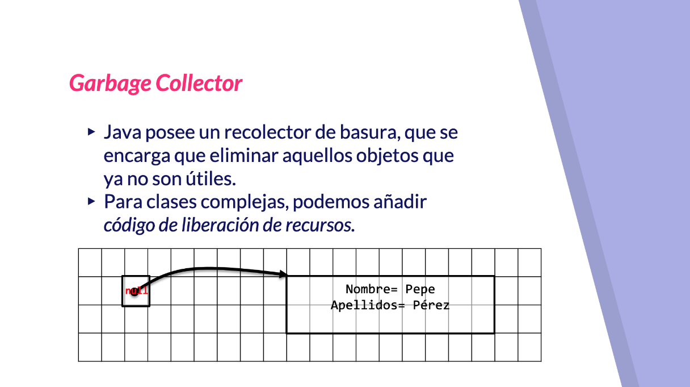

### 12.1 Ciclo de vida de un objeto

En Java, cualquier objeto tiene un ciclo de vida, pasado por los estados de creación, uso y destrucción.

Para la creación, solo tenemos que hacer uso del operador `new`. Es Java quien se encarga de realizar todas las operaciones necesarias en memoria.

Un objeto está vivo, accesible y en uso mientras dure el ámbito en el que fue creado. Si creamos un objeto en el método `main` de una aplicación, estará *vivo* hasta que finalice la ejecución del mismo. Si por el contrario, lo creamos en el método de una otra clase, finalizará cuanto termine la ejecución del mismo.

Cuando finaliza el ámbito donde fue definido un método, este se marca como *no util* y es candidato a ser liberado por el *garbage collector*, un proceso de baja prioridad de la JVM que se encarga de liberar la memoria ocupada por estos objetos.

## Uso de clases envoltorio 5:31 

[Uso de clases envoltorio](pdfs/13_Uso_de_las_clases_envoltorio.pdf)

### 13.1 Clases envoltorio


Java nos ofrece una clase para cada uno de los tipos primitivos:

Tipo Primitivo | Clase Envoltorio
---------------|-----------------
boolean | Boolean
char | Character
byte | Byte
short | Short
int | Integer
long | Long
float | Float
double | Double


Entre otras funcionalidades, nos ofrecen muchos métodos para transformar y operar con los tipos primitivos. Además, más adelante comprobaremos que son útiles con las colecciones y otros contenedores de objetos.

## Contenido adicional 5

[Orientación de objetos](pdfs/09_Orientación_a_objetos.pdf)

[Los constructores](pdfs/10_Los_constructores.pdf)

[Getters y setters](pdfs/11_Propiedades_y_metodos.pdf)

[Ciclo de vida de un objeto](pdfs/12_Ciclo_de_vida.pdf)

[Uso de clases envoltorio](pdfs/13_Uso_de_las_clases_envoltorio.pdf)
