# 3. Clases y objetos 58m

* 09 Orientación de objetos 22:58 
* 10 Los constructores 9:07 
* 11 Getters y setters 14:28 
* 12 Ciclo de vida de un objeto 6:27 
* 13 Uso de clases envoltorio 5:31 
* Contenido adicional 5

# 9. Orientación de objetos 22:58

[Orientación de objetos](pdfs/09_Orientación_a_objetos.pdf)

## Resumen Profesor

### 9.1 Paradigma de programación Orientada a Objetos

**Un *paradigma* es un modelo, una manera de entender las cosas. El *paradigma de programación orientada a objetos* es aquel por el cual todos los elementos que manejamos en nuestro programa son *objetos*. Estos no son más que *instancias* construidas a través de un molde, que llamamos *clase*.**

### 9.2 Clases en Java

Una clase en Java tiene la siguiente estructura:

```java
<modificador> class NombreDeLaClase {

    //propiedades
    int propiedad1;
    String propiedad2;
    float propiedad3;
    //…

    //metodos
    void metodo1() {
        //…
    }

    //…
}
```

### 9.3 Objetos

Los objetos, que no son más que instancias de clases, tienen que ser creados (instanciados) por el programador, y almacenados en una referencia (muy similar a una variable).

```java
Persona persona = new Persona();
```

### 9.4 Valor null

Si declaramos una referencia, pero no construimos ningún objeto en ese momento, obtenemos una referencia nula, o con valor `null`. Además, es una palabra reservada que podemos usar para comparar.

```java
Persona persona;
```

### 9.5 Interacción entre objetos

Los objetos suelen interactuar los unos con los otros. Esto lo realizan mediante un mecanismo llamado *paso de mensajes*, que en la práctica es que, desde el cuerpo de una clase, estamos invocando a un método de otra clase.

### 9.6 Modificadores de acceso

Tanto a nivel de clase, como de atributos y métodos, Java pone a nuestra disposición una serie de *modificadores de acceso*, que harán que no cualquier clase pueda acceder a otra.

Modificador | Descripción
------------|------------
`public`: |  Es el menos restrictivo. Cualquiera puede acceder a esa clase o método.
`protected`:  | Solo puede acceder a ese método o atributo la propia clase, o una que herede de ella.
`private`: | Solo puede acceder a ese método o atributo la propia clase.
`default`: | Es decir, sin modificador de acceso - pueden acceder a esa clase todas las del mismo *paquete*.

### 9.7 Paquete

Es una agrupación de clases. Indicamos que una clase pertenece a un paquete mediante la palabra reservada `package` en la primera línea de código de la clase:

```java
package paquete;

class Clase {

  //...

}
```

## Transcripción


Vamos a dar comienzo a un nuevo bloque y es que ya hemos nombrado en alguna ocasión antes que Java es un lenguaje orientado a objetos.


Pero qué es eso de la orientación a objetos, hablemos primero un poco de lo que es comprender el mundo de los objetos.


Un objeto es cualquier cosa, cualquier cosa sobre la que podemos emitir un concepto, un objeto puede ser un pato, un camión, una bombilla, unas tijeras, una persona, una ventana, una impresora, un botón todo ello lo podríamos tratar como un objeto no tiene porqué ser algo tangible, sino algo sobre lo que podemos emitir un concepto, la temperatura en el día de hoy máxima y mínima, también lo podríamos incluso tratar como un objeto, los objetos son algo que nos viene bien a nivel natural como ser humano, sobre todo los que son tangibles, los que podemos tocar y a nivel de programación pues vamos a poder construir representaciones de esos objetos y manejarlos en nuestros programas. 


Tenemos un automóvil de juguete, de plástico, es de color rojo, tiene cuatro ruedas, con volante y además se puede mover hacia delante y hacia atrás, puede hacer sonar el claxon, encender las luces, arrancar y parar el motor.


Con lo cual podemos ir viendo como dentro de un objeto podemos diferenciar dos partes que son elementales y que son comunes a cualquier objeto, que es **una parte estructural estática y una parte de comportamiento que es más bien dinámica, relacionada con el hacer cosas, mientras que la estructura es más bien con el ser**, en el fondo la estructural es cómo está conformado ese objeto y el comportamiento es la serie de operaciones que realiza, por ejemplo a nivel estructural el objeto coche que tenemos representado es de material plástico, su número de ruedas es cuatro, tiene un volante y a nivel de comportamiento como decíamos se puede mover hacia atras, hacia delante, etc., es decir que de los objetos podemos identificar **estructura** por un lado y **comportamiento** por el otro.


Parejo al concepto de objerto tenemos el **concepto de clase** fijemonos en la imagen que aparece, tenemos un montón de globos, cada uno de ellos podríamos decir que es un objeto, los hay rojos, los hay amarillo, cada uno de ellos es un objeto, pero todos ellos tienen algo en común y es que nos referimos a ellos como como globo, el nombre, ese concepto mental, podríamos decir que es común Globo, si bien después tenemos un montón de globos sueltos, imaginar lo que disfrutaría un niño con toda esa cantidad de globos, porque son objetos diferentes, sin embargo conceptualmente los llamamos de una manera igual.


Pues bien **podríamos decir que una clase no es más que el molde con el que podemos construir objetos de un tipo determinado**, la clase globo nos permitiría construir un montón de globos diferentes, la clase coche nos permitirá construir coches diferentes, **el molde es quién va a determinar las características estructurales y el comportamiento que podrán tener los objetos que construyamos con ese molde**, ese molde como tal no es un objeto, sino que simplemente nos sirve para poder construir objetos de un tipo determinado de esa clase.


Y para diferenciar entre clase y objeto, una clase sería una representación, por ejemplo de una persona, donde a nivel estructural querríamos saber su nombre, su edad, el color de la piel, la profesión, el estado civil, a nivel de comportamiento podríamos identificar que una persona puede hablar, puede caminar, puede mirar, pueden nacer, puede morir y todo ello vendría representado dentro de ese molde para fabricar personas, la clase, como objetos de la clase persona, pues podríamos tener los tres que están representados mediante imágenes, con nombres diferentes, edades diferentes, color de piel en algún caso similar y en otros diferente, con prefesiones distintas, incluso con su estado civil, si bien todos ellos podrían hablar, caminar, mirar, nacer, morir y realizar todas las operaciones que pueden hacer o que están definidas dentro de la clase. La clase como decimos sirve como molde para construir objetos.


Cómo podemos utilizar o como podemos embeber este mundo de los objetos a la programación de aplicación, mediante la programación orientado a objetos.


¿Qué es un paradigma? Un paradigma no es más que un modelo, es una forma de entender una tarea que se afronta, en particular el paradigma en programación es una forma en la que se entiende, en la que hay que estructurar un programa. Existen múltiples tipos de paradigmas asociados a programación, tenemos la programación imperativa, la programación lógica o declarativa, la programación orientada a eventos o aspectos, la programación funcional muy de moda últimamente aunque no es precisamente nueva y tenemos también la programación orientada a objetos.


En la programación orientada a objetos lo que hacemos es estructurar nuestros programas mediante el uso de clases, de manera que nuestros programas contienen más de una clase, los objetos interaccionan entre ellos mediante el paso de mensajes, retomando el símil que teníamos antes con la clase persona y los objetos distintos de personas, los objetos concretos y el paso de mensajes que tenemos ahora, las personas que  interaccionan entre ellas mediante conversaciones por ejemplo, de esa manera aquí tenemos tres representaciones de personas, el chico de la izquierda, la chica del medio y la chica que está a la derecha, interaccionan entre ellos mediante el paso de un mensaje, el objeto de la persona que está en medio de la chica rubia está emitiendo un mensaje porque lo está hablando. 

Con lo cual la programación orientada a objetos se va a basar al uso de objetos posiblemente más de uno casi siempre, ya veremos que cualquier aplicación por poco compleja que sea requerida del uso de más de un objeto y el paso de mensajes ese paso de mensajes viene también motivado por el siguiente concepto que vamos a conocer.


El **concepto de la encapsulación** y es que cuando nosotros vamos a tener objetos que creamos a través de sus moldes, de su clase, identificamos rápidamente que son los objetos los que conocen su propia estructura, sin embargo esa no la exponen a los demás, una persona solamente expone hacia los demás, una parte de si misma, no expone su estructura interna, por ejemplo los huesos, al igual que el símil que tenemos en la imagen del iceberg, un iceberg expone hacia el exterior, sobre la superficie del mar, expone  solamente una parte muy pequeña, dejando debajo del agua una parte muy grande, pues bien esto nos vale como símil para decir que una clase va a intentar ocultar la estructura de si misma para que solamente la conozca el, exponiendo solamente una parte muy pequeña, la que permita interacionar con otros objetos hacia el exterior. **Ese mecanismo de ocultar la estructura y exponer solamente una pequeña parte se le conoce como como encapsulamiento**.


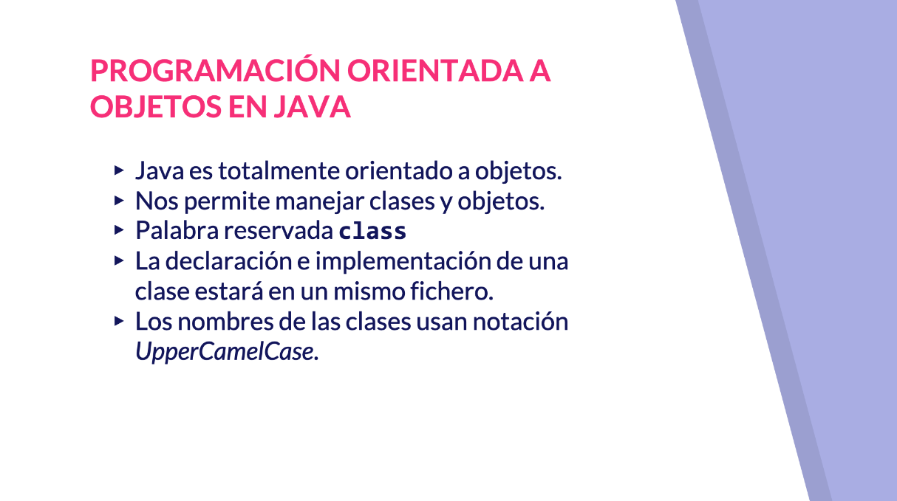

Centrándonos en Java, la programación orientada a objetos le viene como anillo al dedo, porque Java es totalmente orientado a objetos, nos permite manejar con total versatilidad tanto clases como objeto a través de principalmente de la palabra reservada `class`, ya nos tiene que sonar porque sin conocer las clases muy bien ya hemos utilizado una clase en todo y cada uno de los ejemplos que hemos venido haciendo hasta ahora. A diferencia de otros lenguajes de programación donde la declaración de una clase que está situada en un fichero y la implementación está en otra, la declaración e implementación de clases en Java estará siempre dentro de un mismo fichero como norma general y además decir que de forma parecida a los nombres de la variables, los nombres de las clases seguirán las mismas reglas, tienen que ser autodescriptivos, no pueden incluir espacio en blanco, etc., pero en lugar de la notacion camelCase utilizaría notación *UpperCamelCase*, en la que bueno eliminamos los espacios en blanco, unimos todas las palabras y ponemos la primera letra de todas las palabras, incluida la primera en mayúscula.


Para declarar una clase tendríamos un código con esta sintaxis, tendríamos un modificador de acceso, que ya los conoceremos, qué van a permitir a una u otra clase acceder a otra o interaccionar con otras, la palabra reservada `class` y el nombre de la clase y encerrado entre llaves tenemos que **declarar su estructura a través de una serie de propiedades y su comportamiento a través de una serie de métodos** que iremos conociendo poco a poco. 

Las propiedades que puede tener pueden ser bien de tipos primitivos, que será con los que comencemos como en este caso una propiedad de tipo `int`, una propiedad de tipo `String`, una propiedad de tipo `float` y los métodos tendrán una serie de nombres que iremos viendo poco a poco y que tendrán un tipo de retorno, será el tipo de valor que devuelva su ejecución, que iremos conociendo poco a poco, esto es una presentación a vista de pájaro de la estructura de una clase.

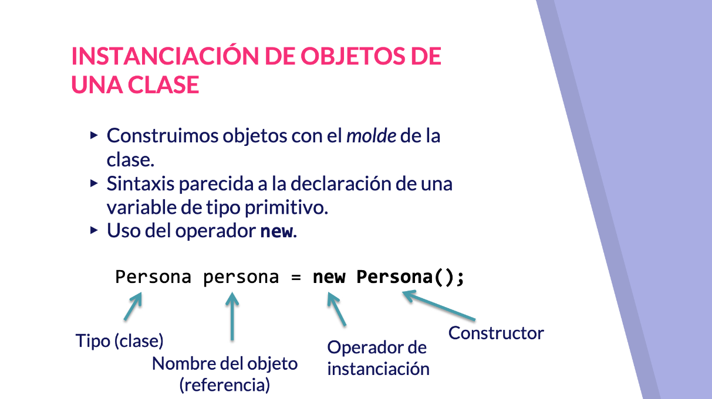

A partir de una clase, cómo podemos obtener objetos, lo hacemos mediante **una operación que se llama instanciacion**, se refiere a la construcción de un objeto a partir del molde que representa una clase lo llamamos instanciación. 

La sintaxis es muy parecida a la declaracion e inicializacion de una variable de tipo primitivo y para hacerlo, para indicar en este caso que no es un tipo primitivo usamos el operador `new` que iría justo a la derecha del operador de asignación, como vemos esta sentencia en la que instanciamos un objeto de tipo persona, tiene varias partes aunque la sentencia es sencillas. De Izquierda a Derecha tendría el tipo, igual que antes usamos el tipo primitivo ahora usamos tipo estructurado, la clase tipo de dato de esta variable, el nombre de la clase, después vendría el nombre de la variable del objeto, cuando se habla de objetos además de referirse a ellos como variable también se suele utilizar la palabra referencia, la referencia hacia ese objeto, el operador de asignación, el operador de instanciación `new` y a continuación vendría lo que se conoce como un **constructor**, que hasta que los conozcamos un poco mejor podríamos decir que el mismo nombre de la clase, incluso escrito la P con mayúscula de persona en mayúscula y a continuación los parentesis y terminaría como todas sentencias con un punto y coma. Eso nos permitiría el poder instanciar, construir un objeto de Persona, poder **instanciar una Persona**.


Ya que hemos presentado la referencia hacia objetos, podemos presentar el valor `null`, `null` significa que tenemos ausencia de información, que desconocemos una determinada información y además de representar eso, Java nos permite utilizar la palabra reservada `null` para poder comparar y saber si una determinada referencia de un objeto, realmente no está haciendo referencia a ningun objeto en particular sino que desconocemos a quién está haciendo referencia, con lo cual digamos que está almacenando un valor `null`. Eso también lo iremos utilizando a partir de ahora la palabra reservada `null` para saber si un objeto ya está instanciado y asociado a una referencia o si esa referencia, todavía no está asociada a ninguna.

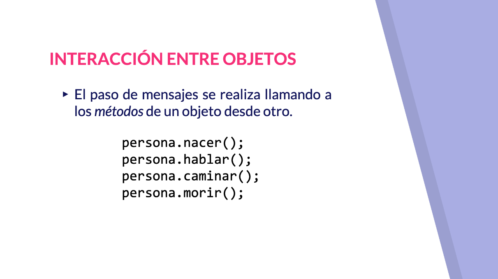

Nos queda ver cómo por un lado van a interaccionar objeto ya veremos que el objeto interaccionan como hemos dicho antes a través de un sistema de paso de mensaje y se paso de mensajes no es más que un método pueda invocar a un método definido centro de otra clase vale cómo se invoca haría pues utilizaríamos el nombre de la referencia de ese objeto persona punto y el nombre del metro y a continuación los parece que como tenemos aquí si quisiéramos hacer nacer a una persona que una persona hablara que caminara porque murieras vale las distintas operaciones de personas no tendríamos que ejecutar esa llamada a los metros hablábamos antes de modificadores de acceso y aquí podemos presentarlo los cuatro que nos ofrece Java si bien nosotros ahora lo iremos utilizando un poco no a la ligera pero si sin saber muy bien a lo mejor que hacerle unas a ganar algo más de experiencia de hecho nos limitaremos a algunos de ellos no como es el de público es decir cualquiera puede acceder a algún apartado de esa clase private solamente la propia clase puede acceder protect en la propia clase y su derivado o el modificador por defecto en el cual son las clases cercanas las que tienen el mismo paquete las que podrían hacer y ya que habíamos hablado de organización de código presentamos en su momento cuando hicimos nuestro primer ejemplo el concepto de paquete lo recordamos ahora un paquete es una unidad organizativa que va a contener una o más clases vale si lo miramos y me clipse un paquete es un directorio o una sucesión de directorio dónde se almacenan clases nos va a permitir organizar el código organizar las clases de forma lógica vale sobretodo guardando dentro del mismo paquete clases que suelan interaccionar entre ellas o que tengan algún tipo de relación cierta cohesión y para declarar un paquete como he visto que este no está nos da cierta ayuda cuando cuando creamos una nueva clase pero se hace en la cabecera de la misma mediante la palabra reservada para acá vale vamos a ver el ejemplo de creación de una persona y como desde otro objeto en particular cómo estás entonces la que instancia más un objeto de tipo persona tiene varias parte aunque la sentencia sencilla de izquierda derecha tendría el tipo igual que arde sus amigos primitivo ahora usamos he puesto el jurado vale la clase tipo de pedazo de esta variable nombre de la clase de pues vendría el nombre de la variable del objeto cuando se habla de objetos además de referirse yo como variable también se suele utilizar la palabra referencia vale la referencia hacia de se objeto del operador de simulación el operador de instancias yo ya continuación vendría lo que se conoce como un constructor que hasta que lo colocamos un poco mejor podríamos decir que el mismo nombre de la clase y necesito si la pena yo con la de personas mayúsculas Deportiva pero no sé si terminaré como todo emergencia con . Y como distancia uno de construir una persona potencia


# 10. Los constructores 9:07

[Los constructores](pdfs/10_Los_constructores.pdf)

## Resumen Profesor

### 10.1 Construcción de objetos

En orientación a objetos, la construcción de un objeto implica la inicialización de cero o más variables miembros de ese mismo objeto que estamos construyendo. Java, por sí mismo, solamente hace las gestiones oportunas en memoria; sin embargo, si queremos que ese nuevo objeto recién creado tenga valores inicializados, se los podemos proporcionar mediante un constructor.

### 10.2 Sintaxis

* Normalmente son `public`.
* Un constructor se llama **siempre** igual que el nombre de la clase a la cual construye.
* Pueden tener cero o más argumentos.

Nuestro IDE Eclipse, posee un asistente que nos puede ayudar a generar el código de constructores con parámetros.

### 10.3 *Puntero* `this`


Se trata de una forma de referenciar desde un objeto a sí mismo, tanto a sus variables miembro como a sus métodos. También nos sirve para poder utilizar un constructor desde otro. Por ejemplo:

```java
public class Persona {

  //Variables miembro


    // Constructor con algunos parámetros
    public Persona(String nombre, String apellidos) {
        this.nombre = nombre;
        this.apellidos = apellidos;
    }

    public Persona(String nombre, String apellidos, int edad) {
        this(nombre, apellidos);
        this.edad = edad;
    }
}
```

El segundo constructor de este código utiliza el primer constructor. De esta forma reutilizamos código.


## Transcripción

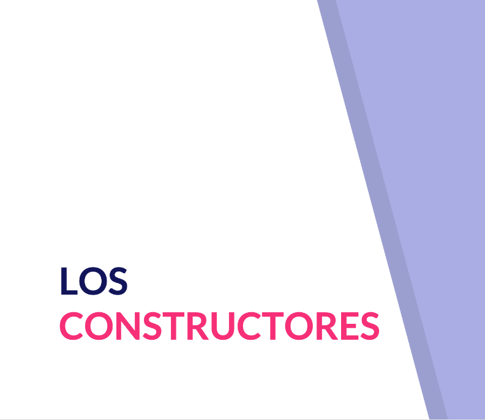


 
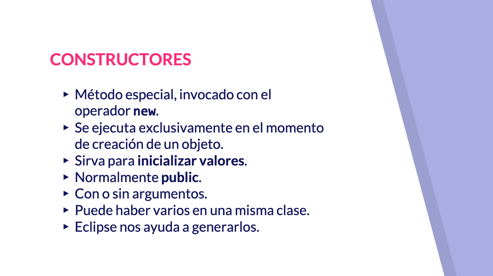

## 11. Getters y setters 14:28 

[Getters y setters](pdfs/11_Propiedades_y_metodos.pdf)

## Resumen Profesor

### 11.1 Métodos y atributos

Tal y como hemos aprendido en lecciones anteriores, los métodos se corresponden con el *comportamiento* de una clase, y los atributos (o propiedades) con su *estructura*.

La encapsulación nos recomienda que el trato con los objetos sea siempre a través de métodos; y dado que la estructura interna de un objeto solamente la conoce el mismo, los atributos se deberían consultar o editar siempre a través de métodos.

### 11.2 Propiedades o atributos

Tienen la siguiente sintaxis genérica:

```
modificadorDeAtributo tipoAtributo nombreAtributo;
```

donde:

* `modificadorDeAtributo` puede ser **`private`** (casi siempre), `protected`, `public` o por defecto (es decir, que puede acceder las clases del mismo paquete).

* `tipoAtributo` puede ser un tipo primitivo (`int`, `float`, `char`, `String`) u otra clase.

* `nombreAtributo` debería estar escrito en notación *camelCase* y ser autodescriptivo.

### 11.3 Métodos

Tienen la siguiente sintaxis genérica:

```java
modificador[es]DeMetodo tipoRetorno nombreMedoto(tipo1 param1, tipo2, param2, ...){
  //...
}
```

donde:

* `modificador[es]DeMetodo` puede ser, por un lado **`public`** (casi siempre), `protected`, `private` o por defecto (es decir, que puede acceder las clases del mismo paquete). Además, estos valores pueden ir acompañados de `static`, `abstract`, `final`, `native`, `synchronized`.

* `tipoRetorno` puede ser un tipo primitivo (`int`, `float`, `char`, `String`), otra clase o `void` (es decir, que no devuelve nada).

* `nombreMetodo` debería estar escrito en notación *camelCase* y ser autodescriptivo.

* Los parámetros recibidos, `tipo1 param1, tipo2 param2, ...` siguen las mismas indicaciones que `tipoRetorno` y `nombreAtributo`.

#### 11.3.1 Métodos getters/setters

Son unos métodos especiales, pero sencillos, que nos permiten consultar cualquier atributo de una clase, así como asignarle un nuevo valor. Pueden autogenerarse con Eclipse.

#### 11.3.2 `toString()`

Se trata de un método especial, que sirve para obtener, en un solo valor de tipo String, una representación de un objeto. Eclipse también incluye un asistente para generarlo, si nos fuera preciso.

## Transcripción


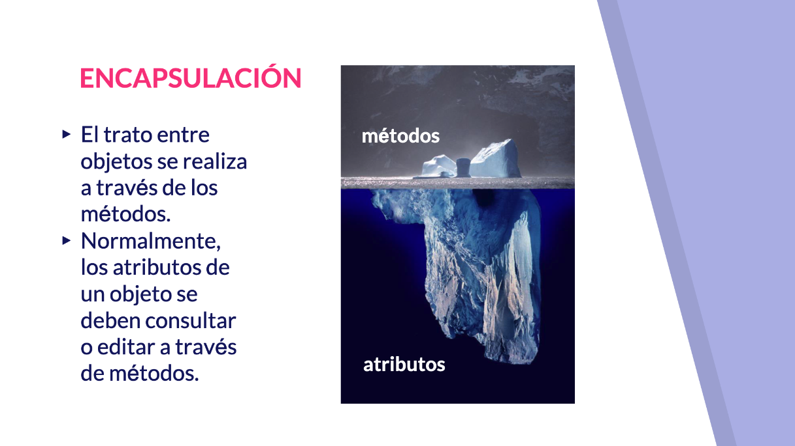


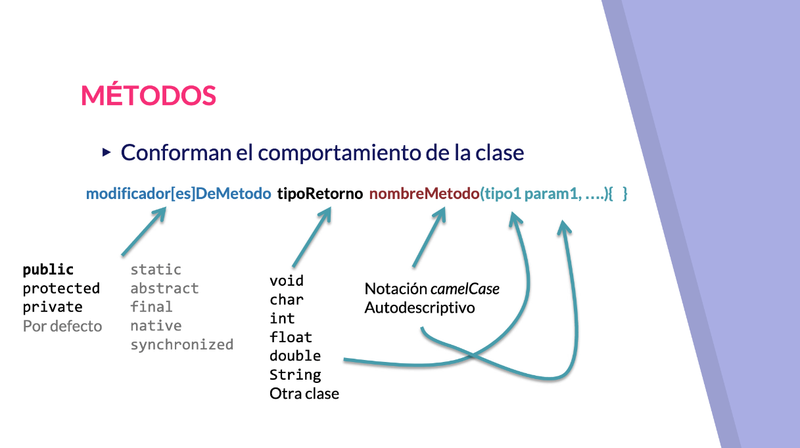

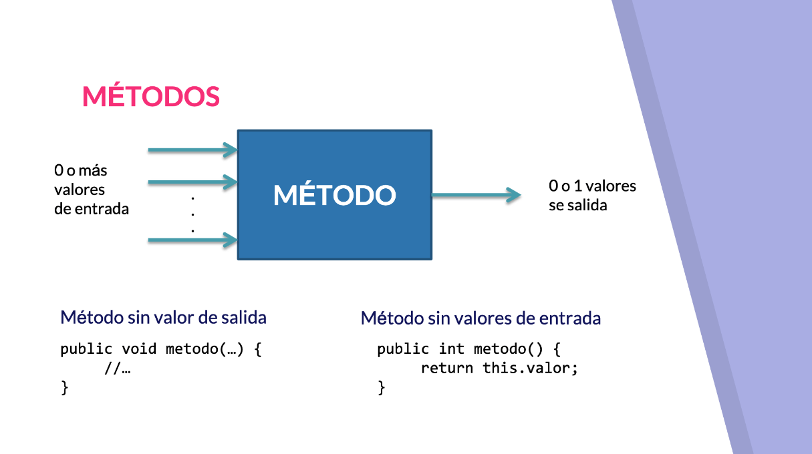


# 12. Ciclo de vida de un objeto 6:27 

[Ciclo de vida de un objeto](pdfs/12_Ciclo_de_vida.pdf)

## Resumen Profesor

### 12.1 Ciclo de vida de un objeto

En Java, cualquier objeto tiene un ciclo de vida, pasado por los estados de creación, uso y destrucción.

Para la creación, solo tenemos que hacer uso del operador `new`. Es Java quien se encarga de realizar todas las operaciones necesarias en memoria.

Un objeto está vivo, accesible y en uso mientras dure el ámbito en el que fue creado. Si creamos un objeto en el método `main` de una aplicación, estará *vivo* hasta que finalice la ejecución del mismo. Si por el contrario, lo creamos en el método de una otra clase, finalizará cuanto termine la ejecución del mismo.

Cuando finaliza el ámbito donde fue definido un método, este se marca como *no util* y es candidato a ser liberado por el *garbage collector*, un proceso de baja prioridad de la JVM que se encarga de liberar la memoria ocupada por estos objetos.

## Transcripción

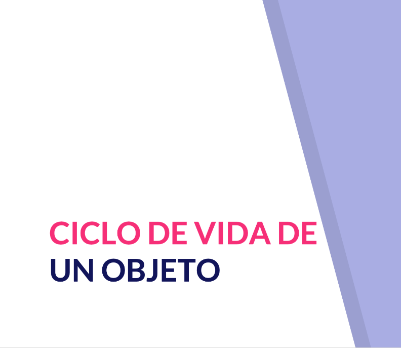


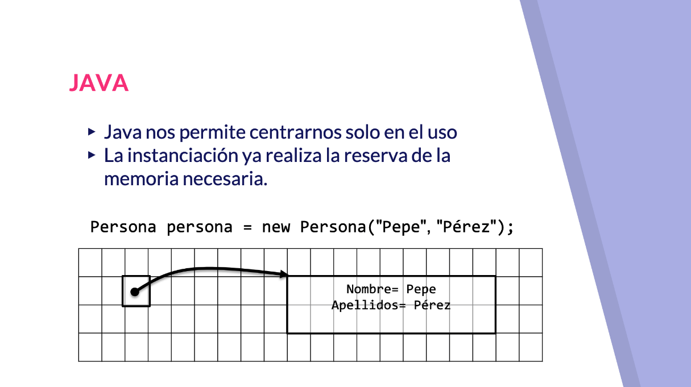


# 13. Uso de clases envoltorio 5:31 

[Uso de clases envoltorio](pdfs/13_Uso_de_las_clases_envoltorio.pdf)

## Resumen Profesor

### 13.1 Clases envoltorio

Java nos ofrece una clase para cada uno de los tipos primitivos:

Tipo Primitivo | Clase Envoltorio
---------------|-----------------
boolean | Boolean
char | Character
byte | Byte
short | Short
int | Integer
long | Long
float | Float
double | Double

Entre otras funcionalidades, nos ofrecen muchos métodos para transformar y operar con los tipos primitivos. Además, más adelante comprobaremos que son útiles con las colecciones y otros contenedores de objetos.

## Transcripción

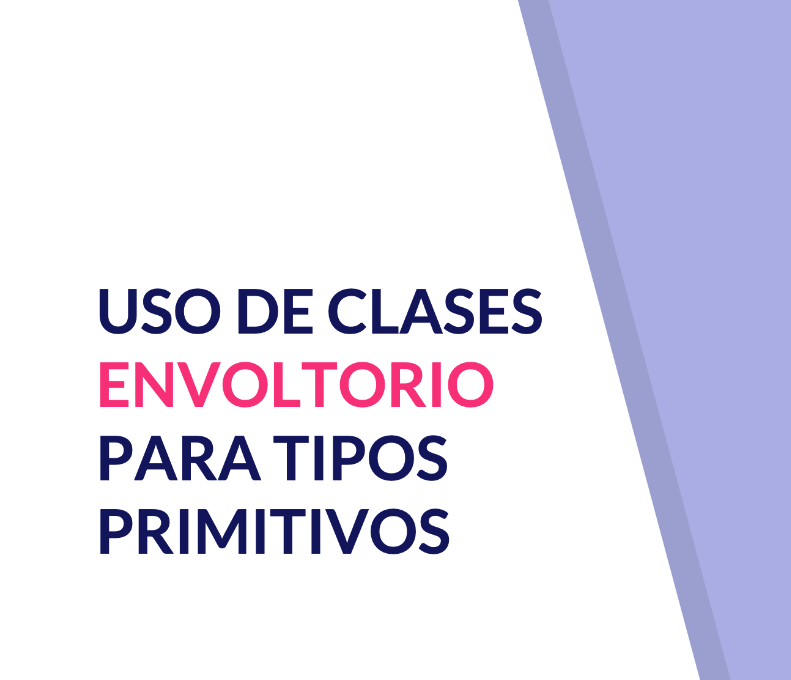

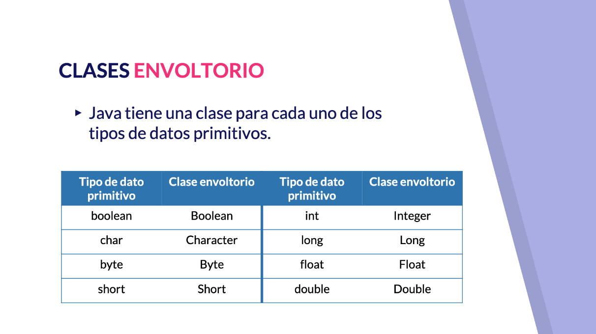


## Contenido adicional 5

[Orientación de objetos](pdfs/09_Orientación_a_objetos.pdf)

[Los constructores](pdfs/10_Los_constructores.pdf)

[Getters y setters](pdfs/11_Propiedades_y_metodos.pdf)

[Ciclo de vida de un objeto](pdfs/12_Ciclo_de_vida.pdf)

[Uso de clases envoltorio](pdfs/13_Uso_de_las_clases_envoltorio.pdf)
