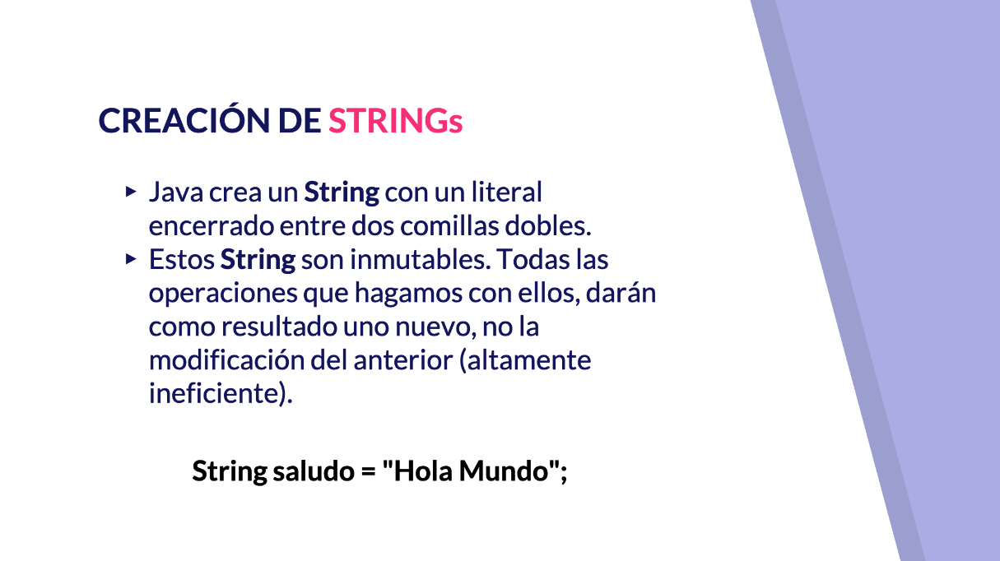
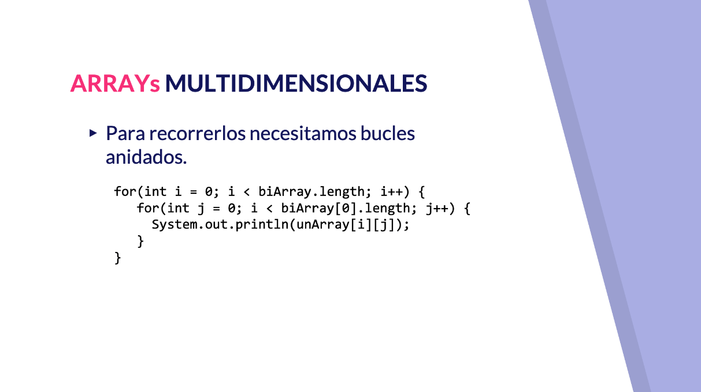

# 4. Manipulación y tratamiento de datos 77m
   * Conoce Java API Docs 9:57 
   * Uso de la clase String 13:03 
   * Manejo de Arrays 23:09 
   * Práctica: Creando el juego de hundir la flota 31:16 
   * Contenido adicional 4
   
## 14. Conoce Java API Docs 9:57 

[Conoce Java API Docs-1](pdfs/14_Conoce_JAVA_API_DOCS-1.pdf)


Conoce más Java y descubre la documentación de Java para ver todos los paquetes y clases que contiene Java


## 15. Uso de la clase String 13:03 

[Uso de la clase String](pdfs/15_Uso_de_la_clase_String.pdf)


### 15.1 Creación de Strings



La forma más fácil de crear una cadena de caracteres es a partir de un literal con dobles comillas

```java
String saludo = "Hola Mundo";
```

Los literales de cadenas de caracteres son compilados por Java como un objeto `String`.

Como comprobaremos más adelante, Java ofrece un tipo de sucesión o colección de elementos de un tipo llamado array. Un array de caracteres también podría representar una cadena de caracteres, pero para nosotros será menos versátil.

**IMPORTANTE**: *La clase `String` es inmutable, es decir, que una vez creada, su valor no se puede modificar. Todas las operaciones que realicemos con objetos de este tipo darán como resultado un nuevo objeto, no la modificación del actual.*

### 15.2 Concatenación


Concatenar dos cadenas es poner una cadena a continuación de la otra. Lo podemos hacer de varias formas:

* operador `+`: es la forma más cómoda: `"Cadena " + "concatenada"`.

* método `.concat(...)`: otra forma de hacerlo: `"Mi nombre es ".concat("Pepe")`.

### 15.3 Longitud, mayúsculas y minúsculas


Podemos obtener el número de caracteres de un `String` mediante el método `.length()`.

```java
String saludo = "Hola Mundo!";
System.out.println(saludo.length()); //Debe imprimir 11
```


Podemos pasar toda la cadena a minúsculas con `toLowerCase()`, o a mayúsculas con `toUpperCase()`.

### 15.4 Creación de cadenas formateadas


En ocasiones, podemos querer crear una cadena de caracteres concatenando varios literales de cadena, con otra serie de valores. En estos casos, puede resultar tedioso hacerlo:

```java
  String nombre = "Pepe";
  String apellidos = "Pérez";
  String mensaje = "¿qué tal estás?";
  System.out.println("Hola, soy " + nombre + " " + apellidos + ", y quiero saludarte diciéndote " + mensaje);
```

Para casos así, podemos usar el método `format`, que nos permite utilizar *variables* dentro de la cadena de formato, que serán sustituidos por valores.

* `%s`: será sustituido por una cadena de caracteres.

* `%f`: será sustituido por un número decimal.
* ...

El ejemplo anterior quedaría:

```java
  String nombre = "Pepe";
  String apellidos = "Pérez";
  String mensaje = "¿qué tal estás?";
  String str = String.format("Hola, soy %s %s y quiero saludarte diciéndote %s", nombre, apellidos, mensaje);
  System.out.println(str);
}
```

### 15.5 Comparaciones de cadenas y fragmentos de cadenas


La clase `String` nos proporciona muchos métodos para comparar cadenas y fragmentos de cadenas:

* `endsWith`, para comparar si una cadena termina igual que un sufijo proporcionado.

* `startsWith`, para comparar si una cadena comienza igual que un prefijo proporcionado.

* `compareTo`, para comparar una cadena con otra. Devuelve 0 si son iguales, `< 0` si es menor, y `> 0` si es mayor (lexicográficamente hablando).

* `equalsIgnoreCase`, para comparar dos cadenas ignorando si están en mayúsculas o minúsculas.

* `matches`, para comparar si una cadena cumple con una expresión regular.

* `contains`, para comparar si una cadena está contenida en otra.

### 15.6 Código

*EjemplosString.java*

```java
/**
 * USO DE LA CLASE STRING
 */
package string;

/**
 * @author Openwebinars
 *
 */
public class EjemplosString {

	/**
	 * @param args
	 */
	public static void main(String[] args) {

		//CONCATENAR
		System.out.println("***** CONCATENAR *****");
		System.out.println(" 2 Formas diferentes: ");
		String nombre = "Mi nombre es ".concat("Pepe");
		String nombre2 = "Mi nombre es " + "Pepe";
		System.out.println(nombre);
		System.out.println(nombre2);
		System.out.println();
		
		// MAYÁSCULAS-MINÚSCULAS
		System.out.println("***** MAYÁSCULAS-MINÚSCULAS *****");
		String cadena = "En un lugar de La Mancha";
		System.out.println(cadena);
		System.out.println(cadena.toLowerCase());
		System.out.println(cadena.toUpperCase());
		System.out.println();
		
		
		//STRING FORMAT
		System.out.println("***** STRING FORMAT *****");
		System.out.println(" 3 Formas diferentes: ");
		String nombre3 = "Pepe";
		String apellidos3 = "Pérez";
		String mensaje3 = "¿qué tal estás?";
		System.out.println("Hola, soy " + nombre3 + " " + apellidos3 + ", y quiero saludarte diciéndote " + mensaje3);
		
		String nombre4 = "Pepe";
		String apellidos4 = "Pérez";
		String mensaje4 = "¿qué tal estás?";
		String str = String.format("Hola, soy %s %s, y quiero saludarte diciéndote %s", nombre4, apellidos4, mensaje4);
		System.out.println(str);
		
		System.out.printf("Hola, soy %s %s, y quiero saludarte diciéndote %s", nombre4, apellidos4, mensaje4);
		System.out.println();
		System.out.println();
		
		//MÉTODOS DE COMPARACIÓN
		System.out.println("***** MÉTODOS DE COMPARACIÓN *****");
		String quijote = "En un lugar de La Mancha";
		System.out.println(quijote.endsWith("La Mancha"));		
		System.out.println(quijote.startsWith("En un lugar"));		
		System.out.println(quijote.contains("lugar"));
		
	}

}
```

**SALIDA:**

```sh
***** CONCATENAR *****
 2 Formas diferentes: 
Mi nombre es Pepe
Mi nombre es Pepe

***** MAYÁSCULAS-MINÚSCULAS *****
En un lugar de La Mancha
en un lugar de la mancha
EN UN LUGAR DE LA MANCHA

***** STRING FORMAT *****
 3 Formas diferentes: 
Hola, soy Pepe Pérez, y quiero saludarte diciéndote ¿qué tal estás?
Hola, soy Pepe Pérez, y quiero saludarte diciéndote ¿qué tal estás?
Hola, soy Pepe Pérez, y quiero saludarte diciéndote ¿qué tal estás?

***** MÉTODOS DE COMPARACIÓN *****
true
true
true
```

## 16. Manejo de Arrays 23:09 

[Manejo de Arrays](pdfs/16_Arrays.pdf)


### 16.1 Arrays


Un array es un contenedor de elementos de un mismo tipo, con un tamaño fijo que hay que conocer a la hora de crearlo. A la hora de recorrerlo, las posiciones comienzan a contar en cero.


### 16.2 Creación de un array


Usamos el operador `new`, y tenemos que conocer el tipo de dato y el tamaño:

```java
int[] unArray = new int[10];
```

### 16.3 Acceso de lectura y escritura


El operador `[ ]` nos permite acceder a las posiciones de un array, para leer su valor, o también para modificarlo.

Para asignar un valor, usaremos el operador corchete a la izquierda de una operación de asignación:

```java
unArray[1] = 100;
```

Para leer un valor, lo utilizaremos en operaciones como un `println`:

```java
System.out.println(unArray[1]);
```

### 16.4 Inicialización de un array


Tenemos varias formas de hacerlo:

1. Manualmente, asignando cada una de las posiciones

2. Manualmente, pero utilizando un bucle para iterar por las posiciones (simpre que la lógica del programa lo permita).

3. Atajo con la sintaxis `{ }`.

### 16.5 Reocorrido de un array


Todo array tiene una propiedad pública, `length`, que son permite consultar su número de elementos. Utilizándola, podemos usar un bucle para recorrer un array:

```java
for(int i = 0; i < unArray.length; i++) {
     System.out.println(unArray[i]);
}
```

También podemos utilizar un bucle for-each, que nos permite extraer elemento a elemento, sin necesidad de conocer a priori su longitud:

```java
for(int i : unArray) {
     System.out.println(i);
}
```

### 16.6 Arrays de objetos


No solamente podemos crear arrays de tipos primitivos, sino que también lo podemos hacer de instancias de alguna clase que hayamos definido previamente.

```java
Persona[] unArray = new Persona[10];
//...
unArray[1] = new Persona(…);
```

### 16.7 Arrays multidimensionales


Podemos crear arrays que tengan más de una dimensión. Tan solo tenemos que añadir otra pareja de corchetes.

```java
int[][] biArray = new int[10][20];
biArray[3][4] = 78;
```



Para recorrerlos necesitaremos *anidar* otro bucle for:

```java
for(int i = 0; i < biArray.length; i++) {
   for(int j = 0; i < biArray[0].length; j++) {
     System.out.println(unArray[i][j]);
   }
}
```

### 16.8 Manipulación de arrays


Java nos provee de una clase, `java.util.Arrays`, que posee una serie de métodos para realizar operaciones rápidas con arrays. Entre otros:

* `sort(...)`: nos permite ordenar los elementos de un arrays

* `copyOf(...)`: nos permite copiar rápidamente un array en otro

* `binarySearch(...)`: nos permite buscar un valor entre los elementos de un array. Previamente debe estar ordenado

Java 8 incorpora algunos métodos paralelos, que aprovechan mejor el rendimiento de arquitecturas con varios procesadores, para operar con arrays muy grandes, con estas operaciones, entre otras:

* `parallelSort(...)`

* `parallelSetAll(...)`

### 16.9 Código

*ManejoArrays01.java*

```java
/**
 * 
 */
package arrays;

/**
 * @author Openwebinars
 *
 */
public class ManejoArrays01 {

	/**
	 * @param args
	 */
	public static void main(String[] args) {
		
		//CREACIÓN E INICIALIZACIÓN ELEMENTO A ELEMENTO
		int[] unArray = new int[10];
		
        unArray[0] = 100;
        unArray[1] = 200;
        unArray[2] = 300;
        unArray[3] = 400;
        unArray[4] = 500;
        unArray[5] = 600;
        unArray[6] = 700;
        unArray[7] = 800;
        unArray[8] = 900;
        unArray[9] = 1000;
        
        //RECORRIDO DE TODOS LOS VALORES DE UN ARRAY
        for(int i = 0; i < unArray.length; i++) {
        	System.out.println(unArray[i]);
        }    
	}

}


SALIDA:

100
200
300
400
500
600
700
800
900
1000
```

*ManejoArrays02.java*

```java
package arrays;

/**
 * @author 
 *
 */
public class ManejoArrays02 {

	/**
	 * @param args
	 */
	public static void main(String[] args) {
		
		//CREACIÓN E INICIALIZACIÓN CON EL ATAJO { }
		//En este caso, el tamaño lo determina la cantidad 
		//de valores que inicializamos
		int[] unArray = { 
			    100, 200, 300,
			    400, 500, 600, 
			    700, 800, 900, 1000
		};
        
    //RECORRIDO DE TODOS LOS VALORES DE UN ARRAY
		//CON EL BUCLE FOR MEJORADO
    for(int i : unArray) {
        	System.out.println(i);
    }
	}
}


SALIDA:

100
200
300
400
500
600
700
800
900
1000
```

*Persona.java*

```java
package arrays.objetos;

public class Persona {
	
	private String nombre;
	private String apellidos;
	private int edad;
	private int altura;
	private float peso;
	
	public Persona() {}
	
	public Persona(String nombre, String apellidos) {
		this.nombre = nombre;
		this.apellidos = apellidos;
	}

	public Persona(String nombre, String apellidos, int edad, int altura, float peso) {
		this.nombre = nombre;
		this.apellidos = apellidos;
		this.edad = edad;
		this.altura = altura;
		this.peso = peso;
	}

	public String getNombre() {
		return nombre;
	}

	public void setNombre(String nombre) {
		this.nombre = nombre;
	}

	public String getApellidos() {
		return apellidos;
	}

	public void setApellidos(String apellidos) {
		this.apellidos = apellidos;
	}

	public int getEdad() {
		return edad;
	}

	public void setEdad(int edad) {
		this.edad = edad;
	}

	public int getAltura() {
		return altura;
	}

	public void setAltura(int altura) {
		this.altura = altura;
	}

	public float getPeso() {
		return peso;
	}

	public void setPeso(float peso) {
		this.peso = peso;
	}

	@Override
	public String toString() {
		return "Persona [nombre=" + nombre + ", apellidos=" + apellidos + ", edad=" + edad + ", altura=" + altura
				+ ", peso=" + peso + "]";
	}
}
```

*ManejoArrays03.java*

```java
package arrays.objetos;

import java.util.Random;

/**
 * @author Openwebinars
 *
 */
public class ManejoArrays03 {

	/**
	 * @param args
	 */
	public static void main(String[] args) {
		
		//Estos dos arrays nos permitirán obtener valores aleatorios para inicializar los datos
		String[] nombres = {"José", "Antonio", "Martín", "Luis", "María", "Leticia", "Luisa"};
		String[] apellidos = {"Pérez", "Gómez", "López", "García", "Muñoz", "Martínez"};
		
		//Creamos nuestro array de 5 elementos de tipo Persona
		Persona[] personas = new Persona[5];
		
		//Inicializamos los valores
		for(int i = 0; i < personas.length; i++) {
			//Obtenemos un nombre de una posición aleatoria
			String nombre = nombres[aleatorio(nombres.length)];
			//Obtenemos un apellido de una posición aleatoria			
			String apellido = apellidos[aleatorio(nombres.length)];
			//Los usamos para crear una nueva persona
			personas[i]= new Persona(nombre, apellido);
		}
		
		//Recorremos de nuevo el array, esta vez
		//para imprimir sus valores.
		for(Persona p : personas) {
			System.out.println(p);
		}

	}

	/*
	 * ESTE MÉTODO DEVUELVE UN NÚMERO ALEATORIO ENTRE
	 * 0 y TOPE-1.
	 */
	public static int aleatorio(int tope) {
		Random r = new Random();		
		return r.nextInt(tope-1);
	}

}


SALIDA:

Persona [nombre=Luis, apellidos=Gómez, edad=0, altura=0, peso=0.0]
Persona [nombre=María, apellidos=Gómez, edad=0, altura=0, peso=0.0]
Persona [nombre=Antonio, apellidos=Muñoz, edad=0, altura=0, peso=0.0]
Persona [nombre=María, apellidos=Pérez, edad=0, altura=0, peso=0.0]
Persona [nombre=Luis, apellidos=Muñoz, edad=0, altura=0, peso=0.0]
```

*.java*

```java


SALIDA:

```

*.java*

```java


SALIDA:

```

*.java*

```java


SALIDA:

```

*.java*

```java


SALIDA:

```

## Práctica: Creando el juego de hundir la flota 31:16 

[Práctica: Creando el juego de hundir la flota](pdfs/Hundir_la_flota.pdf)


En esta sesión práctica veremos como crear el juego de hundir la flota, tienes el código de ejemplo en el [repositorio de GitHub](https://github.com/OpenWebinarsNet/Curso-Java-desde-0/tree/master/16bis_HundirFlota).


## Contenido adicional 4   

[Conoce Java API Docs](pdfs/14_Conoce_JAVA_API_DOCS.pdf)

[Uso de la clase String](pdfs/15_Uso_de_la_clase_String.pdf)

[Manejo de Arrays](pdfs/16_Arrays.pdf)

[Práctica: Creando el juego de hundir la flota](pdfs/Hundir_la_flota.pdf)
