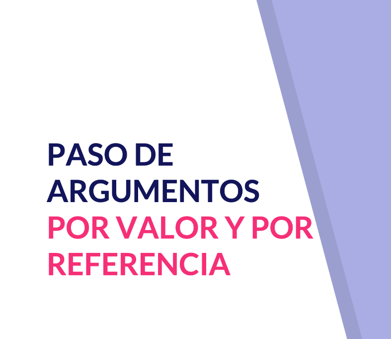
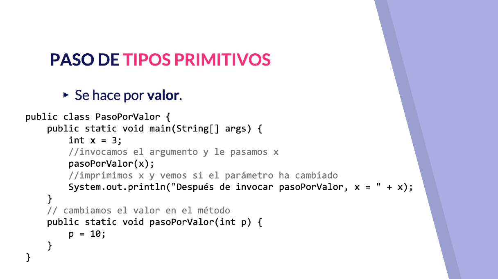
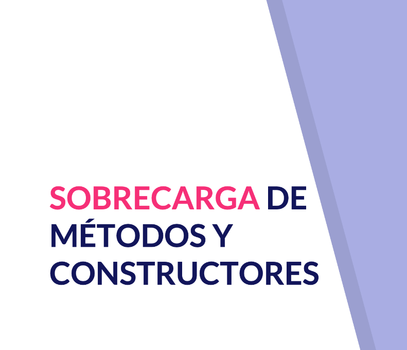

# 5. Revisitando clases y objetos 49m
   * Argumento de un método y tipos de retorno 13:36 
   * Paso de argumento por valor y referencia 8:18 
   * Modificadores de acceso 12:39 
   * Métodos estáticos y variables estáticas 8:19 
   * Sobrecarga de métodos y constructores 7:07 
   * Contenido adicional 5
   
# 17. Argumento de un método y tipos de retorno 13:36 

[Argumento de un método y tipos de retorno](pdfs/17_Argumentos_y_tipos_de_retorno.pdf)

## Resumen del Profesor

### 17.1 Tipos de retorno

Un método puede volver al código desde donde se invocó de varias maneras:

1. Por completar la ejecución de todas las sentencias que conforman el método.
2. Por el uso de una sentencia `return`.
3. Por un comportamiento erróneo (lo aprenderemos más adelante).

#### 17.1.1 Métodos que no devuelven ningún valor

Si un método no devuelve ningún valor, el tipo de retorno será `void`. Si tratamos de devolver algún valor (con `return`) en un método marcado como `void`, obtendremos un error de compilación.

#### 17.1.2 Métodos que devuelven un tipo primitivo

Ya hemos comprobado que un método puede devolver un tipo primitivo, mediante la sentencia `return`. También puede devolver un array (multidimensional) de tipos primitivos.

```java
public class Rectangulo {

    //atributos y otros métodos
    public float getArea() {
      return base*altura;
    }

}
```

#### 17.1.3 Métodos que devuelven un objeto

Un método también puede tener un tipo de retorno una clase, y servirá para devolver una instancia del mismo. También puede devolver un array de objetos.

```java
public class Punto {

  float x;
  float y;

  //...

}

public class Rectangulo {

    //atributos y otros métodos
    public Punto[] getPuntos() {
      //return ....
    }

}
```

### 17.2 Paso de argumentos

Un método puede recibir cuantos argumentos necesitemos para realizar una operación. Estos pueden ser:

* De un tipo primitivo
* Un array (multidimensional)
* De una clase definida por Java o por nosotros mismos.

```java
public Rectangulo rectanguloDePuntos(Punto[] esquinas) {
    //...cuerpo del método...
}
```

#### 17.2.1 Número *arbitrario* de argumentos

Desde hace algunas versiones, Java incluye la opción de usar *varargs* para indicar que un método recibirá un número arbitrario de argumentos de un tipo. Estos son útiles cuando no sabemos a priori la cantidad de argumentos que recibiremos.

Para usarlos usaremos la sintaxis de tres puntos seguidos (`...`), justo después del tipo de dato, y separados por un espacio del nombre del argumento.

```java
public Poligono poligonoDePuntos(Punto... esquinas) {
    int numeroLados = esquinas.length;
    double raizDelLado1, longitudLado1;
    raizDelLado1 = (corners[1].x - corners[0].x)
                     * (corners[1].x - corners[0].x)
                     + (corners[1].y - corners[0].y)
                     * (corners[1].y - corners[0].y);
    longitudLado1 = Math.sqrt(raizDelLado1);

    // continuación del cuerpo del método
}
```

Dentro del método, un *varargs* se trata igual que un array.

***¡IMPORTANTE!** Un método que reciba varios argumentos de diferentes tipos, y además, un varargs, debe incluir este como el último en orden de recepción. De otra forma, sería imposible identificar el número de argumentos recibidos mediante el varargs.*

## Transcripción


# 18. Paso de argumento por valor y referencia 8:18 

[Paso de argumento por valor y referencia](pdfs/18_Paso_por_valor_y_referencia.pdf)

## Resumen del Profesor

### 18.1 Paso por valor y paso por referencia

* Paso por `valor`: cuando un método recibe unos argumentos por valor, realiza una copia de estos, y si modifica su contenido, dichas modificaciones no duran más allá del final de la ejecución del método.

* Paso por `referencia`: cuando un método recibe unos argumentos por referencia, **no** realiza una copia, sino que trabaja con los valores reales, por lo que si modifica sus valores, dichas modificaciones duran más allá del final de la ejecución del método.

En Java, **solamente existe el paso por valor**, si bien podemos matizar esto.

### 18.2 Paso de tipos de datos primitivos

Los argumentos de tipo primitivo, como `int` o `double`, siempre se pasan por valor. Por tanto, si modificamos, sus valores tras la ejecución del método no habrán cambiado.

```java
public class PasoPorValor {

    public static void main(String[] args) {

        int x = 3;

        //invocamos el argumento y le pasamos x
        pasoPorValor(x);

        //imprimimos x y vemos si el parámetro ha cambiado
        System.out.println("Después de invocar pasoPorValor, x = " + x);

    }

    // cambiamos el valor en el método
    public static void pasoPorValor(int p) {
        p = 10;
    }
}
```

La salida de la ejecución del programa será `Después de invocar pasoPorValor, x = 3`.

### 18.3 Paso de objetos

Si en lugar de tipos primitivos, pasamos objetos, estos también se pasan por valor. Es decir, que cuando termina la ejecución del método, la referencia seguirá apuntando al mismo objeto. **Sin embargo, el estado del método puede haberse visto modificado, y estos cambios si sobreviven al final del método`*`**.

```java
public void moveCircle(Circle circle, int deltaX, int deltaY) {
    // code to move origin of circle to x+deltaX, y+deltaY
    circle.setX(circle.getX() + deltaX);
    circle.setY(circle.getY() + deltaY);

    // code to assign a new reference to circle
    circle = new Circle(0, 0);
}

//...

moveCircle(myCircle, 23, 56)
```

Primero, modificamos los valores X e X del círculo, y posteriormente, asignamos la referencia a una nueva instancia. Si verificamos el objeto tras la ejecución del método, comprobaremos que la referencia *apunta* al objeto inicial, y sus valores sí se han visto modificados.

## Transcripción







# 19. Modificadores de acceso 12:39 

[Modificadores de acceso](pdfs/19_Modificadores_de_acceso.pdf)

## Resumen del Profesor

### 19.1 Modificadores de acceso

Modificador |	Clase |	Paquete	| Subclase | El mundo
------------|-------|---------|----------|---------
public | Sí | Sí | Sí | Sí
protected | Sí | Sí | Sí | No
Sin modificador | Sí | Sí | No | No
private | Sí | No |	No | No

### 19.2 Modificadores a nivel de Clase

Nuestras clases deberían ser `public` casi siempre. Solo en casos más avanzados veremos que podemos tener otros tipos de clases donde nos interesaría que no lo fueran.

### 19.3 Modificadores a nivel de métodos

Para métodos y atributos, intentemos siempre escoger la versión más restrictiva. Los métodos deberían ser siempre `public`, salvo que realicen operaciones auxiliares; en ese caso los podemos marcar como `private`. Los constructores deben ser `public`.

### 19.4 Modificadores a nivel de atributos.

Deben ser `private` salvo para constantes (que deben ser `public`). Los atributos no privados aumentan el acoplamiento del código y limitan la flexibilidad para cambiar código en el futuro.

## Transcripción


# 20. Métodos estáticos y variables estáticas 8:19 

[Métodos estáticos y variables estáticas](pdfs/20_Métodos_y_variables_estáticas.pdf)

## Resumen del Profesor

### 20.1 Atributos de objeto y de clase

Java nos permite crear cuantos objetos queramos de una misma clase. Estos objetos tienen una copia propia de los atributos. Sin embargo, en ocasiones, puede interesarnos tener un atributo común a todos los objetos. Estos son los atributos `static`.

Están asociados a la clase, y compartidos para todas las instancias. Pueden ser manipulados por cualquier objeto, o incluso sin crear una instancia de esa clase.

### 20.2 Métodos estáticos

Se rigen por los mismos principios de los atributos estáticos. Para invocar:

```java
Clase.metodoEstatico(...);
```

Para acceder a una variable estática, necesitamos hacerlo desde un método estático. También podemos crear métodos estáticos como métodos de operaciones auxiliares (recordemos todos los métodos de la clase `java.util.Arrays`).

### 20.3 Constantes

Se pueden definir como `static`.

```java
static final PI = 3.141592653589793;
```

## Transcripción


# 21. Sobrecarga de métodos y constructores 7:07 

[Sobrecarga de métodos y constructores](pdfs/21_Sobrecarga_de_métodos_y_constructores.pdf)

## Resumen del Profesor

### 21.1 Sobrecarga de métodos

Java permite que una clase tenga dos o más metodos con el mismo nombre, siempre que su firma (es decir, el número de atributos y/o su tipo) sea diferente:

```java
public class Artista {


    public void dibuja(String s) {
        System.out.println(s);
    }

    public void dibuja(int i) {
        System.out.println(i);
    }

    public void dibuja(double f) {
        System.out.println(f);
    }

    public void dibuja(int i, double f) {
        System.out.println(i);
        System.out.println(f);
    }

}
```

### 21.2 Sobrecarga de constructores


También permite tener varios constructores por clase, que siguen las mismas reglas que los métodos:

```java
public class Persona {

    private String nombre;
    private String apellidos;
    private int edad;
    private int altura;
    private float peso;


    public Persona() {
    }

    public Persona(String nombre, String apellidos) {
        this.nombre = nombre;
        this.apellidos = apellidos;
    }


    public Persona(String nombre, String apellidos, int edad) {
        this.nombre = nombre;
        this.apellidos = apellidos;
        this.edad = edad;
    }

    public Persona(String nombre, String apellidos, int edad, int altura, float peso) {
        this.nombre = nombre;
        this.apellidos = apellidos;
        this.edad = edad;
        this.altura = altura;
        this.peso = peso;
    }

  //...
}
```

## Transcripción




## Contenido adicional 5   

[Argumento de un método y tipos de retorno](pdfs/17_Argumentos_y_tipos_de_retorno.pdf)

[Paso de argumento por valor y referencia](pdfs/18_Paso_por_valor_y_referencia.pdf)

[Modificadores de acceso](pdfs/19_Modificadores_de_acceso.pdf)

[Métodos estáticos y variables estáticas](pdfs/20_Métodos_y_variables_estáticas.pdf)

[Sobrecarga de métodos y constructores](pdfs/21_Sobrecarga_de_métodos_y_constructores.pdf)
