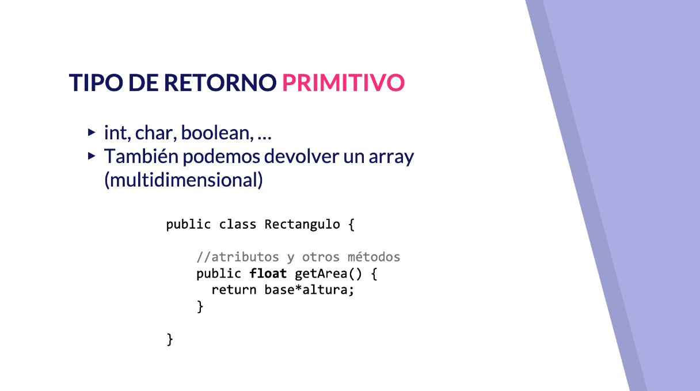
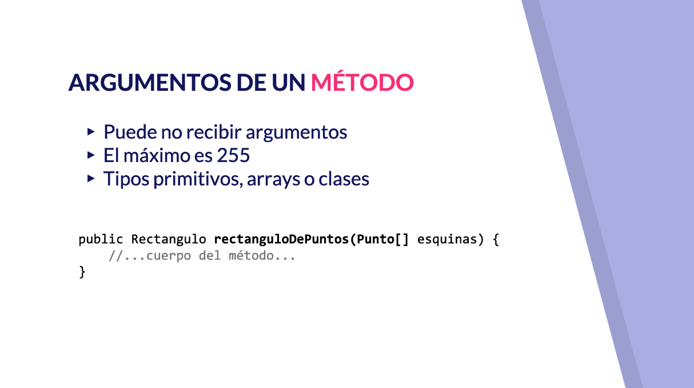
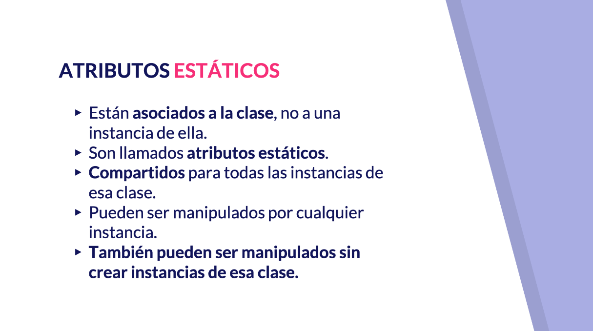
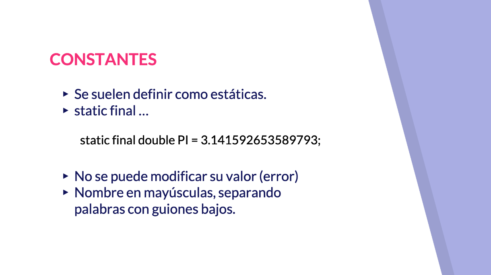

# 5. Revisitando clases y objetos 49m
   * 17 Argumento de un método y tipos de retorno 13:36 
   * 18 Paso de argumento por valor y referencia 8:18 
   * 19 Modificadores de acceso 12:39 
   * 20 Métodos estáticos y variables estáticas 8:19 
   * 21 Sobrecarga de métodos y constructores 7:07 
   * Contenido adicional 5
   
# 17. Argumento de un método y tipos de retorno 13:36 

[Argumento de un método y tipos de retorno](pdfs/17_Argumentos_y_tipos_de_retorno.pdf)

## Resumen del Profesor

### 17.1 Tipos de retorno

Un método puede volver al código desde donde se invocó de varias maneras:

1. Por completar la ejecución de todas las sentencias que conforman el método.
2. Por el uso de una sentencia `return`.
3. Por un comportamiento erróneo (lo aprenderemos más adelante).

#### 17.1.1 Métodos que no devuelven ningún valor

Si un método no devuelve ningún valor, el tipo de retorno será `void`. Si tratamos de devolver algún valor (con `return`) en un método marcado como `void`, obtendremos un error de compilación.

#### 17.1.2 Métodos que devuelven un tipo primitivo

Ya hemos comprobado que un método puede devolver un tipo primitivo, mediante la sentencia `return`. También puede devolver un array (multidimensional) de tipos primitivos.

```java
public class Rectangulo {

   //atributos y otros métodos
   public float getArea() {
      return base*altura;
   }

}
```

#### 17.1.3 Métodos que devuelven un objeto

Un método también puede tener un tipo de retorno una clase, y servirá para devolver una instancia del mismo. También puede devolver un array de objetos.

```java
public class Punto {

   float x;
   float y;

   //...

}

public class Rectangulo {

   //atributos y otros métodos
   public Punto[] getPuntos() {
      //return ....
   }

}
```

### 17.2 Paso de argumentos

Un método puede recibir cuantos argumentos necesitemos para realizar una operación. Estos pueden ser:

* De un tipo primitivo
* Un array (multidimensional)
* De una clase definida por Java o por nosotros mismos.

```java
public Rectangulo rectanguloDePuntos(Punto[] esquinas) {
    //...cuerpo del método...
}
```

#### 17.2.1 Número *arbitrario* de argumentos

Desde hace algunas versiones, Java incluye la opción de usar *varargs* para indicar que un método recibirá un número arbitrario de argumentos de un tipo. Estos son útiles cuando no sabemos a priori la cantidad de argumentos que recibiremos.

Para usarlos usaremos la sintaxis de tres puntos seguidos (`...`), justo después del tipo de dato, y separados por un espacio del nombre del argumento.

```java
public Poligono poligonoDePuntos(Punto... esquinas) {
   int numeroLados = esquinas.length;
   double raizDelLado1, longitudLado1;
   raizDelLado1 = (corners[1].x - corners[0].x)
                     * (corners[1].x - corners[0].x)
                     + (corners[1].y - corners[0].y)
                     * (corners[1].y - corners[0].y);
   longitudLado1 = Math.sqrt(raizDelLado1);

   // continuación del cuerpo del método
}
```

Dentro del método, un *varargs* se trata igual que un array.

***¡IMPORTANTE!** Un método que reciba varios argumentos de diferentes tipos, y además, un varargs, debe incluir este como el último en orden de recepción. De otra forma, sería imposible identificar el número de argumentos recibidos mediante el varargs.*

## Transcripción


Vamos a comenzar este nuevo capítulo en el que vamos a revisitar *Clases y Objetos* y vamos a comenzar con  el tipo de retorno de los métodos y los argumentos que pueden recibir.


Comencemos con los tipos de retorno.


El tipo de retorno marca el tipo de valor que puede devolver un método cuando complete la ejecución de todas sus sentencias puede producir un determinado valor como resultado de esa operación, la manera de devolver un valor concreto es mediante la sentencia `return` y podría incluso devolver un error, cosa que veremos más adelante. 

Los métodos que no devuelven nada, que simplemente agrupan un grupo de sentencias  para realizar una serie de operaciones de manera conjunta, no es que no devuelvas nada sino que devuelven un valor vacío que Java se llama `void `. 



Hasta ahora hemos visto algunos métodos que devuelven tipos primitivos cuyo tipo de retorno era primitivo y también podemos tener métodos que devuelvan un array, incluso un array multidimensional, los métodos getters y setters de las clases que hemos visto hasta ahora en especial los getters hemos visto que devolvían tipos primitivos e incluso `Strings`.


También podemos tener métodos que retornen instancias de una clase, tanto si la hemos definido nosotros, como si esta definida por Java, el uso de métodos que devuelven `String` como el método `toString()` ues uno de los que más hemos podido ver hasta ahora y aquí tenemos otro ejemplo, si un rectángulo viene definido por 4 puntos podríamos devolver todos los puntos de un rectángulo en un array de puntos.

Vamos a hacer una pequeña prueba sobre esto.

### :computer: `101-17-ArgumentosTiposRetorno`

Vamos a crear la clase `Punto`, un punto viene definido por sus coordenadas (x,y). Con Eclipse podemos generar el constructor con argumentos, los métodos getters y setters y el método `toString`.

*`Punto`*

```java
package argumentos;

public class Punto {
	
   float x, y;

   public Punto(float x, float y) {
      this.x = x;
      this.y = y;
	 }

	 public float getX() {
		  return x;
	 }

	 public void setX(float x) {
		  this.x = x;
	 }

	 public float getY() {
		  return y;
	 }

	 public void setY(float y) {
		  this.y = y;
	 }

	 @Override
	 public String toString() {
		  return "Punto [x=" + x + ", y=" + y + "]";
	 }
}
```

Ya que hemos terminado la clase `Punto` podríamos indicar que un rectángulo viene delimitado por 4 puntos en una clase `Rectangulo`. O incluso existen múltiples manera de limitar un rectángulo, porque podríamos poner un punto que sería su esquina superior izquierda y una base y una altura, lo podríamos hacer con esas dos versiones.

Por ver que podemos devolver un array, una serie de instancias de una clase que hemos creado lo vamos a hacer de la manera del array de puntos. Podríamos crear un constructor manualmente lo pudiéramos inicializar así, esta sería una manera de reaprovechar las cuatro referencias de punto que recibimos como argumentos para poder crear el array de puntos. 

Vimos en su momento que teníamos la notación de paréntesis para agrupar valores, pero si nos damos cuenta esto nos produce error.

```java
puntos = {p1, p2, p3, p4};
```

y es que esto solamente puede ser cuando se declara una variable:

```java
Punto[] puntos2 = {p1, p2, p3, p4};
```

Pero sin embargo si podríamos hacerlo creandolo directamente así al vuelo:

```java
puntos = new Punto[]{p1, p2, p3, p4};
```

Podríamos crear el resto de cosas con Eclipse es decir el constructor, getters y setters, método `toString`, por lo que la clase completa queda así:


*`Rectangulo`*

```java
package argumentos;

import java.util.Arrays;

public class Rectangulo {
	
   private Punto[] puntos;
	
	 public Rectangulo(Punto p1, Punto p2, Punto p3, Punto p4) {
		  puntos = new Punto[]{p1, p2, p3, p4};
	 }

	 public Rectangulo(Punto[] puntos) {
		  this.puntos = puntos;
	 }

	 public Punto[] getPuntos() {
		  return puntos;
	 }

	 public void setPuntos(Punto[] puntos) {
		  this.puntos = puntos;
	 }

	 @Override
	 public String toString() {
		  return "Rectangulo [puntos=" + Arrays.toString(puntos) + "]";
	 }
}
```

Al generar los métodos getters podemos comprobar como el método `getPuntos()` va a devolver un array de puntos como tipo de retorno.

Cómo podemos ver en base al tipo de retorno en Java podemos devolver un valor vacío `void`, un un valor ya  sea primitivo, instancia de clase, array, etc., todo lo complejo que queramos, el método `getPuntos()` realmente va a devolver cuatro puntos, pero está devolviendo un solo valor de tipo array de punto, el tipo de retorno también podría ser una instancia en particular de una clase. Lo podemos observar con el método `toString()` lo que devuelve es una instancia de la clase `String`. Esto con respecto a los tipos de retorno.





pasemos a hablar ahora del paso de argumentos decir que un método puede recibir una serie de argumentos de entrada para para poder hacer alguna operaciones con ella y es que en muchas ocasiones un método de una clase no va a trabajar solamente con las propiedades internas de esa instancia de la clase sino que va a recibir algún tipo de valor externo para complementar el zócalo el forro paral interno y el realizar algún tipo de operación puede ser una operación de inicializacion cálculo el valor de cualquier tipo que nos pudiéramos imaginar también hemos visto métodos que no reciben argumento por ejemplo claro era los método que está vale no recibe ningún tipo de argumento por lo cual solamente tenemos que indicar que se abre y cierra paréntesis y que no va a haber nada en medio el máximo número de argumentos que pueden recibir un método es D255 yo no recomiendo que jamás diga a esa cantidad de valores porque seguramente entonces no estamos diseñando bien el metro y podamos fraccionar eso en otros métodos que vayan trabajando dentro de otra manera y el tipo de datos que se puede recibir en una clase son tipo primitivo arrays clase o cualquier combinación de ellos aquí tenemos en la play un ejemplo de un método que crearía el constructor de nosotros antes a partir de un array de puntos indicando la esquina crearía un rectángulo está recibiendo una raíz de instancia de puntos no también existe desde hace varias versiones de Java la posibilidad de definir un método que va a recibir un número arbitrario de argumentos de un determinado tipo utilizado alguno de ellos que vienen lo hemos hecho sin quizás sin conocerlo muy bien o o sin haberlo sabido apreciar no podemos tener un método que bueno a priori no sabemos cuántos argumentos de un mismo tipo va a recibir ninguno 112 etcétera no bueno pues a este concepto de un número variable de argumentos se me llama para simplemente me voy a hacer anotación de 3 puntos seguidos cómo podemos ver en pantalla podríamos tener en lugar de para la clase rectángulo podemos intentar definir un polígono en base a una serie de puntos pero los polígonos pueden ser de diferente número de lados el número de lados vendría delimitado por la cantidad de puntos que nosotros pudiéramos marcar como como esquinas no un rectángulo ya sabemos que tiene cuatro puntos que delimitan su vecina triángulo tres y a partir de ahí podríamos ir incrementando en función del número de esquina el número de lados que tendría ese pollito en lugar de crear un método para cada uno de los lados del polígono o en lugar de crear un método que recibe un array de de punto nos podemos plantear el implementar un método que reciba un parar vale si bien es cierto que de manera interna parar la funcionar dentro del método que se recibe como si fuera una


Embarazo para funcionar dentro del método que se recibe como si fuera una vamos a ver por ejemplo que nos pueda mostrar nevará de quisiéramos tener un método que pudiera imprimir una serie de cadenas de caracteres por consola independientemente del número de cadena de caracteres que recibiera pues te la primera todas lo podríamos hacer de esta manera como aquí estamos recibiendo una serie de mensajes pero en lugar de hacerlo en un stream lo hacemos con un varal no delimitados como tipo este punto.. y posteriormente el nombre de ese para es importante destacar que cuando un método incluye un número variable de argumentos tiene que ser el último argumento que reciba de no ser así nos habríamos diferencia pusiéramos algo de este tipo no sabría diferenciar bien el cava cuál es cuál pertenece al bar y cual pertenece a otro incluso con otro tipo de gato con lo cual si queremos recibir varios argumentos por separado y un bar el bar tiene que ser el último ver si los pusiéramos al principio no tendríamos ningún tipo de inconveniente para poder cómo utilizar un método que está definido con barato pues lo podemos hacer de esta manera le podemos pasar tantas cadenas de caracteres como nosotros deseemos aquí estamos pasando dos aquí lo estamos pasando tres aquí lo pasamos una aquí puso ninguna a la hora de trabajar con él como hemos dicho este baratos se puede trabajar con él como si fuera un array de hecho tiene su propiedad Leo y las propiedades que hemos tenido antes con los diferentes atrás y no le podríamos dar el tratamiento de un tribunal bueno pues tenemos la posibilidad de utilizar este este sistema para para imprimir una serie de mensajes no quizá quede más claro para para que te den en una en una sola línea una final aquí siempre peces la primera llamada al método esta es la segunda llamada al método está en la tercera y la última no produciría ningún mensaje no solamente haría un salto un salto de línea terminamos este apartado de argumento y tipos de retorno si viene en el siguiente vídeo vamos a seguir hablando de la recepción de argumento y qué es eso del paso por valor y paso por referencia


# 18. Paso de argumento por valor y referencia 8:18 

[Paso de argumento por valor y referencia](pdfs/18_Paso_por_valor_y_referencia.pdf)

## Resumen del Profesor

### 18.1 Paso por valor y paso por referencia

* Paso por `valor`: cuando un método recibe unos argumentos por valor, realiza una copia de estos, y si modifica su contenido, dichas modificaciones no duran más allá del final de la ejecución del método.

* Paso por `referencia`: cuando un método recibe unos argumentos por referencia, **no** realiza una copia, sino que trabaja con los valores reales, por lo que si modifica sus valores, dichas modificaciones duran más allá del final de la ejecución del método.

En Java, **solamente existe el paso por valor**, si bien podemos matizar esto.

### 18.2 Paso de tipos de datos primitivos

Los argumentos de tipo primitivo, como `int` o `double`, siempre se pasan por valor. Por tanto, si modificamos, sus valores tras la ejecución del método no habrán cambiado.

```java
public class PasoPorValor {

    public static void main(String[] args) {

        int x = 3;

        //invocamos el argumento y le pasamos x
        pasoPorValor(x);

        //imprimimos x y vemos si el parámetro ha cambiado
        System.out.println("Después de invocar pasoPorValor, x = " + x);

    }

    // cambiamos el valor en el método
    public static void pasoPorValor(int p) {
        p = 10;
    }
}
```

La salida de la ejecución del programa será `Después de invocar pasoPorValor, x = 3`.

### 18.3 Paso de objetos

Si en lugar de tipos primitivos, pasamos objetos, estos también se pasan por valor. Es decir, que cuando termina la ejecución del método, la referencia seguirá apuntando al mismo objeto. **Sin embargo, el estado del método puede haberse visto modificado, y estos cambios si sobreviven al final del método`*`**.

```java
public void moveCircle(Circle circle, int deltaX, int deltaY) {
    // code to move origin of circle to x+deltaX, y+deltaY
    circle.setX(circle.getX() + deltaX);
    circle.setY(circle.getY() + deltaY);

    // code to assign a new reference to circle
    circle = new Circle(0, 0);
}

//...

moveCircle(myCircle, 23, 56)
```

Primero, modificamos los valores X e X del círculo, y posteriormente, asignamos la referencia a una nueva instancia. Si verificamos el objeto tras la ejecución del método, comprobaremos que la referencia *apunta* al objeto inicial, y sus valores sí se han visto modificados.

## Transcripción


# 19. Modificadores de acceso 12:39 

[Modificadores de acceso](pdfs/19_Modificadores_de_acceso.pdf)

## Resumen del Profesor

### 19.1 Modificadores de acceso

Modificador |	Clase |	Paquete	| Subclase | El mundo
------------|-------|---------|----------|---------
public | Sí | Sí | Sí | Sí
protected | Sí | Sí | Sí | No
Sin modificador | Sí | Sí | No | No
private | Sí | No |	No | No

### 19.2 Modificadores a nivel de Clase

Nuestras clases deberían ser `public` casi siempre. Solo en casos más avanzados veremos que podemos tener otros tipos de clases donde nos interesaría que no lo fueran.

### 19.3 Modificadores a nivel de métodos

Para métodos y atributos, intentemos siempre escoger la versión más restrictiva. Los métodos deberían ser siempre `public`, salvo que realicen operaciones auxiliares; en ese caso los podemos marcar como `private`. Los constructores deben ser `public`.

### 19.4 Modificadores a nivel de atributos.

Deben ser `private` salvo para constantes (que deben ser `public`). Los atributos no privados aumentan el acoplamiento del código y limitan la flexibilidad para cambiar código en el futuro.

## Transcripción


# 20. Métodos estáticos y variables estáticas 8:19 

[Métodos estáticos y variables estáticas](pdfs/20_Métodos_y_variables_estáticas.pdf)

## Resumen del Profesor

### 20.1 Atributos de objeto y de clase

Java nos permite crear cuantos objetos queramos de una misma clase. Estos objetos tienen una copia propia de los atributos. Sin embargo, en ocasiones, puede interesarnos tener un atributo común a todos los objetos. Estos son los atributos `static`.

Están asociados a la clase, y compartidos para todas las instancias. Pueden ser manipulados por cualquier objeto, o incluso sin crear una instancia de esa clase.

### 20.2 Métodos estáticos

Se rigen por los mismos principios de los atributos estáticos. Para invocar:

```java
Clase.metodoEstatico(...);
```

Para acceder a una variable estática, necesitamos hacerlo desde un método estático. También podemos crear métodos estáticos como métodos de operaciones auxiliares (recordemos todos los métodos de la clase `java.util.Arrays`).

### 20.3 Constantes

Se pueden definir como `static`.

```java
static final PI = 3.141592653589793;
```

## Transcripción







# 21. Sobrecarga de métodos y constructores 7:07 

[Sobrecarga de métodos y constructores](pdfs/21_Sobrecarga_de_métodos_y_constructores.pdf)

## Resumen del Profesor

### 21.1 Sobrecarga de métodos

Java permite que una clase tenga dos o más metodos con el mismo nombre, siempre que su firma (es decir, el número de atributos y/o su tipo) sea diferente:

```java
public class Artista {


    public void dibuja(String s) {
        System.out.println(s);
    }

    public void dibuja(int i) {
        System.out.println(i);
    }

    public void dibuja(double f) {
        System.out.println(f);
    }

    public void dibuja(int i, double f) {
        System.out.println(i);
        System.out.println(f);
    }

}
```

### 21.2 Sobrecarga de constructores

También permite tener varios constructores por clase, que siguen las mismas reglas que los métodos:

```java
public class Persona {

    private String nombre;
    private String apellidos;
    private int edad;
    private int altura;
    private float peso;


    public Persona() {
    }

    public Persona(String nombre, String apellidos) {
        this.nombre = nombre;
        this.apellidos = apellidos;
    }


    public Persona(String nombre, String apellidos, int edad) {
        this.nombre = nombre;
        this.apellidos = apellidos;
        this.edad = edad;
    }

    public Persona(String nombre, String apellidos, int edad, int altura, float peso) {
        this.nombre = nombre;
        this.apellidos = apellidos;
        this.edad = edad;
        this.altura = altura;
        this.peso = peso;
    }

  //...
}
```

## Transcripción


## Contenido adicional 5   

[Argumento de un método y tipos de retorno](pdfs/17_Argumentos_y_tipos_de_retorno.pdf)

[Paso de argumento por valor y referencia](pdfs/18_Paso_por_valor_y_referencia.pdf)

[Modificadores de acceso](pdfs/19_Modificadores_de_acceso.pdf)

[Métodos estáticos y variables estáticas](pdfs/20_Métodos_y_variables_estáticas.pdf)

[Sobrecarga de métodos y constructores](pdfs/21_Sobrecarga_de_métodos_y_constructores.pdf)
