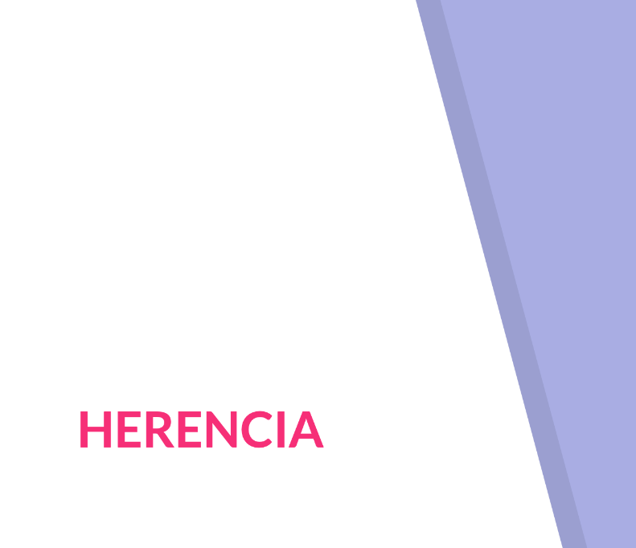
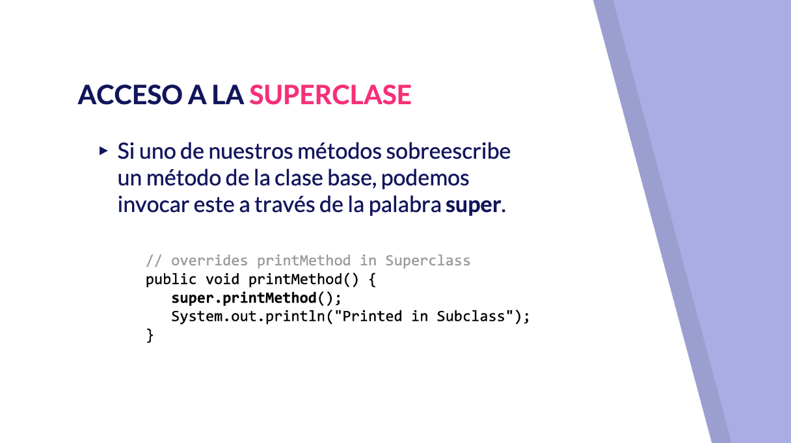
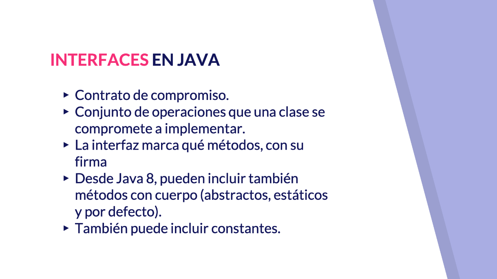
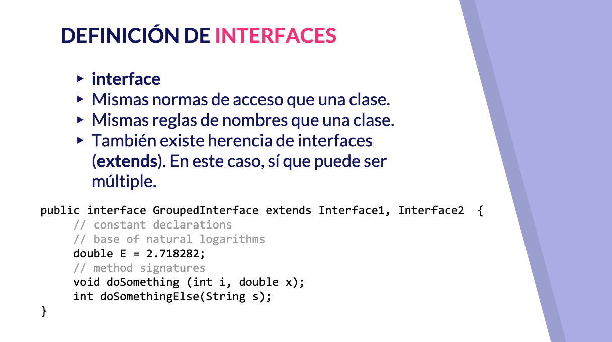
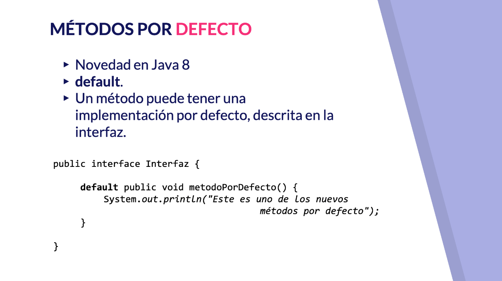
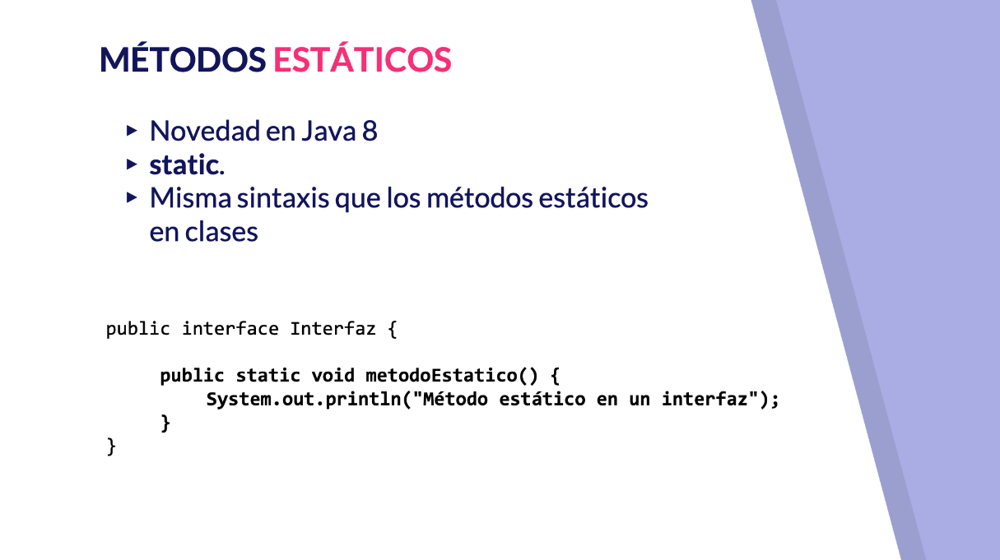
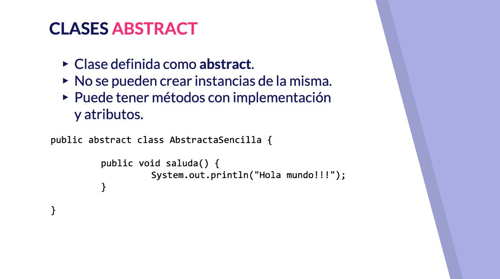
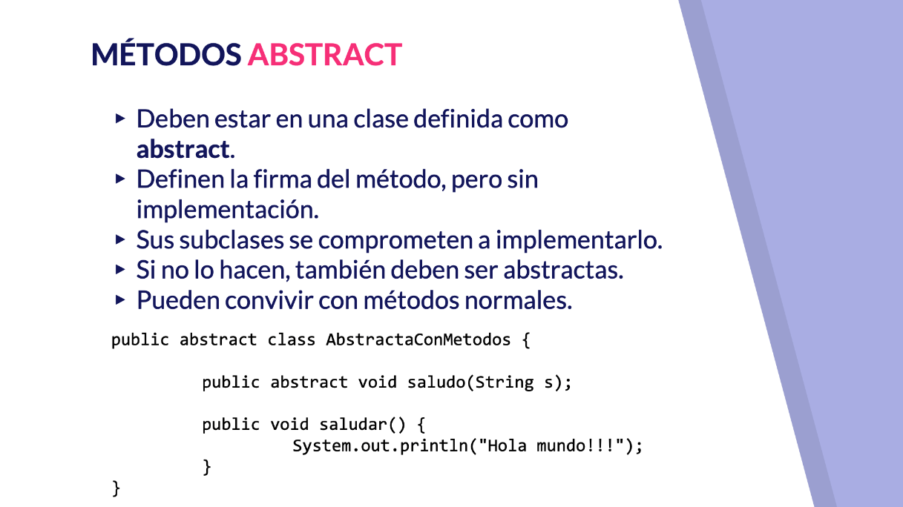

# 6. Uso de herencia 64m
   * Qué es la herencia y los beneficios que aporta 15:52 
   * Polimorfismo 9:43 
   * Uso de super para acceder a un objeto y sus constructores 8:42 
   * Clases abstractas e interfaces I 20:52 
   * Clases abstractas e interfaces II 9:48 
   * Contenido adicional 5
   
# 22. Qué es la herencia y los beneficios que aporta 15:52 

[Herencia](pdfs/22_Herencia.pdf)

## Resumen del Profesor

### 22.1 Herencia

Es un mecanismo fundamental de la Programación Orientada a Objetos, que nos permite que una clase pueda extender el comportamiento o la funcionalidad de otra. De esta forma podemos formar una jerarquía de clases.

En Java, a diferencia de otros lenguajes, solo está permitida la **herencia simple**, de forma que cada clase tiene, como mucho, una clase base. Solo hay una clase especial, `Object`, que no tiene clase base. El resto de clases ya creadas, o por crear, tienen en esta el nivel más básico de su jerarquía (es decir, una clase que no heredia de nadie, realmente está heredando de `Object`).


La sintaxis para indicar que una clase hereda de otra es:

```java
public class Hija extends Padre {


}
```

Una clase que extiende a otra hereda sus atributos y sus métodos (no los constructores), y puede añadir métodos y atributos nuevos. La clase extendida podrá acceder a aquellos atributos/métodos de la clase base marcados como `public`, `protected` o por defecto.

`protected` está poco recomendado para los atributos, ya que en una jerarquía de herencia con varios niveles, una clase *tataranieta* de otra podría seguir accediendo a los atributos, sin poder predecir bien el control sobre ellos. Es más recomendable marcar los atributos como `private`, y acceder a ellos desde métodos `public`.

Si no queremos que nadie pueda heredar de nuestra clase, la marcamos como `final`:

```java
public final class ClaseFinal {

}
```

## Transcripción



Vamos a comenzar un nuevo bloque en el que hablaremos sobre Herencia.

La **herencia** es un mecanismo no solo propio de Java sino de cualquier lenguaje orientado a objetos y es algo fundamental porque es un mecanismo que nos permite asociar unas clases con otra mediante relaciones de jerarquía, de relaciones que podríamos llamar de padre e hijo, de clase madre y clase hija. Se utilizan muchos conceptos para referirse a ella como ya digo clase padre, clase hija, superclase y subclase, los podré utilizar indistintamente.

Este mecanismo propio de la programación orientada a objetos viene marcado para que podamos ir modelando objetos que se basan en otros objetos y poder reutilizar parte de sus variables y parte de código **en principio en Java solamente podemos tener herencia de una clase**, es decir que una clase solamente podría heredar de otra, es decir podría tener solamente un padre, **la herencia múltiple** que si está presente en otros lenguajes de programación como C + + o como Python pues **no la tendríamos presente en Java** y es algo que casi que se agradece porque manejarle es bastante complejo y puede producir muchos quebraderos de cabeza. Por último decir que para que indiquemos que una clase hereda a otra o entiende otra clase existe la palabra reservada `extends`.


Por ejemplo si tuviéramos un sistema bancario podríamos plantearnos el trabajar con cuenta y dentro de las cuentas podríamos tener algunos tipos concretos de cuentas cómo serían las cuentas corrientes y las cuentas de ahorro, como podemos comprobar tanto cuenta corriente como Cuenta Ahorro tienen en común que tienen al mismo padre, la clase CCuenta sin embargo cada una de ellas solamente tiene un padre, una clase tiene siempre como mucho un solo padre y cualquier clase podría tener más de un hijo. De esta manera estamos extendiendo o bien las propiedades o bien las funcionalidades o tanto estructura como comportamiento de la clase CCuenta concretandolo en CCuentaCorriente o CCuentaAhorro.


**Una clase que extiende a otra** hereda de ahi viene el nombre del mecanismo *herencia*, **hereda sus atributos y sus métodos, si bien lo que no hereda son sus constructores**, todos los atributos, todos los métodos, pero lo que no hace es heredar su sus constructores, además las clases heredadas, las clases que extienden a otra podrían añadir nuevos atributos y nuevos métodos si nos fijamos en este gráfico podríamos tener una clase `Trabajador` que tendría una serie de atributos por ejemplo el nombre, he puesto la dirección, el teléfono, el número de la seguridad social, bien esos atributos serían heredados por la clase `Empleado` que además añade otros atributos como sueldo, impuestos y que tiene también algún método cómo `calcularPaga()` paga, calcular el salario y otro clase diferente `Consultor` qué también hereda los atributos de `Trabajador` y tendría como atributos propios a `hora` y `tarifa` y también tendría el método `calcularPaga()` cómo podemos comprobar existe una asociación entre clase extendida y clase base de tipo **es un, is an** en inglés un `Consultor` es un `Trabajador` porque tiene todo lo de un `Trabajador` todas sus propiedades, todos sus atributos y un `Empleado` también es un `Trabajador`.


Cuando hacemos herencia de clase hemos dicho que que **una clase que extiende a otra heredad todos a sus atributos y todos sus métodos** si bien si pensamos en los modificadores de acceso y lo que hablamos en su momento, **una clase que heredé de otras solamente podría acceder a los atributos y métodos que fueran público o protegidos y por defecto si estuvieran en el mismo paquete**, pero sobre todo aquellos públicos y protegidos. Como ya adelantamos el uso de protected no está realmente muy recomendado, porque ya digo incluye también el acceso de las clases del mismo paquete, con lo cual Java nos recomienda incluso que de cara a los atributos a las propiedades que trabajemos con private y que ofrezcamos métodos públicos para que una clase que hereda de otra pudiera acceder a estos atributos. 


Antes de ver el ejemplo vamos a hablar de algún elemento más y podremos ver como una clase que extiende a otra hereda sus atributos y se le pueden añadir tantos métodos como atributos como desee, en particular podríamos añadir nuevos atributos, nuevos métodos que se llamarán igual que otros de la clase base y que solaparían a este de la clase base, es decir si una superclase tiene un atributo y una subclase crea un atributo dentro de su cuerpo que se llame igual solaparía al de la clase base y no podríamos acceder a él y lo mismo sucedería también con los métodos.


Y por último antes de ver el ejemplo si queremos que una clase no sea extendida, que nadie extienda de ella, podríamos marcarla en su definición como `final` ya hemos visto qué `final` servía para no poder modificar el  valor de algunas variables, transformándolas en constantes, de esta forma poniendo una clase como `final` indicaremos que esta clase se puede utilizar con total normalidad, pero que **no se podría heredar de ella**.

### :computer: `101-22-Herencia`

Veamos el ejemplo de los `Trabajador`, `Empleado` y `Consultor` y cómo podríamos heredar de cada una de ellas, bueno en el caso de `Trabajador` hemos visto que sería una clase que tendría un nombre, un puesto, dirección, teléfono y número de la seguridad social, son los atributos que van a modelar a un trabajador y van a decir que de qué está compuesto.

*`Trabajador`*

```java
package herencia;

public class Trabajador {
	
   private String nombre;
   private String puesto;
   private String direccion;
   private String telefono;
   private String nSS; //Número Seguridad Social
	
   public Trabajador(String nombre, String puesto, String direccion, String telefono, String nSS) {
      this.nombre = nombre;
      this.puesto = puesto;
      this.direccion = direccion;
      this.telefono = telefono;
      this.nSS = nSS;
   }

   public String getNombre() {
      return nombre;
   }

   public void setNombre(String nombre) {
      this.nombre = nombre;
   }

   public String getPuesto() {
      return puesto;
   }

   public void setPuesto(String puesto) {
      this.puesto = puesto;
   }

   public String getDireccion() {
      return direccion;
   }

   public void setDireccion(String direccion) {
      this.direccion = direccion;
   }

   public String getTelefono() {
      return telefono;
   }

   public void setTelefono(String telefono) {
      this.telefono = telefono;
   }

   public String getnSS() {
      return nSS;
   }

   public void setnSS(String nSS) {
      this.nSS = nSS;
   }

   @Override
   public String toString() {
      return "Trabajador [nombre=" + nombre + ", puesto=" + this.puesto + ", direccion=" 
            + direccion + ", telefono=" + telefono + ", nSS=" + nSS + "]";
   }
	
}
```

Estos atributos son los que van a ser heredados por ejemplo por la clase `Empleado` como podemos comprobar en esta línea indicamos a la hora de definir la clase que `Empleado` extiende a un `Trabajador` es decir `Empleado` hereda todos los atributos y todos los métodos de trabajador.

*`Empleado`*

```java
package herencia;

public class Empleado extends Trabajador {

   private double sueldo;
   private double impuestos;

   private final int PAGAS = 14;

   public Empleado(String nombre, String puesto, String direccion, String telefono, String nSS, 
                   double sueldo, double impuestos) {
      // Profundizamos en "super" en las próximas lecciones
      super(nombre, puesto, direccion, telefono, nSS);
      this.sueldo = sueldo;
      this.impuestos = impuestos;
   }

   public double getSueldo() {
      return sueldo;
   }

   public void setSueldo(double sueldo) {
      this.sueldo = sueldo;
   }

   public double getImpuestos() {
      return impuestos;
   }

   public void setImpuestos(double impuestos) {
      this.impuestos = impuestos;
   }

   public double calcularPaga() {
      return (sueldo - impuestos) / PAGAS;
   }

   @Override
   public String toString() {
      return "Empleado [sueldo=" + sueldo + ", impuestos=" + impuestos + ", getNombre()=" + getNombre()
         + ", getPuesto()=" + getPuesto() + ", getDireccion()=" + getDireccion() + ", getTelefono()="
         + getTelefono() + ", getnSS()=" + getnSS() + "]";
   }

}
```

Si recordamos en trabajadores tenemos todo indicado como como privado a nivel de atributo y todos los métodos eran públicos como no estaba recomendando Java añadiendo a los atributos y métodos de trabajador un empleado tendrá un sueldo y unos impuestos y además añadimos una constante llamada paga vale en principio un trabajador de empresa que trabajadores y bueno a la hora de hacer la creación de un empleado tendríamos que diferenciar entre crear la parte propia de empleado y la parte de empleado que es heredada de trabajador profundizaremos en el uso de Super en un vídeo dentro de lo que vale ahora simplemente pues tenemos presente que a la hora de construir un empleado tenemos que construirlo de esta manera primero la parte de propia del trabajador y luego la parte que es propia del empleado tendríamos los metodos getter y setter de los atributos propios de un empleado y vamos a calcular la paga de un empleado este método que que hace uso de varios atributos para calcular el la paga de un empleado que sería el sueldo total restándole los impuestos y dividiendo entre el número de pagas de esa manera tendríamos serie sueldo mensual de un trabajador de ti ahora ver la clase consulto en la definición tienen como que bueno un empleado encendía de trabajador un consultor también extiende de trabajador son clases que tienen un mismo padre en este caso un consultor que sería algo así como un trabajador externo a la compañía vale podríamos plantear lo de esa manera bueno pues tendría una serie de horas que trabaja para nuestra empresa y y la tarifa que tiene no a la hora de construir tiene en común que tiene que construir con súper la parte común a trabajador y bueno se te haríamos los atributos propios y en este caso que habíamos dicho también que íbamos a implementar el método calcular paga la paga del consultor sería simplemente la tarifa por horas multiplicada por el número de Orange a la hora de crear una serie distancia de esta clase pues podríamos plantearnos en crear un trabajador un empleado y un consultor e interaccionar un poco con ello recordemos que también hemos implementado los métodos presten manera a través de la implementación automática que hace eclipse de la generación de código y vamos a poder consultar a cada uno de estos de estos objetos trabajador lo creamos con su constructor de nombre Bill Gates es el presidente Mané su dirección está en ritmo no vamos a guardar ni su número de teléfono ni su número de seguridad social vale esto lo creamos como cadena pastillas también lo podríamos crear como módulo o simplemente tener un constructor de trabajador que recogiera menos argumento vamos a crear también un empleado el empleado sería Larry Ellison vale también es Presidente en red book que la sé dónde está Oracle tiene un buen salario vale pagando una cantidad de impuestos y por último tendríamos un consulto y yo sería el consultor jefe Google si no tiene este caso pues tendría una serie de horas que trabaja para nosotros y una tarifa por hora imprimo ahora el resultado de crear este objeto o trabajador un empleado un consultor y el cálculo de para de cada uno de ello tendríamos esto como resultado el trabajador eres Bill Gates con estos datos el empleado que es Larry Ellison tendría aparte de los atributos propios tendría también lo perdona parte de los Comunes de trabajo de los cuatro puntos propio su salario mensual su paga mensual serie está de aquí y nuestro Consultor sitios también tendrían aquí teníamos más tributo tendría también un paga total sería el número de horas por el la tarifa sería la de 20.000 20.000 dólares o euros función de lo que estuviéramos expresando la cuantía como podemos comprobar a la hora de generar el metro de tu stream to string de trabajador en prime solo todo su atributo cuando hemos generado el método to string empleado queréis lo podemos volver a general podemos indicar que te imprima los atributos propios podríamos desmarcarse queremos la constante y también podríamos marcar que imprimiera o que utilizara los métodos heredados de manera que a la hora de definir un un empleado pues también pudiéramos conocer

, podemos indicar que imprima los atributos propios salimos de marcha queremos la constante y también podremos marcar que imprimiera o que utilizara los métodos heredados de manera que a la hora de definir un un empleado pues también pudiéramos conocer lo que haya heredado de la clase trabajador como los atributos que trabajador eran privados no podemos acceder directamente a ellos pero si podemos acceder diferente métete en particular a los método Goethe esta forma a la hora de generar lo genera este código en el que pone primero los atributos propios y luego está llamando a los atributos de la clase de la clase trabajadora por eso no han generado un empleado de esta manera no solamente empleado no podremos comprobarlo primero los atributos propios y después te hace viendo a todos los atributos de un trabajador a través de los métodos con esto terminamos de presentar la herencia y pasamos a hablar de otro concepto que viene aparejado que es el de poli porfi


*``*

```java
```
*``*

```java
```


## 23. Polimorfismo 9:43 

[Polimorfismo](pdfs/23_Polimorfismo.pdf)

## Resumen del Profesor

### 23.1 Referencias y subclases

Una subclase puede ser accedida a través de una referencia de su superclase. Esto es muy útil si pensamos pasar parámetros a un método, para que sea más versátil.

```java
public static void saludar(Trabajador t) {
    System.out.println("Hola, " + t.getNombre());
}
```

### 23.2 Ocultación de métodos y polimorfismo

Ya hemos visto que una clase extendida puede *ocultar* métodos o atributos de la clase base, creando uno igual con el mismo nombre. ¿Qué sucede si tenemos un método ocultado, pero accedemos desde una referencia de la superclase?

```java
Trabajador empleado;
empleado = new Empleado("Larry Ellison", "Presidente", "Redwood", "", "", 100000.0, 1000.0);
empleado.calcularPaga();
```

La máquina virtual de java es capaz de detectar el tipo del objeto, siendo este quien tenga prioridad sobre el tipo de la referencia usada. A esto lo llamamos polimorfismo.


## Transcripción


# 24. Uso de super para acceder a un objeto y sus constructores 8:42 

[Uso de super para acceder a un objeto y sus constructores](pdfs/24_Super.pdf)

## Resumen del Profesor

### 24.1 Acceso a la superclase

Podemos acceder a los elementos de nuestra clase base a través de la palabra `super`. En particular, podemos acceder a los métodos, aunque estos hayan sido sobrescritos:

```java
// overrides printMethod in Superclass
public void printMethod() {
   super.printMethod();
   System.out.println("Printed in Subclass");
}
```

### 24.2 Constructores y `super`

Cuando construimos una instancia de una clase derivada, tenemos que construir también la parte correspondiente a su clase base. Por defecto, Java espera que hayamos incluido un constructor sin parámetros en la clase base, y él se encargará de todo.

También podemos invocar, explícitamente, al constructor:

```java
public Empleado(…) {
     super(nombre, puesto, direccion, telefono, nSS);
     this.sueldo = sueldo;
     this.impuestos = impuestos;
}
```

## Transcripción





# 25. Clases abstractas e interfaces I 20:52 

[Clases abstractas e interfaces](pdfs/25_Interfaces_y_clases_abstractas.pdf)

## Resumen del Profesor

### 25.1 Interfaces

Una interfaz es un contrato de comportamiento que adquiere una clase, es decir, un conjunto de operaciones que se compromete a implementar. Hasta Java 7, las interfaces definían solamente la firma de estos métodos, pero con Java 8, también pueden incluir implementaciones por defecto.

#### 25.1.1 Definición


Las interfaces siguen las mismas normas de nomenclatura y modificadores de acceso que las clases:

```java
public interface GroupedInterface extends Interface1, Interface2  {
     // constant declarations
     // base of natural logarithms
     double E = 2.718282;
     // method signatures
     void doSomething (int i, double x);
     int doSomethingElse(String s);
}
```

Las interfaces también pueden heredar de otra. En este caso, sí que se permite la herencia múltiple.

#### 25.1.2 Implementación

Una clase puede implementar una o varias interfaces:

```java
public class RectanglePlus implements Relatable {
//...
    public int isLargerThan(Relatable other) {
        RectanglePlus otherRect = (RectanglePlus)other;
        if (this.getArea() < otherRect.getArea())
            return -1;
        else if (this.getArea() > otherRect.getArea())
            return 1;
        else
            return 0;               
    }
}
```

#### 25.1.3 Interfaces como tipos de referencias

Podemos utilizar una interfaz para almacenar una referencia a un objeto de una clase que implemente dicha interfaz:

```java
RectanglePlus rectangleOne = new RectanglePlus(10, 20);
Relatable rectangleTwo = new RectanglePlus(20, 10);
```

#### 25.1.4 Métodos por defecto y estáticos

Java 8 incluye la posibilidad de que las interfaces proporcionen el cuerpo de un método, siempre y cuando este esté marcado como `default` o `static`:

```java
public interface Interfaz {

     default public void metodoPorDefecto() {
          System.out.println("Este es uno de los nuevos métodos por defecto");
     }

}
```

Las clases que implementen esta interfaz no tienen porqué dar una nueva implementación si no la necesitan.


## Transcripción











# 25. Clases abstractas e interfaces II 9:48 

[Clases abstractas e interfaces](pdfs/25_Interfaces_y_clases_abstractas.pdf)

## Resumen del Profesor

### 25.2 Clases abstractas

Son clases definidas como `abstract`. Tienen las siguientes características:

* **No se pueden instanciar**
* Pueden tener atributos y métodos con implementación.

```java
public abstract class AbstractaSencilla {

    public void saluda() {
        System.out.println("Hola mundo!!!");
    }

}
```

#### 25.2.1 Métodos `abstract`

Son métodos que están definidos en una clase `abstract`. Definen la firma del método, pero no su implementación. Las subclases de esta clase base deben aportar su implementación. Pueden convivir con métodos normales.

```java
public abstract class AbstractaConMetodos {

    public abstract void saludo(String s);

    public void saludar() {
        System.out.println("Hola mundo!!!");
    }
}
```

### 25.3 Clases abstractas vs Interfaces


¿Cuándo usar una u otra?

INTERFACES |	CLASES ABSTRACTAS
-----------|-------------------
Clases no relacionadas podrán implementar los métodos. | Compartir código con clases muy relacionadas.
Si se quiere indicar que existe un tipo de comportamiento, pero no sabemos quien lo implementa.	| Las clases derivadas usarán métodos protected o private.
Si necesitamos tener herencia múltiple.	| Queremos definir atributos que no sean estáticos o constantes.


## Transcripción







## Contenido adicional 4   

[Herencia](pdfs/22_Herencia.pdf)

[Polimorfismo](pdfs/23_Polimorfismo.pdf)

[Uso de super para acceder a un objeto y sus constructores](pdfs/24_Super.pdf)

[Clases abstractas e interfaces](pdfs/25_Interfaces_y_clases_abstractas.pdf)
