# 6. Uso de herencia 64m
   * Qué es la herencia y los beneficios que aporta 15:52 
   * Polimorfismo 9:43 
   * Uso de super para acceder a un objeto y sus constructores 8:42 
   * Clases abstractas e interfaces I 20:52 
   * Clases abstractas e interfaces II 9:48 
   * Contenido adicional 5
   
# 22. Qué es la herencia y los beneficios que aporta 15:52 

[Herencia](pdfs/22_Herencia.pdf)

## Resumen del Profesor

### 22.1 Herencia

Es un mecanismo fundamental de la Programación Orientada a Objetos, que nos permite que una clase pueda extender el comportamiento o la funcionalidad de otra. De esta forma podemos formar una jerarquía de clases.

En Java, a diferencia de otros lenguajes, solo está permitida la **herencia simple**, de forma que cada clase tiene, como mucho, una clase base. Solo hay una clase especial, `Object`, que no tiene clase base. El resto de clases ya creadas, o por crear, tienen en esta el nivel más básico de su jerarquía (es decir, una clase que no heredia de nadie, realmente está heredando de `Object`).


La sintaxis para indicar que una clase hereda de otra es:

```java
public class Hija extends Padre {


}
```

Una clase que extiende a otra hereda sus atributos y sus métodos (no los constructores), y puede añadir métodos y atributos nuevos. La clase extendida podrá acceder a aquellos atributos/métodos de la clase base marcados como `public`, `protected` o por defecto.

`protected` está poco recomendado para los atributos, ya que en una jerarquía de herencia con varios niveles, una clase *tataranieta* de otra podría seguir accediendo a los atributos, sin poder predecir bien el control sobre ellos. Es más recomendable marcar los atributos como `private`, y acceder a ellos desde métodos `public`.

Si no queremos que nadie pueda heredar de nuestra clase, la marcamos como `final`:

```java
public final class ClaseFinal {

}
```

## Transcripción


Vamos a comenzar un nuevo bloque en el que hablaremos sobre Herencia.

La **herencia** es un mecanismo no solo propio de Java sino de cualquier lenguaje orientado a objetos y es algo fundamental porque es un mecanismo que nos permite asociar unas clases con otra mediante relaciones de jerarquía, de relaciones que podríamos llamar de padre e hijo, de clase madre y clase hija. Se utilizan muchos conceptos para referirse a ella como ya digo clase padre, clase hija, superclase y subclase, los podré utilizar indistintamente.

Este mecanismo propio de la programación orientada a objetos viene marcado para que podamos ir modelando objetos que se basan en otros objetos y poder reutilizar parte de sus variables y parte de código **en principio en Java solamente podemos tener herencia de una clase**, es decir que una clase solamente podría heredar de otra, es decir podría tener solamente un padre, **la herencia múltiple** que si está presente en otros lenguajes de programación como C + + o como Python pues **no la tendríamos presente en Java** y es algo que casi que se agradece porque manejarle es bastante complejo y puede producir muchos quebraderos de cabeza. Por último decir que para que indiquemos que una clase hereda a otra o entiende otra clase existe la palabra reservada `extends`.


Por ejemplo si tuviéramos un sistema bancario podríamos plantearnos el trabajar con cuenta y dentro de las cuentas podríamos tener algunos tipos concretos de cuentas cómo serían las cuentas corrientes y las cuentas de ahorro, como podemos comprobar tanto cuenta corriente como Cuenta Ahorro tienen en común que tienen al mismo padre, la clase CCuenta sin embargo cada una de ellas solamente tiene un padre, una clase tiene siempre como mucho un solo padre y cualquier clase podría tener más de un hijo. De esta manera estamos extendiendo o bien las propiedades o bien las funcionalidades o tanto estructura como comportamiento de la clase CCuenta concretandolo en CCuentaCorriente o CCuentaAhorro.


**Una clase que extiende a otra** hereda de ahi viene el nombre del mecanismo *herencia*, **hereda sus atributos y sus métodos, si bien lo que no hereda son sus constructores**, todos los atributos, todos los métodos, pero lo que no hace es heredar su sus constructores, además las clases heredadas, las clases que extienden a otra podrían añadir nuevos atributos y nuevos métodos si nos fijamos en este gráfico podríamos tener una clase `Trabajador` que tendría una serie de atributos por ejemplo el nombre, he puesto la dirección, el teléfono, el número de la seguridad social, bien esos atributos serían heredados por la clase `Empleado` que además añade otros atributos como sueldo, impuestos y que tiene también algún método cómo `calcularPaga()` paga, calcular el salario y otro clase diferente `Consultor` qué también hereda los atributos de `Trabajador` y tendría como atributos propios a `hora` y `tarifa` y también tendría el método `calcularPaga()` cómo podemos comprobar existe una asociación entre clase extendida y clase base de tipo **es un, is an** en inglés un `Consultor` es un `Trabajador` porque tiene todo lo de un `Trabajador` todas sus propiedades, todos sus atributos y un `Empleado` también es un `Trabajador`.


Cuando hacemos herencia de clase hemos dicho que que **una clase que extiende a otra heredad todos a sus atributos y todos sus métodos** si bien si pensamos en los modificadores de acceso y lo que hablamos en su momento, **una clase que heredé de otras solamente podría acceder a los atributos y métodos que fueran público o protegidos y por defecto si estuvieran en el mismo paquete**, pero sobre todo aquellos públicos y protegidos. Como ya adelantamos el uso de protected no está realmente muy recomendado, porque ya digo incluye también el acceso de las clases del mismo paquete, con lo cual Java nos recomienda incluso que de cara a los atributos a las propiedades que trabajemos con private y que ofrezcamos métodos públicos para que una clase que hereda de otra pudiera acceder a estos atributos. 


Antes de ver el ejemplo vamos a hablar de algún elemento más y podremos ver como una clase que extiende a otra hereda sus atributos y se le pueden añadir tantos métodos como atributos como desee, en particular podríamos añadir nuevos atributos, nuevos métodos que se llamarán igual que otros de la clase base y que solaparían a este de la clase base, es decir si una superclase tiene un atributo y una subclase crea un atributo dentro de su cuerpo que se llame igual solaparía al de la clase base y no podríamos acceder a él y lo mismo sucedería también con los métodos.


Y por último antes de ver el ejemplo si queremos que una clase no sea extendida, que nadie extienda de ella, podríamos marcarla en su definición como `final` ya hemos visto qué `final` servía para no poder modificar el  valor de algunas variables, transformándolas en constantes, de esta forma poniendo una clase como `final` indicaremos que esta clase se puede utilizar con total normalidad, pero que **no se podría heredar de ella**.

### :computer: `101-22-Herencia`

Veamos el ejemplo de los `Trabajador`, `Empleado` y `Consultor` y cómo podríamos heredar de cada una de ellas, bueno en el caso de `Trabajador` hemos visto que sería una clase que tendría un nombre, un puesto, dirección, teléfono y número de la seguridad social, son los atributos que van a modelar a un trabajador y van a decir que de qué está compuesto.

*`Trabajador`*

```java
package herencia;

public class Trabajador {
	
   private String nombre;
   private String puesto;
   private String direccion;
   private String telefono;
   private String nSS; //Número Seguridad Social
	
   public Trabajador(String nombre, String puesto, String direccion, String telefono, String nSS) {
      this.nombre = nombre;
      this.puesto = puesto;
      this.direccion = direccion;
      this.telefono = telefono;
      this.nSS = nSS;
   }

   public String getNombre() {
      return nombre;
   }

   public void setNombre(String nombre) {
      this.nombre = nombre;
   }

   public String getPuesto() {
      return puesto;
   }

   public void setPuesto(String puesto) {
      this.puesto = puesto;
   }

   public String getDireccion() {
      return direccion;
   }

   public void setDireccion(String direccion) {
      this.direccion = direccion;
   }

   public String getTelefono() {
      return telefono;
   }

   public void setTelefono(String telefono) {
      this.telefono = telefono;
   }

   public String getnSS() {
      return nSS;
   }

   public void setnSS(String nSS) {
      this.nSS = nSS;
   }

   @Override
   public String toString() {
      return "Trabajador [nombre=" + nombre + ", puesto=" + this.puesto + ", direccion=" 
            + direccion + ", telefono=" + telefono + ", nSS=" + nSS + "]";
   }
	
}
```

Estos atributos son los que van a ser heredados por ejemplo por la clase `Empleado` como podemos comprobar en esta línea indicamos a la hora de definir la clase que `Empleado` extiende a un `Trabajador` es decir `Empleado` hereda todos los atributos y todos los métodos de trabajador.

*`Empleado`*

```java
package herencia;

public class Empleado extends Trabajador {

   private double sueldo;
   private double impuestos;

   private final int PAGAS = 14;

   public Empleado(String nombre, String puesto, String direccion, String telefono, String nSS, 
                   double sueldo, double impuestos) {
      // Profundizamos en "super" en las próximas lecciones
      super(nombre, puesto, direccion, telefono, nSS);
      this.sueldo = sueldo;
      this.impuestos = impuestos;
   }

   public double getSueldo() {
      return sueldo;
   }

   public void setSueldo(double sueldo) {
      this.sueldo = sueldo;
   }

   public double getImpuestos() {
      return impuestos;
   }

   public void setImpuestos(double impuestos) {
      this.impuestos = impuestos;
   }

   public double calcularPaga() {
      return (sueldo - impuestos) / PAGAS;
   }

   @Override
   public String toString() {
      return "Empleado [sueldo=" + sueldo + ", impuestos=" + impuestos + ", getNombre()=" + getNombre()
         + ", getPuesto()=" + getPuesto() + ", getDireccion()=" + getDireccion() + ", getTelefono()="
         + getTelefono() + ", getnSS()=" + getnSS() + "]";
   }

}
```

Si recordamos en `Trabajador` tenemos todo indicado como privado a nivel de atributo y todos los métodos eran públicos como lo recomienda Java. Añadiendo a los atributos y métodos de `Trabajador` un `Empleado` tendrá un sueldo y unos impuestos y además añadimos una constante llamada PAGAS, en principio un trabajador de esta empresa tendrá 14 pagas. A la hora de construir un `Empleado` habíamos dicho aunque `Trabajador` tiene un constructor un `Empleado` no hereda los constructores del `Trabajador` y a la hora de hacer la creación de un `Empleado` tendríamos que diferenciar entre crear la parte propia de `Empleado` y la parte de `Empleado` que es heredada de `Trabajador`.

```java
   public Empleado(String nombre, String puesto, String direccion, String telefono, String nSS, 
                   double sueldo, double impuestos) {
      // Profundizamos en "super" en las próximas lecciones
      super(nombre, puesto, direccion, telefono, nSS);
      this.sueldo = sueldo;
      this.impuestos = impuestos;
   }
```

Profundizaremos en el uso de `super` en una lección posterior, ahora simplemente tenemos presente que a la hora de construir un `Empleado` tenemos que construirlo de esta manera primero la parte propia del `Trabajador` y luego la parte que es propia del `Empleado`. 

Tendríamos los metodos getter y setter de los atributos propios de un `Empleado` y vamos a calcular la paga del `Empleado` con el método que hace uso de varios atributos para calcular la paga de un `Empleado` que sería el sueldo total restándole los impuestos y dividiendo entre el número de pagas de esa manera tendríamos serie sueldo mensual de un trabajador de tipo `Empleado`.

```java
   public double calcularPaga() {
      return (sueldo - impuestos) / PAGAS;
   }
```

Si pasamos a ver ahora la clase `Consultor` tiene en común con la clase `Empleado` que un `Consultor` también extiende de un `Trabajador`, son clases con el mismo padre,  en este caso un `Consultor` que sería algo así como un trabajador externo a la compañía, podríamos plantearlo de esa manera, tendría una serie de horas que trabaja para nuestra empresa y la tarifa que tiene, a la hora de construir tiene en común que tiene que construir con súper la parte común a `Trabajador` y setteariamos los atributos propios y en este caso que habíamos dicho también que íbamos a implementar el método `calcularPaga()` la paga del `Consultor` sería simplemente la tarifa por horas multiplicada por el número de horas.

*`Consultor`*

```java
package herencia;

public class Consultor extends Trabajador {
	
   private int horas;
   private double tarifa;
		
   public Consultor(String nombre, String puesto, String direccion, String telefono, String nSS, int horas, double tarifa) {
      super(nombre, puesto, direccion, telefono, nSS);
      this.horas = horas;
      this.tarifa = tarifa;
   }

   public int getHoras() {
      return horas;
   }

   public void setHoras(int horas) {
      this.horas = horas;
   }

   public double getTarifa() {
      return tarifa;
   }

   public void setTarifa(double tarifa) {
      this.tarifa = tarifa;
   }
	
   public double calcularPaga() {
      return horas*tarifa;
   }

   @Override
   public String toString() {
      return "Consultor [horas=" + horas + ", tarifa=" + tarifa + ", getNombre()=" 
         + getNombre() + ", getPuesto()=" + getPuesto() + ", getDireccion()=" + getDireccion() 
	 + ", getTelefono()=" + getTelefono() + ", getnSS()=" + getnSS() + "]";
   }

}
```

A la hora de crear una serie de instancias de estas clases podríamos plantearnos en crear un `Trabajador` un `Empleado` y un `Consultor` e interaccionar un poco con ellos, recordemos que también hemos implementado los métodos `toString()` a través de la implementación automática que hace Eclipse, de la generación de código y vamos a poder consultar a cada uno de estos objetos.

*`Herencia`*

```java
package herencia;

public class Herencia {

   public static void main(String[] args) {
		
      Trabajador trabajador;
      Empleado empleado;
      Consultor consultor;
		
      trabajador = new Trabajador("Bill Gates", "Presidente", "Redmond", "", "");
      empleado = new Empleado("Larry Ellison", "Presidente", "Redwood", "", "", 100000.0, 1000.0);
      consultor = new Consultor("Steve Jobs", "Consultor Jefe", "Cupertino", "", "", 20, 1000.0);
		
      System.out.println(trabajador);
      System.out.println(empleado);
      System.out.println(empleado.calcularPaga());
      System.out.println(consultor);
      System.out.println(consultor.calcularPaga());

   }
}
```

`Trabajador` lo creamos con su constructor de nombre Bill Gates, es el presidente, su dirección está en Redmond, no vamos a guardar ni su número de teléfono, ni su número de seguridad social, esto lo creamos como cadena vacías, también lo podríamos crear como `null` o simplemente tener un constructor de `Trabajador` que recogiera menos argumento.

Vamos a crear también un `Empleado`, el empleado sería Larry Ellison, también es Presidente, en Redwood que es la sede dónde está Oracle, tiene un buen salario, pagando una cantidad de impuestos.

Y por último tendríamos un `Consultor` Steve Jobs sería el consultor jefe en Cupertino en este caso tendría una serie de horas que trabaja para nosotros y una tarifa por horas.

Si imprimos ahora el resultado de crear estos objetos `Trabajador` un `Empleado` un `Consultor` y el cálculo de pagas de cada uno de ellos tendríamos esto como resultado lo siguiente:

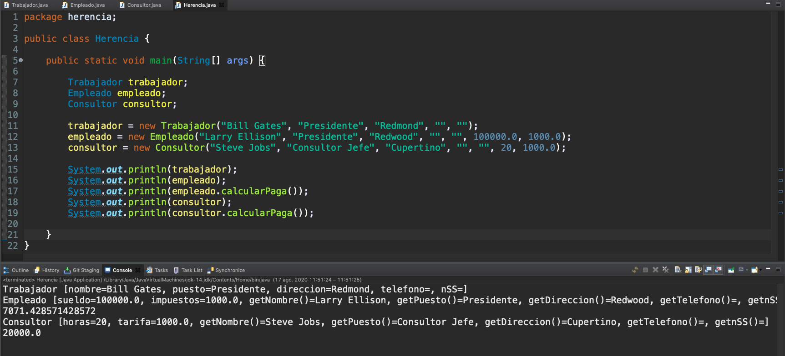


El trabajador Bill Gates con estos datos el empleado que es Larry Ellison tendría aparte de los atributos propios tendría también los atributos comunes de `Trabajador` de los cuatro puntos propio su salario mensual su paga mensual serie está de aquí y nuestro Consultor sitios también tendrían aquí teníamos más tributo tendría también un paga total sería el número de horas por el la tarifa sería la de 20.000 20.000 dólares o euros función de lo que estuviéramos expresando la cuantía.

Como podemos comprobar a la hora de generar el método `toString()` de `Trabajador` como es obvio tiene sus atributos. Cuando generamos el método `toString()` de `Empleado` podemos indicar que incluya los atributos propios podríamos desmarcarse la constante y también podríamos marcar que imprimiera o que utilizara los métodos heredados de manera que a la hora de definir un un empleado pues también pudiéramos conocer lo que haya heredado de la clase trabajador. 


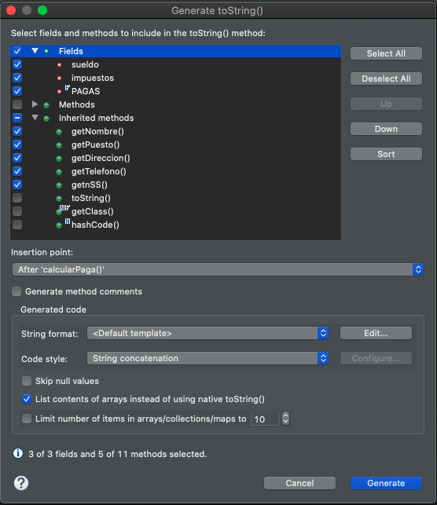

Como los atributos de trabajador eran privados, a la hora de generar lo genera pone primero los atributos propios y luego está llamando a los atributos de la clase trabajadora. 

### :computer: `101-22-Herencia`

Otro ejemplo que podemos ver es cuando declaramos una clase final.

*`ClaseFinal`*

```java
package herencia;

public final class ClaseFinal {
	
	

}
```

Esta clase final no la podemos usar para extender a partir de ella.

*`ClaseExtendida`*

```java
package herencia;

public class ClaseExtendida extends ClaseFinal {
}
```

Nos marcara el siguiente error 

```sh
The type ClaseExtendida cannot subclass the final class ClaseFinal
```


## 23. Polimorfismo 9:43 

[Polimorfismo](pdfs/23_Polimorfismo.pdf)

## Resumen del Profesor

### 23.1 Referencias y subclases

Una subclase puede ser accedida a través de una referencia de su superclase. Esto es muy útil si pensamos pasar parámetros a un método, para que sea más versátil.

```java
public static void saludar(Trabajador t) {
    System.out.println("Hola, " + t.getNombre());
}
```

### 23.2 Ocultación de métodos y polimorfismo

Ya hemos visto que una clase extendida puede *ocultar* métodos o atributos de la clase base, creando uno igual con el mismo nombre. ¿Qué sucede si tenemos un método ocultado, pero accedemos desde una referencia de la superclase?

```java
Trabajador empleado;
empleado = new Empleado("Larry Ellison", "Presidente", "Redwood", "", "", 100000.0, 1000.0);
empleado.calcularPaga();
```

La máquina virtual de java es capaz de detectar el tipo del objeto, siendo este quien tenga prioridad sobre el tipo de la referencia usada. A esto lo llamamos polimorfismo.


## Transcripción


Vamos a continuar hablando sobre herencia trabajando en particular el **concepto de Polimorfismo**.

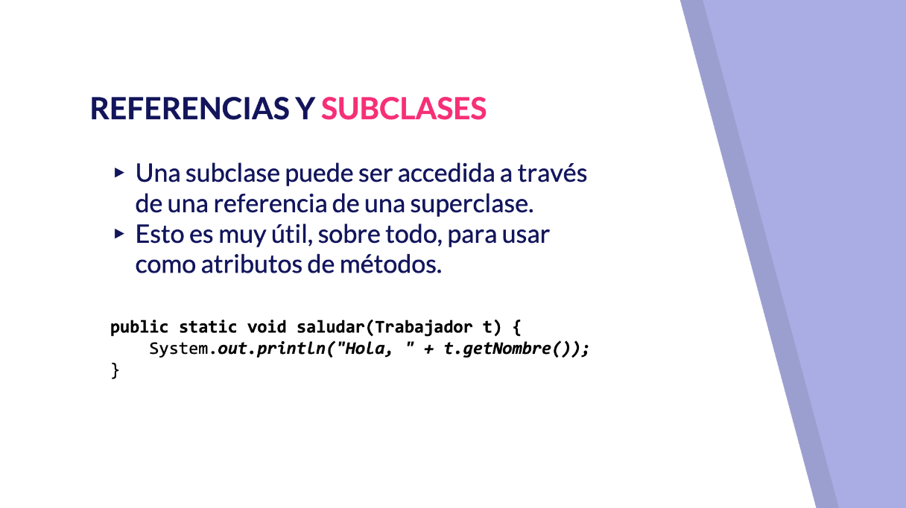

Lo primero que tenemos que tener presente a la hora de trabajar con herencias de clases es algo que quizá ha podido quedar muy sutil en la lección anterior, yo indicaba que cuando tenemos una herencia entre dos clases existe una relación de tipo **ES UN** es decir si teníamos que un `Consultor` era un `Trabajador` y un `Empleado` también era un `Trabajador` entre `Consultor` y `Trabajador` hay una referencia de tipo **ES UN** **esto que puede quedar solamente como algo anecdótico se plasma en la realidad en el hecho de que podemos utilizar referencias de una superclase para almacenar objetos o para referenciar objetos de un tipo de su clase en particular** por ejemplo podríamos utilizar referencias de `Trabajador` para hacer referencia a `Empleado` o para hacer referencia a `Consultor` además de para hacer referencia a `Trabajador`. 

**Esto es util por ejemplo si queremos tener un método que trabaje no solamente con la clase base, sino con las clases heredadas** por ejemplo el que tenemos en pantalla, si quisiéramos tener un método que saludara a cualquier trabajador podríamos recibir un `Trabajador` como argumento y como cualquier `Trabajador` tiene 
un método `getNombre()` ya sea el `Trabajador`, el `Empleado` o el `Consultor` o el empleado podríamos saludarlo directamente, quién dice saludar, podría utilizarlo en un sistema que sirviera para para fichar la entrada y la salida de un empleado en una empresa con la hora, podríamos utilizar una clase genérica aunque tuviéramos diferentes tipos de trabajadores implementados, esto va a ser algo muy potente ya digo sobre todo a la hora de poder trabajar con métodos, recibir argumento o devolver argumento el poder utilizar una superclase aunque la instancia final sea de alguna subclase.


También hablamos del concepto de **Ocultación de Métodos** y es que si una determinada subclase añade un método que se llame igual, con el mismo nombre y que tenga la misma firma que otro de la clase base, lo "ocultara". Podríamos pensar que esto puede ser útil porque sirve para que una subclase matice algo en particular, por ejemplo de cálculo de la paga, lo matice en particular, empieza a darnos cierto quebradero de cabeza cuando trabajamos con referencia de tipo de la clase base como hablábamos antes, qué pasa si tenemos una referencia de tipo `Trabajador` para crear un `Empleado` y llamamos al método `calcularPaga()`.

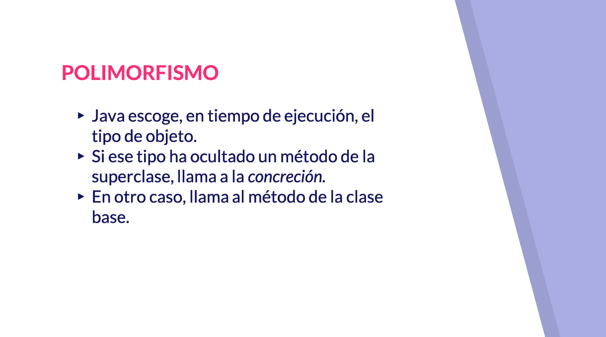

Aquí es donde cobra protagonismo el polimorfismo y es que **Java escoge en tiempo de ejecución el tipo de objeto**, con lo cual si la referencia es de tipo `Trabajador` pero la instancia de tipo `Empleado` va a llamar al método concreto de `Empleado` si es que ha ocultado el método de `Trabajador`, en otro caso si no hubiera ocultado ese método llamaría entonces al método de la clase base.

Veamos estos dos ejemplos de polimorfismo a la hora de poder recibirlo dentro de un objeto con referencia del mismo tipo y la llamada al método de `calcularPaga()`.

### :computer: `101-23-Polimorfismo`

Hemos modificado un poco el ejemplo anterior para tener que un `Trabajador` tiene un salario base, que viene marcado mediante una constante de tipo double, cualquier `Trabajador` tiene una pagaba base.

*`Trabajador`*

```java
package polimorfismo;

public class Trabajador {

   private String nombre;
   private String puesto;
   private String direccion;
   private String telefono;
   private String nSS; // Número Seguridad Social

   private static final double SALARIO_BASE = 30000.0;

   public Trabajador(String nombre, String puesto, String direccion, String telefono, String nSS) {
      this.nombre = nombre;
      this.puesto = puesto;
      this.direccion = direccion;
      this.telefono = telefono;
      this.nSS = nSS;
   }

   public String getNombre() {
      return nombre;
   }

   public void setNombre(String nombre) {
      this.nombre = nombre;
   }

   public String getPuesto() {
      return puesto;
   }

   public void setPuesto(String puesto) {
      this.puesto = puesto;
   }

   public String getDireccion() {
      return direccion;
   }

   public void setDireccion(String direccion) {
      this.direccion = direccion;
   }

   public String getTelefono() {
      return telefono;
   }

   public void setTelefono(String telefono) {
      this.telefono = telefono;
   }

   public String getnSS() {
      return nSS;
   }

   public void setnSS(String nSS) {
      this.nSS = nSS;
   }

   public double calcularPaga() {
      return SALARIO_BASE;
   }

   @Override
   public String toString() {
      return "Trabajador [nombre=" + nombre + ", Puesto=" + puesto + ", direccion=" 
                      + direccion + ", telefono=" + telefono + ", nSS=" + nSS + "]";
   }

}
```

Para `Empleado` seguimos teniendo el mismo sistema de antes.

*``Empleado``*

```java
package polimorfismo;

public class Empleado extends Trabajador {

   private double sueldo;
   private double impuestos;

   private final int PAGAS = 14;

   public Empleado(String nombre, String puesto, String direccion, String telefono, String nSS, 
   			double sueldo, double impuestos) {
      // Profundizamos en "super" en las próximas lecciones
      super(nombre, puesto, direccion, telefono, nSS);
      this.sueldo = sueldo;
      this.impuestos = impuestos;
   }

   public double getSueldo() {
      return sueldo;
   }

   public void setSueldo(double sueldo) {
      this.sueldo = sueldo;
   }

   public double getImpuestos() {
      return impuestos;
   }

   public void setImpuestos(double impuestos) {
      this.impuestos = impuestos;
   }

   public double calcularPaga() {
      return (sueldo - impuestos) / PAGAS;
   }

   @Override
   public String toString() {
      return "Empleado [sueldo=" + sueldo + ", impuestos=" + impuestos + ", PAGAS=" + PAGAS + ",
      		getNombre()=" + getNombre() + ", getPuesto()=" + getPuesto() + ", getDireccion()=" +
		getDireccion() + ", getTelefono()=" + getTelefono() + ", getnSS()=" + getnSS() + "]";
   }

}
```

También para el `Consultor` seguimos teniendo el mismo sistema de antes.

*`Consultor`*

```java
package polimorfismo;

public class Consultor extends Trabajador {

   private int horas;
   private double tarifa;

   public Consultor(String nombre, String puesto, String direccion, String telefono, String nSS, int horas,
			double tarifa) {
      super(nombre, puesto, direccion, telefono, nSS);
      this.horas = horas;
      this.tarifa = tarifa;
   }

   public int getHoras() {
      return horas;
   }

   public void setHoras(int horas) {
      this.horas = horas;
   }

   public double getTarifa() {
      return tarifa;
   }

   public void setTarifa(double tarifa) {
      this.tarifa = tarifa;
   }

   public double calcularPaga() {
      return horas * tarifa;
   }

   @Override
   public String toString() {
      return "Consultor [horas=" + horas + ", tarifa=" + tarifa + ", getNombre()=" + getNombre() + ",
      		getPuesto()=" + getPuesto() + ", getDireccion()=" + getDireccion() + ", getTelefono()=" +
		getTelefono() + ", getnSS()=" + getnSS() + "]";
   }

}
```

Como podemos observar `Trabajador`, `Empleado` y `Consultor` tienen el método `calcularPaga()` y todos calcular su pago de forma diferente. Por lo que `Empleado` que hereda de `Trabajador` al implementar el método `calcularPaga()` lo que hace es ocultar el el método `calcularPaga()` de `Trabajador` y lo mismo pasa con `Consultor` que está ocultando la implementación de `Trabajador`.

Esto que antes no nos daba ningún problema porque habíamos creado una referencia para cada uno de los tipos.

```java
   Trabajador trabajador;
   Empleado empleado;
   Consultor consultor;
```

Si quisieramos crearlo de otra manera para poder utilizar un método `saludar` que independientemente de lo que se mande siempre salude lo tendíamos que hacer como sigue.

*`Polimorfismo`*

```java
package polimorfismo;

public class Polimorfismo {

   public static void main(String[] args) {

      Trabajador trabajador;
      Trabajador empleado;
      Trabajador consultor;

      trabajador = new Trabajador("Bill Gates", "Presidente", "Redmond", "", "");
      empleado = new Empleado("Larry Ellison", "Presidente", "Redwood", "", "", 100000.0, 1000.0);
      consultor = new Consultor("Steve Jobs", "Consultor Jefe", "Cupertino", "", "", 20, 1000.0);

      saludar(trabajador);
      saludar(empleado);
      saludar(consultor);
   }

   public static void saludar(Trabajador t) {
      System.out.println("Hola, " + t.getNombre());
   }
}
```

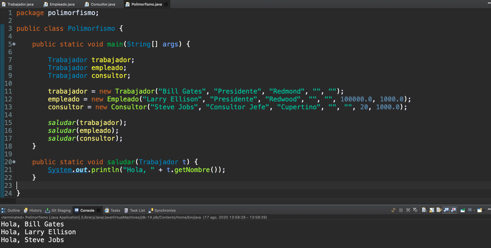

Como vemos estamos definiendo los tres tipos de trabajador como `Trabajador`, pero a la hora de instanciar cada uno de esos objetos lo hacemos con el constructor que corresponde a su tipo real, y posteriormente invocamos para cada uno de ellos el método `saludar(Trabajador t)` el cual recibe una referencia de tipo `Trabajador` y como hay una asociación de tipo **ES UN** cada instancia que recibe la considera de su tipo correspondiente es decir `Trabajador`, `Empleado` y `Consultor`, en este caso el método `getNombre()` recupera en los tres casos el nombre del trabajador y lo saluda independientemente de tipo de trabajador que sea.

Vamos a ver ahora el caso del cálculo de la paga para cada trabajador que lo cálcula diferente para cada uno de ellos.

*`Polimorfismo`*

```java
package polimorfismo;

public class Polimorfismo {

   public static void main(String[] args) {

      Trabajador trabajador;
      Trabajador empleado;
      Trabajador consultor;

      trabajador = new Trabajador("Bill Gates", "Presidente", "Redmond", "", "");
      empleado = new Empleado("Larry Ellison", "Presidente", "Redwood", "", "", 100000.0, 1000.0);
      consultor = new Consultor("Steve Jobs", "Consultor Jefe", "Cupertino", "", "", 20, 1000.0);

      imprimirNombreYPaga(trabajador);
      imprimirNombreYPaga(empleado);
      imprimirNombreYPaga(consultor);
   }

   public static void imprimirNombreYPaga(Trabajador t) {
      System.out.printf("El trabajador %s tiene una paga de %.2f€ %n", t.getNombre(), t.calcularPaga());
   }
}
```

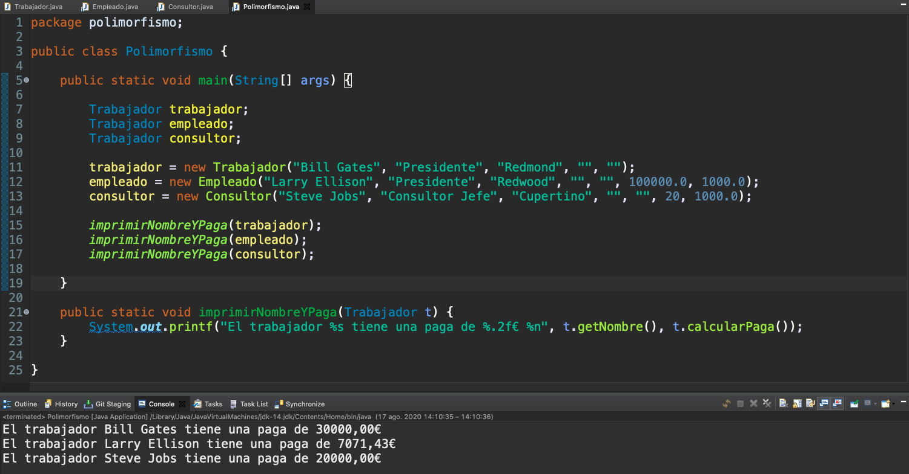

En este caso invocamos al método estatico `imprimirNombreYPaga(Trabajador t)` que como podemos ver recive una referencia de tipo `Trabajador` y para cada uno de ellos invoca el método `calcularPaga()`. Recordemos que el `Trabajador` tiene un salario fijo, y para `Empleado` se usaba la formula `(sueldo - impuestos) / PAGAS;` y para `Consultor` usabamos `horas*tarifa`.

Como podemos comprobar en la salida se ha producido el Polimorfismo, es decir **en tiempo de ejecución Java a decidido cual es el tipo concreto** de `Trabajador`, `Empleado` o `Consultor` y ha llamado al método `calcularPaga()` de cada uno de ellos. 

Con esto espero que hayamos comprendido el concepto de polimorfismo y vamos a seguir trabajando con algunos conceptos también relacionados con la herencia.


# 24. Uso de `super` para acceder a un objeto y sus constructores 8:42 

[Uso de super para acceder a un objeto y sus constructores](pdfs/24_Super.pdf)

## Resumen del Profesor

### 24.1 Acceso a la superclase

Podemos acceder a los elementos de nuestra clase base a través de la palabra `super`. En particular, podemos acceder a los métodos, aunque estos hayan sido sobrescritos:

```java
// overrides printMethod in Superclass
public void printMethod() {
   super.printMethod();
   System.out.println("Printed in Subclass");
}
```

### 24.2 Constructores y `super`

Cuando construimos una instancia de una clase derivada, tenemos que construir también la parte correspondiente a su clase base. Por defecto, Java espera que hayamos incluido un constructor sin parámetros en la clase base, y él se encargará de todo.

También podemos invocar, explícitamente, al constructor:

```java
public Empleado(…) {
   super(nombre, puesto, direccion, telefono, nSS);
   this.sueldo = sueldo;
   this.impuestos = impuestos;
}
```

## Transcripción


Lo prometido es deuda y en esta nueva lección vamos a hablar del uso de `super`.


`super` qué es una palabra reservada de Java no va a permitir acceder desde una subclase hacia su superclase, en particular nos va a permitir acceder hacia sus métodos o si tuviéramos acceso por sus modificadores de acceso hacia sus atributos. Utilizando `super` podemos invocar por ejemplo como tenemos en este código a un método de una superclase para complementar la funcionalidad, nos daremos cuenta que en determinadas ocasiones una superclase implementa un determinado método que tiene una funcionalidad, una clase que encienda a está lo que haría sería complementar las funcionalidades de este método, podría invocarlo dentro de un método que se llamaré igual, de manera que no existiría un solapamiento total sino que la funcionalidad de la subclase incluiría la de la superclase con alguna sentencia adicional.


También es muy común y ya lo hemos utilizado a la hora de crear constructores, un constructor de una clase que heredé de otra, de una subclase puede utilizar `super` para invocar al constructor de la clase base, de hecho si una subclase no lo invoca, la máquina virtual de Java lo hará por él, para ello la clase base como os decía antes que en algunas situaciones debe ser así, la clase base debería tener un constructor sin parámetros, para que la Java Virtual Machine lo pueda hacer por nosotros, de no tenerlo nos daremos cuenta como Eclipse se queja y tendríamos que invocar explícitamente con `super` al constructor de la clase base, lo hacíamos por ejemplo a la hora de crear un empleado que teníamos que invocara a súper para construir la parte de empleado que era común a trabajador.

### :computer: `101-24-Super`

Veamos un ejemplo en el que vamos a tener una `ClaseBase`, una `ClaseDerivada` que extiende a la `ClaseBase` y vamos a ver como ambas tienen un método que se llama `imprimir()` que simplemente va a imprimir un mensaje de saludo.

*`ClaseBase`*

```java
package usodesuper;

public class ClaseBase {

   public void imprimir() {
      System.out.println("Saludo desde la clase base");
   }

}
```

*`ClaseDerivada`*

```java
package usodesuper;

public class ClaseDerivada extends ClaseBase {

   public void imprimir() {
      super.imprimir();
      System.out.println("Saludo desde la clase derivada");
   }
}
```

Vamos a comprobar como si llamamos desde `ClaseBase` al método `imprimir()` se imprimirá `Saludo desde la clase base`, pero si lo hacemos desde `ClaseDerivada` el método `imprimir()` va a hacer uso de `super` para llamar a la clase base con lo cual se va a imprimir un primer mensaje `Saludo desde la clase base` y adicionalmente imprimiriamos un segundo mensaje `Saludo desde la clase derivada`. Aquí vamos a comprobarlo:

*`UsoDeSuper`*

```java
package usodesuper;

public class UsoDeSuper {
   public static void main(String[] args) {

      ClaseBase base = new ClaseBase();
      ClaseDerivada derivada = new ClaseDerivada();
		
      base.imprimir();
      System.out.println("");
      derivada.imprimir();

   }
}
```

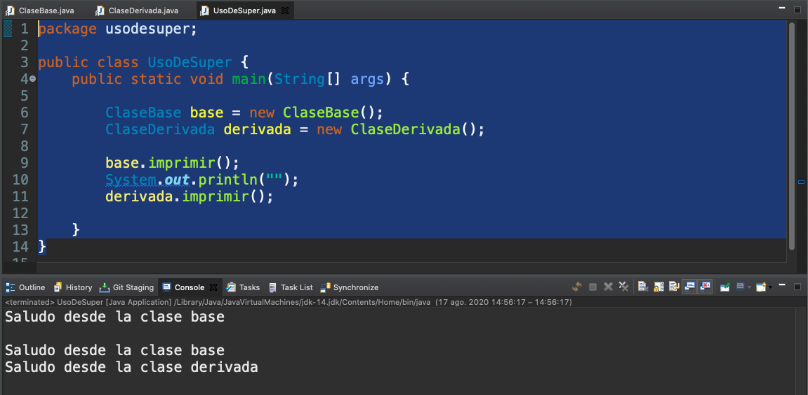


Se imprime un primer mensaje de la clase base, mientras que la clase derivada imprime dos, el primero de ellos es por invocar al super de la clase base, si comentamos dicho super.

*`ClaseDerivada`*

```java
package usodesuper;

public class ClaseDerivada extends ClaseBase {

   public void imprimir() {
      //super.imprimir();
      System.out.println("Saludo desde la clase derivada");
   }
}
```

La salida que tenemos es:

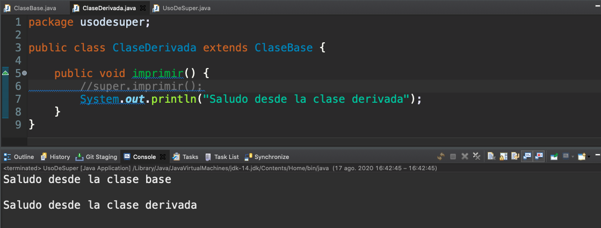

Solo se manda el mensaje de la clase derivada, es decir hemos realizado un solapamiento total de este método.

Podríamos añadir algunos constructores en la clase base para que en lugar de que en lugar de que imprimiera cualquier mensaje imprima el mensaje que le estamos pasando ahora como argumento, requeriria de un `set` o de un constructor para poder inicializar este valor.

*`ClaseBase`*

```java
package usodesuper;

public class ClaseBase {

   private String mensaje;
	
   public ClaseBase(String s) {
      this.mensaje = s;
   }
	
   public void imprimir() {
      //System.out.println("Saludo desde la clase base");
      System.out.println(mensaje);
   }

}
```

Este cambio nos provoca un error en la clase `ClaseDerivada`.


si lo leemos bien nos dice que hay un constructor en la clase base y no esta definido el constructor por defecto, si queremos poder no tener un constructor en la clase derivada que invoque a `super` deberíamos tener un constructor vacío en la clase base.

*`ClaseBase`*

```java
package usodesuper;

public class ClaseBase {

   private String mensaje;
   
   public ClaseBase() {
      this.mensaje = "Saludo desde la clase base";
   }
	
   public ClaseBase(String s) {
      this.mensaje = s;
   }
	
   public void imprimir() {
      //System.out.println("Saludo desde la clase base");
      System.out.println(mensaje);
   }

}
```

De esta manera ya no tenemos el error por que, porque a la hora de construir la clase derivada lo que esta haciendo es llamar a la parte de la clase base con el constructor por defecto. Tanto es así que si lo ejecutamos tenemos la misma funcionalidad que teniamos antes.

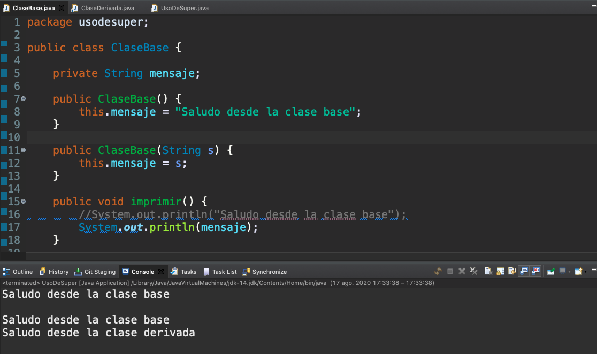

Aunque en este caso cuando llamamos a `super.imprimir();` esto esta imprimiendo `mensaje` que se ha creado en el constructor con este valor literal `Saludo desde la clase base`.

Si añadieramos ahora un constructor a `ClaseDerivada` tendríamos que llamar para construir a esa parte de la clase base si quisieramos matizarla, podemos construirla y decir que es desde la clase derivada:

*`ClaseDerivada`*

```java
package usodesuper;

public class ClaseDerivada extends ClaseBase {

   public ClaseDerivada() {
      super("Desde la clase derivada");
   }
	
   public void imprimir() {
      super.imprimir();
      System.out.println("Saludo desde la clase derivada");
   }
}
```

Al ejecutar tenemos.

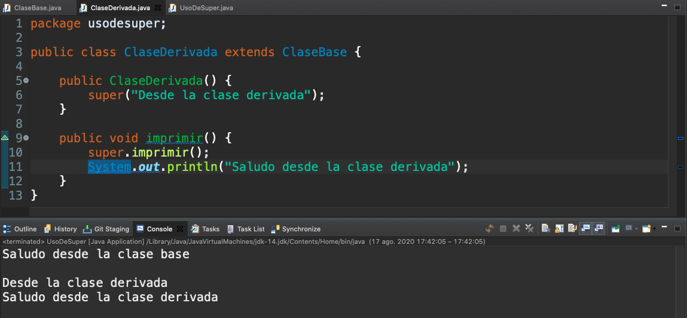

Vemos que el primer mensaje de la clase derivada es el que se manda desde el constructor de esta, invocando a `super` de la clase base.

Incluso podríamos envolver un constructor con otro sobreescribiendo.

*`ClaseDerivada`*

```java
package usodesuper;

public class ClaseDerivada extends ClaseBase {

   private String otroMensaje;
   
   public ClaseDerivada() {
      super("Desde la clase derivada");
   }
   
   public ClaseDerivada(String mensaje, String otroMensaje) {
      super(mensaje);
      this.otroMensaje = otroMensaje;
   }
	
   public void imprimir() {
      super.imprimir();
      //System.out.println("Saludo desde la clase derivada");
      System.out.println(otroMensaje);
   }
}
```


Ya como digo el constructor de clase derivada lo único que hace es envolver al constructor de la clase base para ejecutarse y si la clase de instancia derivada en lugar de crearla como hasta ahora la creamos con un atributo.

*`UsoDeSuper`*

```java
package usodesuper;

public class UsoDeSuper {
   public static void main(String[] args) {

      ClaseBase base = new ClaseBase();
      //ClaseDerivada derivada = new ClaseDerivada();
      ClaseDerivada derivada = new ClaseDerivada("Hola Mundo", "Desde una clase derivada");
		
      base.imprimir();
      System.out.println("");
      derivada.imprimir();

   }
}
```

Al ejecutarlo tenemos:

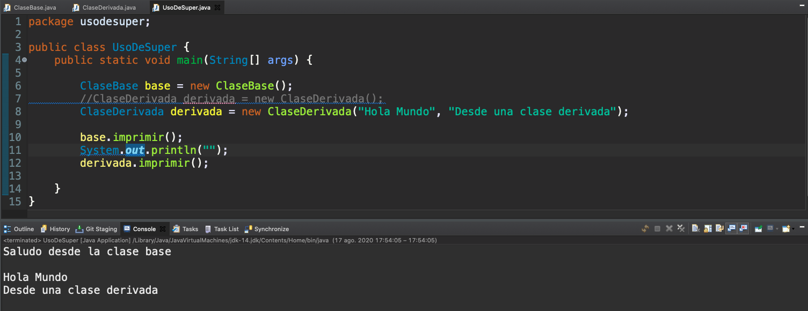


Con esto podemos comprobar como podemos utilizar `super` para llamar a métodos de de nuestra clase base o lo podemos utilizar como parte de un constructor de nuestro objeto para para poder terminar de construir un objeto de una clase derivada.

En la siguiente lección trabajaremos con un concepto fundamental también de la orientación a objetos de Java qué es el concepto de interfases y de clases abstractas.


# 25. Clases abstractas e interfaces I 20:52 

[Clases abstractas e interfaces](pdfs/25_Interfaces_y_clases_abstractas.pdf)

## Resumen del Profesor

### 25.1 Interfaces

Una interfaz es un contrato de comportamiento que adquiere una clase, es decir, un conjunto de operaciones que se compromete a implementar. Hasta Java 7, las interfaces definían solamente la firma de estos métodos, pero con Java 8, también pueden incluir implementaciones por defecto.

#### 25.1.1 Definición

Las interfaces siguen las mismas normas de nomenclatura y modificadores de acceso que las clases:

```java
public interface GroupedInterface extends Interface1, Interface2  {
   // constant declarations
   // base of natural logarithms
   double E = 2.718282;
   // method signatures
   void doSomething (int i, double x);
   int doSomethingElse(String s);
}
```

Las interfaces también pueden heredar de otra. En este caso, sí que se permite la herencia múltiple.

#### 25.1.2 Implementación

Una clase puede implementar una o varias interfaces:

```java
public class RectanglePlus implements Relatable {
//...
   public int isLargerThan(Relatable other) {
      RectanglePlus otherRect = (RectanglePlus)other;
      if (this.getArea() < otherRect.getArea())
         return -1;
      else if (this.getArea() > otherRect.getArea())
         return 1;
      else
         return 0;               
   }
}
```

#### 25.1.3 Interfaces como tipos de referencias

Podemos utilizar una interfaz para almacenar una referencia a un objeto de una clase que implemente dicha interfaz:

```java
RectanglePlus rectangleOne = new RectanglePlus(10, 20);
Relatable rectangleTwo = new RectanglePlus(20, 10);
```

#### 25.1.4 Métodos por defecto y estáticos

Java 8 incluye la posibilidad de que las interfaces proporcionen el cuerpo de un método, siempre y cuando este esté marcado como `default` o `static`:

```java
public interface Interfaz {

   default public void metodoPorDefecto() {
      System.out.println("Este es uno de los nuevos métodos por defecto");
   }

}
```

Las clases que implementen esta interfaz no tienen porqué dar una nueva implementación si no la necesitan.

## Transcripción

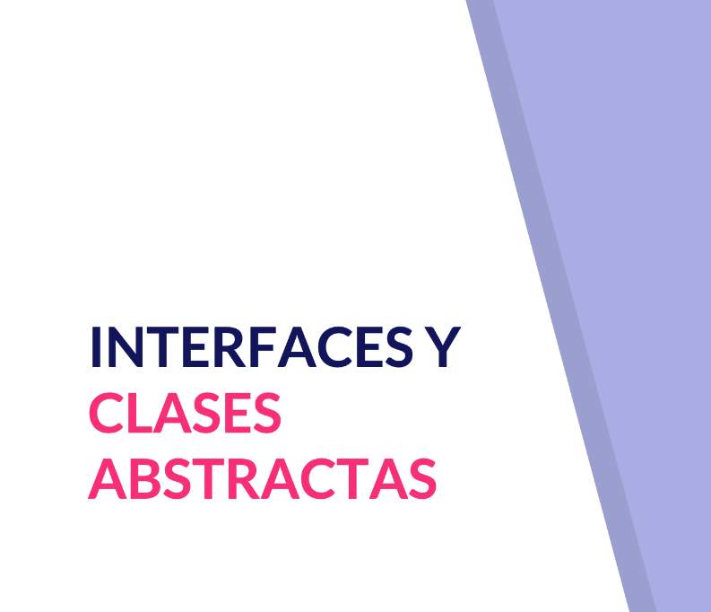


Vamos a pasar a hablar de dos conceptos que son fundamental y que además nos van a ayudar a conocer mucho del código que Java ya nos ofrece de esas miles de clases que hemos comentado en lecciones anteriores, son los **conceptos de interfaces y clases abstractas**.


Además en el capítulo de interfaces nos tendremos que parar un poco más porque si alguno de vosotros ya conocéis Java pero en versiones anteriores **es uno de los elementos que más ha modificado Java 8**.


Una **interfaz** en Java no es más que **un contrato de compromisos**, es decir es **una manera de comprometer a una clase a que implemente una serie de métodos**. La interfaz lo que marcaría es los métodos que debe implementar una clase que implemente esa interfaz, es decir es como un contrato en el que nosotros definimos solamente la firma de los métodos y es la clase la que tiene que darle contenido a esos métodos, hasta aquí esto sería común a las interfaces que están presentes desde la primera versión de Java. 

**Desde Java 8 las interfaces también pueden incluir métodos que tengan cuerpo a través de los métodos estáticos y los métodos por defecto**, también **se pueden incluir constantes**,  vamos a ir entendiendo un poco más cómo se define una interfaz, como una clase lo puede implementar y cómo podemos tener métodos por defecto, método estático e incluso utilizando un concepto que veíamos en alguna lección anterior, podríamos utilizar una referencia también para albergar instancias de un objeto que implemente esa interface.


A diferencia de las clases que siempre hemos venido utilizando la palabra reservada `class` aquí usaremos la palabra reservada `interface` para poder definir una interfaz. A la hora de nombrar una interfaz seguimos las mismas normas de nombres que para una clase y con los modificadores de acceso sucede lo mismo, seguiremos las mismas reglas que para una clase, como podremos comprobar la mayoría de las interfaces que vamos a ir creando también serán públicas. 

Para crear una interfaz por tanto tan solo tenían que tener `public interface` el nombre de la interfaz y entre llaves definir los métodos abstractos la mayoría como venia sucediendo en Java en versiones anteriores o ya digo desde Java 8 con método por defecto, métodos estáticos o la definición de constantes.

También existe la herencia de interfases es decir una interfaz puede heredar de otra, en este caso heredaría sobre todo la definición de esos métodos así como los métodos estáticos y los métodos por defecto y en este caso **la herencia si puede ser multiple**, es decir un interfaz puede heredar a la vez de otras dos o más interfases. La herencia múltiple en este caso se indicaría a partir de la palabra `extends` vendría una lista separada por comas de los interfaces de los cuales esta heredando una interface, en el ejemplo que tenemos en la diapositiva podemos ver como una interfaz puede extender, puede heredar de otras dos  interfaces y cómo puede incluir en su cuerpo la definición de una constante o de algunos métodos abstractos.

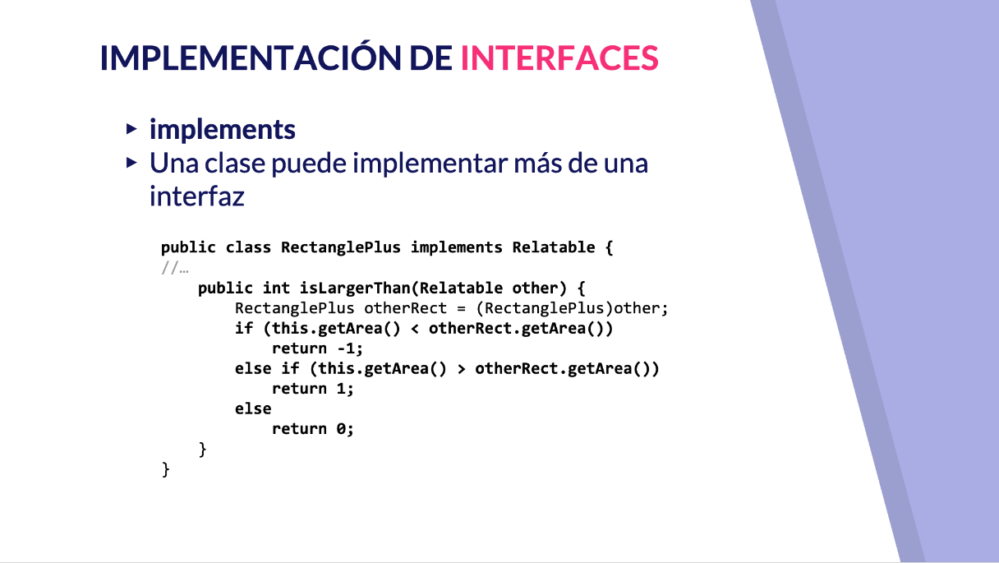

Cómo haríamos para que una clase implementará una interfaz, es decir cómo hacemos que una clase adquiera  ese compromiso, firme ese contrato para implementar esos métodos, lo haríamos a través de la palabra `implements` podemos indicar que una clase va a implementar una o varias interfaces porque podría implementar más de una de hecho cuando hablábamos de herencia decíamos que una clase solamente iba a poder heredar de otra pero si iba a poder implementar diversas interfaces es la manera que Java nos ofrece de tener algún tipo de mecanismo parecido a lo que sería la herencia multiple, en este ejemplo tenemos como la clase `RectanglePlus` implementaria `Relatable` para darle cuerpo a los métodos que tendría esa interfaz.


Vamos a ver también como podríamos tener la posibilidad de utilizar las interfaces como tipo de una referencia a la hora de instanciar un objeto, al igual que pasaba con la herencia de clase es muy útil si tenemos un método que tiene que recibir un objeto que sea de un tipo concreto en nuestro caso que implemente una determinada interfaz, **como podemos ver en el ejemplo podríamos construir un rectángulo con una referencia de tipo de clase o de la interfaz que a implementado**.


Vamos a ver también antes de ver los ejemplo como **una interfaz y esto una gran novedad en Java 8 puede dar una implementación por defecto para un método**, está implementación por defecto hace que el interfaz tenga código, cosa que hasta ahora en las versiones anteriores de Java no era posible. Esta interfaz tendrá cuerpo, tendrá código y tendrá una implementación por defecto. Aquellos métodos que sean por defecto deben incluir antes del modificador de acceso la palabra **`default`** si una clase implementa esta interfaz y no tiene ningún tipo de sentencia que añadir, es decir le vale la implementación por defecto, no tiene la obligación entonces de dar cuerpo a ese método, de sobreescribir esa implementación por defecto. Si quisiera modificar de alguna manera esta implementación por defecto, podría entonces darle un cuerpo distinto y cuando invocaramos al método en particular en lugar de llamar al por defecto, llamaría a la implementación concreta de la clase.


Aparejado a los métodos por defecto encontramos también la posibilidad de que una interfaz tenga métodos estáticos, que siguen la misma sintaxis de los métodos estáticos de una clase, si queremos situar un código que sea estático y que no esté en una clase si no que este en una determinada interfaz, también lo vamos a poder encontrar. **Esto es una gran novedad en Java 8 porque una serie de interfaces que para nosotros ya eran conocidas van a tener ahora a nuestra disposición un montón de método estáticos para poder hacer operaciones auxiliares** lo veremos sobre todo si queremos por ejemplo trabajar comparando una clase de otra veremos como ya tenemos un montón de método a nuestra disposición, disponibles en las interfaces. Ya digo esto a sido junto con los métodos por defecto una de las grandes novedades de Java 8 y hay mucho código que sea refactorizado para pasar a estar como método estático dentro de una interfaz.


Vamos a ver alguno vale la creación de una interfaz sigue el mismo proceso que ni una clase si quisiéramos crear otra interfaz nueva dentro de este paquete la podríamos crear aquí en interface vale le daríamos un nombre quisiéramos ya añadir herencia entre interfaces lo podríamos hacer desde aquí si no lo podemos hacer posteriormente dentro de código como podemos comprobar la creación de una interfaz es bien sencilla si queremos que la interfaz te entienda otra no tenemos más que añadir la interfaz de la cuerda para encender una interfaz que hemos tenido nosotros o incluso alguna que ya viniera definida por Java está interfaz nos va a decir que una clase se la implemente va a tener la posibilidad de tener un método en el que diremos o podemos comprobar dos objetos y decir si un objeto es más grande que otro jefe vale no podríamos usar imaginamos figuras de dos dimensiones lo podríamos usar en el foco tipo de figura rectángulo un círculo un triángulo embargo la forma de decir si uno es más grande que otro pues sería quizá algo algo diferente no clase rectángulo que va a venir marcada desde un punto theory G y un ancho y


Venir marcada desde un punto que theory G y un ancho y un alto vale entonces Yaya antes que un refrán no lo podíamos delimitar de mí hace 4 puntos o de esta manera en este caso el pescado que estamos usando la clase voy vale que ya viene definida por Java en una de sus librerías gráficas Java a W te vale tendríamos diferentes constructores un constructor sin parámetros dónde podríamos te lo dicen en 00 y no tendrían y Antonia porque estarían inicializado directamente a cero a partir de un punto podremos un rectángulo de ancho 0 y de alto cero. Determinado a partir de un ancho y un acto desde el origen de coordenadas con una estudiante determinado o recibiendo un punto un gancho tenemos la posibilidad de mover un rectángulo no veríamos su punto de origen tenemos la posibilidad de tienes que caso tendríamos la implementación del método Alfon no hemos comprometido el decir que la clase rectángulo momento está líneas de código pequeño asistente podríamos lo que va hacer en general la carcasa de los métodos que tendríamos que implementar


Generar la carcasa de los métodos que tendríamos que implementar está y no le diera cuerpo no implementará esos metros la manera de comprobar si un rectángulo es mayor que otro objeto relatable pues sería primero comprobar que cerré la tablet es rectángulo vales más que comprobar lotería transformarlo estamos aquí haciendo un casting vale me da igual hablamos hace bastante Simyo y bueno si queremos saber si un rectángulo es más grande que otro lo que podemos hacer es comparar sus áreas vamos a devolver un valor menor que 0 menos 1 en este caso y el área del rectángulo actual del rectángulo piso es menor que el área del otro rectángulo que estamos recibiendo vamos a devolver un valor positivo 1 y el área del rectángulo vivo el rectángulo actual es mayor que el área del otro rectángulo que hemos recibido y si no es mayor y el menor quiere decir que igual y entonces te volveríamos cero en este caso vamos a hacer una comparación entre 2 rectángulo y podemos comprobar como decíamos antes que podemos crear un rectángulo por fuera con una referencia de su propia clase y que podíamos utilizar también la interfaz que implementa rectángulo a la hora de instanciar una clase al igual que cuando teníamos herencia de clase podríamos usar la clase base en este caso podemos utilizar la interfaz que está implementando la clase rectángulo podríamos comparar y en función del valor que estamos recibiendo decir tendrás ángulo de menos son iguales o si es mayor ángulos que son iguales porque aunque tienen diferente base y altura hemos permutado la base y altura con lo cual el área de ambos sería exactamente la misma ya hemos visto como una clase puede implementar una interfaz ya hemos visto como una interfaz puede incluso heredar de otra como hemos visto aquí aunque no le hayamos añadido cuerpo a esta le digo que también podríamos quitáramos aquí está está herencia y añadiéramos aquí otro método


Añadir a muéstrame tu primo indicaremos que la clase rectángulo plus para implementar la interfaz de esta manera ahora no puedo hablar un error tendríamos imprimir el propio rectángulo para imprimirlo campo llamar al método to string para poder imprimirlo de manera que aquí a la hora de comparar los rectángulos pues podríamos imprimirlo antes de verificar el la comprobación no a través del método print que hemos que hemos implementado aquí este método no está presente en esta está presente en este interesada pero no en esta otra con lo cual a la hora de querer invocar al método prime a través de esta referencia no es capaz de reconocer lo tendríamos que hacer un casting hacia un tipo que si conociéramos para poder poder utilizarlo por ejemplo esa quisiéramos sí que ahora podríamos llamar al método vale como hemos podido comprobar no podemos acceder desde una referencia de una interfaz a un atributo que aunque si tenga implementado un perdón me toques el planeta dona clase proviene de otra manera podríamos pintando el contenido de los dos rectángulos que son iguales porque su área es la misma pero bueno a ti se podíamos hacer porque esta clase en la que estaba dando el cuerpo al método pero en el caso de la tablet no conoce para nada a primo vamos a pasar también a ver cómo podemos trabajar con interfaces por con métodos por defecto y métodos estáticos vale vale que tiene un método este método de los conocidos como abstracto es decirte lo cual damos su firma pero no la implementación y podemos comprobar como en este caso con Java 8 si podríamos tener código por defecto y código estático esta implementación por defecto hace que si una clase implementa interfaz si no quiere darle cuerpo a método por defecto pues no tienen obligación de implementar lo y si llamamos a método por defecto en una instancia de esta clase pues se ejecutaría este código provincia el método estático vamos a poder comprobar cómo lo podemos invocar de diferentes maneras así tenemos dos clases la clase primera implementa solamente método euskera abstracto la clase 2 siesta sobre escribiendo a método por defecto cuándo vamos a trabajar con él y creamos una instancia de clase y luego otra de clase 2 y llamamos ambos métodos podemos ver la diferencia y aquí como podemos comprobar utilizando accediendo directamente me interesa podemos invocar al método estático aquí estamos llamando primero a método que estamos llamando a método por defecto como no le hemos dado implementación está utilizando la implementación por defecto y sin embargo en clase 2 cuando llamamos a método y en el caso de método por defecto sí que le hemos dado una sobreescritura me montado nuestra funcionalidad propia al método por defecto con lo cual a la hora de imprimir se por consola lo que está llamando a la implementación profe de aquí estaremos llamando a este método estático el trabajo con interfaz vamos a trabajar con clase abstracta

# 25. Clases abstractas e interfaces II 9:48 

[Clases abstractas e interfaces](pdfs/25_Interfaces_y_clases_abstractas.pdf)

## Resumen del Profesor

### 25.2 Clases abstractas

Son clases definidas como `abstract`. Tienen las siguientes características:

* **No se pueden instanciar**
* Pueden tener atributos y métodos con implementación.

```java
public abstract class AbstractaSencilla {

    public void saluda() {
        System.out.println("Hola mundo!!!");
    }

}
```

#### 25.2.1 Métodos `abstract`

Son métodos que están definidos en una clase `abstract`. Definen la firma del método, pero no su implementación. Las subclases de esta clase base deben aportar su implementación. Pueden convivir con métodos normales.

```java
public abstract class AbstractaConMetodos {

    public abstract void saludo(String s);

    public void saludar() {
        System.out.println("Hola mundo!!!");
    }
}
```

### 25.3 Clases abstractas vs Interfaces


¿Cuándo usar una u otra?

INTERFACES |	CLASES ABSTRACTAS
-----------|-------------------
Clases no relacionadas podrán implementar los métodos. | Compartir código con clases muy relacionadas.
Si se quiere indicar que existe un tipo de comportamiento, pero no sabemos quien lo implementa.	| Las clases derivadas usarán métodos protected o private.
Si necesitamos tener herencia múltiple.	| Queremos definir atributos que no sean estáticos o constantes.


## Transcripción


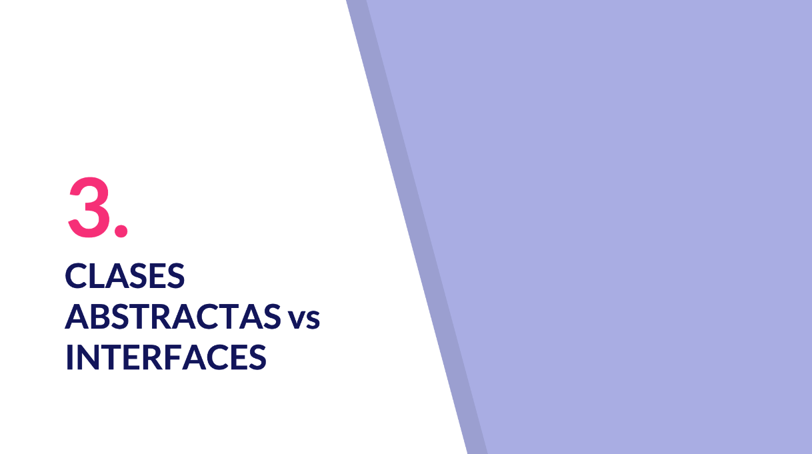

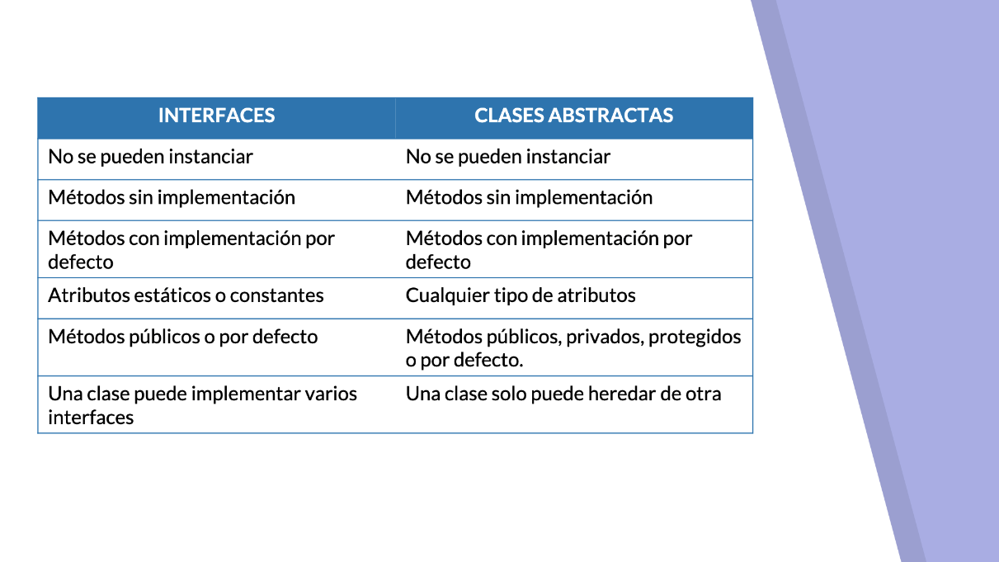


## Contenido adicional 4   

[Herencia](pdfs/22_Herencia.pdf)

[Polimorfismo](pdfs/23_Polimorfismo.pdf)

[Uso de super para acceder a un objeto y sus constructores](pdfs/24_Super.pdf)

[Clases abstractas e interfaces](pdfs/25_Interfaces_y_clases_abstractas.pdf)
