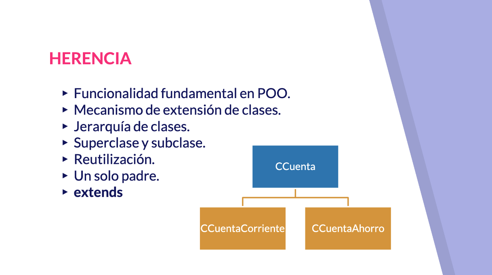
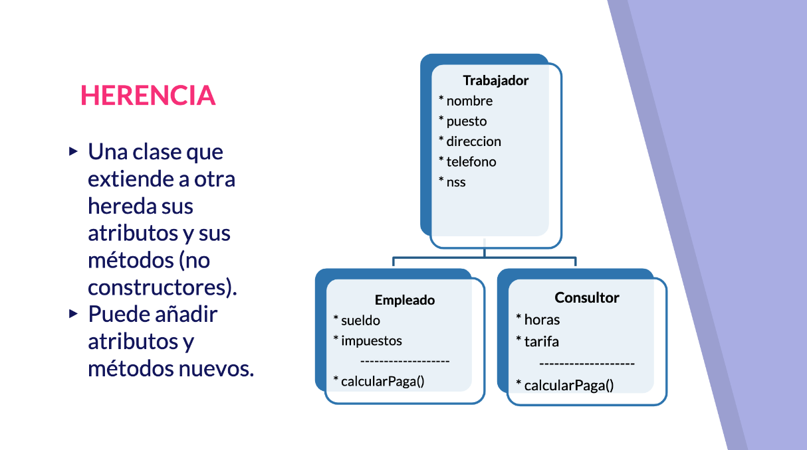
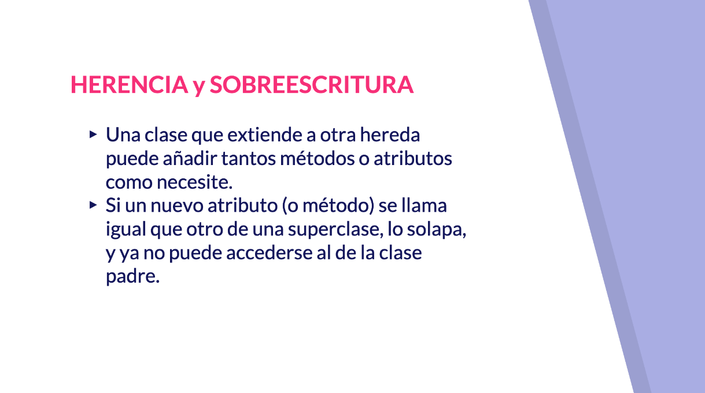
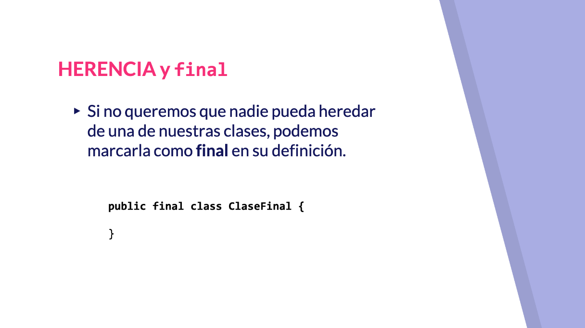

# 6. Uso de herencia 64m
   * Qué es la herencia y los beneficios que aporta 15:52 
   * Polimorfismo 9:43 
   * Uso de super para acceder a un objeto y sus constructores 8:42 
   * Clases abstractas e interfaces I 20:52 
   * Clases abstractas e interfaces II 9:48 
   * Contenido adicional 5
   
## 22. Qué es la herencia y los beneficios que aporta 15:52 

[Herencia](pdfs/22_Herencia.pdf)


### 22.1 Herencia










Es un mecanismo fundamental de la Programación Orientada a Objetos, que nos permite que una clase pueda extender el comportamiento o la funcionalidad de otra. De esta forma podemos formar una jerarquía de clases.

En Java, a diferencia de otros lenguajes, solo está permitida la **herencia simple**, de forma que cada clase tiene, como mucho, una clase base. Solo hay una clase especial, `Object`, que no tiene clase base. El resto de clases ya creadas, o por crear, tienen en esta el nivel más básico de su jerarquía (es decir, una clase que no heredia de nadie, realmente está heredando de `Object`).


La sintaxis para indicar que una clase hereda de otra es:

```java
public class Hija extends Padre {


}
```

Una clase que extiende a otra hereda sus atributos y sus métodos (no los constructores), y puede añadir métodos y atributos nuevos. La clase extendida podrá acceder a aquellos atributos/métodos de la clase base marcados como `public`, `protected` o por defecto.

`protected` está poco recomendado para los atributos, ya que en una jerarquía de herencia con varios niveles, una clase *tataranieta* de otra podría seguir accediendo a los atributos, sin poder predecir bien el control sobre ellos. Es más recomendable marcar los atributos como `private`, y acceder a ellos desde métodos `public`.

Si no queremos que nadie pueda heredar de nuestra clase, la marcamos como `final`:

```java
public final class ClaseFinal {

}
```

### 22.2 Código

*Trabajador.java*

```java
package herencia;

public class Trabajador {
	
	private String nombre;
	private String puesto;
	private String direccion;
	private String telefono;
	private String nSS; //Número Seguridad Social
	
	public Trabajador(String nombre, String puesto, String direccion, String telefono, String nSS) {
		this.nombre = nombre;
		this.puesto = puesto;
		this.direccion = direccion;
		this.telefono = telefono;
		this.nSS = nSS;
	}

	public String getNombre() {
		return nombre;
	}

	public void setNombre(String nombre) {
		this.nombre = nombre;
	}


	public String getPuesto() {
		return puesto;
	}

	public void setPuesto(String puesto) {
		this.puesto = puesto;
	}

	public String getDireccion() {
		return direccion;
	}

	public void setDireccion(String direccion) {
		this.direccion = direccion;
	}

	public String getTelefono() {
		return telefono;
	}

	public void setTelefono(String telefono) {
		this.telefono = telefono;
	}

	public String getnSS() {
		return nSS;
	}

	public void setnSS(String nSS) {
		this.nSS = nSS;
	}

	@Override
	public String toString() {
		return "Trabajador [nombre=" + nombre + ", puesto=" + this.puesto + ", direccion=" + direccion + ", telefono="
				+ telefono + ", nSS=" + nSS + "]";
	}
}
```

*Consultor.java*

```java
package herencia;

public class Consultor extends Trabajador {
	
	private int horas;
	private double tarifa;
	
	public Consultor(String nombre, String puesto, String direccion, String telefono, String nSS, int horas, double tarifa) {
		super(nombre, puesto, direccion, telefono, nSS);
		this.horas = horas;
		this.tarifa = tarifa;
	}

	public int getHoras() {
		return horas;
	}

	public void setHoras(int horas) {
		this.horas = horas;
	}

	public double getTarifa() {
		return tarifa;
	}

	public void setTarifa(double tarifa) {
		this.tarifa = tarifa;
	}
	
	public double calcularPaga() {
		return horas*tarifa;
	}

	@Override
	public String toString() {
		return "Consultor [horas=" + horas + ", tarifa=" + tarifa + ", getNombre()=" + getNombre() + ", getPuesto()="
				+ getPuesto() + ", getDireccion()=" + getDireccion() + ", getTelefono()=" + getTelefono()
				+ ", getnSS()=" + getnSS() + "]";
	}
}
```

*Empleado.java*

```java
package herencia;

public class Empleado extends Trabajador {
	
	private double sueldo;
	private double impuestos;
	
	private final int PAGAS = 14;
	
	public Empleado(String nombre, String puesto, String direccion, String telefono, String nSS, double sueldo, double impuestos) {
		//Profundizamos en "super" en las próximas lecciones
		super(nombre, puesto, direccion, telefono, nSS);
		this.sueldo = sueldo;
		this.impuestos = impuestos;
	}

	public double getSueldo() {
		return sueldo;
	}

	public void setSueldo(double sueldo) {
		this.sueldo = sueldo;
	}

	public double getImpuestos() {
		return impuestos;
	}

	public void setImpuestos(double impuestos) {
		this.impuestos = impuestos;
	}
	
	public double calcularPaga() {
		return (sueldo-impuestos) / PAGAS;
	}

	@Override
	public String toString() {
		return "Empleado [sueldo=" + sueldo + ", impuestos=" + impuestos + ", getNombre()=" + getNombre()
				+ ", getPuesto()=" + getPuesto() + ", getDireccion()=" + getDireccion() + ", getTelefono()="
				+ getTelefono() + ", getnSS()=" + getnSS() + "]";
	}
}
```

*Herencia.java*

```java
package herencia;

public class Herencia {

	public static void main(String[] args) {
		
		Trabajador trabajador;
		Empleado empleado;
		Consultor consultor;
		
		trabajador = new Trabajador("Bill Gates", "Presidente", "Redmond", "", "");
		empleado = new Empleado("Larry Ellison", "Presidente", "Redwood", "", "", 100000.0, 1000.0);
		consultor = new Consultor("Steve Jobs", "Consultor Jefe", "Cupertino", "", "", 20, 1000.0);
		
		System.out.println(trabajador);
		System.out.println(empleado);
		System.out.println(empleado.calcularPaga());
		System.out.println(consultor);
		System.out.println(consultor.calcularPaga());
	}

}


SALIDA:

Trabajador [nombre=Bill Gates, puesto=Presidente, direccion=Redmond, telefono=, nSS=]
Empleado [sueldo=100000.0, impuestos=1000.0, getNombre()=Larry Ellison, getPuesto()=Presidente, getDireccion()=Redwood, getTelefono()=, getnSS()=]
7071.428571428572
Consultor [horas=20, tarifa=1000.0, getNombre()=Steve Jobs, getPuesto()=Consultor Jefe, getDireccion()=Cupertino, getTelefono()=, getnSS()=]
20000.0
```

*ClaseFinal.java*

```java
package herencia;

public final class ClaseFinal {

}
```

*ClaseExtendida.java*

```java
package herencia;

/*public class ClaseExtendida extends ClaseFinal {

}*/
```

Lo anterior no es posible nos marcaría : `The type ClaseExtendida cannot subclass the final class ClaseFinal`

## 23. Polimorfismo 9:43 

[Polimorfismo](pdfs/23_Polimorfismo.pdf)


### 23.1 Referencias y subclases


Una subclase puede ser accedida a través de una referencia de su superclase. Esto es muy útil si pensamos pasar parámetros a un método, para que sea más versátil.

```java
public static void saludar(Trabajador t) {
    System.out.println("Hola, " + t.getNombre());
}
```

### 23.2 Ocultación de métodos y polimorfismo


Ya hemos visto que una clase extendida puede *ocultar* métodos o atributos de la clase base, creando uno igual con el mismo nombre. ¿Qué sucede si tenemos un método ocultado, pero accedemos desde una referencia de la superclase?

```java
Trabajador empleado;
empleado = new Empleado("Larry Ellison", "Presidente", "Redwood", "", "", 100000.0, 1000.0);
empleado.calcularPaga();
```

La máquina virtual de java es capaz de detectar el tipo del objeto, siendo este quien tenga prioridad sobre el tipo de la referencia usada. A esto lo llamamos polimorfismo.

### 23.3 Código

*Trabajador.java*

```java
package polimorfismo;

public class Trabajador {
	
	private String nombre;
	private String Puesto;
	private String direccion;
	private String telefono;
	private String nSS; //Número Seguridad Social
	
	private static final double SALARIO_BASE = 30000.0;
	
	
	public Trabajador(String nombre, String puesto, String direccion, String telefono, String nSS) {
		this.nombre = nombre;
		Puesto = puesto;
		this.direccion = direccion;
		this.telefono = telefono;
		this.nSS = nSS;
	}


	public String getNombre() {
		return nombre;
	}


	public void setNombre(String nombre) {
		this.nombre = nombre;
	}


	public String getPuesto() {
		return Puesto;
	}


	public void setPuesto(String puesto) {
		Puesto = puesto;
	}


	public String getDireccion() {
		return direccion;
	}


	public void setDireccion(String direccion) {
		this.direccion = direccion;
	}


	public String getTelefono() {
		return telefono;
	}


	public void setTelefono(String telefono) {
		this.telefono = telefono;
	}


	public String getnSS() {
		return nSS;
	}


	public void setnSS(String nSS) {
		this.nSS = nSS;
	}
	
	public double calcularPaga() {
		return SALARIO_BASE;
	}


	@Override
	public String toString() {
		return "Trabajador [nombre=" + nombre + ", Puesto=" + Puesto + ", direccion=" + direccion + ", telefono="
				+ telefono + ", nSS=" + nSS + "]";
	}
}
```

*Consultor.java*

```java
package polimorfismo;

public class Consultor extends Trabajador {
	
	private int horas;
	private double tarifa;
	
	
	public Consultor(String nombre, String puesto, String direccion, String telefono, String nSS, int horas, double tarifa) {
		super(nombre, puesto, direccion, telefono, nSS);
		this.horas = horas;
		this.tarifa = tarifa;
	}


	public int getHoras() {
		return horas;
	}


	public void setHoras(int horas) {
		this.horas = horas;
	}


	public double getTarifa() {
		return tarifa;
	}


	public void setTarifa(double tarifa) {
		this.tarifa = tarifa;
	}
	
	public double calcularPaga() {
		return horas*tarifa;
	}


	@Override
	public String toString() {
		return "Consultor [horas=" + horas + ", tarifa=" + tarifa + ", getNombre()=" + getNombre() + ", getPuesto()="
				+ getPuesto() + ", getDireccion()=" + getDireccion() + ", getTelefono()=" + getTelefono()
				+ ", getnSS()=" + getnSS() + "]";
	}
}
```

*Empleado.java*

```java
package polimorfismo;

public class Empleado extends Trabajador {
	
	private double sueldo;
	private double impuestos;
	
	private final int PAGAS = 14;
	
	public Empleado(String nombre, String puesto, String direccion, String telefono, String nSS, double sueldo, double impuestos) {
		//Profundizamos en "super" en las próximas lecciones
		super(nombre, puesto, direccion, telefono, nSS);
		this.sueldo = sueldo;
		this.impuestos = impuestos;
	}

	public double getSueldo() {
		return sueldo;
	}

	public void setSueldo(double sueldo) {
		this.sueldo = sueldo;
	}

	public double getImpuestos() {
		return impuestos;
	}

	public void setImpuestos(double impuestos) {
		this.impuestos = impuestos;
	}
	
	public double calcularPaga() {
		return (sueldo-impuestos) / PAGAS;
	}

	@Override
	public String toString() {
		return "Empleado [sueldo=" + sueldo + ", impuestos=" + impuestos + ", PAGAS=" + PAGAS + ", getNombre()="
				+ getNombre() + ", getPuesto()=" + getPuesto() + ", getDireccion()=" + getDireccion()
				+ ", getTelefono()=" + getTelefono() + ", getnSS()=" + getnSS() + "]";
	}
}
```

*Polimorfismo.java*

```java
package polimorfismo;

public class Polimorfismo {

	public static void main(String[] args) {
		
		Trabajador trabajador;
		Trabajador empleado;
		Trabajador consultor;
		
		trabajador = new Trabajador("Bill Gates", "Presidente", "Redmond", "", "");
		empleado = new Empleado("Larry Ellison", "Presidente", "Redwood", "", "", 100000.0, 1000.0);
		consultor = new Consultor("Steve Jobs", "Consultor Jefe", "Cupertino", "", "", 20, 1000.0);
		
		saludar(trabajador);
		saludar(empleado);
		saludar(consultor);
		
		imprimirNombreYPaga(trabajador);
		imprimirNombreYPaga(empleado);
		imprimirNombreYPaga(consultor);
	}
	
	public static void saludar(Trabajador t) {
		System.out.println("Hola, " + t.getNombre());
	}
	
	public static void imprimirNombreYPaga(Trabajador t) {
		System.out.printf("El trabajador %s tiene una paga de %.2f€ %n", t.getNombre(), t.calcularPaga());
	}
}


SALIDA:

Hola, Bill Gates
Hola, Larry Ellison
Hola, Steve Jobs
El trabajador Bill Gates tiene una paga de 30000,00€ 
El trabajador Larry Ellison tiene una paga de 7071,43€ 
El trabajador Steve Jobs tiene una paga de 20000,00€
```

## 24. Uso de super para acceder a un objeto y sus constructores 8:42 

[Uso de super para acceder a un objeto y sus constructores](pdfs/24_Super.pdf)


### 24.1 Acceso a la superclase


Podemos acceder a los elementos de nuestra clase base a través de la palabra `super`. En particular, podemos acceder a los métodos, aunque estos hayan sido sobrescritos:

```java
// overrides printMethod in Superclass
public void printMethod() {
   super.printMethod();
   System.out.println("Printed in Subclass");
}
```

### 24.2 Constructores y `super`


Cuando construimos una instancia de una clase derivada, tenemos que construir también la parte correspondiente a su clase base. Por defecto, Java espera que hayamos incluido un constructor sin parámetros en la clase base, y él se encargará de todo.

También podemos invocar, explícitamente, al constructor:

```java
public Empleado(…) {
     super(nombre, puesto, direccion, telefono, nSS);
     this.sueldo = sueldo;
     this.impuestos = impuestos;
}
```

## Clases abstractas e interfaces I 20:52 

[Clases abstractas e interfaces](pdfs/25_Interfaces_y_clases_abstractas.pdf)

### 25.1 Interfaces

Una interfaz es un contrato de comportamiento que adquiere una clase, es decir, un conjunto de operaciones que se compromete a implementar. Hasta Java 7, las interfaces definían solamente la firma de estos métodos, pero con Java 8, también pueden incluir implementaciones por defecto.

#### 25.1.1 Definición

Las interfaces siguen las mismas normas de nomenclatura y modificadores de acceso que las clases:

```java
public interface GroupedInterface extends Interface1, Interface2  {
     // constant declarations
     // base of natural logarithms
     double E = 2.718282;
     // method signatures
     void doSomething (int i, double x);
     int doSomethingElse(String s);
}
```

Las interfaces también pueden heredar de otra. En este caso, sí que se permite la herencia múltiple.

#### 25.1.2 Implementación

Una clase puede implementar una o varias interfaces:

```java
public class RectanglePlus implements Relatable {
//...
    public int isLargerThan(Relatable other) {
        RectanglePlus otherRect = (RectanglePlus)other;
        if (this.getArea() < otherRect.getArea())
            return -1;
        else if (this.getArea() > otherRect.getArea())
            return 1;
        else
            return 0;               
    }
}
```

#### 25.1.3 Interfaces como tipos de referencias

Podemos utilizar una interfaz para almacenar una referencia a un objeto de una clase que implemente dicha interfaz:

```java
RectanglePlus rectangleOne = new RectanglePlus(10, 20);
Relatable rectangleTwo = new RectanglePlus(20, 10);
```

#### 25.1.4 Métodos por defecto y estáticos

Java 8 incluye la posibilidad de que las interfaces proporcionen el cuerpo de un método, siempre y cuando este esté marcado como `default` o `static`:

```java
public interface Interfaz {

     default public void metodoPorDefecto() {
          System.out.println("Este es uno de los nuevos métodos por defecto");
     }

}
```

Las clases que implementen esta interfaz no tienen porqué dar una nueva implementación si no la necesitan.

## Clases abstractas e interfaces II 9:48 

[Clases abstractas e interfaces](pdfs/25_Interfaces_y_clases_abstractas.pdf)

### 25.2 Clases abstractas

Son clases definidas como `abstract`. Tienen las siguientes características:

* **No se pueden instanciar**
* Pueden tener atributos y métodos con implementación.

```java
public abstract class AbstractaSencilla {

    public void saluda() {
        System.out.println("Hola mundo!!!");
    }

}
```

#### 25.2.1 Métodos `abstract`

Son métodos que están definidos en una clase `abstract`. Definen la firma del método, pero no su implementación. Las subclases de esta clase base deben aportar su implementación. Pueden convivir con métodos normales.

```java
public abstract class AbstractaConMetodos {

    public abstract void saludo(String s);

    public void saludar() {
        System.out.println("Hola mundo!!!");
    }
}
```

### 25.3 Clases abstractas vs Interfaces

¿Cuándo usar una u otra?

INTERFACES |	CLASES ABSTRACTAS
-----------|-------------------
Clases no relacionadas podrán implementar los métodos. | Compartir código con clases muy relacionadas.
Si se quiere indicar que existe un tipo de comportamiento, pero no sabemos quien lo implementa.	| Las clases derivadas usarán métodos protected o private.
Si necesitamos tener herencia múltiple.	| Queremos definir atributos que no sean estáticos o constantes.

## Contenido adicional 4   

[Herencia](pdfs/22_Herencia.pdf)

[Polimorfismo](pdfs/23_Polimorfismo.pdf)

[Uso de super para acceder a un objeto y sus constructores](pdfs/24_Super.pdf)

[Clases abstractas e interfaces](pdfs/25_Interfaces_y_clases_abstractas.pdf)
