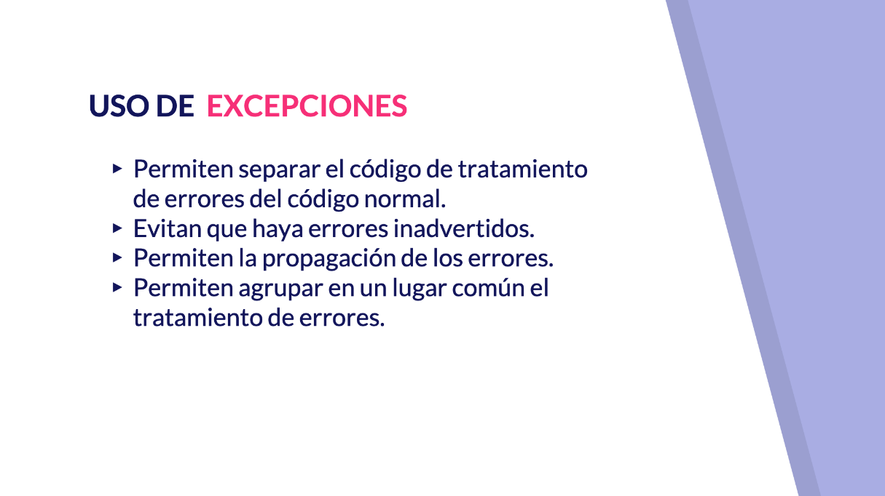
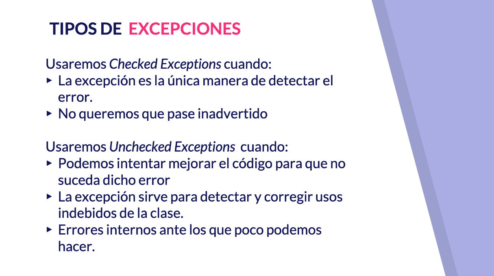
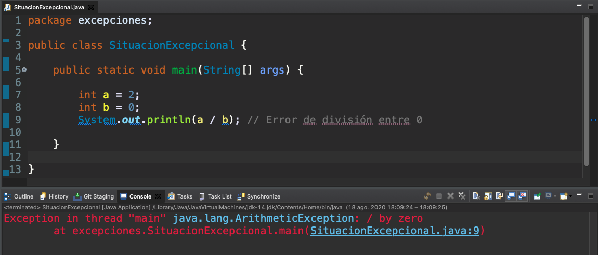
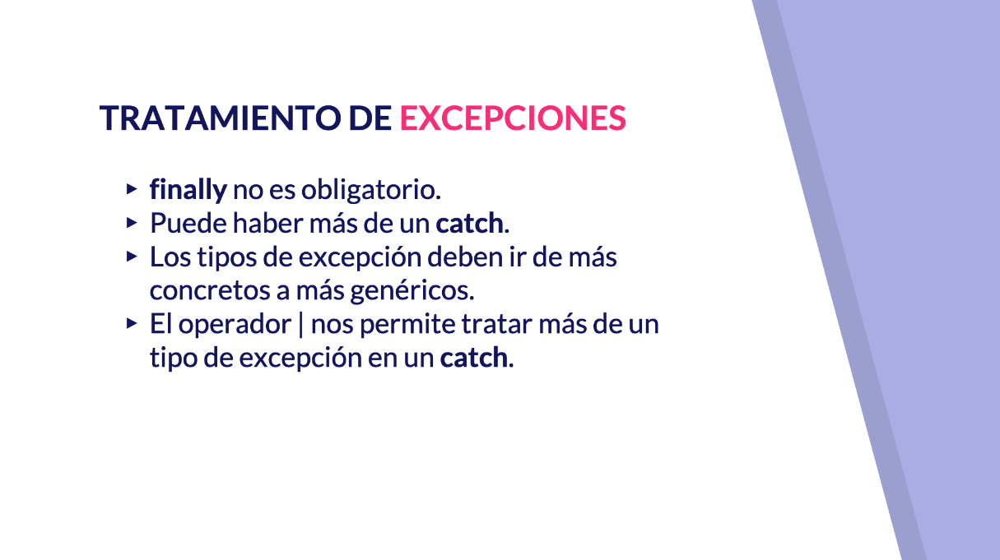
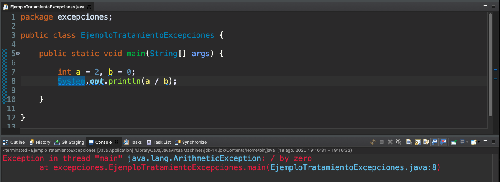
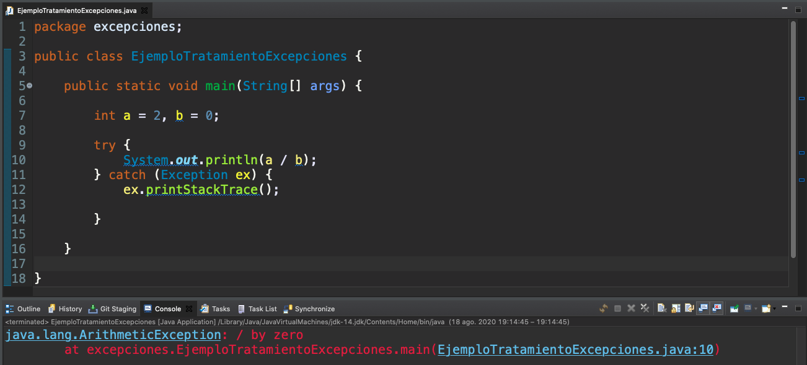
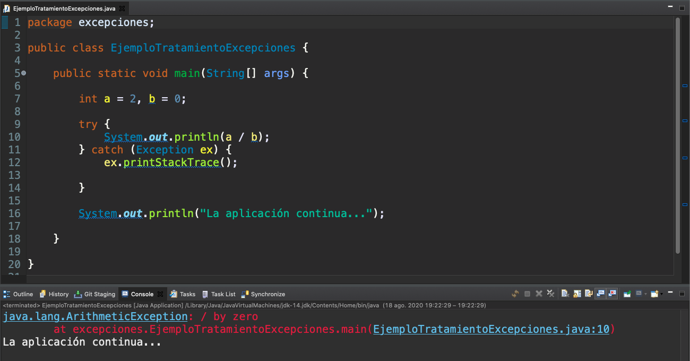
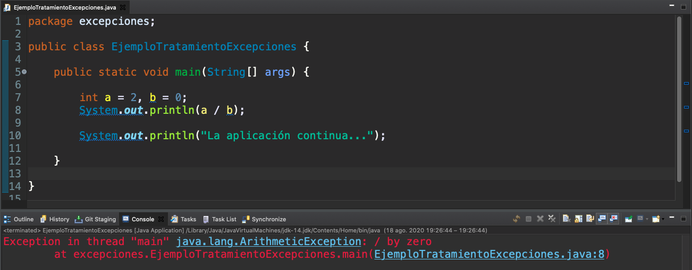
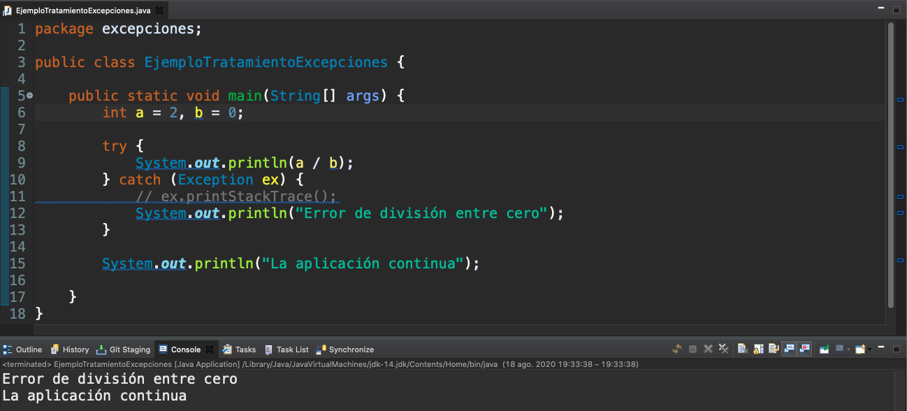

# 7. Manejo de excepciones 39m
   * 26 Excepciones y errores 9:28 
   * 27 Tratamiento de excepciones 13:36 
   * 28 Excepciones más comunes 4:49 
   * 29 Lanzamiento y propagación de excepciones 11:25 
   * Contenido adicional 4
   
# 26 Excepciones y errores 9:28

## Resumen del Profesor

[Excepciones y errores](pdfs/26_Excepciones_y_errores.pdf)


### 26.1 Excepciones

El término excepción es una abreviatura de *situación excepcional*. Se trata de una situación que altera la ejecución normal de un programa. Por ejemplo, en una calculadura, un usuario intenta realiza la división `2 / 0`. En ese momento, el sistema crea un objeto, que se llama *objeto de excepción* y lo pasa de una llamada de método a otra, buscando quien pueda hacerse cargo. Si no existe nadie, será la propia JVM quien lo haga.

El uso de excepciones tiene varias ventajas:

* Permiten separar el código de tratamiento de errores del código normal.
* Evitan que haya errores inadvertidos.
* Permiten la propagación de los errores.
* Permiten agrupar en un lugar común el tratamiento de errores.

### 26.2 Tipos de Excepciones

Podemos agrupar las excepciones en 3 grandes tipos:

* Excepciones comprobadas (*checked exceptions*): son aquellas excepciones que pueden surgir internamente en un programa, pero que al estar bien escrito, podemos tratar y de las que nos podremos recuperar.

* Errores (*errors*): situaciones externas que no son anticipables, y de las que puede que no podamos recuperarnos (por ejemplo, un error hardware). Son un tipo no comprobado (*unchecked*)

* Errores de ejecución (*Runtime errors*): son situaciones interas de la aplicación, de las que probablemente no podamos recuperarnos. Son un tipo no comprobado (*unchecked*).

## Trascripción


Hola a todos vamos a comenzar un nuevo bloque en el que hablaremos de excepcines.


Hasta ahora todo el código que hemos ido desarrollando hemos supuestoque iba a funcionar bien, como no iba a funcionar sí nosotros somos estupendos programadores, sino que toda situación que se iba a presentar era una situación normal o si queríamos tratar algún tipo de situación que no fuese la normal, recordar por ejemplo los diferentes ejemplos que hemos hecho que incluyan un menú, si la opción que introducía en el menú no estaba dentro del rango que nosotros teníamos definido, lo comprobamos a través de un pequeño `if` y podíamos decirle al usaurio, se ha equivocado usted, la opción que ha introducido no es válida, introduzca otra. 

Sin embargo es posible que se nos presenten situaciones excepcionales, muchas de las veces sucederá porque un valor introducido por el usuario no es correcto, otra es posible que sea porque los programadores que son humanos se hayan equivocado en la secuencia de operaciones o sentencias que van desarrollando, esa situación excepcional es posible que altere la ejecución normal de nuestro programa y bien al producirse esa situación excepcional el método dónde sucede crea un objeto especial que recoge de alguna manera información sobre esa situación excepcional, **llamado objeto de excepción** y que se lo pasa a alguien para que pueda tratarlo. 

Veremos además como si teníamos una serie de llamada a métodos que dentro habían llamado a otro método, el método dónde sucede el error, es posible que vaya pasando ese objeto de excepción a diferentes métodos que traten de encontrar alguno que sea capaz de de manejar la excepción.


Si existe quien pueda manejarlo, por ejemplo si uno de los métodos si tiene el mecanismo necesario para manejar esa excepción sera quien recoga ese objeto y le de el tratamiento que corresponda. Si no llegar a existir ese objeto sería la máquina virtual de Java la que le daría un tratamiento por defecto a cualquier excepción, ese tratamiento por defecto pasa por **imprimir lo que se conoce como la traza de la pila y finalizar la ejecución del programa**. La traza de la pila sería imprimir bueno pues el método actual en el que nos encontrábamos, imprimiendo alguna información sobre ese error y a raíz de ahí el método sobre el que habíamos llamado y habíamos llamado anteriormente etc. hasta llegar al método `main`, sería el tratamiento por defecto que haría la máquina virtual de Java, no sería casí que en ningún caso salvo que estemos comenzando el desarrollo de una pequeña aplicaciones y no queramos todavía darle el tratamiento a esta situación excepcional, pero casí que en ningún caso sería el más adecuado o que simplemente nos queremos centrar en algo didáctico y que no queramos darle tratamiento a esa excepción.



El uso de excepciones nos va a permitir separar el código de tratamiento de errores, del código normal, como decían en otras ocasiones anteriores el tratamiento del hecho de que un usuario introdujeron la opción de menú que no era correcta lo teníamos junto con el código del menú, del resto del programa, habrá situación en la que eso no sea adecuado, entonces podamos separar físicamente el código del tratamiento de error del código normal. También nos va a permitir el uso de excepciones el evitar que haya errores que puedan pasar inadvertidos, tanto para el programador, como si nuestro código lo utilizarán otros programadores. También va a permitir propagar errores, es decir que si un error sucede en una parte podamos propagarlo hasta el objeto que pueda tratarlo. Y también nos permite coecionar el código del tratamiento de errores para agruparlos en un lugar común. 


Java nos ofrece diferentes tipos de excepciones a través de varios interfaces y subinterfaces que podemos encontrar en la documentación. Estarán las excepciones de tipo **`Checked`** y **`Unchecked`** en particular podemos destacar los `Error`. 

Las excepciones de tipo `Checked` son aquellas que son recojidas y tratadas por programas que estan bien escritos, es decir que no haya sido un error del programador, los `Error` son situaciones externas a nuestra aplicación y es imposible anticiparnos a ellos, imaginemonos que estamos tratando de acceder a un fichero y el volumen, del disco duro en el que está ese fichero tiene algún tipo de error hardware, imposible de que podamos anticipar y los de tipo `Runtime` son situaciones internas a la aplicación, no son externa y de las cuales no nos vamos a poder recuperar.



El uso de un tipo u otro tipo vendrá marcado por alguna de las siguientes cuestiones, las de tipo `Checked` las usaremos cuando la excepción es la única manera de detectar el error y no queremos que pase inadvertido.

Las de tipo `Unchecked` las podremos usar cuándo podemos intentar mejorar el código para que no suceda ese error o la excepción sirve para detectar y corregir el uso indebido de la clase o errores internos antes los que poco podemos hacer.

### :computer: `101-26-Excepciones`

Vamos a ver alguna ejemplos de situaciones excepcionales algunas situaciones excepcionales, algunas situaciones excepcionales se podrían suceder, provocar errores en el momento de compilación o de ejecución ya nos provee de ella el propio Eclipse `The local variable name may not have been 
 initialized`.


Por ejemplo si tratamos de trabajar con una variable que no esté inicializada, eso sería una instancia de una clase muy particular `String` pero al final una instancia de una clase y esta instancia no ha sido inicializada, el IDE de Eclipse nos previende de algunos errores, no podemos usar la clase `name` si no ha sido inicializada con absolutamente ningún tipo de valor. 

En otro caso podríamos tener por ejemplo una variable que inicializamos expresamente a una variable nula y tratamos de imprimir ese valor, podemos comprobar como imprime un valor nulo esto es correcto no hay error,  sin embargo si tratamos de acceder a un método de un objeto en particular de una instancia de `name` pero esa instancia no existe, es decir no referencia ninguna instancia, es valor nulo, Eclipse nos advierte con un warning `Null pointer access: The variable name can only be null at this 
 location` pero no marca error de compilación.


Pero al ejecutar tenemos una excepción del tipo `java.lang.NullPointerException`, estamos intentando acceder a un objeto a través de una referencia, pero esa referencia realmente no está apuntando, no esta referenciando a ningún objeto. El buen programador en este caso si podría plantearse el escribir código que permitirán manejar este error.

Otro tipo quizá sea menos posible manejar, supongamos que en este caso los valores los introduce usuario y tratamos de hacer la división de `a/b`, la división entera.



La división entre 0 no es posible, matemáticamente no es posible y entonces se nos produciría una excepción de tipo `java.lang.ArithmeticException`, no es posible hacer una división entre cero.

Estás excepciones serían mucho más complicado el poder controlarla, un ejemplo sencillo de una excepción que es muy complicado de controlar, porque si el usuario es el que introduce los valores "sería muy complicado poder anticiparlo".

*`SituacionExcepcional`*
 
```java
package excepciones;

public class SituacionExcepcional {
	
   public static void main(String[] args) {
		
	 // El IDE nos previene de algunas
// String name;
// System.out.println(name);

// String name = null;
// System.out.println(name);
// System.out.println(name.length());
//		
   
   //Otras no es posible controlarlas.
   int a = 2;
	 int b = 0;
	 System.out.println(a/b); //Error de división entre 0
		
	}

}
```

Java nos ofrece un mecanismo para el tratamiento de excepciones que vamos a trabajar en la siguiente lección.


# 27 Tratamiento de excepciones 13:36 

[Tratamiento de excepciones](pdfs/27_Tratamiento_de_excepciones.pdf)

## Resumen del Profesor

### 27.1 Tratamiento de excepciones

Se realiza utilizando la siguiente sintaxis:

```java
try {
   instrucciones;
} catch (Exception e) {
   instruccinoes;
} finally {
   instrucciones
}
```

`finally` no es obligatorio, y podemos incluir más de un bloque catch.

### 27.2 Bloque `try`

Debe envolver las sentencias que son susceptibles de provocar uno o varios tipos de excepción. Debemos agrupar las sentencias que vayan a tener un tratamiento idéntico de la situación excepcional.

```java
try {
   int a = 2;
   int b = 0;
   System.out.println(a/b); //Error de división entre 0            
} catch(ArithmeticException ex) {
   //ex.printStackTrace();
   System.err.println("Error: " + ex.getMessage());
}
```

### 27.3 Bloque `catch`

Sirven como manejadores de las situaciones excepcionales. Puede haber más de uno. Cada bloque puede manejar uno o más tipos de excepciones:

```java
try {
   for (int i = 0; i < 5; i++) {
      System.out.println(mensajes[i].toUpperCase());
   }
} catch (ArrayIndexOutOfBoundsException | NullPointerException ex) {
   System.err.println("Tratamiento común a las excepciones");
}
```
 
```java
try {
   for (int i = 0; i < 5; i++) {
      System.out.println(mensajes[i].toUpperCase());
   }
} catch (ArrayIndexOutOfBoundsException ex) {
   System.err.println("Tratamiento particular a las excepción ArrayIndex...");
} catch (NullPointerException ex) {
   System.err.println("Tratamiento particular a la excepción NullPointer...");
}
```

### 27.4 Bloque `finally`

Se ejecuta siempre, tanto si hemos terminado correctamente el bloque `try` como el bloque `catch`. Se suele utilizar como código que asegura el cierre de recursos abiertos (ficheros, bases de datos, ...).

## Transcripción


En la lección anterior hemos presentado las excepciones, esta lección vamos a ver cómo podemos darle tratamiento.


Java nos ofrece una sintaxis especial para poder dar tratamiento a instrucciones que van a poder provocar algún tipo de excepción y las vamos a poder recoger que es como hablábamos en la terminología utilizavamos antes, vamos a poder recoger esa excepsión y darle tratamiento y adicionalmente vamos a poder tener un bloque de código que será especial.

La estructura sería la que tenemos en pantalla encerrariamos dentro del bloque `try` el código propio de la aplicación, es decir el qué es susceptible de general alguna situación excepcional, a continuación tendríamos uno más bloques `catch` que sería el manejo de esa situación excepcional y por último y de manera optativa podríamos tener bloque `finally` donde tendríamos diferente instrucciones que se ejecutarían tanto si el bloque `try` ha finalizado correctamente como si ha sucedido algún tipo de excepción y le hemos dado tratamiento.



Como decíamos `finally` no es obligatorio puede haber más de un bloque `catch` tenemos que tener presente que los tipos excepción deben venir del más concretos al más genérico, porque si hay varios bloques `catch` y el primer `catch` es el de una clase de excepción muy genérica, por ejemplo la clase `Exception` directamente ese bloque va a recoger el tratamiento de esa excepción, sobre tipos de excepción hablaremos en lecciones siguientes, directamente recogería y si queríamos darle un tratamiento más concreto a una excepción por ejemplo de entrada salida con el teclado, con la pantalla o con ficheros pues escaparía, porque había recogido el tipo mas genérico antes. Tenemos que pensar que vamos trabajando primero con unos trámites que estén más concretos para posteriormente pasar a algunos más genérico, desde las última versiones de Java si no mal recuerdo desde la versión 7 tenemos un operador el de la barra vertical `|` que nos va a permitir recoger en un mismo `catch` dos tipos de excepción distintos si es que el tratamiento que queremos darle es el mismo, una cosa que sería bastante comoda.


Como decíamos el bloque `try` debía encerrar, debía envolver las sentencias que son susceptibles de provocar alguna situación excepcional, alguna excepción y deberíamos agrupar las sentencias que vayan a tener un tratamiento idénticos, no tenemos porque crear bloques `try` dentro por ejemplo de un mismo método, bloques `try` distintos para sentencias diferentes si se ejecutan de manera encadenada o secuencial y bueno van a tener el tratamiento común de un mismo tipo de error.


Con respecto a los bloques `catch` incidir en que puede haber más de uno, que nos permiten definir dentro de ese bloque `catch` lo que llamamos el manejador del error de la excepción y que cada bloque `catch` maneja al menos un tipo de excepción aunque puede manejar más de un tipo con el operador de barra vertical `|`.


El bloque `finally` se ejecuta siempre tanto si han terminado de ejecutarse todas las sentencias del bloque `try` como sí alguna de ellas ha provocado la situación excepcional y se ha pasado a manejar a través de un `catch`. En el `finally` se suele incluir código que nos asegura el cierre de recursos abiertos como ficheros o bases de datos para asegurarnos que se cierra tanto si hemos ejecutado bien la operación como si lo hemos ejecutado a través de una situación excepcional la finalización y ha habido algún problema.

### :computer: `101-27-TratamientoExcepciones`

Vamos a ver poco a poco el tratamiento de algunas situaciones excepcionales que hemos visto en el ejemplo anterior de las excepciones.

*`EjemploTratamientoExcepciones`*

```java
package excepciones;

public class EjemploTratamientoExcepciones {

   public static void main(String[] args) {
      int a = 2, b = 0;      
      System.out.println(a / b);
   }
   
}
```



Cómo podemos comprobar este tipo de error no va a ser de los que no nos podemos anticipar con lo cual Eclipse no nos sugiere que va a requerir del uso de un tratamiento excepcional, lo tendríamos que decir nosotros a 
través de un bloque `try-catch`.


*`EjemploTratamientoExcepciones`*

```java
package excepciones;

public class EjemploTratamientoExcepciones {

   public static void main(String[] args) {
      int a = 2, b = 0;      
      try {
         System.out.println(a / b);
      } catch (Exception ex) {
         ex.printStackTrace();
      }
   }
   
}
```



El objeto de tipo `Exception` nos provee de un método que digamos que es el comportamiento por defecto incluso cuando sucede una excepción, es decir darle este tratamiento en particular a esta excepción y no darle ninguno sería CASI igual, porque aquí lo que hacemos es **imprimir la traza de la pila**, como podemos comprobar nos esta imprimiendo el mismo mensaje que cuando no teniamos el bloque `try-catch`.

Sin embargo si que existe una diferencia substancial entre poner y no el bloque `try-catch`. Vamos a imprimir un mensaje después del bloque `try-catch`.

*`EjemploTratamientoExcepciones`*

```java
package excepciones;

public class EjemploTratamientoExcepciones {

   public static void main(String[] args) {
      int a = 2, b = 0;      
      try {
         System.out.println(a / b);
      } catch (Exception ex) {
         ex.printStackTrace();
      }
      System.out.println("La aplicación continua...");
   }
   
}
```



Cuando tenemos un bloque `try-catch` y se produce una excepción la aplicación no se para esta continua. Lo que no sucede si no tenemos el bloque `try-catch`.

*`EjemploTratamientoExcepciones`*

```java
package excepciones;

public class EjemploTratamientoExcepciones {

   public static void main(String[] args) {
      int a = 2, b = 0;      
      System.out.println(a / b);
      
      System.out.println("La aplicación continua...");
   }
   
}
```



Si no tratamos esta situación excepcional podemos ver como el segundo `println` no se imprime porque el tratamiento que hace la máquina virtual de Java como hemos dicho es imprimir la traza de la pila y terminar la ejecución del programa.

Finalmente para terminar con este ejemplo vamos a cambiar el mensaje que enviamos cuando sucede una excepción para no mandar el valor de la traza de la pila sino andar un mensaje personalizado.

*`EjemploTratamientoExcepciones`*

```java
package excepciones;

public class EjemploTratamientoExcepciones {

   public static void main(String[] args) {
      int a = 2, b = 0;      
      try {
         System.out.println(a / b);
      } catch (Exception ex) {
         //ex.printStackTrace();
	 System.out.println("Error de división entre cero");
      }
      System.out.println("La aplicación continua...");
   }
   
}
```




las que comprenden todas algo parecido estamos haciendo aquí podemos comprobar trabajar con con excepción con arithmetic exception con una instancia de ella y en particular por ejemplo podríamos tratar de imprimir el mensaje sin tener que parar definitivamente la la ejecución del programa no imprime iríamos solamente el mensaje ha habido un error de división entre 0 y bueno este tratamiento nos permitiría continuar con la excepción podríamos incluso plantearnos el uso de algún bloque finally junto con este tratamiento de infección y quisiéramos incluir el uso de estrictamente necesarias independientemente de que digo ocurre un error on ocurre por ejemplo en este caso la división sea centre doyuno la división se hace correctamente no sucede una excepción y el bloque trae perdones bloque finally se ejecuta si cambiáramos F110 la dirección no se hace correctamente ocurre un error pero independientemente de que haya sucedido correctamente podemos plantearnos el tratamiento de Mapfre una excepción o bloque catch en los cuales como decíamos iríamos de más concreto decepción más concreta hacia una excepción más genérica así tendríamos dos posibles errores uno es el de divisiones tercero y el otro es el de vale llamar a un método a través de una referencia que no está apuntando a ningún objeto que una referencia nula podemos comprobar como producido un error que no esperábamos no esperábamos que si el programa de utilizar una referencia nula o en este caso si estuviéramos haciendo la división la ejecución de esta sentencia pararía aquí porque esto producir produciría una excepción de tipo aritmético con lo cual se va a tratar en este bloque CAD de aquí decir que no se

De aquí esto quiere decir que no se pasa ejecutar estas dos sentencias que además ya hemos comprobado que podían producir un error y que el tratamiento se le da con este bloque CAD de aquí no podríamos plantear otro tipo de excepciones por ejemplo una que suele ser muy cómodo para para los programadores que trabajan con colección eso o con array es el tipo de excepción letra tarde que recorrer una colección de mensaje si comenzáramos así podríamos comprobar como esto se imprime a priori parece correcta vale pero nos damos cuenta que la raíz de 100 mensajes tiene una dos tres cuatro posiciones y que aquí estamos tratando de acceder a una quinta posición que no existe este error se trataría mediante la excepción array index out of bound exception estamos intentando acceder a una posición a un índice de una raíz que está fuera de sus límites en este caso de abajo tenemos un error diferente en este caso tenemos una dos tres cuatro cinco posiciones dentro de la RAE pero tenemos una posición que es una cadena nula si tratamos de imprimir eso en mayúscula pues nos damos cuenta como a la hora de imprimir la segunda cadena al tratar de pasarlo mayúscula estamos llamando a un método sobre una referencia que es nula con lo cual produce un pointer excepto el uso de este operador de la barra vertical la que está en la en la tecla del uno nos permite darle un tratamiento como a estas dos excepciones a la primera o a la segunda podemos ver como este mensaje te dan un tratamiento a los errores lo también como existe aparte de existe. Aunque hemos utilizado para imprimir mensaje existe system Earth en digamos que es una consola que como una la de salida a la auto pero que bueno en Eclipse lo único que va a hacer eso imprimirlo errores en en un color distinto color rojo esto viene heredado desde antiguo cuando puedas pues los sistemas informáticos podían tener una consola de salida y una consola diferente un monitor diferente incluso para para los posibles errores incluso podríamos configurar la ejecución de nuestro proyecto para que los errores los primeros por aquí no suena de dirigiendo hacia otro sitio por ejemplo hacia hacia un fichero para tener una especie de sistema de Loomis no de registro bitácora deja de error tendríamos un tratamiento que sería si llamo anterior a a Java 7 el que no ofrece el de la barra del pickup en el que bueno podemos comprobar como para tratar una excepción de tipo a reír de autobox o de grupo Intercom con un tratamiento particular vale pues lo haríamos así si no le queremos dar el mismo tratamiento tendremos diferentes bloques CAD no si me lo trataríamos el grupo interés que la excepción es el run o sí RR tipo array autofox de tipo array index out of bounds vale con esto terminamos el tratamiento de excepciones vamos a pasar ahora a conocer alguna de las excepciones más comunes alguno de los tipos de sesión más comunes que no


## 28. Excepciones más comunes 4:49 

[Excepciones más comunes](pdfs/28_Clases_de_excepción_más_comunes.pdf)

## Resumen del Profesor

CLASE DE EXCEPCIÓN | USO
-------------------|----
ArithmeticException |	Errores en operaciones aritméticas
ArraryIndexOutOfBoundsException |	Índice de array fuera de los límites
ClassCastException | Intento de convertir a una clase incorrecta
IllegalArgumentException | Argumento ilegal en la llamada a un método
IndexOutOfBoundsException | Índice fuera de colección
NegativeArraySizeException | Tamaño de array negativo
NullPointerException | Uso de referencia nula
NumberFormatException | Formato de número incorrecto
StringIndexOutOfBounds | Índice usado en String fuera de los límites


### Transcripción

FALTAN IMAGENES

Tras conocer cómo dar tratamiento la excepciones vamos a pasar ahora a conocer algunas de las expresiones más comunes que no ofrecen nada java tiene varias decenas de clases para tratar situaciones excepcionales que pueden ser bueno asociada a diferentes tipos de operaciones por ejemplo podemos tener la excepción que ya hemos conocido errores en el uso de operaciones aritméticas y estamos intentando utilizar un índice fuera de los límites en la RAE la clasca excepción en la cual estamos convertir una clase a través de un casting a un tipo que no es correcto te recojo a ti le notaría la excepción sería un índice pero fuera de una colección de un array y tratamos de crear un array de tamaño negativo nos daría una excepción de tipo negativas ride Side y hemos visto que el uso de una referencia nula para llamar algún método bueno provocó nullpointer si tratamos de formatear un número con un formato incorrecto nos darían number format exception si tratamos de acceder a un String que sabemos que una sucesión de caracteres utilizando alguna índice que está fuera de sus límites también lo sería un error y cómo estás podemos tener un montón de teclas estación todas estas clases de ballet tienen también constructores que incluyen la posibilidad de que le pasamos nosotros un mensaje a la hora de construir no tienen una serie de métodos que no van a permitir obtener información sobre la excepción y suelen tener el método print stack trace que ya hemos conocido antes que es el que se invoca cuando no le damos tratamiento la infección y Pimpinela terraza de la pila para posteriormente cuando lo dejamos tratamientos detener la ejecución del programa si pincháis en el enlace de la slide nos viene directamente a la documentación a lápiz box de la clase precio y podemos comprobar como tenemos un montón de tipos diferentes posibles de excepciones no como desde la clase septiem podemos tener especiales de todo tipo para para diferentes situaciones no por ejemplo si estuviéramos haciendo consulta SQL con una base de datos relacional si hubiera algún problema en esta consulta al procesar los resultados podríamos tener una una excepción de tipo SQL excepción cuando se trabaja con ficheros intentamos acceder a a un tipo de fichero o con flujo podríamos tener excepciones de tipo II o excepción teníamos que había un tipo de expresión especial la ruta en excepción de las cuales pues también tenemos un montón de subtipos que podemos utilizar por ejemplo error de tipo DateTime haciendo DataBinding la especiales aritmética que ya hemos visto las negativas raise exception operación del trabajo anoche que Adán no permitida un montón de excepciones diferentes quejaba pone a nuestra disposición y que podemos utilizar de diferentes maneras no las vamos a conseguir conocer siempre una vez y bueno podremos comprobar como en determinadas ocasiones ama escribiendo un programa que produce alguna excepción que nosotros no habíamos previsto sobre todo las de tipo roca en excepción y que tenemos que elegir si darle un tratamiento darle otro ya que en el mundo de los casos nos podremos anticipar sobre todo si vamos aprendiendo a ser prudente y exigente a la hora de programar o en otros casos pues no nos podremos aceptar ya las de tipo renta y me es más complicado el poder anticiparnos a este tipo de sesión la de las que eran directamente de excepción o será un poco más fácil que podamos anticipar para finalizar el bloque de sesiones y su tratamiento vamos a ver como nosotros podríamos lanzar por relanzar una excepción que haya sucedido o bueno lanzar una nueva experiencia que nosotros queremos darle ese tratamiento


## 29. Lanzamiento y propagación de excepciones 11:25 

[Lanzamiento y propagación de excepciones](pdfs/29_Lanzamiento_y_propagación_de_excepciones.pdf)

## Resumen del Profesor

### 29.1 Lanzamiento de excepciones

Cualquier código puede lanzar excepciones (hecho por java, por nosotros o de terceros). Si no vamos a tratar las excepciones en un método, tenemos que indicar que se relanzarán hacia arriba (`throws`).

#### 29.1.1 Uso de `throws`

Un método cuyo código puede producir excepciones puede capturarlas y tratarlas, o relanzarlas para que sea otro quien las trate. `throws` se escribe a continuación de la firma del método y antes de la apertura del cuerpo, y espera la excepción o excepciones (lista separada por comas) que se pueden lanzar.

```java
public static void writeList() throws IOException {

}
```

#### 29.1.2 Uso de `throw`

Nos permite lanzar una excepción en un momento determinado. También se puede usar en el bloque catch, para tratar una excepción, pero aun así relanzarla.

```java
public void sacarDinero(double cantidad) throws SaldoNegativoException {
     saldo -= cantidad;
     if (saldo < 0) {
          throw new SaldoNegativoException(saldo);
     }
}
```

### 29.2 Excepciones propias

Podemos crear nuestros propios tipos, extendiendo a `Exception`. Nos permiten manejar nuestras propias situaciones. Es buena práctica añadir el sufijo `...Exception`.

```java
public class SaldoNegativoException extends Exception {

   public SaldoNegativoException(double saldo) {
      super("La cuenta ha quedado en descubierto (" + Double.toString(saldo) + ")");
   }

}
```

## Transcripción


El bloque de situaciones excepcionales de tratamiento de excepciones con el lanzamiento y propagación de excepciones cualquier código Java de la clase que salgan ofrece implementado por nosotros o incluso si en una librería de terceros pueden producir pueden lanzar excepciones como ya hemos visto antes la infecciones que se pueden dar tratamiento hay algunas opciones que quizás no queramos darle tratamiento si nosotros explícitamente no queremos darle tratamiento una excepción sobre todo a código que implementamos no queremos delegar ese tratamiento de la excepción hacia arriba es decir en alguno de los métodos que nos ha invocado no podemos hacer utilizando la palabra reservada pero nos permite que un método cuyo código es posible que bueno que pueda crear pueda tener una situación excepcional pues no lo trate no nos obliga a darle un tratamiento con try catch sino que lo relajante hacia arriba esto suele ser como cuando nosotros estamos programando algún tipo de clase ya hablaremos en el curso de Java para programadores Java para aquellos que no queráis hacer de clase por ejemplo servicio de servicio sería en clase que implementaría en la lógica de negocio de una aplicación bueno eso servicio se podrían utilizar para hacer una aplicación de escritorio una aplicación web incluso otro tipo de aplicación de una pirre no sé podríamos plantearnos el hecho de que está excepción no la traemos nosotros dentro del servicio sino que el mensaje que va a visualizarse al usuario se pueda propagar no de esa manera podríamos celebrar en la clase que nos ha invocado el tratamiento de la infección y el poder decir pues continúa la ejecución de esta manera visualizamos este mensaje porque si lo imprimimos directamente por consola estamos presuponiendo que estamos trabajando en una aplicación con consola sino se aplicación fuera gráfica pues no sé igual no te llamo a lo mejor que me encontrar algún tipo de diálogo al usuario con ese mensaje me cerró Proust nos va a permitir relanzar una una excepción en este caso por ejemplo en este pequeño método la firma que tenemos sería un método que escribiría una lista presumiblemente en un fichero y qué bueno puede que produzca algún tipo de excepción de tipo bio de entrada salida input output o no y no queremos darle tratamiento en este momento tú siempre queremos adelantar el recién sería el método que llamará a Craigslist el encargado de tratar esa esa excepción aparejado al lanzamiento de excepciones propias de cada nos podemos plantear el hecho de crear excepciones propias que esto no puede servir para dar tratamiento a situaciones de error que no son propios de cada no es un problema de acceso a un fichero no es una operación aritmética de división entre 0 sino que son errores asociados a nuestra lógica de negocio por lógica de negocio entendemos pues a lo más esencial y propio característico de nuestro sistema si pensamos por ejemplo de un sistema bancario de cuentas corrientes y la posibilidad de hacer traspasos entre cuentas de nuestra de nuestra entidad podríamos tener una excepción que nos indicará cuando una cuenta a la hacer un traspaso o a sacar dinero desde un cajero pues se queda con saldo negativo y podríamos crear una excepción de tipo saldo negativo crear una gestión propia lo que hacemos es extender de la clase excepción vale y eso nos permitiría tener nuestras propias clase como podemos comprobar es muy sencillo crear una excepción propia porque tan solo tendríamos que extender la clase y aportar un constructor vale es que tuviera o no parámetros en este caso no interesaría tener un constructor con un parámetro que sería el saldo negativo y tan solo tendríamos que llamar al constructor de la clase base de excepción con súper para modelar el mensaje de expresión que vamos a mostrar cualquier código para mí


Modelar el mensaje de sesión que vamos a mostrar por último aparejado al uso del lanzamiento de excepciones por parte de un método podríamos indicar el lanzamiento explícito de una excepción en su tiene íntimamente relacionado sobre todo con las excepciones propias si tenemos un método que va a permitirnos sacar una cantidad de dinero de un cajero para sacar dinero de una cuenta podríamos tener la posibilidad de lanzar explícitamente una excepción eso se hace a través de la palabra reservada pero sin este que nos va a permitir lanzar una nueva instancia de una excepción lo podríamos hacer dentro de mono lo que normal de código como ese caso sabiendo que el método sacar dinero relanza la expresión hacia quien lo tengo cuando o lo podríamos hacer también para encadenar un tratamiento parcial a una excepción pero aún así quiere relanzar la con lo cual podríamos en un bloque catch recoger una excepción David o tratamiento pero relanzar la para que el método que nos ha invocado lo pudiera también tratar vale vamos a ver alguno ejemplo en este caso ejemplo sin Proust y ejemplo control en este ejemplo nos podemos dar cuenta como si eliminamos aquí vale esto es un código que lo de dentro como es natural no lo vamos a conocer el tratamiento de ficheros cosa que no queda dentro del ámbito de este curso que tratamos de escribir dentro de un fichero de texto una serie de mensaje la operación de abrir un nuevo flujo hacia un fichero de caracteres va a producir en potencialmente una excepción de tipo entrada-salida 1 io exception ya eclipse se anticipa al posible error de compilación que pudiéramos tener y entonces nos da la posibilidad de o bien el código anticipa al posible error de compilación que pudiéramos tener y entonces nos da la posibilidad de obien englobar el código está sentencia dentro de un bloque try-catch o añadir froze a la declaración del método que va a ser la opción que hagamos aquí de esa manera ya no tendríamos que darle tratamiento a esta sección si no que lo delegamos relajamos esta sesión hacia arriba lo delegamos en el método que nos ha llamado quisiéramos comprobar lo podríamos comentar estás en línea y desconectar está todo y veríamos como aquí ya nos está obligando de nuevo eclipse a que tenemos tratamiento anestesiaron o bien relación con la sesión vamos a borrar este código de aquí y podemos comprobar como a que lo trate la infección aquí no genera ya este bloque try catch podríamos darle al tratamiento que quisiéramos no


Ejemplos en frozen tendríamos aquí que el tratamiento de la infección lo tendríamos que dar dentro del propio método Franklin vale en este caso tanto el método de apertura del fichero como el método de escritura del fichero podrían provocar que algún tipo de error de entrada salida que capturar y amo en el bloque K y por ilustrar también un bloque finally totalmente real tendríamos aquí la posibilidad de cerrar una instancia de flujo de salida tantos y bueno pues ha producido algún error de escritura como si no sé cómo se produce ejecutamos este ejemplo pero de esto como si juntamos este otro con con el con el código froze vale también tendríamos el mismo contenido porque ambos programa hacen esta por ilustrar también el ejemplo que decía muerte de un especial de tipo propio y el uso de froze podríamos tener una clase banco con una cuenta corriente para Luis Miguel cuenta corriente es una clase que tiene un string como propietario y un saldo y tendríamos la posibilidad de ingresar dinero y de sacar dinero a la hora de sacar dinero nos daríamos con que si el saldo que queda al sacar dinero en negativo se lanzaría una excepción proporcionando ese salto la infección que ya la hemos visto antes en propia entiende de excepción vale esto de aquí es un warning no es un error sino bueno una advertencia que no hace triste nos dice que como todas las estancias de excepción también están implementando una interfaz que se llama serializable deberíamos añadir algo no tenemos por que hacerlo le digo los warnings son mensajes de error pero no son aplicaciones bueno como hemos visto tendríamos que sobre escribir o implementar mejor dicho un método de concierto en este caso recibe un parámetro y llamar al constructor de excepción para que primera ese mensaje de error en este caso nuestra cuenta corriente empieza con un valor de Rosario de pie si queremos sacar 160 € e imprimir el saldo actual nos daremos de luces con qué se ha producido una excepción estamos en la cuenta quedado en descubierto con un con un saldo de menos 60 € y tendríamos que ponernos en contacto con nuestro banco con esto terminamos el bloque de tratamiento de excepciones y nos lanzamos de lleno al último bloque de nuestro


## Contenido adicional 4   

[Excepciones y errores](pdfs/26_Excepciones_y_errores.pdf)

[Tratamiento de excepciones](pdfs/27_Tratamiento_de_excepciones.pdf)

[Excepciones más comunes](pdfs/28_Clases_de_excepción_más_comunes.pdf)

[Lanzamiento y propagación de excepciones](pdfs/29_Lanzamiento_y_propagación_de_excepciones.pdf)
