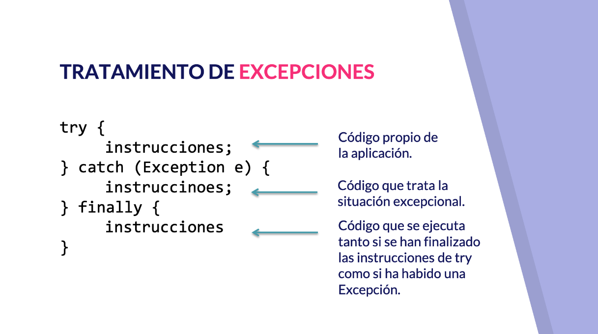
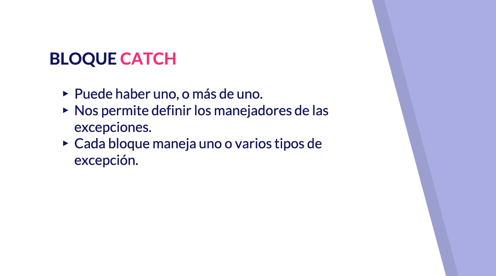
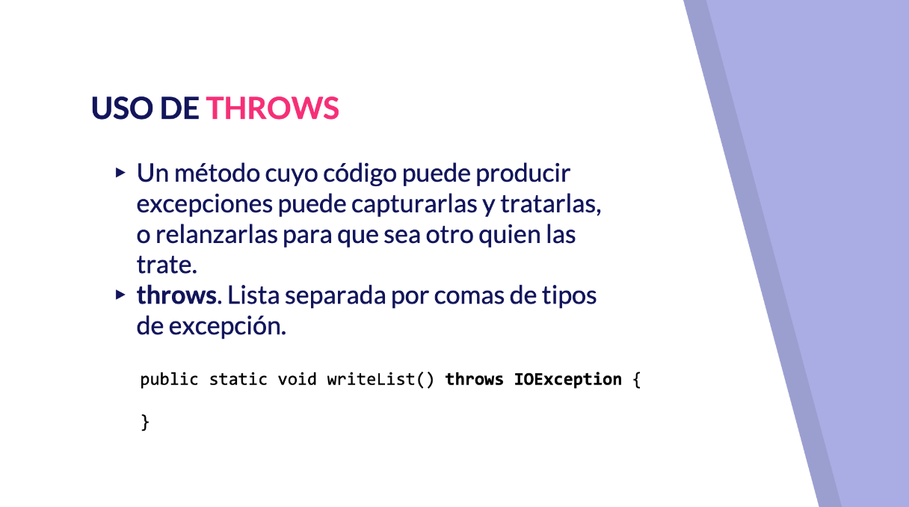
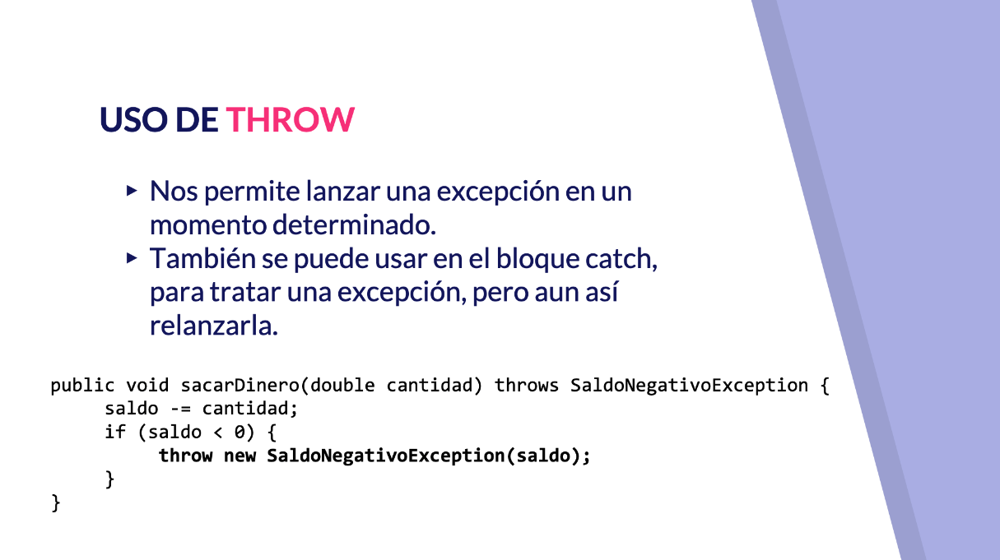

# 7. Manejo de excepciones 39m
   * Excepciones y errores 9:28 
   * Tratamiento de excepciones 13:36 
   * Excepciones más comunes 4:49 
   * Lanzamiento y propagación de excepciones 11:25 
   * Contenido adicional 4
   
## 26 Excepciones y errores 9:28

[Excepciones y errores](pdfs/26_Excepciones_y_errores.pdf)


### 26.1 Excepciones


El término excepción es una abreviatura de *situación excepcional*. Se trata de una situación que altera la ejecución normal de un programa. Por ejemplo, en una calculadura, un usuario intenta realiza la división `2 / 0`. En ese momento, el sistema crea un objeto, que se llama *objeto de excepción* y lo pasa de una llamada de método a otra, buscando quien pueda hacerse cargo. Si no existe nadie, será la propia JVM quien lo haga.


El uso de excepciones tiene varias ventajas:

* Permiten separar el código de tratamiento de errores del código normal.
* Evitan que haya errores inadvertidos.
* Permiten la propagación de los errores.
* Permiten agrupar en un lugar común el tratamiento de errores.

### 26.2 Tipos de Excepciones


Podemos agrupar las excepciones en 3 grandes tipos:

* Excepciones comprobadas (*checked exceptions*): son aquellas excepciones que pueden surgir internamente en un programa, pero que al estar bien escrito, podemos tratar y de las que nos podremos recuperar.

* Errores (*errors*): situaciones externas que no son anticipables, y de las que puede que no podamos recuperarnos (por ejemplo, un error hardware). Son un tipo no comprobado (*unchecked*)

* Errores de ejecución (*Runtime errors*): son situaciones interas de la aplicación, de las que probablemente no podamos recuperarnos. Son un tipo no comprobado (*unchecked*).

### 26.3 Código

*SituacionExcepcional.java*

```java
package excepciones;

public class SituacionExcepcional {
	
	public static void main(String[] args) {
		
		
		//El IDE nos previene de algunas
//		String name;
		//System.out.println(name);
		/*
		 * Multiple markers at this line
	       - name cannot be resolved to a variable
	       - 1 changed line
		 */
		
//		String name = null;
		//System.out.println(name);
		/*
		 * Multiple markers at this line
	       - name cannot be resolved to a variable
	       - 2 changed lines
		 */
		//System.out.println(name.length());
		/*
		 * name cannot be resolved
		 */
		
//		
//		//Otras no es posible controlarlas.
		int a = 2;
		int b = 0;
		System.out.println(a/b); //Error de división entre 0
	}
}
```

**SALIDA:**

```sh
Exception in thread "main" java.lang.ArithmeticException: / by zero
	at excepciones.SituacionExcepcional.main(SituacionExcepcional.java:33)
```

## Tratamiento de excepciones 13:36 

[Tratamiento de excepciones](pdfs/27_Tratamiento_de_excepciones.pdf)


### 27.1 Tratamiento de excepciones




Se realiza utilizando la siguiente sintaxis:

```java
try {
    instrucciones;
} catch (Exception e) {
    instruccinoes;
} finally {
    instrucciones
}
```

`finally` no es obligatorio, y podemos incluir más de un bloque catch.

### 27.2 Bloque `try`


Debe envolver las sentencias que son susceptibles de provocar uno o varios tipos de excepción. Debemos agrupar las sentencias que vayan a tener un tratamiento idéntico de la situación excepcional.

```java
    try {
            int a = 2;
            int b = 0;
            System.out.println(a/b); //Error de división entre 0            
        } catch(ArithmeticException ex) {
            //ex.printStackTrace();
            System.err.println("Error: " + ex.getMessage());
        }
```

### 27.3 Bloque `catch`



Sirven como manejadores de las situaciones excepcionales. Puede haber más de uno. Cada bloque puede manejar uno o más tipos de excepciones:

```java
        try {
            for (int i = 0; i < 5; i++) {
                System.out.println(mensajes[i].toUpperCase());
            }
        } catch (ArrayIndexOutOfBoundsException | NullPointerException ex) {
            System.err.println("Tratamiento común a las excepciones");
        }
 ```
 
 ```java
        try {
            for (int i = 0; i < 5; i++) {
                System.out.println(mensajes[i].toUpperCase());
            }
        } catch (ArrayIndexOutOfBoundsException ex) {
            System.err.println("Tratamiento particular a las excepción ArrayIndex...");
        } catch (NullPointerException ex) {
            System.err.println("Tratamiento particular a la excepción NullPointer...");
        }
```

### 27.4 Bloque `finally`


Se ejecuta siempre, tanto si hemos terminado correctamente el bloque `try` como el bloque `catch`. Se suele utilizar como código que asegura el cierre de recursos abiertos (ficheros, bases de datos, ...).

### 27.5 Código

#### Primer Programa

*EjemploTratamientoExcepciones.java*

```java
package excepciones;

/**
 * @author 
 *
 */
public class EjemploTratamientoExcepciones {

	/**
	 * @param args
	 */
	public static void main(String[] args) {
		int a = 2, b = 0;
		
//		try {
			System.out.println(a/b);
//		} catch(Exception ex) {
//			//ex.printStackTrace();
//			System.out.println("Error de división entre cero");
//		}
		
		System.out.println("La aplicación continua");

	}
}


SALIDA:

Exception in thread "main" java.lang.ArithmeticException: / by zero
	at excepciones.EjemploTratamientoExcepciones.main(EjemploTratamientoExcepciones.java:19)
```

#### Segunda Programa

*EjemploTratamientoExcepciones.java*

```java
package excepciones;

/**
 * @author Openwebinars
 *
 */
public class EjemploTratamientoExcepciones {

	/**
	 * @param args
	 */
	public static void main(String[] args) {
		int a = 2, b = 0;
		
		try {
			System.out.println(a/b);
		} catch(Exception ex) {
			//ex.printStackTrace();
			System.out.println("Error de división entre cero");
		}
		
		System.out.println("La aplicación continua");

	}
}


SALIDA:

Error de división entre cero
La aplicación continua
```

#### Tercer Programa

*TratamientoExcepciones01.java*

```java
package excepciones;

/**
 * @author 
 *
 */
public class TratamientoExcepciones01 {

	/**
	 * @param args
	 */
	public static void main(String[] args) {
  
		try {
			int a = 2;
			int b = 0;
			System.out.println(a/b); //Error de división entre 0			
		} catch(ArithmeticException ex) {
			//ex.printStackTrace();
			System.err.println("Error: " + ex.getMessage());
		}
		
		System.out.println("\nMensaje tras la división");
	}
}


SALIDA:

Error: / by zero

Mensaje tras la división
```

####  Cuarto Programa

*TratamientoExcepciones02.java*

```java
package excepciones;

/**
 * @author 
 *
 */
public class TratamientoExcepciones02 {

	/**
	 * @param args
	 */
	public static void main(String[] args) {
		try {
			int a = 2;
			int b = 0;
			System.out.println(a/b); //Error de división entre 0			
		} catch(ArithmeticException ex) {
			//ex.printStackTrace();
			System.err.println("Error: " + ex.getMessage());
		} finally {
			System.out.println("\nEstas instrucciones son muy importantes. Deben ejecutarse tanto si no ha habido excepciones, como si las ha habido");
		}
	}
}


SALIDA:

Error: / by zero

Estas instrucciones son muy importantes. Deben ejecutarse tanto si no ha habido excepciones, como si las ha habido
```

####  Quinto Programa

*TratamientoExcepciones03.java*

```java
package excepciones;

/**
 * @author 
 *
 */
public class TratamientoExcepciones03 {

	/**
	 * @param args
	 */
	public static void main(String[] args) {
		
		try {
			int a = 2;
			int b = 2; //Si ponemos 0 entra al primer catch
			int resultado = a/b;
			String mensaje = null;
			System.out.println(mensaje.length()); //Error de división entre 0			
		} catch(ArithmeticException ex) {
			//ex.printStackTrace();
			System.err.println("Error: " + ex.getMessage());
		} catch(Exception ex) {
			System.out.println("Se ha producido un error no esperado");
		}
	}
}


SALIDA:

Se ha producido un error no esperado
```

####  Sexto Programa

*TratamientoExcepciones04.java*

```java
package excepciones;

/**
 * @author Openwebinars
 *
 */
public class TratamientoExcepciones04 {

	/**
	 * @param args
	 */
	public static void main(String[] args) {

		String[] mensajes = { "En un lugar", "de La Mancha", "de cuyo nombre", "no quiero acordarme" };
		//String[] mensajes = { "En un lugar", null, "de cuyo nombre", "no quiero acordarme", "no ha mucho tiempo vivía" };

		try {
			for (int i = 0; i < 5; i++) {
				System.out.println(mensajes[i].toUpperCase());
			}
		} catch (ArrayIndexOutOfBoundsException | NullPointerException ex) {
			System.err.println("Tratamiento común a las excepciones");
		}
		
		System.out.println("Mensaje final");

	}
}


SALIDA:

EN UN LUGAR
Tratamiento común a las excepciones
DE LA MANCHA
DE CUYO NOMBRE
NO QUIERO ACORDARME
Mensaje final
```

####  Sexto Programa Modificado

*TratamientoExcepciones04.java*

```java
package excepciones;

/**
 * @author 
 *
 */
public class TratamientoExcepciones04 {

	/**
	 * @param args
	 */
	public static void main(String[] args) {

		//String[] mensajes = { "En un lugar", "de La Mancha", "de cuyo nombre", "no quiero acordarme" };
		String[] mensajes = { "En un lugar", null, "de cuyo nombre", "no quiero acordarme", "no ha mucho tiempo vivía" };

		try {
			for (int i = 0; i < 5; i++) {
				System.out.println(mensajes[i].toUpperCase());
			}
		} catch (ArrayIndexOutOfBoundsException | NullPointerException ex) {
			System.err.println("Tratamiento común a las excepciones");
		}
		
		System.out.println("Mensaje final");
	}
}


SALIDA:

EN UN LUGAR
Tratamiento común a las excepciones
Mensaje final
```

#### Septimo Programa

*TratamientoExcepciones04bis.java*

```java
package excepciones;

/**
 * @author 
 *
 */
public class TratamientoExcepciones04bis {

	/**
	 * @param args
	 */
	public static void main(String[] args) {

		String[] mensajes = { "En un lugar", "de La Mancha", "de cuyo nombre", "no quiero acordarme" };
		//String[] mensajes = { "En un lugar", null, "de cuyo nombre", "no quiero acordarme", "no ha mucho tiempo vivía" };

		try {
			for (int i = 0; i < 5; i++) {
				System.out.println(mensajes[i].toUpperCase());
			}
		} catch (ArrayIndexOutOfBoundsException ex) {
			System.err.println("Tratamiento particular a las excepción ArrayIndex...");
		} catch (NullPointerException ex) {
			System.err.println("Tratamiento particular a la excepción NullPointer...");
		}
		
		System.out.println("Mensaje final");
	}
}


SALIDA:

EN UN LUGAR
Tratamiento particular a las excepción ArrayIndex...
DE LA MANCHA
DE CUYO NOMBRE
NO QUIERO ACORDARME
Mensaje final
```

#### Septimo Programa Modificado

*TratamientoExcepciones04bis.java*

```java
package excepciones;

/**
 * @author 
 *
 */
public class TratamientoExcepciones04bis {

	/**
	 * @param args
	 */
	public static void main(String[] args) {

		//String[] mensajes = { "En un lugar", "de La Mancha", "de cuyo nombre", "no quiero acordarme" };
		String[] mensajes = { "En un lugar", null, "de cuyo nombre", "no quiero acordarme", "no ha mucho tiempo vivía" };

		try {
			for (int i = 0; i < 5; i++) {
				System.out.println(mensajes[i].toUpperCase());
			}
		} catch (ArrayIndexOutOfBoundsException ex) {
			System.err.println("Tratamiento particular a las excepción ArrayIndex...");
		} catch (NullPointerException ex) {
			System.err.println("Tratamiento particular a la excepción NullPointer...");
		}
		
		System.out.println("Mensaje final");
	}
}


SALIDA:

EN UN LUGAR
Tratamiento particular a la excepción NullPointer...
Mensaje final
```

## 28. Excepciones más comunes 4:49 

[Excepciones más comunes](pdfs/28_Clases_de_excepción_más_comunes.pdf)

CLASE DE EXCEPCIÓN | USO
-------------------|----
ArithmeticException |	Errores en operaciones aritméticas
ArraryIndexOutOfBoundsException |	Índice de array fuera de los límites
ClassCastException | Intento de convertir a una clase incorrecta
IllegalArgumentException | Argumento ilegal en la llamada a un método
IndexOutOfBoundsException | Índice fuera de colección
NegativeArraySizeException | Tamaño de array negativo
NullPointerException | Uso de referencia nula
NumberFormatException | Formato de número incorrecto
StringIndexOutOfBounds | Índice usado en String fuera de los límites

## 29. Lanzamiento y propagación de excepciones 11:25 

[Lanzamiento y propagación de excepciones](pdfs/29_Lanzamiento_y_propagación_de_excepciones.pdf)


### 29.1 Lanzamiento de excepciones


Cualquier código puede lanzar excepciones (hecho por java, por nosotros o de terceros). Si no vamos a tratar las excepciones en un método, tenemos que indicar que se relanzarán hacia arriba (`throws`).

#### 29.1.1 Uso de `throws`



Un método cuyo código puede producir excepciones puede capturarlas y tratarlas, o relanzarlas para que sea otro quien las trate. `throws` se escribe a continuación de la firma del método y antes de la apertura del cuerpo, y espera la excepción o excepciones (lista separada por comas) que se pueden lanzar.

```java
public static void writeList() throws IOException {

}
```

#### 29.1.2 Uso de `throw`



Nos permite lanzar una excepción en un momento determinado. También se puede usar en el bloque catch, para tratar una excepción, pero aun así relanzarla.

```java
public void sacarDinero(double cantidad) throws SaldoNegativoException {
     saldo -= cantidad;
     if (saldo < 0) {
          throw new SaldoNegativoException(saldo);
     }
}
```

### 29.2 Excepciones propias


Podemos crear nuestros propios tipos, extendiendo a `Exception`. Nos permiten manejar nuestras propias situaciones. Es buena práctica añadir el sufijo `...Exception`.

```java
public class SaldoNegativoException extends Exception {

   public SaldoNegativoException(double saldo) {
      super("La cuenta ha quedado en descubierto (" + Double.toString(saldo) + ")");
   }

}
```

### 29.3 Código

### Primer Programa

*EjemploSinThrows.java*

```java
package conthrows;

import java.io.FileWriter;
import java.io.IOException;
import java.io.PrintWriter;

/**
 * @author 
 *
 */
public class EjemploSinThrows {

	/**
	 * @param args
	 */
	public static void main(String[] args) {
		writeList();
		System.out.println("Fichero escrito correctamente");
	}

	public static void writeList() {
		PrintWriter out = null;
		try {
			out = new PrintWriter(new FileWriter("OutFile.txt"));

			for (int i = 0; i < 10; i++) {
				out.println("Mensaje nº " + i);
			}
		} catch (IOException ex) {
			System.err.println("Error al abrir o escribir en el fichero");
		} finally {
			out.close();
		}
	}
}
```

**SALIDA**

```sh
Fichero escrito correctamente
```

*OutFile.txt*

```text
Mensaje nº 0
Mensaje nº 1
Mensaje nº 2
Mensaje nº 3
Mensaje nº 4
Mensaje nº 5
Mensaje nº 6
Mensaje nº 7
Mensaje nº 8
Mensaje nº 9
```

### Segundo Programa

*EjemploConThrows.java*

```java
package conthrows;

import java.io.FileWriter;
import java.io.IOException;
import java.io.PrintWriter;

/**
 * @author 
 *
 */
public class EjemploConThrows {

	/**
	 * @param args
	 */
	public static void main(String[] args) {
		
			try {
				writeList();
				System.out.println("Fichero escrito correctamente");
			} catch (IOException e) {
				System.out.println("Error al intentar abrir un fichero de texto");
			}
	}
	
	public static void writeList() throws IOException {
		PrintWriter out = new PrintWriter(new FileWriter("OutFile.txt"));
		
		for(int i = 0; i < 15; i++) {
			out.println("Mensaje nº " + i);
		}
		
		out.close();
	}
}
```

```sh
Fichero escrito correctamente
```

*OutFile.txt*

```text
Mensaje nº 0
Mensaje nº 1
Mensaje nº 2
Mensaje nº 3
Mensaje nº 4
Mensaje nº 5
Mensaje nº 6
Mensaje nº 7
Mensaje nº 8
Mensaje nº 9
Mensaje nº 10
Mensaje nº 11
Mensaje nº 12
Mensaje nº 13
Mensaje nº 14
```

### Tercer Programa

*SaldoNegativoException.java*

```java
package misexcepciones;

public class SaldoNegativoException extends Exception {

	public SaldoNegativoException(double saldo) {
		super("La cuenta ha quedado en descubierto (" + Double.toString(saldo) + ")");
	}
}
```

*CuentaCorriente.java*

```java
package misexcepciones;

public class CuentaCorriente {
	
	private String propietario;
	private double saldo;
	
	public CuentaCorriente(String propietario, double saldo) {
		this.propietario = propietario;
		this.saldo = saldo;
	}

	public String getPropietario() {
		return propietario;
	}

	public void setPropietario(String propietario) {
		this.propietario = propietario;
	}

	public double getSaldo() {
		return saldo;
	}
	
	public void ingresarDinero(double cantidad) {
		saldo += cantidad;
	}
	
	public void sacarDinero(double cantidad) throws SaldoNegativoException {
		saldo -= cantidad;
		if (saldo < 0) {
			throw new SaldoNegativoException(saldo);
		}
	}
}
```

*Banco.java*

```java
package misexcepciones;

/**
 * @author 
 *
 */
public class Banco {

	/**
	 * @param args
	 */
	public static void main(String[] args) {
		
		CuentaCorriente cc = new CuentaCorriente("Luis Miguel", 100.0);
		
		try {
			cc.sacarDinero(160.0);
			System.out.println("Saldo actual " + cc.getSaldo());
		} catch (SaldoNegativoException e) {
			System.err.println(e.getMessage());
			System.err.println("Póngase en contacto con su banco");
		}
	}
}


SALIDA:

La cuenta ha quedado en descubierto (-60.0)
Póngase en contacto con su banco
```

## Contenido adicional 4   

[Excepciones y errores](pdfs/26_Excepciones_y_errores.pdf)

[Tratamiento de excepciones](pdfs/27_Tratamiento_de_excepciones.pdf)

[Excepciones más comunes](pdfs/28_Clases_de_excepción_más_comunes.pdf)

[Lanzamiento y propagación de excepciones](pdfs/29_Lanzamiento_y_propagación_de_excepciones.pdf)
