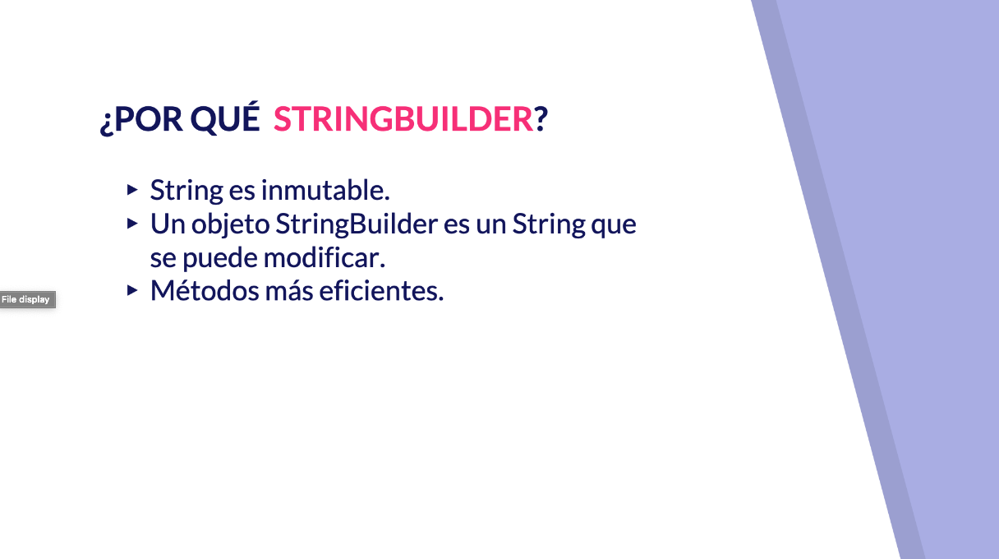
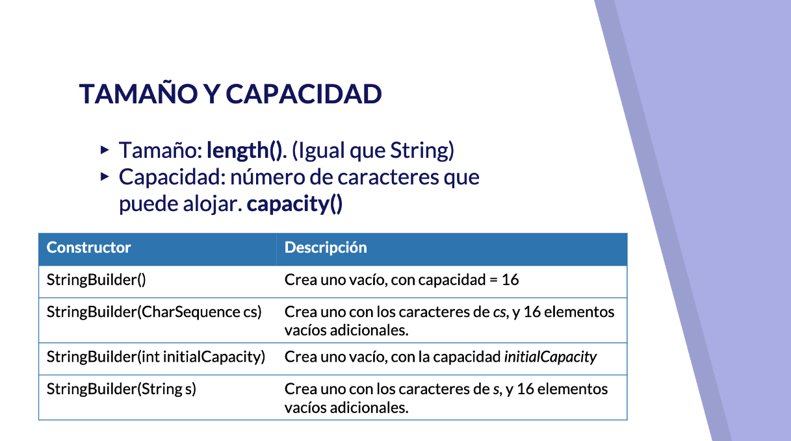
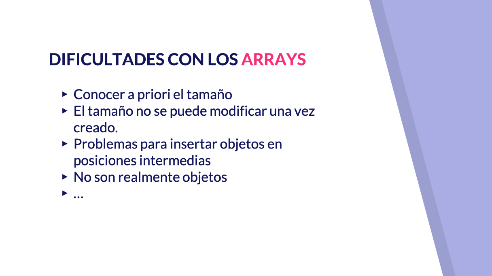
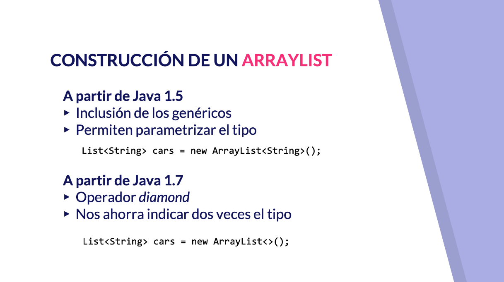

# 8. Algunas clases del API de Java 82m
   * Manipulación de datos con Stringbuilder 8:01 
   * Manejo de fechas 17:31 
   * Colecciones ArrayList 11:30 
   * Introducción a las expresiones lambda 20:21 
   * Práctica: Creando un gestor de aparcamiento de coches 25:16 
   * Contenido adicional 6
   
   
## 30. Manipulación de datos con Stringbuilder 8:01 

[Manipulación de datos con Stringbuilder](pdfs/30_StringBuilder.pdf)

Conoce el tipo de cadena Stringbuilder en esta lección







### Código

#### Primer Programa

*PalindromosString.java*

```java
package usodestringbuilder;

/**
 * @author 
 *
 */
public class PalindromosString {

	/**
	 * @param args
	 */
	public static void main(String[] args) {

		String palindromo = "Dabale arroz a la zorra el abad";
		int longitud = palindromo.length();
		char[] tempCharArray = new char[longitud];
		char[] charArray = new char[longitud];

		// transformamos el string en un array de char
		for (int i = 0; i < longitud; i++) {
			tempCharArray[i] = palindromo.charAt(i);
		}

		// lo invertimos
		for (int j = 0; j < longitud; j++) {
			charArray[j] = tempCharArray[longitud - 1 - j];
		}

		String palindromoInvertido = new String(charArray);
		System.out.println(palindromoInvertido);	
	}
}


SALIDA:

daba le arroz al a zorra elabaD

```

#### Segundo Programa

*PalindromosStringBuilder.java*

```java
package usodestringbuilder;

/**
 * @author 
 *
 */
public class PalindromosStringBuilder {

	/**
	 * @param args
	 */
	public static void main(String[] args) {

		    String palindromo = "Dabale arroz a la zorra el abad";
        StringBuilder sb = new StringBuilder(palindromo);
        sb.reverse();  // lo invertimos
        System.out.println(sb); //llamada implícita a sb.toString().        
	}
}


SALIDA:

daba le arroz al a zorra elabaD
```

## 31. Manejo de fechas 17:31 

[Manejo de fechas](pdfs/31_Manejo_de_fechas.pdf)


El API de fechas de Java 8 posee varias clases para manejarlas, pero la mayoría de ellas sigue esta convención sobre el nombre de los métodos que sirven para manejarlas.

Nombre | Tipo     | Uso
-------|----------|----
`of`   | estático |	Crear una instancia del objeto a partir de los datos de entrada
`from` | estático	| Convertir el parámetro de entrada en una instancia de la clase
`parse`| estático	| Procesar la cadena de entrada y construir una instancia
`format`| instancia |	Procesar los datos para producir una cadena de caracteres
`get`  | instancia | Devolver una parte del objeto
`is`   | instancia | Consultar el estado del objeto
`with` | instancia | Devolver una copia del objeto con uno o varios elementos modificados
`plus` | instancia | Devolver una copia del objeto con una cantidad de tiempo añadido
`minus`| instancia | Devolver una copia del objeto con una cantidad de tiempo sustraído
`to`   | instancia | Convertir el objeto en otro Tipo
`at`   | instancia | Combinar el objeto con otro objeto

### 31.1 Código

*A_FechaHoy.java*

```java
/**
 * Ejemplo de como obtener la fecha actual
 */
package fechas;

import java.time.LocalDate;

/**
 * @author 
 *
 */
public class A_FechaHoy {

	/**
	 * @param args
	 */
	public static void main(String[] args) {

		LocalDate hoy = LocalDate.now();
		System.out.println("La fecha actual es : " + hoy);
	}
}


SALIDA:

La fecha actual es : 2020-04-26
```

*B_DiaMesAnio.java*

```java
/**
 * Ejemplo de como obtener, por separado, las cifras correspondientes al día, mes y año.
 */
package fechas;

import java.time.LocalDate;

/**
 * @author 
 *
 */
public class B_DiaMesAnio {

	/**
	 * @param args
	 */
	public static void main(String[] args) {
		LocalDate hoy = LocalDate.now();
		int year = hoy.getYear();
		int month = hoy.getMonthValue();
		int day = hoy.getDayOfMonth();
		System.out.printf("Año : %d Mes : %d Día : %d \t %n", year, month, day);
	}
}


SALIDA:

Año : 2020 Mes : 4 Día : 26
```

*C_FechaConcreta.java*

```java
/**
 * Ejemplo de como obtener una fecha concreta a partir
 * de su día, mes y año.
 */
package fechas;

import java.time.LocalDate;

/**
 * @author 
 *
 */
public class C_FechaConcreta {

	/**
	 * @param args
	 */
	public static void main(String[] args) {

		LocalDate nacimiento = LocalDate.of(1982, 9, 18);
		System.out.println("Tu fecha de nacimiento es : " + nacimiento);
	}
}


SALIDA:

Tu fecha de nacimiento es : 1982-09-18
```

*D_FechasIguales.java*

```java
/**
 * Ejemplo de como testear si dos fechas son iguales
 */
package fechas;

import java.time.LocalDate;

/**
 * @author Openwebinars
 *
 */
public class D_FechasIguales {

	/**
	 * @param args
	 */
	public static void main(String[] args) {
		LocalDate fecha = LocalDate.of(2017, 11, 11);
		LocalDate hoy = LocalDate.now();
		if (fecha.equals(hoy)) {
			System.out.printf("Hoy %s y la fecha %s son la misma fecha ", hoy, fecha);
		} else {
			System.out.printf("Las fechas %s y %s no son iguales ", hoy, fecha);
		}
	}
}


SALIDA:

Las fechas 2020-04-26 y 2017-11-11 no son iguales 
```

*E_EventosRecurrentes.java*

```java
/**
 * Ejemplo de uso de la clase MonthDay, para representar eventos recurrentes de forma anual
 */
package fechas;

import java.time.LocalDate;
import java.time.MonthDay;

/**
 * @author Openwebinars
 *
 */
public class E_EventosRecurrentes {

	/**
	 * @param args
	 */
	public static void main(String[] args) {
		LocalDate nacimiento = LocalDate.of(2017, 11, 11);
		MonthDay diaNacimiento = MonthDay.of(nacimiento.getMonth(), nacimiento.getDayOfMonth());
		MonthDay diaMesHoy = MonthDay.from(LocalDate.now());
		if (diaMesHoy.equals(diaNacimiento)) {
			System.out.println("Muchas felicidades, porque es tu cumpleaños");
		} else {
			System.out.println("Lo siento, pero no es tu cumpleaños");
		}
	}
}


SALIDA:

Lo siento, pero no es tu cumpleaños
```


*.java*

```java
```


*.java*

```java
```


*.java*

```java
```


*.java*

```java
```


*.java*

```java
```


*.java*

```java
```


*.java*

```java
```


*.java*

```java
```


*.java*

```java
```


*.java*

```java
```


## 32. Colecciones ArrayList 11:30 

[Colecciones ArrayList](pdfs/32_Arraylist.pdf)








### 32.1 Desventajas del uso de arrays

El uso de arrays nos aportan una serie de **desventajas**:

* Tenemos que conocer a priori el tamaño.
* El tamaño no se puede modificar una vez creado.
* Problemas para insertar objetos en posiciones intermedias.
* Los arrays no son realmente objetos (instancias de clases)

Java nos provee de una serie de colecciones con algunos beneficios:

* Menos esfuerzo de programación.
* Aumento de la calidad y velocidad.
* Interoperabilidad
* Curva de aprendizaje pequeña
* Reusabilidad

### 32.2 ArrayList

De todas las colecciones de Java es quizá la más usada de todas. Permite algunas operaciones típicas de las colecciones **secuenciales**:

* Acceso posicional
* Búsqueda
* Iteración
* Tomar un fragmento

Para conocer mejor los métodos, podemos acceder a la documentación del api:

https://docs.oracle.com/javase/8/docs/api/java/util/ArrayList.html

## 33. Introducción a las expresiones lambda 20:21 

[Introducción a las expresiones lambda](pdfs/33_ExpresionesLambda.pdf)

### 33.1 Paradigma de programación funcional

A la hora de programar, existen más paradigmas (formas de entender la programación) que la orientación a objetos: imperativa, lógica, orientada a aspectos, ... Uno de ellos, que está muy de moda, es la **programación funcional**. Su origen está en un lenguaje matemático formal, y si lo tenemos que resumir en una frase, podríamos decir que en él, la salida de una función depende solo de los parámetros de entrada.

Los lenguajes funcionales son más expresivos (es decir, hacen más con menos código) y más elegantes. Este tipo de expresiones ya estaban presentes en muchos lenguajes de programación, y era algo que la comunidad demandaba a Java, que lo ha incluido en su versión Java SE 8.

### 33.2 Expresión lambda

Una expresión lamba no va a ser más que una función anónima, un método abstracto. Su sintaxis es sencilla:

```java
() -> expresión

(p1, p2, ...) -> expresión

(p1, p2, ...) -> { sentencia1; sentencia2; .....;}
```

Algunos ejemplos de expresiones lambda podrían ser:

```java
() -> new ArrayList<>()
(int a, int b) -> a+b
(a) -> {
  System.out.println(a);
  return true;
}
```

### 33.3 Interfaz funcional

Se trata de cualquier interfaz que tenga un solo método (además de métodos `default`, `static`, `equals`, ...). Están muy ligadas a las expresiones lambda ya que allá donde se espere una instancia de un objeto que implemente una interfaz funcional, podremos utilizar una expresión de este tipo.

### 33.4 Colecciones y el método forEach

En Java SE 8 las colecciones nos proveen de un método, `.forEach`, que acepta una instancia de un objeto que implementa una interfaz funcional, llamada `Consumer<T>`, que nos permitirá facilmente recorrer el bucle usando expresiones lambda.

```java
lista.forEach(System.out::println);
```

### 33.5 Acceso a métodos

El operador `::` nos permite abreviar más la sintaxis, de forma que podemos acceder a métodos directamente:

Por ejemplo:

```java
x -> System.out.println(x)
```

sería equivalente a

```java
System.out::println
```

### 33.6 API Stream

Se trata de una nueva funcionalidad, que nos permite trabajar con colecciones como si se trataran de flujos de datos. Esto nos dará gran versatilidad, junto con las expresiones lambda, para filtrar, transformar, ordenar, agrupar y presentar datos.


```java
List<Integer> lista = Arrays.asList(1,2,3,4,5,6,7,8,9,10);

lista
  .stream()
  .filter((x) -> x >= 5)
  .forEach(System.out::println);
```

## Práctica: Creando un gestor de aparcamiento de coches 25:16 

[Proyecto_Final.pptx](otros/Proyecto_Final.pptx)

[Gráfico.xlsx](otros/Gráfico.xlsx)

En esta sesión práctica veremos como crear un gestor de aparcamiento de coches, tienes el código de ejemplo en el [repositorio de GitHub](https://github.com/OpenWebinarsNet/Curso-Java-desde-0/tree/master/Final_Parking).

## Contenido adicional 6   

[Manipulación de datos con Stringbuilder](pdfs/30_StringBuilder.pdf)

[Manejo de fechas](pdfs/31_Manejo_de_fechas.pdf)

[Colecciones ArrayList](pdfs/32_Arraylist.pdf)

[Introducción a las expresiones lambda](pdfs/33_ExpresionesLambda.pdf)

[Proyecto_Final.pptx](otros/Proyecto_Final.pptx)

[Gráfico.xlsx](otros/Gráfico.xlsx)
