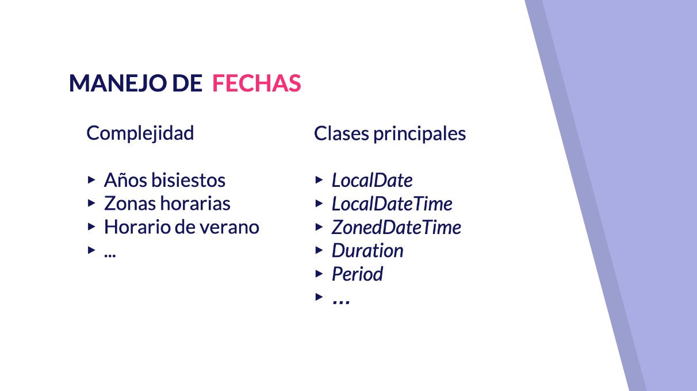
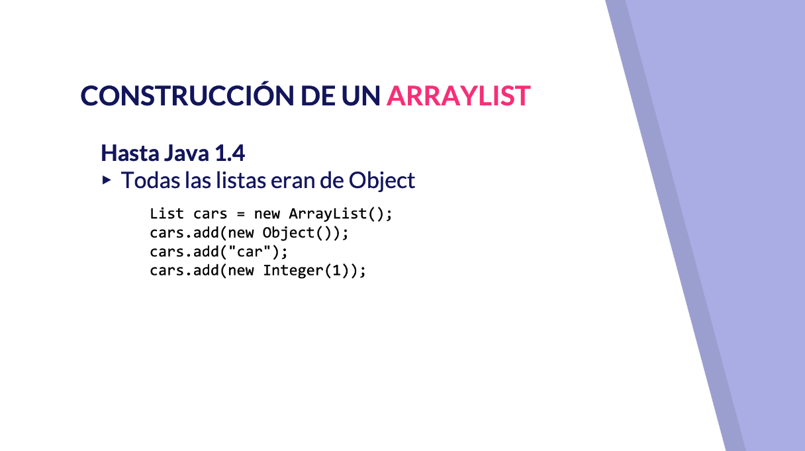
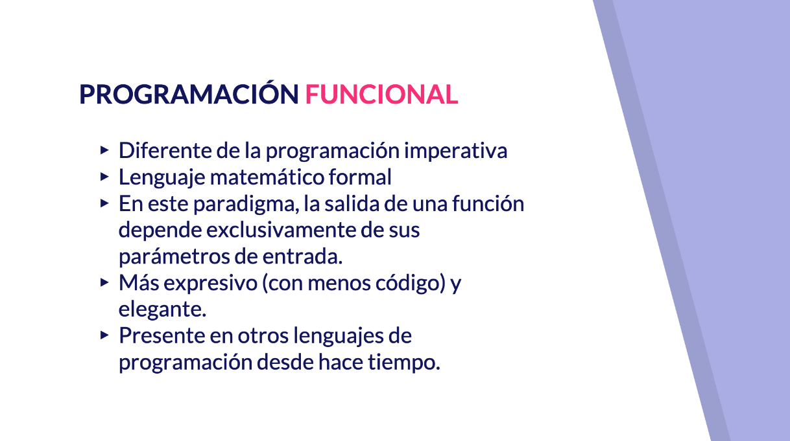
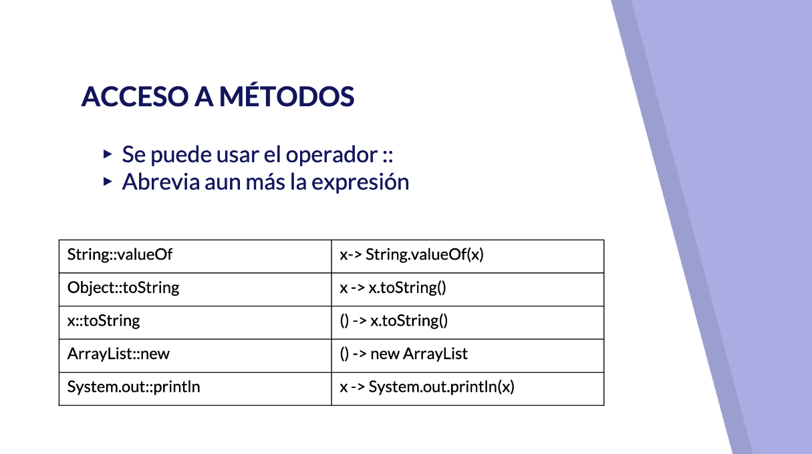

# 8. Algunas clases del API de Java 82m
   * Manipulación de datos con Stringbuilder 8:01 
   * Manejo de fechas 17:31 
   * Colecciones ArrayList 11:30 
   * Introducción a las expresiones lambda 20:21 
   * Práctica: Creando un gestor de aparcamiento de coches 25:16 
   * Contenido adicional 6
   
   
## 30. Manipulación de datos con Stringbuilder 8:01 

[Manipulación de datos con Stringbuilder](pdfs/30_StringBuilder.pdf)

Conoce el tipo de cadena Stringbuilder en esta lección


### Código

#### Primer Programa

*PalindromosString.java*

```java
package usodestringbuilder;

/**
 * @author 
 *
 */
public class PalindromosString {

	/**
	 * @param args
	 */
	public static void main(String[] args) {

		String palindromo = "Dabale arroz a la zorra el abad";
		int longitud = palindromo.length();
		char[] tempCharArray = new char[longitud];
		char[] charArray = new char[longitud];

		// transformamos el string en un array de char
		for (int i = 0; i < longitud; i++) {
			tempCharArray[i] = palindromo.charAt(i);
		}

		// lo invertimos
		for (int j = 0; j < longitud; j++) {
			charArray[j] = tempCharArray[longitud - 1 - j];
		}

		String palindromoInvertido = new String(charArray);
		System.out.println(palindromoInvertido);	
	}
}


SALIDA:

daba le arroz al a zorra elabaD

```

#### Segundo Programa

*PalindromosStringBuilder.java*

```java
package usodestringbuilder;

/**
 * @author 
 *
 */
public class PalindromosStringBuilder {

	/**
	 * @param args
	 */
	public static void main(String[] args) {

		    String palindromo = "Dabale arroz a la zorra el abad";
        StringBuilder sb = new StringBuilder(palindromo);
        sb.reverse();  // lo invertimos
        System.out.println(sb); //llamada implícita a sb.toString().        
	}
}


SALIDA:

daba le arroz al a zorra elabaD
```

## 31. Manejo de fechas 17:31 

[Manejo de fechas](pdfs/31_Manejo_de_fechas.pdf)





El API de fechas de Java 8 posee varias clases para manejarlas, pero la mayoría de ellas sigue esta convención sobre el nombre de los métodos que sirven para manejarlas.

Nombre | Tipo     | Uso
-------|----------|----
`of`   | estático |	Crear una instancia del objeto a partir de los datos de entrada
`from` | estático	| Convertir el parámetro de entrada en una instancia de la clase
`parse`| estático	| Procesar la cadena de entrada y construir una instancia
`format`| instancia |	Procesar los datos para producir una cadena de caracteres
`get`  | instancia | Devolver una parte del objeto
`is`   | instancia | Consultar el estado del objeto
`with` | instancia | Devolver una copia del objeto con uno o varios elementos modificados
`plus` | instancia | Devolver una copia del objeto con una cantidad de tiempo añadido
`minus`| instancia | Devolver una copia del objeto con una cantidad de tiempo sustraído
`to`   | instancia | Convertir el objeto en otro Tipo
`at`   | instancia | Combinar el objeto con otro objeto

### 31.1 Código

*A_FechaHoy.java*

```java
/**
 * Ejemplo de como obtener la fecha actual
 */
package fechas;

import java.time.LocalDate;

/**
 * @author 
 *
 */
public class A_FechaHoy {

	/**
	 * @param args
	 */
	public static void main(String[] args) {

		LocalDate hoy = LocalDate.now();
		System.out.println("La fecha actual es : " + hoy);
	}
}


SALIDA:

La fecha actual es : 2020-04-26
```

*B_DiaMesAnio.java*

```java
/**
 * Ejemplo de como obtener, por separado, las cifras correspondientes al día, mes y año.
 */
package fechas;

import java.time.LocalDate;

/**
 * @author 
 *
 */
public class B_DiaMesAnio {

	/**
	 * @param args
	 */
	public static void main(String[] args) {
		LocalDate hoy = LocalDate.now();
		int year = hoy.getYear();
		int month = hoy.getMonthValue();
		int day = hoy.getDayOfMonth();
		System.out.printf("Año : %d Mes : %d Día : %d \t %n", year, month, day);
	}
}


SALIDA:

Año : 2020 Mes : 4 Día : 26
```

*C_FechaConcreta.java*

```java
/**
 * Ejemplo de como obtener una fecha concreta a partir
 * de su día, mes y año.
 */
package fechas;

import java.time.LocalDate;

/**
 * @author 
 *
 */
public class C_FechaConcreta {

	/**
	 * @param args
	 */
	public static void main(String[] args) {

		LocalDate nacimiento = LocalDate.of(1982, 9, 18);
		System.out.println("Tu fecha de nacimiento es : " + nacimiento);
	}
}


SALIDA:

Tu fecha de nacimiento es : 1982-09-18
```

*D_FechasIguales.java*

```java
/**
 * Ejemplo de como testear si dos fechas son iguales
 */
package fechas;

import java.time.LocalDate;

/**
 * @author Openwebinars
 *
 */
public class D_FechasIguales {

	/**
	 * @param args
	 */
	public static void main(String[] args) {
		LocalDate fecha = LocalDate.of(2017, 11, 11);
		LocalDate hoy = LocalDate.now();
		if (fecha.equals(hoy)) {
			System.out.printf("Hoy %s y la fecha %s son la misma fecha ", hoy, fecha);
		} else {
			System.out.printf("Las fechas %s y %s no son iguales ", hoy, fecha);
		}
	}
}


SALIDA:

Las fechas 2020-04-26 y 2017-11-11 no son iguales 
```

*E_EventosRecurrentes.java*

```java
/**
 * Ejemplo de uso de la clase MonthDay, para representar eventos recurrentes de forma anual
 */
package fechas;

import java.time.LocalDate;
import java.time.MonthDay;

/**
 * @author Openwebinars
 *
 */
public class E_EventosRecurrentes {

	/**
	 * @param args
	 */
	public static void main(String[] args) {
		LocalDate nacimiento = LocalDate.of(2017, 11, 11);
		MonthDay diaNacimiento = MonthDay.of(nacimiento.getMonth(), nacimiento.getDayOfMonth());
		MonthDay diaMesHoy = MonthDay.from(LocalDate.now());
		if (diaMesHoy.equals(diaNacimiento)) {
			System.out.println("Muchas felicidades, porque es tu cumpleaños");
		} else {
			System.out.println("Lo siento, pero no es tu cumpleaños");
		}
	}
}


SALIDA:

Lo siento, pero no es tu cumpleaños
```

*F_HoraActual.java*

```java
/**
 * Ejemplo de como obtener la hora actual, incluidos hasta los nanosegundos
 */
package fechas;

import java.time.LocalTime;

/**
 * @author 
 *
 */
public class F_HoraActual {

	/**
	 * @param args
	 */
	public static void main(String[] args) {
		LocalTime time = LocalTime.now();
		System.out.println("La hora actual es : " + time);
	}
}


SALIDA:

La hora actual es : 15:20:53.106
```

*G_AniadirHoras.java*

```java
/**
 * Ejemplo de como añadir horas a una hora en particular
 */
package fechas;

import java.time.LocalTime;

/**
 * @author 
 *
 */
public class G_AniadirHoras {

	/**
	 * @param args
	 */
	public static void main(String[] args) {
		LocalTime time = LocalTime.now();
		LocalTime newTime = time.plusHours(2); // añadiendo dos horas 
		System.out.println("Hora, después de 2 horas : " + newTime);
	}
}


SALIDA:

Hora, después de 2 horas : 17:23:16.324
```

*H_UnaSemanaDespues.java*

```java
/**
 * Ejemplo de como añadir una cantidad de tiempo a una fecha
 */
package fechas;

import java.time.LocalDate;
import java.time.temporal.ChronoUnit;

/**
 * @author 
 *
 */
public class H_UnaSemanaDespues {

	/**
	 * @param args
	 */
	public static void main(String[] args) {

		LocalDate nextWeek = LocalDate.now().plus(1, ChronoUnit.WEEKS);
		System.out.println("Hoy es : " + LocalDate.now());
		System.out.println("Dentro de 1 semana: " + nextWeek);
	}
}


SALIDA:

Hoy es : 2020-04-26
Dentro de 1 semana: 2020-05-03
```

*I_FechaHaceUnAnio.java*

```java
/**
 * Ejemplo de como añadir o restar una cantidad de tiempo a una fecha
 */
package fechas;

import java.time.LocalDate;
import java.time.temporal.ChronoUnit;

/**
 * @author Openwebinars
 *
 */
public class I_FechaHaceUnAnio {

	/**
	 * @param args
	 */
	public static void main(String[] args) {

		LocalDate today = LocalDate.now();
		LocalDate previousYear = today.minus(1, ChronoUnit.YEARS);
		System.out.println("Fecha hace un año: " + previousYear);
		LocalDate nextYear = today.plus(1, ChronoUnit.YEARS);
		System.out.println("Fecha dentro de 1 año : " + nextYear);
	}
}


SALIDA:

Fecha hace un año: 2019-04-26
Fecha dentro de 1 año : 2021-04-26
```

*J_CompararFechas.java*

```java
/**
 * Ejemplo de como comparar si una fecha es anterior o posterior a otra
 */
package fechas;

import java.time.LocalDate;
import java.time.temporal.ChronoUnit;

/**
 * @author 
 *
 */
public class J_CompararFechas {

	/**
	 * @param args
	 */
	public static void main(String[] args) {
		
		LocalDate today = LocalDate.now();
		LocalDate otraFecha = LocalDate.of(2017, 12, 24);
		if (otraFecha.isAfter(today)) {
			System.out.println("La otra fecha es posterior a la de hoy");
		}
		LocalDate ayer = today.minus(1, ChronoUnit.DAYS);
		if (ayer.isBefore(today)) {
			System.out.println("Ayer es anterior a hoy");
		}
	}
}


SALIDA:

Ayer es anterior a hoy
```

*K_FechasFijas.java*

```java
/**
 * Ejemplo de como usar fechas fijas (mes y año), como la fecha de caducidad de una tarjeta de crédito,
 * haciendo uso de la clase YearMonth.
 */
package fechas;

import java.time.Month;
import java.time.YearMonth;

/**
 * @author Openwebinars
 *
 */
public class K_FechasFijas {

	/**
	 * @param args
	 */
	public static void main(String[] args) {
		
		YearMonth anioYMesActual = YearMonth.now();
		System.out.printf("Días en la clase MonthYear %s: %d%n", anioYMesActual, anioYMesActual.lengthOfMonth());
		YearMonth caducidadTarjetaCredito = YearMonth.of(2018, Month.FEBRUARY);
		System.out.printf("Su tarjeta de crédito caduca en %s ", caducidadTarjetaCredito);
	}
}


SALIDA:

Días en la clase MonthYear 2020-04: 30
Su tarjeta de crédito caduca en 2018-02 
```

*L_Bisiesto.java*

```java
/**
 * Ejemplo de como verificar si el año de una fecha es bisiesto
 */
package fechas;

import java.time.LocalDate;

/**
 * @author Openwebinars
 *
 */
public class L_Bisiesto {

	/**
	 * @param args
	 */
	public static void main(String[] args) {
		
		LocalDate today = LocalDate.now();
		if (today.isLeapYear()) {
			System.out.println("Este año es bisiesto");
		} else {
			System.out.println("Este año no es bisiesto");
		}
	}
}


SALIDA:

Este año es bisiesto
```

*M_Periodo.java*

```java
/**
 * Ejemplo de como manejar la cantidad de tiempo que hay entre dos fechas
 */
package fechas;

import java.time.LocalDate;
import java.time.Month;
import java.time.Period;

/**
 * @author Openwebinars
 *
 */
public class M_Periodo {

	/**
	 * @param args
	 */
	public static void main(String[] args) {
		LocalDate java8Release = LocalDate.of(2014, Month.MARCH, 14);
		LocalDate java9Release = LocalDate.of(2017, Month.SEPTEMBER, 27);
		Period periodToNextJavaRelease = Period.between(java8Release, java9Release);
		System.out.println("Meses transcurridos entre la liberación de Java 8 y Java 9 : " + periodToNextJavaRelease.toTotalMonths());
	}
}


SALIDA:

Meses transcurridos entre la liberación de Java 8 y Java 9 : 42
```

*N_ParseFormat.java*

```java
package fechas;

import java.time.LocalDate;
import java.time.format.DateTimeFormatter;
import java.time.format.DateTimeParseException;

/**
 * @author 
 *
 */
public class N_ParseFormat {

	/**
	 * @param args
	 */
	public static void main(String[] args) {
		String diaDespuesDeHoy = "20171112";
		LocalDate formateada = LocalDate.parse(diaDespuesDeHoy, DateTimeFormatter.BASIC_ISO_DATE);
		System.out.printf("La fecha generada de un String %s es %s %n", diaDespuesDeHoy, formateada);

		String viernes = "18/04/2014";
		try {
			DateTimeFormatter formatter = DateTimeFormatter.ofPattern("dd/MM/yyyy");
			LocalDate holiday = LocalDate.parse(viernes, formatter);
			System.out.printf("Cadena formateada correctamente %s, la fecha es %s%n", viernes, holiday);
		} catch (DateTimeParseException ex) {
			System.out.printf("%s no es parseable!%n", viernes);
			ex.printStackTrace();
		}
	}
}


SALIDA:

La fecha generada de un String 20171112 es 2017-11-12 
Cadena formateada correctamente 18/04/2014, la fecha es 2014-04-18
```

*O_FechaAString.java*

```java
/**
 * Ejemplo de como transformar una fecha en una cadena de caracteres
 */
package fechas;

import java.time.DateTimeException;
import java.time.LocalDateTime;
import java.time.format.DateTimeFormatter;

/**
 * @author 
 *
 */
public class O_FechaAString {

	/**
	 * @param args
	 */
	public static void main(String[] args) {
		LocalDateTime fechaLlegada = LocalDateTime.now();
		try {
			DateTimeFormatter format = DateTimeFormatter.ofPattern("dd MMM yyyy HH:mm");
			String landing = fechaLlegada.format(format);
			System.out.printf("Llegada a : %s %n", landing);
		} catch (DateTimeException ex) {
			System.out.printf("%s no puede ser formateada!%n", fechaLlegada);
			ex.printStackTrace();
		}
	}
}


SALIDA:

Llegada a : 26 abr 2020 15:39 
```

## 32. Colecciones ArrayList 11:30 

[Colecciones ArrayList](pdfs/32_Arraylist.pdf)


### 32.1 Desventajas del uso de arrays


El uso de arrays nos aportan una serie de **desventajas**:

* Tenemos que conocer a priori el tamaño.
* El tamaño no se puede modificar una vez creado.
* Problemas para insertar objetos en posiciones intermedias.
* Los arrays no son realmente objetos (instancias de clases)

Java nos provee de una serie de colecciones con algunos beneficios:

* Menos esfuerzo de programación.
* Aumento de la calidad y velocidad.
* Interoperabilidad
* Curva de aprendizaje pequeña
* Reusabilidad

### 32.2 ArrayList


De todas las colecciones de Java es quizá la más usada de todas. Permite algunas operaciones típicas de las colecciones **secuenciales**:

* Acceso posicional
* Búsqueda
* Iteración
* Tomar un fragmento





Para conocer mejor los métodos, podemos acceder a la documentación del api:

https://docs.oracle.com/javase/8/docs/api/java/util/ArrayList.html

### 32.3 código

*Persona.java*

```java
package usoarraylist;

public class Persona {
	
	private String nombre;
	private String apellidos;
	private String telefono;
	
	public Persona() {}
	
	public Persona(String nombre, String apellidos, String telefono) {
		this.nombre = nombre;
		this.apellidos = apellidos;
		this.telefono = telefono;
	}

	public String getNombre() {
		return nombre;
	}

	public void setNombre(String nombre) {
		this.nombre = nombre;
	}

	public String getApellidos() {
		return apellidos;
	}

	public void setApellidos(String apellidos) {
		this.apellidos = apellidos;
	}

	public String getTelefono() {
		return telefono;
	}

	public void setTelefono(String telefono) {
		this.telefono = telefono;
	}

	@Override
	public String toString() {
		return "Persona [nombre=" + nombre + ", apellidos=" + apellidos + ", telefono=" + telefono + "]";
	}
}
```

*UsoArrayList.java*

```java
package usoarraylist;

import java.util.ArrayList;
import java.util.Scanner;

/**
 * @author Openwebinars
 *
 */
public class UsoArrayList {

	/**
	 * @param args
	 */

	//Declaramos estas dos referencias como estáticas, para poder usarlas en todos los métodos
	static Scanner sc;
	static ArrayList<Persona> listaPersonas;

	public static void main(String[] args) {

		//Inicializamos la lista y la lectura por teclado
		listaPersonas = new ArrayList<>();
		sc = new Scanner(System.in);
		int opcion;

		do {
			//Al inicio de cada iteración mostramos el menú, y recogemos la opción
			menu();
			opcion = Integer.parseInt(sc.nextLine());

			switch (opcion) {
			case 1:
				listarPersonas();
				break;
			case 2:
				aniadirPersona();
				break;
			case 3:
				eliminarPersona();
				break;
			case 4:
				eliminarTodas();
				break;

			default:
				System.out.println("Opción no válida. Introduzca una opción válida, por favor.");
			}

		} while (opcion != 0);
		
		sc.close();

	}

	/*
	 * MÉTODO QUE IMPRIME EL MENÚ
	 */
	public static void menu() {
		System.out.println("AGENDA DE CONTACTOS");
		System.out.println("===================");
		System.out.println("1. Listar todos los contactos");
		System.out.println("2. Añadir un contacto");
		System.out.println("3. Eliminar un contacto");
		System.out.println("4. Eliminar todos los contactos");
		System.out.println("0. Salir del programa\n\n");
		System.out.print("Introduzca una opción: ");
	}

	/*
	 * MÉTODO QUE LISTA TODOS LOS CONTACTOS DE LA AGENDA
	 * O MUESTRA UN MENSAJE SI NO HAY NINGUNO QUE MOSTRAR
	 */
	public static void listarPersonas() {
		if (listaPersonas.isEmpty()) {
			System.out.println("La agenda no tiene contactos\n");
		} else {
			for (int i = 0; i < listaPersonas.size(); i++) {
				Persona p = listaPersonas.get(i);
				System.out.printf("%d %s %s (%s) %n", i, p.getNombre(), p.getApellidos(), p.getTelefono());
			}
			System.out.println("");
		}
	}

	/*
	 * MÉTODO QUE RECOGE LOS DATOS DEL USUARIO
	 * PARA AÑADIR UNA NUEVA PERSONA, Y LA INSERTA EN LA LISTA
	 */
	public static void aniadirPersona() {
		System.out.println("\n\nAÑADIR NUEVO CONTACTO");
		System.out.print("Introduzca el nombre: ");
		String nombre = sc.nextLine();
		System.out.print("Introduzca los apellidos: ");
		String apellidos = sc.nextLine();
		System.out.print("Introduzca su número de teléfono: ");
		String telefono = sc.nextLine();

		listaPersonas.add(new Persona(nombre, apellidos, telefono));
		
		System.out.println("");
		
	}

	/*
	 * MÉTODO QUE ELIMINA UNA PERSONA DE LA AGENDA
	 * EN FUNCIÓN DE UNA POSICIÓN RECOGIDA DEL TECLADO
	 */
	public static void eliminarPersona() {
		System.out.println("\n\nELIMINAR CONTACTO");
		System.out.print("Introduzca la posición del contacto: ");
		int posicion = Integer.parseInt(sc.nextLine());
		if (posicion < 0 || posicion >= listaPersonas.size()) {
			System.out.println("Posición erronea");
		} else {
			System.out.print("¿Está usted seguro de querer eliminar el contacto? (S/N): ");
			String siono = sc.nextLine();
			if (siono.equalsIgnoreCase("S")) {
				listaPersonas.remove(posicion);
			}
		}
		System.out.println("");
	}

	/*
	 * MÉTODO QUE ELIMINA TODOS LOS CONTACTOS DE LA AGENDA
	 * PREVIA CONFIRMACIÓN DE LA OPERACIÓN
	 */
	public static void eliminarTodas() {
		System.out.println("\n\nELIMINAR CONTACTO");
		System.out.print("¿Está usted seguro de querer eliminar el contacto? (S/N): ");
		String siono = sc.nextLine();
		if (siono.equalsIgnoreCase("S")) {
			listaPersonas.clear();
		}
		System.out.println("");
	}
}
```

**SALIDA:**

```sh
AGENDA DE CONTACTOS
===================
1. Listar todos los contactos
2. Añadir un contacto
3. Eliminar un contacto
4. Eliminar todos los contactos
0. Salir del programa


Introduzca una opción: 2


AÑADIR NUEVO CONTACTO
Introduzca el nombre: Adolfo
Introduzca los apellidos: De la Rosa Peña
Introduzca su número de teléfono: 666554433

AGENDA DE CONTACTOS
===================
1. Listar todos los contactos
2. Añadir un contacto
3. Eliminar un contacto
4. Eliminar todos los contactos
0. Salir del programa


Introduzca una opción: 2


AÑADIR NUEVO CONTACTO
Introduzca el nombre: Gina
Introduzca los apellidos: Soto
Introduzca su número de teléfono: 666889911

AGENDA DE CONTACTOS
===================
1. Listar todos los contactos
2. Añadir un contacto
3. Eliminar un contacto
4. Eliminar todos los contactos
0. Salir del programa


Introduzca una opción: 1
0 Adolfo De la Rosa Peña (666554433) 
1 Gina Soto (666889911) 

AGENDA DE CONTACTOS
===================
1. Listar todos los contactos
2. Añadir un contacto
3. Eliminar un contacto
4. Eliminar todos los contactos
0. Salir del programa


Introduzca una opción: 3


ELIMINAR CONTACTO
Introduzca la posición del contacto: 0
¿Está usted seguro de querer eliminar el contacto? (S/N): S

AGENDA DE CONTACTOS
===================
1. Listar todos los contactos
2. Añadir un contacto
3. Eliminar un contacto
4. Eliminar todos los contactos
0. Salir del programa


Introduzca una opción: 1
0 Gina Soto (666889911) 

AGENDA DE CONTACTOS
===================
1. Listar todos los contactos
2. Añadir un contacto
3. Eliminar un contacto
4. Eliminar todos los contactos
0. Salir del programa


Introduzca una opción: 0
Opción no válida. Introduzca una opción válida, por favor.
```

## 33. Introducción a las expresiones lambda 20:21 

[Introducción a las expresiones lambda](pdfs/33_ExpresionesLambda.pdf)


### 33.1 Paradigma de programación funcional




A la hora de programar, existen más paradigmas (formas de entender la programación) que la orientación a objetos: imperativa, lógica, orientada a aspectos, ... Uno de ellos, que está muy de moda, es la **programación funcional**. Su origen está en un lenguaje matemático formal, y si lo tenemos que resumir en una frase, podríamos decir que en él, la salida de una función depende solo de los parámetros de entrada.

Los lenguajes funcionales son más expresivos (es decir, hacen más con menos código) y más elegantes. Este tipo de expresiones ya estaban presentes en muchos lenguajes de programación, y era algo que la comunidad demandaba a Java, que lo ha incluido en su versión Java SE 8.

### 33.2 Expresión lambda


Una expresión lamba no va a ser más que una función anónima, un método abstracto. Su sintaxis es sencilla:

```java
() -> expresión

(p1, p2, ...) -> expresión

(p1, p2, ...) -> { sentencia1; sentencia2; .....;}
```


Algunos ejemplos de expresiones lambda podrían ser:

```java
() -> new ArrayList<>()
(int a, int b) -> a+b
(a) -> {
  System.out.println(a);
  return true;
}
```

### 33.3 Interfaz funcional


Se trata de cualquier interfaz que tenga un solo método (además de métodos `default`, `static`, `equals`, ...). Están muy ligadas a las expresiones lambda ya que allá donde se espere una instancia de un objeto que implemente una interfaz funcional, podremos utilizar una expresión de este tipo.

### 33.4 Colecciones y el método forEach


En Java SE 8 las colecciones nos proveen de un método, `.forEach`, que acepta una instancia de un objeto que implementa una interfaz funcional, llamada `Consumer<T>`, que nos permitirá facilmente recorrer el bucle usando expresiones lambda.

```java
lista.forEach(System.out::println);
```

### 33.5 Acceso a métodos



El operador `::` nos permite abreviar más la sintaxis, de forma que podemos acceder a métodos directamente:

Por ejemplo:

```java
x -> System.out.println(x)
```

sería equivalente a

```java
System.out::println
```

### 33.6 API Stream


Se trata de una nueva funcionalidad, que nos permite trabajar con colecciones como si se trataran de flujos de datos. Esto nos dará gran versatilidad, junto con las expresiones lambda, para filtrar, transformar, ordenar, agrupar y presentar datos.


```java
List<Integer> lista = Arrays.asList(1,2,3,4,5,6,7,8,9,10);

lista
  .stream()
  .filter((x) -> x >= 5)
  .forEach(System.out::println);
```

### 33.7 Código

### Primer Programa Versión 1

*A_Lambda.java*

```java
/**
 * EJEMPLO DE USO DE EXPRESIONES LAMBDA PARA ORDENAR
 */
package lambda;

import java.util.Arrays;
import java.util.Comparator;
import java.util.List;

public class A_Lambda {
	public static void main(String[] args) {
		
		List<Integer> lista = Arrays.asList(1,2,3,4,5,6,7,8,9,10);
		
		for (Integer i : lista)
			System.out.println(i);		
	}
}


SALIDA:

1
2
3
4
5
6
7
8
9
10
```

### Primer Programa Versión 2

*MayorAMenor.java*

```java
package lambda;

import java.util.Comparator;

public class MayorAMenor implements Comparator<Integer> {

	/*
	 * ESTE MÉTODO SOBREESCRIBE EL "ORDEN NATURAL"
	 * DE LOS NÚMEROS DE FORMA QUE:
	 * 
	 * - Si el primer número es menor que el segundo, devuelve un valor positivo.
	 * - Si son iguales devuelve un cero.
	 * - Si el primer número es mayor que el segundo, devuelve un valor negativo.  
	 */
	
	@Override
	public int compare(Integer o1, Integer o2) {
		return -(o1.compareTo(o2));
	}
}
```

*A_Lambda.java* 

```java
/**
 * EJEMPLO DE USO DE EXPRESIONES LAMBDA PARA ORDENAR
 */
package lambda;

import java.util.Arrays;
import java.util.Comparator;
import java.util.List;

public class A_Lambda {
	public static void main(String[] args) {
		
		List<Integer> lista = Arrays.asList(1,2,3,4,5,6,7,8,9,10);
		
		//1er. Forma: una clase que implementa comparator
		lista.sort(new MayorAMenor());
		
		for (Integer i : lista)
			System.out.println(i);		
	}
}


SALIDA:

10
9
8
7
6
5
4
3
2
1
```

### Primer Programa Versión 3

*A_Lambda.java* 

```java
/**
 * EJEMPLO DE USO DE EXPRESIONES LAMBDA PARA ORDENAR
 */
package lambda;

import java.util.Arrays;
import java.util.Comparator;
import java.util.List;

public class A_Lambda {
	public static void main(String[] args) {
		
		List<Integer> lista = Arrays.asList(1,2,3,4,5,6,7,8,9,10);
		
		//2da. Forma: una clase "anónima"
		//¿Qué tal si ponemos el cursor sobre la instanciación de la clase
		//anónima y pulsamos Ctrl+1?
		//Eclipse permite convertir esto en una expresión lambda automóticamente
		lista.sort(new Comparator<Integer>() {

			@Override
			public int compare(Integer o1, Integer o2) {
				return -(o1.compareTo(o2));
			}
			
		});
		
		for (Integer i : lista)
			System.out.println(i);		
	}
}


SALIDA:

10
9
8
7
6
5
4
3
2
1
```

### Primer Programa Versión 4

*A_Lambda.java* 

```java
/**
 * EJEMPLO DE USO DE EXPRESIONES LAMBDA PARA ORDENAR
 */
package lambda;

import java.util.Arrays;
import java.util.Comparator;
import java.util.List;

public class A_Lambda {
	public static void main(String[] args) {
		
		List<Integer> lista = Arrays.asList(1,2,3,4,5,6,7,8,9,10);
		
		//3er. Forma: una expresion lambda
		//Los tipos de datos ¡no son obligatorios! Se infieren del contexto		
		lista.sort((Integer n1, Integer n2) -> -(n1.compareTo(n2))); 
		
		for (Integer i : lista)
			System.out.println(i);		
	}
}


SALIDA:

10
9
8
7
6
5
4
3
2
1
```

### Primer Programa Versión 5

*A_Lambda.java* 

```java
/**
 * EJEMPLO DE USO DE EXPRESIONES LAMBDA PARA ORDENAR
 */
package lambda;

import java.util.Arrays;
import java.util.Comparator;
import java.util.List;

public class A_Lambda {
	public static void main(String[] args) {
		
		List<Integer> lista = Arrays.asList(1,2,3,4,5,6,7,8,9,10);
		
		//3er. Forma: una expresion lambda
		//Los tipos de datos ¡no son obligatorios! Se infieren del contexto		
		//lista.sort((Integer n1, Integer n2) -> -(n1.compareTo(n2))); 
		lista.sort((n1, n2) -> -(n1.compareTo(n2)));
		
		for (Integer i : lista)
			System.out.println(i);		
	}
}


SALIDA:

10
9
8
7
6
5
4
3
2
1
```


### Segundo Programa

*.java*

```java
```

### Primer Programa

*.java*

```java
```

### Primer Programa

*.java*

```java
```

### Primer Programa

*.java*

```java
```

### Primer Programa

*.java*

```java
```

## Práctica: Creando un gestor de aparcamiento de coches 25:16 

[Proyecto_Final.pptx](otros/Proyecto_Final.pptx)

[Gráfico.xlsx](otros/Gráfico.xlsx)

En esta sesión práctica veremos como crear un gestor de aparcamiento de coches, tienes el código de ejemplo en el [repositorio de GitHub](https://github.com/OpenWebinarsNet/Curso-Java-desde-0/tree/master/Final_Parking).

## Contenido adicional 6   

[Manipulación de datos con Stringbuilder](pdfs/30_StringBuilder.pdf)

[Manejo de fechas](pdfs/31_Manejo_de_fechas.pdf)

[Colecciones ArrayList](pdfs/32_Arraylist.pdf)

[Introducción a las expresiones lambda](pdfs/33_ExpresionesLambda.pdf)

[Proyecto_Final.pptx](otros/Proyecto_Final.pptx)

[Gráfico.xlsx](otros/Gráfico.xlsx)
