# 3. Spring Web MVC - 04:26

* 09 ¿Cómo funciona una aplicación web? 13:07 
* 10 Algunos patrones de diseño 10:55 
* 11 Estructura de un proyecto web 16:28 
* 12 Conceptos de Java EE 12:25 
* 13 Controladores 21:04 
* 14 Vistas 14:10 
* 15 @RequestParam 12:42 
* 16 @PathVariable 4:30 
* 17 Recursos estáticos 10:33 
* 18 WebJars 11:33 
* 19 Creación de formularios 20:54 
* 20 Formularios de edición 15:31 
* 21 Validación de datos 21:04 
* 22 Subida de ficheros 8:12 
* 23 Servicio de almacenamiento de ficheros 6:16 
* 24 Implementación de la subida de ficheros en nuestro proyecto 22:13 
* 25 Aplicación web segura con Spring Security 13:31 
* 26 Implementación del login con Spring Security 13:25 
* 27 Manejo de sesiones con Spring Session 6:43 
* 28 Integración de Spring Session en nuestro proyecto 11:10 
* Contenido adicional 17

# 09 ¿Cómo funciona una aplicación web? 13:07 

[PDF Cómo_funciona_una_aplicación_web.pdf](pdfs/08._Cómo_funciona_una_aplicación_web.pdf)

## Resumen Profesor

### Códigos de estado HTTP

El listado completo de los códigos de respuesta vienen definidos en una serie de RFCs (*request for comments*, publicaciones del IETF), si bien lo podemos consultas completamente en castellano en la wikipedia en https://es.wikipedia.org/wiki/Anexo:C%C3%B3digos_de_estado_HTTP

### Métodos de petición

Los métodos de petición también están definidos en diferentes RFCs, pero podemos consultar la descripción en castellano de alguno de ellos en wikipedia: https://es.wikipedia.org/wiki/Protocolo_de_transferencia_de_hipertexto#M%C3%A9todos_de_petici%C3%B3n

## Transcripción

Hola a todos vamos a comenzar con el bloque de Spring web en bici y en estas primeras lecciones nos vamos a acercar al desarrollo de una aplicación web si venís de hacer el curso de Spring core habréis comprobado como allí todas las aplicaciones que habíamos desarrollado eran de escritorio de escritorio de consola nada de usar algún algún entorno como swing o algo parecido no la mayoría de vosotros también si tenéis algún tipo de estudios sobre Java y son solamente iniciales para abrir programadores o alguna aplicación algunos programitas que sean de consola no puede que sean de cierta entidad pero quiero pararme en esta serie de lesiones en el cambio que supone el hecho de programar una aplicación de consola que tiene una estructura tanto en la clase principal como como la estructura del proyecto y que maneja una serie de conceptos que es distinto bueno pues cuando vamos a trabajar con una aplicación web una aplicación web la podríamos definir como una herramienta que será que se pide a través de una red normalmente internet porque ya la intranet algunas están en desuso y que se accede a ella mediante una verdad un navegador web cuando digo que la entran están en desuso es que la gran mayoría de los servicios pues suelen estar publicado en alguna nube y no se preocupan de que la red sea físicamente o virtualmente privada no sino que todo funciona a través de usuario y contraseña o de certificado o algún algún otro elemento de autorización las ventajas de que la herramienta se acesible a través de una red bajo un esquema como el que tenemos aquí pues son bastante primero no requiere de instalación ni de actualización por el usuario nosotros como usuarios solamente necesitamos un navegador y que será el que tenemos que mantener actualizado pero no requiere nadie se tiene que instalar una aplicación web en su ordenador como tal vale sino que lo que hace es acceder a ella a través de su navegador vale de fácil acceso vale porque el Internet es totalmente democrático a día de hoy vale no estudies ponerte tanto en Europa como como en América y en países incluso emergentes que bueno pues si internet va haciendo cada vez más sensible a más personas no hay que la brecha digital cada vez es más pequeña además de ello bueno pues multiplataforma y multidispositivo y con esto de que sea de fácil acceso se unen ambos elementos no la repe Internet la aplicaciones web ya sean accesibles no solamente de un ordenador sino desde múltiples dispositivo desde ordenadores desde Mobile tablet were able vehículo vale ya tenemos cada vez más dispositivos conectados a Internet que pueden hacer uso de aplicaciones web una aplicación web normalmente ahorrará tiempo le ahorra tiempo tanto al cliente como al programador vale porque en el desarrollo ya digo que no tendremos que meter tarea de despliegue de la aplicación de instalación de mantenimiento directamente los equipos con lo cual ahorraremos tiempo también ahorraremos espacio ya que el cliente solamente tiene que tener el navegador instalado no grande aplicación instalada y también que normalmente las aplicaciones que dan pie a que se pueda colaborar a que se pueda compartir informaciones entre usuario mucho más que cuando hemos usado la aplicaciones de escritorio ventaja es que no encontramos en qué bueno normalmente se tiene menos velocidad y capacidad de procesamiento aunque cada vez esta brecha está también más cerrada no la velocidad de uso de una aplicación web que está bien programada puede que sea casi casi idéntica no tanto es así que las modas también la moda e incluso el hecho de utilizar tecnologías web en local para programar aplicaciones de escritorio no como por ejemplo con electrón


Se suele decir que tienen menos funcionalidades que aplicaciones que sean nativa por el hecho de estar menos relacionadas de manera íntima con el hardware del dispositivo solo podemos encontrar de una manera quizá más evidente en aplicaciones web que se utilizan desde móviles no hay cuál es la diferencia entre una aplicación nativa y la integración con el hardware con una aplicación web y la disponibilidad una aplicación que nosotros tengamos a día de hoy instalada en nuestro dispositivo siempre la podremos utilizar sin embargo una aplicación web si no tuviéramos internet no podríamos si bien a día de hoy la gran mayoría de aplicaciones que utilizáis por detrás se conecta Internet para algún tipo de tarea con lo cual también vería limitada su funcionalidad si no tuviera conectividad ventajas y desventajas yo creo que las ventajas superan en este caso a las desventajas y que bueno la aplicaciones web no es que sean digamos que una cosa que surge ahora sino que se llevan utilizando desde hace muchos años tantos casi como tiene el propio protocolo en el que se basa la web vale qué es el protocolo de transferencia de hipertexto el conocido como HTTP actualmente convivimos a caballo entre dos pensiones la 11 y la versión 2.0 la Virgen 2.0 cada vez se usa más pero todavía no está totalmente totalmente presente bueno pues en todos los servidores o en todas las aplicaciones pero ya digo que cada día está mal instalada no y que bueno tenemos que conocer frente a los que vengáis de hacer aplicaciones de escritorio que hTTP es un protocolo sin estados por decirlo en Roman Paladino entre una petición y la siguiente bueno el servidor como tal por si solo a través del protocolo no es capaz de recordar que es lo que hizo no y es como si tuviera un botón de reset en cada petición que recibe eso va a hacer una limitación en algunos casos pero el protocolo se diseño de esa forma para que fuera mucho más liviano y más sencillo desde otros protocolos que se manejaban estados pero que eran más COPE funciona bajo un esquema de petición y respuesta de la siguiente manera un navegador que tendremos nosotros instalado en nuestro dispositivo ordenador o un móvil hace una petición vale el esquema de la petición lo tendríamos por aquí este es digamos que la cabecera es decir el mensaje de inicio de la petición y y esa peticiones recibidas por nuestro servidor está petición de la cual podemos a ver aquí el álbum o encabezado se envía a través de nuestro navegador normalmente cuando escribimos una dirección URL en de la cual podemos a ver aquí el álbum o encabezado se envía a través de nuestro navegador normalmente cuando escribimos una dirección URL en la ya hablaremos de ellas mejor el servidor lo que va a hacer es procesarla y devolvernos una respuesta que tendrá un esquema muy similar con otra serie de información versión del protocolo código de respuesta otra serie de encabezado y el cuerpo que en definitiva lo que renderiza el navegador y nos cuenta como podéis ver esquema de petición y respuesta así es como funciona el protocolo HTTP el acceso a una aplicación web la hacemos desde un navegador y a través de su RL que no es más que un localizador una manera de ubicarla como por ejemplo tenemos aquí abajo openwebinars.net Google.com Wikipedia.org serían URL de aplicaciones web que nosotros podríamos utilizar como hemos visto y hablaremos de ello ampliamente cuando estemos desarrollando nuestros controladores como hemos visto en el esquema de petición y respuesta apareció por allí un verbo en inglés qué bueno son los métodos de petición que tiene HTTP tiene muchos lo que pasa que se suele utilizar un subconjunto pequeño de ellos sobre todo qué es y post get una petición de tipo que le va indicar al servidor que está solicitando un determinado recurso qué bien identificado por una URL y que espera que se lo devuelva porque horario vos lo que está haciendo es enviar datos al servidor para que sean procesados por el recurso al cual estamos apuntando en la URL y esos datos se suelen incluir dentro de la petición


Otro tipo de petición que suelo usar bastante en la petición que que es como una petición que espero que no nos devuelve el cuerpo sino solamente los encabezados en la respuesta y que nos serviría por ejemplo para saber si vamos a solicitar un fichero y queremos saber el tamaño vale antes de descargarlo podríamos hacer una petición que que perdón nos diría en la respuesta y el tamaño del contenido ya lo tendríamos y en la descarga por ejemplo podríamos hacer un progreso repeticiones como son put qué sirve para enviar un recurso determinado normalmente un archivo al servidor aunque veremos que se pueden intercambiar post y put o podemos enviar ficheros compost la petición del e.t. para solicitar la eliminación de un determinado recurso la petición 3 para solicitar al mensaje perdón para solicitar al servidor que conteste con un mensaje de diagnóstico la petición options que se le pide al servidor que para un determinado recurso no indique qué cosas podemos hacer con el que verbo están permitidos que cuáles son los que soporta o la petición para que de un tiempo acá se utiliza para modificar parcialmente un recurso muchos de estos verbos se utilizan en el en el contexto de las APIs rest también hemos visto que a la hora de hacer una petición HTTP recibimos una respuesta y tiene un código ese código suele venir asociado a bueno pues y la petición ha sido correcta o no o qué ha sucedido con ella se suelen agrupar en lote de 100 no llega a ver quién código en cada uno pero bueno se tiene separado los que empiezan por 1 son respuestas informativas los que empiezan por 2 son respuestas correctas por 3 respuestas de redirección los 4 errores de causados por el cliente y 5 errores de servidor los más usuales son los códigos 200 en 200 201 vale que nos indican bueno que hemos recibido algo que y que sea crear un recurso y también los 400 como por ejemplo una petición errónea código 400 hoy conocido como error 404 también nos encontraremos con los códigos 500 lo habéis visto alguna vez cuando habéis tratado de hacerle alguna aplicación y no nos permitía porque había algún error de servidor no y lo habrá dado algún error 500 501 502 también son comunes que lo encontremos cómo decir que no solamente vamos a trabajar con Spring a lo largo de las siguientes lecciones me refería spring boot y spring web en bici también veremos cómo trabajar con Spring data JP para acceder a los datos y por debajo trabajaremos con Hibernate vale porque subyace dentro del uso de Spring data JP a nivel de la visualización de las plantillas trabajaremos con tiny vale que es el motor de plantillas qué día de hoy se utiliza por excelencia con Spring si bien todavía quedan alguna usuario que se resisten y siguen usando JFT cómo cómo parten vale las plantillas web aunque estén hechas en timeline vale estarán diseñadas para HTML5 CSS3 usaremos elementos de JavaScript y jQuery y como base de datos utilizaremos también hace dos si bien bueno pues con muy poca configuración podríamos utilizar otro motor de base de datos como MySQL postgres SQL o alguno de vuestros gestores favoritos hasta aquí esta introducción a lo que sería una aplicación web en la siguiente lección vamos a hablar un poco sobre patrones de Disney

# 10 Algunos patrones de diseño 10:55 

[PDF Algunos_patrones_de_diseño.pdf](pdfs/09._Algunos_patrones_de_diseño.pdf)

## Resumen Profesor

Si quieres consultar algo más de información sobre patrones de diseño, puedes revisar el contenido publicado del libro *Core J2EE Patterns*. Best Practices and Design Strategies, de Deepak Alur, John Crupi y Dan Malks en http://www.corej2eepatterns.com.

## Transcripción

Hola todo vamos a continuar centrándonos o mejor dicho acercándonos a la creación de aplicaciones web con Spring y vamos a hablar ahora sobre patrones de diseño para ello lo vamos a hacer a través de bueno pues del concepto que presentaba Christopher Alexander que era un arquitecto que en el año erais un arquitecto porque todavía está vivo y que en el año setenta y nueve nos decía cada patrón de escribe un problema que ocurre infinidad de veces en nuestro entorno así como la solución de tal modo que podemos utilizar vale esta solución un millón de veces más adelante sin tener que volver a pensar la otra vez está citas de su libro the timeless way of building vale que lo publicaba en el año setenta y nueve y en la cual se planteaba el que para la arquitectura la de vicios bueno pues había determinadas maneras de trabajar determinados problemas que se podían presentar imaginados por ejemplo en la construcción de un determinado edificio que lleve número de pisos o en la construcción de un puente sobre un río a la hora de trazar los pilares y decía bueno que había problemas que eran comunes y al presentarse problemas cuyo mano variaban bien poco entre entre una edición y otra del problema podríamos tener una solución probada y contrastada utilizada que pudiéramos aplicar hasta un millón de veces más pues bien ha hecho lo vamos a llevar un patrón de diseño que no es más que una posible solución correcta a un problema de diseño dentro de un determinado contexto y que se presenta normalmente con frecuencia con el auge de este libro sino también el auge del desarrollo orientado a objetos vale la programación orientada a objetos los años 90 1 autores los conocidos como la panda de los cuatro vale Erika más Richard gel Johnson y John Bridge Malet un poco complicado publicaron un libro conocido como patrones de diseño aplicado al software de la programación orientada a objetos se dieron cuenta que determinados problemas que se presentaban de forma recurrente a la hora de desarrollar un software eran solucionados de formas muy dispares por los programadores en función de su estilo de programación de experiencia vale y la solución quedaba en ocasiones no era del todo la más correcta bien pues tomando este concepto de la arquitectura nos presentaban una serie de patrones cuáles son veintitantos los patrones de dicen vamos a ver nosotros algunos que bueno no todos los patrones de diseño de software fueron presentados por ellos pero si mucho vamos a ver algunos que en su mayoría no fueron presentados por ellos porque bueno también nos van a servir para hacer nuestras aplicaciones no alguno otro sí que lo usaremos de manera indirecta o incluso transparente no y no lo sabremos el primer patrón que usaremos el patrón del modelo vista controlador es un patrón de arquitectura y separa los datos por un lado la lógica de negocio de una aplicación vale por otro y por último una manera de presentar los gato a los de 100 modelo por un lado que son nuestros datos nuestra lógica de negocio por otro lado la forma de presentarlo y por otro lado la manera de atender peticiones y respuestas y además este patrón no invita a fuertemente a poder hacer una reutilización de código gracias está separación de conceptos no tenemos aquí un gráfico que nos ilustra nosotros a través del navegador emitimos una petición

Bien está petición es atendida por el controlador que es de alguna manera el que recoge peticione y el que va a ayudar después admitir las respuestas no el controlador normalmente invocara el modelo a partir de un servicio servicio puede que accedan a una base de datos oa otro tipo de almacén de datos que haga algún tipo de procesamiento y nos retorne una representación vale en Java pues serán clase clase normal estaba clase de las conocidas como pollo qué pasarán directamente a la vista dónde se renderizar ah vale a través de una plantilla con esos datos que hemos pasado y será lo que devolvamos al usuario con lo cual tenemos la ventaja de que podemos modificar una parte sí que sin que incide fuertemente con las demás si quisiéramos cambiar nuestra vista a las plantillas de bootstrap 3 a 4 no podríamos hacer tú con total tranquilidad porque no se vería afectado porque nosotros en las plantillas lo que estamos representando son objetos muy sencillo y no tiene nada de lógica de cómo se accede a la base de datos o cómo podemos rescatar los datos de digo este uno de los patrones que más se utilizan de hecho el paquete que nosotros vamos a utilizar se llama spring web en bici vale porque está basado en este patrón las ventajas como vemos en la adaptación al cambio y el soporte para múltiples tipos de vista nosotros trabajaremos con timely pero podríamos trabajar igualmente con JSP con las luces template con Apache tiles freemaker handlebars vale cualquier motor de plantillas que nosotros necesita como desventaja pues que aumenta la complejidad a la hora de tener que separar en este tipo de componente y el coste de hacer actualizaciones frecuentes pues también va a hacer va a ser importante otro patrón que usaremos será el patrón del controlador frontal o de fachada es un patrón de diseño en el que se busca concentrar todas las peticiones en un punto inicial para que el sea después quién las reparta en los controladores vale secundario solo utiliza spring vale de una manera directa y luego podremos comprobar a la primera si alguien ya ha programado algo con servlet pues recordara que ha tenido prácticamente un servlet por cada petición por cada URL distinta que quería manejar sin embargo aquí no aquí las concentramos todas en una sola y a través del controlador frontal y es quien la recibe y que utiliza un despachador ese despachador las va repartiendo al controlador adecuado que accede a la lógica de negocio como hemos visto vale aquí tenemos la integración con el patrón anterior lo recogen despacha la vista y esa sería la vista que recibiría el usuario este controlador de fachada ya digo que lo usará spring gracias primos no lo tendremos que configurar pero lo usará screen para concentrar en un solo punto la recepción de peticiones y después repartirnos a los distintos controladores que nosotros podamos definir dime también ventaja porque centralizar facilita el trabajo no aumenta la reusabilidad mejoramos la seguridad se suele decir que casa con dos puertas mala es de guardar si tenemos un único punto de acceso allí podemos concentrar la seguridad pero como es natural concentrar todo en un único. No ofrece las desventajas de la disminución de velocidad de respuesta por hacer un efecto de bottleneck de embudo vale de cuello de botella a la hora de atender las peticiones ya veremos que esto pasaría en peticiones perdón en en sistemas que requieren pues una carga elevada con las que vamos a hacer nosotros en principio casi que no lo vamos a notar


Otro patrón que vamos a conocer es el patrón DAO y este patrón el de un objeto de acceso a datos nos permite a traernos del almacén concreto de datos que vamos a utilizar para poder manejar una serie de componentes vale tenemos aquí abajo el diagrama de clase una serie de componentes nosotros tendremos por ejemplo un servicio vale que vaya a trabajar con entidades imaginados que estos son productos de un catálogo de productos que nos permita obtener todos los productos de una base de datos bueno si mañana quisiéramos cambiar de base de datos tendríamos que reprogramar este servicio si nos separamos en estos componentes podríamos tener un servicio que utiliza bueno puedo fundado podríamos llamarlo un repositorio por debajo y este dado si es verdad que sí conocería un poco más la base de datos con la que con la que va a trabajar ya veremos que incluso se añade una capa más a este elemento y cuando nosotros utilizamos los repositorios con con Spring data JP ah pues por el mero hecho de usar spring data JP aquí por debajo usa JP ahí Verne puedes aplicar 1RM y tampoco conoce directamente la base de datos vale ver localizando la base de datos vale no uniéndola íntimamente lo primero de todo es que ganamos en velocidades desarrollo porque vamos a desarrollar de una manera más rápida sin tener que poner el código repetitivo de estos dos y vamos a poder acceder a cualquier base de datos decir el cambio de base de datos no es que vaya a ser trivial pero va a ser mucho más fácil que si nosotros tuviéramos que programar los servicios que accederán directamente poniendo un objeto dado que tenga la operaciones Cruz normales ya digo que será todo más cómodo como ventaja la adaptación al cambio en este caso de base datos pues sería mucho más sencilla y además un objeto de negocio un servicio no tiene por qué saber si los datos se guardan en un fichero en una base de datos SQL en una base de datos NoSQL externa como desventajas tenemos que es más complejo el esquema se vuelve más complejo que necesitamos de configuración adicional sobre todo del origen de datos y el rendimiento de aplicaciones críticas con esta serie de middleware de capas intermedias que vamos añadiendo es verdad que se puede ver si no dejamos configurado todo muy bien y no programamos todo muy bien se puede ver repercutido negativamente bueno pues aquí los patrones de diseño que os quería comentar en la próxima elección vamos a ver cómo podemos hacer la estructura de un proyecto web


# 11 Estructura de un proyecto web 16:28 

[PDF Estructura_de_un_proyecto_web_.pdf](pdfs/10._Estructura_de_un_proyecto_web_.pdf)

## Resumen Profesor

No existe.

## Transcripción

### :computer: `142-01-Estructura`
#### Ejemplo de estructura de un proyecto web con Spring


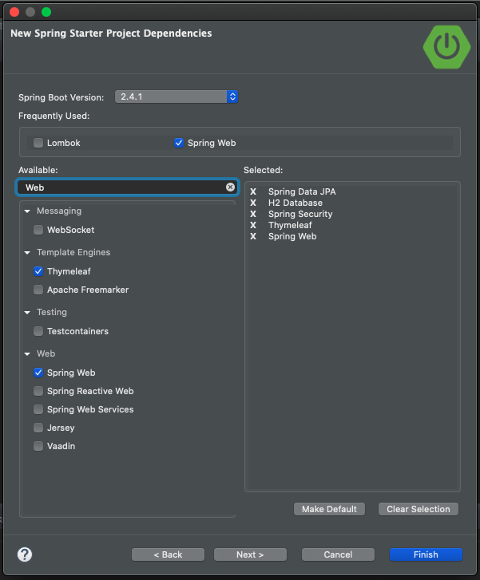


`pom.xml`

```html
<?xml version="1.0" encoding="UTF-8"?>
<project xmlns="http://maven.apache.org/POM/4.0.0" xmlns:xsi="http://www.w3.org/2001/XMLSchema-instance"
	xsi:schemaLocation="http://maven.apache.org/POM/4.0.0 https://maven.apache.org/xsd/maven-4.0.0.xsd">
	<modelVersion>4.0.0</modelVersion>
	<parent>
		<groupId>org.springframework.boot</groupId>
		<artifactId>spring-boot-starter-parent</artifactId>
		<version>2.4.1</version>
		<relativePath/> <!-- lookup parent from repository -->
	</parent>
	<groupId>com.openwebinars</groupId>
	<artifactId>142-01-Estructura</artifactId>
	<version>0.0.1-SNAPSHOT</version>
	<name>142-01-Estructura</name>
	<description>Ejemplo de estructura de un proyecto web con Spring</description>

	<properties>
		<java.version>11</java.version>
	</properties>

	<dependencies>
		<dependency>
			<groupId>org.springframework.boot</groupId>
			<artifactId>spring-boot-starter-data-jpa</artifactId>
		</dependency>
		<dependency>
			<groupId>org.springframework.boot</groupId>
			<artifactId>spring-boot-starter-security</artifactId>
		</dependency>
		<dependency>
			<groupId>org.springframework.boot</groupId>
			<artifactId>spring-boot-starter-thymeleaf</artifactId>
		</dependency>
		<dependency>
			<groupId>org.springframework.boot</groupId>
			<artifactId>spring-boot-starter-web</artifactId>
		</dependency>
		<dependency>
			<groupId>org.thymeleaf.extras</groupId>
			<artifactId>thymeleaf-extras-springsecurity5</artifactId>
		</dependency>

		<dependency>
			<groupId>com.h2database</groupId>
			<artifactId>h2</artifactId>
			<scope>runtime</scope>
		</dependency>
		<dependency>
			<groupId>org.springframework.boot</groupId>
			<artifactId>spring-boot-starter-test</artifactId>
			<scope>test</scope>
		</dependency>
		<dependency>
			<groupId>org.springframework.security</groupId>
			<artifactId>spring-security-test</artifactId>
			<scope>test</scope>
		</dependency>
	</dependencies>

	<build>
		<plugins>
			<plugin>
				<groupId>org.springframework.boot</groupId>
				<artifactId>spring-boot-maven-plugin</artifactId>
			</plugin>
		</plugins>
	</build>

</project>
```


La debemos anotar con `@Controller`

```java
package com.openwebinars.spring.controladores;

import org.springframework.stereotype.Controller;

@Controller
public class UnControlador {

}
```


La debemos anotar con `@Controller`

```java
package com.openwebinars.spring.entidades;

import javax.persistence.Entity;

@Entity
public class UnaEntidad {

}
```

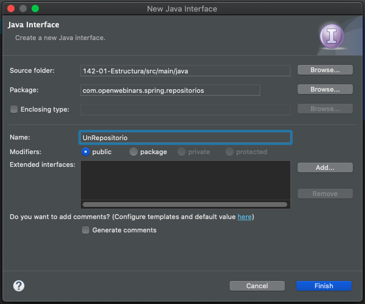

```java
package com.openwebinars.spring.repositorios;

import org.springframework.data.repository.CrudRepository;

import com.openwebinars.spring.entidades.UnaEntidad;

public interface UnRepositorio extends CrudRepository<UnaEntidad, Long>{

}
```


La debemos anotar con `@Service`

```java
package com.openwebinars.spring.servicios;

import org.springframework.stereotype.Service;

@Service
public class UnServicio {

}
```

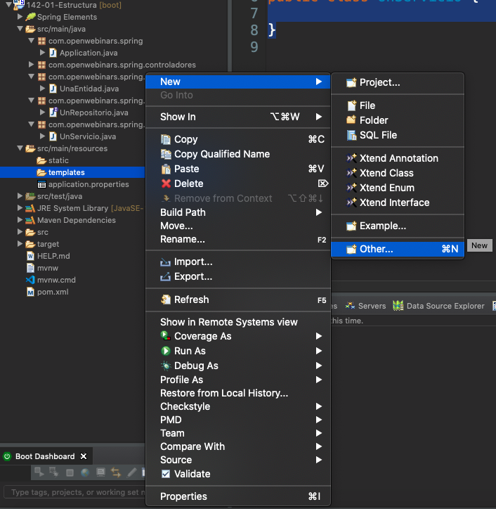


```html
<!DOCTYPE html>
<html>
<head>
<meta charset="UTF-8">
<title>Insert title here</title>
</head>
<body>

</body>
</html>
```

Para que sea una plantilla Thymeleaf hay que añadir `xlmns:th="http://www.thymeleaf.org"`

```html
<!DOCTYPE html>
<html xlmns:th="http://www.thymeleaf.org">
<head>
<meta charset="UTF-8">
<title>Insert title here</title>
</head>
<body>

</body>
</html>
```


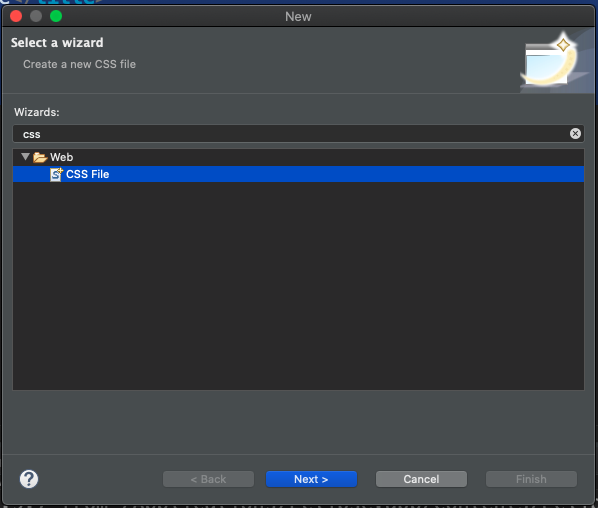
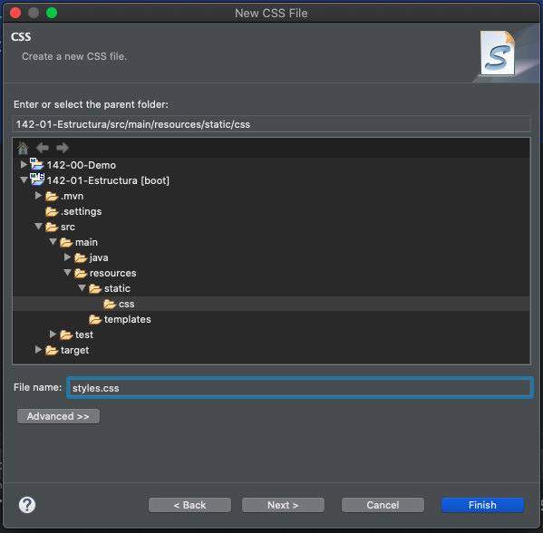
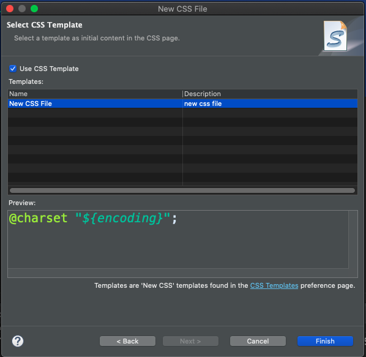

```html
@charset "UTF-8";
```

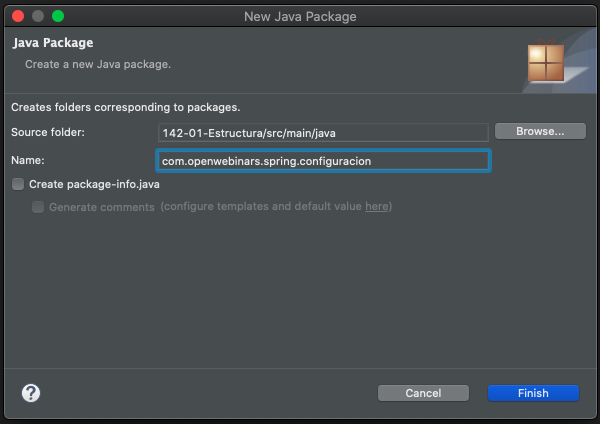

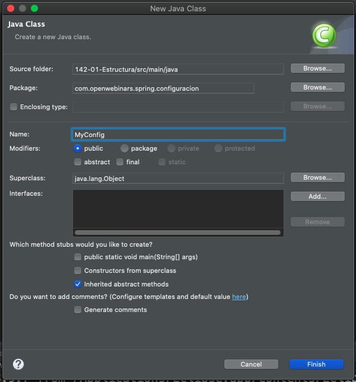

La debemos anotar con `@Configuration`

```java
package com.openwebinars.spring.configuracion;

import org.springframework.context.annotation.Configuration;

@Configuration
public class MyConfig {

}
```


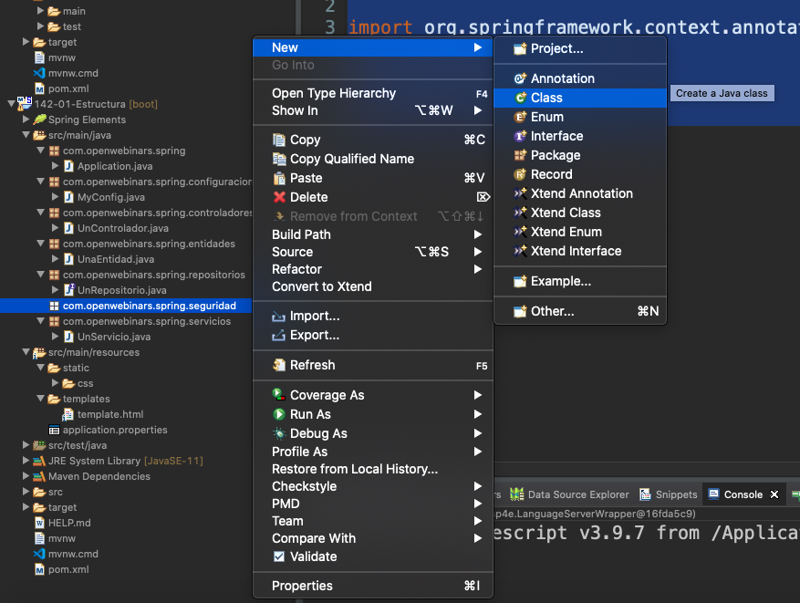


La debemos anotar con `@Configuration` y `@EnableWebSecurity` y debe extender `WebSecurityConfigurerAdapter` 

```java
package com.openwebinars.spring.seguridad;

import org.springframework.context.annotation.Configuration;
import org.springframework.security.config.annotation.web.configuration.EnableWebSecurity;
import org.springframework.security.config.annotation.web.configuration.WebSecurityConfigurerAdapter;

@Configuration
@EnableWebSecurity
public class ConfiguracionSeguridad extends WebSecurityConfigurerAdapter{

}
```

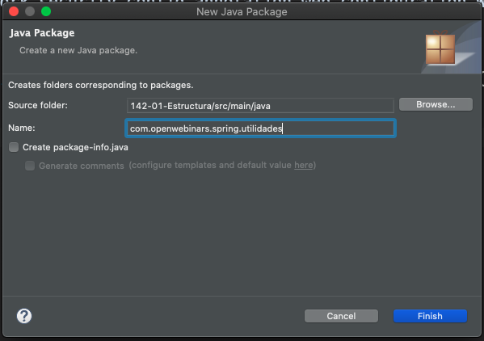


```java
package com.openwebinars.spring.utilidades;

public class Utils {

}
```

# 12 Conceptos de Java EE 12:25 

[PDF Estructura_de_un_proyecto_web_.pdf](pdfs/11._Conceptos_de_Java_EE_necesarios.pdf)

## Resumen Profesor

No existe.

## Transcripción

Hola a todos vamos a conocer esos conceptos de Java EE que quedan en la órbita de la aplicación spring y que sería bueno que bueno Carmelo supiésemos que son en qué consisten y para qué sirven para qué es bueno cuando los utilice nuestra aplicación o lo tengamos que programarnos otro explícitamente lo sepamos hace podríamos decir que una aplicación web con Spring en bici no deja de ser una aplicación Web Java por tanto es necesario que conozcamos algunos conceptos de este modelo de programación de Java para el desarrollo de nuestra aplicaciones con este el primer concepto es el concepto de servlet conserved es una clase que nos permite gestionar peticiones y respuestas de una aplicación servidora se puede utilizar en más contento el contexto web que el contexto de un servidor HTTP pero usualmente se suele asociar a HTTP vale un ejemplo de servidor que es capaz de contener servlet vale que la digamos que la notación la manera buena de decirlo sería Tomcat vale que no solamente es un servidor web y no qué es un servidor web especial que es capaz de procesar código Java en este caso bueno pues serle que son unas clases que tienen una estructura especial y que normalmente suelen tener los métodos Alejo duque tubos vale que atienden a la piscinita a los distintos verbos Servef por norma vale por norma general solamente atenderá a una sola URL y si bien tenemos desde la última versión en la anotación@webservlet lo usual es que tengamos o daños lo teníamos que configurar dentro de un descriptor llamado web.xml y que lo veremos más adelante vale tenemos que indicar oye que aquí tenemos un servlet en la ruta de esta clase que lo queremos matear esta ruta del concepto de nuestra aplicación y eso era bastante tediosa de hecho aquí tenemos por si le queremos echar un vistazo el ácido de HTTP servlet lo que sería un servlet de HTTP que vemos que tiene bueno por la extracción de los métodos que estuvo tu celeste y algunos métodos más que serían los métodos que nos permitirían y os dais cuenta aquí recibir otro objeto el servlet request en definitiva la petición que se nos ha realizado que no llega a este servlet y el método o sea y el objeto HTTP servlet response que sería el que nosotros emite iríamos como respuesta a la petición que hemos recibido como veis te digo todo parece directamente precario a la hora de programar no porque si volvemos al código que tenemos de ejemplo veríamos además que aquí no estamos redirigiendo en modo alguno una plantilla sino que además lo que tenemos disponible en el servlet es entre otras cosas un flujo de salida donde nosotros escribiríamos directamente y ahí tendríamos que meter nuestro código html digo que ciertamente precario y es verdad que se puede programar de otra manera con los Hércules no pero inicialmente su idea a la hora de surgir era la de programar la de esta manera otro elemento que vamos a tener son los descriptores de despliegue el descriptor de despliegue conocido como web.xml que un fichero que nos indica cómo desplegar en el servidor los distintos componentes de la aplicación entre otros los serbios bueno un formato XML con lo cual será sumamente vergonzoso y se suele ubicar en una ruta específica llamada weavings vale y ahí se suele meter en el fichero web.xml es aquí


De un ejemplo de un Web XML dónde podemos ver que ya solo la etiqueta de encabezado enorme dependiendo pues diferentes localizaciones de esquemas versiones espacio de nombres etc y como para definir un ser le teníamos que añadir bueno pues el nombre del servlet con la clase y después asociar al nombre del servlet el patrón de URL con lo cual ya teníamos asociada y se patrón de URL con la clase que hemos programado antes ya digo que todo un poco tedioso sobre todo de configurar servlet web.xml nos queda un concepto que es el de los filtros filtro permite transformar una petición vale sobre todo también podríamos trabajar sobre sobre otro elemento pero transformar una petición de alguna manera una petición HTTP nos permiten por tanto además de transformarlo alterar el circuito normal de lo que sería la petición desde que sale desde nuestro navegador hasta que llega el servidor modificando bueno pues el comportamiento que va a tener por el camino por ejemplo podríamos añadir un filtro que procesará todos los caracteres que se encuentre y le aplicará la codificación UTF-8 para tener una codificación unificada y que no tuviéramos problema en ese sentido o problema por ejemplo podríamos añadir un filtro que solo la única y exclusivamente si la petición trae una cabecera específica pues permitirá acceder a un recurso o un conjunto de recurso está protegido vale de esa manera si esa petición no trae el encabezado bueno pues ser de dirigiría hacia otra respuesta distinta más adecuada no por ejemplo también se suelen utilizar cuando queremos delimitar el acceso a una aplicación a una determinada hora imaginaros que queréis poner que de las 11 a las 12 de la noche te quiere parar una aplicación para que se puedan aplicar los cambios se pueden subir los cambios a servidor vale aplicar parche seguridad mantenimiento es definitiva bueno pues lo podríamos hacer directamente a través de un servlet vale podríamos ver dónde un filtro dónde tuviéramos que si la hora de la petición no está en el rango de cuadros pues no pudiéramos dejar le pasa serán algunos ejemplos de filtro aquí tenemos el código de lo que sería un filtro que ya digo que recoge una petición también tiene la respuesta por si tiene que reenviar nos a otro sitio este no sería un filtro de autenticación y además los filtro decir porque se veía en este gráfico se pueden encadenar y es que después de un filtro puede venir otro y puede venir otro y otro más de hecho lo comprobaremos en nuestras aplicaciones de Spring o no solamente por defecto por crear una aplicación web con Spring boot ya hay 34 incluso 5 filtros por ahí funcionando todo esto cómo lo usa spring boot bueno los servlets veremos qué qué se utiliza a través del DispatcherServlet qué es la manera que tiene fin de implementar el patrón from controller del cual hablábamos en lecciones anteriores ese DispatcherServlet será el que despache todas las peticiones aunque lo haga delegando en otras clases distintas por ello necesita ser mapeado bien a través de un descriptor de despliegue o a través de configuración Java config si bien si usamos print but no es necesario ya que él se encarga de la configuración


Tuviéramos que hacer nosotros manualmente tendríamos que hacerlo de la manera que nos indica por aquí la documentación de Spring no esta sería la forma de hacerlo con Java confit donde nosotros registre haríamos de forma dinámica este DispatcherServlet medio cancerul en especial o si creáramos un web.xml un descriptor de despliegue vale porque nos guste más el estilo XML lo haríamos de esta manera y esto sería este servlet especial vale que se va a encargar de despachar de atender todas las peticiones cómo vemos algo que bueno spring boot va a hacer por nosotros y que francamente va a hacer como en el tema de los contextos una aplicación spring ya sabemos del curso de 5 horas que necesita un contexto donde bueno poder ejecutarse porque es donde va a recibir el contenedor de inversión de control para la aplicaciones normales teníamos applicationcontext para la aplicación en tenemos una interfaz que lo entiende que es web application context bueno pues esto normalmente se suele configura a través de los diferentes elementos de configuración y podríamos separar el hecho de tener a un web API qué es un Web Application context raíz y tener otro que pudieran contener otros objetos de manera que tendríamos dos contenedores distintos donde tendríamos conjuntos de Pink diferente nosotros trabajaremos en lugar de como indica el esquema del gráfico trabajaremos solamente con un solo WebApplicationContext que será el rey el root y que contendrá todos los centros pero si quisiéramos y amigos lo podríamos separar vale y tradicionalmente algunas personas han trabajado de esta manera creando dos dos tipos de configuración diferentes por otro lado también tenemos que algunos pins especiales que van a colaborar con el DispatcherServlet vale y que necesitaríamos configurar si no es por el facebook no como Scarlett mapping y el Hamlet adapter que van a hacer los que se encarguen de hacer el mapeo de las peticiones a los métodos del controlador o también tenemos otros muy importante como el mío resolver qué es el que va a ser capaz de decir a partir de un nombre de una vista la vista en si el recurso de la vista vale asociado con la que después renderizar la respuesta ya digo que spring va a necesitar estos elementos y spring boot nos va a aportar una serie de configuraciones por defecto que nos van a funcionar muy bien por ejemplo sin spring boot tendríamos que hacer este código manualmente no para poder configurar nuestro DispatcherServlet lo tendríamos que indicar y ya no hemos visto vale tendríamos que añadir también está extensión para definir los contextos de esta manera estamos diciendo que bueno que solamente vamos a tener un contexto donde los vamos a almacenar todo no y tendríamos que indicarlo también y por último además tendríamos que bueno pues añadir los inicializadores de los filtros que vamos a utilizar todo esto lo teníamos que hacer nosotros manualmente y sin embargo usando spring boot vamos a darnos cuenta como bueno pues la configuración de el contexto en la creación y configuración del DispatcherServlet la generación de filtros todo va a ser francamente Salzillo conecto conocemos los elementos dejaba eh aunque sea a vista de pájaro que vamos a necesitar a partir del tema de viene desde la lección siguiente perdón nos lanzamos de lleno al código y vamos a empezar trabajando con los primeros controladores


# 13 Controladores 21:04 

[PDF Controladores.pdf](pdfs/12._Controladores.pdf)

## Resumen Profesor

### Patrones en la URI

Las peticiones que se mapean a métodos pueden utilizar una expresión `glob`) que incluya caracteres comodín:

* `?` equivale a un carácter cualquiera
* `*` equivale a cero o más caracteres dentro de un segmento del path
* `**` equivale a cero o más segmentos del path

Se entiende por un segmento del path a lo que se contiene entre dos `/`.

### Mapeo de más de una URI a un controlador

La anotación `@RequestMapping` y sus derivadas (`@GetMapping`, `@PostMapping`, ...) pueden recibir más de una ruta como argumento. Lo hacen recibiendo varias entre `{ }`.

```java
@GetMapping({"/", "/index", "/list"})
```

De esta forma, tanto si invocamos a `/`, como a `/index` o `/list`, todas las llamadas se harán al mismo método.

### Uso de `@RequestMapping`

Esta es la anotación *original* para mapear cualquier tipo de verbo HTTP con un método.

De hecho, podríamos sustituir este código:

```java
@GetMapping("/")
public String welcome(@RequestParam(name="name", required=false, defaultValue="Mundo") String name, Model model)
```

por este otro

```java
@RequestMapping(value="/", method=RequestMethod.GET)
public String welcome(@RequestParam(name="name", required=false, defaultValue="Mundo") String name, Model model)
```

Podemos utilizar también la anotación `@RequestMapping` para definir un segmento de ruta a nivel de controlador, de forma que:

```java
@Controller
@RequestMapping("/app")
public class MainController {
    @GetMapping("/")
    public String welcome(@RequestParam(name="name", required=false, defaultValue="Mundo") String name, Model model) {
        model.addAttribute("nombre", name);
        return "index";
    }
}
```

La ruta para invocar el controlador `welcome` sería `http://localhost:8080/app/`. Si añadimos más métodos de controlador a esta clase controladora, la ruta `app` afectaría a todos los métodos.

### Argumentos de un método del controlador

Tipo de dato | Descripción
-------------|-------------
`WebRequest`, `NativeWebRequest`|	Acceso genérico a los parámetros de la petición o los atributos de sesión, sin usar el API Servlet
`javax.servlet.ServletRequest`, `javax.servlet.ServletResponse` |	Acceso directo a la petición o respuesta. Se pueden utilizar los subtipos `ServletRequest`, `HttpServletRequest`, `MultipartRequest`, `MultipartHttpServletRequest`.
`javax.servlet.http.HttpSession` | Fuerza la presencia de una sesión, con lo que nunca será nulo. ¡Cuidado! ya que el acceso no es *thread-safe*.
`javax.servlet.http.PushBuilder` | Push Builder (Servlet 4.0) para realizar el push de recursos para el protocolo HTTP/2.
`java.security.Principal` | Usuario actualmente autenticado.
`HttpMethod` | Método (verbo) HTTP de la petición.
`java.util.Locale` | Locale actual de la petición.
`java.util.TimeZone` + `java.time.ZoneId` | Zona horaria asociada a la petición.
`java.io.InputStream`, `java.io.Reader` | Permite acceder a la petición en crudo.
`java.io.OutputStream`, `java.io.Writer` | Permite producir la respuesta en crudo.
`@PathVariable` | Permite acceder a variables presentes en la URI.
`@MatrixVariable` | Acceso a los pares nombre-valor presentes en la URI.
`@RequestParam` | Acceso a los parámetros de la petición, incluidos ficheros multipartes.
`@RequestHeader` | Acceso a los encabezados de la petición.
`@CookieValue` | Acceso a las cookies.
`@RequestBody` | Acceso al cuerpo de la petición HTTP. El cuerpo es convertido según la implementación del `HttpMessageConverter` configurado.
`@HttpEntity<B>` | Acceso a los encabezados y cuerpo de la petición.
`@RequestPart` | Acceso a una parte de una petición `multipart/form-data`.
`java.util.Map`, `org.springframework.ui.Model`, `org.springframework.ui.ModelMap` | Acceso al modelo que es expuesto a las plantillas para el renderizado de vistas.
`RedirectAttributes` | Especifica atributos en caso de redirección.
`@ModelAttribute` | Para acceder a algún atributo existente en el modelo, con conexión de datos y validación aplicada.
`Error`, `BindingResult`| Para acceder a los errores de validación y la conexión de datos de un *command object*, o los errores de validación de un objeto `@RequestBody`.
`SessionStatus` + `@SessionAttributes` | Marca el procesamiento de un formulario completo, que activa la limpieza de atributos de sesión declarados a través de `@SessionAttributes`.
`@RequestAttribute` | Acceso a los atributos de la petición.

Aquellas anotacines que permitan el uso de atributo `required`, podrán ser utilizadas junto con `java.util.Optional` de Java 8.

Fuente: https://docs.spring.io/spring/docs/current/spring-framework-reference/web.html#mvc-ann-arguments

### Tipos de retorno

Tipo de dato | Descripción
-------------|------------
`@ResponseBody` | El valor se convierte según el `HttpMessageConverter` configurado.
`HttpEntity<B>`, `ResponseEntity<B>` | Se devuelve la respuesta completa, incluyendo encabezados y cuerpo.
`HttpHeaders` |	Para devolver una respuesta con encabezados y cuerpo vacío.
`String` | Es el más usual en las últimas versiones de Spring. Se trata del nombre de la plantilla, que será resuelto por el `ViewResolver` configurado.
`View` | Una instancia de `View` que se usará para renderizar junto con el modelo.
`java.util.Map`, `org.springframework.ui.Model`	| Atributos para ser añadidos al modelo.
`@ModelAttribute` | Atributo para ser añadido al modelo.
`ModelAndView`| Vista y modelo de forma conjunta.
`void` | Si devuelve `void`, se entiende que se ha manejado la respuesta a través de `ServletResponse`, `OutputStream` o una anotación `@ResponseStatus`.

Puede revisar la lista completa en la fuente.

Fuente: https://docs.spring.io/spring/docs/current/spring-framework-reference/web.html#mvc-ann-return-types

## Transcripción

Hola a todos mano a la obra que vamos a empezar con la primera aplicación web de verdad porque comenzamos viendo los controladores si recordáis el controlador en la clase que se va a encargar de atender peticiones vale va a delegar en el procesamiento de ella en bueno en el modelo normalmente dónde se puede aplicar alguna serie de servicio y a partir de ahí rescatar algunos datos que enviaremos la vista no pero digamos que el controlador es el primero que recibe el balón vale pues vamos a ver cómo se crea un controlador la ventaja tremenda con respecto a otros primos y es que el controlador puede ser una clase Pojo Java es decir una clase de las de toda la vida pollo significa o son las siglas de Playmobil javadocs es decir de una de un objeto Java vale totalmente plano es decir que no tiene que heredar de nadie ni tiene que entender a nadie frente a otro modelo de trabajo donde si se nos obliga a que clase sobre privados métodos no aquí no vamos a tener las manos atadas y esto puede ser una clase cualquiera que va a tener solamente la cosa de estar anotada con arroba controles a partir de ahí los métodos veremos que tienen que estar anotado para que podamos hacer el mapeo de bueno una ruta determinada con un método determinado para saber que cuando escribamos en el navegador algo vamos a procesar este algo la petición que se haga la vamos a procesar en ese método hasta la versión 43 y lo digo de memoria si no mal recuerdo teníamos disponible siempre la anotación request mapping genérica que recibía la URL y el método HTTP con el cual al cual había que estar atento no igual se estaba la palabra suele ser escucha desde la versión 43 tenemos disponible una anotaciones derivadas que no evitan tener que poner el método ya que lo ponemos en la propia anotación no que es más peticiones que os más peticiones post y así sucesivamente vamos a crear nuestro primer controlador vale lo vamos a hacer a través de un nuevo proyecto vamos a crear un nuevo proyecto


### :computer: `142-02-Controladores`
#### Ejemplo de creación de controladores


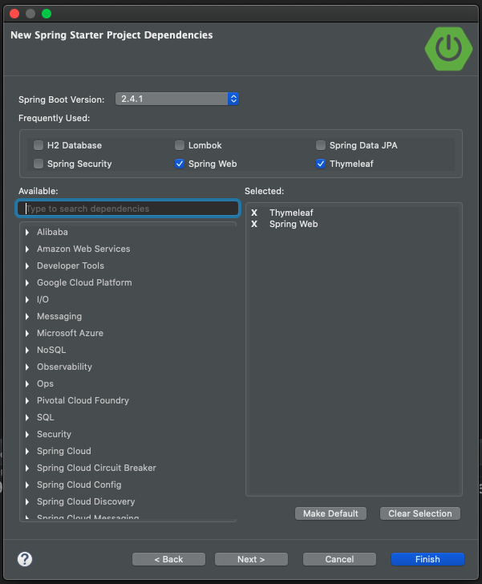
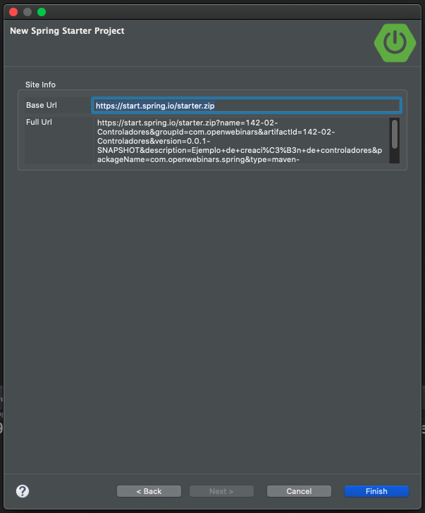

#### Cambiar el Puerto

```txt
server.port=9000
```

#### Crear `MainController` 


Lo anotamos con `@Controller`

Añadimos método `welcome()`

```java
@Controller
public class MainController {
	
   @GetMapping("/")
   public String welcome() {
      return "index";
   }

}
```

#### Crear Plantilla


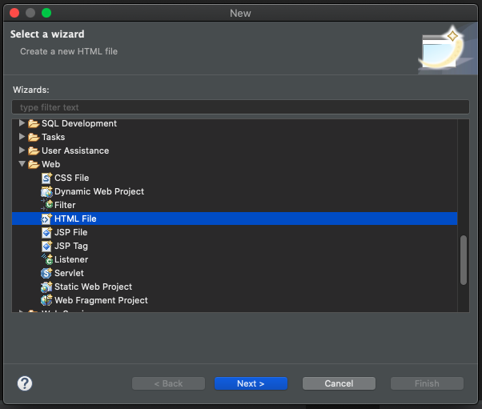


Para que sea una plantilla Thymeleaf hay que añadir `xlmns:th="http://www.thymeleaf.org"`

```html
<!DOCTYPE html>
<html xlmns:th="http://www.thymeleaf.org">
<head>
<meta charset="UTF-8">
<title>Insert title here</title>
</head>
<body>
   <h1>Hola Mundo!!!</h1>
</body>
</html>
```

#### Ejecutar la Aplicación


Escribir localhost 9000 y ponerle una barra signifiquen lo mismo de hecho si nosotros se la ponemos posiblemente el navegador la limpie qué es lo que ha sucedido por aquí veamos no bueno por aquí vale vemos que tenemos la clase pollo anotada con arroba controles 10 la manera que tenemos de definir que eso es un controlador y además es un proyecto web pues será un controlador web la notación que va a indicar que este método se invoca cuando se produce una petición que las peticiones que se producen cuando escribimos en el navegador una dirección URL de un recurso suelen ser que vale siempre lo que viene a continuación entre paréntesis es la ruta que está escuchando que en este caso sería la ruta raíz con lo cual cuando se recibe una petición que a esa ruta spring va invocar directamente cemento el nombre del método como decía puede ser cualquiera y no tiene porqué recibir parámetro aunque veremos que será conveniente en la mayoría de los contextos por último y por simplificar veremos que el método devuelve un stream que va a hacer la ruta de la plantilla dentro de la carpeta configurada qué es la carpeta temple sin la extensión sin el sufijo HTML Como habéis comprobado el nombre del fichero era index HTML bueno nosotros hemos puesto solamente index aquí para poder atenderlo y ahora nosotros quisiéramos enviar algún tipo de dato a la vista lo haríamos a través de la clase módem la clase Model es un map que nos permite guardar estructuras clave-valor y con la cual nosotros vamos a poder pasarle al contexto de la vista una serie de objeto identificado vale aquí tenemos la estructura del código que vamos a hacer nosotros si nos venimos aquí podemos ver cómo podemos pasarle en nuestro controlador voy a comentar este porque lo voy a escribir de nuevo para que lo veáis bueno podemos reutilizar este mismo en esta misma ruta welcome ballet podríamos incluir aquí el objeto model vale como podéis comprobar este model es propio spring y bueno pues tiene una serie de métodos adecuados vale tiene una serie de métodos adecuados para que nosotros podamos añadir un atributo con un nombre vamos a mandar un mensaje tuyo valor sea fue

#### Cambios en el Controlador para Enviar Datos a la Vista

```java
@Controller
public class MainController {
	
   @GetMapping("/")
   public String welcome(Model model) {
      model.addAttribute("mensaje", "¡Hola a todos los alumnos de OpenWebinars!");
   }

}
```

#### Cambios en la Vista para Recibir Datos desde el Controlador

```html
<!DOCTYPE html>
<html xlmns:th="http://www.thymeleaf.org">
<head>
<meta charset="UTF-8">
<title>Insert title here</title>
</head>
<body>
   <h1 th:text="${mensaje}">Hola Mundo!!!</h1>
</body>
</html>
```

#### Ejecutar la Aplicación


Vale y si nos venimos a nuestro navegador si refrescamos vemos que el mensaje ha cambiado si nosotros cambiáramos este mensaje también estaríamos cambiando lo que va a recibir aquí en la plantilla como podéis comprobar francamente estoy bastante potente ya digo que este móvil es el objeto que podemos utilizar si bien también tenemos otra clase modelmap vale que nos aporta Model es un interfaz model Maps una clase que nos aporta la llamada encadenada métodos podríamos llamar simplemente a y después otra vez a en un estilo que suele ser muy habitual últimamente y podríamos utilizar indistintamente las dos ya también veremos y usaremos la anotación arroba modelattribute que nos permite definir un método entre otros elementos un método que devuelva un objeto y guardar este objeto en el modelo de un controlador para que lo podamos usar siempre lo haremos sobre todo en el proyecto de ejemplo cómo posible argumentos que hemos visto que podía recibir el método del controlador teníamos no solamente modelo modelmap y no modelattribute el controlador también puede recoger una clase que esté anotada con Rico es body y así podremos recoger el cuerpo de la petición Thomann bajo nivel nos permitiría acceder a a la entidad HTTP de la petición con HTTP entity y como respuesta vale nosotros usaremos siempre un string o mejor dicho casi siempre porque es lo más usual últimamente en la última versiones de Spring y en el código de ejemplo que encontré de los últimos años ya que a través del Bio resolver que nosotros configuramos automáticamente con Spring boot y añadiendo same live pues es más sencillo que devolvamos el nombre de la plantilla y el resolver pues encargue de resolver es el nombre con un recurso en particular que vaya a utilizar si bien bueno pues hay otro esquemas de trabajo cómo cómo podemos ver otra manera sería devolver un responsebody y cualquier tipo de dato esto se suele utilizar en otros contextos sobre todo en el caso de las APIs donde el valor se convierte y el de vuelta en el cuerpo de la respuesta vale se convierte a través del conversor que esté configurado también podemos devolver una entera completa devolver un modelo envío vale donde se devuelve el modelo y David en un solo objeto que en la manera que se venía de trabajar antes y que podía encontrar también en la literatura o en ejemplos que sean más antiguos hasta ahora hemos hecho un controlador que tenía un solo método podemos hacer un controlador que tengan más de un método sin la única restricción que vamos a tener es que escuchen ruta diferente y que además no se llama igual como podría tener una restricción de cualquier clase imaginaos que tenemos una plantilla saludo igual que la plantilla que tenemos ahora que esa plantilla saludo espera un mensaje de saludo y que se saludo que habrá dicho antes bueno que como el que hemos estante pues puede hacer seguro que has visto otras plataformas con miles de curso pero no tengo evinar vale pues te ofrecemos otro elemento vamos a ver cómo podríamos crearlo nos vendríamos a nuestros main controller y tendremos crear bueno fue otro método que hemos visto que íbamos a llamar saludo vale anotado con getmapping

#### Modificar el Controlador

```java
@Controller
public class MainController {
	
   @GetMapping("/")
   public String welcome(Model model) {
      model.addAttribute("mensaje", "¡Hola a todos los alumnos de OpenWebinars!");
      return "index";
   }
	
   @GetMapping("/saludo")
   public String saludo(Model model) {
      model.addAttribute("saludo", "Seguro que has visto otras plataformas con miles de cursos, pero en OpenWebinars nos centramos en IT. Como profesional tecnológico debes estar al día en las tecnologías más demandadas y OpenWebinars es la solución.");
      return "saludo";
   }

}
```

#### Añadir Vista `saludo.html`

```html
<!DOCTYPE html>
<html xlmns:th="http://www.thymeleaf.org">
<head>
<meta charset="UTF-8">
<title>Saludo</title>
</head>
<body>
   <h1 th:text="${saludo}">Hola Mundo!!!</h1>
</body>
</html>
```

#### Ejecutar la Aplicación

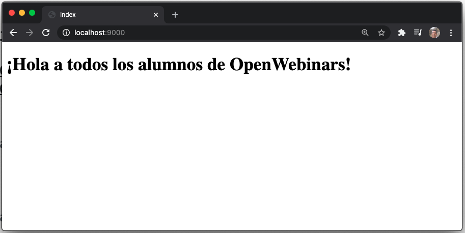
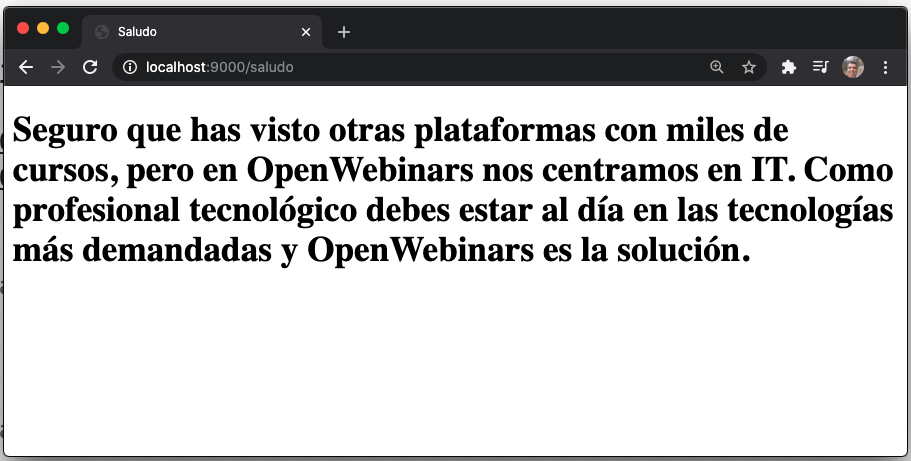


Lanzada tendríamos por aquí que sigue devolviendo no están en la ruta raíz y en saludo vale lo vamos a quitar algo de eso o lo podríamos poner al 100% seguro que has visto otras plataformas con miles de cursos pero no tengo evina nos enteramos emite como profesional tecnológico de ver estar al día en las tecnologías más demandadas yo tengo vida en la solución sería un mensaje que podríamos incluir de saludo en nuestra aplicación como podemos comprobar hemos podido tener en un solo controlador dos métodos diferentes que atienden a dos rutas distintas y que bueno fue terminan renderizando en en dos plantillas diferentes vale con lo cual estoy francamente cómodo en la mayoría de las lesiones que veremos de ahora en adelante os pondré alguna pequeña práctica que en principio no tendréis resuelta y que servirá como acicate vale como reto para que vosotros podáis practicar pasa aplicaron la primera que se está que tenemos aquí imagino que lo encarga en una web que podríamos llamar clásica la web clásica son aquellas que los pequeños negocios con el bueno el boom de las conexiones Internet empezaron a solicitar con el devenir del siglo 21 final del siglo 20 de venir del siglo 21 y en torno al año 2002 mil algo había muchos pequeños negocios que se pirran por poder tener presencia en Internet no esas web era muy sencilla y solían incluir una portada dónde se pone información sobre la organización vale lo que podríamos llamar el quiénes somos otro apartado con el que hacemos o que vendemos y la información de contacto con donde estamos e información de contacto pues yo ánimo a que crees un nuevo proyecto añadiendo los starters de Wendy de finding que creéis un controlador con tres métodos para que atienda la ruta raíz que y contacto que creéis tres plantillas vale de qué y contacto y que podáis pasar el contenido de esas plantillas a través de un objeto model vale podéis recurrir si queréis por ejemplo algún tipo de plantilla ya prevenida dvisual bonita que haya por ahí y te la tarde encajarlo vale si bien o aviso de que si tiene algunos recursos javascript css a lo mejor tenía alguna pequeña dificultad al principio vale si no puede ser algo normal algo normal perdón pero que podáis encajar un controlador con tres métodos tres plantillas distinta y os podéis pelear un poco os recuerdo que para pasar los datos ala vista tendríamos que tener controlado easy y mediante atribut iríamos añadir elemento a nuestra plantilla hasta aquí el capítulo de los controladores en los siguientes capítulos empecemos trabajando con vista y mejorando nuestros controladores para que sea más potente

# 14 Vistas 14:10 

[PDF Vistas.pdf](pdfs/13._Vistas.pdf)

## Resumen Profesor

### Cargar una vista vs. Redirigir a otro controlador

Como hemos visto, la forma más sencilla de que un controlador nos lleve a una vista es devolviendo el nombre de la plantilla a renderizar como un `String`:

```java
@GetMapping("/")
public String welcome(Model model) {
    model.addAttribute("mensaje", "¡Hola a todos!");
    return "index";
}
```

Sin embargo, habrá ocasiones en las que nos interes que un controlador nos lleve directamente a otro. Un escenario típico es, tras haber procesado un formulario (por ejemplo, de inserción de un nuevo registro); posiblemente, después de procesar esa petición, queramos visualizar el listado completo de registros, y así comprobar que el nuevo registro ha sido insertado.

Para poder hacer una redirección, incluimos la palabra `redirect:` en el valor de retorno del método, seguido de la ruta del controlador al cual queremos redirigirnos.

```java
@PostMapping("/empleado/new/submit")
public String nuevoEmpleadoSubmit(@ModelAttribute("empleadoForm") Empleado nuevoEmpleado) {
    servicio.add(nuevoEmpleado);
    return "redirect:/empleado/list";
}
```

## Transcripción


```java

```

```java

```

```java

```

```java

```

```java

```

```java

```

# 15 @RequestParam 12:42 

[PDF RequestParam_y_PathVariable_.pdf](pdfs/14._RequestParam_y_PathVariable_.pdf)

## Resumen Profesor

### `@PathVariable` y `@RequestMapping`

Podemos declarar variables en el path a nivel de método y a nivel de clase (haciendo uso de `@RequestMapping`):

```java
@Controller
@RequestMapping("/owners/{ownerId}")
public class OwnerController {

    @GetMapping("/pets")
    public Pet findAll(@PathVariable Long ownerId) {
        // ...
    }

    @GetMapping("/pets/{petId}")
    public Pet findPet(@PathVariable Long ownerId, @PathVariable Long petId) {
        // ...
    }
}
```

De esta forma, necesitaríamos inyectar la variable a través de `@PathVariable` en cada método.

## Transcripción

# 16 @PathVariable 4:30 

[PDF RequestParam_y_PathVariable_.pdf](pdfs/14._RequestParam_y_PathVariable_.pdf)

## Resumen Profesor

No existe.

## Transcripción

# 17 Recursos estáticos 10:33 

[PDF Contenido_estático.pdf](pdfs/15._Contenido_estático.pdf)

## Resumen Profesor

No existe.

## Transcripción

# 18 WebJars 11:33 

## Resumen Profesor

### Dependencias maven más utilizadas

Tan solo cambiando la versión, podemos tener diferentes versiones de bootstrap, jquery, o la librería que estemos vinculando.

```html
<dependency>
    <groupId>org.webjars</groupId>
    <artifactId>bootstrap</artifactId>
    <version>3.3.7-1</version>
</dependency>
 
<dependency>
    <groupId>org.webjars</groupId>
    <artifactId>jquery</artifactId>
    <version>3.3.1-1</version>
</dependency>
 
<dependency>
    <groupId>org.webjars</groupId>
    <artifactId>webjars-locator</artifactId>
    <version>0.34</version>
</dependency>
```

## Transcripción

# 19 Creación de formularios 20:54 

[PDF Formularios.pdf](pdfs/16._Formularios.pdf)

[ficheros](pdfs/ficheros.zip)

## Resumen Profesor

### Código utilizado en el ejemplo

#### Clase `Empleado`

```java
public class Empleado {

    private long id;
    private String nombre;
    private String email;
    private String telefono;

    //constructores, getters y setters

}
```

#### Clase `EmpleadoService`

```java
package com.openwebinars.spring.servicios;

import java.util.ArrayList;
import java.util.Arrays;
import java.util.List;

import javax.annotation.PostConstruct;

import org.springframework.stereotype.Service;

import com.openwebinars.spring.modelo.Empleado;

@Service
public class EmpleadoService {

    private List<Empleado> repositorio = new ArrayList<>();


    public Empleado add(Empleado e) {
        repositorio.add(e);
        return e;
    }

    public List<Empleado> findAll() {
        return repositorio;
    }

    @PostConstruct
    public void init() {
        repositorio.addAll(
                Arrays.asList(new Empleado(1,"Antonio García", "antonio.garcia@openwebinars.net", "954000000"),
                        new Empleado(2,"María López", "maria.lopez@openwebinars.net", "954000000"),
                        new Empleado(3,"Ángel Antúnez", "angel.antunez@openwebinars.net", "954000000")                        
                        )
                );
    }

}
```

#### Plantilla `list.html`

```java
<!DOCTYPE html>
<html lang="es" xmlns:th="http://www.thymeleaf.org">
  <head>
    <meta charset="utf-8">
    <meta http-equiv="X-UA-Compatible" content="IE=edge">
    <meta name="viewport" content="width=device-width, initial-scale=1">
    <!-- The above 3 meta tags *must* come first in the head; any other head content must come *after* these tags -->
    <meta name="description" content="">
    <meta name="author" content="">

    <title>Starter Template for Bootstrap</title>

    <!-- Bootstrap core CSS -->
    <link href="/webjars/bootstrap/css/bootstrap.min.css" rel="stylesheet">

    <!-- Custom styles for this template -->
    <link href="/css/starter-template.css" rel="stylesheet">


    <!-- HTML5 shim and Respond.js for IE8 support of HTML5 elements and media queries -->
    <!--[if lt IE 9]>
      <script src="https://oss.maxcdn.com/html5shiv/3.7.3/html5shiv.min.js"></script>
      <script src="https://oss.maxcdn.com/respond/1.4.2/respond.min.js"></script>
    <![endif]-->
  </head>

  <body>

    <nav class="navbar navbar-inverse navbar-fixed-top">
      <div class="container">
        <div class="navbar-header">
          <button type="button" class="navbar-toggle collapsed" data-toggle="collapse" data-target="#navbar" aria-expanded="false" aria-controls="navbar">
            <span class="sr-only">Toggle navigation</span>
            <span class="icon-bar"></span>
            <span class="icon-bar"></span>
            <span class="icon-bar"></span>
          </button>
          <a class="navbar-brand" href="#">Miempresa.com</a>
        </div>
        <div id="navbar" class="collapse navbar-collapse">
          <ul class="nav navbar-nav">
            <li class="active"><a href="#">Inicio</a></li>
            <li><a href="/empleado/new">Nuevo empleado</a></li>
          </ul>
        </div><!--/.nav-collapse -->
      </div>
    </nav>

    <div class="container">

      <div class="starter-template">
        <h1>Listado de empleados de la empresa</h1>
      </div>

    </div><!-- /.container -->


    <!-- Bootstrap core JavaScript
    ================================================== -->
    <!-- Placed at the end of the document so the pages load faster -->
    <script src="/webjars/jquery/jquery.min.js"></script>
    <script src="/webjars/bootstrap/js/bootstrap.min.js"></script>
  </body>
</html>
```

Puedes descargar estos tres ficheros pulsando [aquí](pdfs/ficheros.zip).

## Transcripción

# 20 Formularios de edición 15:31 

[PDF Formularios_Edicion.pdf](pdfs/17._1_Formularios_Edicion.pdf)

## Resumen Profesor

No existe.

## Transcripción

# 21 Validación de datos 21:04 

[PDF Formularios_Validacion.pdf](pdfs/17._2_Formularios_Validacion.pdf)

## Resumen Profesor

### Validación

Spring permite usar el estándar *JSR-303/JSR-380 Bean Validation API*. Spring Boot configura por defecto la implementación de este estándar realizada por *hibernate*.
Permite realizar la validación añadiendo anotaciones en nuestras clases modelo.

### Algunas anotaciones de validación:

* `@NotNull`: el atributo no puede ser nulo
* `@Min`, `@Max`: mayor o igual (o menor o igual) que un valor determinado.
* `@NotEmpty`: el atributo no puede estar vacío (Strings, colecciones, arrays, …)
* `@Email`: el atributo debe ser un email válido.
* `@Size`: el atributo tiene que tener un tamaño según el indicado.

Puedes consultar toda la documentación en https://beanvalidation.org/2.0/spec/#builtinconstraints

### Visualización de errores con Thymeleaf

Thymeleaf nos ofrece algunos elementos para gestionar los errores:

* Algunas funciones del objeto `#fields`: `#fields.hasError(‘...’)` y `#fields.errors(‘...’)`
* Atributos: `th:errors` y `th:errorclass`

Todo esto lo podemos conjugar con el uso de Bootstrap para la visualización de errores:

```html
<div class="form-group"    th:classappend="${#fields.hasErrors('id')} ? 'has-error'">
    <label for="id">ID</label> 
    <input type="text" class="form-control" id="id" placeholder="1"
        th:field="*{id}" th:attrappend="readonly=${empleadoForm.id != 0} ? 'readonly' : null" />
    <span th:if="${#fields.hasErrors('id')}" th:errors="*{id}" class="help-block" id="id-error">Errores</span>
</div>
```

* `th:classappend="${#fields.hasErrors('id')} ? 'has-error'"` nos permite añadir la clase css `has-error`, propia de bootstrap.
* Con `<span th:if="${#fields.hasErrors('id')}" th:errors="*{id}" class="help-block" id="id-error">Errores</span>` añadimos, justo debajo del campo del formulario, el/los mensaje/s de error.

## Transcripción

# 22 Subida de ficheros 8:12 

[PDF Subida_de_ficheros.pdf](pdfs/18._1_Subida_de_ficheros.pdf)

## Resumen Profesor

### Formularios multiparte

Para que un formulario sea capaz de enviar ficheros, debemos cambiar su tipo de codificación a `multipart/form-data`. Ello lo hacemos mediante la propiedad `enctype`.

```html
<form method="post" enctype="multipart/form-data" action="#"
    th:action="${empleadoForm.id != 0} ? @{/empleado/edit/submit} : @{/empleado/new/submit}"
    th:object="${empleadoForm}">
```    

Si queremos adjuntar un fichero al envío del formulario, lo hacemos mediante un campo de tipo `file`

```html
<div class="form-group">
    <label for="file">Avatar</label>
    <input id="filebutton" name="file" class="form-control input-file" type="file">
</div>
```

### Uso de `@ConfigurationProperties`

Podemos inyectar el valor de una propiedad (por ejemplo, declarada en el fichero `application.properties`) a través de la anotación `@Value`

```java
@Value("{prefijo.propiedad}")
private String cadena;
```

En ocasiones, es posible que nos interese encapsular estas propiedades a través de una clase que:

* Nos ofrezca métodos convenientes para obtener el valor de las propiedades
* Nos permita usar la validación de beans para asegurarnos que las propiedades están correctamente inicializadas.

Para ello, podemos crear una clase, que encapsule las propiedades, y que esté anotada con `@ConfigurationProperties`.

```java
@ConfigurationProperties(prefix="storage")
public class StorageProperties {


    private String location = "upload-dir";

    public String getLocation() {
        return location;
    }

    public void setLocation(String location) {
        this.location = location;
    }

}
```

De esta forma, podemos capturar la propiedad `storage.location` que puede ser definida en un fichero de properties.

Para que esto funcione correctamente, tenemos que habilitar dicha clase mediante la anotación `@EnableConfigurationProperties` en una clase `@Configuration` o en la propia `@SpringBootApplication`.

```java
@Configuration
@EnableConfigurationProperties(StorageProperties.class)
public class MyConfig {

    //... contenido de la clase

}
```

### Algunos aspectos de Thymeleaf
#### Operador elvis

En este ejemplo hemos utilizado un operador de Thymeleaf, llamado operador elvis (`?:`), para montar la URL de la imagen del avatar del empleado.

```html

```

Esta expresión significa:

* Si `${empleado.imagen}` es diferente de `null`, devuelve el valor de `${empleado.imagen}`.
* En otro caso, devuelve la cadena de caracteres que viene después de `?:`

Además, en este valor, hemos usado la potencia de Thymeleaf para incluir el email del empleado como una variable en la propia URL.

Si quieres saber más sobre como montar URLs con Thymeleaf, puedes visitar nuestro **Curso de introducción a Thymeleaf**.

## Transcripción

# 23 Servicio de almacenamiento de ficheros 6:16 

[PDF Subida_de_ficheros.pdf](pdfs/18._2_Subida_de_ficheros.pdf)

## Resumen Profesor

No existe.

## Transcripción

# 24 Implementación de la subida de ficheros en nuestro proyecto 22:13 

[PDF Subida_de_ficheros.pdf](pdfs/18._3_Subida_de_ficheros.pdf)

## Resumen Profesor

No existe.

## Transcripción

# 25 Aplicación web segura con Spring Security 13:31 

[PDF Haciendo_una_aplicación_web_segura.pdf](pdfs/19._Haciendo_una_aplicación_web_segura.pdf)

## Resumen Profesor

### Dependencias

La dependencia *starter* de Spring Security es:

```html
<dependency>
    <groupId>org.springframework.boot</groupId>
    <artifactId>spring-boot-starter-security</artifactId>
</dependency>
```

Y la de los extras de Thymeleaf para Spring Security:

```html
<dependency>
    <groupId>org.thymeleaf.extras</groupId>
    <artifactId>thymeleaf-extras-springsecurity5</artifactId>
    <version>3.0.4.RELEASE</version>
</dependency>
```

### Código de la plantilla de login

El formulario de login lo hemos implementado con una de las plantillas de ejemplo de Bootstrap 3. En particular, el que puedes encontrar en https://getbootstrap.com/docs/3.3/examples/signin/.

A continuación tienes el código algo tuneado, y que se utiliza en el proyecto de ejemplo del vídeo:

* CSS: nuevo fichero `src/main/resources/static/css/signin.css`

```css
@charset "UTF-8";

body {
  padding-top: 40px;
  padding-bottom: 40px;
.form-signin {
  background-color: #eee;
}

  max-width: 330px;
.form-signin .form-signin-heading,
  padding: 15px;
  margin: 0 auto;
}
.form-signin .checkbox {
  font-weight: normal;
  margin-bottom: 10px;
}
.form-signin .checkbox {
}
.form-signin .form-control {
     -moz-box-sizing: border-box;
  position: relative;
  height: auto;
  -webkit-box-sizing: border-box;
.form-signin .form-control:focus {
          box-sizing: border-box;
  padding: 10px;
  font-size: 16px;
}
  z-index: 2;
}
  border-bottom-left-radius: 0;
.form-signin input[type="email"] {
  margin-bottom: -1px;
  border-bottom-right-radius: 0;
}
}
.form-signin input[type="password"] {
  margin-bottom: 10px;
  border-top-left-radius: 0;
  border-top-right-radius: 0;
```  

* Nueva plantilla en `/src/main/resources/templates/login.html`

La plantilla está un poco modificada, con las webjars incluidas y eliminando algún elemento que sobraba.

```html
<!DOCTYPE html>
<html lang="es" xmlns:th="http://www.thymeleaf.org">
<head>
<meta charset="utf-8">
<meta http-equiv="X-UA-Compatible" content="IE=edge">
<meta name="viewport" content="width=device-width, initial-scale=1">
<title>Formulario de login</title>
<meta name="description" content="">
<meta name="author" content="">


<!-- Bootstrap core CSS -->
<!-- Custom styles for this template -->
<link href="/webjars/bootstrap/css/bootstrap.min.css" rel="stylesheet">

<link href="/css/signin.css" rel="stylesheet">


      <script src="https://oss.maxcdn.com/html5shiv/3.7.3/html5shiv.min.js"></script>
<!-- HTML5 shim and Respond.js for IE8 support of HTML5 elements and media queries -->
<!--[if lt IE 9]>
      <script src="https://oss.maxcdn.com/respond/1.4.2/respond.min.js"></script>
    <![endif]-->
            <label for="username" class="sr-only">Username</label> <input
</head>

<body>

    <div class="container">

        <form class="form-signin" th:action="@{/login}" method="post">
            <h2 class="form-signin-heading">Por favor, introduzca sus datos</h2>
                for="password" class="sr-only">Password</label> <input
                type="text" id="username" name="username" class="form-control"
                placeholder="Username" required autofocus> <label
                type="password" name="password"  id="password" class="form-control"
    ================================================== -->
                placeholder="Password" required>
            <button class="btn btn-lg btn-primary btn-block" type="submit">Sign
                in</button>
        </form>

    </div>
    <!-- /container -->

    <!-- Bootstrap core JavaScript
</html>
    <!-- Placed at the end of the document so the pages load faster -->
    <script src="/webjars/jquery/jquery.min.js"></script>
    <script src="/webjars/bootstrap/js/bootstrap.min.js"></script>


</body>
```

### CSRF (*Cross-site request forgery*)
Aunque lo hemos utilizado en el proyecto de ejemplo, el conocimiento en profundidad de este problema de seguridad queda fuera del ámbito del curso. Si te animas a leer algo más sobre exte posible *exploit*, puedes hacerlo en wikipedia: https://es.wikipedia.org/wiki/Cross-site_request_forgery.

## Transcripción

# 26 Implementación del login con Spring Security 13:25 

## Resumen Profesor

No existe.

## Transcripción

# 27 Manejo de sesiones con Spring Session 6:43 

[PDF Manejo_de_sesiones.pdf](pdfs/20._Manejo_de_sesiones.pdf)

## Resumen Profesor

### Dependencias Maven

Necesitamos dos dependencias

```html
<dependency>
   <groupId>org.springframework.boot</groupId>
   <artifactId>spring-boot-starter-data-redis</artifactId>
</dependency>
```

Esta primera dependencia es de Spring Data (en concreto, específicamente para Redis), el API de Spring que nos permite manejar datos en diferentes orígenes (bases de datos relacionales, NoSQL, …) a través de repositorios. Esta dependencia es usada por la siguiente.

```html
<dependency>
   <groupId>org.springframework.session</groupId>
   <artifactId>spring-session-data-redis</artifactId>
</dependency>
```

Esta es la dependencia específica para incluir Spring Session Core y el almacenamiento de sesiones en Redis.

### Instalación de Redis

Para usar Redis vamos a trabajar con Docker. Si quieres saber más sobre esta tecnología, puedes visitar nuestro **Curso de Introducción a Docker** y también nuestro **Curso de Docker para Desarrolladores**.

Una vez instalado docker, el comando para descargar, instalar y lanzar Redis es:

```sh
$ docker run -d --name myredis -p 6379:6379 redis
```

*Si trabajas con Linux, posiblemente necesites poner antes `sudo` para poder ejecutarlo.*

También puedes descargar Redis desde su web: https://redis.io/download.

### Conexión al cliente de Redis

Si quieres conectar con el cliente de Redis lo puedes hacer de la siguiente forma:

```sh
$ docker exec -ti myredis bash
$ redis-cli
```

También lo puedes hacer en una sola línea de código

```sh
$ docker exec -ti myredis redis-cli
```

## Transcripción

# 28 Integración de Spring Session en nuestro proyecto 11:10 

## Resumen Profesor

No existe.

## Transcripción

#  Contenido adicional 17

* [PDF 08._Cómo_funciona_una_aplicación_web.pdf](pdfs/08._Cómo_funciona_una_aplicación_web.pdf)
* [PDF Algunos_patrones_de_diseño.pdf](pdfs/09._Algunos_patrones_de_diseño.pdf)
* [PDF Estructura_de_un_proyecto_web_.pdf](pdfs/10._Estructura_de_un_proyecto_web_.pdf)
* [PDF Estructura_de_un_proyecto_web_.pdf](pdfs/11._Conceptos_de_Java_EE_necesarios.pdf)
* [PDF Controladores.pdf](pdfs/12._Controladores.pdf)
* [PDF Vistas.pdf](pdfs/13._Vistas.pdf)
* [PDF RequestParam_y_PathVariable_.pdf](pdfs/14._RequestParam_y_PathVariable_.pdf)
* [PDF Contenido_estático.pdf](pdfs/15._Contenido_estático.pdf)
* [PDF Formularios.pdf](pdfs/16._Formularios.pdf)
* [PDF Formularios_Edicion.pdf](pdfs/17._1_Formularios_Edicion.pdf)
* [PDF Formularios_Validacion.pdf](pdfs/17._2_Formularios_Validacion.pdf)
* [PDF Subida_de_ficheros.pdf](pdfs/18._1_Subida_de_ficheros.pdf)
* [PDF Subida_de_ficheros.pdf](pdfs/18._2_Subida_de_ficheros.pdf)
* [PDF Subida_de_ficheros.pdf](pdfs/18._3_Subida_de_ficheros.pdf)
* [PDF Haciendo_una_aplicación_web_segura.pdf](pdfs/19._Haciendo_una_aplicación_web_segura.pdf)
* [PDF Manejo_de_sesiones.pdf](pdfs/20._Manejo_de_sesiones.pdf)
* [ficheros](pdfs/ficheros.zip)
