# 1. Introducción 60m

* 01 Presentación 6:01 
* 02 ¿Qué es un servicio REST? 15:06 
* 03 Protocolo HTTP 7:37 
* 04 Algunos elementos de HTTP 7:57 
* 05 Nuestro entorno de desarrollo 9:34 
* 06 Uso de la librería Lombok 7:22 
* 07 Soporte de Spring Boot para servicios REST 6:34 
* Contenido adicional  7
<font color='red'>test blue color font</font><br>

This is *red*{: style="color: red"}.<br>

<span style="color:blue">some *This is Blue italic.* text</span>

```diff
- text in red
+ text in green
! text in orange
# text in gray
@@ text in purple (and bold)@@
```

<p style='color:red'>This is some red text.</p>
<font color="red">This is some text!</font>
These are <b style='color:red'>red words</b>.

# 01 Presentación 6:01 

[PDF Presentacion.pdf](pdfs/00._Presentacion.pdf)

## Resumen Profesor

No existe.

## Transcripción


Bienvenido a este curso en el que vas a aprender a desarrollar un API REST con Spring Boot. 


Antes de nada me gustaría comentaros los requisitos que serían deseables para poder realizar con garantía este curso, es muy bueno que podáis manejar con algunos conceptos de Spring, sobre todo de la parte que podríamos llamar el nucleo, lo qué es el **contenedor de inversión de control**, **inyección de dependencia**, sino lo conocen podéis visitar el ***curso de Spring Core***.

También sería muy bueno que ya manejaran algún concepto de **Modelo Vista Controlador**, **Controladores**, **Servicios**, lo podéis aprender en ***curso de Spring Boot y Spring Web MVC***.

Cómo es natural para poder hacerlo bien es bueno que tengáis **conocimiento de Java**, si queréis repasar puedes visitar el ***curso de Java 8 desde cero*** si lo consideráis necesario o si no el ***curso de Java 8 para programadores Java***.

Y también aunque no es estrictamente imprescindible porque el modelo de datos que vamos a manejar en este curso va a ser muy sencillo pero es recomendable tener conocimientos de **JPA** en particular de la capa de encima que utiliza Spring, es decir **Spring Data JPA** y para ello cuenta con el ***curso de JPA e Hibernate*** o el ***curso de Spring Framework*** para trabajarlo adecuadamente.


Que vamos a aprender en este curso, vamos a aprender bastantes conceptos que nos van a servir para apuntalar qué es eso del mundillo REST y como implementar nuestras APIs con **Spring Boots**, principalmente empezaremos aprendiendo ***qué es la arquitectura REST***, en qué está basada, a nivel de protocolo ***en qué consiste el protocolo HTTP*** y cómo lo podemos utilizar para implementar sistemas que siguen esta arquitectura. ***Generar un proyecto de Spring Boot para tener un API REST***. Utilizar algunas ***librerías de utilidad como Lombok***, que nos van a hacer la vida bastante más fácil. ***Cuál sería la estructura de un controlador REST*** que va a diferir mínimamente con respecto a lo que sería un controlador de una aplicación MVC de Spring.


En qué consiste eso del patrón  **Data Transfer Object**. Cómo manejar errores y excepciones dentro de nuestra API REST. Y también veremos al final ***cómo subir ficheros***, no solamente enviar información en un formato conocido como **JSON** practicamente siempre, sino también poder subir ficheros y ***cómo documentar nuestra API con con una herramienta que se llama*** **Swagger**. 

Todo eso es lo que vamos a aprender.


Lo estructuraremos aproximadamente en 6 bloques en el cual en cada uno de ellos habrá una serie de lecciones, el primero será más de introducción para conocer eso del **patrón REST**, el **protocolo HTTP** y algunos elementos más, a partir de ahí desarrollaremos **nuestra primera API REST con Spring Boot**, después aprenderemos a hacer el **manejo de errores y excepciones** de la forma más conveniente veremos que tenemos diferente alternativas, algunas que vienen desde Sprint 3, otras que se propusieron en Spring 4, alguna que se ha propuesto desde Spring 5. Cómo manejar, qué es, en qué consiste eso del **CORS** y cómo poder manejarlo. La **subida de ficheros** y **cómo documentar nuestra API**.


Con respecto a la práctica, no será un curso nada teórico, sera muy práctico en cada lección, en casi todas las lecciones iremos desarrollando algo de código, de hecho poco a poco ***iremos construyendo un proyecto de un API REST que integre todos los contenidos que hemos visto*** antes y en casi todas las lecciones además ***encontrará un pequeño reto*** para complementar todo lo que hemos ido desarrollando en cada una de las lecciones.


Una vez que termine este curso puede hacer alguno de los otro cursos:

* El curso de Spring Core
* El curso de Spring Boot y Spring MVC
* El curso de JPA e Hibernate, si quiere mejorar su conocimiento a nivel de la capa de acceso a datos, de persistencia de datos.
* El curso de de Postman, si quieres aprender a interactuar mejor con tu API, para hacer consultas, pruebas, incluso para mejorar el desarrollo de la misma. 
* El curso de cómo consumir datos de una API con Android usando Retrofit2, si quieres aprender a empezar a desarrollar una pequeña aplicación con Android que sea capaz de interactuar con nuestra API REST desarrollada en Spring Boot
* El curso de introducción a Docker, si quieres empezar a tener conocimiento sobre cómo coger nuestra aplicación y gestionarla a través de contenedores. 

# 02 ¿Qué es un servicio REST? 15:06 

[PDF Qué_es_un_servicio_REST.pdf](pdfs/01_Qué_es_un_servicio_REST.pdf)

## Resumen Profesor

### Roy Fielding

Este autor fue quién propuso la arquitectura REST en su tesis doctoral. Si quieres acceder a ella, pincha [aquí](https://www.ics.uci.edu/~fielding/pubs/dissertation/rest_arch_style.htm).

## Transcripción


Vamos a comenzar con este primer bloque que va a hacer de introducción y en el cual nos vamos a ir acercando desde distintas perspectivas a eso de que es un API REST y como desarrollarlo con Spring Boot.

Vamos a comenzar en esta lección intentando desentrañar un poco que es eso de **REST**, muchos de vosotros ya habéis programado, seguro que habéis programado o bien en la consola, algún entorno gráfico, aplicaciones web, pero a lo mejor este concepto que os suena, que lo habéis leído, algo de APIs, queda un poco en el aire, si os pregunta alguien ***¿Qué es un API REST?*** seguramente a lo mejor no sabemos dar una definición formal o completa vamos a tratar de desentrañarlo.


Nos vamos a ir acercando primero a través de la arquitectura de lo que sería una aplicación empresarial, pero desde hace mucho tiempo incluso a día de hoy y de forma independiente a las tecnologías, no solamente en proyectos Java o de Spring, durante muchos años se ha tendido la construcción de auténticos **monolitos**, entendemos ***monolito como una aplicación que incluye dentro, un conjunto podríamos llamar desplegable, con toda su funcionalidad, lógica de negocio, capa de acceso a datos, motor de plantillas, la renderizacion del contenido, de manera que bueno solamente tenemos como elemento externo quizá un navegador web que accede a un determinado URL o conjunto de URL y por otro lado al final tenemos la base de datos, que es verdad que normalmente está como un sistema externo, salvando esos dos sistemas externos nuestra aplicación a tendido a ser monolítica***.


De hecho ***a día de hoy lo podemos construir, si construimos una aplicación de Spring Boot, alguna aplicación Web MVC con Thymeleaf, todo el código fuente podría quedar recogido en un mismo proyecto en el cual tendríamos clases, modelo, entidades, repositorio, servicio, controladores y además las plantillas, el código JavaScript, todo el código HTML, CSS todo quedaría recogido en un único elemento desplegable***. Eso tiene una serie de ventajas porque da una uniformidad en el desarrollo, ***tendremos sobre todo en la parte de programación un único lenguaje de programación***, ***si la aplicaciones es Web es verdad que crece el número de lenguaje porque necesitamos saber posiblemente JavaScript, CSS, HTML y alguna tecnología más***. ***El despliegue suele ser más sencillo***, incluso si tiene una arquitectura donde tengamos replicación, balanceo de carga, etc. ***tenemos un solo desplegable*** ya sea un Jar o un War por ejemplo en Java que podemos desplegar en determinados servidores y lo tenemos toda allí y suele ser fácil cuando se comienza este tipo de programación a la hora de empezar a aprender una tecnología, un lenguaje de programación, en pequeños proyectos incluso podríamos decir que en medianos.


Tenemos **un ejemplo de una aplicacion monolitica sería el clásico Pet Clinic** que lo hay en diferentes versiones en JavaEE, también para Spring, incluso con Spring + Thymeleaf podríamos ver su código fuente aquí:

https://github.com/spring-projects/spring-petclinic

https://github.com/thymeleaf/thymeleafexamples-petclinic

https://github.com/spring-petclinic

Si queréis podéis clonar este repositorio lo podría ejecutar desde la misma consola con `mvn tomcat7:run` lo podría abrir podréis ver como está súper completo, está bastante bien podríamos tener las distintas plantillas Thymeleaf y podemos ver todo el código de la estructuración con fragmetos, podríamos buscar el código Java, las clases modelo donde tenemos por ejemplo una clase modelo persona con todo lo que conlleve, la herencia, entidades etc. una aplicación bastante completa.

### :computer: `spring-petclinic` Ejemplo de Aplicación Monolitica

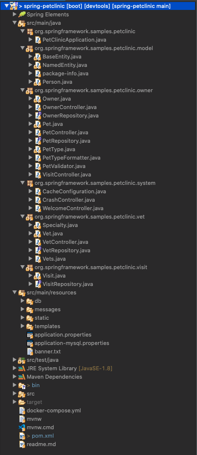
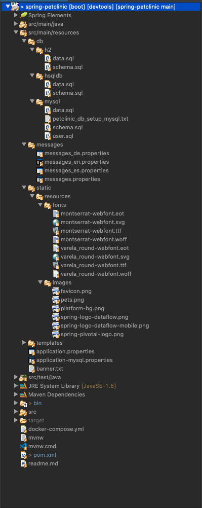
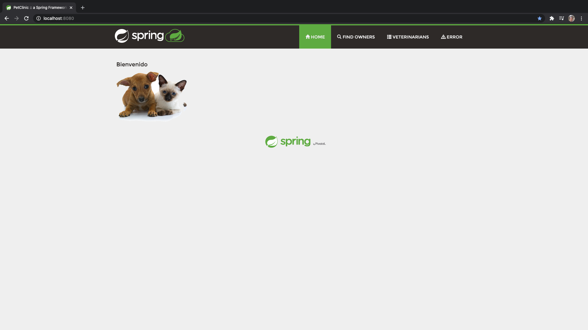
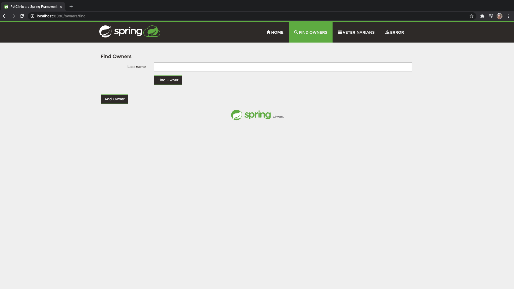

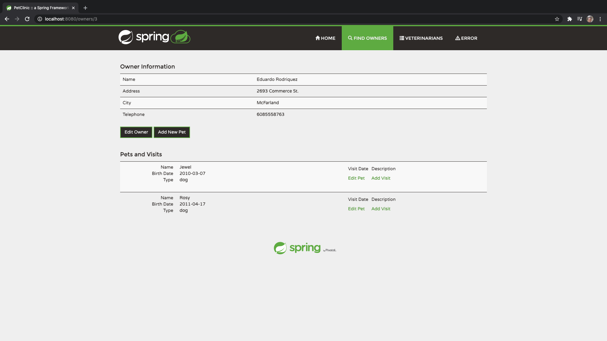
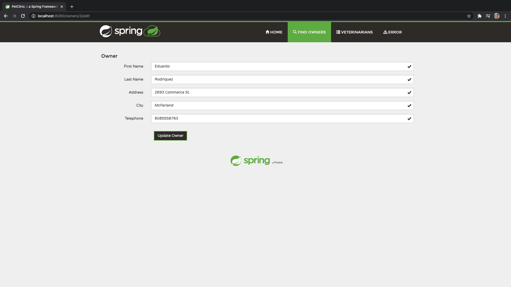
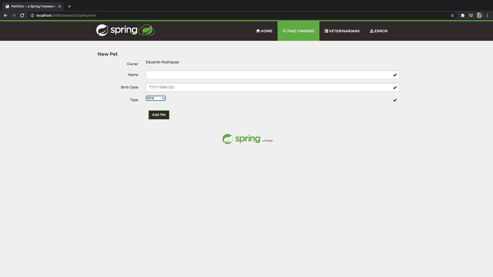
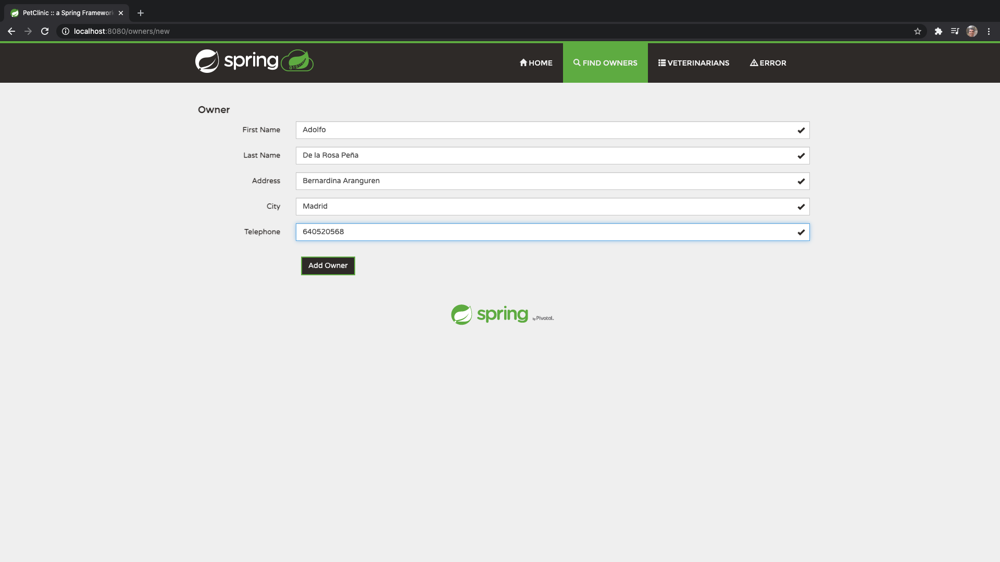
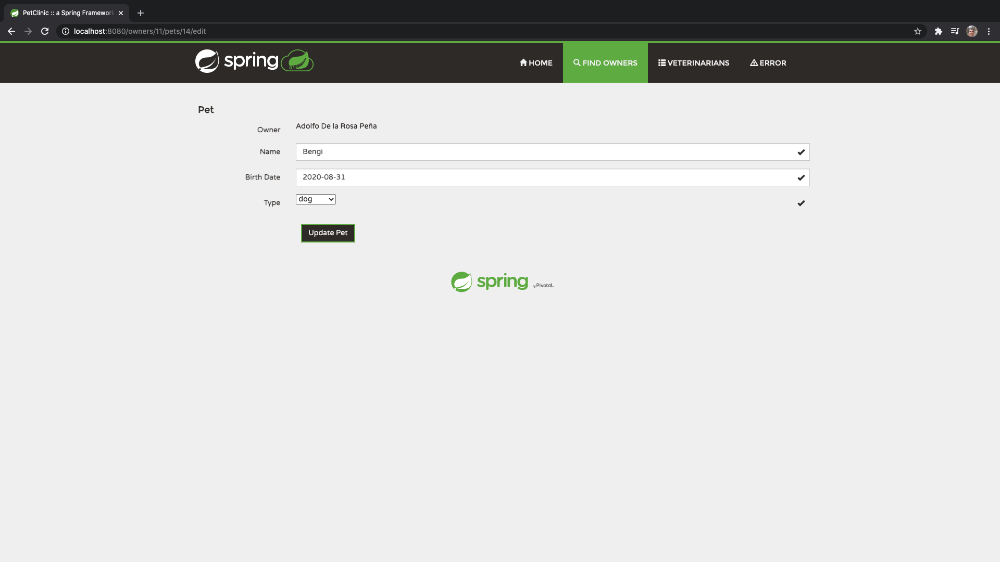
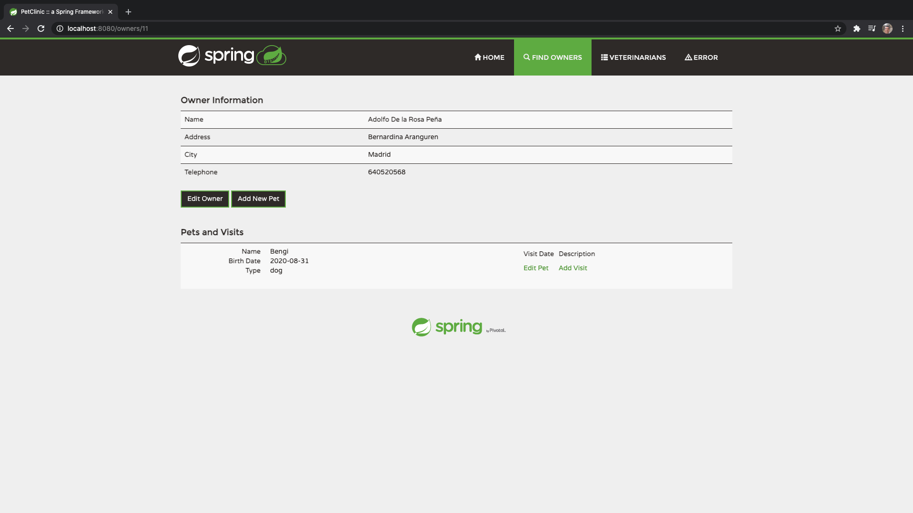
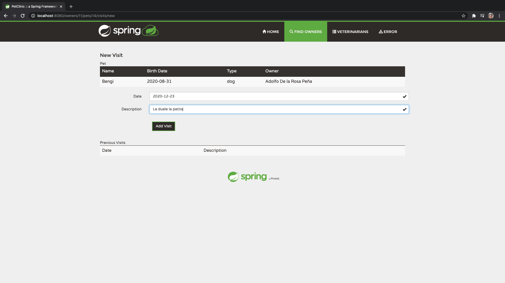
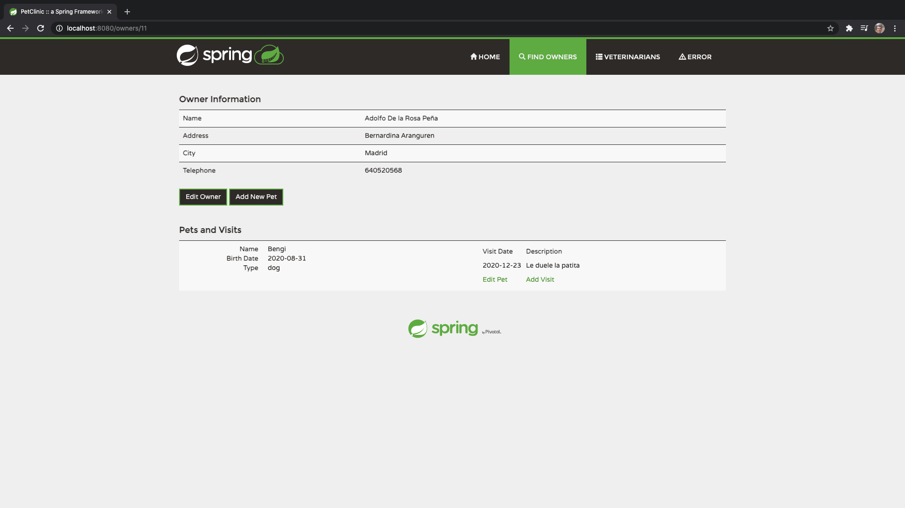
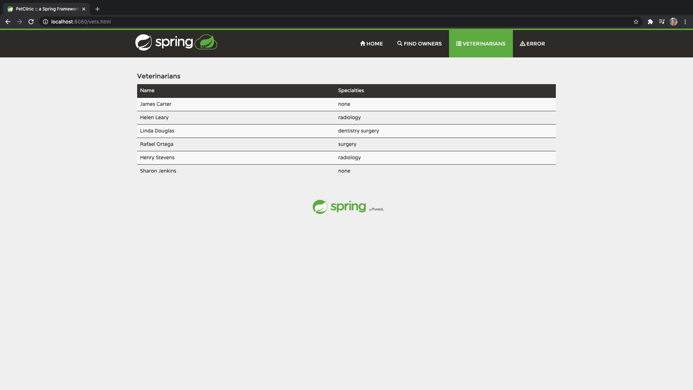
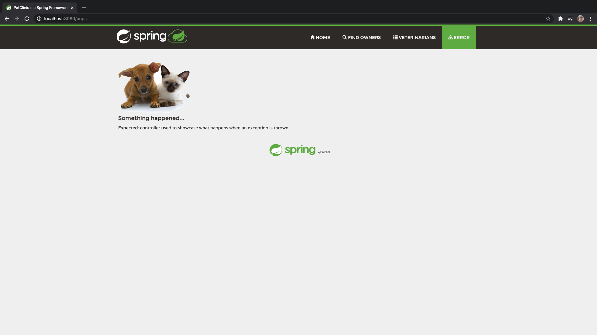


Las aplicaciones monoliticas tiene una serie de **desventajas** por ejemplo ***no son versátiles en escenarios heterogéneos***, es decir qué pasa si nuestra aplicación de PetClinic además de tener un cliente hecho con Thymeleaf para poder acceder desde un navegador Web, queremos tener también otro cliente para una aplicación móvil nativa con las dos grandes plataformas que hay Android e iOS, pues tendríamos serías dificultades, **lo que no sería planteable sería desarrollar otra aplicación totalmente entera digamos para el Backend para cada uno de esos clientes**, porque entonces la sincronización entre los datos sería compleja y es que ***necesitamos desacoplar la vista de lo que sería la parte de la lógica de negocio*** de nuestra aplicación.

También si queremos hacer una integración con un proyecto *Legacy* es decir la tecnología debe marcar definitivamente en nuestro proyecto en un largo recorrido, es algo que nos tenemos que plantear normalmente y por desgracia la respuesta es que si, si nos fijamos cantidad de proyectos desarrollados por ejemplo en Cobol que llevan 50 años funcionando algunos de ellos, hace poco hace unos cuantos meses salía una de las aplicaciones que más tiempo lleva funcionando ininterrumpidamente y es un proyecto hecho en Cobol y qué la recodificacion sería tan sumamente cara que prefieren seguir manteniendolo. Pero debe marcar la tecnología tan largo plazo, si vamos desgajando nuestro proyecto de manera que no sea un monolito es posible que algunas de las pequeñas piezas que tengamos la podemos cambiar para que la tecnología sea algo más moderna.

Y también está el problema de escalado no, si mi aplicación debe escalar y es un monolito debe hacerlo por completo, frente al enfoque de microservicios dónde tenemos nuestra aplicación tan desgajada que si es solamente una de las funcionalidades la que tiene una carga brutal, por ejemplo en una aplicación podemos tener que la búsqueda puede ser algo que se haga con mucha frecuencia y cambiar el perfil de usuario en particular que digo yo, una pequeña configuración, el nombre de nuestro nick dentro del sistema, es algo que ocurre con una frecuencia súper remota, entonces podríamos balancear la carga, podremos escalar de manera que pongamos más recursos a disposición de búsqueda y menos a la hora de cambiar esos datos.

A lo largo de este curso la aplicación que vamos a hacer **NO** será en microservicios, en realidad va a ser monolita, pero lo que vamos a hacer es desgajar por lo menos dos bloques, es decir la parte cliente que se encargará de renderizar  toda la interfaz de usuaio, si es verdad que no la tendremos, de manera que haremos nuestra aplicación más versátil, un escenario de microservicios sería bastante más complejo en un curso de introducción a un API REST.


Estos servicios distribuidos que nos permiten tener nuestra aplicación distribuidas en distintas partes no son nuevos, hay algunos incluso desde los años 80, como son **COM, CORBA, RPC, RMI, SOAP**, por ejemplo **CORBA** era un protocolo de llamada de procedimientos remotos basado en el **patrón Proxy** en el cual se definia una interfaz en un lenguaje neutral y luego las herramientas CORBA compilaban el código cliente servidor al lenguaje particular por ejemplo un cliente hecho en Java y un servidor hecho en ADA o C++, realmente luego eso aunque funciono y hay muchos software que se ha desarrollado con CORBA,  la interfaz eran tan frágiles que un pequeño cambio suponía un quebradero de cabeza enorme y casí una recodificación completa.

Otro que se puso muy de moda apadrinado por Microsoft que es **SOAP** que era similar a CORBA pero **basado en XML**, consigio en algún momento determinado superará a CORBA pero tenía básicamente las mismas dificultades, con una serie de interfaces que eran muy fijas y además frágiles, el mínimo cambio impactaba muchísimo.

**Otra tecnología Java cómo RMI** la cual permitía la invocación remota a métodos, con una gran facilidad de programación pero solamente en escenarios Java, es verdad que nos permitía tener nuestro sistema distribuido a lo mejor en varias máquinas, pero solamente podíamos trabajar con Java, si teníamos un equipo que tuviera mucha madurez en otra tecnología y dijera bueno porque no desarrollarlo con RMI puro y duro no lo podíamos utilizar.

Además tenemos los problemas de comunicación, además de los problemas comunes a la mayoría de las plataformas los de comunicación, incluso a nivel de red, porque normalmente la gente de sistema tiene capados todos los puertos raros de Firewalk más alla del 80, entonces suponía que además de programar, tenemos que interactuar a nivel de sistema, abrir determinados puertos, lo cual podría tener más implicaciones en la seguridad.


Con el auge de la web, esta plataforma, la propia web paso a ser la preferida para el desarrollo de software con el tirón del comercio electrónico, en lugar de ser un único estándar es un conjunto de mucho estándares pequeños definido en documento llamado **RFC Request For Comment**, que es la manera en que empezó la web, no empezó como un estándar sino que empezó poco a poco a partir de una serie de documentos y no patrocinada por una única organización sino un conjunto de varias, entonces con esos documentos se han ido definiendo pequeño estándares que aportan una gran flexibilidad frente a los cambios, todo esto supuso el caldo de cultivo para que surgiera **REST** ***al calor de la web y el protocolo HTTP***.


**REST** es un nuevo enfoque para sistemas distribuidos propuesto por un autor, **Roy Fielding** en su [tesis doctoral](https://www.ics.uci.edu/~fielding/pubs/dissertation/top.htm). Tiene una serie de características, está basada en el protocolo HTTP, **es Sin Estados** ***es decir que cada petición HTTP tiene toda la información necesaria para ser ejecutada***, lo cual hace que la gestión del protocolo sea más fácil, ***los recursos vienen representados por una URI***, un identificador único del recurso, ***se tiene una interfaz uniforme para interactuar entre los diferentes sistemas*** y todo esto hace que en el fondo que sea bastante más fácil.


Frente a **RPC** ***que suele ofrecer una exposición de funcionalidades***, **REST** ***esta orientado a ofrecer recursos***, tenemos un ejemplo por aquí:

RPC

```
/myapi/beerService/getAll
/myapi/beerService/getById
```

REST

```
/myapi/beers
/myapi/beer/123
```

***Con RPP*** sí tuviéramos un servicio para consultar información sobre cervezas ***tendríamos que tener una serie de llamadas a métodos***, devuélveme todas las cervezas, devuelven una cerveza por ID, sin embargo ***la idea de REST es ofrecer recursos*** (aunque a veces se usa la palabra servicio en lugar de recurso), el concepto de servicio desaparece frente a recurso y ***si quieres tener el catálogo con todas las cervezas lo que tengo que hacer invocar al recurso cervezas*** y ***si lo que quiero es una en particular lo que tengo que hacer es invocar al recurso cerveza con su correspondiente ID***, **la idea de recurso frente a la idea de ofrecer funcionalidades**.


***Esto nos va a permitir separar un recurso de lo que será su representación*** y un mismo recurso podremos obtenerlo con diferentes representaciones, por ejemplo ***en JSON o XML*** en determinadas ocasiones me interesara y la separación puede hacer que tengamos por allí algún **middleware** que se encargue en un determinado momento de el recurso en si, transformarlo a la representación que mas nos interese, ya veremos cómo lo podemos hacer.


Por tanto REST nos ofrece una serie de ventajas que vamos a aprovechar, **la separación cliente-servidor** además de una manera sencilla y a través de puerto seguro como suele ser el 80, **visibilidad, fiabilidad y escalabilidad**, la separación entre cliente y servidor tiene la ventaja de que cualquier equipo de desarrollo puede escalar el producto sin problemas, lo podemos ir migrando de servidores al tenerlo totalmente separado podemos hacer cambios a nivel de base datos, la separación nos va a ayudar siempre y además **REST es independiente del tipo de plataforma y lenguaje** es decir podemos crear API REST con PHP, con Java, con Python, con Node, con Spring, aquí en particular lo vamos a aprender con Spring pero podríamos utilizar cualquier tipo de tecnología, solamente necesitamos un lenguaje de programación que nos permita crear servidores, que atiendan peticiones, que puedan producir respuestas con XML o JSON.


Resumo esta lección a través de este gráfico  para ver lo que vamos a hacer a lo largo del curso, es decir **vamos a crear la parte de la derecha lo que sería un servidor**, nuestra API REST que va a recibir peticiones del cliente de tipo multiplataforma desde una placa Arduino o de cualquier tipo de IoT, desde un navegador web, desde una aplicación móvil nativa se realizarán peticiones HTTP, ahora veremos cómo y recibiremos una respuesta, normalmente será en un formato plano de texto vease XML o JSON preferentemente este último, que ya en los clientes podremos procesar y podremos trabajarlo de manera que podamos mostrárselo al usuario, hasta aquí la introducción a qué es un servicio REST, en la próxima lección vamos a aprender sobre HTTP.

# 03 Protocolo HTTP 7:37 

[PDF 02_HTTP.pdf](pdfs/02_HTTP.pdf)

## Resumen Profesor

### Códigos de respuesta

Podemos encontrar un listado exhaustivo de códigos de respuesta y su motivo en castellano en la documentación de desarrolladores de mozilla: https://developer.mozilla.org/es/docs/Web/HTTP/Status.

## Transcripción


En esta lección vamos a hablar del protocolo **HTTP**.


**HTTP o Protocolo de Transferencia de HiperTexto**, es un protocolo que permite la transferencia de información en la web, está desarrollado por el ***Consorcio 3W*** y la ***IETF Internet Engineering Task***, comenzó a funcionar a finales de los 80 a principios de los 90 y aquí os dejo por ejemplo una preview de lo que fue, no se veía exactamente igual, es una reproducción, lo que fue una de las primeras páginas web que se crearon, se produjo en el ***CERT*** en el centro de investigaciones nucleares que está con su sede en Ginebra, el autor es Tim Berners-Lee. 

HTTP desde los años noventa hasta ahora ha ido evolucionando, no tanto como cabría pensar, la versión 1 del protocolo ha estado funcionando mucho mucho mucho mucho tiempo con pocas variaciones, aunque si es verdad que ahora ya nos encontramos en la versión 2 del protocolo en particular a día 2 de abril de 2019 se publicó la versión 2.4.39 que ahora mismo es la versión podríamos decir estándar del propio protocolo HTTP.


Tiene unas características diferenciales frente a otros protocolos, **es un protocolo sin estado**, ***es decir cada petición no se ve influenciada por la petición anterior y contiene toda la información para ser procesada***, **tiene un esquema de Petición-Respuesta Request-Response** en el que nosotros le haremos al servidor una petición y nos remitira una respuesta. El protocolo HTTP/1.X a sido orientado a carácter, ya en el HTTP/2 se ha hecho binario, se ha mejorado mucho, con la comprensión incluso en la aplicación de algoritmos de compresión a la hora de transmitir la información etc. y una serie de ventajas, ***está definido sobre un conjunto de verbos u operaciones***.


El esquema de petición y respuesta lo tenemos aquí en un gráfico sencillo en el que **un cliente**(agente de usuario user-agents) ***realiza una petición enviando un mensaje al servidor***, **el servidor** ***recibe la petición recoge ese mensaje y lo que hace es enviar otro mensaje de respuesta, en este caso al cliente***, si os ponéis en situación cuando escribe una URL en un navegador o pinchas a través de algún enlace, lo que se está haciendo es una petición a un servidor, que puede que haga un determinado procesamiento como mínimo buscar un recurso, aplicar algún tipo de procesamiento y devolverlo una respuesta, en este caso nuestro navegador posiblemente sea HTML, imágenes, CSS, Javascript, todo ellos lo recibe nuestro navegador lo renderiza y nos lo muestra.


El **formato del mensaje** es muy sencillo, tenemos aquí una representación visual, ***tendría unas cabecera o encabezado y un cuerpo***, este formato es el mismo ***tanto para peticiones como para respuesta*** y de hecho a nivel interno solamente cambiaría la línea inicial, por dentro ya iremos viendo poco a poco la estructura que tiene. La línea inicial que termina con un retorno de carro para ***las peticiones, lo que va a ir indicando es el tipo del verbo de petición***, seguido de la ***URL*** a la cual se está haciendo la petición, la ***versión de HTTP soportada*** por el cliente y sin embargo en ***las respuestas lo que tendremos será la versión de HTTP usado, seguido por un espacio, el código de respuesta que indica qué es lo que ha pasado con esa petición y algunos metadatos más*** y luego ***en el cuerpo del mensaje que en las peticiones es opcional, normalmente en la respuesta lo que obtendremos es un recurso, un tipo determinado o un fichero html, una imagen, etc.*** aquí serán los datos que típicamente se van a intercambiar entre entre cliente y servidor, para un API REST por ejemplo posiblemente sea un montón de caracteres, una cadena de caracteres que representan a determinados objeto en JSON o en XML.


Qué **método ofrece HTTP**, métodos conocidos también como **verbos**, son los tipos de peticiones que tenemos e indican la acción que se realiza por el servidor, lo veremos más adelante con detenimiento, los más conocidos son:

* `GET`: para solicitar un recurso servidor
* `POST`: para enviar la información al servidor para poder crear un nuevo recurso
* `PUT`: para actualizar un recurso de forma completa
* `DELETE`: para borrar un recurso

Estos son algunos de los más conocidos, el protocolo soporta muchos tipos de operaciones, muchos tipos de verbos mas.


Los códigos de respuestas que también son bastantes, nos indican que ha pasado con la petición, cada código tiene un significado concreto y son códigos numéricos de tres cifras, por aquí tenemos algunos de ellos en la documentación de desarrolladores de Mozilla [Códigos de estado de respuesta HTTP](https://developer.mozilla.org/es/docs/Web/HTTP/Status) por si lo queréis ver.

Algunos los más conocidos serían los **códigos de tipo 200 con respuestas correctas** como el **200**, **201**, **204**.


Los **códigos 400 que son de errores de cliente**, cómo serían **400** ***Bad request*** una petición errónea, **401** no autorizado o **403** una solicitud legal pero sin privilegios.


En [Códigos de estado de respuesta HTTP](https://developer.mozilla.org/es/docs/Web/HTTP/Status) tenemos la posibilidad de ver cada uno de ellos, los códigos de respuesta nos traen un número y también un mensaje, dentro del conjunto de los 200 tenemos que la solicitud se ha hecho con éxito en una petición GET, en el 201 no indica que la solicitud ha tenido éxito y se ha creado un nuevo recurso, hay algunos que se utilizan más y otros menos, 202 y 203 se utilizan menos, 204 sí que se utiliza con más frecuencia, la petición se ha completado con éxito y se devuelve sin cuerpo, contenido parcial, tenemos luego las peticiones por ejemplo las de tipos 400 bad request una petición errónea, la petición de no autorizado si estamos haciendo algún tipo de autenticación tendremos ese tipo de respuesta. Trabajaremos con estos códigos y de hecho seremos nosotros los que en nuestros API los iremos generando para que le demos una respuesta al cliente sobre lo que ha ha sucedido. 

Ya hemos conocido el protocolo HTTP en la próxima lección vamos a profundizar un poco más.

# 04 Algunos elementos de HTTP 7:57 

[PDF Algunos_elementos_de_HTTP.pdf](pdfs/03_Algunos_elementos_de_HTTP.pdf)

## Resumen Profesor

### Verbos HTTP

Podemos encontrar un listado exhaustivo de métodos o verbos de HTTP en castellano en la documentación de desarrolladores de mozilla: https://developer.mozilla.org/es/docs/Web/HTTP/Methods.

### Encabezados o cabeceras

También podemos encontrar un listado exhaustivo de encabezados o cabeceras de HTTP en castellano en la documentación de desarrolladores de mozilla: https://developer.mozilla.org/es/docs/Web/HTTP/Headers.

## Transcripción


Vamos a continuar hablando del protocolo HTTP y conociendo algunos elementos más, hablamos antes de los métodos y los presentamos, vamos a verlos con más detenimiento.


Los métodos que más vamos a usar serán sobre todo **GET**, **POST**, **PUT** y **DELETE** que son los métodos más básico y los que podemos alinear a lo que serían los distintos verbos de un CRUD la creación de recursos, la lectura de recursos, la actualización de recurso y el borrado de recurso. 

***La petición GET nos sirve para solicitar un recurso al servidor*** y cuando lo implementemos no debería tener otro efecto que devolver el recurso solicitado, para otro tipo de efectos deberíamos utilizar otro tipo de método o verbo.

***Una petición POST será aquella petición que envíe datos para que sean procesados, los datos se deben incluir en el cuerpo de la petición y deberíamos utilizar este tipo de petición para crear recursos en el servidor***, que el impacto sea la creación de un recurso, ***si lo que vamos a hacer es editar deberíamos usar el verbo PUT***, ya veréis como hay mucha gente que por ahí ha desarrollado cosas que parecen REST pero que en el fondo no lo son y que utiliza POST tanto para editar como para crear nuevo recurso, deberíamos utilizar solamente para esto ultimo.


***PUT se debería utilizar en operaciones de actualización completas, es decir que este recurso que enviamos sustituye a uno que exista*** y <span style="color:yellow">**suele ser *IDEMPOTENTE* es decir que si enviáramos N veces está petición debería producir la misma modificación que enviarla una sola vez, es decir que no debería acumular modificación**</span>.

La petición DELETE que es bastante sencilla porque debería dedicarse a borrar el recurso especificado.

Como decía estos son los que más vamos a utilizar pero no son los únicos.


Otros que son útiles como por ejemplo HEAD qué es idéntico a el método GET pero en lugar de que el cuerpo de la respuesta venga relleno, en este vendrían solamente los encabezados, es útil para obtener metadatos, por ejemplo si queremos saber un determinado fichero que nos vamos a descargar cuánto pesa, pues le podríamos hacer primero una petición HEAD y así tendríamos esos datos.

La petición OPTIONS que devuelve la lista de métodos HTTP que soporta un recurso y qué se utiliza en bastantes contextos, por ejemplo si no estoy equivocado, sin ser experto pero creo que en Angular a la hora de crear servicios que van a interactuar con un API también lo utiliza.

La petición PATCH que nos permita actualizar parcialmente un recurso sin tener que hacerlo de forma completa.

Esto con respecto a los métodos.


Si hablamos de encabezados o cabeceras en inglés HEADERS son metadatos que contextualizan nuestro mensaje, cada cabecera es especificada por un nombre de cabecera seguida por dos puntos, tiene una estructura clave-valor y después de esos dos puntos un espacio en blanco y el valor de dicha cabecera y además después un retorno de carro, una especie de intro para que se espere una nueva cabecera en la siguiente línea. De hecho si viéramos esto por dentro lo que se envia en realidad al servidor podríamos ver aquí una serie de encabezados, una línea en blanco para indicar el final de la cabecera y si no hay cabecera la línea en blanco debería permanecer por si estamos desarrollando un cliente a bajo nivel para nuestra para API REST.


Como decía este encabezado o cabecera van a dar una gran flexibilidad porque el protocolo dice que debe haber encabezado pero a lo largo del tiempo han ido apareciendo más, con lo cual no nos ceñimos a tener solamente unos pocos, frente a otros esquemas, como decíamos antes otros tipo de protocolos donde cualquier cambio produccia un gran impacto, aquí con el tiempo han ido apareciendo nuevos encabezados que han resultado francamente útiles. Deben ser interpretados por el cliente o por el servidor o por los intermediarios si tuvieron algún tipo de proxy, de Gateway.


Como tipos tenemos tres los encabezados de petición, los encabezados de respuesta y los encabezados de peticiones respuesta que podemos encontrar los mensajes de ambos tipos hay muchos que son estándares los podemos visitar por aquí:

https://developer.mozilla.org/es/docs/Web/HTTP/Headers

Los tipos de cabeceras que hay.


Vamos a ver alguna pequeña clasificación en función de a qué se dedican, si hablamos de por ejemplo el clientes y queremos ver qué son aceptadas por el cliente que envía el mensaje uno de los encabezados de las cabeceras más importantes es **Accept** esto se envían una petición y le estamos diciendo al servidor el tipo de formato que vamos a aceptar normalmente se envía un tipo MIME, entonces si nosotros tenemos una API que soporta la representación de los recursos en distintos formatos podríamos decirle oye yo en particular ahora en lugar de en JSON quiero tener esto en XML o si puedes me envías una representación en HTML del recurso y esto es francamente útil porque ya digo que si es soportado por el servidor podríamos variando.

También hay veces que utilizamos **Accept-Charset** para indicar oye pues yo lo quiero en UTF-8, en latín o en otro tipo de codificación.

Otro muy como suele ser **User-Agent** que se utiliza para hacer una descripción del cliente que hace la petición.


Para la descripción del contenido por ejemplo pues tendríamos **Content-Type** o **Content-Length** no podría venir una respuesta y no diría que el contenido que te estoy enviando es de este tipo MIME particular o tiene esta longitud.


A nivel de hacer referencia a las URIs tenemos algunas como `Location` que indica dónde está el contenido posiblemente completo, también para autenticación tenemos alguna como `Authorization` o `WWW-Authenticate` que se utilizan en mecanismo de seguridad.

Estás serían una de las más conocidas o de las cuales nos podemos ir encontrar.


Si queremos ver un diálogo que está extraído de la Wikipedia, si dijéramos descargar en el navegador esta URL `www.example.com/index.html` por debajo en la cocina podríamos decir del navegador y el servidor esto es lo que sucedería, se abre una conexión en el puerto 80, el mensaje del lado derecho es el que se enviaría como petición indicando el tipo de petición,  hacia quién se hace, la versión del protocolo, a qué Host, quíen es el user-agents como no se envía ningún tipo de dato en el cuerpo de la petición vendría una línea en blanco y nada más y en la respuesta, la del lado derecho, podemos ver como nos respondería con la versión del protocolo, el código 200 que todo va bien ,la fecha, el tipo de contenido, el tamaño, un espacio en blanco porque terminan las cabeceras y a partir de aquí todo el contenido.

Con esto podemos ver cómo va funcionando el protocolo HTTP sobre el cual se va a basar REST y a partir de ahora en la próxima lección ya podemos ir viendo cómo ir montando nuestro entorno para empezar a poner ya el foco en programar nuestras APIs REST.

# 05 Nuestro entorno de desarrollo 9:34 

[PDF Nuestro_entorno.pdf](pdfs/04_Nuestro_entorno.pdf)

## Resumen Profesor

### Spring Tool Suite

Puedes encontrar el bundle de eclipse y Spring Tool Suite para tu sistema operativo favorito aquí: https://spring.io/tools.

### SdkMan

Si quieres, puedes utilizar SdkMan para gestionar múltiples versiones de Java. Para instalarlo, solo tienes que ejecutar este comando desde un terminal:

```sh
curl -s "https://get.sdkman.io" | bash
```

Más información en https://sdkman.io/.

### Postman

Puedes encontrar el instalable de Postman para tu sistema operativo favorito aquí: https://www.getpostman.com/downloads/.

### cURL

Si eres más de consola, cURL será tu aplicación de cabecera para probar tus apis. Puedes instalarlo siguiendo estas instrucciones:

### Ubuntu

```sh
sudo apt-get update
sudo apt-get install curl
curl --version
```

### MacOs

```sh
ruby -e "$(curl -fsSL https://raw.githubusercontent.com/Homebrew/install/master/install)" < /dev/null 2> /dev/null
brew install curl
```

### Windows

Acceder a https://curl.haxx.se y descargar la versión más adecuada a tu versión de Windows (32 o 64 bits).

### Minitutorial de uso

A continuación, te dejo las instrucciones más básicas para hacer uso de *cURL*.

*El servidor donde hacemos las peticiones es un servidor que podríamos llamar dummy, y que sirve para probar el uso de diferentes peticiones REST.*

### Petición GET - Modo verboso

```sh
curl -v https://jsonplaceholder.typicode.com/posts
```

### Petición POST

```sh
curl -d 'usedId=1&title=Hola&body=mundo' https://jsonplaceholder.typicode.com/posts
```

Si queremos enviar JSON, podemos crear un fichero (request.json) con el cuerpo de la petición:

```js
{
    "userId": 1,
    "title": "Hola Mundo",
    "body": "Este es un ejemplo de petición POST con curl"
}
````

```sh
curl -d @request.json -H "Content-Type: application/json" https://jsonplaceholder.typicode.com/posts
```

### Petición PUT

Tenemos que añadir la opción `-X PUT`. Por ejemplo, modificamos `request.json` con el siguiente contenido:

```js
{
    "userId": 1,
    "title": "Hola Mundo",
    "body": "Este es un ejemplo de petición PUT con curl",
    "id": 24
}
```

```sh
curl -d @request.json -H "Content-Type: application/json" -X PUT https://jsonplaceholder.typicode.com/posts/24
```

### Petición DELETE

```sh
curl -X DELETE https://jsonplaceholder.typicode.com/posts/24
```

## Transcripción


Vamos a continuar con nuestro curso de desarrollo de un API REST con Spring Boot y vamos a conocer el entorno de desarrollo que vamos a utilizar.


Podemos crear proyectos con Spring con alguna de nuestro IDEs favorito cómo puede ser Eclipse, IntelliJ J IDEA o Visual Studio nosotros vamos a utilizar Spring Tool Suite es una extensión para algunos IDEs conocidos y que nos permite trabajar con proyectos Spring de una manera súper fácil y conveniente, está disponible para Eclipse, de hecho para nosotros será el Bounden que utilizamos, se puede descargar Eclipse ya con el con el plugin instalado de Spring Tool Suite y bueno si no también lo tenemos como extensión disponible para Visual Studio Code para Thela y si quisiera mas alla también con IntelliJ J aunque Spring Tool Suite plugin no existe para IntelliJ J pero es verdad que sobre todo en su versión de pago tiene una serie de extensiones que nos permitirían trabajar con un proyecto con total tranquilidad, que no tenéis la versión de pago y tenéis la versión gratuita pues también a través del servicio Starter se pueden generar fácilmente los proyectos, se importan como maven y podrían funcionar, ya digo nosotros vamos a trabajar con Spring Tool Suite.


El Bounden para Eclipse esta disponible para Windows para para Mac para Linux también hay extensiones para Visual Studio Code para Thela para alguno de vuestros IDEs favoritos, nosotros trabajaremos con Spring Tool Suite os lo podéis descargar desde la web de [Spring Tool Suite](https://spring.io/tools) desde aquí lo podéis descargar con total tranquilidad para Linux, para Mac, para Windows simplemente hay que descomprimirlo allá donde lo queráis utilizar y ni siquiera instalarlo y doble click y lo podría empezar a ejecutar, con una serie de funcionalidades ya digo bastante interesante y francamente cómodo. También para los más viejos del lugar tienen la versión 3 por si quieren todavía trabajar con ella, útil sobre todo si van a trabajar con algún proyecto Legacy que no utilice Spring Boot o alguna cosa bastante bastante más vieja.


A nivel de Java deciros que la versión mínima será la versión 8, de hecho la 8 la tienes que tener instalada porque a día de hoy es necesaria para poder ejecutar Eclipse con Spring Tool Suite pero también podríais tener alguna versión adicional como la versión 9, la 11, versiones LTS que ofrecen alguna funcionalidad más, de hecho a lo mejor en algún punto del curso digo si estuvierais Java 9 o Java 11 lo podrían hacer así. 

Si trabajáis en Linux es verdad que además para poder gestionar estas varias versiones de Java tenemos por ahí algún alguna herramienta como es [SDK-MAN](https://sdkman.io/) que a través de la consola o permitirían que pudiera ir gestionar la descarga de distintos JDK en realidad ya no es el momento de comentarlo pero no son el JDK oficial de Oracle cuyo licenciamiento pues cambio hace ya un tiempo sino que son otros open JDK podríamos descargar y tener diferentes versión instalada y conmutar entre algunas de ellas en determinados momentos.


Decir que Sprint ya hemos hablado en nuestro entorno de desarrollo como tal, ahora hablar del entorno en el cual nos vamos a mover en el Framework es un gran ecosistema de proyectos que incluye un montón de proyecto y además alguno de esos proyectos también son proyectos que podríamos llamar paraguas sobre otros que van dentro. Algunos de ellos como por ejemplo los que tenemos aquí Spring Boot, Spring Framework, Spring Security, Spring Data algunos de ellos o con muchos de ellos lo utilizaremos a lo largo de este curso o de sucesivos curso sobre sobre API REST con Spring.


Vamos a conocer alguno con algo más de profundidad cómo sería Spring Boot que facilita la creación de aplicaciones basadas con Spring de manera que sea independiente y lista para usar con un esfuerzo mínimo, tiene una gestión superfácil a través de dependiendo de si usamos Maven o Gradel a través del fichero `pom.xml` o `build.gradle`, nosotros trabajaremos con Maven, nos permite tener el servidor embebido dentro de la aplicación en lugar de hacerlo al contrario, ya no tenemos que tener un servidor instalado, generar un WAR y mandar allí la aplicación si no que vamos a tener nuestro servidor dentro de nuestro WAR lo cual será más fácil de ejecutar. Una serie de dependencia Starter dependencia iniciales que facilitan la configuración de componentes, que son capaces de escanear si tenemos en el ClassPath alguna librería incluida para activar o no determinada acción de configuración, de alguna librería de terceros y todo ello sin generar ni una línea prácticamente de codigo o de configuración XML, no es que por detrás se vaya generando clase y clase sino que todo sucede de manera transparente o como a mí me gusta decir auto mágica.


Tenemos también un servicio que es Spring Initializr y que nos va a permitir generar rápidamente nuestros proyectos, quien quiera sobre todo aquellos que uséis Inteligente IDEA necesitaran esto para generar de una manera más fácil un project Spring, incluso hay alguna herramienta que nos permite hacerlo desde la línea de comandos, aunque está es exactamente comoda, nosotros tendremos esta herramienta integrada dentro de nuestro Spring Tools Suit no nos hará falta recurrir a esta herramienta externa.


Como elemento más de entorno decir que utilizaremos Postman, Postman es un cliente que nos va a permitir interactuar con nuestra API REST, de hecho nos ayuda un montón al desarrollo y al testeo, existen versiones tanto para Windows, como para Linux, para Mac, tenéis web para descargar [Postman](https://www.postman.com) y podéis acceder y descargar la versión del sistema operativo Mac, Windows la instalación es bastante sencilla. Tiene una serie de pestañas en las cuales vamos a poder hacer diferentes peticiones en las cuales podemos pasar algunos datos y que nos dará la respuesta, tiene una API REST que existe de ejemplo y podríamos hacer una petición GET y por detrás suceden cosas, nos devuelve la respuesta ya incluso en un formato Pretty en el cual podemos ir viendo el tipo de código de respuesta, las cookies que hay, los distintos encabezados que hemos tenido como respuesta, en otro tipo de peticiones si fueran POST nosotros podremos crear recursos, aplicar elementos de seguridad, enviar otros encabezdos, elementos en el cuerpo, etc. la verdad es que Postman va a ser para nosotros de una gran utilidad ya digo lo podremos utilizar en nuestra API REST de una manera súper cómoda.


Si eres más de consola puede utilizarse **cURL** esto se usa en un terminal, nos permitiría hacer diferentes peticiones, en el material adicional dice como instalarlo en Ubuntu, en Mac o en Windows. Es verdad que hay que conocer su sintaxis, de cómo hacer peticiones pero también es verdad que nos permitiría sin necesidad de ningún otro tipo de herramienta gráfica hacer peticiones y ver todo ello desde el terminal, de hecho nos permitiría interactuar y construir herramientas complementarias haciendo algún tipo de Script que hiciera petición a algún tipo de servicio, que recibirá después datos, encadenarlo con otra petición etc.

Bueno con esto hemos visto todas las herramientas, proyectos, el framework que vamos a utilizar en nuestro entorno y ya lo que nos queda es lanzarnos a su uso y aprendizaje.

# 06 Uso de la librería Lombok 7:22 

[PDF Project_Lombok.pdf](pdfs/05_Project_Lombok.pdf)

## Resumen Profesor

### Instalación

Según su propia web https://projectlombok.org/, *Lombok* es una librería de Java que se conecta automáticamente a nuestro IDE y crea herramientas, *condimentando* nuestro código. Nunca volveremos a escribir otro método *getter* o *equals*; con una anotación nuestras clases tendrán un generador con todas las funciones.

Para instalarlo, tan solo tenemos que descargar la última versión en https://projectlombok.org/download y ejecutarlo (haciendo doble click o mediante un terminal a través de `java -jar lombok.jar`).


Aparecerá entonces un asistente en el que se listarán las instancias de eclipse (o sus derivados) instalados en el sistema. Si no aparece la instalación deseada, la podemos buscar pulsando el botón *Specify location*. Para terminar la instalación, pulsaremos el botón *Install/Update*.

### Uso

Spring Tool Suite nos permite añadir la dependencia desde el asistente de *starters*.

Si lo tenemos que hacer *a mano*, debemos incluir nuestro `pom.xml`:

```html
<dependency>
    <groupId>org.projectlombok</groupId>
    <artifactId>lombok</artifactId>
    <version>1.18.10</version>
    <scope>provided</scope>
</dependency>
```

En proyectos de Spring Boot, la versión no es necesario indicarla.

### Anotaciones más usuales

Las anotaciones más usuales de lombok son:

* `@Getter`: a nivel de clase, genera un método *getter* para todos los atributos de la clase.
* `@Setter`: a nivel de clase, genera un método *setter* para todos los atributos de la clase.
* `@RequiredArgsConstructor`: genera un constructor para los atributos marcados con `@NonNull` o que sean `final`.
* `@AllArgsConstructor`: genera un constructor para todos los atributos de la clase.
* `@NoArgsConstructor`: genera un constructor sin argumentos.
* `@EqualsAndHashCode`: genera los métodos `equals` y `hashCode`.
* `@ToString`: genera el método `toString`.

También hay algunas anotaciones equivalentes a un conjunto de las anteriores, muy útiles:

`@Data`: equivalente a `@Getter`, `@Setter`, `@RequiredArgsConstructor`, `@EqualsAndHashCode` y `@ToString`.
Puedes encontrar más información en https://projectlombok.org/features/all y en https://projectlombok.org/api/lombok/package-summary.html.

## Transcripción


Vamos a complementar todo lo que hemos hablado en la lección anterior de nuestro entorno de desarrollo con Project Lombok. 


Estoy completamente seguro de que si te pregunto me dirás que te da un montón de pereza en tus clases modelo cada vez que le añades una serie de datos tener que generar getter, setter, método equals, hashCode, toString ahora le añade una nueva propiedad, tengo que añadir el getter y setter, modificar el hashCode, el toString, el equals, ahora quito una igual, ahora que pasa con el constructor, da un montón, un montón de pereza, bueno pues para ellos Project Lombok viene a nuestro rescate.


Y es que vamos a pasar de tener esas clases dónde ya digo que aunque no tengamos que programarlo y se auto genere por el IDE, la verdad es que así lo vamos a tener francamente más cómodo y más flexible frente a cambios. Podemos ver como nuestra clase va a pasar ahora a ser netamente las propiedades y un conjunto anotaciones, si solamente queremos sobrescribir algún método, añadir alguno más, pues lo podemos tener pero si es solamente getter, setter, método equals, hashCode, toString que suele pasar que en nuestro proyecto tengamos algunas clases así, solamente tendríamos que trabajar con algunas anotaciones.


Vamos a ver como Lombok tiene algunas anotaciones clave:

* `@Getter` nos va a permitir general los metodos getter de nuestras propiedades
* `@Setter` nos va a permitir general los metodos setter de nuestras propiedades
* `@RequiredArgsConstructor` el constructor de argumentos requerido no construirá un constructor con los argumentos que tenga la anotación notNull o que sean final
* `@AllArgsConstructor` el de todos los argumentos con constructor para todos 
* `@NoArgsConstructor` el de sin argumento un constructor sin argumentos
* `@EqualsAndHashCode` genera los métos equals y hashCode
* `@ToString` generara el método toString


También tenemos algunas anotaciones derivadas o digamos que complementan que aglutina algunas del anterior, una muy útiles es:

* `@Data` que es equivalente a utilizar `@Getter`, `@Setter`, `@RequiredArgsConstructor`, `@EqualsAndHashCode` y `@ToString`


### Instalar Lombok

Bueno pues vamos manos a la obra, esto a cómo vas como dirían. Vamos a descargarnos [Project Lombok](https://projectlombok.org/) descargamos el archivo `lombok.jar` lo que tenemos que hacer es instalar un pequeño complemento en nuestro Spring Tools Suit o en nuestro Eclipse que lo hacemos a través de esta librería `lombok.jar` y abriendo el terminal lo que hacemos es ejecutarla con `java -jar lombok.jar`.


Se nos abre una ventana Lombok intentará dependiendo del sistema operativo que tengáis escanear si tiene instalado algún IDE, lo mismo no encuentra o aparece aquí el listado y es maravilloso si no lo encontrarás tendréis que buscarlo, en este caso solo nos aparece Eclipse.


Al darle en instalar nos lo instala en Eclipse.


Vamos a volver a ejecutar `java -jar lombok.jar` para localizar Spring Toos Suite 


Al darle en instalar nos lo instala en Spring Toos Suite.


Ya quedaría instalado aquí tenemos algunos comentarios.

Lo único que tenemos que hacer ahora es incluir Lombok en nuestro proyecto.

Otra cosa que daría también un montón de pereza sería tener que añadir ahora Lombok como un Jar a mano, pues no os preocupéis porque esto no tiene por que suceder y es que lo podemos ir haciendo con nuestros proyectos de Spring y lo podríamos hacer con el modo tradicional que tiene Spring para hacerlo.

### Proyecto Demo Lombok

Vamos a crear un nuevo proyecto `Spring Starter Project`.


Lo vamos a llamar `143-01-Demo_Lombok`


Aquí podemos añadir las dependencias de Spring Web y Lombok es decir que lo podemos gestionar a través de Maven y que no necesitamos hacerlo con una dependencia externa que sabéis que eso es un gran quebradero de cabeza.


Con esto ya tenemos la estructura básica de nuestro proyecto.


Podríamos crear la clase modelo `Persona`


```java
package com.openwebinars.lombok;

public class Persona {

}
```

Vamos a añadirle las siguientes propiedades.

```java
package com.openwebinars.lombok;

import java.time.LocalDate;

public class Persona {
	
	private String nombre;
	private String apellidos;
	private LocalDate fechaNacimiento;

}
```


Y lo único que tendríamos que hacer sería añadirle anotaciones de Lombok, con `@Data`


vea la magia que ha sucedido, a la derecha se han generado getter, setter, equal, hashCode, toString, incluso tenemos un constructor sin argumentos esto viene definido a nivel del propio Java, cuando no hay ningún constructor definido el solo no genera un constructor sin argumentos, sin embargo si nosotros anotamos también con `@AllArgsConstructor` generamos un constructor con argumento el constructor sin argumentos desaparece.


Si quisieramos también un constructor sin argumentos Lombok tiene una anotación para ello `@NoArgsConstructor`


Y fijarse en la cantidad de elementos que ya tenemos disponibles.

Podríamos hacer una prueba de nuestro código de Persona, en la clase `Application` podemos insertar el siguiente código que nos va a permitir ejecutarlo como si fuera un pequeño main.

```java
@Bean
public CommandLineRunner lombokTest() {
		
   return args -> {
			
	  Persona p1 = new Persona();
	  p1.setNombre("Pepe");
	  p1.setApellidos("Pérez");
	  p1.setFechaNacimiento(LocalDate.of(1999, 1, 31) );
			
	  System.out.println(p1);
   };
}
```

Creamos una nueva persona con su constructor sin parámetros, usamos los setter para asignarle valores a sus 3 propiedades y en el Sysout usamos no de la manera más ortodoxa el `toString`.

Podemos ejecutar el proyecto.


Y ver como en la consola nos muestra `Persona(nombre=Pepe, apellidos=Pérez, fechaNacimiento=1999-01-31)`.


Como vemos Persona es un objeto totalmente funcional pero si nos damos cuenta su código es francamente más cómodo.

Hasta aquí lo que hemos aprendido de Lombok, ya estamos totalmente preparado para lanzarnos a la piscina a poder crear nuestra primera API REST con Spring Boot.

### :computer: Código Completo - 143-01-Demo_Lombok


*`pom.xml`*

```html
<?xml version="1.0" encoding="UTF-8"?>
<project xmlns="http://maven.apache.org/POM/4.0.0" xmlns:xsi="http://www.w3.org/2001/XMLSchema-instance"
	xsi:schemaLocation="http://maven.apache.org/POM/4.0.0 https://maven.apache.org/xsd/maven-4.0.0.xsd">
	<modelVersion>4.0.0</modelVersion>
	<parent>
		<groupId>org.springframework.boot</groupId>
		<artifactId>spring-boot-starter-parent</artifactId>
		<version>2.3.1.RELEASE</version>
		<relativePath/> <!-- lookup parent from repository -->
	</parent>
	<groupId>com.openwebinars</groupId>
	<artifactId>143-01-Demo_Lombok</artifactId>
	<version>0.0.1-SNAPSHOT</version>
	<name>143-01-Demo_Lombok</name>
	<description>Práctica Lombok</description>

	<properties>
		<java.version>1.8</java.version>
	</properties>

	<dependencies>
		<dependency>
			<groupId>org.springframework.boot</groupId>
			<artifactId>spring-boot-starter-web</artifactId>
		</dependency>

		<dependency>
			<groupId>org.projectlombok</groupId>
			<artifactId>lombok</artifactId>
			<optional>true</optional>
		</dependency>
		<dependency>
			<groupId>org.springframework.boot</groupId>
			<artifactId>spring-boot-starter-test</artifactId>
			<scope>test</scope>
			<exclusions>
				<exclusion>
					<groupId>org.junit.vintage</groupId>
					<artifactId>junit-vintage-engine</artifactId>
				</exclusion>
			</exclusions>
		</dependency>
	</dependencies>

	<build>
		<plugins>
			<plugin>
				<groupId>org.springframework.boot</groupId>
				<artifactId>spring-boot-maven-plugin</artifactId>
			</plugin>
		</plugins>
	</build>

</project>
```

*`Personana.java`*

```java
package com.openwebinars.lombok;

import java.time.LocalDate;

import lombok.AllArgsConstructor;
import lombok.Data;
import lombok.NoArgsConstructor;

@Data @AllArgsConstructor @NoArgsConstructor
public class Persona {
	
	private String nombre;
	private String apellidos;
	private LocalDate fechaNacimiento;

}
```

*`Application.java`*

```java
package com.openwebinars.lombok;

import java.time.LocalDate;

import org.springframework.boot.CommandLineRunner;
import org.springframework.boot.SpringApplication;
import org.springframework.boot.autoconfigure.SpringBootApplication;
import org.springframework.context.annotation.Bean;

@SpringBootApplication
public class Application {

   public static void main(String[] args) {
	  SpringApplication.run(Application.class, args);
   }
	
   @Bean
   public CommandLineRunner lombokTest() {
		
      return args -> {
			
         Persona p1 = new Persona();
         p1.setNombre("Pepe");
         p1.setApellidos("Pérez");
         p1.setFechaNacimiento(LocalDate.of(1999, 1, 31) );
			
		 System.out.println(p1);
      };
   }
}
```

# 07 Soporte de Spring Boot para servicios REST 6:34 

[PDF Soporte_de_Spring_Boot_para_REST](pdfs/06_Soporte_de_Spring_Boot_para_REST.pdf)

## Resumen Profesor

### `HttpMessageConverter`s por defecto

Spring Boot ofrece una serie de instancias de `HttpMessageCoverter` por defecto en nuestros proyectos web:

* `ByteArrayHttpMessageConverter`: convierte en/desde arrays de bytes.
* `StringHttpMessageConverter`: convierte en/desde cadenas de caracteres.
* `ResourceHttpMessageConverter`: convierte en/desde instancias de `Resource`.
* `SourceHttpMessageConverter`: convierte en/desde instancias javax.xml.transform.Source
* `FormHttpMessageConverter`: convierte un formulario en/desde un `MultiValueMap<String, String>`.
* `Jaxb2RootElementHttpMessageConverter`: convierte objetos Java en/desde XML, si JAXB2 está presente en el classpath.
* `MappingJackson2HttpMessageConverter`: convierte a/desde JSON, si Jackson 2 está presente en el *classpath*.
* `MappingJacksonHttpMessageConverter`: convierte a/desde JSON, si Jackson 2 está presente en el *classpath*.
* `AtomFeedHttpMessageConverter`: convierte en/desde Atom feeds, si Rome está presente en el *classpath*.
* `RssChannelHttpMessageConverter`: convierte en/desde RSS feeds si Rome está presente en el *classpath*.

## Transcripción


Vamos a completar este bloque viendo que no ofreces Spring Boots para poder desarrollar nuestra API REST, que vamos a ver qué es mucho.


Por lo pronto si desarrollamos nuestras API REST con Spring Boot vamos a tener toda la potencia de Spring Boots, es decir que podemos aprovechar inyección de dependencia, acceso datos, seguridad, utilidades todo lo que ya nos ofrecía lo podemos aprovechar en este contexto.


De hecho ya nos ofrece elementos específicos para REST, frente a anotaciones como `@Controller`, los beans de tipo `@Controller` que teníamos en en aplicaciones MVC normales tenemos `@RestController` que nos permite tener una combinación de `@Controller` y `@ResponseBody` es decir se modifica el mecanismo de renderizacion de la vista y en lugar de redirigirnos a través de una compleja cadena Beans de Beoresolver tal, una plantilla de Thymeleaf o de JSP ubicada en una determinada carpeta, el procesamiento de la misma lo que hace que lo que devolvamos en el método será lo que se envía al cliente, si es posible que pase por un filtro ya veremos de qué tipo, que lo que hace es transformarlo de Java a un JSON o XML.


Aquí tenemos por ejemplo un pequeño fragmento de código de lo que sería un `@RestController`
en el cual podemos dar cuenta que está en negrita, la anotación cambia, la del método si es verdad que puede ser la misma y el tipo de retorno en lugar de ser String, ModelAndView etc. de los clásicos que podemos tener, puede ser un tipo de dato de nuestro modelo que a través de un determinado mecanismo se transformara ese recurso en una representación normalmente en JSON. 


De eso se encarga un tipo de Beans especial que son `HTTPMessageConverter` y que serán los qué formaten el contenido que le entreguemos al cliente, al incluir la dependencia *starter web* se añade alguna librería entre ellas *Jackson 2* y entre otro, tenemos algunos Converter como por ejemplo el de `MappingJackson[2]HttpMessageConverter` que lo que hace es convertir por ejemplo la respuesta, una clase Java en un objeto JSON, en una cadena JSON y eso será bastante útil, ya digo que esto sucederá casi que automámagicamente porque por incluir en Spring Boot la dependencia *starter web* y por utilizar la anotación `@RestController` todo sucederá como por arte de magia.

Hay más `MessageConverter` en el material adicional os dejo un listado de los más habituales e incluso vosotros podría implementar el propio vuestro customizado.


Algunas de las clases que utilizaremos y que posiblemente algunas de ellas las desgranaremos más adelante son `HTTPEntity` que representa una petición o respuesta un mensaje, tenemos la 
concreción en `RequestEntity` y `ResponseEntity` que utilizaremos más, que nos permite modelar muy bien la respuesta que se le va a dar al usuario, añadiendo el código de estado que enviamos en el cuerpo, encabezados que se manden, etc. la clase `MediaType` qué es una subclase de MIME y que tiene un listado de constantes con los diferentes tipos de datos `ApplicationJason`, `application.xml`, etc. La clase `HTTPHeaders` que representa los encabezados de una petición o respuesta estas serán algunas de las que más podamos utilizar.


Si hablamos de seguridad, no vamos a implementar la seguridad dentro de este curso, porque entonces sería inabarcable, pero decir que nos permite Spring integral Spring Security y por tanto aplicar la configuración tal cual la podemos aplicar en una en un proyecto web, tendríamos diferentes posibilidades de llegar a la autenticación como sería la Basic que es una que está definida en un RFC, la JWT, OAuth sobre todo en la versión OAuth2, tendremos diferentes tipo de alternativa.


Spring también nos ofrece no solamente hacer la parte servidora sino que podriamos hacer una applicación por ejemplo Cliente que por poner tuviera una serie de controladores que nos remitirá a una plantilla de Thymeleaf pero que en lugar de extraer los datos desde un servicio hacia una base de datos que lo pudieran hacer desde un API REST remota a través de la clase RestTemplate, si alguna vez nuestra API tiene que hacer peticiones a otra API, que eso sucede con más frecuencia de la que podemos imaginar, pues nos permitirá hacer peticiones de este tipo, de hecho utiliza todas las clases que veníamos explicando antes de RequestEntity, ResponseEntity, HTTPHeader, etc. 


Como elementos más avanzados tenemos también que Spring ofrece el soporte para servicio REST a través de Spring Data REST qué es algo así como mezclar Spring Data con la generación rápida de un API REST y que veremos cómo es capaz de transformar rápidamente un repositorio de Spring Data en toda una API con todo su controlador ya montado y sin que tengamos que poner casi ni una línea de código adicional.

Tenemos también el proyecto Spring HATEOAS son las siglas de Hipermedia as the Engine of Application State, la hipermedia como el motor del estado de la aplicación que nos permite crear fácilmente este proyecto en la aplicación siguiendo este principio y además aprovechando el uso de HAL de un lenguaje específico de hipertexto y qué bueno planteando la facilidad que existe a día de hoy en cualquier web de pinchando enlaces pásate un recurso otro que aplicarlo mismo en nuestra API REST. 


También Spring Rest Docs que nos permite documentar un servicio RST combinando Sprint MVC Test o Asciidoctor, todo este sería el soporte que nos ofrece Spring a la hora de crear nuestro API REST y que en las próximas lecciones pondremos en práctica.

# Contenido adicional  7

* [PDF Presentacion.pdf](pdfs/00._Presentacion.pdf)
* [PDF Qué_es_un_servicio_REST.pdf](pdfs/01_Qué_es_un_servicio_REST.pdf)
* [PDF 02_HTTP.pdf](pdfs/02_HTTP.pdf)
* [PDF Algunos_elementos_de_HTTP.pdf](pdfs/03_Algunos_elementos_de_HTTP.pdf)
* [PDF Nuestro_entorno.pdf](pdfs/04_Nuestro_entorno.pdf)
* [PDF Project_Lombok.pdf](pdfs/05_Project_Lombok.pdf)
* [PDF Soporte_de_Spring_Boot_para_REST](pdfs/06_Soporte_de_Spring_Boot_para_REST.pdf)
