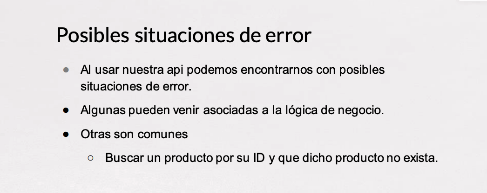
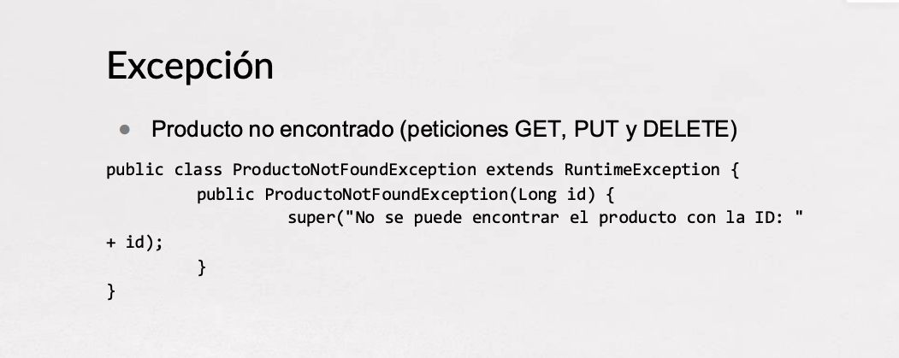
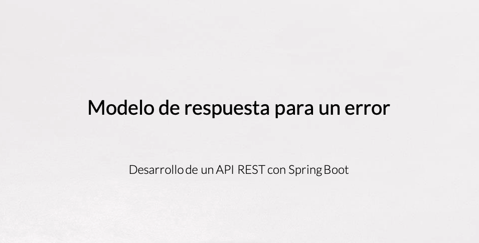
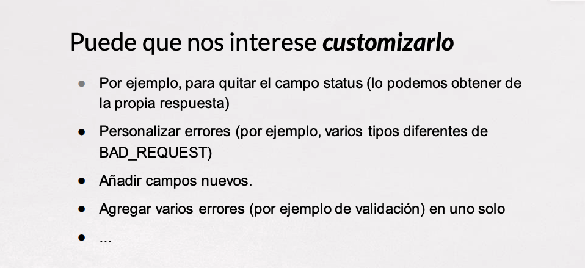
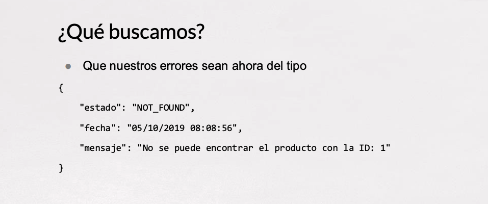
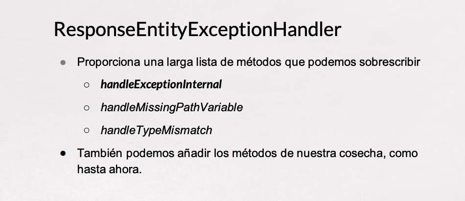
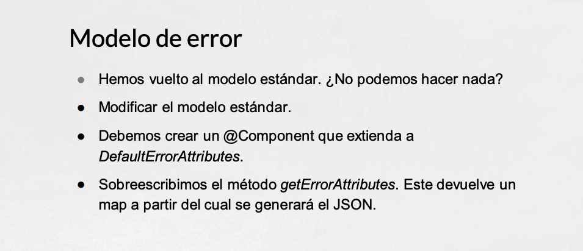

# 3. Manejo de errores y excepciones

* 14 Manejo básico de errores 14:40 
* 15 Modelo para la respuesta de un error 4:58 
* 16 Manejo de errores con @ExceptionHandler 12:25 
* 17 Manejo de errores con @ControllerAdvice (Parte I) 11:22 
* 18 Manejo de errores con @ControllerAdvice (Parte II) 8:06 
* 19 Novedades en Spring 5: ResponseStatusException 12:39 
* Contenido adicional 6

* 14 Manejo básico de errores 14:40 

[PDF Manejo_básico_de_errores.pdf](pdfs/13_Manejo_básico_de_errores.pdf)

## Resumen Profesor

La información sobre la anotación `@ResponseStatus` la puedes encontrar aquí :https://docs.spring.io/spring/docs/current/javadoc-api/org/springframework/web/bind/annotation/ResponseStatus.html.

## Transcripción







# 15 Modelo para la respuesta de un error 4:58 

[PDF Modelo_de_respuesta_para_un_error.pdf](pdfs/14_Modelo_de_respuesta_para_un_error.pdf)

## Resumen Profesor

### Modelo de error más complejo

Algunos autores, como `Bruno Leite`, proponen una implementación del modelo de respuesta más complejo como esta:

```java
class ApiError {

   private HttpStatus status;
   @JsonFormat(shape = JsonFormat.Shape.STRING, pattern = "dd-MM-yyyy hh:mm:ss")
   private LocalDateTime timestamp;
   private String message;
   private String debugMessage;
   private List<ApiSubError> subErrors;

   private ApiError() {
       timestamp = LocalDateTime.now();
   }

   ApiError(HttpStatus status) {
       this();
       this.status = status;
   }

   ApiError(HttpStatus status, Throwable ex) {
       this();
       this.status = status;
       this.message = "Unexpected error";
       this.debugMessage = ex.getLocalizedMessage();
   }

   ApiError(HttpStatus status, String message, Throwable ex) {
       this();
       this.status = status;
       this.message = message;
       this.debugMessage = ex.getLocalizedMessage();
   }
}
 
abstract class ApiSubError {

}

@Data
@EqualsAndHashCode(callSuper = false)
@AllArgsConstructor
class ApiValidationError extends ApiSubError {
   private String object;
   private String field;
   private Object rejectedValue;
   private String message;

   ApiValidationError(String object, String message) {
       this.object = object;
       this.message = message;
   }
}
```
## Transcripción







# 16 Manejo de errores con `@ExceptionHandler` 12:25 

[PDF ExceptionHandler.pdf](pdfs/15_ExceptionHandler.pdf)

## Resumen Profesor

La información sobre la anotación `@ExceptionHandler` la puedes encontrar aquí: https://docs.spring.io/spring-framework/docs/current/javadoc-api/org/springframework/web/bind/annotation/ExceptionHandler.html.

## Transcripción





# 17 Manejo de errores con `@ControllerAdvice` (Parte I) 11:22 

[PDF ControllerAdvice.pdf](pdfs/16_ControllerAdvice.pdf)

## Resumen Profesor

La información sobre la clase `ResponseEntityExceptionHandler` la puedes encontrar aquí: https://docs.spring.io/spring-framework/docs/current/javadoc-api/org/springframework/web/servlet/mvc/method/annotation/ResponseEntityExceptionHandler.html

## Transcripción


# 18 Manejo de errores con `@ControllerAdvice (Parte II)` 8:06 

[PDF Controller_Advice_II.pdf](pdfs/17_Controller_Advice_II.pdf)

## Resumen Profesor

No existe.

## Transcripción





# 19 Novedades en Spring 5: ResponseStatusException 12:39 

[PDF ResponseStatusException.pdf](pdfs/18_ResponseStatusException.pdf)

## Resumen Profesor

La información sobre la clase `ResponseStatusException` la puedes encontrar aquí: https://docs.spring.io/spring-framework/docs/current/javadoc-api/org/springframework/web/server/ResponseStatusException.html.

Puede ser interesante fijarse en algunas de sus subclases:

* `MediaTypeNotSupportedStatusException`: excepción que encaja con el código de respuesta 415.
* `MethodNotAllowedException`: excepción que encaja con el código de respuesta 405.
* `NotAcceptableStatusException`: excepción que encaja con el código de respuesta 406
* `ServerErrorException`: excepción para el código 500 que expone información extra.
* `ServerWebInputException`: excepción que encaja con el código de respuesta 400 para ser usada en aplicaciones web.
* `UnsupportedMediaTypeStatusException`: excepción que encaja con el código de respuesta 415.

## Transcripción





# Contenido adicional 6

* [PDF Manejo_básico_de_errores.pdf](pdfs/13_Manejo_básico_de_errores.pdf)
* [PDF Modelo_de_respuesta_para_un_error.pdf](pdfs/14_Modelo_de_respuesta_para_un_error.pdf)
* [PDF ExceptionHandler.pdf](pdfs/15_ExceptionHandler.pdf)
* [PDF ControllerAdvice.pdf](pdfs/16_ControllerAdvice.pdf)
* [PDF Controller_Advice_II.pdf](pdfs/17_Controller_Advice_II.pdf)
* [PDF ResponseStatusException.pdf](pdfs/18_ResponseStatusException.pdf)
