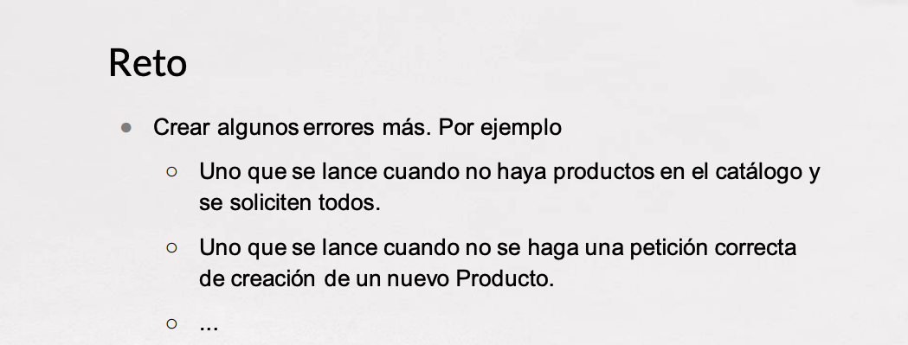
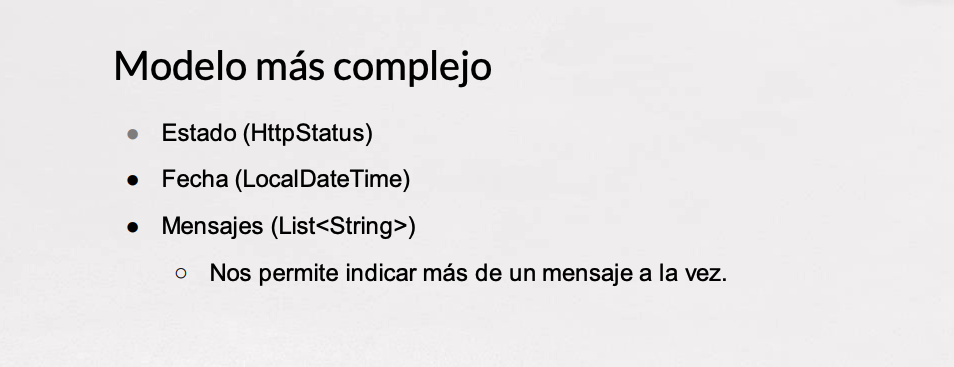
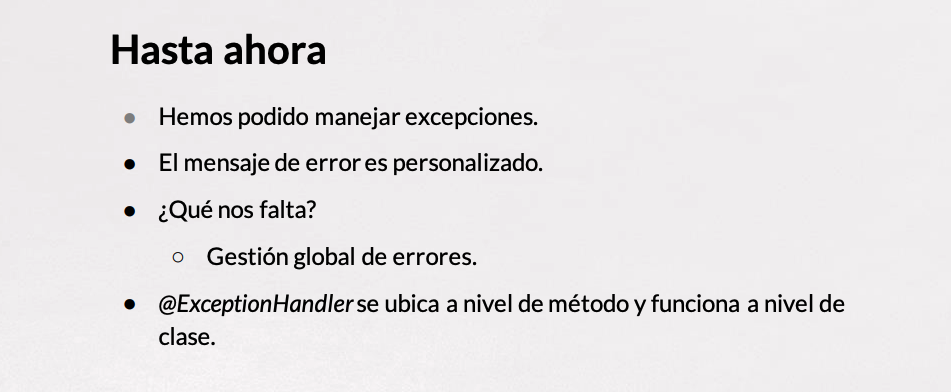
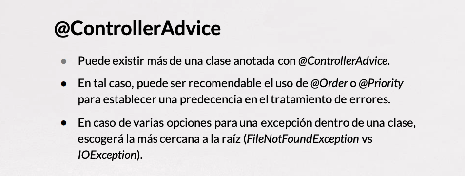
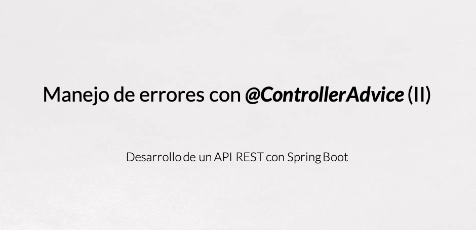
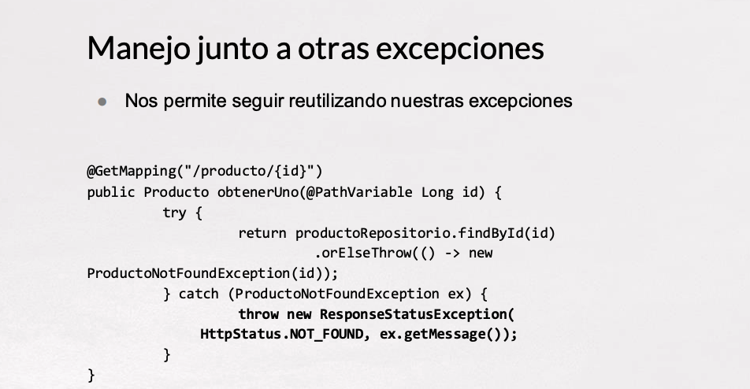

# 3. Manejo de errores y excepciones

* 14 Manejo básico de errores 14:40 
* 15 Modelo para la respuesta de un error 4:58 
* 16 Manejo de errores con @ExceptionHandler 12:25 
* 17 Manejo de errores con @ControllerAdvice (Parte I) 11:22 
* 18 Manejo de errores con @ControllerAdvice (Parte II) 8:06 
* 19 Novedades en Spring 5: ResponseStatusException 12:39 
* Contenido adicional 6

# 14 Manejo básico de errores 14:40 

[PDF Manejo_básico_de_errores.pdf](pdfs/13_Manejo_básico_de_errores.pdf)

## Resumen Profesor

La información sobre la anotación `@ResponseStatus` la puedes encontrar aquí :https://docs.spring.io/spring/docs/current/javadoc-api/org/springframework/web/bind/annotation/ResponseStatus.html.

## Transcripción


Vamos a continuar nuestro curso con un nuevo bloque en el que vamos a ir gestionando las posibles situaciones de error o de excepción que se nos pueden presentar, en esta lección vamos a hacer un manejo elemental de errores e iremos viendo como Spring nos ofrece diferentes alternativas para poder hacer dicha gestión.


La posibles situaciones de error que se nos pueden presentar pueden ser muy variopintas, algunas de ellas vendrán asociadas a la lógica de negocio, por ejemplo imaginemos que nosotros estamos gestionándo los usuarios y no queremos que se repita el nombre de usuario o el email o estamos haciendo un API dónde se gestionan ventas y entonces no queremos dar de alta una ventana vacía en la que no se compre ningún tipo de producto, esas serían situaciones de error asociadas a la lógica de negocio de nuestro sistema, otras también lo serán pero son mucho más comunes, por ejemplo el que vayamos a buscar un recurso, un elemento en nuestro caso por ejemplo un producto, véase por su ID o por algún atributo y que no lo encontremos, eso sería algo muy común, buscar un recurso o sobre un conjunto de recursos y no encontrarlos, es una situación que será bastante común. 


Hasta ahora el tratamiento que hemos hecho es francamente artesanal, si recordáis de las lecciones anteriores hemos ido modulando de alguna manera el `ResposeEntity` que se devolvía, para establecer nosotros el código y si no encontrábamos algo entonces estabamos devolviendo un error `404`, sin embargo eso no estaría excesivamente bien porque no nos deberíamos dedicar a eso, nos deberíamos dedicar a programar, a manejar situaciones excepcionales, posiblemente utilizando el mecanismo de Java y que fuese ese mecanismo de excepciones el que detectará, si no hemos encontrado un producto lanzamos una excepción de producto no encontrado y que a partir de eso se devuelva al cliente la respuesta más conveniente como un `404`, vamos a ver cómo podemos crear excepciones como en cualquier aplicación Java, las podemos aderezar un poco para que la respuesta que se vea sea con el código de respuesta que nosotros queramos.


Por ejemplo podríamos tener una excepción que fuera producto no encontrado, `ProductoNotFoundException` que suele ser un nombre común ese `NotFoundException` suele ser bastante habitual y en el que simplemente podríamos tener un constructor con un método que llame al constructor de la clase base `RuntimeException`  y qué le pasará un determinado mensaje muy sencillo, podríamos entrar en la internacionalización de estos mensajes a través de ficheros properties, yo los dejo a vosotros si queréis saber como internacionalizar podéis visitar el ***curso de Thymelife*** donde los elementos de internacionalización van a ser comunes y a través de las distintas propiedades poder ir rescatarlo, en este caso solo lo vamos a hacer simplemente en castellano y veremos cómo lo que esperamos que de alguna manera ese mensaje llegue al cliente creando una excepción cómo está, lo haremos ahora más adelante, esto nos podría venir bien para peticiones `GET`, peticiones `PUT` y peticiones `DELETE`.


Si lo implementamos vamos a ver como la respuesta al tratarse de una excepción será `500`, veíamos los códigos de respuesta por parte del servidor al cliente y veíamos que había un conjunto, yo os remitía al material adicional donde podéis encontrar una lista completa, les recuerdo que el conjunto `200` son respuesta correctas, el `OK`, `Created`, `Not Content` pero respuestas correctas, los de `400` eran errores por parte del cliente y lo de `500` errores de servidor, bueno en realidad aquí no es que se haya producido ningún tipo de error en el servidor, sino que simplemente no hay productos por el ID que hemos solicitado. Ya hemos visto que un código acertado serían `Not Found` el código con el número `404`, bueno pues vamos a ver cómo Spring tiene la solución para que aunque estemos lanzando una excepción se devuelva un código `404`.


A nivel elemental, es decir lo más básico que tiene Spring para que podamos hacer eso es la anotación `@ResponseStatus` que nos va a permitir anotar una excepción y bueno cuando se lance esa excepción de alguna manera se va a capturar que la respuesta debe llevar un código de respuesta como el que le estamos proporcionando en la propia excepción,




# 15 Modelo para la respuesta de un error 4:58 

[PDF Modelo_de_respuesta_para_un_error.pdf](pdfs/14_Modelo_de_respuesta_para_un_error.pdf)

## Resumen Profesor

### Modelo de error más complejo

Algunos autores, como `Bruno Leite`, proponen una implementación del modelo de respuesta más complejo como esta:

```java
class ApiError {

   private HttpStatus status;
   @JsonFormat(shape = JsonFormat.Shape.STRING, pattern = "dd-MM-yyyy hh:mm:ss")
   private LocalDateTime timestamp;
   private String message;
   private String debugMessage;
   private List<ApiSubError> subErrors;

   private ApiError() {
       timestamp = LocalDateTime.now();
   }

   ApiError(HttpStatus status) {
       this();
       this.status = status;
   }

   ApiError(HttpStatus status, Throwable ex) {
       this();
       this.status = status;
       this.message = "Unexpected error";
       this.debugMessage = ex.getLocalizedMessage();
   }

   ApiError(HttpStatus status, String message, Throwable ex) {
       this();
       this.status = status;
       this.message = message;
       this.debugMessage = ex.getLocalizedMessage();
   }
}
 
abstract class ApiSubError {

}

@Data
@EqualsAndHashCode(callSuper = false)
@AllArgsConstructor
class ApiValidationError extends ApiSubError {
   private String object;
   private String field;
   private Object rejectedValue;
   private String message;

   ApiValidationError(String object, String message) {
       this.object = object;
       this.message = message;
   }
}
```
## Transcripción





# 16 Manejo de errores con `@ExceptionHandler` 12:25 

[PDF ExceptionHandler.pdf](pdfs/15_ExceptionHandler.pdf)

## Resumen Profesor

La información sobre la anotación `@ExceptionHandler` la puedes encontrar aquí: https://docs.spring.io/spring-framework/docs/current/javadoc-api/org/springframework/web/bind/annotation/ExceptionHandler.html.

## Transcripción


# 17 Manejo de errores con `@ControllerAdvice` (Parte I) 11:22 

[PDF ControllerAdvice.pdf](pdfs/16_ControllerAdvice.pdf)

## Resumen Profesor

La información sobre la clase `ResponseEntityExceptionHandler` la puedes encontrar aquí: https://docs.spring.io/spring-framework/docs/current/javadoc-api/org/springframework/web/servlet/mvc/method/annotation/ResponseEntityExceptionHandler.html

## Transcripción







# 18 Manejo de errores con `@ControllerAdvice (Parte II)` 8:06 

[PDF Controller_Advice_II.pdf](pdfs/17_Controller_Advice_II.pdf)

## Resumen Profesor

No existe.

## Transcripción




# 19 Novedades en Spring 5: ResponseStatusException 12:39 

[PDF ResponseStatusException.pdf](pdfs/18_ResponseStatusException.pdf)

## Resumen Profesor

La información sobre la clase `ResponseStatusException` la puedes encontrar aquí: https://docs.spring.io/spring-framework/docs/current/javadoc-api/org/springframework/web/server/ResponseStatusException.html.

Puede ser interesante fijarse en algunas de sus subclases:

* `MediaTypeNotSupportedStatusException`: excepción que encaja con el código de respuesta 415.
* `MethodNotAllowedException`: excepción que encaja con el código de respuesta 405.
* `NotAcceptableStatusException`: excepción que encaja con el código de respuesta 406
* `ServerErrorException`: excepción para el código 500 que expone información extra.
* `ServerWebInputException`: excepción que encaja con el código de respuesta 400 para ser usada en aplicaciones web.
* `UnsupportedMediaTypeStatusException`: excepción que encaja con el código de respuesta 415.

## Transcripción





# Contenido adicional 6

* [PDF Manejo_básico_de_errores.pdf](pdfs/13_Manejo_básico_de_errores.pdf)
* [PDF Modelo_de_respuesta_para_un_error.pdf](pdfs/14_Modelo_de_respuesta_para_un_error.pdf)
* [PDF ExceptionHandler.pdf](pdfs/15_ExceptionHandler.pdf)
* [PDF ControllerAdvice.pdf](pdfs/16_ControllerAdvice.pdf)
* [PDF Controller_Advice_II.pdf](pdfs/17_Controller_Advice_II.pdf)
* [PDF ResponseStatusException.pdf](pdfs/18_ResponseStatusException.pdf)
