# 3. Manejo de errores y excepciones

* 14 Manejo básico de errores 14:40 
* 15 Modelo para la respuesta de un error 4:58 
* 16 Manejo de errores con @ExceptionHandler 12:25 
* 17 Manejo de errores con @ControllerAdvice (Parte I) 11:22 
* 18 Manejo de errores con @ControllerAdvice (Parte II) 8:06 
* 19 Novedades en Spring 5: ResponseStatusException 12:39 
* Contenido adicional 6

# 14 Manejo básico de errores 14:40 

[PDF Manejo_básico_de_errores.pdf](pdfs/13_Manejo_básico_de_errores.pdf)

## Resumen Profesor

La información sobre la anotación `@ResponseStatus` la puedes encontrar aquí :https://docs.spring.io/spring/docs/current/javadoc-api/org/springframework/web/bind/annotation/ResponseStatus.html.

## Transcripción

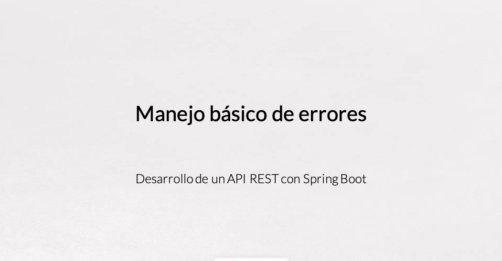

Vamos a continuar nuestro curso con un nuevo bloque en el que vamos a ir gestionando las posibles situaciones de error o de excepción que se nos pueden presentar, en esta lección vamos a hacer un manejo elemental de errores e iremos viendo como Spring nos ofrece diferentes alternativas para poder hacer dicha gestión.


La posibles situaciones de error que se nos pueden presentar pueden ser muy variopintas, algunas de ellas vendrán asociadas a la lógica de negocio, por ejemplo imaginemos que nosotros estamos gestionándo los usuarios y no queremos que se repita el nombre de usuario o el email o estamos haciendo un API dónde se gestionan ventas y entonces no queremos dar de alta una ventana vacía en la que no se compre ningún tipo de producto, esas serían situaciones de error asociadas a la lógica de negocio de nuestro sistema, otras también lo serán pero son mucho más comunes, por ejemplo el que vayamos a buscar un recurso, un elemento en nuestro caso por ejemplo un producto, véase por su ID o por algún atributo y que no lo encontremos, eso sería algo muy común, buscar un recurso o sobre un conjunto de recursos y no encontrarlos, es una situación que será bastante común. 


Hasta ahora el tratamiento que hemos hecho es francamente artesanal, si recordáis de las lecciones anteriores hemos ido modulando de alguna manera el `ResposeEntity` que se devolvía, para establecer nosotros el código y si no encontrábamos algo entonces estabamos devolviendo un error `404`, sin embargo eso no estaría excesivamente bien porque no nos deberíamos dedicar a eso, nos deberíamos dedicar a programar, a manejar situaciones excepcionales, posiblemente utilizando el mecanismo de Java y que fuese ese mecanismo de excepciones el que detectará, si no hemos encontrado un producto lanzamos una excepción de producto no encontrado y que a partir de eso se devuelva al cliente la respuesta más conveniente como un `404`, vamos a ver cómo podemos crear excepciones como en cualquier aplicación Java, las podemos aderezar un poco para que la respuesta que se vea sea con el código de respuesta que nosotros queramos.


Por ejemplo podríamos tener una excepción que fuera producto no encontrado, `ProductoNotFoundException` que suele ser un nombre común ese `NotFoundException` suele ser bastante habitual y en el que simplemente podríamos tener un constructor con un método que llame al constructor de la clase base `RuntimeException`  y qué le pasará un determinado mensaje muy sencillo, podríamos entrar en la internacionalización de estos mensajes a través de ficheros properties, yo los dejo a vosotros si queréis saber como internacionalizar podéis visitar el ***curso de Thymelife*** donde los elementos de internacionalización van a ser comunes y a través de las distintas propiedades poder ir rescatarlo, en este caso solo lo vamos a hacer simplemente en castellano y veremos cómo lo que esperamos que de alguna manera ese mensaje llegue al cliente creando una excepción cómo está, lo haremos ahora más adelante, esto nos podría venir bien para peticiones `GET`, peticiones `PUT` y peticiones `DELETE`.


Si lo implementamos vamos a ver como la respuesta al tratarse de una excepción será `500`, veíamos los códigos de respuesta por parte del servidor al cliente y veíamos que había un conjunto, yo os remitía al material adicional donde podéis encontrar una lista completa, les recuerdo que el conjunto `200` son respuesta correctas, el `OK`, `Created`, `Not Content` pero respuestas correctas, los de `400` eran errores por parte del cliente y lo de `500` errores de servidor, bueno en realidad aquí no es que se haya producido ningún tipo de error en el servidor, sino que simplemente no hay productos por el ID que hemos solicitado. Ya hemos visto que un código acertado serían `Not Found` el código con el número `404`, bueno pues vamos a ver cómo Spring tiene la solución para que aunque estemos lanzando una excepción se devuelva un código `404`.


A nivel elemental, es decir lo más básico que tiene Spring para que podamos hacer eso es la anotación `@ResponseStatus` que nos va a permitir anotar una excepción y cuando se lance esa excepción de alguna manera se va a capturar que la respuesta debe llevar un código de respuesta como el que le estamos proporcionando en la propia excepción, también podríamos añadir un mensaje, lo que pasa que aquí el mensaje lo estamos indicando dentro de la propia excepción así que por eso no lo vamos a hacer, pero anotando esta excepción, ahora lo vamos a hacer en un ejemplo, vamos a poder comprobar como el código de respuesta que obtendríamos sería un `404` y no un `500`, para ello vamos ir modificando el código que habíamos hecho en la lección anterior y en lugar de manejar con `if-else`y en función de una cosa u otra devolver dos tipos de `ResponseEntity` lo vamos a simplificar para que lo hagamos gestionando excepciones y de esa manera si por ejemplo no encontramos un producto devolvamos la excepción y sea la excepción la que devuelva la respuesta correcta.

### :computer: `143-05-ManejoBasicoErrores` Ejemplo para manejar Excepciónes

Partiendo del proyecto `143-04-ImplementacionDTO` vamos a hacer una copia y renombrar el proyecto como `143-05-ManejoBasicoErrores`

#### 01. Modificar `pom.xml`

Cambiar en el `pom.xml` el `artifactId` y el `name`

```html
...
<artifactId>143-05-ManejoBasicoErrores</artifactId>
<version>0.0.1-SNAPSHOT</version>
<name>143-05-ManejoBasicoErrores</name>
...
```

#### 02. Crear la Clase `ProductoNotFoundException`

Dentro del paquete `error` donde vamos ir poniendo cuestiones de error o de excepciones vamos a crear la clase `ProductoNotFoundException`.

`ProductoNotFoundException`

```java
@ResponseStatus(HttpStatus.NOT_FOUND)
public class ProductoNotFoundException extends RuntimeException{

   private static final long serialVersionUID = 1L;

   public ProductoNotFoundException(Long id) {
      super("No se puede encontrar el producto con el ID: " + id);
   }
}
```

Observaciones de `ProductoNotFoundException`

* Extiende a `RuntimeException`
* Añadimos el `serialVersionUID` por si la clase es serializable
* Creamos el constructor que recibe el ID del producto no encontrado y creamos un mensaje a partir de el.
* Anotamos la clase con `@ResponseStatus(HttpStatus.NOT_FOUND)` que nos permite indicar el estado `NOT_FOUND` que indicará que no hemos encontrado el producto.

De esta manera cuando devolvamos la excepción será un código `404` el que reciba el cliente.

#### 03. Modificar el Controlador 


Actualente tenemos nuestro método `obtenerUno` con el siguiente código:

```java
@GetMapping("/producto/{id}")
public ResponseEntity<?> obtenerUno(@PathVariable Long id) {
   Producto result = productoRepositorio.findById(id).orElse(null);
	if (result == null)
      return ResponseEntity.notFound().build();
   else
      return ResponseEntity.ok(result);
}
```

Lo vamos a refactorizar por lo siguiente:

```java
@GetMapping("/producto/{id}")
public Producto obtenerUno(@PathVariable Long id) {
   return productoRepositorio.findById(id)
              .orElseThrow(() -> new ProductoNotFoundException(id));
}
```

Observaciones.

* `findById(id)` nos devuelve un Optional por lo que si lo encuentra devolvemos el `Producto`
* Si no lo encuentra en lugar de usar el `.orElse(...)` normal, hay otro que es `.orElseThrow(...)`
* `.orElseThrow(...)` nos permite poder lanzar una excepción. 
* `.orElseThrow(...)` lo que espera es un `Supplier` es decir lo tenemos que realizar con una expresión lambda.
* Debemos devolver un `Producto` en lugar del `ResponseEntity` que usabamos antes.

Así que si encuentra el `Producto` lo devuelve con un código `200` y si no lanzará una excepción.

Vamos a comprobar que esto funciona y después hacemos el resto de cambios en el código.


Si nos venimos a Postman podríamos buscar el producto 4.


Lo encontraríamos perfectamente, si buscamos el 44.

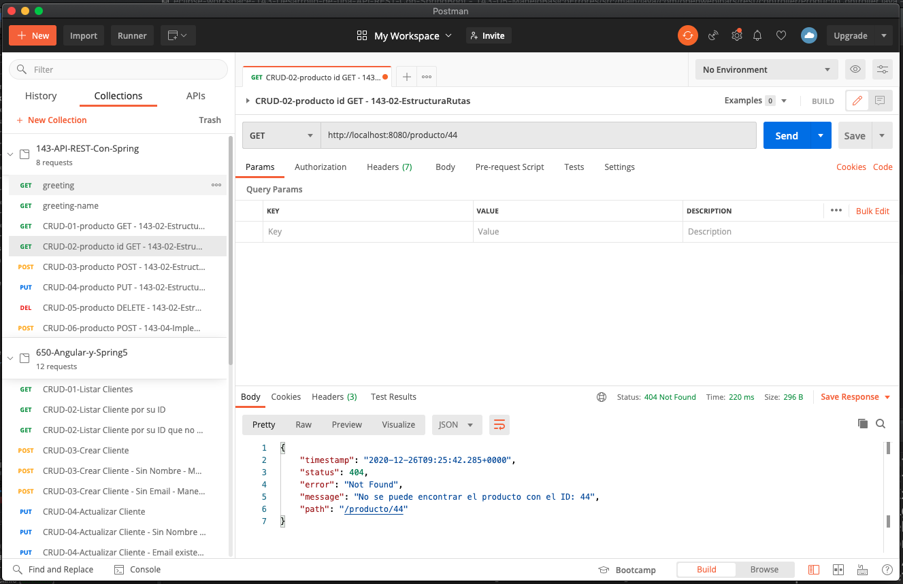

Podemos ver cómo se ha producido una excepción, la respuesta es diferente nos da algo así como el momento en el que se produce la excepción, el código de estado, el error, el mensaje que le hemos proporcionado nosotros `"No se puede encontrar el producto con el ID: 44"`, y el `path` sobre el que se ha producido el error.

```html
{
   "timestamp": "2020-12-26T09:25:42.285+0000",
   "status": 404,
   "error": "Not Found",
   "message": "No se puede encontrar el producto con el ID: 44",
   "path": "/producto/44"
}
```

De esta manera podemos comprobar como estamos obteniendo un mensaje de error y el cliente lo podría aprovechar para incluso el mensaje `"No se puede encontrar el producto con el ID: 44"` poder imprimirlo al usuario, indicándole que no se han podido encontrar el producto con ese ID o alguna otra versión de este mismo mensaje.

El otro cambio que podemos hacer es sombre el método `editarProducto(...)` que actualmente lo tenemos así:

```java
@PutMapping("/producto/{id}")
public ResponseEntity<?> editarProducto(@RequestBody Producto editar, @PathVariable Long id) {

   return productoRepositorio.findById(id).map(p -> {
			p.setNombre(editar.getNombre());
			p.setPrecio(editar.getPrecio());
			return ResponseEntity.ok(productoRepositorio.save(p));
		}).orElseGet(() -> {
			return ResponseEntity.notFound().build();
   });
}
```

En lugar de devolver un `ResponseEntity` y hacer un `orElseGet(...)`, podemos cambiarlo por lo siguiente:

```java
@PutMapping("/producto/{id}")
public Producto editarProducto(@RequestBody Producto editar, @PathVariable Long id) {

   return productoRepositorio.findById(id).map(p -> {
			p.setNombre(editar.getNombre());
			p.setPrecio(editar.getPrecio());
			return productoRepositorio.save(p);
   }).orElseThrow(() -> new ProductoNotFoundException(id));
}
```

Observaciones:

* En caso de que lo encuentre en lugar de devolver el `ResponseEntity` devolvemos el `Producto` recien guardado.
* Si no lo encuentra devuelve un `ProductoNotFoundException`.
* El método ya no devuelve un `ResponseEntity` sino un `Producto`.

De esta forma si se encuentra el `Producto` se edita y se devuelve y sino lanzamos un `ProductoNotFoundException`.

Vamos a hacer también el codigo para el método `borrarProducto(...)` que actualmente lo tenemos así:

```java
@DeleteMapping("/producto/{id}")
public ResponseEntity<?> borrarProducto(@PathVariable Long id) {
   productoRepositorio.deleteById(id);
   return ResponseEntity.noContent().build();
}
```

Si queremos mamejar la situación de que no encontramos el `Producto` a eliminar vamos a cambiarlo como sigue:

```java
@DeleteMapping("/producto/{id}")
public ResponseEntity<?> borrarProducto(@PathVariable Long id) {
   Producto producto = productoRepositorio.findById(id)
				.orElseThrow(() -> new ProductoNotFoundException(id));
		
   productoRepositorio.delete(producto);
	return ResponseEntity.noContent().build();
}
```

Observaciones:

* Primero buscamos el `Producto` y si no lo encontramos devuelve un `ProductoNotFoundException`.
* Si lo encuentra lo elimina y devolvemos `ResponseEntity.noContent().build();`
* Estamos dejando como respuesta del método un `ResponseEntity` para la respuesta correcta.

Vamos a probar nuestros cambios.

Primero creamos un nuevo producto.

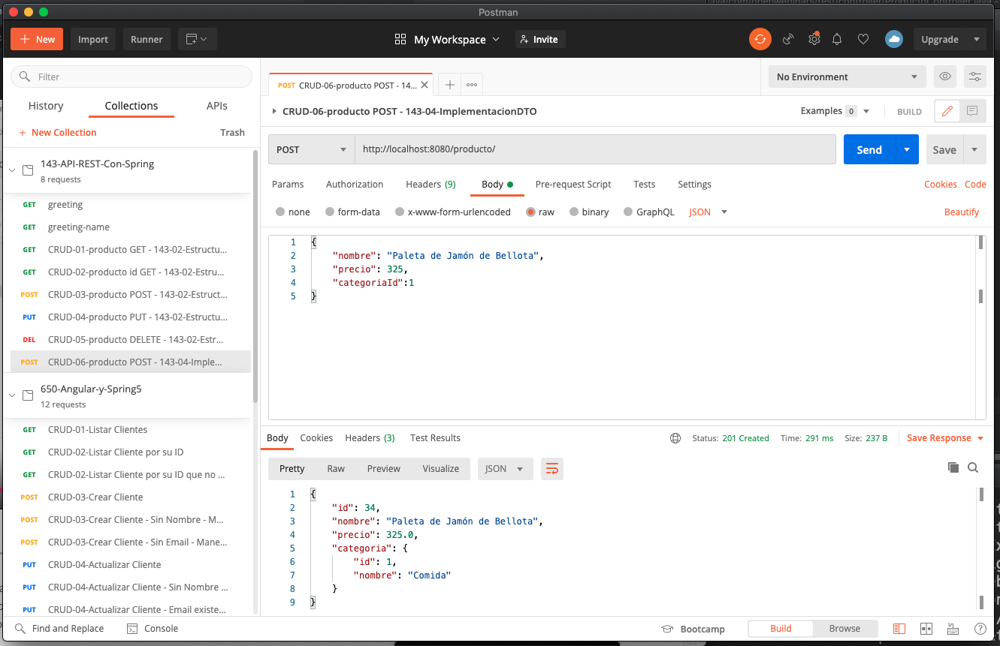

Ahora vamos a hacer el `PUT` para modificar el producto.

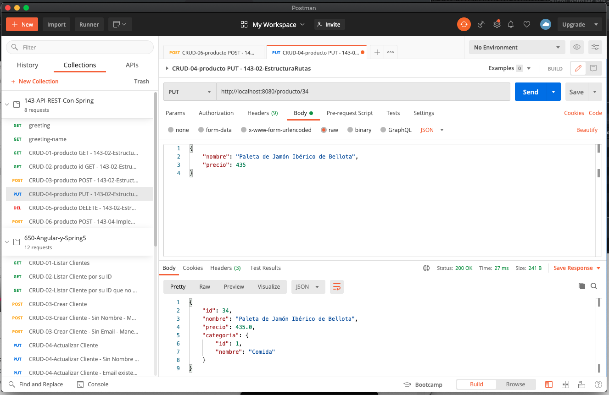

Si intentamos modificar un `Producto` que no existe tenemos:


Nos devuelve lo esperado.

Y si tratamos de eliminar el `Producto` 34

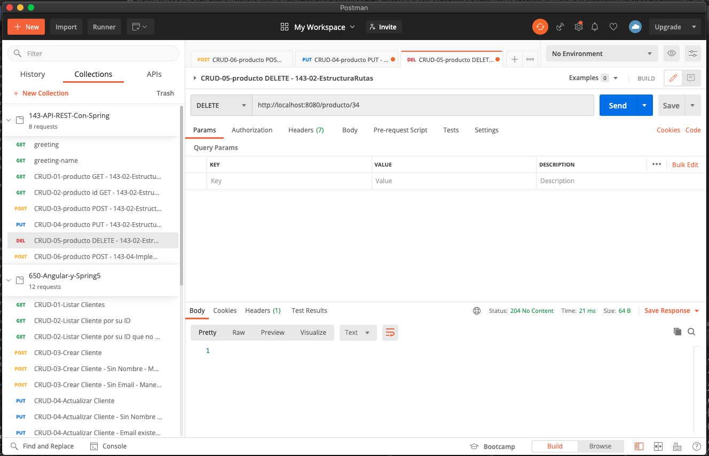

Lo elimina correctamente y si lo intento borrar nuevamente ya me devuelve un `404` que es lo correcto junto con el mensaje.

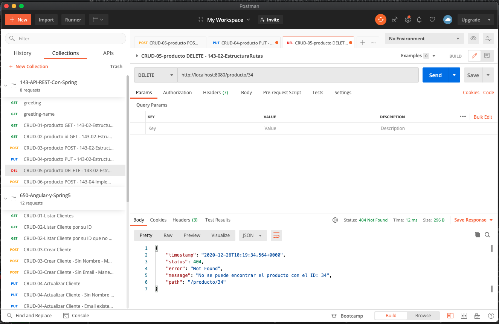

De esta manera como podemos comprobar podemos asociar el mecanismo de manejo de excepciones de Java cortocircuitandolo de determinada manera con Spring para que produzca una un mensaje, un código de respuesta más adecuada.

### :computer: Código Completo `143-05-ManejoBasicoErrores` Ejemplo para manejar Excepciónes


Vamos a poner solo el código de las clases nuevas o modificadas respecto al proyecto anterior.

`ProductoNotFoundException`

```java
package com.openwebinars.rest.error;

import org.springframework.http.HttpStatus;
import org.springframework.web.bind.annotation.ResponseStatus;

@ResponseStatus(HttpStatus.NOT_FOUND)
public class ProductoNotFoundException extends RuntimeException{

   private static final long serialVersionUID = 1L;

   public ProductoNotFoundException(Long id) {
      super("No se puede encontrar el producto con el ID: " + id);
   }
}
```

`ProductoController`

```java
package com.openwebinars.rest.controller;

import java.util.List;
import java.util.stream.Collectors;

import org.springframework.http.HttpStatus;
import org.springframework.http.ResponseEntity;
import org.springframework.web.bind.annotation.DeleteMapping;
import org.springframework.web.bind.annotation.GetMapping;
import org.springframework.web.bind.annotation.PathVariable;
import org.springframework.web.bind.annotation.PostMapping;
import org.springframework.web.bind.annotation.PutMapping;
import org.springframework.web.bind.annotation.RequestBody;
import org.springframework.web.bind.annotation.RestController;

import com.openwebinars.rest.dto.CreateProductoDTO;
import com.openwebinars.rest.dto.ProductoDTO;
import com.openwebinars.rest.dto.converter.ProductoDTOConverter;
import com.openwebinars.rest.error.ProductoNotFoundException;
import com.openwebinars.rest.modelo.Categoria;
import com.openwebinars.rest.modelo.CategoriaRepositorio;
import com.openwebinars.rest.modelo.Producto;
import com.openwebinars.rest.modelo.ProductoRepositorio;

import lombok.RequiredArgsConstructor;

@RestController
@RequiredArgsConstructor
public class ProductoController {

   private final ProductoRepositorio productoRepositorio;
   private final CategoriaRepositorio categoriaRepositorio;
   private final ProductoDTOConverter productoDTOConverter;

   /**
    * Obtenemos todos los productos
    * 
    * @return 404 si no hay productos, 200 y lista de productos si hay uno o más
    */
   @GetMapping("/producto")
   public ResponseEntity<?> obtenerTodos() {
      List<Producto> result = productoRepositorio.findAll();

      if (result.isEmpty()) {
         return ResponseEntity.notFound().build();
      } else {

         List<ProductoDTO> dtoList = result.stream().map(productoDTOConverter::convertToDto)
					.collect(Collectors.toList());
         return ResponseEntity.ok(dtoList);
      }

   }

   /**
    * Obtenemos un producto en base a su ID
    * 
    * @param id
    * @return 404 si no encuentra el producto, 200 y el producto si lo encuentra
    */
   @GetMapping("/producto/{id}")
   public Producto obtenerUno(@PathVariable Long id) {
      return productoRepositorio.findById(id)
				.orElseThrow(() -> new ProductoNotFoundException(id));
   }

   /**
    * Insertamos un nuevo producto
    * 
    * @param nuevo
    * @return 201 y el producto insertado
    */
   @PostMapping("/producto")
   public ResponseEntity<?> nuevoProducto(@RequestBody CreateProductoDTO nuevo) {
      // En este caso, para contrastar, lo hacemos manualmente
		
      // Este código sería más propio de un servicio. Lo implementamos aquí
      // por no hacer más complejo el ejercicio.
      Producto nuevoProducto = new Producto();
      nuevoProducto.setNombre(nuevo.getNombre());
      nuevoProducto.setPrecio(nuevo.getPrecio());
      Categoria categoria = categoriaRepositorio.findById(nuevo.getCategoriaId()).orElse(null);
      nuevoProducto.setCategoria(categoria);
      return ResponseEntity.status(HttpStatus.CREATED).body(productoRepositorio.save(nuevoProducto));
   }

   /**
    * 
    * @param editar
    * @param id
    * @return 200 Ok si la edición tiene éxito, 404 si no se encuentra el producto
    */
   @PutMapping("/producto/{id}")
   public Producto editarProducto(@RequestBody Producto editar, @PathVariable Long id) {

      return productoRepositorio.findById(id).map(p -> {
			p.setNombre(editar.getNombre());
			p.setPrecio(editar.getPrecio());
			return productoRepositorio.save(p);
		}).orElseThrow(() -> new ProductoNotFoundException(id));
   }

   /**
    * Borra un producto del catálogo en base a su id
    * 
    * @param id
    * @return Código 204 sin contenido
    */
   @DeleteMapping("/producto/{id}")
   public ResponseEntity<?> borrarProducto(@PathVariable Long id) {
      Producto producto = productoRepositorio.findById(id)
				.orElseThrow(() -> new ProductoNotFoundException(id));
		
      productoRepositorio.delete(producto);
      return ResponseEntity.noContent().build();
   }

}
```


Llegado este punto os propongo como reto que podáis crear algún tipo de error más, por ejemplo uno que se lance cuando no haya productos en el catálogo y se solicite todos, es posible que podíamos devolver el `404`, podrían crear otra excepción que sería `CatalogoProductosVaciosException` o algo por el estilo o por ejemplo también podrían bien gestionar bien la creación de un nuevo producto y si hay algo, algún dato que esperamos y que no viene o algo por el estilo, crear una excepción también que devolviera el código correcto que en este caso sería un `Bad Request` un `400`. Esto como reto para que lo podáis ir haciendo vosotros.

En las siguientes lecciones de este bloque vamos a seguir manejando errores de otras maneras que nos ofrece Spring.

# 15 Modelo para la respuesta de un error 4:58 

[PDF Modelo_de_respuesta_para_un_error.pdf](pdfs/14_Modelo_de_respuesta_para_un_error.pdf)

## Resumen Profesor

### Modelo de error más complejo

Algunos autores, como `Bruno Leite`, proponen una implementación del modelo de respuesta más complejo como esta:

```java
class ApiError {

   private HttpStatus status;
   @JsonFormat(shape = JsonFormat.Shape.STRING, pattern = "dd-MM-yyyy hh:mm:ss")
   private LocalDateTime timestamp;
   private String message;
   private String debugMessage;
   private List<ApiSubError> subErrors;

   private ApiError() {
       timestamp = LocalDateTime.now();
   }

   ApiError(HttpStatus status) {
       this();
       this.status = status;
   }

   ApiError(HttpStatus status, Throwable ex) {
       this();
       this.status = status;
       this.message = "Unexpected error";
       this.debugMessage = ex.getLocalizedMessage();
   }

   ApiError(HttpStatus status, String message, Throwable ex) {
       this();
       this.status = status;
       this.message = message;
       this.debugMessage = ex.getLocalizedMessage();
   }
}
 
abstract class ApiSubError {

}

@Data
@EqualsAndHashCode(callSuper = false)
@AllArgsConstructor
class ApiValidationError extends ApiSubError {
   private String object;
   private String field;
   private Object rejectedValue;
   private String message;

   ApiValidationError(String object, String message) {
       this.object = object;
       this.message = message;
   }
}
```
## Transcripción


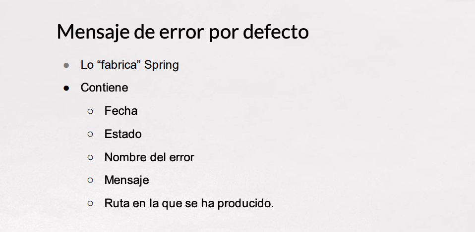


```java
```


# 16 Manejo de errores con `@ExceptionHandler` 12:25 

[PDF ExceptionHandler.pdf](pdfs/15_ExceptionHandler.pdf)

## Resumen Profesor

La información sobre la anotación `@ExceptionHandler` la puedes encontrar aquí: https://docs.spring.io/spring-framework/docs/current/javadoc-api/org/springframework/web/bind/annotation/ExceptionHandler.html.

## Transcripción


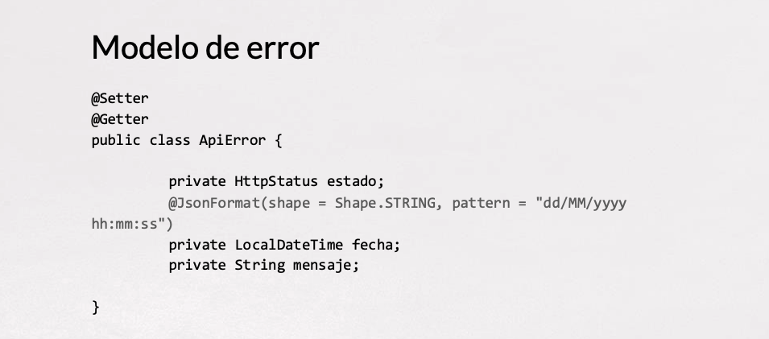

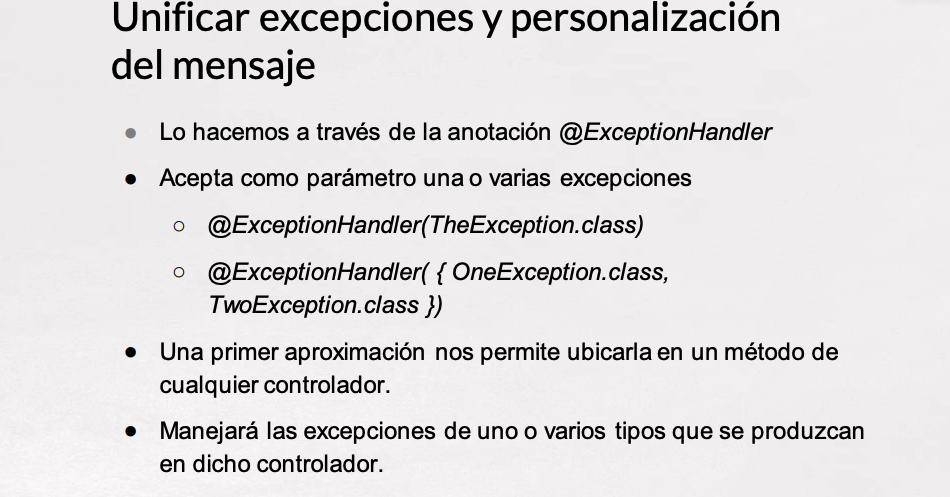

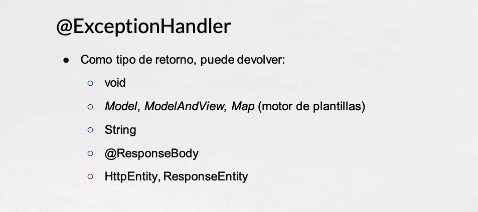
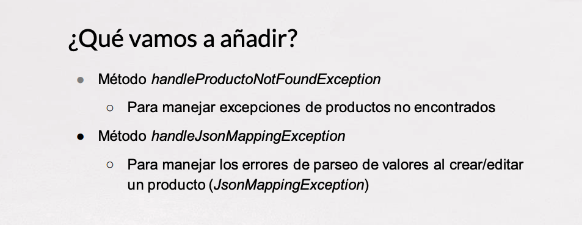

# 17 Manejo de errores con `@ControllerAdvice` (Parte I) 11:22 

[PDF ControllerAdvice.pdf](pdfs/16_ControllerAdvice.pdf)

## Resumen Profesor

La información sobre la clase `ResponseEntityExceptionHandler` la puedes encontrar aquí: https://docs.spring.io/spring-framework/docs/current/javadoc-api/org/springframework/web/servlet/mvc/method/annotation/ResponseEntityExceptionHandler.html

## Transcripción


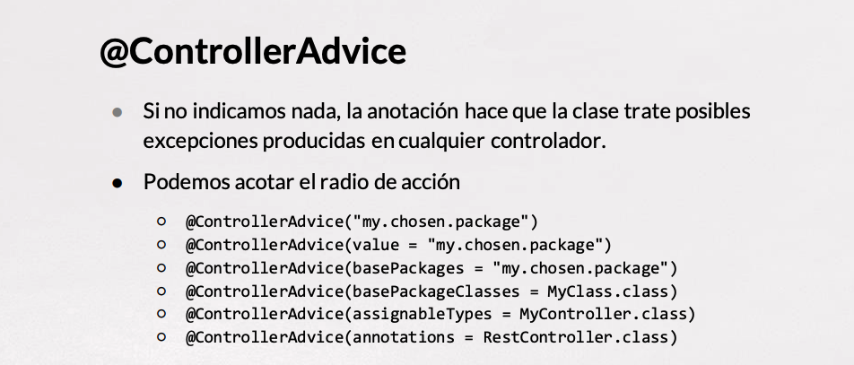
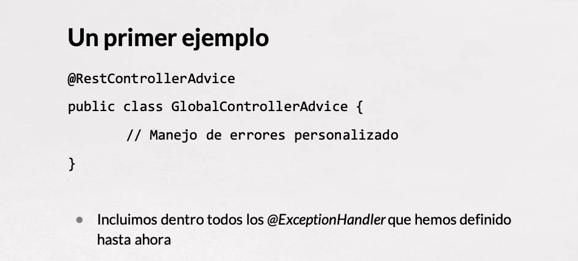
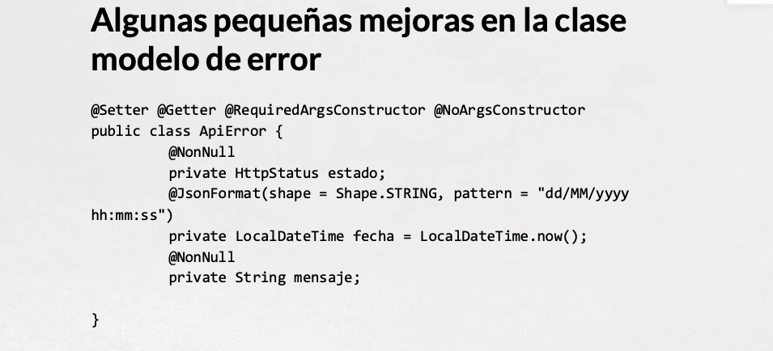


# 18 Manejo de errores con `@ControllerAdvice (Parte II)` 8:06 

[PDF Controller_Advice_II.pdf](pdfs/17_Controller_Advice_II.pdf)

## Resumen Profesor

No existe.

## Transcripción


# 19 Novedades en Spring 5: ResponseStatusException 12:39 

[PDF ResponseStatusException.pdf](pdfs/18_ResponseStatusException.pdf)

## Resumen Profesor

La información sobre la clase `ResponseStatusException` la puedes encontrar aquí: https://docs.spring.io/spring-framework/docs/current/javadoc-api/org/springframework/web/server/ResponseStatusException.html.

Puede ser interesante fijarse en algunas de sus subclases:

* `MediaTypeNotSupportedStatusException`: excepción que encaja con el código de respuesta 415.
* `MethodNotAllowedException`: excepción que encaja con el código de respuesta 405.
* `NotAcceptableStatusException`: excepción que encaja con el código de respuesta 406
* `ServerErrorException`: excepción para el código 500 que expone información extra.
* `ServerWebInputException`: excepción que encaja con el código de respuesta 400 para ser usada en aplicaciones web.
* `UnsupportedMediaTypeStatusException`: excepción que encaja con el código de respuesta 415.

## Transcripción


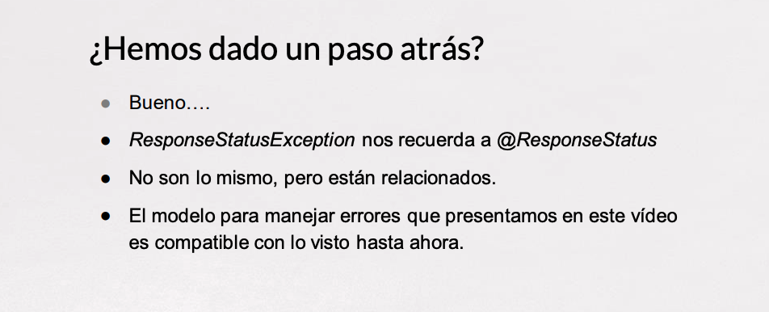

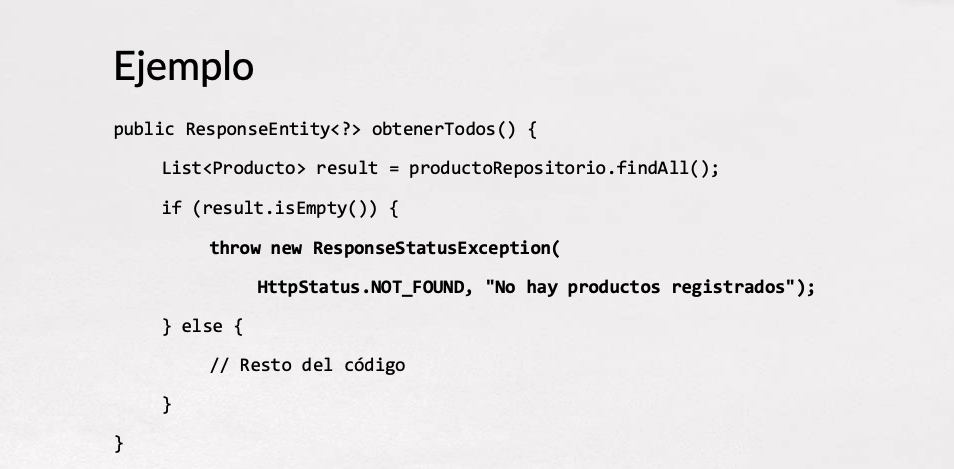


# Contenido adicional 6

* [PDF Manejo_básico_de_errores.pdf](pdfs/13_Manejo_básico_de_errores.pdf)
* [PDF Modelo_de_respuesta_para_un_error.pdf](pdfs/14_Modelo_de_respuesta_para_un_error.pdf)
* [PDF ExceptionHandler.pdf](pdfs/15_ExceptionHandler.pdf)
* [PDF ControllerAdvice.pdf](pdfs/16_ControllerAdvice.pdf)
* [PDF Controller_Advice_II.pdf](pdfs/17_Controller_Advice_II.pdf)
* [PDF ResponseStatusException.pdf](pdfs/18_ResponseStatusException.pdf)
