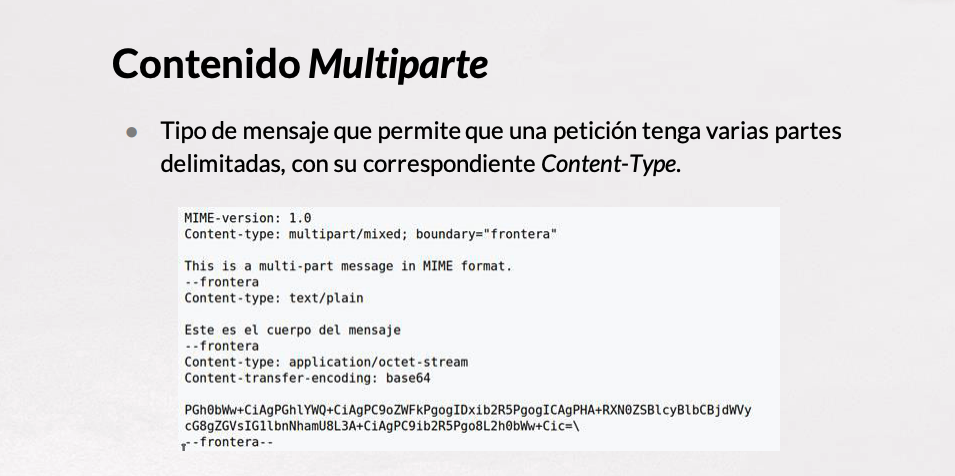
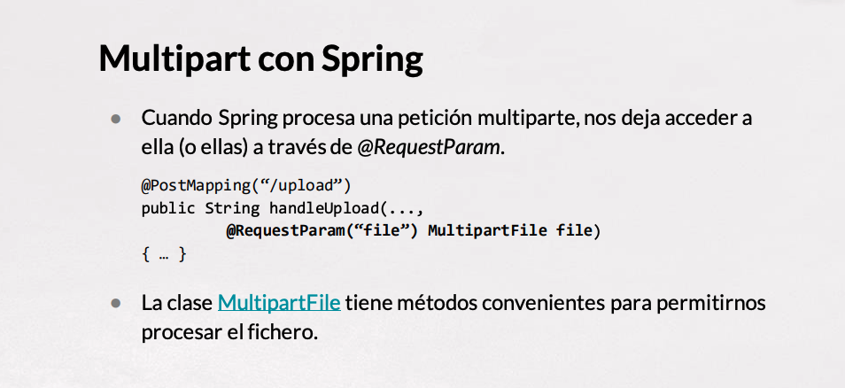
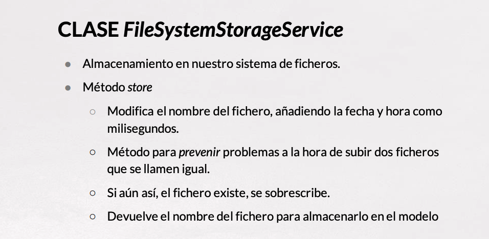
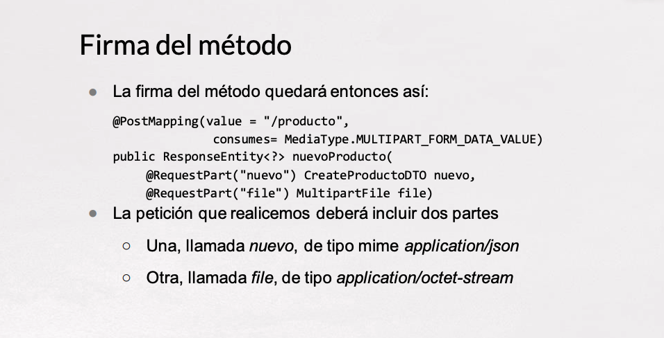
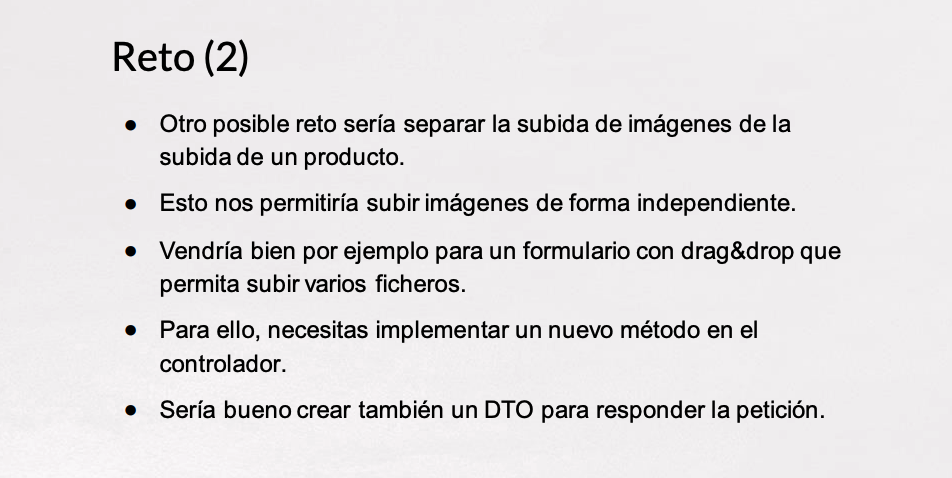
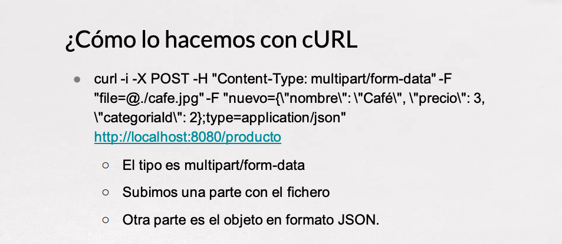

# 5. Subida de ficheros 31m

* 23 Servicio de subida 8:07 
* 24 Implementación de la subida de ficheros 17:45 
* 25 Uso del servicio 5:13 
* Contenido adicional 3

# 23 Servicio de subida 8:07

[PDF Servicio_de_subida_de_ficheros.pdf](pdfs/22_Servicio_de_subida_de_ficheros.pdf)

## Resumen Profesor

El código en el que nos hemos basado para implementar este ejemplo es una guía oficial de Spring: https://spring.io/guides/gs/uploading-files/.

## Transcripción

Hola a todos vamos a continuar con nuestro curso de desarrollo de una pirueta no estoy en book íbamos a abrir un nuevo bloque en el que vamos a poder implementar la subida de ficheros a nuestra cierre mamá implementar un servicio de subida de ficheros tenemos que comenzar hablando entonces en el marco del protocolo HTTP de las peticiones o contenido multipark hasta ahora todos los mensajes que hemos hecho eran mensajes que bueno en su cuerpo tenían miramos que un bloque un monolito una sola parte aunque fuesen diferentes campos diferentes tipos de atributos si queremos enviar diferentes tipo de contenido contenido con diferente ContentType deberíamos implementarlo a través de contenidos multiparte en realidad es otro tipo de contenido el multiparte que nos permite definir en el cuerpo de una petición diferentes partes cada una de ellas con su contenta delimitada por una frontera y que nos permitiría enviar texto plano nos permitiría enviar por ejemplo un fichero más texto plano otro fichero otro tipo de tipo anime una imagen lo podríamos mezclar todo y dentro del cuerpo se irían estableciendo diferentes partes cada una delimitada por sus fronteras spring nos permite implementar multipark a través de dos anotaciones en este caso hablaremos con Rico es para se podría hacer también con rico Spark y nos va a permitir con Rico es para y la clase multipartfile el poder recibir que nos inyecte en un método del controlador en ese multipartfile un fichero que hayamos subido desde una determinada petición vamos a ver multipartfile su documentación podemos ver qué es un fichero por ahora en un sitio temporal y que nos debería vamos nosotros nos debemos encargar de copiarlo en un sitio persistente vallados necesitemos quizá también en otro sitio temporal y que nos permite acceder o no puedes por diferentes vías al fichero y algunos de sus metadatos no y de esta manera nosotros podremos recoger este fichero y almacenarlo en un sitio conveniente dónde lo almacenamos bueno pues en el propio proyecto como haremos nosotros ahora es fácil para aprender para poder separarnos de otro elemento cómo sería subirlo un servicio externo en una aplicación en producción sería lo ideal el tener algún tipo de nube Amazon a surdrive a algún tipo de almacenamiento por ejemplo pongo Divinity el gris FS también lisos solamente imágenes podríamos tener algún contratado algún paquete con Ing seguro alguno de estos servidores de subida de imágenes que a través de su API pues nos permitirían rebotar la subida y guardarla allí nosotros como nos vamos a centrar en la parte de los controladores pues no lo haremos en el propio proyecto y lo haremos a partir de un ejemplo que spring ofrece en su web vale aquí tenéis el enlace de la guía por aquí lo que vengáis de haber hecho también alguno de los cursos de spinning nota English lo habréis encontrado por allí porque en la misma implementación que vamos siguiendo y por lo menos lo que es la parte del servicio de implementacion la podríamos seguir a partir del código que no crece es ejemplo en el que bueno pues tenemos un controlador dónde se suben los distintos los distintos ficheros vale y bueno tendríamos una interfaz de almacenamiento de ficheros esto nos va a permitir el que utilicemos ahora mismo en almacenamiento en el sistema de ficheros mañana lo podemos cambiar por otro servicio que implemente estos mismos métodos pero lo haga quizás la nube o en otro tipo de almacenamiento y lo podamos subir vamos a ir analizando el código que vamos a utilizar en la lección siguiente por lo pronto tenemos esa interfaz que ya digo que nos permite nos permite definir el contrato de un servicio de almacenamiento Alkiza sobre el ejemplo podemos hacer alguna modificación vale la implementación queremos en el sistema de fichero no obligar a hacer un método de almacenamiento en el cual lo que vamos a hacer es modificar el nombre del fichero que se no suba imaginado lo peculiar que sería que subiéramos un segundo fichero que se llame igual que el primero y machaque aquello en servidor hola a todos vamos a continuar con el curso y desarrollo de una birra es que tengo ni vamos a ver ido nuevo bloque en el que vamos a poder implementar la subida de ficheros a nuestra cierre , implementar un servicio de su vida de ficheros tenemos que comenzar hablando entonces en el marco del protocolo HTTP de la petición eso contenido multi para ahora todos los mensajes que hemos hecho eran mensaje que bueno en su cuerpo tenía miramos que te un

# 24 Implementación de la subida de ficheros 17:45 

[PDF Implementación_de_la_subida_de_ficheros.pdf](pdfs/23_Implementación_de_la_subida_de_ficheros.pdf)

## Resumen Profesor

No existe.

## Transcripción

# 25 Uso del servicio 5:13 

[PDF Uso_del_servicio.pdf](pdfs/24_Uso_del_servicio.pdf)

## Resumen Profesor

No existe.

## Transcripción

# Contenido adicional 3

* [PDF Servicio_de_subida_de_ficheros.pdf](pdfs/22_Servicio_de_subida_de_ficheros.pdf)
* [PDF Implementación_de_la_subida_de_ficheros.pdf](pdfs/23_Implementación_de_la_subida_de_ficheros.pdf)
* [PDF Uso_del_servicio.pdf](pdfs/24_Uso_del_servicio.pdf)
