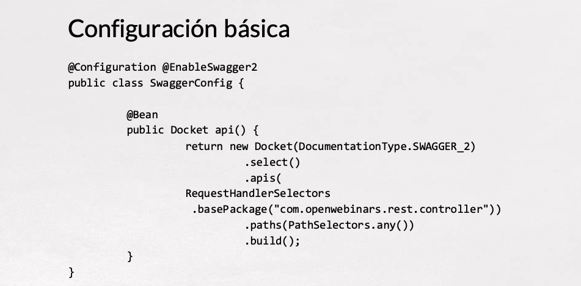
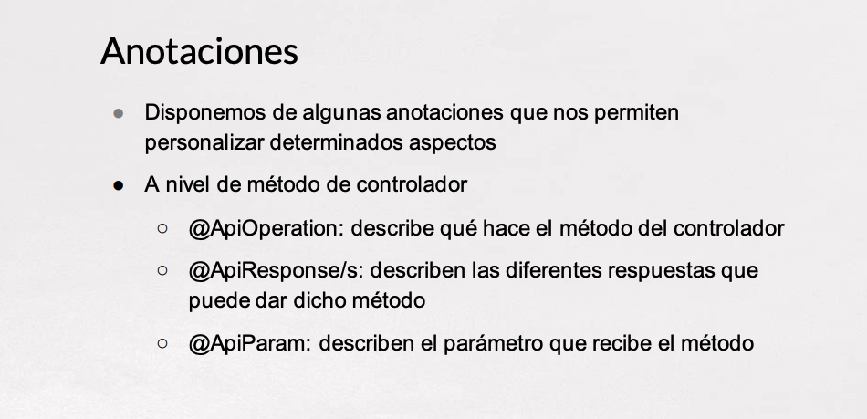

# 6. Documentando nuestra API REST 22m

* 26 ¿Qué es Swagger? 5:43 
* 27 ¿Cómo incluir Swagger en nuestra API? 17:13 
* Contenido adicional 2

# 26 ¿Qué es Swagger? 5:43 

[PDF Qué_es_Swagger_.pdf](pdfs/25_Qué_es_Swagger_.pdf)

## Resumen Profesor

### Dependencias en el `pom.xml`

En primera instancia, nos basta con añadir las siguientes dependencias:

```html
<dependency>
<groupId>io.springfox</groupId>
    <artifactId>springfox-swagger2</artifactId>
    <version>2.9.2</version>
</dependency>
<dependency>
    <groupId>io.springfox</groupId>
    <artifactId>springfox-swagger-ui</artifactId>
    <version>2.9.2</version>
</dependency>
```

Sin embargo, se ha detectado que a día de hoy se puede producir en el log una excepción de tipo `NumberFormatException` al cargar la UI. Este error viene provocado por alguna de las librerías que usa SpringFox y Swagger internamente. Tenemos dos alternativas:

* Deshabilitar el log para esas librerías (y así, ni nos enteraremos de que ha sucedido).
* Ajustar las dependencias para incluir determinadas versiones concretas que no incluyen el error.

Para la segunda solución, debemos modificar las dependencias anteriores por estas:

```html
        <dependency>
            <groupId>io.springfox</groupId>
            <artifactId>springfox-swagger2</artifactId>
            <version>2.9.2</version>
            <exclusions>
                <exclusion>
                    <groupId>io.swagger</groupId>
                    <artifactId>swagger-annotations</artifactId>
                </exclusion>
                <exclusion>
                    <groupId>io.swagger</groupId>
                    <artifactId>swagger-models</artifactId>
                </exclusion>
            </exclusions>
        </dependency>
        <dependency>
            <groupId>io.springfox</groupId>
            <artifactId>springfox-swagger-ui</artifactId>
            <version>2.9.2</version>
        </dependency>
        <dependency>
            <groupId>io.swagger</groupId>
            <artifactId>swagger-annotations</artifactId>
            <version>1.5.21</version>
        </dependency>
        <dependency>
            <groupId>io.swagger</groupId>
            <artifactId>swagger-models</artifactId>
            <version>1.5.21</version>
        </dependency>
```

La versión correcta de *annotations* y *models* eliminan dicho error.

### Lista completa de anotaciones

En los ejemplos de esta lección hemos usado algunas anotaciones. La lista completa de todas ellas la puedes encontrar en https://github.com/swagger-api/swagger-core/wiki/Annotations-1.5.X.

## Transcripción

, hola todo vamos a continuar con el último bloque del curso en el que vamos a documentar nuestra app con Suárez hablemos de documentación de API una Piqué no está documentada posiblemente sea sino imposible muy difícil de utilizar sobre todo sea una pic que queremos ofrecer a tercero en la gente de nuestra organización no todo el mundo va a entender lo mismo corre hay gente que por ejemplo aún hace peticiones post para modificar y no crear recursos nuevo cosa que por ejemplo nosotros no hemos venido implementando la modificación se hace compost compost se hace la creación de recurso o en ocasiones tenemos determinadas reglas de validación que nos obligan a utilizar un tipo de dato concreto números con decimales cadena de caracteres que sigan un determinado patrón etcétera que estaría muy bien que aquello usuario recordar que desarrollamos nuestra piel para otros programadores que yo otros programadores que vayan a interactuar con nuestro país deberán conocer cómo podemos crear la documentación pues tenemos dos posibilidades spring rest Docs y Swagger con Swagger with alternativa spring 32 combina la documentación escrita a mano con asciidoctor con fragmento autogenerado y producidos por spring en visitaste qué tiene de positivo bueno en definitiva lo que hacemos escribir nuestros tes y a partir de ir generar la documentación y tiene como positivo que nos obliga lo invita vale nos conmina a que escribamos los test y a tenerlo actualizados para tener nuestra documento nuestra documentación actualizada y que un proyecto dentro del paraguas de lo que sería el primer la gran familia de estreno la parte negativa es que si no queremos implementar los test de la manera de Spring testing nos obligaría escribir un hostel que posiblemente bueno un determinado momento pues a lo mejor nos vayamos a utilizar no no es que no no sé bueno que designamos los test pero alomejor no queremos poner el énfasis en esa parte y siempre da que queremos tener unos una documentación o queremos tener la documentación antes de escribir los tres bueno entonces eso sería un elemento que podría ser dificultosos en la otra mano tenemos suague Swagger no solamente es para documentar nuestra piel todo un framework de código abierto respaldado por un gran ecosistema de herramienta que nos va a permitir diseñar construir documental consumir nuestra API RESTful entre todas las herramientas que tiene una de las más útiles las más conocidas swagger-ui y tú que nos va a permitir interactuar con nuestra pink con una interfaz bastante bastante cómoda diría que incluso bonita y muy muy muy útil vale con lo cual para nosotros en el contexto de este bloque Swagger será una serie de reglas especificaciones y herramientas que nos ayudan a documentar nuestra el corazón de lo que va de lo que vamos a tener con Swagger es utilizar un Jason que describe por completo vale toda nuestra API y dónde va a estar totalmente mía digamos y una especie de catálogo de EMT información de todo en nuestra app y dónde están documentadas pues todas las peticiones los verbos que se pueden hacer que para qué sirve cada una qué tipo de datos consume qué tipo de datos produce los diferentes datos qué tipos tienen las posibles respuestas código de respuesta de error etcétera etcétera eso sería lo que nosotros en principio si utilizáramos suegra seca teníamos que escribir a mano y alguien se puede tirar lo puede echar las manos a la cabeza eso es complicado de escribir sí pero bueno nosotros vamos a tener una determinada herramienta que nos va ayudar que se llamará springfox y que hará la generación de este Jason de manera automática este Jason utilizado por Swagger UI transforma esto en una web que podríamos llamar interactiva y que nos va a permitir bueno pues ver nuestra API de una manera pues súper conveniente vale hija os lo tenemos por aquí vamos a abrir una la documentación de un proyecto el típico pectore de Open Clinic de un proyecto recurrente que existe en el ecosistema Java pues tendríamos aquí para la versión que tiene una pic la documentación con su ayer Luis fijado como esto nos muestra aquí de los diferentes controladores nos vamos tirando cuáles serían las peticiones la descripción de la misma el dato que podríamos que tendríamos que pasarle


# 27 ¿Cómo incluir Swagger en nuestra API? 17:13 

[PDF Cómo_incluir_Swagger_en_nuestro_proyecto.pdf](pdfs/26_Cómo_incluir_Swagger_en_nuestro_proyecto.pdf)

## Resumen Profesor

No existe.

## Transcripción







# Contenido adicional 2

* [PDF Qué_es_Swagger_.pdf](pdfs/25_Qué_es_Swagger_.pdf)
* [PDF Cómo_incluir_Swagger_en_nuestro_proyecto.pdf](pdfs/26_Cómo_incluir_Swagger_en_nuestro_proyecto.pdf)
