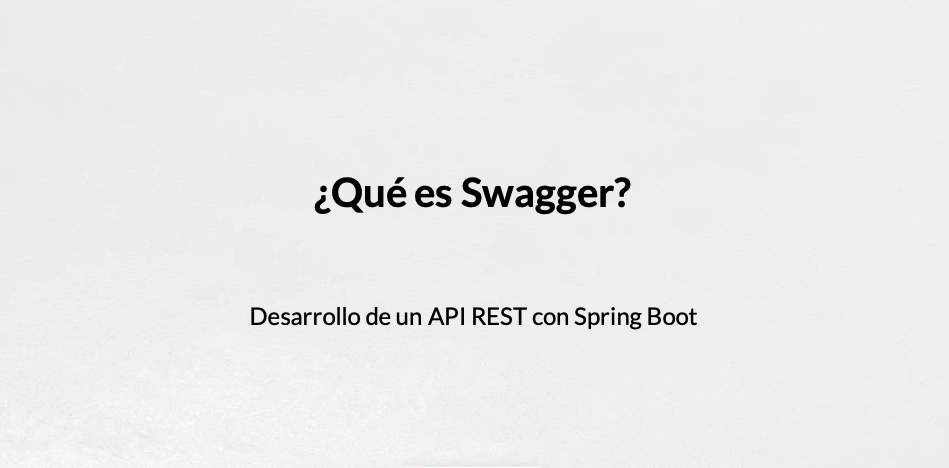
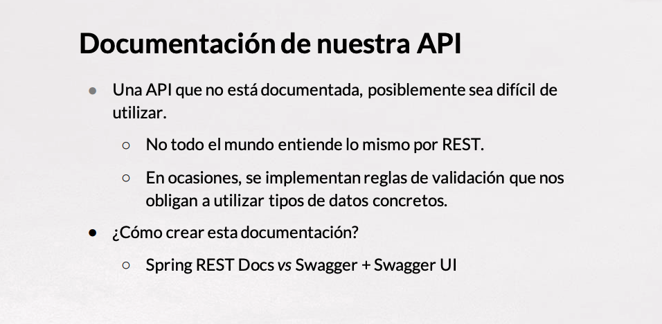
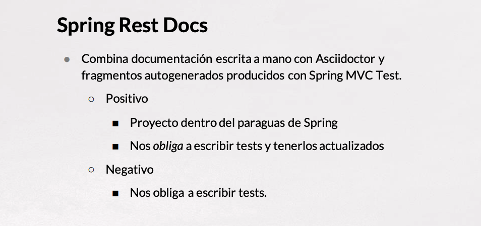

# 6. Documentando nuestra API REST 22m

* 26 ¿Qué es Swagger? 5:43 
* 27 ¿Cómo incluir Swagger en nuestra API? 17:13 
* Contenido adicional 2

# 26 ¿Qué es Swagger? 5:43 

[PDF Qué_es_Swagger_.pdf](pdfs/25_Qué_es_Swagger_.pdf)

## Resumen Profesor

### Dependencias en el `pom.xml`

En primera instancia, nos basta con añadir las siguientes dependencias:

```html
<dependency>
<groupId>io.springfox</groupId>
    <artifactId>springfox-swagger2</artifactId>
    <version>2.9.2</version>
</dependency>
<dependency>
    <groupId>io.springfox</groupId>
    <artifactId>springfox-swagger-ui</artifactId>
    <version>2.9.2</version>
</dependency>
```

Sin embargo, se ha detectado que a día de hoy se puede producir en el log una excepción de tipo `NumberFormatException` al cargar la UI. Este error viene provocado por alguna de las librerías que usa SpringFox y Swagger internamente. Tenemos dos alternativas:

* Deshabilitar el log para esas librerías (y así, ni nos enteraremos de que ha sucedido).
* Ajustar las dependencias para incluir determinadas versiones concretas que no incluyen el error.

Para la segunda solución, debemos modificar las dependencias anteriores por estas:

```html
        <dependency>
            <groupId>io.springfox</groupId>
            <artifactId>springfox-swagger2</artifactId>
            <version>2.9.2</version>
            <exclusions>
                <exclusion>
                    <groupId>io.swagger</groupId>
                    <artifactId>swagger-annotations</artifactId>
                </exclusion>
                <exclusion>
                    <groupId>io.swagger</groupId>
                    <artifactId>swagger-models</artifactId>
                </exclusion>
            </exclusions>
        </dependency>
        <dependency>
            <groupId>io.springfox</groupId>
            <artifactId>springfox-swagger-ui</artifactId>
            <version>2.9.2</version>
        </dependency>
        <dependency>
            <groupId>io.swagger</groupId>
            <artifactId>swagger-annotations</artifactId>
            <version>1.5.21</version>
        </dependency>
        <dependency>
            <groupId>io.swagger</groupId>
            <artifactId>swagger-models</artifactId>
            <version>1.5.21</version>
        </dependency>
```

La versión correcta de *annotations* y *models* eliminan dicho error.

### Lista completa de anotaciones

En los ejemplos de esta lección hemos usado algunas anotaciones. La lista completa de todas ellas la puedes encontrar en https://github.com/swagger-api/swagger-core/wiki/Annotations-1.5.X.

## Transcripción






# 27 ¿Cómo incluir Swagger en nuestra API? 17:13 

[PDF Cómo_incluir_Swagger_en_nuestro_proyecto.pdf](pdfs/26_Cómo_incluir_Swagger_en_nuestro_proyecto.pdf)

## Resumen Profesor

No existe.

## Transcripción


# Contenido adicional 2

* [PDF Qué_es_Swagger_.pdf](pdfs/25_Qué_es_Swagger_.pdf)
* [PDF Cómo_incluir_Swagger_en_nuestro_proyecto.pdf](pdfs/26_Cómo_incluir_Swagger_en_nuestro_proyecto.pdf)
