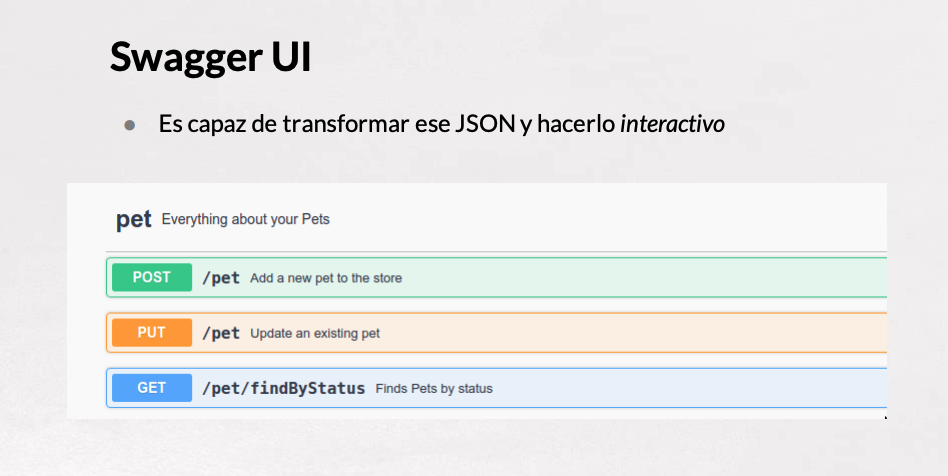
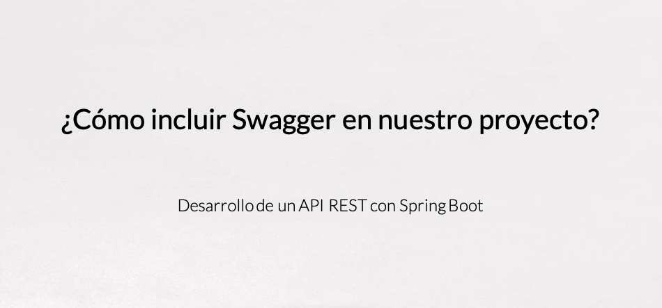
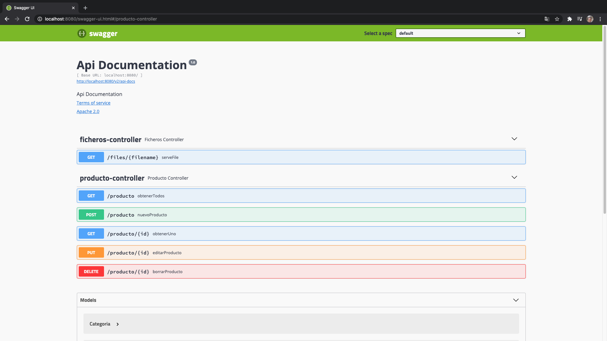
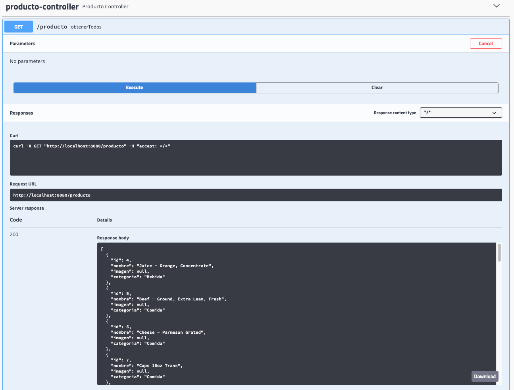
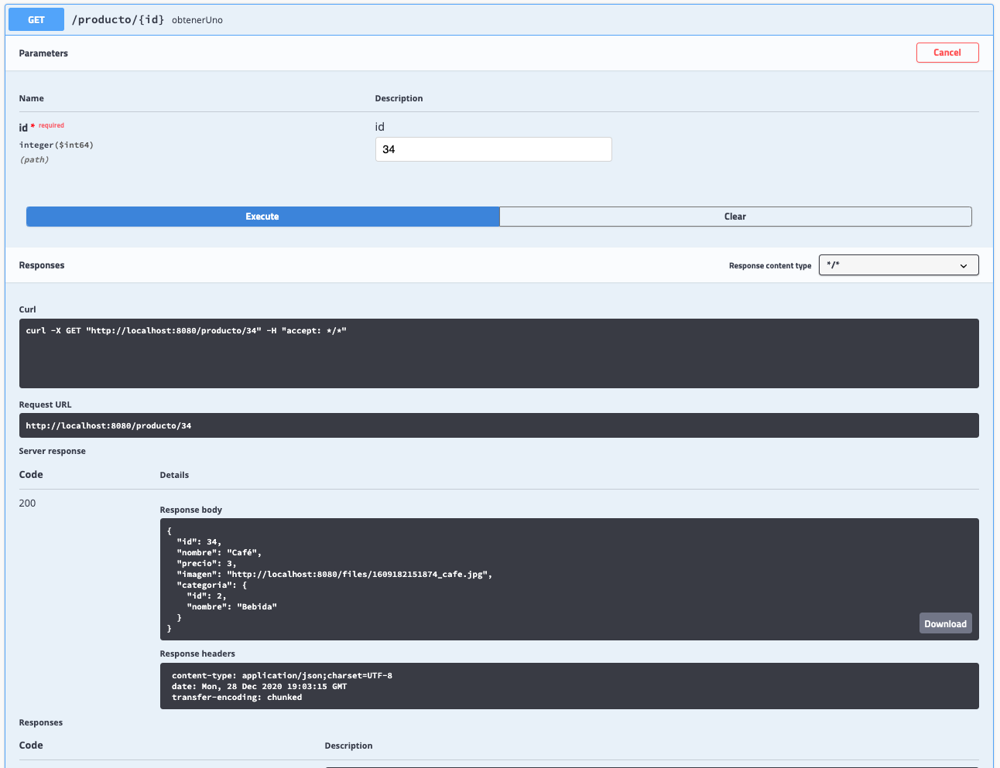
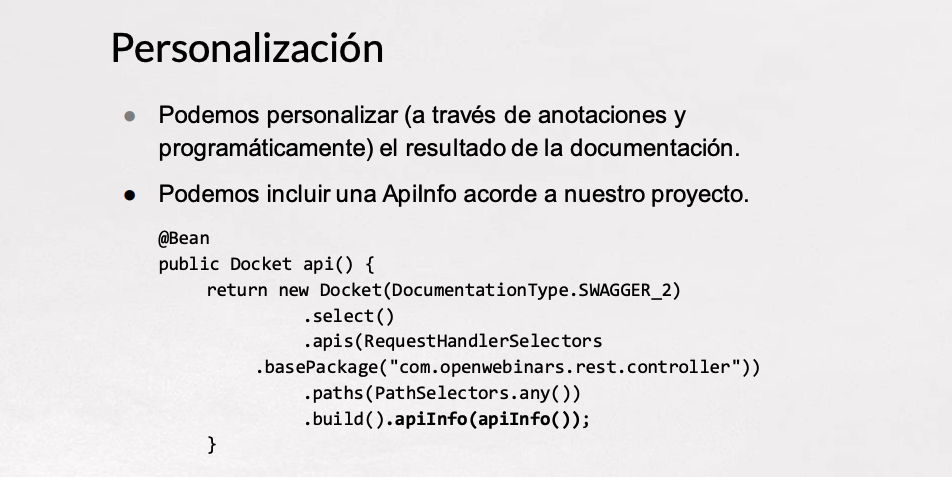
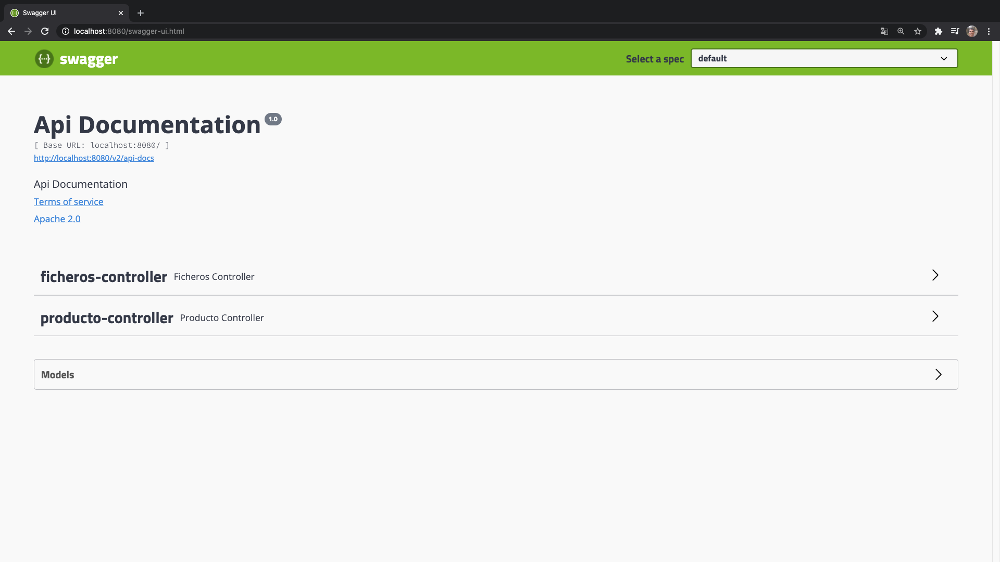
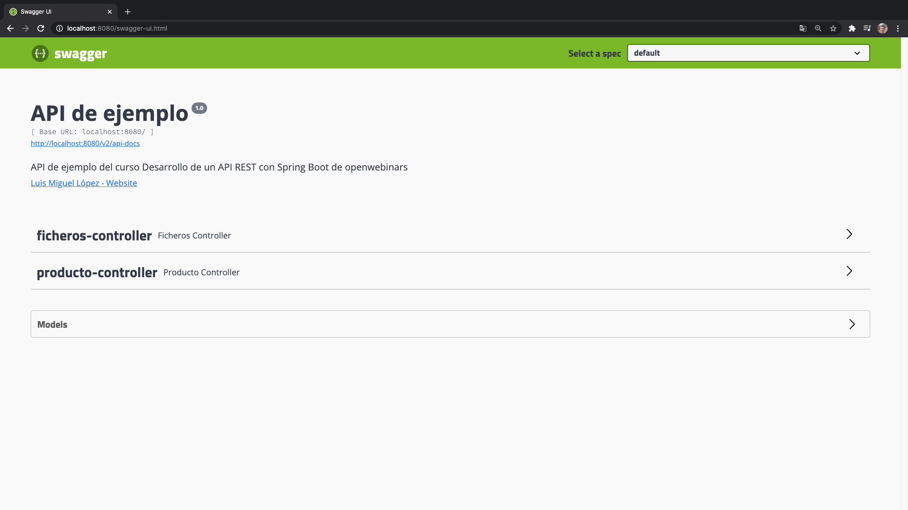
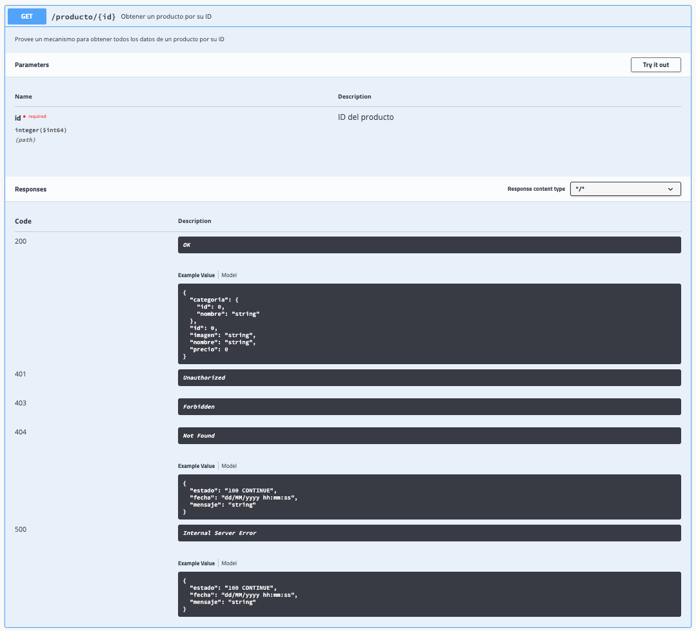
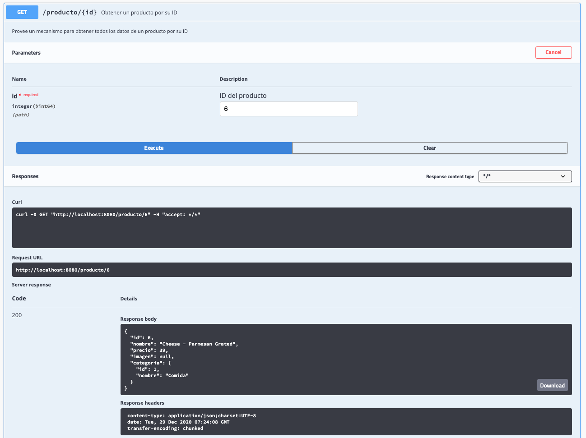

# 6. Documentando nuestra API REST 22m

* 26 ¿Qué es Swagger? 5:43 
* 27 ¿Cómo incluir Swagger en nuestra API? 17:13 
* Contenido adicional 2

# 26 ¿Qué es Swagger? 5:43 

[PDF Qué_es_Swagger_.pdf](pdfs/25_Qué_es_Swagger_.pdf)

## Resumen Profesor

### Dependencias en el `pom.xml`

En primera instancia, nos basta con añadir las siguientes dependencias:

```html
<dependency>
<groupId>io.springfox</groupId>
    <artifactId>springfox-swagger2</artifactId>
    <version>2.9.2</version>
</dependency>
<dependency>
    <groupId>io.springfox</groupId>
    <artifactId>springfox-swagger-ui</artifactId>
    <version>2.9.2</version>
</dependency>
```

Sin embargo, se ha detectado que a día de hoy se puede producir en el log una excepción de tipo `NumberFormatException` al cargar la UI. Este error viene provocado por alguna de las librerías que usa SpringFox y Swagger internamente. Tenemos dos alternativas:

* Deshabilitar el log para esas librerías (y así, ni nos enteraremos de que ha sucedido).
* Ajustar las dependencias para incluir determinadas versiones concretas que no incluyen el error.

Para la segunda solución, debemos modificar las dependencias anteriores por estas:

```html
   <dependency>
      <groupId>io.springfox</groupId>
      <artifactId>springfox-swagger2</artifactId>
      <version>2.9.2</version>
      <exclusions>
         <exclusion>
            <groupId>io.swagger</groupId>
            <artifactId>swagger-annotations</artifactId>
         </exclusion>
         <exclusion>
            <groupId>io.swagger</groupId>
            <artifactId>swagger-models</artifactId>
         </exclusion>
      </exclusions>
   </dependency>
   <dependency>
      <groupId>io.springfox</groupId>
      <artifactId>springfox-swagger-ui</artifactId>
      <version>2.9.2</version>
   </dependency>
   <dependency>
      <groupId>io.swagger</groupId>
      <artifactId>swagger-annotations</artifactId>
      <version>1.5.21</version>
   </dependency>
   <dependency>
      <groupId>io.swagger</groupId>
      <artifactId>swagger-models</artifactId>
      <version>1.5.21</version>
   </dependency>
```

La versión correcta de *annotations* y *models* eliminan dicho error.

### Lista completa de anotaciones

En los ejemplos de esta lección hemos usado algunas anotaciones. La lista completa de todas ellas la puedes encontrar en https://github.com/swagger-api/swagger-core/wiki/Annotations-1.5.X.

## Transcripción


Vamos a continuar con el último bloque del curso en el que vamos a documentar nuestra API con **Swagger**.


Hablemos de documentación de API, una API qué no está documentada posiblemente sea sino imposible muy difícil de utilizar, sobre todo si es un API que queremos ofrecer a terceros, no a gente de nuestra organización.

No todo el mundo va a entender lo mismo por REST, hay gente que por ejemplo aún hace peticiones POST para modificar y no crear recursos nuevos, cosa que por ejemplo nosotros no hemos venido implementando, la modificación se hace con PUT, con POST se hace la creación de recurso. 

O en ocasiones tenemos determinadas reglas de validación que nos obligan a utilizar un tipo de dato concreto, números con decimales, cadena de caracteres que sigan un determinado patrón, etc. que estaría muy bien que aquellow usuarios, recordar que desarrollamos nuestra API para otros programadores, que aquellos otros programadores que vayan a interactuar con nuestro API deberán conocer.

¿Cómo podemos crear la documentación? tenemos dos posibilidades **Spring Rest Docs** y **Swagger** con **Swagger UI**, vamos a ver las dos alternativas.


**Spring Rest Docs** combina la documentación escrita a mano con **Asciidoctor** con fragmentos autogenerado y producidos por **Spring MVC Test**.

¿Qué tiene de positivo? En definitiva lo que hacemos es escribir nuestros tests y a partir de ahí generar la documentación y tiene como positivo que nos obliga, nos invita, nos conmina a que escribamos los test y a tenerlos actualizados para tener nuestra documentación actualizada y que es un proyecto dentro del paraguas de lo que sería la gran familia de Spring.

La parte negativa es que si no queremos implementar los test de la manera de **Spring Testing** nos obligaría a escribir unos test que posiblemente en un determinado momento a lo mejor no vayamos a utilizar, no es que no no séa bueno que designemos los test, pero a lo mejor no queremos poner el énfasis en esa parte y si es verdad que queremos tener unos una documentación o queremos tener la documentación antes de escribir los test, bueno entonces eso sería un elemento que podría ser un poco dificultosos.


En la otra mano tenemos **Swagger**, Swagger no solamente es para documentar nuestra API, es todo un Framework de código abierto respaldado por un gran ecosistema de herramientas que nos va a permitir diseñar, construir, documentar, consumir nuestra API REST FULL.


Entre todas las herramientas que tiene Swagger, una de las más útiles, la más conocida es **Swagger UI Tools** que nos va a permitir interactuar con nuestra API, con una interfaz bastante bastante cómoda, diría que incluso bonita y muy muy muy útil.

Con lo cual para nosotros en el contexto de este bloque Swagger será una serie de reglas, especificaciones y herramientas que nos ayudan a documentar nuestra API.


El corazón de lo que va de lo que vamos a tener con Swagger es utilizar un JSON que describe por completo toda nuestra API y dónde va a estar totalmente, ya digamos una especie de catálogo, de meta información de toda nuestra API y dónde están documentadas todas las peticiones, los verbos que se pueden hacer, para qué sirve cada una, qué tipo de datos consume, qué tipo de datos produce, los diferentes datos, qué tipos tienen, las posibles respuestas, códigos de respuesta de error, etc., eso sería lo que nosotros en principio, si utilizáramos Swagger a secas, tendríamos que escribir a mano y alguien se puede echar las manos a la cabeza, eso es complicado de escribir, sí, pero bueno nosotros vamos a tener una determinada herramienta que nos va ayudar que se llamará **SpringFox** y que hará la generación de este JSON de manera automática.



Este JSON utilizado por Swagger UI transforma esto en una web que podríamos llamar interactiva y que nos va a permitir bueno pues ver nuestra API de una manera pues súper conveniente.

Vamos a abrir la documentación de un proyecto, el típico [***Petstore***](https://petstore.swagger.io/v2/swagger.json) o PetClinic que es un proyecto recurrente que existe en el ecosistema Java.


Tendríamos aquí para la versión que tiene un API la documentación con Swagger, esto nos muestra los diferentes controladores, nos va mostrando cuáles serían las peticiones, la descripción de la misma, el dato que tendríamos que pasarle, nos ofrese incluso la posibilidad de probarlo.


Esta herramienta es un verdadero Cañon que nos va a permitir no solamente que la gente pueda conocer la estructura de nuestra API sino que comprobarla para ir montando sus clientes


Lo que nos quedaría en la próxima lección sería ver los elementos que nos van a hacer falta para integrar Swagger con Spring Boots dentro de nuestro proyecto.

# 27 ¿Cómo incluir Swagger en nuestra API? 17:13 

[PDF Cómo_incluir_Swagger_en_nuestro_proyecto.pdf](pdfs/26_Cómo_incluir_Swagger_en_nuestro_proyecto.pdf)

## Resumen Profesor

No existe.

## Transcripción



Vamos a comenzar con esta última lección en la que vamos a incluir Swagger en nuestro proyecto.


Como decía vamos a incluir **Swagger** también con **SpringFox** qué es un conjunto de librerías que nos permite generar automáticamente la documentación de nuestra API y en particular, la combinación de ambas nos permite general la documentación en formato Swagger, con lo cual no tenemos que generar ese Swagger JSON de manera manual y además lo podemos hacer de una manera un poco más genérica o podremos acotar y customizar un poco esa configuración, para que el resultado en **Swagger UI** sea lo más fino posible.


Tendríamos que añadir una serie de dependencias, la última versión a día de hoy que podríamos usar, la versión última que podría utilizar sería la 2.9.2 de SpringFox con Swagger ahora los añadiremos.


Vamos a ver que la configuración es sencilla, tenemos una clase anotada con `@Configuration` y con la anotación `@EnableSwagger2` y tendremos que crear un `Bean` de tipos `Docker` que es el que va a incluir alguna información para generar la documentación.


Si queremos puede tener una documento una configuración tan básicas como está que es con la que vamos a comenzar, en la que le digamos oye todos los controladores que estén a partir del paquete con `com.openwebinar.rest.controller` serán los que incluya, cualquier ruta dentro de este controlador será la que tú vas a documentar, vamos a tratar de implementar esto. 

### :computer: `143-14-Swagger`

Vamos a partir de un proyecto base del repositorio del curso llamado `26_SwaggerBase` lo copiamos y lo llamaremos `143-14-Swagger`. La estructura del proyecto es la siguiente:


#### 01. Modificar el `pom.xml` 

Cambiamos el `artifactId` y el `name`

```html
<artifactId>143-14-Swagger</artifactId>
<version>0.0.1-SNAPSHOT</version>
<name>143-14-Swagger</name>
<description>Ejemplo de configuración de Swagger</description>
```

También vamos a añdir las dependencias para Swagger y SpringFox

```html
   <dependency>
      <groupId>io.springfox</groupId>
      <artifactId>springfox-swagger2</artifactId>
      <version>2.9.2</version>
      <exclusions>
         <exclusion>
            <groupId>io.swagger</groupId>
            <artifactId>swagger-annotations</artifactId>
         </exclusion>
         <exclusion>
            <groupId>io.swagger</groupId>
            <artifactId>swagger-models</artifactId>
         </exclusion>
      </exclusions>
   </dependency>
   <dependency>
      <groupId>io.springfox</groupId>
      <artifactId>springfox-swagger-ui</artifactId>
      <version>2.9.2</version>
   </dependency>
   <dependency>
      <groupId>io.swagger</groupId>
      <artifactId>swagger-annotations</artifactId>
      <version>1.5.21</version>
   </dependency>
   <dependency>
      <groupId>io.swagger</groupId>
      <artifactId>swagger-models</artifactId>
      <version>1.5.21</version>
   </dependency>
```

#### 02. Crear la Configuración Swagger

Creamos la clase `SwaggerConfig` dentro del paquete `config`

`SwaggerConfig`

```java
@Configuration
@EnableSwagger2
public class SwaggerConfig {
	
   @Bean
   public Docket api() {
      return new Docket(DocumentationType.SWAGGER_2)
               .select()
               .apis(RequestHandlerSelectors.basePackage("com.openwebinars.rest.controller"))
               .paths(PathSelectors.any())
               .build();
   }
}
```

Observaciones de `SwaggerConfig`

* Anotada con `@Configuration` y con `@EnableSwagger2`
* Creamos un `Bean` de tipo `Docket`
   * Indicamos que el paquete base es `"com.openwebinars.rest.controller"`
   * También indicamos cualquier ruta de este paquete
   * Con esto ya tenemos Swagger configurado

Si aquí ejecutamos nuestra aplicación e invocamos la ruta `http://localhost:8080/swagger-ui.html` se nos presenta la siguiente pantalla:



Se ha incluido la información de los dos Controladores que tenemos, sobre todo el de `producto-controller` es el más completo, donde podemos probar incluso la obtención de todos los productos.



Podemos hacer una prueba para obtener un producto en particular.




Podríamos también crear un nuevo Producto, editarlo, borrarlo.


Ya tendríamos programada nuestra documentación con Swagger.



Sin embargo vamos a ver que podemos personalizar un poco lo que nos aparece por aquí por lo pronto podemos incluir algo de información sobre nuestra API, vamos a definir un `Bean` de tipo `ApiInfo` donde podamos modificar, si nos damos cuenta por aquí.



Ha aparecido algo de información un poco genérica, vamos a poner que todo esto que aparezca por aquí sea algo customizado, sino todo algunos de los elementos que aparecen por aquí.

Para ello tendríamos que venir a `SwaggerConfig` y definir otro `Bean`

```java
   @Bean
   public ApiInfo apiInfo() {

      return new ApiInfoBuilder()
               .title("API de ejemplo")
               .description("API de ejemplo del curso Desarrollo de un API REST con Spring Boot de openwebinars")
               .version("1.0")
               .contact(new Contact("Luis Miguel López", "http://www.openwebinars.net", ""))
               .build();
   }
```

Donde:

* Construimos el `ApiInfo` a partir de un `ApiInfoBuilder`.
* Damos un título
* Damos una descripción
* Indicamos una versión
* Indicamos un Contacto
* Este ApiInfo lo debemos adjuntar a nuestro primer Bean con 

Nuestro código completo nos queda así:

```java
@Configuration
@EnableSwagger2
public class SwaggerConfig {
	
   @Bean
   public Docket api() {
      return new Docket(DocumentationType.SWAGGER_2)
               .select()
               .apis(RequestHandlerSelectors.basePackage("com.openwebinars.rest.controller"))
               .paths(PathSelectors.any())
               .build()
               .apiInfo(apiInfo());
   }
	
   @Bean
   public ApiInfo apiInfo() {

		return new ApiInfoBuilder()
               .title("API de ejemplo")
               .description("API de ejemplo del curso Desarrollo de un API REST con Spring Boot de openwebinars")
               .version("1.0")
               .contact(new Contact("Luis Miguel López", "http://www.openwebinars.net", ""))
               .build();
   }

}
```

Si recargamos nuestra aplicación tenemos:



Ya viene con nuestra información personalizada.


Podemos seguir customizando, además de esta `ApiInfo` tenemos a nuestra disposición algunas anotaciones que nos van a permitir definir un poco la información que por ahí aparece a nivel de método del controlador, tenemos las anotaciones:

* `@ApiOperation` que describe qué hace ese método del controlador.
* `@ApiResponse/s` que describen las diferentes respuestas que puede dar.
* `@ApiParam` que describe el parámetro que recibe el método.

Vamos a incluir dentro de nuestra clase controladora en nuestro `ProductoController` podemos añadir algunos elementos.

Por ejemplo en el método `obtenerUno(...)` que actualmente lo tenemos así:

```java
@GetMapping("/producto/{id}")
public Producto obtenerUno(@PathVariable Long id) {
   try {
      return productoRepositorio.findById(id)
                     .orElseThrow(() -> new ProductoNotFoundException(id));
   } catch (ProductoNotFoundException ex) {
      throw new ResponseStatusException(HttpStatus.NOT_FOUND, ex.getMessage());
   }
				
}
```

Lo vamos a cambiar por:

```java
@ApiOperation(value="Obtener un producto por su ID", notes="Provee un mecanismo para obtener todos los datos de un producto por su ID")
@ApiResponses(value= {
            @ApiResponse(code=200, message="OK", response=Producto.class),
            @ApiResponse(code=404, message="Not Found", response=ApiError.class),
            @ApiResponse(code=500, message="Internal Server Error", response=ApiError.class)
})
@GetMapping("/producto/{id}")
public Producto obtenerUno(@ApiParam(value="ID del producto", required=true, type = "long") @PathVariable Long id) {
   try {
      return productoRepositorio.findById(id)
               .orElseThrow(() -> new ProductoNotFoundException(id));
   } catch (ProductoNotFoundException ex) {
      throw new ResponseStatusException(HttpStatus.NOT_FOUND, ex.getMessage());
   }
				
}
```

Observaciones:

* Con `@ApiOperation` describimos al método con un mensaje corto y otro más largo.
* Con `@ApiResponses` describimos las posibles respuestas 
* Con `@ApiParam(value="ID del producto", required=true, type = "long")` documentamos el `@PathVariable`.

Si probamos nuevamente este método tenemos:




Todos los mensajes personalizados ya nos aparecen y le dan un poco más de sentido a nuestra documentación.

Podríamos segir añadiendo más elementos dentro de otros métodos del Controlador. 


Vamos a ver la posibilidad de añadir documentación también dentro de las clases del Modelo con `@ApiModelProperty` que nos permite también modificar un poco la información que nos vamos a encontrar aquí.

En el modelo del Producto actualmente lo tenemos así:

`Producto`

```java
@Data @NoArgsConstructor @AllArgsConstructor
@Entity
public class Producto {

   @Id @GeneratedValue
   private Long id;
	
   private String nombre;	
   private float precio;	
   private String imagen;
	
   @ManyToOne
   @JoinColumn(name="categoria_id")
   private Categoria categoria;
	
}
```

Vamos a añadir algunos elementos.

```java
@Data @NoArgsConstructor @AllArgsConstructor
@Entity
public class Producto {

   @ApiModelProperty(value="ID del Producto", dataType="long",  example="1", position=1)
   @Id @GeneratedValue
   private Long id;
	
   @ApiModelProperty(value="Nombre del producto", dataType="String", example="Jamón ibérico de bellota", position=2)
   private String nombre;
	
   @ApiModelProperty(value="Precio del producto", dataType = "float", example="253.27", position=3)
   private float precio;
	
   @ApiModelProperty(value="Imagen del producto", dataType = "String", example="http://www.midominio.com/files/12345-imagen.jpg", position=4)
   private String imagen;
	
	
   @ApiModelProperty(value="Categoría del producto", dataType="Categoria", position=5)
   @ManyToOne
   @JoinColumn(name="categoria_id")
   private Categoria categoria;
	
}
```

Observaciones:

* Con `@ApiModelProperty` describimos cada uno de nuestros atributos.

Actualmente dentro de la documentación vemos:


Si volvemos a relanzar la aplicación vamos a ver donde se reflejan estos cambio.


Ya no es un ejemplo cualquiera sino el que nosotros hemos ido montado con las distintas anotaciones `@ApiModelProperty`, nos faltaria quiza montar la categoria que sería añadir lo mismo en la Clase `Categoria` incluso en el DTO.


Como reto te propongo finalizar la documentación del resto de clases, de métodos del controlador para documentar toda nuestra API lo más posible.

Hasta aquí este curso de implementación de un API REST con Spring Boots 

# Contenido adicional 2

* [PDF Qué_es_Swagger_.pdf](pdfs/25_Qué_es_Swagger_.pdf)
* [PDF Cómo_incluir_Swagger_en_nuestro_proyecto.pdf](pdfs/26_Cómo_incluir_Swagger_en_nuestro_proyecto.pdf)
