# 2. Algunas mejoras para nuestra API 62m

* 03 Paginación de resultados 20:46 
* 04 Manejo de parámetros en el Query (Parte I) 16:49 
* 05 Manejo de parámetros en el Query (Parte II) 17:25 
* 06 Soporte para XML 7:19 
* Contenido adicional 4

# 03 Paginación de resultados 20:46 

[PDF Paginación_de_resultados.pdf](pdfs/01_Paginación_de_resultados.pdf)

## Resumen Profesor

### Paginación

Algunas de las clases/interfaces que se utilizan durante esta lección son estas:

* PagingAndSortingRepository: https://docs.spring.io/spring-data/commons/docs/current/api/org/springframework/data/repository/PagingAndSortingRepository.html
* Page: https://docs.spring.io/spring-data/commons/docs/current/api/org/springframework/data/domain/Page.html
* Pageable: https://docs.spring.io/spring-data/commons/docs/current/api/org/springframework/data/domain/Pageable.html.
* @PageableDefault: https://docs.spring.io/spring-data/commons/docs/current/api/org/springframework/data/web/PageableDefault.html

### RFC 5988

Según el *request for comments* 5988, en un API Rest paginado deberíamos incluir el encabezado *link*, siguiendo una estructura como la que sigue en el ejemplo:

```html
<http://localhost:8080/producto/?page=2&size=10>; rel="next", 
<http://localhost:8080/producto/?page=0&size=10>; rel="prev", 
<http://localhost:8080/producto/?page=0&size=10>; rel="first", 
<http://localhost:8080/producto/?page=2&size=10>; rel="last"
```

## Transcripción


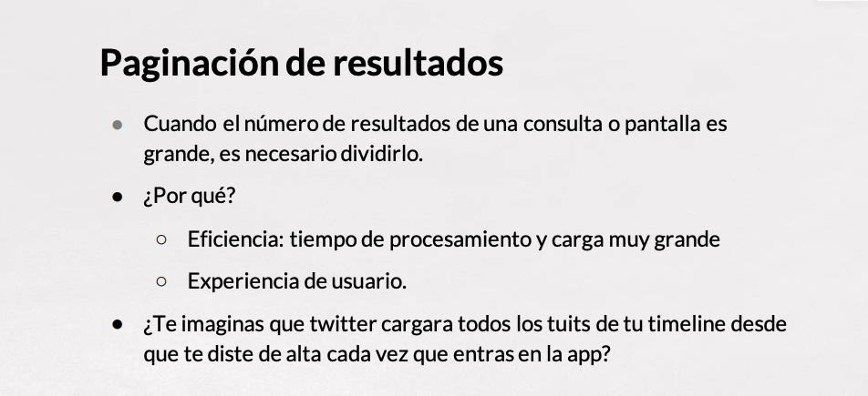
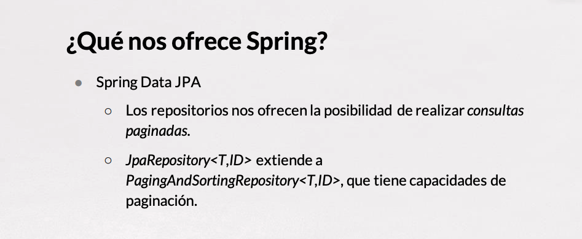

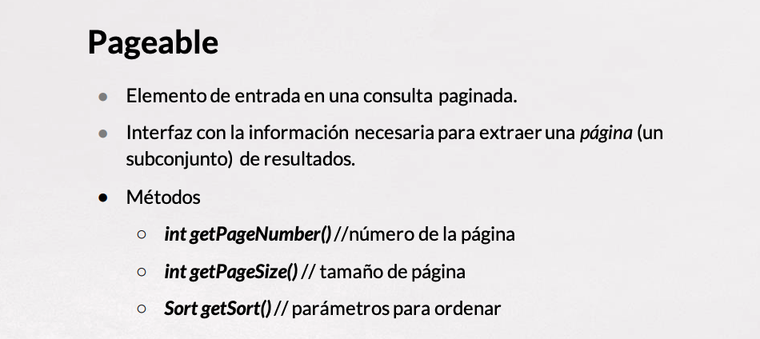
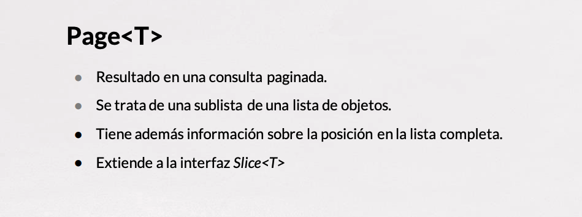


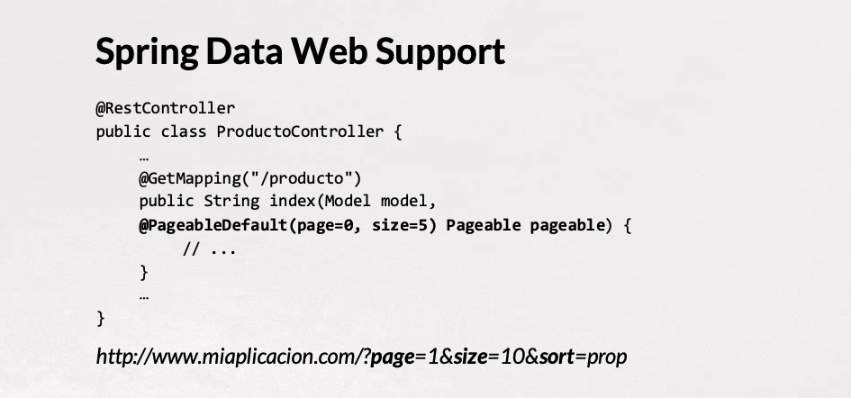

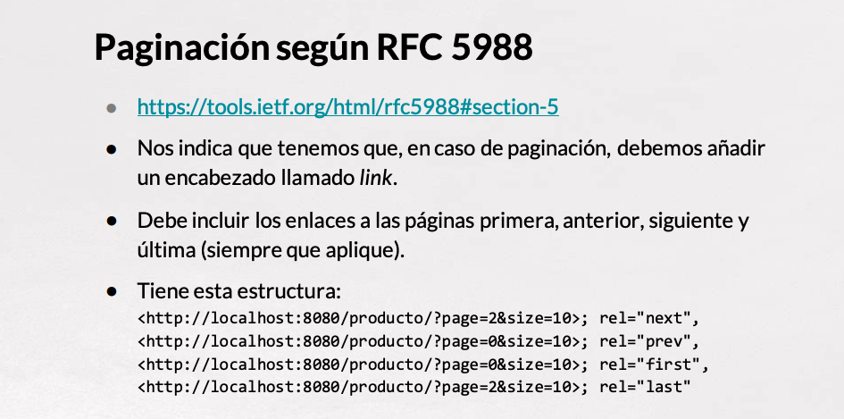


# 04 Manejo de parámetros en el Query (Parte I) 16:49 

[PDF Manejo_de_parámetros_en_el_query.pdf](pdfs/02_Manejo_de_parámetros_en_el_query.pdf)

## Resumen Profesor

### Anotación @RequestParam

Esta anotación puede tomar los siguientes argumentos:

* `name` o `value`: nombre del parámetro que vamos a recoger de la URL.
* `required`: Indica si el parámetro es o no obligatorio.
* `defaultValue`: proporciona un valor por defecto en el caso de que el usuario no lo haya proporcionado.

### `@RequestParam` y `Optional<T>`

Podemos combinar el uso de `@RequestParam` para que, en lugar de recibir un parámetro `String`, `Integer`, `Long`, ..., recibamos un `Optional` de algún tipo, con todas sus posibles ventajas:

```java
@GetMapping("/path")
public ResponseEntity<?> controllerMethod(@RequestParam("param") Optional<String> param)
```

Si bien con la propia anotación `@RequestParam` podemos *jugar* con `required` y `defaultValue`, el uso de `Optional` nos permite construir métodos versátiles con garantías de evitar cadenas vacías, número inicializados a cero o situaciones similares.

## Transcripción

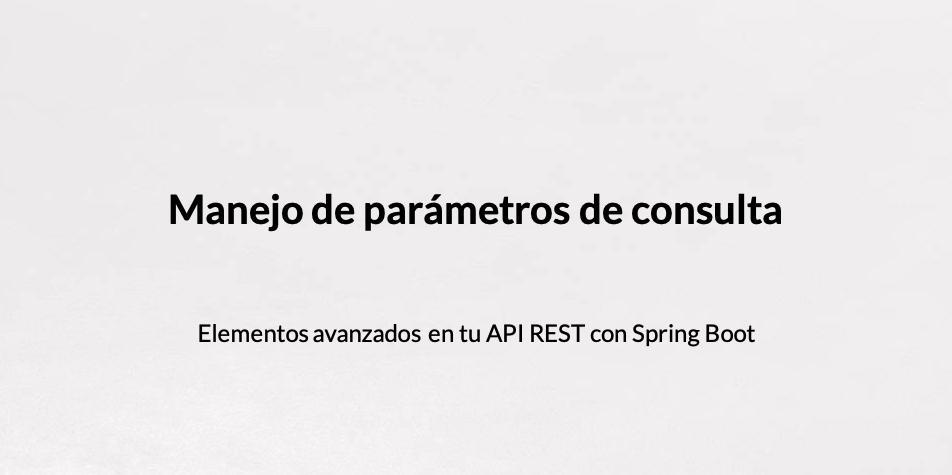


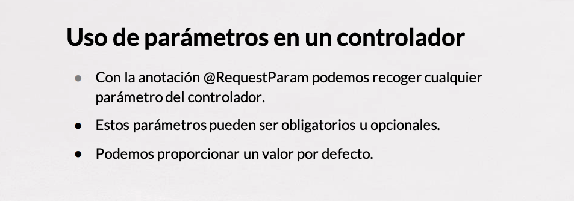
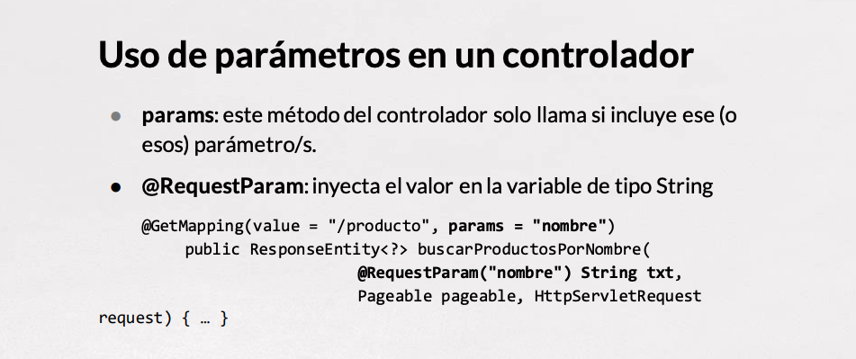


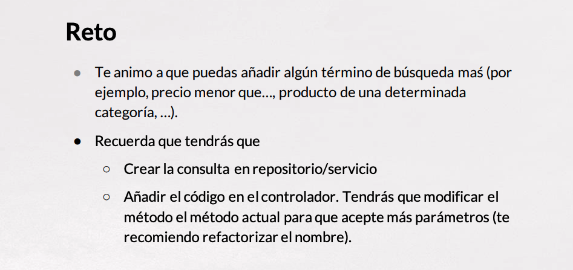

# 05 Manejo de parámetros en el Query (Parte II) 17:25 

[PDF Manejo_de_parámetros_de_consulta_2.pdf](pdfs/03_Manejo_de_parámetros_de_consulta_2.pdf)

## Resumen Profesor

### Criteria API

*Criteria* es una forma de realizar consultas en JPA. En lugar de utilizar el enfoque JPQL (similar a SQL), se trata de utilizar un enfoque programático. De hecho, suele ser muy cómodo para aquellos programadores que no se llevan muy bien con SQL o bases de datos relacionales. Dentro del paquete `javax.persistencia.criteria` encontramos todas las clases e interfaces que se pueden utilizar.

Puedes encontrar más información sobre Criteria en el tutorial de Java EE 7: https://docs.oracle.com/javaee/7/tutorial/persistence-criteria.htm#GJITV.

### Specification Args Resolver

Se trata de un proyecto de Tomasz Kaczmarzyk (@tratif) para el filtrado *fácil* de datos con Spring MVC y Spring Data JPA. Nos permite **evitar** tener que definir una clase por cada `Specification` que queramos utilizar. A través de algunas anotaciones con argumentos, y con los mismos parámetros que reciben nuestros métodos en el controlador, esta librería es capaz de generar las consultas necesarias.

*Puedes encontrar la información completa de este proyecto en su repositorio de github:* 

https://github.com/tkaczmarzyk/specification-arg-resolver

Según la documentación de la librería, una petición como esta:

```sh
GET http://myhost/api/customers?firstName=Homer
```

podría ser manejada con un método como este:

```java
@RequestMapping(value = "/customers", params = "firstName")
public Iterable<Customer> findByFirstName(  
      @Spec(path = "firstName", spec = Like.class) Specification<Customer> spec) {

    return customerRepo.findAll(spec);
}
```

*Nótese el uso de la anotación `@Spec`, que permite indicar la especificación.*

Esto daría como resultado la siguiente consulta:

```sql
select c from Customer c where c.firstName like '%Homer%'
```

### Uso de la librería

Para utilizar esta librería, tenemos que añadir la siguiente dependencia maven:

```html
<dependency>
    <groupId>net.kaczmarzyk</groupId>
    <artifactId>specification-arg-resolver</artifactId>
    <version>2.1.1</version>
</dependency>
```

*Esta versión trabaja con Java 1.8 y ha sido compilada y probada con Spring Boot 2.1. En la web del proyecto se pueden encontrar versiones anteriores.*

Y añadir en la configuración el bean `SpecificationArgumentResolver`.

```java
@Configuration
public class MyConfig implements WebMvcConfigurer {

    @Override
    public void addArgumentResolvers(List<HandlerMethodArgumentResolver> argumentResolvers) {
        argumentResolvers.add(new SpecificationArgumentResolver());
    }

    ...
}
```

## Transcripción


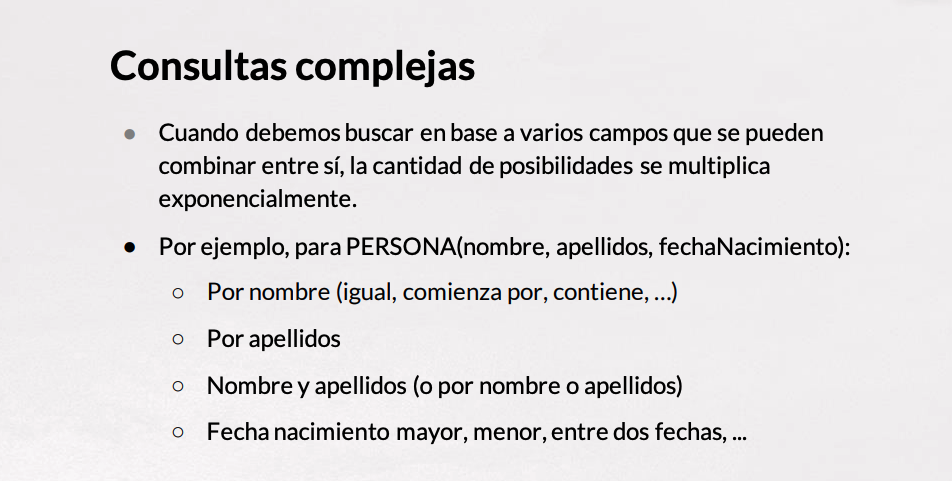
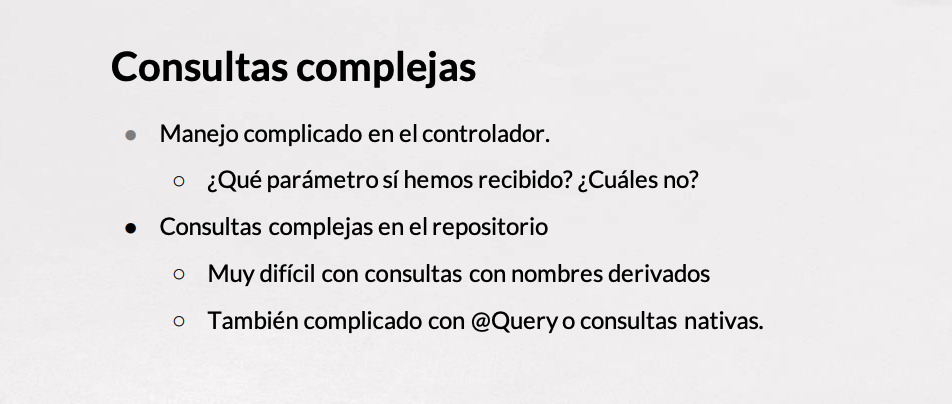
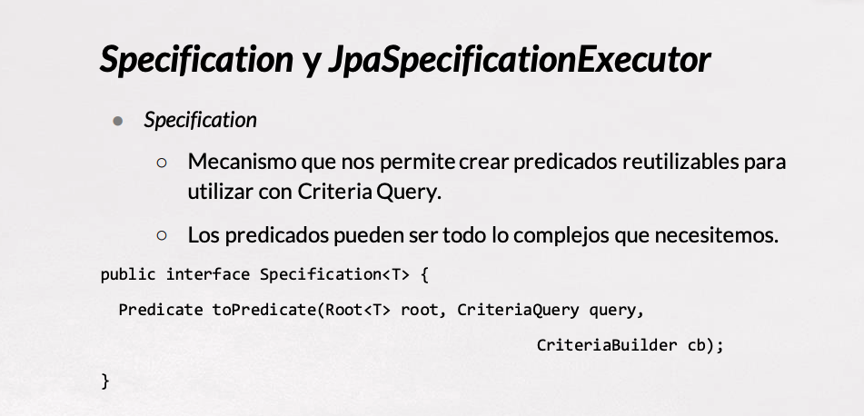
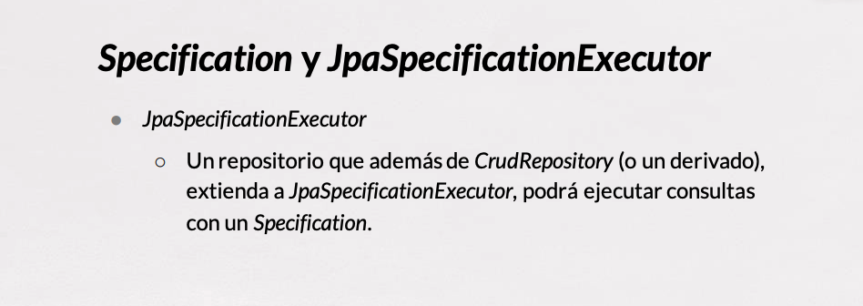


# 06 Soporte para XML 7:19 

[PDF Soporte_para_XML.pdf](pdfs/04_Soporte_para_XML.pdf)

## Resumen Profesor

La dependencia de Jackson para poder transformar en XML es:

```html
<dependency>
    <groupId>com.fasterxml.jackson.dataformat</groupId>
    <artifactId>jackson-dataformat-xml</artifactId>
</dependency>
```

## Transcripción


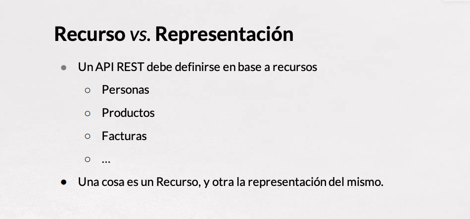


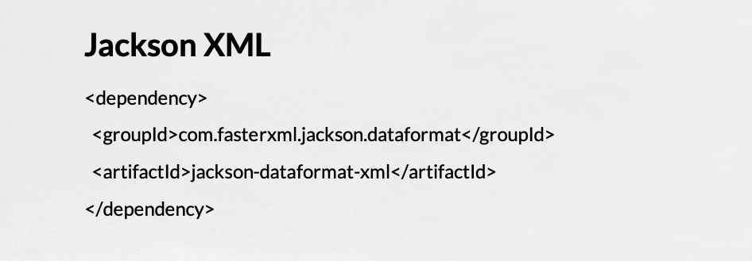

# Contenido adicional 4

* [PDF Paginación_de_resultados.pdf](pdfs/01_Paginación_de_resultados.pdf)
* [PDF Manejo_de_parámetros_en_el_query.pdf](pdfs/02_Manejo_de_parámetros_en_el_query.pdf)
* [PDF Manejo_de_parámetros_de_consulta_2.pdf](pdfs/03_Manejo_de_parámetros_de_consulta_2.pdf)
* [PDF Soporte_para_XML.pdf](pdfs/04_Soporte_para_XML.pdf)
