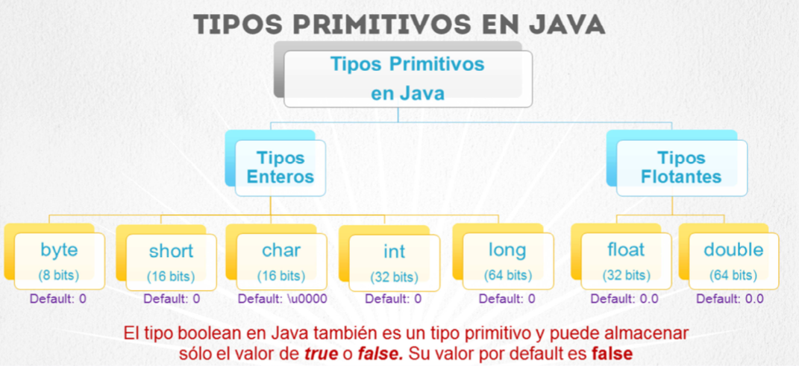
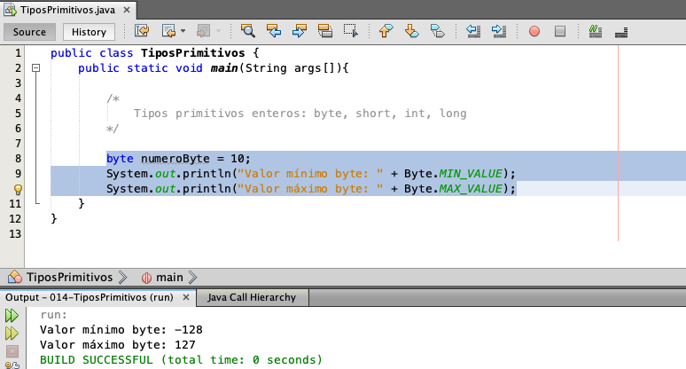
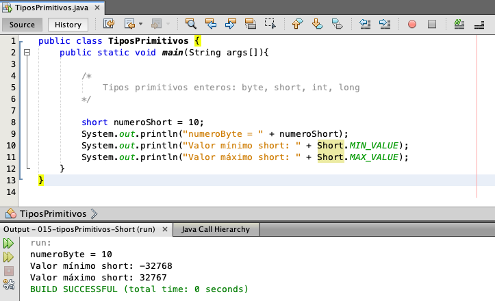
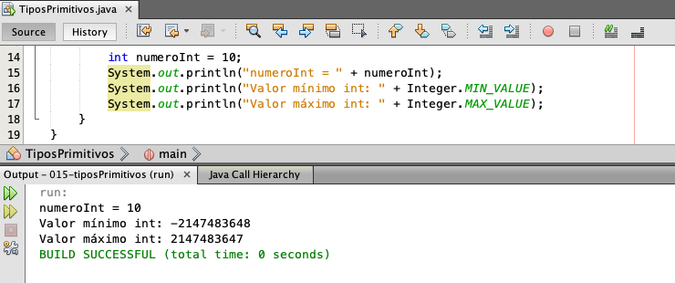

# 003 Tipos Primitivos en Java • 9 clases • 1 h 14 min

## [Resumen Profesor](/temarios/301_Fundamentos_de_Java/pdfs/01-VariablesJava.pdf)

* 014 Tipos Primitivos en Java - 06:51
* 015 Tipos Numéricos Enteros - 09:06
* 016 Ejercicio: Tipos Primitivos tipos Flotantes - 08:11
* 017 Ejercicio: Inferencia de Tipos con Var y tipos Primitivos - 07:55
* 018 Ejercicio: Tipos Primitivos tipo char - 11:34
* 019 Ejercicio: Tipos Primitivos tipo boolean - 07:42
* 020 Ejercicio: Conversión de Tipos Primitivos en Java - parte 1 - 11:58
* 021 Ejercicio: Conversión de Tipos Primitivos en Java - parte 2 - 10:38
* Cuestionario 2: Preguntas de Números - 6 preguntas
* Tarea 3: Tienda de Libros - 1 preguntas
* 022 Tienda de Libros (Solución) - 00:11

# 014 Tipos Primitivos en Java - 06:51

Hola, bienvenidos a esta lección.

A continuación vamos a estudiar los tipos primitivos de tipo entero en Java están listos? Vamos.

#### Comentarios

Podemos poner un comentario, como hemos visto, de una sola línea utilizarnos `//` un comentario de una sola línea, pero si queremos poner un comentario que abarque varias líneas, ponemos `/* ...*/`.



En Java, los tipos primitivos se clasifican de la siguiente manera podemos tener tipos primitivos que almacenan solamente enteros o tipos primitivos que almacenan tipos flotantes.  

Así que en esta primera lección vamos a ver los tipos primitivos que solamente almacenan tipos enteros sin punto flotante.

### Tipos Enteros

Los tipos primitivos de tipo entero que podemos manejar son los siguientes:

* `byte`
* `short`
* `int`
* `long`

Básicamente el tipo `byte` es el tipo más pequeño, sin embargo, no porque utilicemos el tipo más pequeño significa que vamos a ahorrar espacio, ya que recordemos que lo sepais al día de hoy utilizan arquitecturas de 32 o 64 bits.

En este caso, el `byte` utiliza 8 bits, el tipo `short` 16 bits, el tipo `int` 32 bits y el tipo `long` 64 bits. Por lo tanto, el tipo más común que vamos a utilizar cuando programamos en Java es el tipo entero `int`, debido a que los CPU son de 32 o de 64 bits, así que por lo tanto, si queremos ahorrar la mayor cantidad de espacio, normalmente utilizamos tipos enteros.

**El tipo `byte` sí puede ser utilizado sin embargo, esto no garantiza que utilicemos solamente 8 bits, ya que posiblemente estos 8 bits se van a almacenar en los 32 bits que componen una palabra de una arquitectura de 32 bits**. Eso es un detalle algo más técnico, pero es importante que lo sepan, ya que, como hemos comentado, el tipo más común que vamos a utilizar si queremos ahorrar la mayor cantidad de espacio es el tipo entero `int`. De ahí en adelante podemos utilizar, por ejemplo, el `long` y posteriormente vamos a ver otros tipos, el tipo flotante, que también puede almacenar más información.

Bien, vamos a ver cómo definir estos tipos.

Por ejemplo, para definir un tipo `byte` utilizamos la palabra reservada `byte`:


```java
byte numeroByte = 10;
```

Aunque esta literal es de tipo entero, podemos asignar este valor 10 al tipo `byte` sin ningún problema ya que el tipo `byte` tiene un rango y este rango lo podemos visualizar en la imagen.


o también tenemos el siguiente código que podemos utilizar para saber el valor mínimo y el valor máximo que puede almacenar un tipo `byte`, así que podemos utilizar el siguiente código.

```java
byte numeroByte = 10;
System.out.println("Valor mínimo byte: " + Byte.MIN_VALUE);
System.out.println("Valor máximo byte: " + Byte.MAX_VALUE);
```



`Byte.MIN_VALUE` nos permite recuperar el valor mínimo de un tipo `byte` y  `Byte.MAX_VALUE` nos permite recuperar el valor máximo de un tipo `byte`.

Los tipos enteros no solamente almacenan valores positivos, sino que también pueden almacenar valores negativos. Así que en este caso el rango de números que puede dar un tipo `byte` va desde el valor -128 hasta el valor 127.

Por lo tanto, es que podemos asignar el valor 10 a este tipo `byte` sin ningún problema, pero por ejemplo, si queremos asignar el valor 129.

```java
byte numeroByte = 129;
```

El cual ya se pasó del rango que puede aceptar el tipo `byte` podemos observar que nos manda un error y el error que nos manda es `incompatible types: possible lossy conversion from int to byte`, debido a que ese valor entero ya superó el valor máximo que puede almacenar un `byte`.

Sin embargo, aún así todavía es posible asignar este valor 129 a un tipo `byte` esto se conoce como conversión de tipos. Podemos observar que 129 sigue siendo una literal de tipo entero. Por default así lo maneja Java y para convertirlo a un tipo `byte`, lo que tenemos que hacer es anteponer entre paréntesis el tipo al cual queremos convertir.

```java
byte numeroByte = (byte)129;
```

Así que esta literal 129 que es de tipo entero con esto, con esta sintaxis, lo que estamos haciendo es convertirlo a un tipo `byte` y lo que le estamos diciendo al compilador es que estamos obligando a convertir este valor numérico de tipo entero a un tipo `byte`. Y como podemos observar con esto, ya no nos marca ningún error de compilación. Sin embargo, si mandamos a imprimir este número. Vamos a visualizar el valor de nuestra variable `byte`.


**Podemos observar que no está almacenando el valor de 129, como habíamos indicado, aquí estamos almacenando el valor de 129 y el valor que se está imprimiendo es el valor de -127, así que por ello es que el compilador nos mandó un aviso de que nosotros debemos de estar seguros lo que estamos haciendo, ya que si queremos almacenar un valor que supera el rango que soporta este tipo, entonces podemos tener este tipo de imprecisiones, así que por ello es importante saber el valor máximo que puede soportar un tipo `byte`**.

### :computer: `014-TiposPrimitivos` 

```java
public class TiposPrimitivos {
   public static void main(String args[]){
        
      /*
         Tipos primitivos enteros: byte, short, int, long
      */
        
      byte numeroByte = (byte)129;
      System.out.println("numeroByte = " + numeroByte);        
      System.out.println("Valor mínimo byte: " + Byte.MIN_VALUE);
      System.out.println("Valor máximo byte: " + Byte.MAX_VALUE);
   }
}
```


En la siguiente lección vamos a empezar a analizar los demás tipos, así que nos vemos en la siguiente lección. 

Saludos!

# 015 Tipos Numéricos Enteros - 09:06

Bien, vamos a continuar con esta lección. Ahora el siguiente tipo que podemos utilizar es el tipo `short`, este tipo puede almacenar hasta 16 bits. Vamos a hacer lo siguiente:

```java
short numeroShort = 10;
System.out.println("numeroShort = " + numeroShort);        
System.out.println("Valor mínimo short: " + Short.MIN_VALUE);
System.out.println("Valor máximo short: " + Short.MAX_VALUE);
```



Podemos observar el valor mínimo es -32768 y el valor máximo 32767. De igual forma que con `byte` si asignamos un valor fuera de rango para `short` nos mandara el mismo error `incompatible types: possible lossy conversion from int to short`.

```java
short numeroShort = 32768;
```

De igual manera podemos obligar al compilador a que haga esta conversión, pero con el riesgo de la pérdida de precisión, así que podemos indicar que queremos aún así convertirlo a un tipo `short`. Pero si mandamos a imprimir esto, vamos a ver el resultado.

```java
short numeroShort = (short)32768;
System.out.println("numeroByte = " + numeroShort);
```


Aunque `numeroShort` le estamos asignando un valor positivo, podemos observar que se imprime un valor negativo y esto es debido a la pérdida de bits al momento de hacer la conversión. Así que son simples detalles. Normalmente eso no va a ser un problema en la vida real.

Sin embargo, son detalles que deben de tener en cuenta al seleccionar el tipo primitivo que van a utilizar.

Por lo tanto, lo más recomendable, como les hemos comentado, es utilizar el tipo primitivo `int`. Vamos a crear una variable de este tipo e imprimir sus valores mínimos y máximos.

```java
int numeroInt = 10;
System.out.println("numeroInt = " + numeroInt);        
System.out.println("Valor mínimo int: " + Integer.MIN_VALUE);
System.out.println("Valor máximo int: " + Integer.MAX_VALUE);
```




Podemos observar el valor mínimo es -2147483648 y el máximo 2147483647.

Así que vamos a tomar el valor máximo más 1 y se lo vamos a asignar a `numeroInt`.

```java
int numeroInt = 2147483648;        
```


De igual manera vamos a hacer la prueba, le asignamos este valor máximo.

Hasta allí no hay ningún problema, pero vamos a superarlo, entonces por uno sumamos uno y nos manda

el siguiente mensaje.

El valor interior que estamos tratando de utilizar es un valor muy grande.

Sin embargo, este caso es un caso especial, ya que incluso aunque pongamos.

La conversión de entero esto no resuelve el problema.

Podemos observar que nos siguen mandando el problema de que el valor numérico es muy grande y si recordamos

esta literal es una literal de tipo entero por default.

Sin embargo, las literales enteras son de tipo.

Por lo tanto, estamos superando el valor máximo para una literal de tipo entero.

Por ello el error es diferente, incluso aunque tratemos de hacer la asignación a nuestra variable de

tipo entero.

Aquí el problema es que la literal también ya se pasó de valor.

Y para resolver esto tenemos que ver ahora el tipo log y para manejar literales de tipo log lo que vamos

a hacer es utilizar una L al final de nuestra literal.

Puede ser una l minúscula o una L mayúscula, pero si observamos si ponemos una l minúscula, parece

que es el valor de 1.

Por lo tanto, se le recomienda utilizar una L mayúscula para no confundir el 1 con una L y L lo que

significa es que es una literal de tipo log.

Por lo tanto, esta literal entera, al ser ya superior a un tipo entero, al poner una L, se está

convirtiendo a un tipo superior de 32bits que puede ocupar el tipo entero a 64bits que puede ocupar

el tipo long.

Así que con eso se corrige ese problema, ya que la literal ya es de tipo longe.

Y una vez que corregimos el problema de la literal.

Entonces si quitamos esta conversión.

Podemos observar que el error cambia, ya no es el error de superar el tipo entero de la literal, sino

que ahora volvemos a tener el problema de la conversión de tipo, ya que estamos tratando de convertir

un tipo nog a un tipo hint.

Y para corregir esto podemos utilizar un valor inferior o podemos indicar el compilador que de cualquier

manera haga la conversión tal como lo hemos visto anteriormente, y con esto se corrige el problema.

Sin embargo, si volvemos a imprimir nuestro resultado.

Podemos observar que asignamos un valor positivo y lo que se está imprimiendo es un valor negativo.

Esto es debido a la pérdida de precisión cuando estamos convirtiendo los tipos de log a entero.

Así que también debemos tener en cuenta estos detalles.

Y por último, vamos a ver el tipo.

Definimos una variable de tipo no le asignamos cualquier valor.

Imprimimos esta variable.

Vamos a imprimir los números mínimo y máximo.

El valor mínimo del honor y el valor máximo.

En este caso, la clase que vamos a utilizar para poder acceder a esta información va a ser la clase

de longe.

Bien guardamos cambios, vamos a ejecutar y derecho Rombai.

Y Podemos, que ya es un número muchísimo más grande el que soporta el tipo.

Por lo tanto, en muchas ocasiones no es necesario almacenar un número tan grande.

Por ello es que lo recomendable es utilizar el tipo INT cuando seleccionemos un tipo primitivo, ya

que el tipo es un número mucho más grande.

Bien vamos a seguir haciendo la prueba, vamos a tomar el número máximo.

Y en este caso sigue siendo el mismo problema de la literal, que ya hemos superado el tipo entero de

la literal para convertirlo a una literal de tipo.

Tenemos que poner una L al final.

Con eso se corrige el problema de la literal, pero ahora si incrementamos en 1 este valor.

Entonces ya tenemos el problema de que hemos superado el valor que soporta una literal de tipo entero.

No importa que sea una literal de tipo long en sí, ya superamos cualquier valor que soportan los tipos

enteros y para ello tenemos que empezar con el tema de los tipos flotantes, que pueden ser un tipo

float o un tipo doble.

Sin embargo, como ya nos pasamos del valor que soporta el tipo, entonces tenemos que hacer la conversión.

De manera explícita podemos ver que ya funciona de nueva cuenta nuestro código.

Si ponemos una L, hemos superado el valor de la literal que soporta el tipo nog, así que tendríamos

que utilizar un tipo flotante o un tipo doble.

Pero esto lo vamos a ver a detalle en la siguiente elección.

De momento es importante que reconozcan los tipos primitivos de tipo entero.

Vamos a modificar nuestro código para que solamente tengan el valor máximo.

Y no tengan problemas de compilación.

Así que asignamos una L para que esta literal de tipo entero pueda ser soportada y se convierte a un

tipo lonko.

Así que revisen hasta aquí cualquier duda pueden agregarla en la sección de preguntas y respuestas donde

les responderemos a la brevedad posible.

Todo por esta elección y nos vemos en el siguiente video.

Saludos!


# 016 Ejercicio: Tipos Primitivos tipos Flotantes - 08:11
# 017 Ejercicio: Inferencia de Tipos con Var y tipos Primitivos - 07:55
# 018 Ejercicio: Tipos Primitivos tipo char - 11:34
# 019 Ejercicio: Tipos Primitivos tipo boolean - 07:42
# 020 Ejercicio: Conversión de Tipos Primitivos en Java - parte 1 - 11:58
# 021 Ejercicio: Conversión de Tipos Primitivos en Java - parte 2 - 10:38
# Cuestionario 2: Preguntas de Números - 6 preguntas
# Tarea 3: Tienda de Libros - 1 preguntas
# 022 Tienda de Libros (Solución) - 00:11
